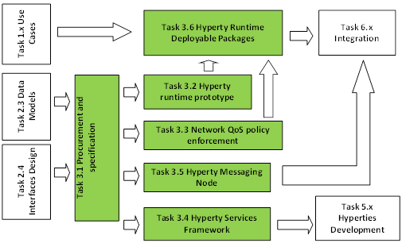

# core-framework
The main goal of WP3 is to provide the reTHINK core framework comprised by the runtime environment where Hyperties are executed and the messaging nodes used to support messages exchange between Hyperties. 

An existing open source Web engine will be selected to use as a base for the Hyperty Runtime, and special attention will be given to the WebRTC media engine extension as well as to the security components needed to implement Governance User Agents. A Hyperty JavaScript framework will be developed on top of the Hyperty Runtime to facilitate the development of new Hyperties in WP5. The Hyperty Runtime will be ported into different devices such as smartphones, M2M/IoT devices or gateways, TV sets and STBs according to the use cases defined in WP1. WP3 also aims to provide different Messaging Nodes to be used in the different trial domains in WP6.

### Task 3.1 Procurement and Specifications (April 2015 - September 2016)

**Partners: ORANGE (3), PTIN (lead)(4), Fraunhofer(2), Apizee(4), INESC(3), QUOBIS(4)**

This task will study relevant W3C standards and others that may facilitate the fulfilment of requirements derived from Task 2.1. At the same time, existing open source components to be used to develop Hyperty Runtime and Messaging Nodes will be researched, experimented and selected. open source projects candidates are Chromium or Mozilla for Web runtime while node.js and vertx.io are very suitable for Messaging Node solutions. The adoption of more than one Messaging Node implementation is encouraged in order to evaluate interoperability between different Hyperties domains that use different Message Nodes in WP6. Once the open source solutions have been selected, the Hyperty Runtime and Messaging Node models will be specified in detail.

### Task 3.2 Hyperty Runtime Prototype (June 2015 - December 2016)

**Partners: ORANGE(3), DTAG(3), PTIN (lead)(4), Fraunhofer(5), INESC(4)**

This task will adapt and expand the WebRTC Media Engine selected in Task 3.1 and all other components needed. In particular the Web runtime engine should be expanded to natively support protocol and codec on-the-fly concepts experimented in WONDER project, and Identity management functionalities. The extension of HTML 5 Web Messaging API improved with better security mechanisms and the extension of HTML5 Application lifecyle management in order to support remote Hyperty Lifecycle management will also be investigated.

### Task 3.3 Network QoS Policy Enforcement (April 2015 - December 2016)

**Partners: ORANGE (lead)(9), Fraunhofer(4)**

This task will demonstrate and benchmark the “in-network” and “over-the-network” approaches enabling web real-time communications QoS (as introduced in section 1.3.1.3) and will implement software components if necessary to experiment them. The “Hyperty” model could be applied to take all advantages of API based control and dynamic enforcement of QoS policies.

### Task 3.4 Hyperty Services Framework (June 2015 - December 2016 )

**Partners: DTAG(3), PTIN(5), Fraunhofer(5)(lead), Apizee(6), QUOBIS(5)**

This task will develop the Java Script framework libraries that will facilitate the development of Hyperties. This framework will complement Hyperty Runtime features to be provided in Task 3.2 and Task 3.3.  The Framework should be as much as possible modular since different functionalities may be needed according to the Hyperty type (eg RTC UAs, Content Player/ producer, IoT Sensor/actuator GW, Connectors, etc).

### Task 3.5 Hyperty Messaging Node (June - 2015 - December 2016)

**Partners: DTAG(4), PTIN (lead)(5), Fraunhofer(2), Apizee(6), INESC(6), QUOBIS(5)**

The Messaging Node provides all message oriented communication functionalities needed by the Hyperties and it will be based on Web Real Time Messaging technologies that will be extended to feature some carrier grade characteristics such as resilience, security and service assurance management. Selecting the optimum messaging nodes according to the connectivity network topology and the ability to handle dynamic messaging address allocation to “foreign” Hyperty instances (an Hyperty instance that does not belong to the Messaging Node domain) are two examples of challenges to be addressed. Different Messaging nodes will be implemented to be used in different WP6 domains.

### Task 3.6 Hyperty Runtime Deployable Packages (August 2015 - December 2016)

**Partners: DTAG(2), PTIN(2), Apizee(2), QUOBIS(5) (lead)**

This task will integrate and test components provided in Task 3.2 and 3.3 in deployment packages targeting different Devices. This task will also select the devices to be covered according to the Use Cases selected in Task 1.1 to be validated in Task 6.1. Examples: PCs/Laptops (Windows, Linux?), Smartphones (Android, iOS?), open source IoT/M2M Gateways (Arduino/Raspberry PI linux distributions), SmartTV/Dongle/STB (,,,). 
