Introduction
============

testing auto caption and references to figures 

Objectives
----------

Innovation
----------

As can be seen in Figure @fig-browser

Structure
---------

Requirements
============

Runtime Requirements
--------------------

Messaging Node Requirements
---------------------------

Network QoS Policy Enforcement Requirements
-------------------------------------------

Service Framework Requirements
------------------------------

State of the Art
================

Security in Runtime
-------------------

In this document, we present an overview about the security in runtime
component of the project. In first place, we will define the security
goals we want to achieve. Then, possible attacks against those goals are
explained. Finally, we present the state of the art on how current
systems solve the referred problems, splitting the security runtimes in
two distinct areas:

-   Web Browsers
-   Secure elements

In the Web Browsers section, we will present security mechanisms for
JavaScript code protection in fully-featured environments (the web
browsers themselves), while in the Secure Elements section, the state of
the art on code security runtimes for systems featuring less
functionality and computation capabilities but requiring tighter
security requirements during its operation.

**Security goals:** The following points consist in specific security
goals that the hyperty instances must achieve.

G1 - to protect the confidentiality and integrity of the state of
hyperty instances. G2 - to protect the integrity of the code of hyperty
instances. G3 - to enforce the security policies attached to hyperty
code.

**Possible attack vectors:** Multiple attack types can be performed
against the hyperty instances, at multiple levels (software, OS,
hardware). We now present and detail the most well-known attack vectors
occuring at each level.

*Malicious hyperty code:* E.g., by exploiting a bug in the hyperty
runtime (HR), a malicious hyperty manages to escape from its sandboxed
environment and escalates its privileges to gain access to a victim
hyperty instance. The attacker can then read or modify sensitive data
(break G1), modify the code (break G2), or modify the security policy
(break G3) of the victim.

*Compromised browser:* E.g., the local user logs in to the computer, and
attaches a debugger to the browser’s process. This gives the user full
access to the browser’s state, including the HR’s. Therefore all G1, G2,
and G3 can be violated. A similar attack can be performed by malware
that subverts the browser’s security mechanisms and allows for an
attacker to control the HR.

*Compromised operating system:* E.g., a kernel rootkit subverts the
kernel, and gains access to the entire memory state of the browser
process in which the victim hyperty instance is running. Just like in
the previous cases, all G1, G2, G3 can be violated. Jail-breaking the
kernel can bring similar consequences.

*Compromised hardware:* E.g., an attacker manages to gain physical
access to the host computer and has the capability to extract secrets
directly from the RAM memory or by probing the system bus. This attack
can violate the security goals G1, G2, and G3.

### Web Browsers

#### Monolithic vs Modular Architectures:

Traditionally, commercial and open-source web browsers employed a
monolithic architecture. This means that both user’s and web
application’s data are combined into a single security domain, which
brings serious performance/usability and security issues. On the
performance/usability side, if a web application crashes during its
execution, the whole web browser can be affected, harming the user
experience. On the security side, if an attacker exploits an unpatched
vulnerability in the browser while a user is using it, he may gain
access to the whole user space, being able to execute code on behalf of
that user and access its private sensitive information, like
credentials.

Nowadays, web browsers evolved into modular architectures, in order to
achieve privilege separation and overcome monolithic architectures’
flaws. This way, browser developers came up with multiple different
architectures to achieve this separation between what is user’s property
(credentials, preferences) and what is “web’s” property (applications’
code). Multiple techniques were employed in these architectures to
achieve this separation:

-   **Sandboxing:** In computer security, a sandbox is a security
    mechanism which allows untrusted programs to run within a trusted
    environment, without affecting its trustiness. This is usually done
    by restricting the resources (disk, memory, network) the untrusted
    software can access. An example is creating scratch memory and disk
    spaces where it can read/write and limiting the network capabilities
    it can use, in order to prevent the host environment from getting
    damaged. This is what Chromium browser [1] applies to separate the
    user and the web side in a modular architecture. It features two
    modules:

-   A **browser kernel module** which acts on behalf of the user and is
    responsible for implementing the tab-based windowing system of the
    browser, storing user’s data as its preferences, bookmarks,
    credentials and cookies and also working as a middleware between the
    native operating system window manager and every instance of the
    second browser module, the rendering engine.
-   The **rendering engine** provides the web application behaviour. It
    interprets and executes web content, serving calls to the DOM API.
    It is the unique browser part in contact with the untrsuted web
    content. Apart from that, it is also responsible for enforcing the
    same-origin policy between the user and a website he’s visiting.

Fig. @sota-security-chrome-extension

#### Browser Extensions Security:

Browser extensions provide useful additional functionality to web
browsers, such as facilitating the access to a website’s content or even
as almost standalone applications running on the browser environment.
However, these extensions often introduce serious security issues into
both user’s browser and websites, because most of the times they’re
written by well-meaning developers who are not security experts.
Extensions can read and alter users’ bookmarks and preferences,
websites’ content and perform requests over the network, many times on
behalf of the browser user. Browser extensions are mostly written in
JavaScript and HTML, and since JavaScript provides methods for
converting a string to code (e.g. eval), an extension may be dangerous
if misused. Typically, benign extensions face two types of attackers:

-   **Network attackers:** Targeting end-users who connect to insecure
    networks (public Wi-Fi hotspots), these attacks consist in reading
    and altering HTTP traffic, in order to detect if an extension adds
    an HTTP Script - JavaScript file loaded over HTTP - to itself, and
    altering the code in such case.
-   **Web attackers:** A malicious website can launch a XSS attack on an
    extension if the extension treats the website as trusted, possibly
    stealing the browser’s userdata, like credentials. This way, it can
    scale up to attack multiple websites within the same entry point.

According to [2], Google Chrome and its extension platform apply three
mechanisms to prevent these vulnerabilities: \* **Privilege
Separation:** Every Chrome extension has two types of components which
run in separate processes: zero or more content scripts and zero or one
core extension. Content scripts read and modify websites as needed. The
core extension implements functionality not directly involving websites,
like browser UI jobs or long-running background tasks. These two types
of components communicate by sending structured clones over a trused
channel. Each website that an extension communicates with, receives its
own isolated instance of a content script, making content scripts highly
bound to attacks. However, only the core extension is able to
communicate with the Chrome extension’s API, reducing the risk that a
content script is able to access the user data space. The architecture
scheme of a Google Chrome extension is on Fig. 2. \* **Isolated Words:**
This mechanism ensures that content scripts and websites have separate
JavaScript heaps and DOM objects. Consequently, content scripts never
exchange pointers with websites, protecting them against web
attackers. \* **Permissions:** Extension developers have to specify the
desired permissions in kind of a manifest file that is packaged with the
extension. For example, the bookmarks permission is needed for the
extension to be able to read and alter the user’s bookmarks. Only core
extension can use permissions to invoke browser API methods, while
content scripts are limited to interacting with the core extension and
the website it is running on. This way, an extension is limited to the
permissions its developer requested, so an attacker is not able to
request new permissions for a compromised extension in runtime.

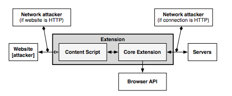

Fig. @sota-security-chrome-extension

#### XSS Detection Techniques:

Cross-Site Scripting attacks are getting more common on the web, since
they allow an attacker to get control of a user’s browser and execute
malicious code (usually JavaScript/HTML) within the trusted context of a
web application. This can result in the attacker being able to access
any sensitive information associated to the application (cookies,
session IDs, etc.). The study of XSS attacks can be split into two
distinct categories, according to [3]:

-   **Persistent/Stored attacks:** Occurs when a malicious user
    registers itself into a web application and posts a malicious
    JavaScript to the application, which, by its turn, save it into the
    application’s data repository, persistently. After that, if another
    user fetches the content uploaded by the malicious one onto his
    browser, and since this code is coming out of the trusted context of
    the web application, the user’s browser will allow the script to
    access any possibly sensitive resource it is willing to, overcoming
    this way the security imposed by the same-origin policy. Apart from
    stealing the user’s information, XSS attacks can also be used to
    redirect users to a malicious website which can then perform other
    distinct attacks within its context. A persistent XSS attack scheme
    is presented on Fig. 3.

Fig. @sota-security-xss-persistent

-   **Non-persistent/Reflected attacks:** Unlike the first type,
    reflected attacks do not persistently store malicious code in the
    web application data space. Instead of that, the content is
    automatically reflected back to the user through a third-party
    mechanism. For example, by using a spoofed email, an attacker can
    make a user click on a link containing malicious code, which will
    finally be interpreted by the user’s browser, but within the trusted
    context fo the web application. This type of XSS attacks is often
    combined with other techniques as phishing, and is the most common
    type of XSS attacks in web applications. Figure 4 shows a scheme of
    the architecture of a non-persistent XSS attack.

Fig. @sota-security-xss-nonpersistent

#### XSS (and other types) prevention techniques:

-   **Analysis and Filtering of the Exchanged Information:**

This technique consists in defining a list of characters or tags which
users are allowed to exchange with the web application, in the form of
text inputs, uploaded files, etc. Then, a filtering process simply
rejects everything that is not part of the list. Other approach,
reported in [4], is having a proxy-server at the web application’s site
in order to filter both incoming and outcoming requests. This filtering
takes into account a set of rules defined by the application developers.
Although, a simple use of regular expressions is able to evade both the
referred methods and proxy-servers can rapidly become a performance
bottleneck on the application deployment. Authors of [5] also suggested
placing a proxy-server on the server-side of the application, but in
order to differentiate trusted and untrusted traffic, driving each type
to separate channels. This partitioning process uses Information Flow
Control techniques to taint information and track it thenceforward. On
other point of view, approaches seen in [6,7] propose the content
filtering to happen at the client-side. On the one hand, authors of [6]
try to achieve the prevention of XSS attacks by blacklisting links
embedded within the web application’s pages, making them unavailable for
the client. However, the authors say this approach can only detect basic
XSS attacks based on the violation of same-origin policy. On the other
hand, authors of [7] present another client-proxy solution that is
intended to detect malicious requests reflected from the attacker to the
victim (non-persistent XSS attacks). If such a request is detected, the
malicious characters are re-encoded by the proxy, trying to avoid the
success of the attack.

-   **Security Enforcement on the Web Browser Runtime:**

There are also other strategies which try to avoid the need for
intermediate elements like proxy-servers by proposing startegies to
enforce the runtime context of the web browser. In [8], authors propose
an auditing system for the JavaScript interpreter of the Mozilla Firefox
browser, which detects misuses on JS operations and take
counter-measures to avoid violations on browser’s security. Other
approach is also followed by [9], which presents the use of dynamic
taint tracking on JavaScript code, in order to detect whether browser’s
sensitive resources are going to be transferred to an untrusted
third-party. In such case, the user is warned and can decide whether he
allows or denies the transfer. Finally, the approach followed by [10]
propose a policy-based management where a list of actions is embedded
into the documents exchanged between the browser and the server. These
actions help the browser to decide whether or not a script should be
executed. Although, a lack of semantics in the policy-language and the
restrictiveness of the approach due to the sandboxing-like mechanism are
some of the drawbacks.

### Secure Elements

#### Java Card: Internet Computing on a Smart Card

In secure computing, a smart card is a typical card with a built-in
computer chip. Until a few years ago, it was only used to produce credit
and debit cards, whose information can only be accessed when in
possession of the card itself and a PIN code. Due to the short
information on how to communicate and program them, until a few years
ago this useful technology wasn’t being used on computer security in
general.

-   **Hardware:**

This single-chip computer is an off-the-shelf **8-bit microcontroller**
with added tamper-safe features. While most 8-bit microcontrollers can
support at least **64 KBytes** of 8-bit memory, popular smart cards
contain 4 to 20 Kbytes of memory, due to size constraints. The memory
space of a smart card is divided into RAM, EEPROM and ROM. RAM is used
to store temporary values when a program is running, while EEPROM is
used to store sensitive data as an encryption key or the account holder
info on credit cards. Finally, ROM is used to store the basic programs
that run on the smart card. The single-chip computer is embedded in a
plastic chip carrier, and both of them hold several tamper-resistant and
tamper-detection features.

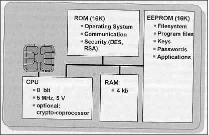

Fig. @sota-security-java-smart-card

-   **Software**

The paucity of 8-bit assembly language courses, books and software tools
led engineers to break the smart card application bottleneck by building
a Java virtual machine with its runtime support into a 12-Kbyte smart
card. **Java** was the obvious answer for three reasons: \* Java brings
smart card programming into the mainstream of software development \*
Java “safe programming” security model based on a runtime interpreter is
a nontrivial side benefit, due to its processor independence. A Java
card can be deployed on multiple smart card models. \* Java interpreters
were tested to the limit, holes had been found, and fixed

With this in mind, engineers concluded that Java could preserve the
required security in the smart card operation, while allowed a more
friendly and well-known programming approach. However, available memory
was an issue when deploying such heavy language runtime like Java.
Features like garbage collection and exceptions handling were not
included in Java Card because of that.

-   **Internet Computing with Java Smart Card**

Java Cards combine smart card’s identity-verification features with the
Java “sandbox”, guaranteeing that only allowed applications run on the
card and that applications are protected from each other.

#### Cloud of Secure Elements

Cloud of Secure Elements (CoSE) [12] is an emerging concept whose goal
is to provide trusted computing resources to mobile and cloud
applications. To reach that, it relies on an infrastructure composed by
multiple secure microcontrollers, named Secure Elements.

CoSE, in a WEB-like paradigm, are meant to support Uniform Resource
Identifiers (URIs) for users to locate the different secure elements and
use their embedded resources. These resources usually target two service
types: Near Field Communication (NFC) facilities for mobile applications
and trusted cryptogrtaphic features for cloud applications.

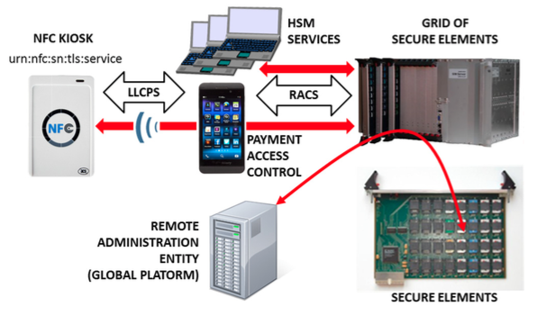

Fig. @sota-security-cose

-   **Architecture**

A Cloud of Secure Elements has the following components, as Fig. 6
shows:

-   NFC kiosks, typically deliver payment facilities
-   Users with NFC-enabled devices or terminals needing trusted
    cryptographic resources
-   Grid of Secure Elements (GoSE)
-   Secure elements, with resources identifiable by URI
-   Remote administration entities, performing management operations
    over applications and secure elements

-   **Grid of Secure Elements (GoSE)**

A grid of secure elements is an Internet server hosting multiple secure
elements. Each element may be plugged in through USB readers, hardware
sockets or electronic boards. Communication may be achieved with RACS
protocol (works over IP/TCP/TLS stack) and performs both the association
between elements and unique identifiers and data exchange with secure
elements.

**Malicious Code on Java Cards: Attacks and Countermeasures**
=============================================================

Despite all the advantages on using Java language in smart cards, such
as the absence of low-level memory vulnerabilities, Java Cards still
have an open door for attacks through malicious code. This attack entry
is possible because an on-card bytecode verifier (BCV) is optional on
Java Cards, and those who don't feature it, are more open to malicious
code that might damage other applets running on the system or even the
platform itself.

### **Defenses against malicious code**

Here we present the different mechanisms for protection against
malicious code actions present in Java Cards.

#### **Bytecode verification**

Bytecode verification of Java code guarantees type safety, and thus,
memory safety. On normal Java platform, bytecode verification occurs at
load time. Although, since Java Cards do not support dynamic class
loading, this verification must occur at the time an applet is installed
to the card. However, most Java Cards do not feature an on-card BCV and
rely on a digital signature of a third party who is trusted to have
performed bytecode verification off-card.

#### **Applet firewall**

The applet firewall is an additional defense mechanism present in Java
Cards. The firewall performs runtime checks to prevent applets from
accessing and/or altering data of other applets (concretely, in a
different security context). For every object within an applet, the
firewall records its context, and for any field or method accessed this
context is checked. Only the Java Card Runtime Environment (JCRE) has
unlimited permission, since it executes in root-mode, on a UNIX
terminology.

### **Getting malicious code on cards**

#### **CAP file manipulation**

This is the easiest way of introducing ill-typed code on a Java Card.
This can be achieved by editing a CAP (Converted APplet) file to
introduce a type flaw in the bytecode and install it to the card.
Although, this will only work for cards without an on-card BCV and with
unsigned CAP files. In example, by changing a `baload` (byte load)
opcode onto a `saload` (short load) one, will make the platform treat a
byte array as a short array, and can potentially lead to accessing other
applet's memory space.

#### **Abusing Shareable Interface Objects**

The shareable mechanism of Java Card can be used to create type
confusion between applets without any direct editing on CAP files.
Shareable interfaces allow direct communication between security
contexts. Using this to create type confusion is pretty simple: Let two
applets communicate through a shareable interface, but compile and
generate CAP files for both applets using different definitions of the
shareable interface, which is possible because the applets are compiled
and loaded separately. This way we can achieve an attack like the CAP
file manipulation but without ever touching the CAP file directly.

#### **Abusing the transaction mechanism**

The Java Card transaction mechanism is probably the tricliest aspect of
the Java Card platform. It allows multiple byte-code instructions to be
turned into an atomic operation, offering a roll-back mechanism in case
the operation is aborted, either through card tear or calling an API
method. Buggy implementations of the transaction mechanism in some cards
tend to make it not behave as expected. When object references are
spread around the code, by assignments to instance fields and local
variables, it becomes difficult for the mechanism to keep track of all
the references that should be nulled out. The root cause of the problem
is that stack-allocated variables, such as `short[] localArray` are not
subject to roll-back in the event of a programatically transaction abort
(through API method call).

### **Dynamic countermeasures**

Now we present some dynamic runtime checks implemented by some VMs in
order to prevent ill-typed code to damage the Java Card platform. These
were verified by [13], by performing tests on multiple Java Card models
of multiple manufacturers against the referred vulnerabilities.

-   Runtime type checking
-   Object (array) bounds checking
-   Physical (byte size) bounds checking
-   Firewall checks
-   Integrity checks in memory

**Automated Analysis of Security-Critical JavaScript APIs**
-----------------------------------------------------------

Current web applications usually rely on JavaScript in order to offer
additional features like maps, widgets or social media content.
Although, since these additions may manipulate a page Document Object
Model (DOM), steal cookies or navigate on the page, untrusted
third-party JavaScript may pose security threats to the hosting page.

A widely-used approach is to combine a language-based sandbox to
restrict the capabilities of untrusted JavaScript with an API offered by
the trusted code part to the untrusted one. This API encapsulates all
security-critical resources and guarantees they are only accessed in a
safe way.

Given this, the authors of [14] proposed ENCAP, a tool that verifies API
confinement, analyzing the isolation level it can offer to the critical
objects it is intended to protect. ENCAP relies on a context-insensitive
and flow-insensitive static analysis method. It analyses the API
implementation and generates a conservative Datalog model of all API
methods. Also, they propose SESlight, an ECMA JavaScript-subset language
which only allows a strict (syntactically and semantically verified)
subset of the whole language to be used.

Bibliography
------------

[1] - [Barth, A.; Jackson, C.; Reis, C. and Team, Google Chrome. 2008.
The Security Architecture of the Chromium
Browser.](http://seclab.stanford.edu/websec/chromium/chromium-security-architecture.pdf)

[2] - [Nicholas Carlini, Adrienne Porter Felt, and David Wagner. 2012.
An evaluation of the Google Chrome extension security architecture. In
Proceedings of the 21st USENIX conference on Security symposium
(Security'12). USENIX Association, Berkeley, CA,
USA.](http://nicholas.carlini.com/papers/2012_usenix_chromeextensions.pdf)

[3] - [Garcia-Alfaro, J. and Navarro-Arribas, G. 2007. A Survey on
Detection Techniques to Prevent Cross-Site Scripting Attacks on Current
Web Applications., in Javier Lopez & Bernhard M. Hämmerli, ed., 'CRITIS'
, Springer, , pp. 287-298
.](http://eprints.uoc.edu/research/bitstream/10363/605/1/JGA01.pdf)

[4] - [Scott, D. and Sharp, R. Abstracting application-level web
security. 11th Internation Conference on the World Wide Web, pp.
396–407, 2002.](http://rich.recoil.org/publications/websec.pdf)

[5] - [Pietraszeck, T. and Vanden-Berghe, C. Defending against injection
attacks through context-sensitive string evaluation. Recent Advances in
Intrusion Detection (RAID 2005), pp.124– 145,
2005.](http://tadek.pietraszek.org/publications/pietraszek05_defending.pdf)

[6] - [Kirda, E., Kruegel, C., Vigna, G., and Jovanovic, N. Noxes: A
client-side solution for mitigating cross-site scripting attacks. 21st
ACM Symposium on Applied Computing,
2006.](https://iseclab.org/papers/noxes.pdf)

[7] - [Ismail, O., Etoh, M., Kadobayashi, Y., and Yamaguchi, S. A
Proposal and Implementation of Automatic Detection/Collection System for
Cross-Site Scripting Vulnerability. 18th Int. Conf. on Advanced
Information Networking and Applications (AINA 2004),
2004.](http://ieeexplore.ieee.org/xpl/freeabs_all.jsp?arnumber=1283902&abstractAccess=no&userType=instima)

[8] - [Hallaraker, O. and Vigna, G. Detecting Malicious JavaScript Code
in Mozilla. 10th IEEE International Conference on Engineering of Complex
Computer Systems (ICECCS’05), pp.85–94,
2005.](http://www.cs.ucsb.edu/~vigna/publications/2005_hallaraker_vigna_ICECCS05.pdf)

[9] - [Jovanovic, N., Kruegel, C., and Kirda, E. Precise alias analysis
for static detection of web application vulnerabilities. 2006 Workshop
on Programming Languages and Analysis for Security, pp. 27–36, USA,
2006.](https://iseclab.org/papers/pixy2.pdf)

[10] - [Jim, T., Swamy, N., Hicks M. Defeating Script Injection Attacks
with Browser-Enforced Embedded Policies. International World Wide Web
Conferencem, WWW 2007, May
2007.](http://www2007.org/papers/paper595.pdf)

[11] - [Uwe Hansmann, Martin S. Nicklous, Frank Seliger, and Thomas
Schaeck. 1999. Smart Card Application Development Using Java (1st ed.).
Springer-Verlag New York, Inc., Secaucus, NJ,
USA.](http://dl.acm.org/citation.cfm?id=555354)

[12] - [Pascal Urien. Cloud of Secure Elements Perspectives for Mobile
and Cloud Applications Security. IEEE Conference on Communications and
Network Security 2013 - Poster
Session](http://ieeexplore.ieee.org/stamp/stamp.jsp?tp=&arnumber=6682733)

[13] - [Wojciech Mostowski and Erik Poll. 2008. Malicious Code on Java
Card Smartcards: Attacks and Countermeasures. In Proceedings of the 8th
IFIP WG 8.8/11.2 international conference on Smart Card Research and
Advanced Applications (CARDIS '08), Gilles Grimaud and François-Xavier
Standaert (Eds.). Springer-Verlag, Berlin, Heidelberg, 1-16.
DOI=10.1007/978-3-540-85893-5\_1
http://dx.doi.org/10.1007/978-3-540-85893-5\_1](http://www.cs.ru.nl/E.Poll/papers/cardis08.pdf)

[14] - [Ankur Taly, Úlfar Erlingsson, John C. Mitchell, Mark S. Miller,
and Jasvir Nagra. 2011. Automated Analysis of Security-Critical
JavaScript APIs. In Proceedings of the 2011 IEEE Symposium on Security
and Privacy (SP '11). IEEE Computer Society, Washington, DC, USA,
363-378. DOI=10.1109/SP.2011.39
http://dx.doi.org/10.1109/SP.2011.39](http://www-cs-students.stanford.edu/~ataly/Papers/sp11.pdf)

*should we also study these references:
http://seclab.stanford.edu/websec/jsPapers/csf09-camera-ready.pdf*

Projects
--------

The WONDER project has enlightened some foundations paths to be followed
in a post-IMS era dominated by Web technologies that reTHINK is
currently exploiting. Notably, the novel Signalling On-the-fly (SigOfly)
concept was conceived and successfully demonstrated to enable seamless
interoperability between different WebRTC service domains. reTHINK
Protocol On-the-fly concept extends WONDER, the Signalling On-the-fly
concept to any other service domain where needed protocol stacks can be
executed in a Web Runtime.

The WONDER Library used to validate SigOfly concept can be used in
reTHINK as a good starting point to design and implement reTHINK runtime
APIs and reTHINK Javascript framework.

Runtime
-------

A very comprehensive analysis and evaluation of existing web runtime
solutions was performed.

In order to evaluate the possibility to modify native implementations of
WebRTC engines, Ericsson OpenWebRTC and Google WebRTC.org solutions were
considered. OpenWebRTC is a promising modular WebRTC implementation
based on popular GStreamer multimedia framework open source solution.
Unfortunately, OpenWebRTC is not much supported by Ericsson lacking
required documentation to let it be adapted to fulfil reTHINK new
requirements. Google WebRTC.org solution is the reference implementation
of WebRTC specification providing all APIs defined in the standards.
However, the effort required to change it to fulfill reTHINK
requirements is estimated to be very high. On the other hand, having an
extended version of an existing WebRTC implementation would require the
user to install a new reTHINK Browser. For all the above reasons, it was
decided to re-use existing native implementations of WebRTC engines
without modifications.

Javascript engine solutions were evaluated to analyse the possibility to
adapt them in order to fulfill reTHINK runtime requirements, notably in
terms of security (sandboxing). The V8 JavaScript Engine is an open
source JavaScript engine developed by Google for the Google Chrome web
browser. It has since seen use in many other solutions and it is
considered the most powerful Javascript engine in terms of features and
performance. It has mechanisms to facilitate its extension with new
features but lacks required mechanisms for sandbox creation. One
evaluated alternative, is to use nodejs that runs on top of V8 as well
as having nodejs inside Docker taking advantage of its management and
security features. Both solutions fulfill reTHINK security requirements
and will be considered for reTHINK runtime implementations that are not
based on browsers.

Firefox OS is a good candidate to implement reTHINK runtime in mobile
devices supporting this Operating Systems. It natively suports
JavaScript and HTML APIs 5 (including WebRTC) as programming language,
and a robust privilege model to communicate directly with cellphone
hardware, and application marketplace.

Three WebRTC based Media Server solutions were evaluated. Jitsi
Videobridge supports Selective Forwarding Unit (SFU) for multiuser video
communication and it is based on XMPP architecture. Kurento, supports
MCU/SFU Star topologies and a modular architecture to implement media
processing services. Janus Gateway is a flexible and modular WebRTC
gateway that can be used to deploy a full-fledged WebRTC gateway on a
cloud provider or just a small nettop/box to handle a specific use case,
looking at applications as pluggable modules that a client can connect
to through this gateway. These solutions, are good candidates to support
server side Hyperties providing media related services.

State of the Art Summary
------------------------

The reTHINK project describes a framework that provides solutions to
manage real time communication capabilities. To implement this framework
the project team tried to use the most suitable existing standards which
provides compability which existing technoligies. Using consolidated and
widely used standards also make the development more efficient since
Open Source libraries can be used in the developments. Addtionally to
well-known standards, the project team has also tried to find emerging
standards which can be adapted for ReTHINK requirements. In those cases,
a tradeoff analysis has been made to determine if the choice of a not
consolidated standard is optimal in terms of cost of use due to the lack
of existing libraries and projects which use them.

The IETF has been creating and promoting the Internet standards since
1986. The IETF is organized in a large number of Working Groups (WG)
which works on specific areas. For ReTHINK project, the team has focused
on standards delivered by several WG (namely Rtcweb, TRAM, HTTP/2 and
Network). The Rtcweb WG has defined a set of RFCs (many of them are
still drafts) which are used in WebRTC, it defines how WebRTC works on
the wire. Many of the used protocols already existed but many of them
were created ad-hoc to meet WebRTC requirements. Other RFCs are
informational and hes been released to gather the WG knowledge in a
formal way. The TRAM (TURN Revised and Modernized) working group is
carrying out a modernization of the protocols used to transport
real-time media over Internet which is the final function of ReTHINK
framework.

HTTP/2 is the new version of HTTP/1.1 which has been used in the web for
the last 16 years. It provides a new low level design to optimize
current Web applications keeping the semmantic of HTTP/1.1 which is
still valid. HTTP/1.1 has been historically transported over TCP,
however to take advantage of all the new features of HTTP/2 a new
transport protocol build over UDP has been designed: QUIC. HTTP/2 draft
is based on SPDY but it includes new features and will soon become a
definitive RFC. The draft belongs to the HTTP WG. QUIC was developed by
Google but it has been recently become an IETF Draft taking over the
last changes in the protocol until close the defintiive RFC. HTTP/2 over
QUIC has been considered as an alternative for messaging in the ReTHINK
framework as it is optimized to be used over wireless connection and
minimizes the delay in every communication.

The IETF is in charge of standarizes all the protocols on the wire in
Internet. In turn, the W3C (WWW Consortium) is the main international
standards organization for the World Wide Web. It standarizes how the
browser behave (e.g. WebRTC 1.0 API exposed by the browsers) and and the
lenguages (e.g. HTML and Javascript) which can be executed by a standar
browser. It is main role is to promote and homogenize the evolution of
the Web. During the state of the Art research work we focused on the
standards susceptible of being used by any element within the ReTHINK
framework.

The WebRTC 1.0 API has been standarized by the W3C is the way in which a
Javascript application interacts with the browser to establish real-time
sessions with other WebRTC endpoints. A comprehensive knowledge of this
API was necessary to make design decissions and to define the
architecture and the data model of the framework.

A Community group has been created within the W3C to promote an
alternative WebRTC API called ORTC (Object Real-Time Communications)
which gives more control to the WebRTC developer making easier to
implement some scenarios. There are still not implementations of ORTC in
production-ready browser, however the features introduced by this
standard which is likely to become the base of the WebRTC 2.0 API have
been considered during the design phase.

Another relevant W3C API is the Push API which allows a push service to
send "push messages" to a webapp regardless of whether the webapp is
currently active on the user agent. This is specially usefull for
webapps running on mobile devices where the webapp may need to receive a
notification while the browser is not in foreground.

The use of another feature supported by browser called Service Workers
has been already evaluated to be used to implement different parts of
the Runtime environment. Despite the fact that this specification is
still a Working Draft of the W3C it is already supported by the most
important browsers. However, this is feature is not supported by server
side Javascript-based runtime environment, it only can be used when the
Runtime is executed by a browser.

There is another interesting W3C Draft called "Application Lifecycle and
Events" which extends the Service Workers with APIs for managing the
lifecycle of an application and associated events. This Draft allows web
developers to create applications that manage the application lifecycle
and react to system events e.g. email or VoIP application. However, this
Draft has been not been adopted by many vendors so far.

In this section the standars released by the Open Mobile Alliance (OMA)
were also reviewed. The OMA is a Mobile Operator driven industry forum
for the definition of interoperable mobile service enablers. OMA defines
APIs to offer functionalities and resources of Operator networks to
developers. Amongst the API and protocols standarized by the OMA the
team decided to reviewed those which are relevant for the project such
as the Authorization Framework for Network APIs, the RESTful Network API
for WebRTC Signaling, Quality of Service API and Notification Channel.
The LWM2M/COAT protocol which was designed to be supported by
constrained devices has also been considered as a suitable alternative
to interact with the Registry and Discovery services.

Finally, a recent standar called Smart Device Template (SDT) and
released by the HGI (Home Gateway Iniative) has been reviewed. It
provides a framework to create a consistent representation of Smart Home
devices. This makes easier the integration of new devices in Home
Gateway or in the cloud being specially interesting to implement M2M
within the ReTHINK framework.

Specification
=============

### Specification of Runtime component

#### [Runtime Architecture](runtime-architecture.md)

#### [Runtime Security Analysis](securityanalysis.md)

#### [Data Synch Communication Model](data-synch-model.md)

#### [Runtime Architecture Dynamic View](dynamic-view/readme.md)

#### [APIs](runtime-apis.md)

#### [Runtime Implementation](implementation/readme.md)

Runtime Architecture
--------------------

According to [ongoing
discussions](https://github.com/reTHINK-project/core-framework/issues/41): \*
one sandbox for the ASP providing the Application \* one sandbox per
Hyperty Service Provider Domain that includes the Router/Policy Engine
and associated protoStub \* the ProtoStub is used to communicate with
Service Provider backend services. \* Hyperty instances communicates
with Msg bus through Router/Policy Engine which may also act as a kind
of firewall \* according to recommendations provided in the [runtime
security analysis](securityanalysis.md), protoStubs and Router/Policy
Engines execute isolated in independent sandboxes. \* to prevent cross
origin attacks / spy, access to Message BUS may be subject to
authorisation \* Different Points of Policy Enforcement: \* Policies
enforced at Hyperty Sender Domain Router for outgoing messages \*
Policies enforced to control the access to message Bus \* Policies
enforced at Hyperty Receiver Domain Router for incoming messages

The different types of policies to be applied on these different points,
namely in the Message BUS, requires further research to avoid
performance overhead and potential conflicts. Initial thoughts: Message
BUS PEP would enforce general access control policies that are agnostic
of sender and target domains, or specific to the domain managing the
device runtime (Core Runtime Provider). The access control to CRUD
operations on standardised data objects like the Communication Data
Object (eg only the owner of an active communication may apply delete or
update operations on it) is a good candidate.

Below, it is depicted a functional architecture of the Runtime:

*Provide first a higher level architecture without showing detailed
components. Distinguish internal APIs from external Interfaces which
should be identified according to names defined in D2.2.*

<!--
@startuml "Runtime_Architecture_new.png"

node "Service Provider 1" as SP1 {
    node Repository as Repo1
    node "Backend\nServer" as Msg1

    Repo1 -[hidden]left- Msg1
}

node "Service Provider 2" as SP2 {
    node Repository as Repo2
    node "Backend\nServer" as Msg2

    Repo2 -[hidden]right- Msg2
}

node "Runtime Device" as rt {

 node "ASP Sandbox" as ASPSand {
     node "Application" as App 
    }

 SP1 -[hidden]down- App
 SP2 -[hidden]right- App

 node "Service Provider 1 Sandboxes" as SP1Sand {

 node "Hyperties\nSandbox" as H1Sand {

     node "Hyperty1\nInstance" as H1
     node "Syncer" as Sync1
     H1 -down-> Sync1
     }

 node "ProtoStub1\nSandbox" as Proto1Sand {

     node "ProtoStub" as Proto1
 }

 node "PEP1\nSandbox" as PEP1Sand {
     node "Service Provider1\nPolicy Enforcer" as PEP1
 }

  Sync1 -> PEP1 : message

 }

node "Service Provider 2 Sandboxes" as SP2Sand {

 node "Hyperties\nSandbox" as H2Sand {
     node "Hyperty2\nInstance" as H2
     node "Syncer" as Sync2
     H2 -down-> Sync2
     }

 node "PEP2\nSandbox" as PEP2Sand {
     node "Service Provider2\nPolicy Enforcer" as PEP2
     }

 node "ProtoStub2\nSandbox" as Proto2Sand {

  node "ProtoStub" as Proto2
  }

  Sync2 -> PEP2 : message

 }

 App -down-> H1

 App -down-> H2

Repo1 ..down-> H1: provide

Repo2 ..down-> H2: provide

Msg1 <-down-> Proto1 : protocol\nmessage

Msg2 <-down-> Proto2 : protocol\nmessage

node "Core Sandbox" as core {

 node "*            Message      BUS                *" as Bus 

 node "Msg BUS\nPEP" as BusPEP

 node "Registry" as Reg

 node "Identities\nContainer" as ID

 node "Policy Decision (PDP)\n(incl Authorisation)\n+Policies Repository )" as PDP

 node "Runtime\nUser Agent" as RunUA {
    node "CatalogueProtoStub" as RepUA
 }

 RunUA -[hidden]up- Reg
 }

node "Native\nRuntime" as native {
node "WebRTC Engine" as WRTC
    
}

 Bus <-up-> Proto1 : message

 Bus <-up-> Proto2 : message

 BusPEP ..right-> Bus : enforce

 PDP ..right-> BusPEP : authorise

 PDP .down-> Reg

 PEP1 <-down-> Bus : message

 PEP2 <-down-> Bus : message

 Reg .left. ID

 Reg <-up. Bus: register or discover\nHyperties and\n protoStubs

 WRTC <-up- SP1Sand

 WRTC <-up- SP2Sand
    }

RepUA -> Repo1 : query and\n download \nCatalogue\n Objects
RepUA -> Repo2 : query and\n download \nCatalogue\n Objects

@enduml
-->
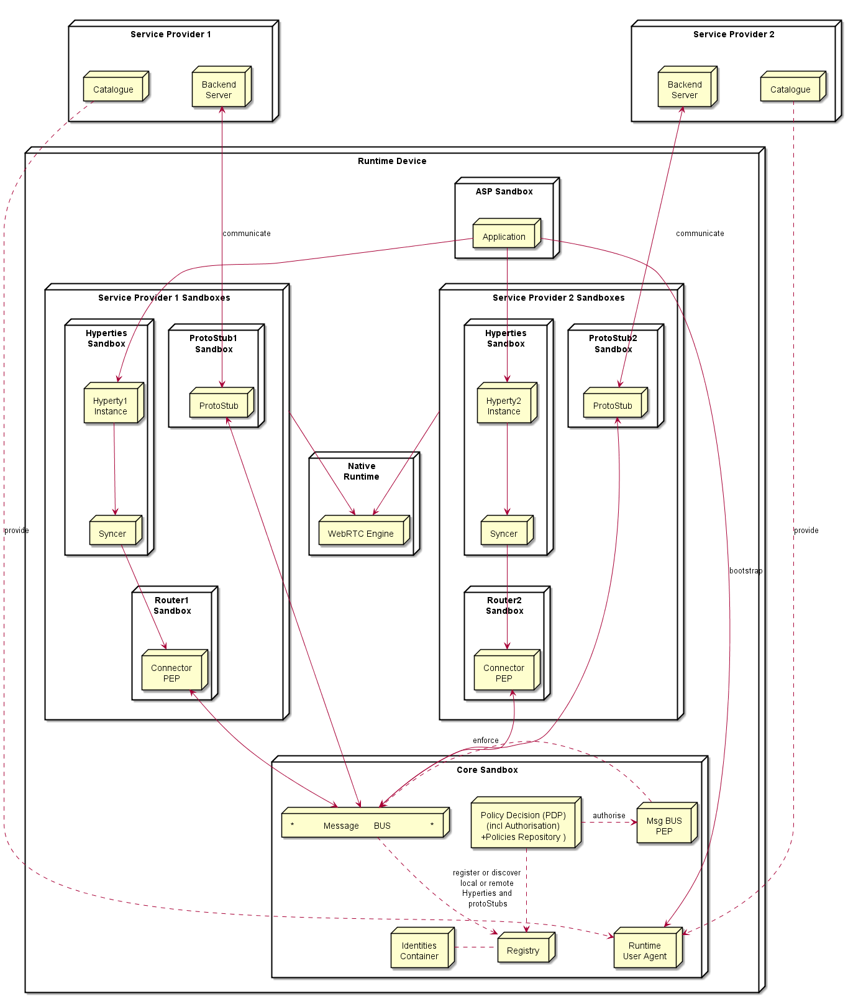

### Service Provider Sandboxes

According to Browser Sandbox model, each Service Provider Sandboxes
executes components downloaded from the same Service Povider domain
including Hyperties, protocol stubs used to connect and communicate with
Service Provider Domain and PEP enabled Connector.

Functionalities to support Hyperty Communication through data object
synchronisation are provided by the Syncer component based on
Object.observer API. Details are discussed
[here](https://github.com/reTHINK-project/architecture/blob/master/docs/datamodel/data-synch/readme.md).

#### Connector/Policy Engine

Handles communication between Hyperties and the local Message Bus,
enforcing when needed valid Policies on this communicayion (e.g.
authorisation policies) according to Service Provider domain policies.
It also enforces access control policies to synchronised object (Object
Monitor functionalities as proposed
[here](https://github.com/reTHINK-project/architecture/issues/52)).

#### Protocol Stub

Protocol Stack to be used to communicate with Service Provider Backend
Servers (including Messaging Server or other functionalities like IdM)
according to Protocol on the Fly and codec on the fly concept.

Protocol stubs are reachable through the Message BUS. In this way it is
ensured that all messages received and sent goes through the message bus
where policies can be enforced and additional data can be added or
changed including message addresses and identity tokens.

### Core Runtime

#### Policy Decision Point and Message BUS authorisation

It provides Policy decision functionalities for the Service Provider
Router sandbox according to Policies downloaded and stored locally when
associated Hyperties are deployed. The possibility to consult Policies
stored remotely should also be investigated. It also provides
authorisation / access control to the Message BUS.

#### Message BUS

Supports local message communication between Hyperty Instances in a
loosely coupled manner. Access to message BUS is subject to
authorisation to prevent cross origin attacks / spy from malicious
Hyperties.

See [postaljs](https://github.com/postaljs/postal.js)

#### Registry

Local Runtime Hyperty registry where Hyperty local addresses are
registered and discoverable by other local Hyperties. The Runtime
Registry should ensure synchronisation with Remote Domain Registry (to
be provided by WP4)

#### Identities Containers

Contains Tokens that associates Hyperties with Users, it also provides
Identity assertions. Something similar to [WebRTC IdP
Proxy](http://w3c.github.io/webrtc-pc/#identity) but not limited to
WebRTC.

#### Runtime User Agent

Manages Core Sandbox components including its deployment and update from
Core Runtime Provider. It also handles Device bootstrap and the
deployment of Hyperties and Protocol Stubs in the Runtime. It includes a
Catalogue Protocol Stub to interface with any reTHINK Service Provider
Catalogue service to query and download required Catalogue Data Objects,
according to [Catalogue Service interface
design][interface-catalogue](https://github.com/reTHINK-project/architecture/blob/master/docs/interface-design/Interface-Design.md\#73-catalogue-interface).

Native Runtime
--------------

Functionalities that are natively provided by the runtime.

### WebRTC Media Engine

Provides the support for Stream communication betweeb Hyperties
according to WebRTC Standards.

Security analysis of the Hyperty Runtime
========================================

Introduction
------------

The security analysis contained in this document refers to the runtime
architecture described in
[[1]](https://github.com/reTHINK-project/core-framework/blob/master/docs/specs/runtime/runtime-architecture.md).

In reTHINK, the trusted computing base (TCB) of the Hyperty Runtime
encompasses the following components: the Native Runtime, the Core
Sandbox components, and the underlying JavaScript engine, Operating
System, and hardware platform. If the native runtime is compromised, so
it will be the support for WebRTC stream communication between
hyperties. Subverting the core sandbox components can compromise: the
correct decision and enforcement of policies by the PDP, the proper
routing of messages through the Message Bus, the flawless registration
and discovery of Hyperty and protoStubs by the Registry, and the correct
maintenance of identities by the Identities Container. Subverting the
JavaScript Engine can interfere with the correctness and security of
JavaScript code, whose execution necessarily requires a JavaScript
engine such as V8. The code that depends on the JavaScript engine
includes the runtime components specific to the reTHINK architecture
(Router PEP, PDP, Message Bus, Registry, Identities Container, and
WebRTC engine), and all the user or developer code hosted by the Hyperty
runtime, namely Hyperty Instances, ProtoStubs, and Applications. Given
that the JavaScript Engine depends on both the Operating System and the
hardware platform, compromising the latter can also affect the
JavaScript engine and all the other components sitting on top of it.

Next, we analyze the security properties of our system assuming that all
components of the trusted computing base are intact. Then, we assess the
security of the Hyperty Runtime when deployed on target platforms that
exhibit different characteristics with respect to the platforms’
software and hardware configuration. In particular, we explore five
platform configurations: *browser*, *application*, *server*, *router*,
and *embedded*. We analyze the security of each platform under different
threat models.

Mitigated threats assuming an intact TCB
----------------------------------------

When the TCB is intact, our architecture ensures correct isolation of
client JavaScript code (i.e., Hyperties, ProtoStubs, and Applications).
Isolation is enforced both among client code instances and between
client code instances and the environment (e.g., external applications,
or OS resources). In addition, our architecture provides for the correct
enforcement of the policy rules attached to Hyperty code. Such policies
can regulate different aspects of a hyperty’s behavior: access control
to local resources (e.g., cookies, files, network, etc), routing,
charging, and privacy restrictions. Finally, our architecture ensures
the authenticity of client code and the identity of the involved
entities.

In the basic threat model, we assume that an attacker can server
arbitrary client code to the Hyperty Runtime. The attacker can
impersonate a legitimate service provider and serve malicious ProtoStub
or Hyperty code. When instantiated on the Hyperty Runtime, this code can
attempt to execute JavaScript instructions in order to access private
data held: by other client code (including applications’), by the
Hyperty Runtime TCB, or by the surrounding environment (e.g., the
JavaScript Engine, or the Operating System). Malicious ProtoStub or
Hyperty code may also aim to tamper with any of the just mentioned
software components of the system. In particular, malicious code may try
to tamper with Hyperty policies or with the respective policy decision
and enforcement engine in order to escalate privileges. Finally,
malicious code may launch denial of service attacks (e.g., by executing
CPU intensive code). Below in this document, we expand on this threat
model to consider potential vulnerabilities of our system when deployed
on different environments.

Next, we describe how our system defends against several classes of
potential attacks. We add to this list some attacks that can be
currently launched. We provide some recommendations for fixing such
attacks.

### T1: Unauthorized access by client code

The basic mechanism of our architecture to prevent unauthorized access
by client code is sandboxing. Each Hyperty instance running in the
system runs in its own sandbox. A sandbox defines a security perimeter
for the Hyperty instance, preventing it from reading or writing the
memory (or other resources) in use by other Hyperty instances or by
other components in the surrounding environment. Along with a Hyperty
instance, a sandbox also hosts the ProtoStub instance required by the
local Hyperty instance to communicate with external services. Therefore,
potentially malicious ProtoSub code will be prevented from accessing
resources that are not authorized. To communicate outside the sandbox,
the runtime provides well defined interfaces: the Router PEP, which is
used by the Hyperty instance to communicate with the PDP and with the
Message Bus, and an API to communicate with the Messaging Server. The
PDP is responsible for enforcing the policy associated with the Hyperty
instance.

Note that, in our architecture, sandboxing is also used to isolate other
software components. In particular, there is the Core Sandbox, which
hosts the Hyperty Runtime components implemented in JavaScript. Both the
client code sandboxes and the core sandboxes are enforced by the
JavaScript engine.

### T2: Policy subversion

Every Hyperty instance running in the system is constrained by a policy.
In general, a policy can enclose several policy fragments, each of them
defining subpolicies of different types. There are four types of
policies: access control policies, routing policies, charging usage
policies, and privacy policies. These policies are responsible for
regulating, supervising, or restricting the operations that a hyperty
can perform, e.g., prevent access to a local file, enforce a predefined
network route, or define the usage costs of a service. To prevent a
malicious Hyperty instance (or ProtoSub) from subverting the security
policy and escalate its privileges, the policy decision component (PDP)
and the policy repository are located in the Core Sandbox, and therefore
outside the Hyperty instance’s reach. As a result, policy integrity and
enforcement are safe from malicious client code.

### T3: Threats to client code authenticity

The authenticity of client code -- Hyperty or ProtoStub -- can be
compromised if at least one of two things occurred without detection
before the code is loaded and instantiated into a sandbox: an attacker
modified the original code bytes (e.g., by embedding malware into a
Hyperty code), or (ii) modified the identity of the code or of its
manufacturer. To prevent these attacks, our architecture requires that
every client code distribution, be it Hyperty or ProtoStub, is digitally
signed by its manufacturer. By checking these signatures before
instantiating the Hyperty or ProtoStub code on the sandboxes and
assuming that the cryptographic primitives are correct, the Hyperty
Runtime is able to guarantee the integrity and identity of the code.

### T4: Denial of service attacks

A malicious Hyperty instance or ProtoStub implementation can launch
denial of service attacks by holding to specific resources, e.g.,
hogging the CPU by sitting on an infinite loop, or flooding the network
with bogus messages. The JavaScript engine featuring the Hyperty Runtime
prevents such attacks by placing a limit to the maximum utilization of a
given service by a client code instance, for example by bounding the CPU
cycles that a Hyperty instance is allowed to execute uninterrupted.

### Possible attacks in the current architecture

Given that ProtoStub, Hyperty instances, and the Router PEP share the
same sandboxes, some attacks are possible: (i) a malicious Hyperty
instance or ProtoStub can compromise the Router PEP, (ii) a malicious
Hyperty can subvert a ProtoStub, or (iii) a malicious ProtoStub can
compromise a Hyperty instance.

-   The first attack causes no particular damage outside the enclosing
    sandbox. Because the Router PEPs holds no secrets, there’s no risks
    of confidentiality breaches. On the other hand, the Router PEP
    provides services to the sandbox’s client code. As a result,
    compromising the integrity of the Router PEP could result at most in
    integrity and availability violations to the JavaScript client
    instances enclosed in the sandbox.

-   The second attack -- a malicious Hyperty subverts a ProtoStub --
    could be problematic if the ProtoStub contains secrets bundled into
    the ProtoStub code itself. Secrets can refer not necessarily to
    sensitive data (which is unlikely given that ProtoStubs implement
    communication protocols), but proprietary IT-protected code owned by
    the developer or by the service provider. The current architecture
    provides no protection against this attack.

-   Lastly, the third attack -- a malicious ProtoStub -- can be the most
    severe one. If a buggy ProtoStub is exploited, an attacker can gain
    access to execution state of the Hyperty instances sharing the same
    sandbox. If a Hyperty instance processes sensitive user data or
    handles key material, such an exploit can result in a data breach.
    The current version of the Hyperty Runtime architecture offers no
    protection against this attack.

In order to mitigate attacks (ii) and (iii), we recommend that Hyperty
instances and ProtoSubs execute isolated in independent sandboxes.

Vulnerability assessment of the Hyperty Runtime
-----------------------------------------------

The threats described in the previous section can be thwarted by the
Hyperty Runtime so long as the TCB of the system remains intact. In this
section, we study the potential vulnerabilities of the TCB when deployed
on a specific target platform. We envision five potential target
platforms: browser, standalone application, middlebox, server, and
secure element. Next, before we present our analysis for each platform,
we describe our methodology to ensure a uniform assessment of the system
across platforms.

### Methodology

Our basic methodology to assess the vulnerabilities of the Hyperty
Runtime’s TCB is based on a *vulnerability matrix*. A vulnerability
matrix indicates representative practical attacks that can be carried
out against the TCB on a given platform as a mean to compromising the
security of the system. The security is compromised by successfully
achieving one of the goals described in the section above: permit
unauthorized access by client code (T1), subvert hyperty policies (T2),
compromise the authenticity of client code (T3), and launch denial of
service attacks (T4). Such practical attacks to the TCB are classified
in the vulnerability matrix along two dimensions: (i) the attack vector
along the computer stack where vulnerabilities can be exploited (e.g..,
targeting the operating system), and (ii) the difficulty level of
launching attacks based on the required technical skills and resources.

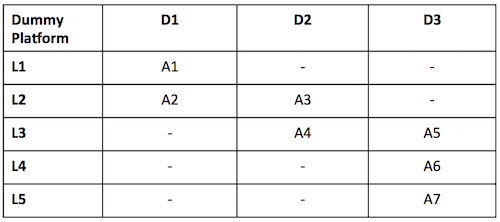

The figure above shows an example of a vulnerability matrix for a dummy
platform. The content of each cell contains attacks that the TCB is
vulnerable to. Each attack is identified, e.g, as A1, or A7, and
naturally must be accompanied by a description of the attack, e.g., “A1:
inspection of JavaScript code through the browser”, “A7: probing the
system bus”. The columns represent the difficulty level and the rows the
attack vector (both will be explained below). The vulnerability matrix
will then allow us to grasp how exposed the TCB is to attacks: the lower
the difficulty degree of the attacks is the more vulnerable the Hyperty
Runtime will be when deployed on that particular target platform.

The attacks presented in the vulnerability matrix are launched by a
given attack agent. The attack agents to be considered depend on the
specific platform and may include, for example, the local user, malware,
the system administrator, a thief, etc. The behavior of an attack agent
is characterized by an *attack profile*, which specifies the subset of
all possible attacks to the Hyperty Runtime’s TCB that a given agent can
perform. For example, considering a browser platform, the attack profile
of an adversarial average web user certainly includes attacks like
“inspection of JavaScript code through the browser”, but not “probing
the system bus”. Therefore, when drawing the vulnerability matrix of the
TCB for a given platform, we determine which attacks the TCB may be
subjected to based on the profiles of the attacker agents that we expect
to find in that particular usage scenario.

Next, we describe the classification for attack vectors and difficulty
levels:

**Attack vectors.** Attack vectors can be classified in five types,
ordered top-down, from the highest to the lowest layer of the computer
stack, as shown in the figure below:

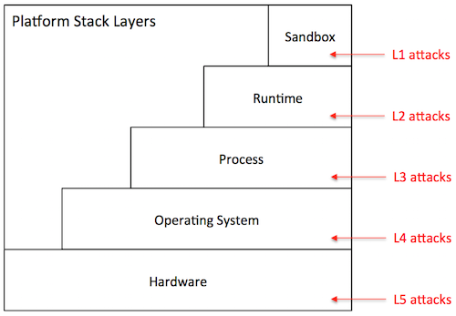

-   *Sandbox level (V1)*: The attacker has direct access to the sandbox
    environment, hence to the code and execution state of Hyperty
    instances. For example, on a browser platform, users typically have
    access to the JavaScript of a given page. This means that a
    malicious user could leverage that mechanism to tamper with the
    JavaScript code of locally running Hyperty instances.

-   *Runtime level (V2)*: The attacker has direct access to the code or
    execution state of the Hyperty Runtime. Depending on the specific
    exploit, he can mount attacks that disable the defenses against any
    of the attacks described in the previous section. For example, on a
    browser platform, a V2 attack can be achieved by installing a
    malicious browser extension that bypasses the policy enforcement
    mechanism of the Hyperty Runtime.

-   *Process level (V3)*: the attacker has access to the execution state
    of the process where the Hyperty Runtime is hosted. Just like V2
    attacks, this type of attack can result in catastrophic
    consequences. Examples of attacks performed at the process level
    include attaching a debugger to the Hyperty Runtime process and
    inspect its internal data structures, or dumping the process’s
    memory to disk by reading from /dev/mem.

-   *Operating system level (V4)*: the adversary has access to the
    execution state of the operating system, and therefore to the
    execution state of the Hyperty Runtime. Similarly to V2 and V3, V4
    attacks can be catastrophic. An attack performed at this layer
    consists, for example, of adding a rootkit to the operating system
    in order to keep track of the all ingress and outgress communication
    performed by the Hyperty instances running on the host.

-   *Hardware level (V5)*: the adversary has physical access to the
    hardware of the platform and can launch simple attacks that do not
    involve tampering with the circuitry. Attacks in this category
    include, removal or inspection of the hard disk, probing the system
    bus in order to extract secrets from volatile memory, etc. An attack
    at this level may also include tampering with the silicon chips,
    perform side-channel attacks, etc. Such attacks require a high-level
    of expertise and committed resources. In theory, attacks performed
    at this level can reveal the entirety of the system state, including
    operating system’s. In practice, however, such attacks are more
    directed to extract specific secrets when V3 attacks or above are
    not possible.

**Difficulty level.** The difficulty level of launching an attack
depends on several factors, namely the privileges owned by the adversary
(e.g., user or superuser), the skills required to perform the exploit
(e.g., run a debugger or tamper with silicon), and the resources that
are necessary to commit to successfully carry out the exploit (e.g.,
specific software exploits, memory probes, etc.). Based on these
factors, we define three difficulty levels for a given attack:

-   *Easy (D1)*: The attack is easy to perform. Based on the privileges
    owned by the attacker, the tools that are necessary to launch the
    attack are accessible, well documented, and are simple to handle.
    Some examples of D0 attacks include: (i) on a browser platform, a
    malicious user leverages the browser interface controls in order to
    modify the JavaScript code of a given Hyperty, (ii) on a server
    platform, a disgruntled system administrator leverages superuser
    privileges to disable the policy enforcement mechanisms of the
    Hyperty Runtime where client Hyperty instances are being executed.

-   *Medium (D2)*: The attack requires considerable skills and / or
    resources. It can be launched by mastering the tools presently
    available in the system (e.g., tools provided by the operating
    system, debuggers) or installing new ones that can be found on the
    Internet (including malware or exploits). The attacker has not
    enough skills or resources to find new vulnerabilities in the system
    or to develop its own exploits known vulnerabilities. Examples of
    such attacks include, for example, attaching debuggers to extract
    in-memory secrets from the Hyperty Runtime, patch the Hyperty
    Runtime using exploit code published on the Web, etc.

-   *Hard (D3)*: The attack is very sophisticated. To mount the attack,
    the attacker must be able to develop its own exploit code, find new
    vulnerabilities in the system, and / or launch software hardware
    attacks. For example, finding a new vulnerability in a device
    driver’s code, and write the code to exploit that vulnerability. The
    attacks performed at the deep hardware level are also considered
    hard to execute.

### Browser platform

One of the primary platforms targeted by reTHINK is the browser. The
browser platform will be highly heterogeneous; we may be talking about
desktops, laptops, or mobile devices featuring many different
configurations with respect to: hardware architecture, operating system
in use, installed software, and specific browser distribution and
extensions. Nevertheless, a general architecture of the browser platform
is shown in the figure below.

Essentially, the Hyperty Runtime runs inside a browser’s process. This
process is in fact a “subprocess” of the browser that implements a
sandboxing mechanism of its own (as in the Chrome browser). The Hyperty
Runtime is responsible for the secure execution of JavaScript code
inside individual sandboxes: the core sandbox encloses additional
components of the reTHINK framework written in JavaScript, the client
sandbox is used for securing JavaScript client code (i.e., Hyperty
instances and ProtoStubs), and ASP sandboxes provide a home for Hyperty
applications. As shown in the figure, the Hyperty Runtime’s hosting
process depends on the operating system, which in turn depends on the
underlying hardware configuration. Aside to the browser processes, we
find all sorts of application processes and operating system services.

From the security point of view, the threats to the TCB are mainly
caused by an adversarial user. To better characterize these threats, we
define three attacker profiles and draw the vulnerability matrix as
follows:

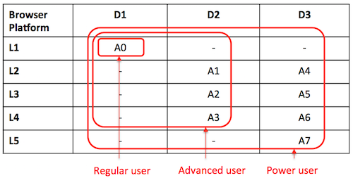

-   *Regular user*: This attacker profile captures the class of users
    with an average proficiency level in computing, but is willing to
    subvert the security properties enforced by the TCB. He has only
    user privileges that enable him to launch the browser, and run
    Hyperty-based applications. A regular user is expected to mount the
    following attacks:

-   *A0*: access and modify client Javascript code through the browser
    interface.

-   *Advanced user*: This profile captures users with superuser
    privileges and some degree of skills and knowledge of the system. He
    is informed about existing tools and techniques that can be used to
    hack into the system’s components, has access to exploits published
    online, and can handle auxiliary tools (e.g., debuggers, Unix
    advanced commands, etc.). If necessary he can root or jailbreak the
    operating system by following instructions (if we are talking about
    mobile devices). He can assemble and disassemble the basic hardware
    components of the system (e.g., plugging in / out the hard disk). In
    addition to attack A0, an advanced user can perform attacks in
    different layers such as these:

-   *A1*: compromise the runtime by installing a malicious browser
    extension,
-   *A2*: dump the memory contents of the process to disk,
-   *A3*: install a rootkit on the operating system that keeps track of
    Hyperty instances’ communication.

-   *Power user*: This user is highly skilled. He gathers deep knowledge
    of the system and can launch sophisticated attacks. He is able
    investigate for vulnerabilities in the software (including in the
    Hyperty Runtime or in the OS) and build its own exploits. He has the
    resources and tools to launch hardware attacks that involve
    tampering with silicon. Summing up to the attacks described
    previously, a power user can mount more sophisticated attacks on
    various layers of the stack:

-   *A4*: find and exploit a bug in the Hyperty Runtime
-   *A5*: attach a debugger to the browser’s subprocess and inspect /
    modify its memory,
-   *A6*: build a device driver to continuously monitor the execution of
    Hyperty Instances,
-   *A7*: probe the system bus in order to extract private key material
    in use by Hyperty Instances.

**Vulnerability assessment:** As illustrated by the vulnerability
matrix, the browser platform is vulnerable to a range of attacks. Some
of these attacks can be mounted by regular users with relative ease. In
addition, there are several ways for advanced users to successfully
compromise the TCB by exploiting the system at different layers in the
stack. As a result, we recommend that the browser platform should be
avoided for hosting client code (i.e., Hyperty Instances, ProtoStubs, or
Applications) and policies which the local user has incentives to
subvert. Examples of such code include: Hyperty instances restricted by
specific usage charging policies, ProtoStubs that encode proprietary
communication protocols, or Applications that access copyrighted digital
data.

### Application platform

A variant of the browser platform just presented is to run the Hyperty
Runtime and client code as a standalone application. A practical usage
scenario, for example, is to bundle the Hyperty Runtime in mobile apps
and deploy them on mobile devices such as smartphones or tablets.
Alternatively, we also envision that the Hyperty Runtime can be packaged
as a classical standalone application for desktop platforms, for example
Linux- or Windows-based. To allow for the development and maintenance of
such applications, reTHINK will provide an SDK, which will include APIs
and platform specific libraries for adapting the Hyperty Runtime to the
underlying operating system platform.

The figure above illustrates a hypothetical application platform
tailored for Android mobile devices. Just like in the browser platform,
the Hyperty Runtime is hosted by an application process. The host
application is responsible for mediating the system calls issued by the
Hyperty Runtime to the operating system and for providing a user
interface to the Hyperty Runtime and client JavaScript applications (and
hyperties). This application comprises additional software components: a
platform-independent adaptation layer, and platform-specific libraries,
e.g., for IO, storage, and memory management. In the example, the
platform-specific libraries are tailored for the Android API.

From the security point of view, application and browser platform are
quite similar; for that reason we adopt the same attacker profiles
(regular user, advanced user, and power user). The main difference
between architectures is twofold. First, the host application will
prevent direct introspection of the JavaScript code running inside
Hyperty Runtime sandboxes. As a result, the application architecture is
able to mitigate simple attacks to the browser (A0 in the browser’s
vulnerability matrix), raising the bar for regular users. Second, the
host application will not support software extensions. This will prevent
some advanced attacks to the runtime based on installation of malicious
extension code, and to the browser process (see attacks A1 and A2,
respectively, in the browser’s vulnerability matrix). Apart from that,
the vulnerability matrices are comparable. Next, we present the
vulnerability matrix of the application platform and provide alternative
examples for attacks on Android devices.

-   *Advanced user*: An advanced user can compromise the entire system
    by launching attacks at the OS level:

-   *A1*: root the device and instrument the operating system in order
    to introspect the Hyperty instances’ sandboxes.

-   *Power user*: A power user can mount more sophisticated attacks on
    various layers of the stack:

-   *A2*: find and exploit a bug in the Hyperty Runtime,
-   *A3*: find a bug in the host application code and exploit it,
-   *A4*: monitor the execution of Hyperty Instances by rooting the
    device,
-   *A5*: hack the device hardware to extract sensitive Hyperty data
    from memory.

**Vulnerability assessment:** As illustrated by the vulnerability
matrix, the application platform (targeting Android devices) is more
robust to attacks than the browser platform. This is mainly due to the
fact the application architecture allows us to close some security holes
in the browser architecture that cannot be thwarted without modifying
the code of the browser. Nevertheless, it is still possible to for an
advanced user to compromise the system by rooting the device, which will
likely dissuade the average user. Nevertheless, we recommend prudence in
deploying client code (i.e., Hyperty Instances, ProtoStubs, or
Applications) and policies which the local user has high incentives to
subvert.

### Server platform

reTHINK also targets server platforms. The idea is to allow Hyperties
and client applications to deliver their services from the cloud or from
a local cluster. In such environments, there is a server infrastructure
which is carefully configured to provide specific services to users
(e.g., web hosting, VM hosting). Part of that configuration requires the
installation and setup of specific server-side applications (SSAs),
e.g., web server, DB server, etc. There are two typical server
configurations for hosting server-side applications (SSAs): virtualized
or non-virtualized. In virtualized environments, SSAs run inside virtual
machines, which in turn are managed by virtual machine monitors (VMMs),
such as Xen or VMware. In non-virtualized environments, SSAs execute
natively on servers configured with a classical operating system like
Linux. Regardless of whether the server platform is virtualized or not,
the SSA will always depend on an operating system, even if the OS runs
inside a VM. Therefore, to provide Hyperty support for server platforms,
the Hyperty Runtime will be packaged as a standalone SSA.

### Router platform

### Embedded platform

Runtime APIs
------------

*Should we use Typescript interfaces to define Runtime APIs?*

### Message BUS

To send messages with optional call back

    postMessage( Message.Message message , callback)

To listen to messages published on a certain resource

    addListener( listener, URL.URL resource )

### Hyperty

    init( postMessage )
    report(message)

### Policy Enforcer

To set postMessage() function to be used by the Policy Enforcer to send
messages usually the "MessageBUS".

    setSender( postMessage )

To set postMessage() function to be used by the Policy Enforcer to
receive messages usually the Hyperty or a Syncher. In case the resouce
parameter is provided this postMessage() is only valid for messages
containing the same resource url.

    setReceiver( postMessage, resource )

To receive messages from the message BUS

    postMessage(message)

### Syncher

*should we distinguish between Reporter and Observer syncher?*

To set postMessage() function to be used by the Syncher to send messages
usually a "Policy Enforcer" but it could also be the MessageBUS.

    setSender( postMessage )

Hyperty instance uses this function to provide the object to be changed
by the (observer) syncher according to messages received. The Hyperty
instance has previsouly used the *Object.observe* javascript api to set
as an observer of this object

    Promise <SyncObject> createAsObserver(  receivedMessage )

To create a new object and ask another Hyperty instance to observe it. A
Create Message will be generated and sent by the Syncher. Promise is
used to handle Response messages to this object.

    Promise <SyncObject> createAsReporter(  resourceURL, schemaURL, toURL, dataObject?)

By default the events triggered by changes performed on this object by
the Resporter Hyperty will trigger the synchronisation process.
Otherwise the Hyperty instance should invoke a separate function,
*addAttribute()*, *updateAttribute()*, *deleteAttribute()* defined below
and afterwards invoke the *synch()* function to trigger the
synchronisation process.

To add an attribute to object without triggering the synchronisation
process:

    addAttribute(resourceURL, attributeName, attributeValue)

To update an attribute without triggering the synchronisation process:

    updateAttribute(resourceURL, attributeName, attributeValue)

To delete an attribute without triggering the synchronisation process:

    deleteAttribute(objectId, attributeName)

To delete an Object:

    delete(objectId)

To trigger the synchronisation process:

    Promise synch(objectId)

To receive messages from other Hyperties that will be reported to the
Hyperty:

    postMessage(message)

### protoStub

To initialise the protocol stub including as input parameters its
allocated component runtime url, the runtime BUS postMessage function to
be invoked on messages received by the protocol stub and required
configuration retrieved from protocolStub descriptor.

    init( RuntimeURL runtimeProtoSubURL, bus.postMessage, ProtoStubDescriptor.configuration configuration )

    connect(  )

    disconnect(  )
    postMessage(message)
    addListener( onMessage )

### HypertySandbox

    postMessage(message)

### Runtime UA

Download Hiperty from Catalogue URL

    loadHyperty( URL )

Download Stub from Catalogue URL or domain url

    loadStub( URL )

Used to check for updates about components handled in the Catalogue
including protocol stubs and Hyperties. *check relationship with
lifecycle management provided by Service Workers*

    checkForUpdate(CatalogueURL)

    discoverHiperty(applId, OSname, capability_list) 
    accomodate interoperability in H2H and proto on the fly for newly discovered devices in M2M

     

### Registry

To register a new Hyperty in the runtime which returns the HypertyURL
allocated to the new Hyperty.

    HypertyURL registerHyperty( hypertySandbox.postMessage, hypertyUrl)

To unregister a previously registered Hyperty

     unregisterHyperty( HypertyURL )

To register a new Protocol Stub in the runtime including as input
parameters the function to postMessage, the DomainURL that is connected
with the stub, which returns the RuntimeURL allocated to the new
ProtocolStub.

    HypertyRuntimeURL registerStub( stub.postMessage, DomainURL )

To unregister a previously registered protocol stub

     unregisterStub( HypertyRuntimeURL )

To receive status events from components registered in the Registry

    onEvent( Message.Message event )

To discover protocol stubs available in the runtime for a certain
domain. If available, it returns the runtime url for the protocol stub
that connects to the requested domain. Required by the runtime BUS to
route messages to remote servers or peers (*do we need something similar
for Hyperties?*).

    RuntimeURL discoverProtostub( DomainURL )

### Identities Container

Functions to deal with assertions compliant with [WebRTC
RTCIdentityProvider](http://w3c.github.io/webrtc-pc/#identity-provider-interaction)

    IdAssertion generateAssertion( contents, origin, usernameHint )
    validateAssertion( assertion, origin )

### LHCB

    getCurrentConnectivityStatistics()
    sendConnectivityStatisticsToBroker()

### Dynamic view of Runtime

*it should be aligned with [WP2 Dynamic
View](https://github.com/reTHINK-project/architecture/tree/master/docs/dynamic-view)*

#### [Basics](basics/readme.md)

#### [Identity Management](identity-management/readme.md)

#### [H2H Communication](h2h-communication/readme.md)

#### [M2M Communication](m2m-communication/readme.md)

### Readme

#### [deploy runtime](deploy-runtime.md)

#### [deploy protocol Stub](deploy-protostub.md)

#### [deploy Hyperty](deploy-hyperty.md)

#### [Message BUS Routing](bus-msg-routing.md)

#### [Intra domain local communication](intra-local-comm.md)

#### [Inter domain local communication](inter-local-comm.md)

#### [Intra domain remote communication](intra-remote-comm.md)

#### [Inter domain remote communication](inter-remote-comm.md)

### Deploy runtime

In case the device does not support the Hyperty Core Runtime components
eg an existing browser like Chrome or a Network Node.js Server, they
have to be deployed in the Device.

**Notes from 6th July H2H Comm Work Session:**

Runtime Core components should be as much as possible independent on the
Runtime type. They should be deployed once and executed at the
background. The next time the runtime is started there should be no need
to download the core runtime again unless there is a new version.
Runtime core components should be singletons (?) shared by different
Apps and Hyperty instances. In order to support these characteristics
for the Browser, Runtime Core components should be implemented with
Web/Service Workers (FFS).

The Core Runtime is provided by a specific Service Provider that handles
a central repository or catalog of the needed Core Runtime components.

This process may be triggered by the deployment of an Hyperty or
Protocol Stub using some existing libraries like require.js. Such
possibility has to be validated with experimentations.

### Deploy Protocol Stub

<!--
@startuml "deploy-protostub.png"

autonumber

!define SHOW_RuntimeA

!define SHOW_AppAtRuntimeA

!define SHOW_CoreRuntimeA
!define SHOW_MsgBUSAtRuntimeA
!define SHOW_RegistryAtRuntimeA
!define SHOW_IdentitiesAtRuntimeA
!define SHOW_AuthAtRuntimeA
!define SHOW_CoreAgentAtRuntimeA

!define SHOW_SP1SandboxAtRuntimeA
!define SHOW_Protostub1AtRuntimeA
!define SHOW_ServiceProvider1RouterAtRuntimeA

!define SHOW_SP1

!include ../runtime_objects.plantuml

-> RunUA@A : loadStub( domain )

RunUA@A -> RunReg@A : discoverStub( domain )

alt Stub Not Available in Registry

    RunUA@A -> SP1 : get <sp-domain>/.well-known/protostub

        note over BUS@A
            as defined in the data model the protocol stub is a well know URI.
            **open issue:** should it be the protostub URL a well known URI?
        end note

    create Proto1@A
    RunUA@A -> Proto1@A : new

    RunUA@A -> RunReg@A : registerStub(domainURL)

    RunUA@A <- RunReg@A : return RuntimeProtoStubURL

    note right
        **open issue:** the protostub only connects
        to the domain when is requested by 
        an Hyperty?
    end note

    RunReg@A -> BUS@A : addListener( registryListener, RuntimeProtoStubURL\status)

    RunUA@A -> SP1 : get <sp-domain>/.well-known/protostub/configuration

    RunUA@A <- SP1 : return protoStubConfigurationData

    RunUA@A -> Proto1@A : init(RuntimeProtoStubURL, BUS.postMessage, protoStubConfigurationData)

    group protocol stub connection to domain: to be designed by the ID Management group

    ...

    end group

    Proto1@A -> BUS@A : postMessage( protostubStatusUpdate message )

    note left
        eg protostub is connected or disconnected from the domain
    end note

    BUS@A -> RunReg@A : onEvent( protostubStatusUpdate message )

end

@enduml
-->
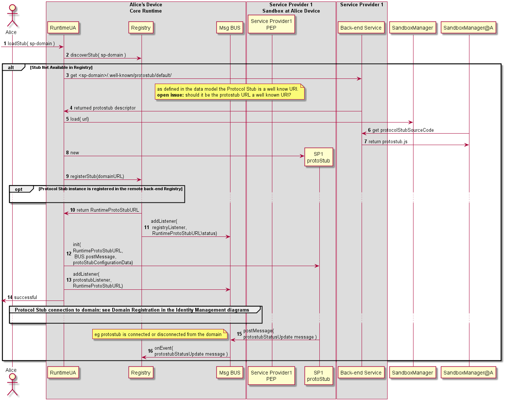

Steps 1-2 : The protocol stub deployment may be triggered by the
deployment of an Hyperty or by some attempt from a local Hyperty to
communicate with a remote Hyperty running in the domain served by the
protocol Stub. In this case the Runtime Registry would take the
initiative to start the protocol stub deploy (FFS). Such trigger may
take advantage of some existing libraries like require.js (to be
validated with experimentations). The Runtime UA only downloads and
deploys requested protocol stub after checking in the Registry that
there is no protocol stub available in the runtime.

Steps 3 - 4 : the Runtime UA is able to derive the URL to download the
protocol stub from the domain url, since it is a well known URI defined
in the reTHINK Architecture Interfaces. The Runtime UA uses the protocol
stub well known URI to download and instantiate it in the runtime.

Steps 5 - 7 : the new protocol stub is registered in the Runtime
Registry, which allocates and return the runtime address (RuntimeURL)
for the new runtime component. In addition, the runtime Registry
requests the runtime BUS to add its listener to receive events about the
protocol stub status.

Steps 8 - 10 : the Runtime UA retrieves required configuration data for
the new protocol stub and initialises it.

Protocol stubs are connected by using credentials handled by the Core
Runtime Identities Container which are detailed in the [domain login use
case](../identity-management/domain-login.md).

Steps 11 - 12 : protocol stub publishes its status (including events
about when it is connected or disconnected) in its resource status.
Components registered on the protocol stub status resources, like the
Registry, are notified about the new protocol status.

Message to publish Protocol Stub Status

    "id" : "1"
    "type" : "UPDATE",
    "from" : "hyperty-runtime://sp1/protostub/123",
    "resource" : "hyperty-runtime://sp1/protostub/123/status",

    "body" : { "value" : "LIVE" }

### Deploy Hyperty

<!--
@startuml "deploy-hyperty.png"

autonumber

!define SHOW_RuntimeA

!define SHOW_AppAtRuntimeA

!define SHOW_CoreRuntimeA
!define SHOW_MsgBUSAtRuntimeA
!define SHOW_RegistryAtRuntimeA
!define SHOW_IdentitiesAtRuntimeA
!define SHOW_AuthAtRuntimeA
!define SHOW_CoreAgentAtRuntimeA

!define SHOW_SP1SandboxAtRuntimeA
!define SHOW_Protostub1AtRuntimeA
!define SHOW_ServiceProvider1HypertyAtRuntimeA
!define SHOW_ServiceProvider1RouterAtRuntimeA

!define SHOW_SP1

!include ../runtime_objects.plantuml

group discover Hyperty URL: to be designed in a separated diagram by the Id Management Group

    ... ...

end group

alt App and Hyperty are from the same domain

    RunUA@A <- App@A : registerHyperty( HypertyInstance )

    RunUA@A -> RunUA@A : check Hyperty and App domain

    note right
         In this case, it is the App that instantiates the Hyperty, since the RuntimeUA is not able to do it
    end note

else App and Hyperty are from different domains

    RunUA@A <- App@A : loadHyperty( HypertyCatalogueURL)

    RunUA@A -> SP1 : get HypertyCatalogueURL

    create SP1H@A
    RunUA@A -> SP1H@A : new

end group

SP1H@A -> SP1H@A : Router?

SP1H@A -> RunUA@A : get Router

RunUA@A -> SP1 : get Router

create Router1@A
RunUA@A -> Router1@A : new

RunUA@A -> Router1@A : new

RunUA@A -> RunReg@A : registerHyperty( postMessage, HypertyURL )

group associate to Identity : to be designed in a separate diagram by Id Management Group

    RunID@A <- RunReg@A : get Identity

    ... ...

    RunReg@A <- RunReg@A : set Identity

end group

group allocate address for new Hyperty Instance
    RunReg@A <- RunReg@A : resolve protoStub URL
    RunReg@A -> BUS@A : postMessage( read hyperty Address Allocation MSG)

    BUS@A -> Proto1@A : postMessage( read hyperty Address Allocation MSG)

    Proto1@A -> SP1 : read hyperty Address Allocation SP1 MSG Protocol

    group option: connect protocol stub to the domain in case it is still not connected yet

    end group

end group
    
group register Hyperty at SP1 Registry
    RunReg@A <- RunReg@A : collect Hyperty runtime Context data
    RunReg@A <- RunReg@A : resolve protoStub URL
    RunReg@A -> BUS@A : postMessage( create hypertyRegistration MSG)

    BUS@A -> Proto1@A : postMessage( create hypertyRegistration MSG)

    Proto1@A -> SP1 : create hypertyRegistration SP1 MSG Protocol

    end group

@enduml
-->

Message to request address allocated for new Hyperty Instance:

    "id" : "1"
    "type" : "CREATE",
    "from" : "hyperty-runtime://sp1/runalice/registry",
    "to" : "sp1/msg-node/address-allocation",
    "body" : { "hypertyUrl" : "hyperty://sp1/hy123" }

Message to Responde to request address allocated for new Hyperty
Instance:

    "id" : "1"
    "type" : "RESPONSE",
    "from" : "sp1/msg-node/address-allocation",
    "to" : "hyperty-runtime://sp1/runalice/registry",
    "body" : { "hypertyInstanceURL" : "hyperty-instance://sp1/alice/hy123" }

Message to Register new Hyperty Instance:

    "id" : "1"
    "type" : "CREATE",
    "from" : "hyperty-runtime://sp1/runalice",
    "to" : "sp1/registry",
    "body" : { "hypertyURL" : "hyperty://sp1/hy123", "hypertyInstanceURL" : "hyperty-instance://sp1/hy123,
    "hypertyRuntimeURL" : "hyperty-runtime://sp1/runalice,
    ...}

The Hyperty deployment may be triggered by an App or by some attempt
from a local Hyperty to communicate with a remote User. In this case the
Runtime Registry would take the initiative to start the protocol stub
deploy (FFS). Such trigger may take advantage of some existing libraries
like require.js (to be validated with experimentations).

**Open Issue:** In the diagram above, the Hyperty is instantiated by the
native Javascript engine as a normal javascript function/object, and in
its constructor the registration process is performed. Another option,
is to have in the Core Runtime, a Hyperty loader functionality (a
Service/Web Worker?) that would handle the instantiation of the Hyperty
and its registration in the runtime.

Hyperties are reachable through domain routers (should we change the
name?) to: 1- enable enforcement of domain proprietary policies 2- the
Hyperty (data synch) communication model would be implemented by the
router (connector is a better name?) and not by the Hyperty itself

When registered, Hyperties are associated with an Identity by the
Registry / Identities container. Then all, messages sent by the Hyperty
will be signed with a token according to the Identity associated to the
Hyperty. To be designed by the Identity Manager group.

### Message Routing in Message BUS

<!--
@startuml "bus-msg-routing.png"

autonumber

!define SHOW_RuntimeA

!define SHOW_CoreRuntimeA
!define SHOW_MsgBUSAtRuntimeA
!define SHOW_RegistryAtRuntimeA
!define SHOW_IdentitiesAtRuntimeA
!define SHOW_AuthAtRuntimeA

!include ../runtime_objects.plantuml

BUS@A <-  : send msg

RunAuth@A <- BUS@A : Authz request(Message)

RunReg@A <- RunAuth@A : Resolve(Message)

RunReg@A -> RunID@A : get Identity token

RunReg@A -> RunReg@A  : add ID Token to Msg

RunReg@A -> RunReg@A  : resolve addresses

group option :unregistered protocol stub for external address

    group discover protocol stub URL
    end

    group deploy protocol stub
    end

end

RunReg@A -> RunAuth@A : return(ResolvedMessage)

group enforce policies
    RunAuth@A -> RunAuth@A : enforce source policies

    RunAuth@A -> RunAuth@A : enforce target policies
end

alt
    RunAuth@A -> BUS@A : authorised(ResolvedMessage)

    BUS@A ->  : send msg
else Error : unknown source

else Error : target not found

else Error : not associated with Identity

else Error : blocked by source policy

else Error : blocked by target policy

end

@enduml
-->
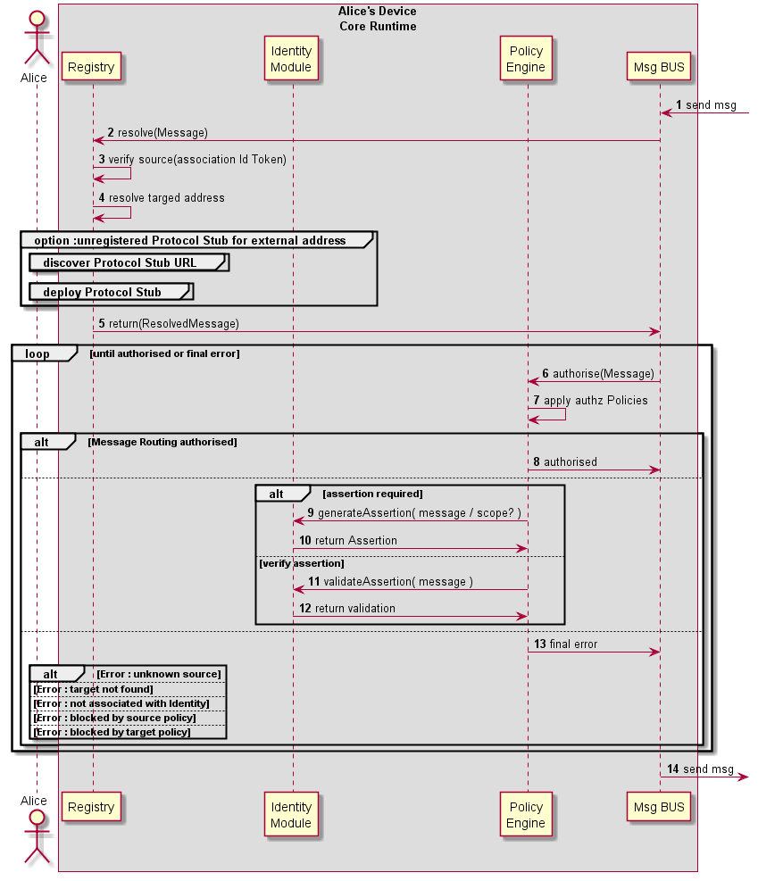

### Intra-domain Local Communication

<!--
@startuml "intradomain-local-communication.png"

autonumber

!define SHOW_RuntimeA

!define SHOW_SP1SandboxAtRuntimeA
!define SHOW_Protostub1AtRuntimeA
!define SHOW_ServiceProvider1HypertyAtRuntimeA
!define SHOW_ServiceProvider1RouterAtRuntimeA
!define SHOW_ServiceProvider1Hyperty2AtRuntimeA

!define SHOW_CoreRuntimeA
!define SHOW_MsgBUSAtRuntimeA
!define SHOW_RegistryAtRuntimeA
!define SHOW_IdentitiesAtRuntimeA
!define SHOW_AuthAtRuntimeA

!define SHOW_SP2SandboxAtRuntimeA
!define SHOW_Protostub2AtRuntimeA
!define SHOW_ServiceProvider2RouterAtRuntimeA
!define SHOW_ServiceProvider2HypertyAtRuntimeA

!include ../runtime_objects.plantuml

group discover Local Hyperty URL

end group

SP1H@A -> Router1@A : send msg

Router1@A -> Router1@A : Apply Local Alice policies

Router1@A -> SP1H2@A : send msg

note left
    should message goes through
    msg BUS?
end note

@enduml
-->

### Intra-domain Remote Communication

<!--
@startuml "intradomain-remote-communication.png"

autonumber

!define SHOW_RuntimeA

!define SHOW_SP1SandboxAtRuntimeA
!define SHOW_Protostub1AtRuntimeA
!define SHOW_ServiceProvider1HypertyAtRuntimeA
!define SHOW_ServiceProvider1RouterAtRuntimeA

!define SHOW_CoreRuntimeA
!define SHOW_MsgBUSAtRuntimeA
!define SHOW_AuthAtRuntimeA

!define SHOW_Runtime1B
!define SHOW_SP1SandboxAtRuntime1B
!define SHOW_Protostub1AtRuntime1B
!define SHOW_ServiceProvider1HypertyAtRuntime1B
!define SHOW_ServiceProvider1RouterAtRuntime1B

!define SHOW_SP1
!define SHOW_Msg1

!define SHOW_CoreRuntime1B
!define SHOW_MsgBUSAtRuntime1B
!define SHOW_AuthAtRuntime1B

!include ../runtime_objects.plantuml

group discover Remote Hyperty URL

end group

SP1H@A -> Router1@A : send msg

Router1@A -> Router1@A : Apply Local Alice policies

Router1@A -> BUS@A : send msg

BUS@A -> Proto1@A : send msg

Proto1@A -> Msg1 : send msg

Proto1@1B <- Msg1 : send msg

BUS@1B <- Proto1@1B : send msg

Router1@1B <- BUS@1B : send msg

Router1@1B -> Router1@1B : Apply Local Bob policies

SP1H@1B <- Router1@1B : send msg

@enduml
-->
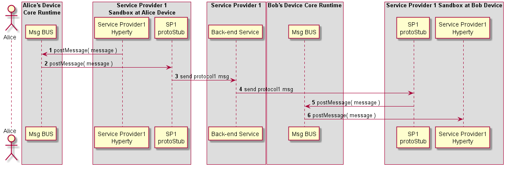

### Inter-domain Local Communication

<!--
@startuml "interdomain-local-communication.png"

autonumber

!define SHOW_RuntimeA

!define SHOW_SP1SandboxAtRuntimeA
!define SHOW_Protostub1AtRuntimeA
!define SHOW_ServiceProvider1HypertyAtRuntimeA
!define SHOW_ServiceProvider1RouterAtRuntimeA

!define SHOW_CoreRuntimeA
!define SHOW_MsgBUSAtRuntimeA
!define SHOW_RegistryAtRuntimeA
!define SHOW_IdentitiesAtRuntimeA
!define SHOW_AuthAtRuntimeA

!define SHOW_SP2SandboxAtRuntimeA
!define SHOW_Protostub2AtRuntimeA
!define SHOW_ServiceProvider2RouterAtRuntimeA
!define SHOW_ServiceProvider2HypertyAtRuntimeA

!include ../runtime_objects.plantuml

group discover Remote Hyperty URL

end group

SP1H@A -> Router1@A : send msg

Router1@A -> Router1@A : Apply Local Alice policies

Router1@A -> BUS@A : send msg

RunAuth@A <- BUS@A : Authz request

Router2@A <- BUS@A : send msg

Router2@A -> Router2@A : Apply SP2 policies

Router2@A -> SP2H@A : send msg

@enduml
-->

### Inter-domain Remote Communication

<!--
@startuml "interdomain-remote-communication.png"

autonumber

!define SHOW_RuntimeA

!define SHOW_SP1SandboxAtRuntimeA
!define SHOW_Protostub1AtRuntimeA
!define SHOW_ServiceProvider1HypertyAtRuntimeA
!define SHOW_ServiceProvider1RouterAtRuntimeA

!define SHOW_CoreRuntimeA
!define SHOW_MsgBUSAtRuntimeA
!define SHOW_RegistryAtRuntimeA
!define SHOW_IdentitiesAtRuntimeA
!define SHOW_AuthAtRuntimeA

!define SHOW_SP2SandboxAtRuntimeA
!define SHOW_Protostub2AtRuntimeA
!define SHOW_ServiceProvider2RouterAtRuntimeA

!define SHOW_RuntimeB
!define SHOW_SP2SandboxAtRuntimeB
!define SHOW_Protostub2AtRuntimeB
!define SHOW_ServiceProvider2HypertyAtRuntimeB
!define SHOW_ServiceProvider2RouterAtRuntimeB

!define SHOW_SP2
!define SHOW_Msg2

!define SHOW_CoreRuntimeB
!define SHOW_MsgBUSAtRuntimeB
!define SHOW_AuthAtRuntimeB

!include ../runtime_objects.plantuml
!include ../runtime_objects_domain2.plantuml

group discover Remote Hyperty URL

end group

SP1H@A -> Router1@A : send msg

Router1@A -> Router1@A : Apply Local Alice policies

Router1@A -> BUS@A : send msg

RunAuth@A <- BUS@A : Authz request

BUS@A -> Proto2@A : send msg

Proto2@A -> Msg2 : send msg

Proto2@B <- Msg2 : send msg

BUS@B <- Proto2@B : send msg

RunAuth@B <- BUS@B : Authz request

Router2@B <- BUS@B : send msg

Router2@B -> Router2@B : Apply Local Bob policies

SP2H@B <- Router2@B : send msg

@enduml
-->

### H2H Intradomain Communication

To be aligned with the [Communication setup model based on the
Reporter-Observer
pattern](https://github.com/reTHINK-project/architecture/blob/master/docs/datamodel/communication/data-synch-communication-model.md)

As agreed in the conf call of 13th July, this use case is splitted into
2 diagrams:

#### [Alice Invites Bob](h2h-intra-comm-1-alice-invites.md)

#### [Bob receives Invitation from Alice](h2h-intra-comm-2-bob-receives-invitation.md)

#### [Alice is aknowledged Bob received Invitation](h2h-intra-comm-3-alice-is-aknowledged-invitation-received.md)

#### [Bob Accepts Invitation and Updates the Communication Object which is reported to Alice - To be Removed](h2h-intra-comm-4-accepted.md)

#### [Bob's App interaction and Alice's connection update] (h2h-intra-comm-4-notification-update.md)

#### [Bob gathers WebRTC resources] (h2h-intra-comm-5-bob-webrtc.md)

#### [Synchronization of Alice's Data Object](#synchronization-of-alices-data-object) (h2h-intra-comm-6-alice-DO-synch.md)

### H2H Inter-domain Communication

#### [Alice Invites Bob](h2h-inter-comm-1-alice-invites.md)

The remaining steps are similar to intra domain communication *or should
we consider the usage of different IdPs?*

### H2H Intradomain Communication - create communication

This MSC diagrams shows the most relevant steps to support the initial
invitation of Alice to Bob.

<!--
@startuml "h2h-intra-comm-1-alice-invites-bob.png"

autonumber

!define SHOW_RuntimeA

!define SHOW_AppAtRuntimeA

!define SHOW_NativeAtRuntimeA
!define SHOW_WebRTCAtRuntimeA

!define SHOW_SP1SandboxAtRuntimeA
!define SHOW_Protostub1AtRuntimeA
!define SHOW_ServiceProvider1HypertyAtRuntimeA
!define SHOW_ServiceProvider1RouterAtRuntimeA
!define SHOW_CommObjectAtRuntimeA
!define SHOW_LocalObjectAtRuntimeA
!define SHOW_Syncher1AtRuntimeA

!define SHOW_CoreRuntimeA
!define SHOW_MsgBUSAtRuntimeA

!define SHOW_SP1

!define SHOW_Bob

!include ../runtime_objects.plantuml

Alice -> App@A : invite Bob

App@A -> Router1@A : invite Bob

SP1H@A <- Router1@A : invite Bob

group discover Remote Hyperty URL

SP1H@A -> SP1H@A : discover Bob

note right
    returned address set that Bob is
    in the same domain.
end note

end group

create CommObj@A

SP1H@A ->  CommObj@A : new(HypertyOwner,Constraints)

SP1H@A -> WRTC@A : get Comm resources\n(incl SDP)

create LocObj@A

SP1H@A ->  LocObj@A : new(sessionDescription)

== Request Bob to Create and Observe Connection object ==

SP1H@A -> Sync1@A : create( Connection DataObject, resourceURL, to)

Sync1@A -> Router1@A : postMsg(Create MSG) 

Router1@A -> Router1@A : apply policies

Router1@A -> BUS@A : postMsg(Create MSG) 

group insert Alice ID Token as defined in IDM/User Id Assertion diagram

    BUS@A -> BUS@A : add ID Token to Message

end group

Proto1@A <- BUS@A : postMsg(Create MSG) 

Proto1@A -> SP1 : postMsg(Create MSG) 

@enduml
-->

Steps 1 - 4 : Alice decides to invite Bob for a communication. The
discovery of Bob's Hyperty Instance URL is described
here(../identity-management/discovery.md).

Steps 5 - 7 : the Hyperty Instance creates the Connection, the
LocalConnectionDescription and the LocalIceCandidates data objects as
defined
[here](https://github.com/reTHINK-project/architecture/blob/master/docs/datamodel/communication/readme.md#connection).

Steps 8 - 9 : the Hyperty Instance requests the Syncher to ask Bob to
create and observe these objects. Syncher generates CREATE messages for
each object and puts it in the Body in JSON format. For simplification
purposes we assume the CREATE msg contains the Connection object plus
local SDP and local IceCandidates:

**[Create
Message](https://github.com/reTHINK-project/architecture/tree/master/docs/datamodel/message#createmessagebody)**

    "id" : "1"
    "type" : "CREATE",
    "from" : "hyperty-instance://sp1/alicehy123",
    "to" : "hyperty-instance://sp1/bobhy123",
    "contextId" : "qwertyuiopasdfghjkl",
    "body" : { "resource" : "comm://sp1/alice/123456", "value" : "<json object with connection, sdp and ice candidates>"}

Steps 10 : Alice's PEP applies local policies if required including
outgoing communication request access control

Steps 11 : Alice ID Token assertion is added to the message (see
[here](../identity-management/user-identity-assertion.md) for more
details).

Steps 12 - 14 : the message is routed through Alice Message BUS reaching
Service Provider Back-end Messaginge Service.

### H2H Intradomain Communication - create communication

This MSC diagrams shows how Bob receives invitation from Bob.

<!--
@startuml "h2h-intra-comm-2-bob-receives-invitation.png"

autonumber

!define SHOW_Runtime1B
!define SHOW_SP1SandboxAtRuntime1B
!define SHOW_Protostub1AtRuntime1B
!define SHOW_ServiceProvider1HypertyAtRuntime1B
!define SHOW_ServiceProvider1RouterAtRuntime1B
!define SHOW_CommObjectAtRuntime1B
!define SHOW_RemoteObjectAtRuntime1B
!define SHOW_Syncher1AtRuntime1B

!define SHOW_CoreRuntime1B
!define SHOW_MsgBUSAtRuntime1B

!define SHOW_SP1

!define SHOW_Bob

!include ../runtime_objects.plantuml

Proto1@1B <- SP1 : postMsg(Create MSG) 

BUS@1B <- Proto1@1B : postMsg(Create MSG) 

Router1@1B <- BUS@1B : postMsg(Create MSG) 

Router1@1B -> Router1@1B : Apply Local Bob policies

Sync1@1B <- Router1@1B : postMsg(Create MSG) 

create CommObj@1B

Sync1@1B ->  CommObj@1B : new(AliceConnectionObject)

create RemObj@1B

Sync1@1B ->  RemObj@1B : new(AliceRemoteObjects)

SP1H@1B <- Sync1@1B : report new objects

== Reply Object was successfuly Created by Bob ==

Sync1@1B -> Router1@1B : postMsg(OK MSG) 

Router1@1B -> BUS@1B : postMsg(OK MSG) 

BUS@1B -> Proto1@1B : postMsg(OK MSG) 

Proto1@1B -> SP1 : postMsg(OK MSG) 

@enduml
-->

Steps 1 - 3 : Service Provider Back-end Messaginge Service routes the
message to Bob's Message BUS, reaching Bob's PEP component

Step 4 : Bob's PEP applies local policies if required including incoming
communication request access control

Steps 5 - 8 : the message is forwarded to Bob's Syncher which creates
the requested new objects and reports to Bob's Hyperty Instance the new
created objects.

Steps 9 - 12 : As soon as the new Objects were created by Bob's syncher,
it responds back to Alice to confirm the objects were created with a
[Response
Message](https://github.com/reTHINK-project/architecture/tree/master/docs/datamodel/message#responsemessagebody):

    "id" : "1"
    "type" : "RESPONSE",
    "from" : "hyperty-instance://sp1/bobhy123",
    "to" : "hyperty-instance://sp1/alicehy123",
    "contextId" : "qwertyuiopasdfghjkl",
    "body" : { "code" : "200" , "description" : "ok"}

### H2H Intradomain Communication - create communication

This MSC diagrams shows how Alice is aknowledged that Bob received the
invitation

<!--
@startuml "h2h-intra-comm-3-alice-is-aknowledged.png"

autonumber

!define SHOW_RuntimeA

!define SHOW_SP1SandboxAtRuntimeA
!define SHOW_Protostub1AtRuntimeA
!define SHOW_ServiceProvider1HypertyAtRuntimeA
!define SHOW_ServiceProvider1RouterAtRuntimeA
!define SHOW_CommObjectAtRuntimeA
!define SHOW_LocalObjectAtRuntimeA
!define SHOW_Syncher1AtRuntimeA

!define SHOW_CoreRuntimeA
!define SHOW_MsgBUSAtRuntimeA

!define SHOW_SP1

!include ../runtime_objects.plantuml

Proto1@A <- SP1 : postMsg(OK MSG) 

Proto1@A -> BUS@A : postMsg(OK MSG) 

Router1@A <- BUS@A : postMsg(OK MSG) 

Sync1@A <- Router1@A : postMsg(OK MSG) 

SP1H@A <- Sync1@A : Create MSG promise executed

@enduml
-->

### Incoming call is notified to Bob's application and Alice is updated

<!--
@startuml "h2h-intra-comm-4-notification-update.png"

    autonumber
!define SHOW_Runtime1B
!define SHOW_SP1SandboxAtRuntime1B
!define SHOW_Protostub1AtRuntime1B
!define SHOW_ServiceProvider1HypertyAtRuntime1B
!define SHOW_ServiceProvider1RouterAtRuntime1B
!define SHOW_CommObjectAtRuntime1B
!define SHOW_RemoteObjectAtRuntime1B
!define SHOW_LocalObjectAtRuntime1B

!define SHOW_CoreRuntime1B
!define SHOW_MsgBUSAtRuntime1B
' !define SHOW_RegistryAtRuntime1B
' !define SHOW_IdentitiesAtRuntime1B
' !define SHOW_AuthAtRuntime1B

!define SHOW_NativeAtRuntime1B
!define SHOW_WebRTCAtRuntime1B

!define SHOW_SP1
' !define SHOW_Msg1

!define SHOW_Syncher1AtRuntime1B

!include ../runtime_objects.plantuml

participant "App" as App@1B
actor "Bob" as Bob

== OPTIONAL, NON MADATORY APP NOTIFICATION ==

group Notify APP (and, eventually, the user) NOT MANDATORY
    ref over "App@1B"
        App communication
        not standirized
    end ref
    App@1B -> CommObj@1B : setup Observer callback

    CommObj@1B -> App@1B : observer callback (invitation)
    App@1B -> Bob : present invitation to Bob

    ' Bob accepts invitation
    Bob -> App@1B : accept invitation
    App@1B -> SP1H@1B : invitation accepted
end

create LocObj@1B

SP1H@1B -> LocObj@1B : new(localDescription)
ref over "LocObj@1B"
    empty LocObject
    created
end ref

Sync1@1B -> LocObj@1B : setup Observer Callback

group Update connection on Alice about response NOT MANDATORY

    ref over "SP1H@1B"
        optional answering status
    end ref

    LocObj@1B -> Sync1@1B : observer reports connection IN PROGRESS
    Sync1@1B -> Router1@1B : send CRUD msg. for updated Comm Objt state
    Router1@1B -> Router1@1B : create msg, apply local policies

    Router1@1B -> Proto1@1B : send CRUD msg. for updated Comm Objt state

    Proto1@1B -> SP1 : send CRUD msg. for updated Comm Objt state
end

== Get WebRTC resources (assuming that Hyperty is observer of Remote Data Object) ==

RemObj@1B -> SP1H@1B : observer reports "remoteDescription added"
SP1H@1B -> WRTC : PC.setRemoteDescription

group forEach remote IceCandidate
    RemObj@1B -> SP1H@1B : observer reports "remote IceCandidate added"
    SP1H@1B -> WRTC : PC.addIceCandidate()
end

SP1H@1B -> WRTC : PC.createAnswer()
WRTC -> SP1H@1B : callback with localDescription (SDP)
SP1H@1B -> WRTC : PC.setLocalDescription()  - [triggers local ICE process]

SP1H@1B -> LocObj@1B : update(localDescription)

group forEach local IceCandidate
    WRTC -> SP1H@1B : IceCandidate
    SP1H@1B -> SP1H@1B : filter IceCandidate (e.g. to force relayed operation)
    SP1H@1B -> LocObj@1B : add IceCandidate
end

== For each change in Local Data Object: Update connection on Alice about local resources ==

LocObj@1B -> Sync1@1B : observer reports "localDescription resources"

' Update comm in Alice
Sync1@1B -> Router1@1B : send CRUD msg. for updated Comm Objt state
Router1@1B -> Router1@1B : create msg, apply local policies

Router1@1B -> Proto1@1B : send CRUD msg. for updated Comm Objt state
note left
via already established ProtOFly channel (assuming that it is bi-directional)
end note
Proto1@1B -> SP1 : send CRUD msg. for updated Comm Objt state

@enduml
-->
(step 5) The Application which interacts with the human user setups a
callback in to be notifed when the Connection data Object is modified.

(step 6) When a Data Connection Object receives any modification request
from another Hyperty, the callback setup in the step before is called.
The App is aware of the incoming invitation to establish a media
session.

(step 7) The App can show this invitation to the human user in some way
through a human interface. (step 8)In such a case the human typically
will acept the communication. (step 9) The App acepts teh invitation
through the API exposed by the the Service Provider Hyperty. In orther
to start the media session a Local Data Object is created (step 10)
where the data related to the local parameters of the media session is
going to be established.

(step 11) The Syncher elemtn from the Hyperty setups an Observer
callback in the Local Data Object which will be called when the Local
Data Object changes. (step 12) The observer reports that there is a
communication in progress t othe Syncher.

### Bob starts WebRTC API (TBC)

<!--
@startuml "h2h-intra-comm-accept.png"

    autonumber
!define SHOW_Runtime1B
!define SHOW_SP1SandboxAtRuntime1B
!define SHOW_Protostub1AtRuntime1B
!define SHOW_ServiceProvider1HypertyAtRuntime1B
!define SHOW_ServiceProvider1RouterAtRuntime1B
!define SHOW_CommObjectAtRuntime1B
!define SHOW_RemoteObjectAtRuntime1B
!define SHOW_LocalObjectAtRuntime1B

!define SHOW_CoreRuntime1B
!define SHOW_MsgBUSAtRuntime1B
' !define SHOW_RegistryAtRuntime1B
' !define SHOW_IdentitiesAtRuntime1B
' !define SHOW_AuthAtRuntime1B

!define SHOW_NativeAtRuntime1B
!define SHOW_WebRTCAtRuntime1B

!define SHOW_SP1
' !define SHOW_Msg1

!define SHOW_Syncher1AtRuntime1B

!include ../runtime_objects.plantuml

participant "App" as App@1B
actor "Bob" as Bob

group TO BE REMOVED (inc at diagram 1)

    create CommObj@1B
    Sync1@1B -> CommObj@1B : new (AliceCommObj)
    SP1H@1B -> CommObj@1B : setup Observer Callback

    create RemObj@1B
    Sync1@1B -> RemObj@1B : new (AliceCommObj)
    SP1H@1B -> RemObj@1B : setup Observer Callback

end

== OPTIONAL, NON MADATORY APP NOTIFICATION ==

group Notify APP (and, eventually, the user) NOT MANDATORY
    ref over "App@1B"
        App communication
        not standirized
    end ref
    App@1B -> CommObj@1B : setup Observer callback

    CommObj@1B -> App@1B : observer callback (invitation)
    App@1B -> Bob : present invitation to Bob

    ' Bob accepts invitation
    Bob -> App@1B : accept invitation
    App@1B -> SP1H@1B : invitation accepted
end

create LocObj@1B

SP1H@1B -> LocObj@1B : new(localDescription)
ref over "LocObj@1B"
    empty LocObject
    created
end ref

Sync1@1B -> LocObj@1B : setup Observer Callback

group Update connection on Alice about response NOT MANDATORY

    ref over "SP1H@1B"
        optional answering status
    end ref

    LocObj@1B -> Sync1@1B : observer reports connection IN PROGRESS
    Sync1@1B -> Router1@1B : send CRUD msg. for updated Comm Objt state
    Router1@1B -> Router1@1B : create msg, apply local policies

    Router1@1B -> Proto1@1B : send CRUD msg. for updated Comm Objt state

    Proto1@1B -> SP1 : send CRUD msg. for updated Comm Objt state
end

== Get WebRTC resources (assuming that Hyperty is observer of Remote Data Object) ==

RemObj@1B -> SP1H@1B : observer reports "remoteDescription added"
SP1H@1B -> WRTC : PC.setRemoteDescription

group forEach remote IceCandidate
    RemObj@1B -> SP1H@1B : observer reports "remote IceCandidate added"
    SP1H@1B -> WRTC : PC.addIceCandidate()
end

SP1H@1B -> WRTC : PC.createAnswer()
WRTC -> SP1H@1B : callback with localDescription (SDP)
SP1H@1B -> WRTC : PC.setLocalDescription()  - [triggers local ICE process]

SP1H@1B -> LocObj@1B : update(localDescription)

group forEach local IceCandidate
    WRTC -> SP1H@1B : IceCandidate
    SP1H@1B -> SP1H@1B : filter IceCandidate (e.g. to force relayed operation)
    SP1H@1B -> LocObj@1B : add IceCandidate
end

== For each change in Local Data Object: Update connection on Alice about local resources ==

LocObj@1B -> Sync1@1B : observer reports "localDescription resources"

' Update comm in Alice
Sync1@1B -> Router1@1B : send CRUD msg. for updated Comm Objt state
Router1@1B -> Router1@1B : create msg, apply local policies

Router1@1B -> Proto1@1B : send CRUD msg. for updated Comm Objt state
note left
via already established ProtOFly channel (assuming that it is bi-directional)
end note
Proto1@1B -> SP1 : send CRUD msg. for updated Comm Objt state

@enduml
-->
(Step 18) The Hyperty call the WebRTC API from the browser including the
remote parameters from the Remote Data Object. The same happens when a
new Ice Candidate is updated in the Remote Data Object (step 19 and Step
20).

While remote Ice Candidate are added (step 19 and Step 20 may take place
several times as Trickle Ice is supported) the Hyperty calls the Peer
Connection method to create an SDP answer (step 21) to be sent to it
with all the parameters used to establish the media session between
Alice and Bob but the Ice Candidates which will be received asynchronaly
later. When the SDP with the local description is ready a callback is
called and the SDP is sent to the Hyperty (step 22).

(Step 23) The Hyperty calls the Peer setLocalDesciption API method from
the WebRTC API exposed by the browser so that the browser is aware of
the media parameters which are going to be used to establish the media
session with Alice. At this point the gathering process of local Ice
Candidates starts.

Synchronization of Alice's Data Object
--------------------------------------

<!--
@startuml "h2h-intra-comm-accept.png"

    autonumber
!define SHOW_Runtime1B
!define SHOW_SP1SandboxAtRuntime1B
!define SHOW_Protostub1AtRuntime1B
!define SHOW_ServiceProvider1HypertyAtRuntime1B
!define SHOW_ServiceProvider1RouterAtRuntime1B
!define SHOW_CommObjectAtRuntime1B
!define SHOW_RemoteObjectAtRuntime1B
!define SHOW_LocalObjectAtRuntime1B

!define SHOW_CoreRuntime1B
!define SHOW_MsgBUSAtRuntime1B
' !define SHOW_RegistryAtRuntime1B
' !define SHOW_IdentitiesAtRuntime1B
' !define SHOW_AuthAtRuntime1B

!define SHOW_NativeAtRuntime1B
!define SHOW_WebRTCAtRuntime1B

!define SHOW_SP1
' !define SHOW_Msg1

!define SHOW_Syncher1AtRuntime1B

!include ../runtime_objects.plantuml

participant "App" as App@1B
actor "Bob" as Bob

group TO BE REMOVED (inc at diagram 1)

    create CommObj@1B
    Sync1@1B -> CommObj@1B : new (AliceCommObj)
    SP1H@1B -> CommObj@1B : setup Observer Callback

    create RemObj@1B
    Sync1@1B -> RemObj@1B : new (AliceCommObj)
    SP1H@1B -> RemObj@1B : setup Observer Callback

end

== OPTIONAL, NON MADATORY APP NOTIFICATION ==

group Notify APP (and, eventually, the user) NOT MANDATORY
    ref over "App@1B"
        App communication
        not standirized
    end ref
    App@1B -> CommObj@1B : setup Observer callback

    CommObj@1B -> App@1B : observer callback (invitation)
    App@1B -> Bob : present invitation to Bob

    ' Bob accepts invitation
    Bob -> App@1B : accept invitation
    App@1B -> SP1H@1B : invitation accepted
end

create LocObj@1B

SP1H@1B -> LocObj@1B : new(localDescription)
ref over "LocObj@1B"
    empty LocObject
    created
end ref

Sync1@1B -> LocObj@1B : setup Observer Callback

group Update connection on Alice about response NOT MANDATORY

    ref over "SP1H@1B"
        optional answering status
    end ref

    LocObj@1B -> Sync1@1B : observer reports connection IN PROGRESS
    Sync1@1B -> Router1@1B : send CRUD msg. for updated Comm Objt state
    Router1@1B -> Router1@1B : create msg, apply local policies

    Router1@1B -> Proto1@1B : send CRUD msg. for updated Comm Objt state

    Proto1@1B -> SP1 : send CRUD msg. for updated Comm Objt state
end

== Get WebRTC resources (assuming that Hyperty is observer of Remote Data Object) ==

RemObj@1B -> SP1H@1B : observer reports "remoteDescription added"
SP1H@1B -> WRTC : PC.setRemoteDescription

group forEach remote IceCandidate
    RemObj@1B -> SP1H@1B : observer reports "remote IceCandidate added"
    SP1H@1B -> WRTC : PC.addIceCandidate()
end

SP1H@1B -> WRTC : PC.createAnswer()
WRTC -> SP1H@1B : callback with localDescription (SDP)
SP1H@1B -> WRTC : PC.setLocalDescription()  - [triggers local ICE process]

SP1H@1B -> LocObj@1B : update(localDescription)

group forEach local IceCandidate
    WRTC -> SP1H@1B : IceCandidate
    SP1H@1B -> SP1H@1B : filter IceCandidate (e.g. to force relayed operation)
    SP1H@1B -> LocObj@1B : add IceCandidate
end

== For each change in Local Data Object: Update connection on Alice about local resources ==

LocObj@1B -> Sync1@1B : observer reports "localDescription resources"

' Update comm in Alice
Sync1@1B -> Router1@1B : send CRUD msg. for updated Comm Objt state
Router1@1B -> Router1@1B : create msg, apply local policies

Router1@1B -> Proto1@1B : send CRUD msg. for updated Comm Objt state
note left
via already established ProtOFly channel (assuming that it is bi-directional)
end note
Proto1@1B -> SP1 : send CRUD msg. for updated Comm Objt state

@enduml
-->
(Step 28)The local Data object reports that there have been changes in
the connection parameters and the Syncher sends a CRUD message through
the Policy Enforcer to Update the Remote Data Object at Alice's Hyperty
(Step 29). (Step 30) the Policy Enforcer checks if the message is
compliant with the local policies and the message is sent to the
ProtoStub (Step 31) to be in turn sent to the Service Provider 1
Back-End (Step 32)

### H2H Interdomain Communication - create communication

This MSC diagrams shows the most relevant steps to support the initial
invitation of Alice to Bob, where Alice and Bob are in different
domains.

<!--
@startuml "h2h-inter-comm-1-alice-invites-bob.png"

autonumber

!define SHOW_RuntimeA

!define SHOW_AppAtRuntimeA

!define SHOW_NativeAtRuntimeA
!define SHOW_WebRTCAtRuntimeA

!define SHOW_SP1SandboxAtRuntimeA
!define SHOW_Protostub1AtRuntimeA
!define SHOW_ServiceProvider1HypertyAtRuntimeA
!define SHOW_ServiceProvider1RouterAtRuntimeA
!define SHOW_CommObjectAtRuntimeA
!define SHOW_LocalObjectAtRuntimeA
!define SHOW_Syncher1AtRuntimeA

!define SHOW_SP2SandboxAtRuntimeA
!define SHOW_Protostub2AtRuntimeA

!define SHOW_CoreRuntimeA
!define SHOW_MsgBUSAtRuntimeA

!define SHOW_SP2

!define SHOW_Bob

!include ../runtime_objects.plantuml

Alice -> App@A : invite Bob

App@A -> Router1@A : invite Bob

SP1H@A <- Router1@A : invite Bob

group discover Remote Hyperty URL

SP1H@A -> SP1H@A : discover Bob

note right
    returned address set that Bob is
    in a different SP2 domain.
end note

end group

create CommObj@A

SP1H@A ->  CommObj@A : new(HypertyOwner,Constraints)

SP1H@A -> WRTC@A : get Comm resources\n(incl SDP)

create LocObj@A

SP1H@A ->  LocObj@A : new(sessionDescription)

== Request Bob to Create and Observe Connection object ==

SP1H@A -> Sync1@A : create( Connection DataObject, resourceURL, to)

Sync1@A -> Router1@A : postMsg(Create MSG) 

Router1@A -> Router1@A : apply policies

Router1@A -> BUS@A : postMsg(Create MSG) 

group deploy SP2 protocol Stub as defined at basics/deploy-protostub.md

create Proto2@A
BUS@A -> Proto2@A : new

end group

Proto2@A <- BUS@A : postMsg(Create MSG) 

Proto2@A -> SP2 : postMsg(Create MSG) 

@enduml
-->

Steps 1 - 4 : Alice decides to invite Bob for a communication. The
discovery of Bob's Hyperty Instance URL is described
here(../identity-management/discovery.md).

Steps 5 - 7 : the Hyperty Instance creates the Connection, the
LocalConnectionDescription and the LocalIceCandidates data objects as
defined
[here](https://github.com/reTHINK-project/architecture/blob/master/docs/datamodel/communication/readme.md#connection).

Steps 8 - 9 : the Hyperty Instance requests the Syncher to ask Bob to
create and observe these objects. Syncher generates CREATE messages for
each object and puts it in the Body in JSON format. For simplification
purposes we assume the CREATE msg contains the Connection object plus
local SDP and local IceCandidates:

**[Create
Message](https://github.com/reTHINK-project/architecture/tree/master/docs/datamodel/message#createmessagebody)**

    "id" : "1"
    "type" : "CREATE",
    "from" : "hyperty-instance://sp1/alicehy123",
    "to" : "hyperty-instance://sp2/bobhy123",
    "contextId" : "qwertyuiopasdfghjkl",
    "body" : { "resource" : "comm://sp1/alice/123456", "value" : "<json object with connection, sdp and ice candidates>"}

Steps 10 : Alice's PEP applies local policies if required including
outgoing communication request access control

Steps 11 : the message is routed towards Alice Message BUS.

Steps 12 : SP2 protostub is deployed in the runtime if not deployed yet
as defined [here](../basics/deploy-protostub.md)

Steps 13 - 14: Message BUS routes the message to SP2 protocol stub which
proceses it to send it to Service Provider 2 Back-end Messaginge
Service.

### Identity Management dynamic view

**Kevin contribution:**

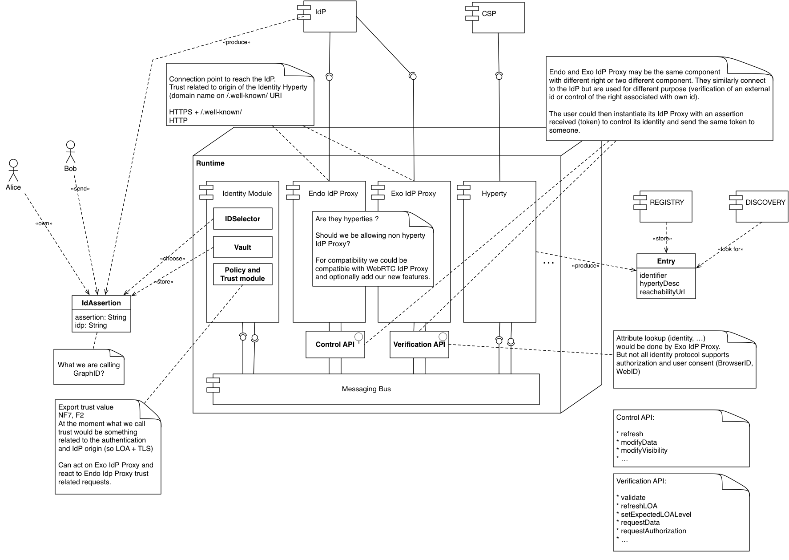

**questions and answers as discussed on 7th July meeting:**

-   **Q: Identity Module similar to Runtime Arch Identities Container?**
-   A: Yes
-   **Q: If Yes, I would separate authorisation related functionalities
    from IDSelector/Vault to support other types of policies**
-   A: agreed
-   **Q: Endo IdP Proxy / Exo Proxy seems to be more related with
    protocol stubs ie it is a stub that enables runtime components to
    interact with back-end side Identity Management functionalities.
    Anyway, not clear the differences between the two**
-   A: In principle IdP Proxy can be partially supported by a IdP
    protocol stub, but some functionalities can be supported by an
    Hyperty or by the Identities Container. Such separation requires
    further study and work on specific Use Cases. Endo is to handle "my
    identity" and Exo is to verify the Identities of others.
-   **Q: Registry / Discovery are runtime local?**
-   A: yes

According to work session on the 14th July, the following use cases were
distributed among partners:

#### [User Registration](user-registration.md)

PTIN

#### [Discovery](discovery.md) : Protocol Stub URL, Hyperty, User

DT

#### [Login into Domain](domain-login.md)

PTIN

#### [Associate User Identity to Hyperty Instance](user-to-hyperty-binding.md)

INESC, Orange(?)

#### [Assert User Identity](user-identity-assertion.md)

Quobis, Orange(?) **pending**

#### [User Profile Management](user-profile-management.md)

### User Registration

<!--
@startuml "user-registration.png"

autonumber

!define SHOW_RuntimeA

!define SHOW_AppAtRuntimeA

!define SHOW_NativeAtRuntimeA
!define SHOW_JavascriptEngineAtRuntimeA
!define SHOW_HTTPClientAtRuntimeA

!define SHOW_CoreRuntimeA
!define SHOW_MsgBUSAtRuntimeA
!define SHOW_RegistryAtRuntimeA
!define SHOW_IdentitiesAtRuntimeA
!define SHOW_AuthAtRuntimeA
!define SHOW_CoreAgentAtRuntimeA

!define SHOW_SP1SandboxAtRuntimeA
!define SHOW_Protostub1AtRuntimeA
!define SHOW_ServiceProvider1HypertyAtRuntimeA
!define SHOW_ServiceProvider1RouterAtRuntimeA
!define SHOW_IdentityObjectAtRuntimeA

!define SHOW_SP1

!include ../runtime_objects.plantuml

== Deploy protocol stub and Registration Hyperty ==

Alice -> HTTP_UAC@A : download\nRegistration App

HTTP_UAC@A -> SP1 : download Registration App

create App@A
JS@A -> App@A : new

group deploy protocol stub

    App@A -> RunUA@A : download protocol stub

    note right
        detailed in a separated diagram
    end note

    create Proto1@A
    RunUA@A -> Proto1@A : new
end

group deploy Hyperty

    App@A -> RunUA@A : download hyperty

    note right
        detailed in a separated diagram
    end note

    create SP1H@A
    RunUA@A -> SP1H@A : new

    create Router1@A
    RunUA@A -> Router1@A : new
end

== Create Identity Account ==

App@A -> Alice : request\nRegistration\nData

App@A <- Alice : Registration\nData\nprovided

App@A -> SP1H@A : Registration Data provided

create IDObj@A
SP1H@A -> IDObj@A : new(data collected)

SP1H@A -> Router1@A : report Identity Data to backend

Router1@A -> Router1@A : enforce SP1\nIdentity Creation \nPolicies

BUS@A <- Router1@A : send Identity Obj Msg

Proto1@A <- BUS@A : send Identity Obj Msg

Proto1@A -> SP1 : send Identity Obj Msg

Proto1@A <- SP1 : Success\nID Token

Proto1@A -> BUS@A : Success\nID Token

RunReg@A <- BUS@A : Register Hyperty

RunReg@A -> RunID@A : Set ID Token

BUS@A -> Router1@A : Success

Router1@A -> SP1H@A : Success

IDObj@A x<- SP1H@A : Delete Obj

group Hyperty Instance Registration 
    Proto1@A <- RunReg@A : register Hyperty\n+ID Token

    Proto1@A -> SP1 : register Hyperty\n+ID Token
end group

@enduml
-->

In this use case, it is considered there is a single protocol stub to
interact with all back-end services including Identity Management.
Another option is to have different protocol stubs to interact with
different back-end services including authentication, authorisation and
messaging services.

Discovery
---------

The picture shows Discovery of a Hyperty. The first picture is about the
preparation or "How comes the HYperty URL into the Discovery service?".
The second pictury is about "How to find this information?" and "How to
use it?".

### Prepare Discovery

### Use Discovery

### Domain Login

<!--
@startuml "domain-login.png"

autonumber

!define SHOW_RuntimeA

!define SHOW_CoreRuntimeA
!define SHOW_MsgBUSAtRuntimeA
!define SHOW_RegistryAtRuntimeA
!define SHOW_IdentitiesAtRuntimeA
!define SHOW_AuthAtRuntimeA
!define SHOW_CoreAgentAtRuntimeA

!define SHOW_SP1SandboxAtRuntimeA
!define SHOW_Protostub1AtRuntimeA
!define SHOW_ServiceProvider1HypertyAtRuntimeA
!define SHOW_ServiceProvider1RouterAtRuntimeA
!define SHOW_IdentityObjectAtRuntimeA

!define SHOW_SP1

!include ../runtime_objects.plantuml

== Deploy protocol stub and Service Provider Hyperty ==

group Deploy Protocol Stub diagram included in the Basics 

    create Proto1@A
    RunUA@A -> Proto1@A : new
end

group Deploy Hyperty diagram included in the Basics 

    create SP1H@A
    RunUA@A -> SP1H@A : new

    create Router1@A
    RunUA@A -> Router1@A : new
end

group Associate Hyperty with Identity diagram included in the IdM 
    RunUA@A -> RunReg@A : set Identity
end

    RunUA@A -> SP1H@A : start

alt explicit Login 
    note over RunUA@A
        A first option is the Hyperty 
        to explicitely ask to connect 
        with a certain Id.
    end note

    SP1H@A -> Router1@A : postMessage(login message)

    BUS@A <- Router1@A : postMessage(login message)

    BUS@A -> RunReg@A : setIdentity(HypertyURL, Identity.Identifier)

    BUS@A -> RunReg@A : getToken(HypertyURL)

    RunReg@A -> RunID@A : getToken(Identifier)

    RunReg@A <- RunID@A : IDToken

    BUS@A <- RunReg@A : IDToken

    BUS@A -> BUS@A : add Token to message

    BUS@A  -> Proto1@A : postMessage( connect message with ID Token)

    Proto1@A -> SP1 : connect(ID Token)

    SP1 -> SP1 : validate ID Token

    Proto1@A <- SP1 : Success\nSession Token Granted

    note over Proto1@A
        session token is handled by the protoStub
        or by the Registry?
    end note

else implicit Login

    note over RunUA@A
        In second option, the protostub only
        connects when requested to send a message
        eg to register a new Hyperty Instance.
        In this case the ID Token contained in the
        message is used in the connection.
    end note

    group Register Hyperty in Deploy Hyperty diagram included in the Basic
        RunUA@A -> RunReg@A : register Hyperty

        BUS@A <- RunReg@A : register Hyperty\n(+ID Token)

        Proto1@A <- BUS@A : register Hyperty\n(+ID Token)

    end

    Proto1@A -> Proto1@A : not connected yet

    Proto1@A -> SP1 : connect(ID Token)

    SP1 -> SP1 : validate ID Token)

    Proto1@A <- SP1 : Success\nSession Token Granted

    note over Proto1@A
        session token is handled by the protoStub
        or by the Registry?
    end note

    Proto1@A -> SP1 : register Hyperty\nSession Token

end

Proto1@A -> BUS@A : Session Token Granted

BUS@A -> RunReg@A : setStatus(protostubURL, status, session token)

BUS@A -> Router1@A : postMessage(login response message)

SP1H@A <- Router1@A : postMessage(login response message)

@enduml
-->
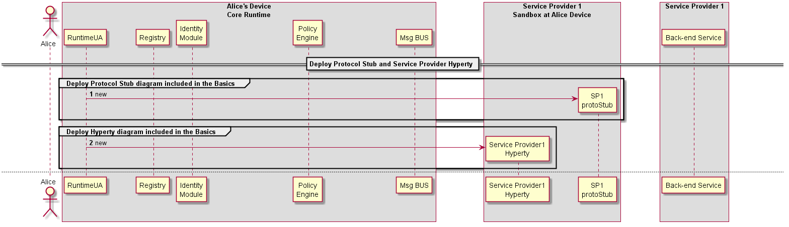

In this use case, it is considered there is a single protocol stub to
interact with all back-end services including Identity Management.
Another option is to have different protocol stubs to interact with
different back-end services including authentication, authorisation and
messaging services.

### Associate User Identity to Hyperty Instance

#### Description of the protocol steps:

This sequence details the steps needed to associate the user identity to
a given Hyperty instance.

*1*- Create ProtoSutb1 sandbox.

*2*- Create Hyperty 1 instance for Service Provider 1.

*3*- Create SP1 router and the respective PEP connector.

*4*- The application using Hyperty 1, triggers a request to set the
Identity to be associated to this Hyperty instance. This request is sent
to the SP1 router to be touted to the RunTime UA

*5*- Optimally the SP1 router checks the policies of the application
itself in regard to the internal identity rule/policies. note that, this
verification is internal and not related with the verification performed
by the Core Runtime.

*6*- SP1Router send the request (if authorized by the Application
internal rules) to associate a identity to the Hyperty 1 instance. This
request is sent to the Core Runtime Message Bus. This request includes
the Identification Token of Hyperty 1.

*7*- The MsgBus sends the Hyperty-user association to the RunTime
UserAgent.

*8*- The RunTime UserAgent 'selects' the user identity to be used
(eventually by asking Alice which used ID to use) and sends it to the
Registry.

*9*- The registry sends a request to the Identities Engine.

*10*- The Identities Engine replies with the identity token (ID Token)
for the selected user. This step assumes that a identity Token has
already exists for the requested user. If it does not, a [Domain
Login](domain-login.md) must be performed.

*11*- The Registry sends a request to the Authorization/Policy engine to
verify if the User Identity association request by the Hyperty Instance
is authorized by the existing Policies.

*12*- If the association is allowed a success message is replied to the
registry. If not a reject message is replied (not depicted in the
figure).

*13*- The Register Engine generates an Association Token. This
Association Token will allow the Hyperty instance to use the requested
ID Token.

*14*- The created ID Association Token is sent to the SP1 router.

*15*- The router forwards the ID Association Token to the Hyperty
instance (how requested it).

*16*- Hyperty 1 created a new ID Association Token object.

Note: This association protocol is assuming that the request for the ID
association is triggered by the Application/Hyperty instance. The Second
option is for the association action to be triggered by the User Agent
(RuntimeUA). In this case steps 4 to 7 need to be changed.

Question: Which option should be provided? If both, which should be the
default one?

### User identity assertion sequence diagram (proposition)

In this sequence, Alice Hyperty receives an Identity Assertion from its
signaling/backend service. Before prompting the user with the asserted
identity (e.g. an incoming call notification) it must be verified. The
hyperty thus uses the Verification API to ask the runtime to verify the
received assertion. Communication with the Runtime is done through the
Msg bus.

Upon receiving the verification request, the runtimeUA instantiate an
IdP Proxy from a URL. This URL is given in the IdToken. Alternatively
the IdP Proxy may already have been instantiated. Once instantiated, the
RuntimeUA uses it to verify the IdToken. Communication with the IdP
Proxy is also done through the Msg bus.

If the IdToken is validated, the RuntimeUA confirms the validity to the
Hyperty.

M2M Intra-domain communication
------------------------------

To be aligned with [WP2 dynamic
viw](https://github.com/reTHINK-project/architecture/tree/master/docs/dynamic-view/M2M%20Communication)

### [Overview](m2m-comm-overview.md)

### [Bootstrap, Authentication and Registration](m2m-bootstrap-auth-registration.md)

FOKUS (Ancuta)

To be aligned with [Domain
Login](../identity-management/domain-login.md)

To be aligned with [Domain Login](../basics/deploy-hyperty.md) and
[Associate User Identity with Hyperty
Instance](../identity-management/user-to-hyperty-binding.md)

#### [Context Discovery](m2m-intra-comm-3-discovery.md)

Paulo (PTIN)

#### [PUB-SUB Communication](m2m-intra-comm-4-pub-sub.md)

Paulo (PTIN)

The overview of the M2M End-User runtime components and their
interaction with the Management Services and Network Services is
presented in the diagram below.
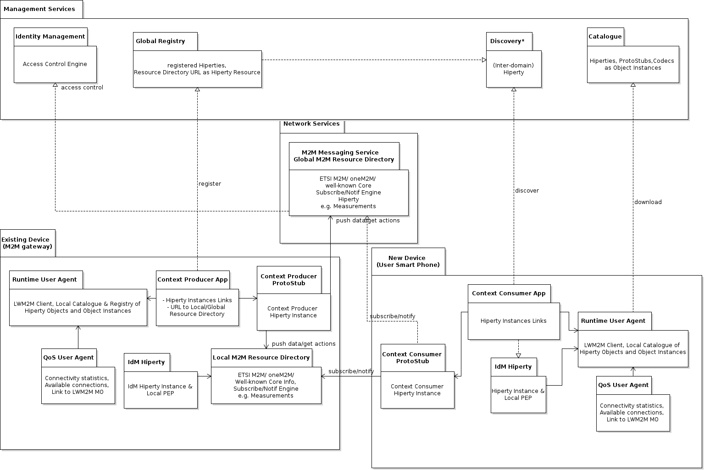

### M2M Intra Communication : Context Discovery

<!--
@startuml "m2m-intra-comm-3-discovery.png"

autonumber

!define SHOW_RuntimeA

!define SHOW_NativeAtRuntimeA

!define SHOW_SP1SandboxAtRuntimeA
!define SHOW_Protostub1AtRuntimeA
!define SHOW_ServiceProvider1HypertyAtRuntimeA
!define SHOW_ServiceProvider1RouterAtRuntimeA

!define SHOW_CoreRuntimeA
!define SHOW_MsgBUSAtRuntimeA

!define SHOW_SP1

!include runtime_objects.plantuml

== Discover Home Energy Context ==

SP1H@A -> Router1@A : discover Home\nEnergy Context

Router1@A -> BUS@A : discover Home\nEnergy Context

Proto1@A <- BUS@A : discover Home\nEnergy Context\n+Access Token

SP1 <- Proto1@A : discover Home\nEnergy Context\n+Access Token

SP1 -> SP1 : match Energy Context Consumer\nand Producer descriptors

SP1 -> Proto1@A : Return Home \nEnergy Context URL

Proto1@A -> BUS@A : Return Home \nEnergy Context URL

Router1@A <- BUS@A : Return Home \nEnergy Context URL

SP1H@A <- Router1@A : Return Home \nEnergy Context URL

@enduml
-->

**[Previous: Device Bootstrap, Authentication
Registration](m2m-bootstrap-auth-registration.md)**

Steps 1 - 4: The Energy Context Consumer Hyperty requests to Discover
the Home Energy Context through the Gateway Protocol Stub.

**READ Message**

    "id" : "1"
    "type" : "READ",
    "from" : "hyperty-instance://alice.home/washmachinehy123",
    "to" : "alice.home",
    "body" : { "resource" : "alice.home/registry/context", 
                "criteria" : {"tag" : "energy"},
                "projection" : {"url" : 1} }

Steps 5: The Residential Gateway finds the Energy Context Provider
(HEMS) instance in its registry. It performs a match between its
descriptor and the Energy Context Consumer (Wash Machine) descriptor to
verify that both are compliant.

Steps 6 - 9: The Home Energy Context URL is returned to the Energy
Context Consumer Hyperty.

**RESPONSE to READ Message**

    "id" : "1"
    "type" : "RESPONSE",
    "from" : "alice.home",
    "to" : "hyperty-instance://alice.home/washmachinehy123",
    "body" : { "code" : "200" , "description" : "ok",
            "value" : {"url" : "ctxt://alice.home/energy"}}

### M2M Intra Communication : PUB-SUB Communication

**[Previous: Context Discovery](m2m-intra-comm-3-discovery.md)**

<!--
@startuml "m2m-intra-comm-4-pub-sub-1.png"

autonumber

!define SHOW_RuntimeA

!define SHOW_NativeAtRuntimeA

!define SHOW_SP1SandboxAtRuntimeA
!define SHOW_Protostub1AtRuntimeA
!define SHOW_ServiceProvider1HypertyAtRuntimeA
!define SHOW_ServiceProvider1RouterAtRuntimeA
!define SHOW_ContextObjectAtRuntimeA
!define SHOW_Syncher1AtRuntimeA

!define SHOW_CoreRuntimeA
!define SHOW_MsgBUSAtRuntimeA

!define SHOW_SP1

!include runtime_objects.plantuml

== M2M PUB-SUB Communication Setup ==

SP1H@A -> Router1@A : postMessage\n(Subscribe Energy Context MSG)

Router1@A -> BUS@A : postMessage\n(Subscribe Energy Context MSG)

Proto1@A <- BUS@A : postMessage\n(Subscribe Energy Context MSG)

SP1 <- Proto1@A : Subscribe Energy Context\n HomeGW Protocol MSG

@enduml-->

Steps 1 - 4: The Energy Context Consumer Hyperty requests to Subscribe
the Home Energy Context through the Gateway Protocol Stub.

**SUBSCRIBE Message**

    "id" : "1"
    "type" : "SUBSCRIBE",
    "from" : "hyperty-instance://alice.home/washmachinehy123",
    "to" : "alice.home",
    "body" : { "resource" : "ctxt://alice.home/energy" }

<!--
@startuml "m2m-intra-comm-4-pub-sub-2.png"

autonumber

!define SHOW_SP1

!define SHOW_Runtime1B

!define SHOW_SP1SandboxAtRuntime1B
!define SHOW_Protostub1AtRuntime1B
!define SHOW_ServiceProvider1HypertyAtRuntime1B
!define SHOW_ServiceProvider1RouterAtRuntime1B
!define SHOW_ContextObjectAtRuntime1B

!define SHOW_CoreRuntime1B
!define SHOW_MsgBUSAtRuntime1B

!include runtime_objects.plantuml
group alt Subscription Authorisation enforced in the GW

    SP1 -> SP1 : authorise Energy Context\n Consumer subscription

    SP1 -> Proto1@1B : Read Energy Context Object\n HomeGW Protocol MSG 

    Proto1@1B -> BUS@1B : postMessage\n(Read Energy Context Object MSG)

    Router1@1B <- BUS@1B : postMessage\n(Read Energy Context Object MSG)

    Router1@1B <- Router1@1B : control access to Energy Context by HomeGW

    SP1H@1B <- Router1@1B : postMessage\n(Read Energy Context Object MSG)

else Subscription Authorisation enforced at Context Producer

    SP1 -> Proto1@1B : Subscribe Energy Context\n HomeGW Protocol MSG

    Proto1@1B -> BUS@1B : postMessage\n(Subscribe Energy Context MSG)

    Router1@1B <- BUS@1B : postMessage\n(Subscribe Energy Context MSG)

    Router1@1B <- Router1@1B : control access to Energy Context by New Device

    note left
        It is assumed the Core Runtime asserts the
         message ID Token is coming from a trustful device
         ie it is registered in the GW domain with
         authorisation by Alice. 
         We need a diagram from the IdM group to detail this.
    end note

    Router1@1B -> SP1H@1B : postMessage\n(Subscribe Energy Context MSG)

end

SP1H@1B -> Router1@1B : postMessage\n(Response with Energy Context Object MSG)

Router1@1B -> BUS@1B : postMessage\n(Response with Energy Context Object MSG)

Proto1@1B <- BUS@1B : postMessage\n(Response with Energy Context Object MSG)

SP1 <- Proto1@1B : Response with Energy Context Object\n HomeGW Protocol MSG

@enduml-->

Two options to handle with Subscription Auhtorisation:

**Option 1: Authorisation enforced in the GW**

Steps 1 : The Residential Gateway uses local policies to authorise the
subscription request.

Steps 2 - 6: The Residential GW requests the Device holding the Context
to retrieve the most updated Energy Context Data object. Through a READ
message.

**READ Message**

    "id" : "1"
    "type" : "READ",
    "from" : "alice.home",
    "to" : "hyperty-instance://alice.home/hemshy123",
    "body" : { "resource" : "ctxt://alice.home/energy" }

**Option 2: Authorisation enforced in the Device**

Steps 7 - 11 : The subscription request is forwarded to existing device
Policy Enforcer which applies local policies to give permission to
forward the message to the Producer Hyperty. It is assumed the Core
Runtime asserts the message ID Token is coming from a trustful device ie
it is registered in the GW domain with authorisation by Alice. (to be
detailed in a separated IdM related diagram). *question:* should the
Policy Enforcer respond with the Context Data Object without interacting
with the Hyperty instance but only with the object?

Steps 12 - 15: The Hyperty responds with the most updated Context Data
object.

**RESPONSE to READ or SUBSCRIBE Message**

    "id" : "1"
    "type" : "RESPONSE",
    "from" : "hyperty-instance://alice.home/hemshy123",
    "to" : "hyperty-instance://alice.home/washmachinehy123", // for subscribe message response
    "to" : "alice.home", // for read message response
    "body" : { "code" : "200" , "description" : "ok",
            "value" : { <Energy Context Data Object>}}

<!--
@startuml "m2m-intra-comm-4-pub-sub-3.png"

autonumber

!define SHOW_RuntimeA

!define SHOW_NativeAtRuntimeA

!define SHOW_SP1SandboxAtRuntimeA
!define SHOW_Protostub1AtRuntimeA
!define SHOW_ServiceProvider1HypertyAtRuntimeA
!define SHOW_ServiceProvider1RouterAtRuntimeA
!define SHOW_ContextObjectAtRuntimeA
!define SHOW_Syncher1AtRuntimeA

!define SHOW_CoreRuntimeA
!define SHOW_MsgBUSAtRuntimeA

!define SHOW_SP1

!include runtime_objects.plantuml

SP1 -> Proto1@A : Response with Energy Context Object\n HomeGW Protocol MSG

Proto1@A -> BUS@A : postMessage\n(Response with Energy Context Object MSG)

Router1@A <- BUS@A : postMessage\n(Response with Energy Context Object MSG)

SP1H@A <- Router1@A : postMessage\n(Response with Energy Context Object MSG)

create CtxtObj@A
SP1H@A -> CtxtObj@A : new

create Sync1@A
SP1H@A -> Sync1@A : new

SP1H@A -> Sync1@A : observe(Context Data Object)

SP1H@A -> Router1@A : setReceiver( syncher.postMessage )

@enduml
-->

Steps 1 - 4: The Subscription Response with Energy Context Data Object
reachs the Consumer Hyperty.

Steps 5 - 8: Context Consumer Hyperty instantiates the received Energy
Context Data Object and sets as an observer of it. Then, instantiates an
Observer Syncher to observe it.

#### Implementation Considerations according to Device Types

The following runtime types according to devices types are considered:

1.  Devices featuring Browsers like PCs, Smartphones and Tablets
2.  Native Apps featuring some GUI deployed in End-user Devices like
    PCs, Smartphones and Tablets
3.  IoT/M2M Gateways that aggregates sensors and atuators using
    different IoT/M2M networking technologies
4.  Network Server Virtual Machine used eg Media Server, Media Gateway,
    App Server, etc
5.  

For each of these runtime types we should analyse the best strategy to
support Hyperty Runtime functionalities identified above.

Possible Strategies: \* Browser Extensions \* Docker+NodeJs \*
Docker+JDK8 \* NodeJs \* JDK8 \* Javascript shim layer to be used in
Browsers without extensions ie files implementing the Shim layer would
be downloaded with the Hyperty

##### [Browser Runtime](browser-runtime.md)

##### [Standalone Runtime](browser-runtime.md)

##### [M2M/IoT Gateway Runtime](gw-runtime.md)

#### Browser Runtime Implementation

<!--
@startuml "Runtime_Browser_Implementation.png"

title Packages - Component Diagram

node "WebRTC Device" {
  [Device WebRTC API] as WebRTCDevice
}

node "Auth" {
  [Auth Server] as Auth
}

node "Message Node" {
  [Message Node] as MNode
}

rectangle "host | app.domain" {

    component [video] as GUIVideo
    component [app.js] as App
    
    component [HypertyAPIStub] as PeerLocal
    component [WebRTC API] as WebRTCApiLocal

    rectangle rething.js {
  
        component [API Stub] as APIStub

        rectangle "iframe | reThink.domain" {
        
            component [ReThink WebRTC] as PeerRemote
            component [WebRTC API] as WebRTCApiRemote
            
            component [Service Worker] as ServiceWorker
            note bottom
                Cache all
                application
                files
            endnote
            
            component [RunTime\nUser Agent] as Agent
            note bottom
                Install all
                components
                needed, after
                auth
            endnote

            node "Web Worker\nwith ProtoStub" as WPS {
              [ProtoStub] as PS
              [Hyperty\nWebRTCAgent] as HWRTCA
            }
        
            node "Web Worker\nHyperty 2" as W2 {
              component [API Skeleton] as APIS2
              [hyperty 1] as H1
            }
        
            node "Web Worker\nHyperty 3" as W3 {
              component [Service Provider2\nPolicy Enforcer]
            }

            node "Core Sandbox" as Core {
            
                component [Registry] as Registry
                component [Identities\nContainer] as IContainer
                component [Msg BUS\nPEP] as Policy
                component [Policy Decision (PDP)\n(incl Authorisation)\n+Policies Repository )] as PDP
                
            
                rectangle "Message Bus Events" as MsgBusEvent {
                    component [* Message BUS *] as MsgBus
                }
            }

        }
    }
}

Auth <-[hidden]up-> WebRTCDevice
WebRTCApiRemote <-[hidden]down-> Core

App -down-> APIStub
APIStub -down-> MsgBus

GUIVideo -left-> PeerLocal
PeerLocal <-left-> WebRTCApiLocal
PeerLocal <-down-> PeerRemote : Peer Connection
PeerRemote <-right-> WebRTCApiRemote
PeerRemote <-down-> HWRTCA  : only postMessage\nare allowed
WebRTCApiRemote <-up-> WebRTCDevice : WebRTC API\nConnection with\nexternal device

Registry -right-> MsgBusEvent
IContainer -left- Registry

MsgBus <-down-> Policy
PDP -right-> Policy

PS <-right-> MNode

Policy <-right-> W3 : only postMessage\nare allowed
Policy <-left-> W2 : only postMessage\nare allowed

Agent <-right-> Auth : Verify\ncredentials

@enduml
-->
-   A Service Worker is used to manage the cache of Runtime Core
    Components
-   Hyperties and Protocol Stubs are implemented inside Web Workers
-   Runtime Core components, Hyperties and Protocol Stub are executed
    inside an iFrame loaded from reTHINK runtime provider domain
-   Web Workers are only able to interact each other with
    self.postMessage(..) which is caught by
    window.addEventListener('message', handleSizingResponse, false);
    implemented by the Runtime MsgBUS Core Component
-   The same Service Worker may also be used to manage the cache of
    Hyperties and protostubs
-   Since it is not possible to use webrtc APIs inside a web worker,
    there will be a "reTHINK WebRTC" component inside the iFrame but
    outside the web worker, that is in charge of interacting with the
    WebRTC API on behalf of Hyperties running inside Web Workers,
    through messages exchanged between Hyperties and the "reTHINK
    WebRTC". There will be a "HypertyWebRTCAgent" that will expose
    standard WebRTC APIs to be used by the Hyperty. In this way the
    Hyperty is not aware that it is not interacting directly with the
    native WebRTC API. It should be analysed whether communication
    between "reTHINK WebRTC" and "HypertyWebRTCAgent" will be supported
    by the Message BUS or by something else.
-   Since the Hyperty API to be consumed by the Application can't be
    directly used by the App (cos it is inside a Web Worker) there will
    a kind of RPC communication through messages exchanged between the
    HypertyAPIStub component running on the App side and an API Skeleton
    running on Hyperty side. It should be analysed whether communication
    between these components will be supported by the Message BUS or by
    something else.
-   in addition, and since it is not possible to pass WebRTC Media and
    Data Streams handled inside the iFrame towards the Application that
    is outside the iFrame, a local loop peerconnection is established
    between the "reTHINK WebRTC" and the "HypertyAPIStub" running on
    Application side. See more details below.

Runtime Architecture with IFrame
--------------------------------

After some investigation we find away to send stream from app client to
iframe with our domain. We use peer connection to send media stream.

#### how it works

The peer getUserMedia from app client and make a call to peer inside the
rethink iframe, and this answer with null stream (we send stream one
way), after this, peer can send the stream through peer connection to
another client.

We need to do an experimentation code to make an complete validation for
this architecture.

Considerations about the implementation of Runtime for standalone applications
==============================================================================

A couple of tools have emerged to build native apps using standard web
technologies. Among them: - crosswalk - cordova / phonegap / ionic

Crosswalk
---------

Crosswalk is a runtime for mobile and desktop web applications. It
enables to deploy standard web application for various devices
(Android/IOS/Linux). It is based on Chrome and Blink for rendering.

By using the Crosswalk Project, an application developer can:

-   Use all the features available in modern web browsers: HTML5, CSS3,
    JavaScript.
-   Access the latest recommended and emerging web standards.
-   Use experimental APIs not available in mainstream web browsers.
-   Control the upgrade cycle of an application by distributing it with
    its own runtime.
-   Add custom extensions to an application, to leverage platform
    features not exposed by Crosswalk or the standardized web platform.
-   Crosswalk supports WebRTC applications so it makes possible to send
    and receive real-time flows from Android and iOS devices.

Crosswalk Architecture
----------------------

Crosswalk supports an efficient way of creating your own Web APIs as
extensions by writing native Java code. This way the user can expose new
platform and device APIs as they need them. New Api could be available
in crosswalk before they get standardized at the W3C level.

cordova /Ionic / phonegap
-------------------------

Apache Cordova is a library used to create native mobile applications
using Web technologies. The application is created using HTML, CSS and
JavaScript and compiled for each specific platform using the platform
native tools. Cordova provides a standard set of JavaScript APIs to
access device features on all supported platforms. Additional features
can be provided through the development of plugins

Cordova functionnal schema
--------------------------

The application itself is implemented as a web page, by default a local
file named index.html, that references whatever CSS, JavaScript, images,
media files, or other resources are necessary for it to run. The app
executes as a WebView within the native application wrapper, which you
distribute to app stores.

At its core, Cordova offers a simple but powerful API to call Javascript
functions that map to native code or plugins. This means you can
transfer any kind of data from native land into web land. Cordova can do
almost a native app can do, it just needs the right plugins that send
the right data to your web code

Cordova plugins
---------------

A Cordova plugin bridges a bit of functionality between the WebView
powering a Cordova application and the native platform the Cordova
application is running on. Plugins are composed of a single JavaScript
interface used across all platforms, and native implementations
following platform-specific Plugin interfaces that the JavaScript will
call into. It should be noted that all of the core Cordova APIs are
implemented using this exact architecture. Cordova has a high quality
plugin API, we just need more great plugins that expose data from the
native layer, not just hard coded features or UIs. While the default
plugins are very simple and easy to use, they don’t scale well when you
want to build something really custom

Some plugin examples
--------------------

### iosrtc

iosrtc is a wrapper around Google’s WebRTC library and simply provides
PeerConnection, getMediaDevices and getUserMedia APIs , without any
limitations or artificial constraints.

### Crosswalk-based Cordova Android

Crosswalk-based Cordova Android is derived from Cordova Android and uses
Crosswalk as the HTML5 runtime. It is an Android application library
that allows for Cordova-based projects to be built for the Android
Platform. It is aimed at replacing default Android Webview with
Crosswalk Webview, bringing all new functionalities of Chrome.

This solution has been succesfully used by companies part of the reTHINK
project to develop WebRTC hybrid applications so it is a suitable
candidate to be used to implement standalone reTHINK applications for
Android.

Cordova vs PhoneGap
-------------------

Cordova is the community powered version of PhoneGap, which is Adobe’s
productized version and ecosystem on top of Cordova.

Cordova vs Ionic
----------------

Ionic uses and extends Cordova

Webview
-------

The WebView class is an extension of Android's View class that allows
you to display web pages as a part of your activity layout. It does not
include any features of a fully developed web browser, such as
navigation controls or an address bar. All that WebView does, by
default, is show a web page. This allows to leverage features provided
by the browser engine in any App without adding extra libraries.

Since Android 4.4 (KitKat), the WebView component is based on the
Chromium open source project. WebViews now include an updated version of
the V8 JavaScript engine and support for modern web standards previously
missing in old WebViews. New Webviews also share the same rendering
engine as Chrome for Android, so rendering should be much more
consistent between the WebView and Chrome.

In Android 5.0 (Lollipop), the WebView has moved to an APK so it can be
updated seperately to the Android platform.

### Webview WebRTC support

From WebView v36 WebRTC is supported so it makes easier to add WebRTC
capabilities to any native. Webview 36.0.0.0 is still a developer
preview version so it can not be used in official Apps currently but it
is expected to become soon the stable release..

### Crosswalk vs Webview

The size of the apps is lower compared to Crosswalk applications which
must include all the libraries to implement the browser functionality.
The WebView can be updated separately from the rest of the application.
This can be an advantage as it will allows to fix any kind of issue and
support new features, but it may cause issues if the App using it is not
updated to fix any possible incompability.

One of the obvious drawbacks is that Webview is not available in iOS.

### Runtime implementation in Constrained Devices

NodeJs is considered one of the options for implementing the Runtime API
for platforms like Raspberry PI and [Beagle
Board](http://beagleboard.org/bone):

http://elinux.org/Node.js\_on\_RPi

http://beagleboard.org/Support/BoneScript

https://www.npmjs.com/package/node-sandbox

A package for LWM2M is already available for NodeJs
(https://github.com/telefonicaid/lwm2m-node-lib).

#### Also potentially relevant:

http://samsung.github.io/iotjs/

also see:
https://github.com/reTHINK-project/core-framework/blob/master/docs/specs/runtime/implementation/standalone-runtime.md

[Messaging Node Architecture](msg-node-architecture.md)
-------------------------------------------------------

[Specification of Messaging Node implementation with Vertx.io version 3.0](vertx_specs.md)
------------------------------------------------------------------------------------------

[Specification of Messaging Node implementation with Node.js](nodejs_specs.md)
------------------------------------------------------------------------------

[Specification of Messaging Node implementation with matrix.org](matrix_specs.md)
---------------------------------------------------------------------------------

Messaging Node Architecture
---------------------------

Below, it is depicted a functional architecture of the Messaging Node:

<!--
@startuml "Messaging_Node_Architecture.png"

node "Management Services" as Man1 {
    node "Registry" as Server1
    node "Identity Management" as IdM1

}

node "Service Provider 2" as SP2 {
    node "Messaging\nNode" as Msg2
    node "Repository\nServer" as Repo2
}

node "End-User Device 1" as User1 {
    node "Hyperty" as H1
}

node "End-User Device 2" as User2 {
    node "Hyperty" as H2
}

node "Network Server" as Net {
    node "Hyperty" as H3
}

node "Messaging Node" as msg {

 node "ProtoStub\nSandbox" as Proto1Sand {

     node "SP2 ProtoStub" as Proto1
 }

node "Connectors" as Conn {
    node "IdM\nConnector" as ConnIdM
    node "Registry\nConnector" as ConnMan
    node "End-User Device\nConnector" as ConnUser
    node "Network Server\nConnector" as ConnNet
}

node "Core Functionalities" as core {

 node "*            Message      BUS                *" as Bus 

 node "Access Control\nPEP" as BusPEP

 node "Session Management" as Reg

 node "Address Allocation\nManagement" as ID

 }

Repo2 ..down-> Proto1: provide

Msg2 <-left-> Proto1 : communicate

 Bus <-right-> Proto1

 BusPEP ..right-> Bus : enforce

 ConnIdM ..down-> BusPEP : authorise

 BusPEP .down-> Reg

 Reg .left. ID

 Reg <-up. Bus: session valid?

 ConnIdM <-up-> IdM1 : authorise 

 Bus <-up-> ConnUser : communicate 
 ConnUser <-up-> H1 : communicate 

 ConnUser <-up-> H2 : communicate 

 Bus <-up-> ConnNet : communicate 
 ConnNet <-up-> H3 : communicate 

 Bus <-up-> ConnMan : communicate 
 ConnMan <-up-> Server1 : communicate
    }

@enduml
-->
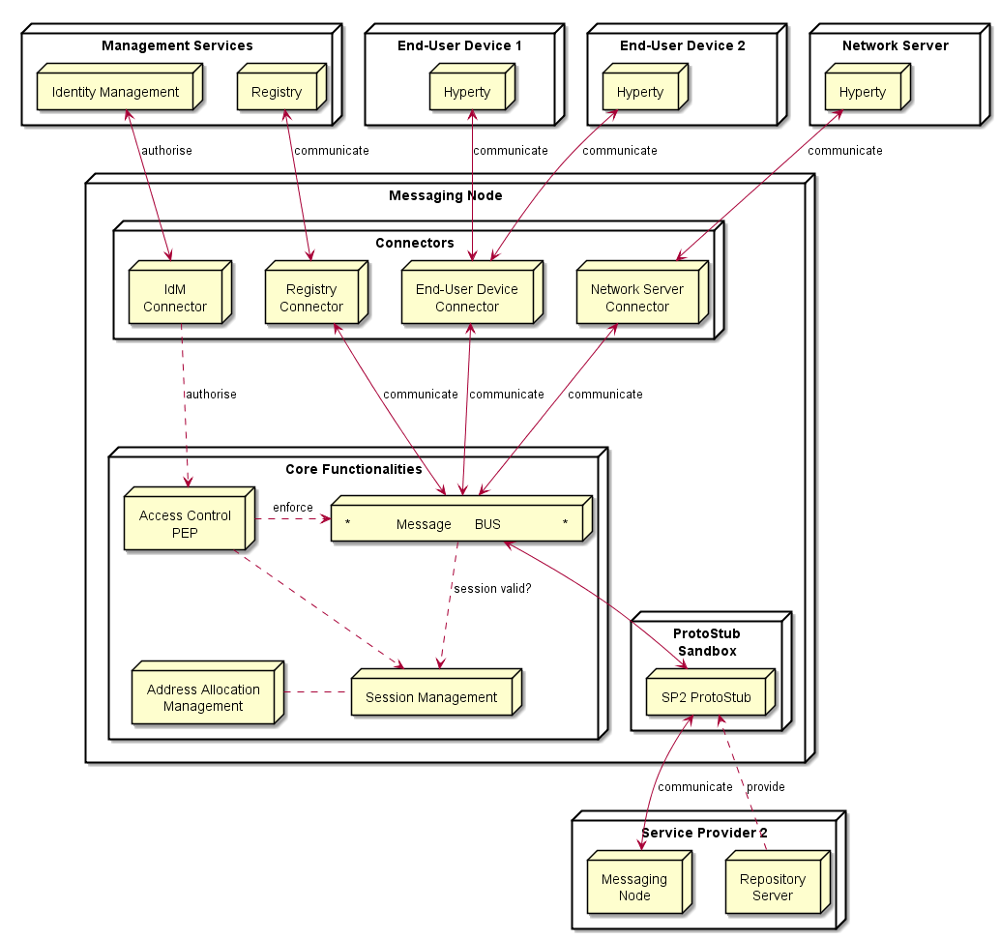

The Messaging Node is comprised by three main types of functionalities:

The Core Functionalities, Connectors and Protocol Stubs.

### Core Functionalities

#### Message BUS

Routes messages to internal Messaging Node components and external
elements by using Connectors or Protocol Stubs. It supports different
communication patterns including publish/subscribe communication.

#### Access Control

Message Routing including pub/sub Subscriptions are subject to Access
Control in cooperation with authentication and authorisation provided by
Identity Management functionalities.

#### Session Management

Session Management functionalities are used to control messaging
connections to service provider back-end services. For example, when
user turns-on the device and connects to its domain, providing
credentials as required by Identity Management functionalities. In
general, each message should contain a valid token that was generated
when the used connected to the Messaging Node. It also manages the
registry of protocol stubs and connectors supported by the Messaging
Nodes to support the routing of messages to these components.

#### Address Allocation Management

Manages allocation of messaging addresses to Hyperty Instances in
cooperation with Session Management when users connect to the domain.

It also manages the allocation of messaging addresses to foreign Hyperty
Instances i.e. Hyperty Instances that are provided from external domains
but that use the protofly concept to interact with Hyperty Instances
served by this Messaging Node.

### Protocol Stub

In special situations eg when the download of external software
(protocol stubs) into end-user devices is not allowed, it should be
possible to have interoperability between Messaging Nodes from different
domains by using the protofly concept.

Thus, a Protocol Stack to be used to communicate with another Messaging
Node can be deployed.

### Connectors

Connectors implements protocol stacks used to interoperate with external
elements from the domains, including:

-   IdM Connector to interact with remote Identity Management
    functionalities

-   Registry Connector to interact with remote Registry functionalities

-   End-User Device Connector to interact with Hyperty Instances running
    in the end-user device

-   Network Server Connector to interact with Hyperty Instances running
    in a Network Server

Vertx Specification
===================

*For each [functional block](msg-node-architecture.md) identify existing
vertx components that can be reused and extended If extensions are neede
they should be specificied by designing apis to be implemented*

Core Functionalities
--------------------

-   Main objective of core func. is to authorize, filter and process
    messages. Messages are JSON objects that should have 2 blocks,
    HEADER and BODY, and are processed from different components of
    core. Inbound messages should be processed in a Pipeline. The
    sequence is "Session Management" -\> "Access Control" -\> "Message
    BUS"
-   Pipeline components will implement a simple interface that we can
    reuse from io.vertx.core.Handler\<E\> replacing E with a
    PipelineContext object. Using the vertx Handler<E> has the advantage
    to be compatible with io.vertx.ext.web.Router, that can be a
    replacement for the Pipeline.
-   Outbound messages should be processed in a Pub/Sub system. If
    message BODY block are for CRUD operations, there should be a
    Pub/Sub protocol for object/model subscriptions, where should this
    be processed? The address scheme of the vertx EventBus is not enough
    for this functionality. We need to control the Pub/Sub functionality
    better than what vertx give to us with the address scheme! Hyperties
    need to subscribe to objects/collections not just addresses.

### Pipeline

By now, additional components are identified (Pipeline,
PipelineContext). This is similar to vertx Router but without the URL
addressing scheme. The io.vertx.ext.web.Router class could be a possible
candidate for Pipeline functionalities, however the Router is hard coded
to work with HTTP protocols, and there is no need for static
configurations of routing schemes. I would advise to implement a simple
Pipeline system instead of using the Router, less dependencies and
better decoupled from the protocol.

### Session Management

Connection (WebSocket, SockJS) events/messages for OPEN and CLOSE should
be intercepted by this component. A session instance is linked to a
connection resource (WebSocket, SockJS) if authorized. Every message
header is intercepted, session token is verified and if exist, a "user"
or other identification URL is replaced in HEADER. The JSON object is
forwarded to "Access Control" component.

### Address Allocation Management

This is not a Pipeline component (it doesn't process messages), but it's
used by the "Session Management" to allocate Hyperty identification
URL's that will be linked to a Session when the Hyperty is connected.
This will be used to translate Hyperty an URL address into the
correspondent Connector Resource.

### Access Control

This component is able to analyze HEADER (identification URL from
"Session Management") and BODY blocks and decide if the message should
be forwarded to the "Message Bus" or denied. There is a possibility to
add a rule engine in this step, but it's not specified for now, what
kind of rule engine.

### Message BUS

Main objective of the MB is to process the BODY block, that contains
information of the protocol, CRUD operation or other defined
information. Vertx EventBus can be used directly for the Message Bus
component. Important headers of the original JSON (like the
identification URL) must be forwarded to
io.vertx.core.eventbus.Message.headers() map.

Protocol Stub Sandbox
---------------------

Connectors
----------

### End User Device Connector

The aim of this Connector is to enable interaction with Hyperty
instances running in the end-user device. This component will need to
interact somehow with the Protocol Stub sandbox to achieve this, since
the communication protocol will not be standardized. It will need to
implement a simple protocol for sending and receiving requests. In
itself it is not responsible for processing communication requests, that
is left to the protocol stack. It merely forwards messages to and from
the Hyperty instance.

### Network Server Connector

The aim of this Connector is to enable interaction with Hyperty
instances running in a network server. This component will need to
interact somehow with the Protocol Stub sandbox to achieve this, since
the communication protocol will not be standardized. It will need to
implement a simple protocol for sending and receiving requests. In
itself it is not responsible for processing communication requests, that
is left to the protocol stack. It merely forwards messages to and from
the Network server.

### Registry Connector

The Registry provides an interface for registration and deregistration
of Hyperty instances, as well as for keeping the published information
up to date. For each Hyperty instance, the Registry stores data (hyperty
location, type, description, start-time, presence information of user)
that enables other applications to contact it. The implementation of the
Registry service is thought to be basically a distributed database. It
will provide service interfaces for CRUD operations to allow users to
retrieve data for a given GraphID, publish (i.e. create, update, and
delete) their own information on the ring. To verify authenticity and
integrity of the published data, digital signatures will be applied. The
Connector will exposed the available interfaces of the Registry Services
to users of managing Hyperty instances. This will have to be implemented
as a standalone application with an adapter interface to the Event Bus
for encoding and decoding messages and deployed as a fat executable jar
which contain all the dependencies it needs to run on vertx.

### IdM Connector

This Connector is to provide functionalities for interacting with the
remote Identity Management Functionailities. It is unclear if this
should be for authentication purpose, or simply for CRUD operations. In
WP4 there is also discussion on an Identity Module.

*As hyperties need to be linked to an end-user identity when downloaded
and instantiated on a device, an Identity Module should be present on
the device. This module at minimum should act as an identity selector
for the user and as a secure local repository for identity tokens
provided by IdPs*

If this is the case, then it is unclear to me what the connector on the
Messaging Node should do. However, if the connector is thought to
provide authentication and authorisation, Vert.x offers Auth APIs
(Common, JDBC, JWT and Shiro) JWT auth sounds interesting as it uses
JSON web tokens.

Another interesting library is the authentication and discorvery is
[vertx-pac4j] (https://github.com/pac4j/vertx-pac4j). This vertx module
provides multiple authenication mechanisms (OAuh, CAS, HTTP, OpenID,
SAML2.0 and OpenIDConnect) for different IdPs. However, it is based on
vertx.2. So if it suits the requirements, we will need to adapt to
vertx.3.

Node.js Specification
=====================

*For each [functional block](msg-node-architecture.md) identify existing
Node.js modules that can be either reused or extended. If extensions are
neede they should be specificied by designing apis to be implemented*

Core Functionalities
--------------------

-   Main objective of core func. is to authorize, filter and process
    messages. Messages are JSON objects that should have 2 blocks,
    HEADER and DATA, and are processed from different components of
    core.
-   Outbound messages should be processed in a Pub/Sub system. If
    message DATA blocks are for CRUD operations, there should be a
    Pub/Sub protocol for object/model subscriptions, where should this
    be processed? The address scheme of t

### Low level connection management

Socket.io is a popular Node.js library to handle connections at
aplication level. It can use Websocket and it falls back to HTTP
automatically if WS connectivity is not possible.

### Session Management

Events/messages for OPEN and CLOSE received by Socket.io should be
intercepted by this component. A session instance is linked to a
connection resource (WebSocket, SockJS) if authorized. Every message
header is intercepted, session token is verified and if exist, a "user"
or other identification URL is replaced in HEADER. The JSON object is
forwarded to "Access Control" component. <comment> We have to discuss
with our dev team it sth can be re-used to implement the session
management or we have to implement it</comment>

### Address Allocation Management

This is not a Pipeline component (it doesn't process messages), but it's
used by the "Session Management" to allocate Hyperty identification
URL's that will be linked to a Session when the Hyperty is connected.
This will be used to translate Hyperty an URL address into the
correspondent Connector Resource.

### Access Control

This component is able to analyze HEADER (identification URL from
"Session Management") and DATA blocks and decide if the message should
be forwarded to the "Message Bus" or denied. There is a possibility to
add a rule engine in this step, but it's not specified for now, what
kind of rule engine.

### Message BUS

Main objective of the MB is to process the DATA block, that contains
information of the protocol, CRUD operation or other defined
information. Vertx EventBus can be used directly for the Message Bus
component. Important headers of the original JSON (like the
identification URL) must be forwarded to
io.vertx.core.eventbus.Message.headers() map. For the Message Bus we
could use some RabbitMQ by using Rabbit.js node library.

Protocol Stub Sandbox
---------------------

<comment> We understand that we must have a Protocol Stub Sandbox to be
able to interact to other Messaging Servers and the protocol stub will
be retrieved from repository servers. The messgaing server which wants
to interact with another one must download the Protocol Stub from the
Repository and then it will be able to exchange messages. I guess this
is doable in Node.js, but I have to check with our Dev team what's the
best way to implement this in Node.js. </comment>

Connectors
----------

This connector could be ad-hoc developemtns in Node.js, receiving
messages from the session management layer.

### End User Device Connector

The aim of this Connector is to enable interaction with Hyperty
instances running in the end-user device. This component will need to
interact somehow with the Protocol Stub sandbox to achieve this, since
the communication protocol will not be standardized. The Protocol Stub
should expose a common API which will be interacted from the connector.
<comment>This has been already addressed in the WONDER project so we
need to check with Paulo the approach the followed</comment>

### Network Server Connector

The aim of this Connector is to enable interaction with Hyperty
instances running in a network server. This component will need to
interact somehow with the Protocol Stub sandbox to achieve this, since
the communication protocol will not be standardized. It will need to
implement a simple protocol for sending and receiving requests. In
itself it is not responsible for processing communication requests, that
is left to the protocol stack. It merely forwards messages to and from
the Network server.

### Registry Connector

The Registry provides an interface for registration and deregistration
of Hyperty instances, as well as for keeping the published information
up to date. For each Hyperty instance, the Registry stores data (hyperty
location, type, description, start-time, presence information of user)
that enables other applications to contact it. The implementation of the
Registry service is thought to be basically a distributed database. It
will provide service interfaces for CRUD operations to allow users to
retrieve data for a given GraphID, publish (i.e. create, update, and
delete) their own information on the ring. To verify authenticity and
integrity of the published data, digital signatures will be applied. The
Connector will exposed the available interfaces of the Registry Services
to users of managing Hyperty instances.

#### LWM2M library

There is an available [LWM2M/COAP library for
Node.js](https://github.com/telefonicaid/lwm2m-node-lib) which may be
helpful to implement a COAP/interface for constrained devices along with
other interfaces for the rest of devices.

### IdM Connector

This Connector is to provide functionalities for interacting with the
remote Identity Management Functionailities. Node.js can easily interact
with OAuth servers in order to authenticate and authorize users.

It this is for authentication purpose the authentication agqinst the IdP
has to be done at the begining. If the CRUD operations have to be
authorized on a per identity basis (e.g. user A, correctly
authenticated, is only allowed to do 'RU' over a Data Objet) we should
get

### Node Sandbox framework

[Node-sandbox](https://www.npmjs.com/package/node-sandbox) allows to run
untrusted code outside of the main node process. The code can be
interfaced with code running in the sandbox via RPC (or any library that
works over the node Stream API).

Usage of Redis with NodeJs
--------------------------

Redis can be used to add scalability/redundancy to the messaging node.
It can also facilitate the development and the integration of new
connectors, Here is a quick architecture :

      User A ---- NodeJs 1 ----- REdis ------ NodeJs Connector to IdM
      User B -------|            |   |------- NodeJs Connector to another CSP
                                 |   |------- NodeJs Connector to Kurento
      User C -----NodeJs 2 ------|   |------- NodeJs Connector to an IMS GW

Communication between Users and NodeJs can be managed by socket.io

Communication between NodeJs and Redis can be managed by a NodesJs Redis
client module : https://github.com/NodeRedis/node\_redis

Communication between the differents NodeJs instance can be managed by
the PUB/SUB mechanism of Redis. : http://redis.io/topics/pubsub

Redis instance can be a single instance or a Redis cluster

Matrix.org based Messaging Node Specification
=============================================

*For each [functional block](msg-node-architecture.md) identify existing
matrix.org modules that can be either reused or extended. If extensions
are needed they should be specificied by designing apis to be
implemented*

### Core Functionalities

This section attempts to match the functional blocks of the Message Node
architecture to features and functional blocks of the matrix.org
architecture.

#### Message BUS

The requirements towards the Message Bus are defined as: \* to route
messages to internal Messaging Node components and external elements by
using Connectors or Protocol Stubs. \* to support different
communication patterns including publish/subscribe communication.

The pure routing requirements are fulfilled out-of-the-box by standard
matrix features. In order to route messages to internal Messaging Node
components it might be required to treat such components as "users" that
can be addressed and perform the same communication tasks as normal
users.

Connectors are comparable to protocol stubs, except that they are not
downloaded to the Messaging Node clients and instead are executed in the
scope of the Messaging Node. Such Connectors can provide support for
different "legacy" clients that don't support Protocol-on-the-fly.
Matrix does not provide this out-of-the-box. Additional components have
to be implemented that should be plugged into the first step of the
message flow and perform the required protocol translations. The Matrix
concept of "Application Services" could eventually applied here (see
later section "Stub and Connector Management").

#### Access Control

> > Message Routing including pub/sub Subscriptions are subject to
> > Access Control in cooperation with authentication and authorisation
> > provided by Identity Management functionalities.

As described in the following section matrix.org requires
registration/subscription and login in order to exchange any messages
with other users. These authentication and authorisation methods however
always apply to a complete user- and communication session, i.e. ALL
messages that are exchanged in this scope.

In case it is required to perform an access control "per message" based
on variable policies, some more effort needs to be done. This feature
would require an integration of a "policy service", which is discussed
in the matrix developer community already but not specified yet.

The concept of "passive" Application Services that matrix.org provides
seems not suitable, because it does not allow to block traffic.

In order to achieve this without deeper changes in the matrix core, a
kind of Message proxy could be integrated as first step into the message
flow. This proxy would then check the messages and apply the policies.
It would forward matching messages and should reject the rest.

The design of such a component should be closely coordinated with the
MessagingStub that is used to connect to this Matrix based Messaging
Node, because it should be the first contact point for the stub.

#### Session Management

The requirements regarding session management as described in
[functional block](msg-node-architecture.md) can be separated in 3
different aspects which are handled in the following sub-chapters. \*
User session control \* Communication session control \* Stub and
connector management

##### User session control

In order to use matrix.org users have to be registered/subscribed with a
HomeServer.

In order to connect to matrix HomeServers (e.g. after switching on their
devide), users have to pass a login sequence. During this sequence an
access token is generated which is valid for this login session. This
access token must be present in all sub-sequent requests during this
user session. The supported authentication methods are not specified and
left implementation specific for the particular HomeServers. The
specification lists following standard methods: \* m.login.password \*
m.login.recaptcha \* m.login.oauth2 \* m.login.email.identity \*
m.login.dummy The HomeServer Client API provides means to request the
supported methods before login.

##### Communication session control

Communication sessions between two or more users require a valid user
session. Communication session are always based on "rooms". Messages are
sent to room-ids and not to individual users. Users must explicitely
create or join rooms in order to send and receive messages. Some rooms
might be open - others may require an invitation to become a room
member. Rooms are persistent, i.e. they exist also if not all room
members are currently logged in. The message history is maintained by
the Matrix HomeServers and can be requested by clients.

##### Stub and connector management

Matrix.org provides powerful means to connect, federate and synchronize
Matrix HomeServers from different domains. The resolution of the peer
HomeServers connectivity is done via DNS. The message exchange between
them is secured by encryption mechanisms.

However - for the communication with non-Matrix infrastructures there is
no common way. The most appropriate approach is to use Application
Functions, which are application specific services that can be attached
to HomeServers and listen for filtered messages in order to perform
special tasks with them.

This mechanism seems well suited for the implementation of "breakout"
communication to other types of signalling infrastructures. The
matrix.org community has implemented a proof of this concept that
connects the Matrix ecosystem with the IRC (reference?) world. Messages
that contain a specially prefixed address are filtered out, converted to
IRC messages, forwarded to the corresponding IRC client and vice versa.

In the scope of the reTHINK project this concept can be leveraged by a
specialized Application Function that filters out messages for
non-matrix targets and uses the Protocol-on-the-fly concept to connect
and exchange messages with the appropriate domain.

The "Stub and connector management" function is responsible for the
management of these Stubs. This can potentially be part of this new
special Application Function.

#### Address Allocation Management

> > Manages allocation of messaging addresses to Hyperty Instances in
> > cooperation with Session Management when users connect to the
> > domain. It also manages the allocation of messaging addresses to
> > foreign Hyperty Instances i.e. Hyperty Instances that are provided
> > from external domains but that use the protofly concept to interact
> > with Hyperty Instances served by this Messaging Node.

Each hyperty instance should be treated as an individual client of the
Messaging Node that registers with an own identity and needs a login
before it can exchange messages. The Messaging Node allocates the
identity of a hyperty during the registration/subscription process. The
allocated identity of is sufficient to serve as a messaging address for
domain internal communication.

External Hyperties from foreign domains (that might use different
communication protocols and identifiers) might need an address
representation in the own domain that is compatible with the local
addressing scheme. A SIP based domain, for instance, will require a
representation of an external entitiy as a SIP URI in order to route
messages correctly. The Messaging Node is responsible for the creation
and assignment of such transient addresses.

In Matrix.org this can be achieved with Application Services, which
maintain an own namespace of virtual users and are able to operate
(send/receive) "on behalf" of an certain virtual user.

### Protocol Stub

An approach to achieve this was described above in section "Stub and
connector management" before.

### Connectors

> > -   IdM Connector to interact with remote Identity Management
> >     functionalities
> > -   Registry Connector to interact with remote Registry
> >     functionalities
> > -   End-User Device Connector to interact with Hyperty Instances
> >     running in the end-user device
> > -   Network Server Connector to interact with Hyperty Instances
> >     running in a Network Server

The concept of connectors can be supported by the implementation of
appropriate Application Services, as mentioned above already. These
connectors would be executed in the scope of the Messaging Node and
perform the required protocol translations.

Conclusions
===========

References
==========
