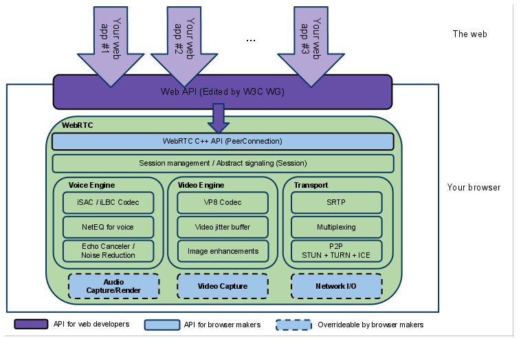

Runtime
-------

A very comprehensive analysis and evaluation of existing web runtime
solutions was performed.

In order to evaluate the possibility to modify native implementations of
WebRTC engines, Ericsson OpenWebRTC and Google WebRTC.org solutions were
considered. OpenWebRTC is a promising modular WebRTC implementation
based on popular GStreamer multimedia framework open source solution.
Unfortunately, OpenWebRTC is not much supported by Ericsson lacking
required documentation to let it be adapted to fulfil reTHINK new
requirements. Google WebRTC.org solution is the reference implementation
of WebRTC specification providing all APIs defined in the standards.
However, the effort required to change it to fulfill reTHINK
requirements is estimated to be very high. On the other hand, having an
extended version of an existing WebRTC implementation would require the
user to install a new reTHINK Browser. For all the above reasons, it was
decided to re-use existing native implementations of WebRTC engines
without modifications.

Javascript engine solutions were evaluated to analyse the possibility to
adapt them in order to fulfill reTHINK runtime requirements, notably in
terms of security (sandboxing). The V8 JavaScript Engine is an open
source JavaScript engine developed by Google for the Google Chrome web
browser. It has since seen use in many other solutions and it is
considered the most powerful Javascript engine in terms of features and
performance. It has mechanisms to facilitate its extension with new
features but lacks required mechanisms for sandbox creation. One
evaluated alternative, is to use nodejs that runs on top of V8 as well
as having nodejs inside Docker taking advantage of its management and
security features. Both solutions fulfill reTHINK security requirements
and will be considered for reTHINK runtime implementations that are not
based on browsers.

Firefox OS is a good candidate to implement reTHINK runtime in mobile
devices supporting this Operating Systems. It natively suports
JavaScript and HTML APIs 5 (including WebRTC) as programming language,
and a robust privilege model to communicate directly with cellphone
hardware, and application marketplace.

Three WebRTC based Media Server solutions were evaluated. Jitsi
Videobridge supports Selective Forwarding Unit (SFU) for multiuser video
communication and it is based on XMPP architecture. Kurento, supports
MCU/SFU Star topologies and a modular architecture to implement media
processing services. Janus Gateway is a flexible and modular WebRTC
gateway that can be used to deploy a full-fledged WebRTC gateway on a
cloud provider or just a small nettop/box to handle a specific use case,
looking at applications as pluggable modules that a client can connect
to through this gateway. These solutions, are good candidates to support
server side Hyperties providing media related services.

WebRTC.org
----------

[WebRTC.org](http://www.webrtc.org/)[18] is an open-source project
aiming at allowing developers to write applications bringing real-time
communication capabilities to browsers, mobile platforms and Internet of
Things (IoT) devices, without installing proprietary plugins or
extensions. These challenge of integrating these different systems is
leveraged by the definition of simple cross-platform APIs.

WebRTC comes with a native code package for developers to work over.
This package features audio, video and network transport components. The
audio component comes with a complete software stack for voice
communications that includes not only codecs, but also software to help
in communications' noise reduction, echo cancellation, automatic gain
control, between others. The video component is built over the VP8 codec
and comes with software for cleaning up noisy images, leveraging packet
loss in transmissions and also record/playback functionality. Finally,
the network package features components to establish P2P connections
using ICE/Turn/STUN/RTP-over-TCP, and also software for error stashing
on audio and video communications. Also, WebRTC provides browser
developers the ability to choose their own audio, video and network
protocols, to work with the packaged software.

### Architecture

WebRTC architecture offers two different layers, one for browser
developers and other for third-party application developers. The first
one is a C++ API intended to enable the proposed Web API for video/audio
capture and render, making it possible for application developers to
make use of it. The second one is the Web API for developers to produce
applications to interact with WebRTC-powered browsers. Currently,
several JavaScript APIs are in process of standardization, like [WebRTC
1.0](http://w3c.github.io/webrtc-pc/)[16] and [Media Capture and
Streams](http://w3c.github.io/mediacapture-main/)[17]. In fact, there is
another abstract layer responsible for session management and
signalling, leaving the signalling protocol implementation up to the
application developer, who has to choose between currently existing
alternatives.

### Software stack organization

As explained before, WebRTC.org comes with a software stack that splits
itself into a network package, an audio package and a video package.

#### Packages identification

The different packages can be easily identifiable on the WebRTC source
code tree. The network package is under src/net and both the audio and
video packages are under src/webrtc/, with some mixed up classes. Also,
there is not a class diagram which helps developers to get the big
picture on this code's organization.

### Code documentation

In the audio/video package almost every file is well-documented.
However, the network package doesn't, and it even comes with a README
file whose content just states that code documentation is a TODO task on
the network package.

### WebRTC.org and runtime requirements

1.  WebRTC is intended to be used on latest browser like Google Chrome,
    Mozilla Firefox, mobile platforms like Android and iOS and also IoT
    devices like Raspberry Pi.
2.  WebRTC.org implements the W3C WebRTC APIs.
3.  Yes, both the WebRTC 1.0 and Media Capture and Streams APIs use
    ECMAScript.
4.  The WebRTC 1.0 API, and concretely its Peer-to-peer Data API for
    sending and receiving data models the behaviour of WebSockets
5.  Yes, WebRTC 1.0 supports Web Messaging Notifications.
6.  TODO
7.  TODO
8.  The effort to perform changes in the runtime like protocols for
    network I/O, signalling, session management, video capture and audio
    capture/render depends on the package these changes are meant to be
    inserted. The audio and video package is well-documented, despite
    not having a class diagram. The network package, by its turn, is not
    documented, increasing the effort to understand the functionality
    and to perform changes in the runtime.

<!-- -->

(1) Chromium sandbox scheme

(2) The architecture of a Google Chrome extension

(3) Scheme of a persistent XSS attack

(4) Scheme of a non-persistent XSS attack

(5) Java Smart Card scheme

(6) CoSE architecture

(7) Service framework middle layer

(8) Sippo WAC reference architecture

(9) Sippo interfaces and APIs

(10) Sippo.js abstraction layer

(11) Sippo services and backends

(12) Sippo WebRTC applications stack

(13) Runtime High Level Architecture

(14) Runtime High Level Architecture with Unstrusted Hyperties

(15) Runtime High Level Architecture with Policy Enforcer

(16) Reporter-Observer Communication Pattern

(17) Core Runtime Architecture

(18) Vulnerability matrix for a dummy platform

(19) Stack

(20) Browser

(21) Security Browser

(22) Application platform

(23) Security Application platform

(24) Deploy Core Runtime Components in the Native Runtime

(25) Deploy Protocol Stub

(26) Deploy Hyperty (part1)

(27) Deploy Hyperty (part2)

(28) Register Hyperty

(29) Message Routing in Message BUS

(30) Intra-domain Local Communication

(31) Intra-domain Remote Communication

(32) Inter-domain Local Communication

(33) Inter-domain Remote Communication

(34) User registration

(35) Prepare Discovery

(36) Use Discovery

(37) Domain Login

(38) Associate User Identity to Hyperty Instance

(39) User identity assertion sequence diagram

(40) Alice invites Bob for a communication

(41) Bob receives invitation

(42) Aknowledged that Bob received the invitation

(43) notification update

(44) Bob gatheres WebRTC resources

(45) Synchronization of Alice's Data object

(46) Runtime Main Procedures for M2M Communication

(47) M2M Device Bootstrap

(48) Context Discovery in M2M Intradomain Communication

(49) Communication 4 pub sub 1

(50) Communication 4 pub sub 2

(51) Communication 4 pub sub 3

(52) Runtime browser implementation

(53) Crosswalk Architecture

(54) Cordova functionnal schema

(55) Messaging Node Architecture

(56) WebRTC.org architecture scheme

(57) OpenWebRTC Architecture

(58) V8 Architecture

(59) V8 Multiple Contexts

(60) Docker Architecture

(@sota.fxos-arch) Firefox OS Architecture

(61) Jitsi Videobridge Architecture

(62) Kurento Architecture

(63) Janus Gateway architecture

