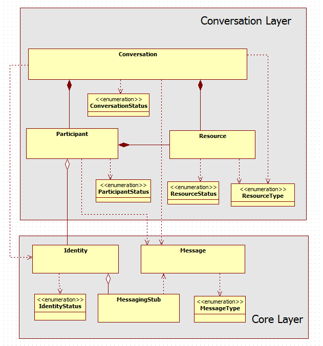
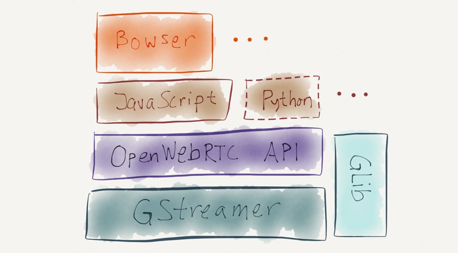
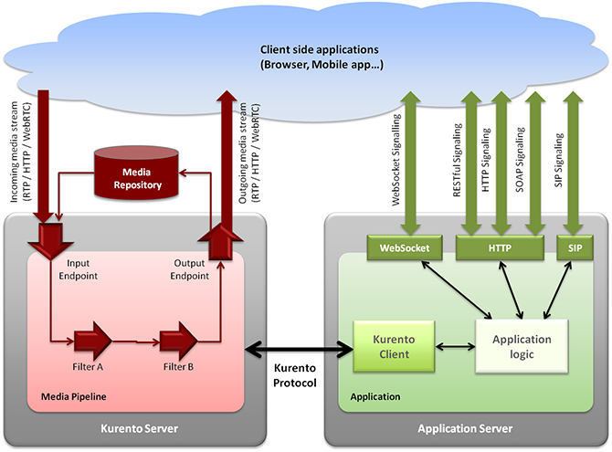
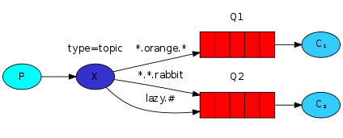
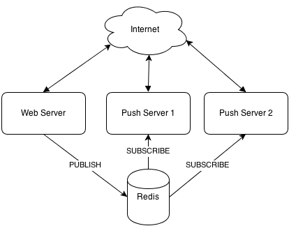

Standards SOTA
==============

Open Mobile Alliance (OMA)
--------------------------

### Overview

The Open Mobile Alliance (OMA) is a Mobile Operator driven industry
forum for the definition of interoperable mobile service enablers. OMA
defines APIs to offer functionalities and resources of Operator networks
to developers.

#### OMA API Program

The OMA API program provides standardized interfaces to the service
infrastructure residing within communication networks and on devices.
Focused primarily between the service access layer and generic network
capabilities, OMA API specifications allow operators and other service
providers to expose device capabilities and network resources in an open
and programmable way—to any developer community independent of the
development platform.


OMA APIs exposes the network assets that developers need—no matter what
protocols, platforms or other APIs they use. The Core network assets
must be made available in order to deploy the wide variety of new
applications and services that enter the market every day. These APIs
are the tool that Operator offers to developer to make its services
accessible to massive markets in a standard way. The OMA set of APIs
increases the portability of applications and services in order to reach
the subscriber base of operators and service providers that deploy OMA
APIs.

As the number of APIs that perform the same functionality proliferate,
fragmentation occurs. This limits developer access to subscribers, and
operator and service providers’ choices of development platforms and
communities. The OMA API Program, through standardization, solves this
problem. A full OMA API inventory can be found at:
<http://technical.openmobilealliance.org/Technical/technical-information/oma-api-program/oma-api-inventory>

### Selected APIs with potential relevance for reTHINK

There are several OMA APIs which can be potentially adopted by reTHINK
project:

1.  [RESTful Network API for WebRTC Signaling
    V1.0](http://technical.openmobilealliance.org/Technical/technical-information/oma-api-program/oma-api-inventory/api-details?API_ID=141).
    This API was released in February 2014 and it is a comprehensive
    REST-API for the WebRTC offer/answer signaling model. The payload
    that is transferred in the requests and responses is defined here as
    XML.

2.  [Authorization Framework for Network
    APIs](http://technical.openmobilealliance.org//Technical/Release_Program/docs/Autho4API/V1_0-20131120-C/OMA-ER-Autho4API-V1_0-20131120-C.pdf).
    It was released in November 2013.The Authorization Framework for
    Network APIs enables a Resource Owner owning network resources
    exposed by Network APIs and RESTful APIs in particular, to authorize
    third-party Applications (desktop, mobile and web Applications)to
    access these resources via that API on the Resource Owner’s behalf.

There are also APIs for: Converged Address Book, Customer Profile,
Network Message Store, Notification Channel, OneAPI, Payment, Presence
and Quality of Service.

### OMA protocols with potential relevance for reTHINK

#### The Lightweight M2M

OMA Lightweight M2M is a protocol from the Open Mobile Alliance for M2M
or IoT device management. Lightweight M2M enabler defines the
application layer communication protocol between a LWM2M Server and a
LWM2M Client, which is located in a LWM2M Device. The OMA Lightweight
M2M enabler includes device management and service enablement for LWM2M
Devices. It is normally used with CoAP. This protocol can be used in
reTHINK for several components such as the Catalogue as proposed in
[15].

### W3C WebRTC API

The Web Real-Time Communications Working Group was created in May 2011
within the W3C to define client-side APIs to enable Real-Time
Communications in Web browsers.

It has defined a functional WebRTC 1.0 API which is implemented by major
browser vendors to build real-time media applications in the browser
without the need of installing any additional plugin. Additionaly to
real-time media, WebRTC also supports the exchange of generic
peer-to-peer data thanks to the Datachannel feature. This API is
currently supported and production-ready in Firefox, Chrome and Opera.

Together with WebRTC 1.0 API the W3C is working in a series of drafts
for which can be used toghether with the WebRTC API to create real-time
media Web applications:

-   Media Capture and Streams (getUserMedia): set of JavaScript APIs
    that allow local media, including audio and video, to be requested
    from a platform. This API allows to capture real time audio and
    video from the device which is running the web browsers. It is used
    by all the WebRTC applications which require capturing audio or
    video.
-   MediaStream Recording: a recording API for use with MediaStreams as
    defined in [GETUSERMEDIA]
-   MediaStream Image Capture: specific the takePhoto() and grabFrame()
    methods, and corresponding camera settings for use with MediaStreams
    as defined in Media Capture and Streams [GETUSERMEDIA]
-   Media Capture Depth Stream Extensions: extends the Media Capture and
    Streams specification [GETUSERMEDIA] to allow a depth stream to be
    requested from the web platform using APIs familiar to web authors.
-   Media Capture from DOM Elements: defines how a stream of media can
    be captured from a DOM element, such as a <video>, <audio>, or
    <canvas>
    element, in the form of a MediaStream [GETUSERMEDIA].
-   Audio output devices API: defines a set of JavaScript APIs that let
    a Web application manage how audio is rendered on the user audio
    output devices.
-   Identifiers for WebRTC's Statistics API: defines a set of JavaScript
    APIs that allow access to the statistical information about a
    PeerConnection
-   Screen Capture: defines how a user's display, or parts thereof, can
    be used as the source of a media stream using getOutputMedia, an
    extension to the Media Capture API [GETUSERMEDIA].

#### Applicability in reTHINK

The WebRTC is going to be intensively used in reTHINK to implement
hyperties for Human-to-Human scenarios and also M2M scenarios where
WebRTC Datachannel is used.

ORTC
----

### Introduction

ORTC is an alternative to the current WebRTC API 1.0 to write WebRTC
Applications to be executed in Web browser.

The protocols on the wire are exactly the same so it is compatible with
aaplications written using the current API.


### Differences between ORTC and WebRTC 1.0.

<ol>
Those are the main differences between ORTC and WebRTC 1.0:
<li>
ORTC specifically tailored to provide the direct control needed to
enable advanced multimedia and conferencing features.
</li>
<li>
Limitations of the WebRTC API 1.0 have been addressed in the new
version.
</li>
<li>
many of the parameters which are automatically handled by the browser in
WebRTC 1.0 can be now modified by using native methods.
</li>
<li>
SDP is not the mandatory format to exchange information between
browsers.
</li>
</ol>
### Advantages of ORTC over WebRTC 1.0

An example of WebRTC 1.0 limitation it is that is not possible to modify
parameters on individual media tracks since the SDPs must contain all
the mediatracks of a mediastream. ORTC includes the RTCRtpSender object
which associated to a sending MediaStreamTrack which provides methods to
tweak its parameters.

An example of application of this new element is the ability to change
the bitrate used for a video in-progess session which is being sent over
a bad-quality connection keeping the parameters of the audio mediatrack.
In WebRTC 1.0 this changes requires a SDP re-negotiation but with ORTC
this is not nececesary.

Although RTCRtpSender was not included in the WebRTC 1.0 definition,
this element was planned to be supported by Chrome from version 39.

#### Compatibility between ORTC and WebRTC 1.0.

Although SDP is not mandatory but WebRTC 1.0 applications would make it
compatible thanks to Javasrcipts shims. All the use cases that ORTC
would enable are already possible but they are more complex to implement
as they require manual SDP manipulations which are error-prone and may
require several Offer/Answer SDP exchanges to update the multimedia
sessions.

### ORTC implementations

ORTC is the WebRTC API which Microsoft will implement in Internet
Explorer and Skype will be supported in the Web Browser supporting ORTC
along as other browsers which supports WebRTC 1.0.

W3C SysApps
-----------

The W3C SysApps working group was originally chartered to provide a
runtime and security model however, it has not been possible to reach
such objective. In the meanwhile we may find proprietary web runtimes,
FFOS and Chrome, which provide a security model for installed packaged
web runtimes.

The WHATWG was formed by individuals of Apple, the Mozilla Foundation,
and Opera Software in 2004, in response to the slow development of World
Wide Web Consortium (W3C) Web standards and W3C's decision to abandon
HTML in favor of XML-based technologies.

On 10 April 2007, the Mozilla Foundation, Apple, and Opera Software
proposed that the new HTML working group of the W3C adopt the WHATWG’s
HTML5 as the starting point of its work and name its future deliverable
as "HTML5". On 9 May 2007, the new HTML working group resolved to do
that

### W3C Application Lifecycle and Events

The W3C Application Lifecycle and Events draft (last version from 16 May
2014) extends the [Service Worker](w3c-service-workers.md) global
execution context, to allow web developers to author applications that
manage the application lifecycle and react to system events e.g. email
or voip application. These capabilities allow application developers to
create applications that integrate closely with the underlying system.

The following functionalities are provided: \* A background App or
Service can run without a visible user interfaces \* An application is
able to decide when to show the user interface \* The Application can be
terminated without user’s consent, and that is able to restore to its
previous state. \* The application is able to show a different user
interface given how the app was launched. For example, if launched as a
photo picker, the application will not show the default application
window, but instead creates a special purpose user interface. \* The
Application is only launched for a specific set of events eg the runtime
uses somekind of events pre-filtering mechanism. For example, if an
application listens to a "USB plugged" event, it can additionally ask to
only listen to a specific device connected or a specific port. \* The
application is able to enumerate windows associated with it, and create
new windows.

This API extends the ServiceWorkerGlobalScope interfaces in the
following way:

    partial interface ServiceWorkerGlobalScope {
                    attribute EventHandler  onlaunch;
                    attribute EventHandler  onterminate;
                    attribute EventHandler  onterminatecanceled;
        readonly    attribute TaskScheduler taskScheduler;
    };

#### Applicability in reTHINK

Similar to Service Workers, this extension can facilitate the
development of some Runtime features notably to govern the runtime
life-cycle of Hyperty instances. However, it seems this draft has not
much support by the industry. However, [Chrome Packaged App
lifecycle](https://developer.chrome.com/apps/app_lifecycle) looks
similar. [Firefox Add-ons](https://developer.mozilla.org/en-US/Add-ons)
should also support some kind of App life-cycle.

### Service Workers

Service workers are based on previous [Web
Worker](http://www.w3.org/TR/workers/) W3C work and they essentially act
as proxy servers that sit between web applications, and the browser and
network (when available.) They are intended to (amongst other things)
enable the creation of effective offline experiences, intercepting
network requests and taking appropriate action based on whether the
network is available and updated assets reside on the server.

A service worker is an event-driven worker registered against an origin
and a path. It takes the form of a JavaScript file that can control the
web page/site it is associated with, intercepting and modifying
navigation and resource requests, and caching resources in a very
granular fashion to give you complete control over how your app behaves
in certain situations (the most obvious one being when the network is
not available.)

A service worker is run in its context: it therefore has no DOM access,
and runs on a different thread to the main JavaScript that supports the
web app, so it is not blocking. It is designed to be fully async;

A service worker is first registered and, if successful, it will be
downloaded to the client and attempt installation/activation for URLs
accessed by the user inside the whole origin, or inside a subset
specified by you.

Service Worker registration Example:

``` {.js}
if ('serviceWorker' in navigator) {
  navigator.serviceWorker.register('/my-app/sw.js', {
    scope: '/my-app/'
  }).then(function(reg) {
    console.log('Yey!', reg);
  }).catch(function(err) {
    console.log('Boo!', err);
  });
}
```

Where `/my-app/sw.js` is the location of the ServiceWorker script, and
it controls pages whose URL begins `/my-app/`.

At this point, your service worker will observe the following
lifecycle: \* Download \* Install \* Activate

The service worker is immediately downloaded when a user first accesses
a server worker–controlled site/page. Installation is attempted when the
downloaded file is found to be new — either different to an existing
service worker (byte-wise compared), or the first service worker
encountered for this page/site.

The user agent may terminate service workers at any time it has no event
to handle or detects abnormal operation such as infinite loops and tasks
exceeding imposed time limits, if any, while handling the events.

Service Workers can be used to intercept network messages. Example:

``` {.js}
self.addEventListener('fetch', function(event) {
  console.log(event.request);
});
```

Service Workers provides the basis for other features including: \*
[Push](http://w3c.github.io/push-api/) \* [Background
sync](https://github.com/slightlyoff/BackgroundSync) \*
[Geofencing](https://github.com/slightlyoff/Geofencing)

Service Workers are still an experimental technology only supported in
Desktop Chrome and Firefox.

#### Applicability in reTHINK

Service Workers provides features that can facilitate the development of
some Runtime features including Event BUS, ProtOfly engine, Policy
Engine. Its usage to support the Hyperty instance itself should also be
evaluated. However it seems this technology is only available in
Browsers and not in server side JavaScript runtime like node.js.

### Content Security Policy Level 2

Content Security Policy (CSP) is an added layer of security that helps
to detect and mitigate certain types of attacks, including Cross Site
Scripting (XSS) and data injection attacks. These attacks are used for
everything from data theft to site defacement or distribution of
malware.

Defines a policy language used to declare a set of content restrictions
for a web resource, and a mechanism for transmitting the policy from a
server to a client where the policy is enforced.

CSP provides a standard HTTP header that allows website owners to
declare approved sources of content that browsers should be allowed to
load on that page — covered types are JavaScript, CSS, HTML frames,
fonts, images and embeddable objects such as Java applets, ActiveX,
audio and video files.

The following header names are in use as part of an experimental CSP
implementations:

Content-Security-Policy — standard header name proposed by the W3C
document. Google Chrome supports this as of version 25. Firefox supports
this as of version 23, released on 6 August 2013. X-WebKit-CSP —
experimental header introduced into Google Chrome and other WebKit-based
browsers (Safari) in 2011. X-Content-Security-Policy — experimental
header introduced in Gecko 2 based browsers (Firefox 4 to Firefox 22,
Thunderbird 3.3, SeaMonkey 2.1). Support for the sandbox directive is
also available in Internet Explorer 10 and Internet Explorer 11 using
the experimental X-Content-Security-Policy header.

There's initial support for CSP in some web frameworks such as AngularJS
and Django.

Example: `script-src 'self'; object-src 'none'`

Security policies contain a set of security policy directives
(script-src and object-src in the example above), each responsible for
declaring the restrictions for a particular resource type, or
manipulating a specific aspect of the policy’s restrictions.

The server delivers a policy to the user agent via an HTTP response
header or an HTML meta element. The Content-Security-Policy header field
is the preferred mechanism for delivering a policy. The grammar is as
follows:

`"Content-Security-Policy:" 1#policy-token`

For example, a response might include the following header field:
`Content-Security-Policy: script-src 'self'`

A Content Security Policy consists of a U+003B SEMICOLON (;) delimited
list of directives.

#### Applicability in reTHINK

In a preliminary analysis CSP seems too limited to be applied for the
runtime policy engine but it may be useful to improve security in the
protOfly engine.

### W3C Push API

W3C Push API work began in the W3C Web Applications (WEBAPPS) Working
Group to provide very simple JavaScript APIs for push client registering
and message receipt. It was in large part, driven by the urgent WebRTC
use case of waking up an application for a real-time incoming call. The
API has two logical pieces:

-   a pushRegistrationManager that consults the user agent about which
    push service to use and returns information (a registration id and a
    URI) that can be sent to the application server for it to know how
    to reach the push service. In general, the URI is where the
    application server can send push messages and the registration id is
    to be provided to the push service to indicate the delivery target
    for the messages.
-   a Service Worker that is used to catch, store if necessary, and
    ultimately deliver push messages to the application.

The following general entities and example operation for delivery of
push messages are the following (see figure below):

-   Application servers request delivery of a push message to a webapp
    via a RESTful API exposed by a push service
-   The push service delivers the message to a specific user agent
-   The user agent delivers the push message to the specific webapp
    intended to receive it.


The main data flows involved in the PUSH API usage are described below:


The W3C Push API is a client API that does not provide any standard for
how the application server sends messages to the push server. This part
is covered by the IETF WEBPUSH protocol.

### IETF Web Push

In order to provide a standard way for push notification to be used on
the Internet, the IETF WEBPUSH working group was created in late 2014.
The WEBPUSH WG is developing an HTTP2-based mechanism for applications
“to request the delivery of data to a device using a consolidated push
notification service. This protocol will include the ability to push the
same message to multiple subscribed devices.

Expected clients are both web applications and field gateways that
consolidate and forward messages to embedded devices. Several models
have been discussed, and there currently seems to be most interest in a
publication-subscription model where each device subscribes
individually, but with no requirement for a separate registration in
advance.

This working group will create an HTTP based protocol that will allow
applications to request delivery of data to applications through a
consolidated service. The working group will work in cooperation with
W3C’s Web Push API.

### Applicability to reTHINK

The ability to push notifications towards Hyperty Runtime is an
essential feature that must be supported according to these standards.

HTTP/2
------

### Introduction

HTTP/1.1 has served the Web for more than 15 years, but its age is
starting to show. Web application has evolved a lot from the beginning
but the protocol which transport it has not evolved at the same pace.

Loading a Web page is more resource intensive than ever because HTTP
practically only allows one outstanding request per TCP connection:

-   Browsers have used multiple TCP connections to issue parallel
    requests. This is counter-productive (TCP congestion control is
    effectively negated leading to congestion events), and unfair
    (browsers take more network resources).
-   At the same time, the large number of requests means a lot of
    duplicated data “on the wire”.
-   These factors mean that HTTP/1.1 requests have a lot of overhead
    associated with them; the more requests are made, the worse
    performance we get.

This problems leaded the industry to consider “Best Practices” things
like: spriting, data inlining, domain sharding and concatenation which
are just workarounds which improves the user experience.These hacks are
indications of underlying problems in the protocol itself, and cause a
number of problems on their own when used. On the other side, the way in
which the Web is accessed has also change a lot, mobile devices has
become the main point of entry to the web. Characteristics of wireless
connections (high latency, jitter and packet loss) may prevent Web
applications served with HTTP over TCP from being responsive and even
usable.

[HTTP/2](https://tools.ietf.org/html/rfc7540) [82], which is already a
definitive RFC, was designed to be adapted to the new conditions of the
WWW and its main goal is to improve the user experience. HTTP/2 is an
evolution of SPDY, experimental protocol mainly developed by Google
which is currenlty being used in production in many Google applications.
To take advantage of HTTP/2 new features a new transport protocol, QUIC,
has been designed. Both protocols combined will be extensily used in
Internet in the next years.

### Main differences from HTTP1.1

  **HTTP/1.1**                          **HTTP/2**
  ------------------------------------- -------------------------------------------------------------------
  textual                               binary
  ordered and blocking                  fully multiplexed
  several connections for parallelism   one connection for parallelism
  only content compression              header compression
  not proactive push                    allows servers to “push” responses proactively into client caches

#### Binary

HTTP/2 is a binary protocol, it means that no human-understable ASCII
chars are sent on the wire. The main advantages of being binary are:

-   Binary protocols are more efficient to parse by applications which
    does not have to handle with issues related to text-protocol
    parsing.
-   It is more compact “on the wire” since no extra information needs to
    be sent.
-   It is much less error-prone, compared to textual protocols like
    HTTP/1.x with whitespace handling, capitalization, line endings,
    blank links... HTTP/1.1 defines five different ways to parse a
    message; in HTTP/2, there’s just one code path.

#### Fully multiplexed

HTTP/1.x suffers “head-of-line blocking” only one request can be
outstanding on a connection at a time. Pipelining of request is not a
solution since a large or slow response will block others behind it.
Additionally, it has been found very difficult to deploy, because many
intermediaries and servers do not process it correctly.

#### One connection for parallelism

With HTTP/1, browsers open between 4 and 8 connections per origin. Since
many sites use multiple origins, this could mean that a single page load
opens more than 30 connections. One application opening so many
connections simultaneously breaks a lot of the assumptions that TCP was
built upon. Since each connection will start a flood of data in the
response, there is a real risk that buffers in the intervening network
will overflow, causing a congestion event and retransmits. Additionally,
using so many connections unfairly monopolizes network resources,
“stealing” them from other, better-behaved applications (e.g., VoIP).

#### Header compression

HTTP/1 supported compression for content but not for headers. Assuming
an average of 80 assets per page and each request has 1400 bytes of
headers, it takes at least 7-8 round trips just to get the headers out
“on the wire.” That is not counting response time - that is just to get
them out of the client. Headers add a lot of overhead traffic and
increase latency.

#### Server push

In HTTP/2 the server can push resources to the client before receiving a
request to server that resource. This reduce the load time as the
browser does not have to send GET request to ask for all the resources
avoiding RTT delays.


### Features of HTTP/2

#### HTTP/2 key concepts

1.  All communication is performed over a single TCP connection that can
    carry any number of bidirectional streams.
2.  Each stream has a unique identifier and optional priority
    information that is used to carry bidirectional messages.
3.  Each message is a logical HTTP message, such as a request, or
    response, which consists of one or more frames.
4.  The frame is the smallest unit of communication that carries a
    specific type of data—e.g., HTTP headers, message payload, and so
    on.
5.  Frames from different streams may be interleaved and then
    reassembled via the embedded stream identifier in the header of each
    frame.

#### Framing

The frame is the smallest unit of communication in HTTP/2, each
containing a frame header, which at a minimum identifies the stream to
which the frame belongs.

The most relevant frames are the used to transport Headers and Data, but
there are also frames for other functions like stream control, push
content and set the priority of the streams. DATA frames are used to
transport HTTP message bodies and HEADERS frames are used to communicate
header fields for a stream. The rest of frames are used for control
tasks and they are called Control Frames.


#### Multiplexing

HTTP/2 interleave multiple requests and responses in parallel without
blocking any one using a single connection to deliver and receive them.
This allow to remove unnecessary HTTP/1.x workarounds such as
concatenated files, image sprites, and domain sharding. It also resultes
in lower page load times by eliminating unnecessary latency and
improving utilization of available network capacity.


#### Priority

Not all the elements of a Web page are equally important for the
functionality and visualization. An user can start consuming the content
before loading all the elements. HTTP/2 allows to set different
priorities to each stream and priority can be specified by the client
side and it can be changed in runtime.

#### Flow control

HTTP/2 applies flow control mechanism to the different streams. The flow
control is directional with overall control provided by the receiver and
the frame type determines whether flow control applies to a frame. Only
DATA frames are subject to flow control (the most important part part of
the traffic will transported in DATA frames) so control frames are not
blocked by flow control. On the other side, flow control cannot be
disabled according to the HTTP/2 RFC draft.

### HTTP/2 encryption

The RFC allows HTTP/2 to be sent over unencrypted transport protocols
like TCP. However Google and Mozilla have officially said that HTTP/2 is
not going to be allowd to be sent over plain TCP but over TLS connection
to avoid issues with intermediates element between the browser and the
server. This has an impact in ReTHINK project as if a web site is served
over TLS or a secure protocol, the rest of elements of that site must be
served using an encrypted protocol.

### Why using for HTTP/2 in ReTHINK project.

HTTP/2 is aimed to make the Web more efficient and responsive and it
advantages are more notable for web sites. However the following points
should be considered when discussing the use of HTTP/2 in the ReTHINK
project:

-   HTTP/2 is going to be massively adopted by Internet companies
    following Google and Twitter movements.
-   The most relevant projects (Apache, NGINX, ) already supports or
    plan to support HTTP/2. ReTHINK Javscript libraries are expected to
    be used also in web applications so supporting HTTP/2 would avoid
    mixing HTTP/1.1 and HTTP/2.
-   ReTHINK will take advantage of the benefits of HTTP/2.
-   HTTP/2 is normally going to be used over QUIC so we will take
    advantage of using QUIC as the transport protocol.
-   Despite the fact of not being used to transport media, its
    characteristics would make it possible.

All the available implementations of HTTP/2 are gathered in the official
[HTTP/2 WG Github
repository](https://github.com/http2/http2-spec/wiki/Implementations)[81]

### Websocket over HTTP/2

The WebSocket protocol enables two-way communication between a client
running untrusted code in a controlled environment to a remote host that
has opted-in to communications from that code. Since it requires one TCP
connection for every WebSocket connection, having multiple WebSocket
connections between the same client and the same server is inefficient.
On the other hand, HTTP/2 specifies a fast, secure, multiplexed framing
protocol. The
[draft!](http://tools.ietf.org/html/draft-hirano-httpbis-websocket-over-http2)
document provides bi-directional multiplexed communication by layering
WebSocket on top of HTTP/2. The document is still a draft but this could
be used in ReTHINK project as it allows to get a bidirectional
communication over an existing HTTP connection without the need of
creating additional socket connections.

QUIC (Quick UDP Internet Connection)
------------------------------------

### Introduction

Internet has evolved a lot since the first version of TCP was designed
40 years ago. Many RFCs have added functionality to TCP since then and
it played a vital role being the transport of the WWW for decades. UDP
was designed to be used in real-time scenarios where the realiability is
not so important as getting a very low delay and being tolerant to
packet losses.

More flexible protocols which combine feature from TCP and UDP were also
designed. The most remarkable effort was SCTP which was first designed
to transport by the Signaling Transport Working Group to transport
Signaling System 7 (SS7) and ISDN communications protocols over IP
networks. Amongst other features, SCTP creates a tunnel over UDP and to
multiplex a connection into multiple streams. It also provides
notification of duplicated or missing data chunks, creating a reliable
transport over UDP.\
The fact of allowing multiple streams over a single connections prevents
Head-of-Line blocking from hapenning. It means that a packet loss which
affect to a stream will not imply a delay in the rest of streams as it
would happen if several streams are multiplexed over a TCP connection.

### Transport layer replacement

Google started the definition, implementation and real filed testing of
a new transport protocol called QUIC in 2013. QUIC stands for "Quick UDP
Internet Connection" and it was designed as a replacement for TCP as
response of the new needs and the evolutions of Internet:
streaming-based services are more and more demanded, many connections
are established over wireless connections and they are established from
mobile devices.

The features the new protocol must support to meet the today's Internet
requirements: \* it is necessary to make the web faster and the low
layer protocols must adapt to the evolution of the web applications. \*
connection establishment latency must be reduced to improve the user
experience and to make the web and Internet more usable. \* the web must
be secyre by default, TCP does not secure the traffic and an optional
upper layer must be added to provide this security.

QUIC introduces improvement in many aspects of the TCP protocol: \* TCP
needs a three-handshake to create a connection. If the connection is
established over TLS more RTT are necessary. \* TCP provides reliable,
ordered and error-checked delivery based re-tx, acknowledgments and
checksum. The cost of having this features is that any packet loss will
trigger retransmissions which will normaly delay the delivery of the
rest of packets. \* TCP allows to stablish a single full duplex byte
stream and all the data over that stream will be treated processed
indistinctly. \*TCP requires an extra protocol on top of it (TLS) to
provide encryptin and authentication. It adds an overhead and delays in
the connection setup.

#### Why not to use SCTP for this?

SCTP can be considered as an alternative for TCP. It has two main
features which could make it an atarctive choice:\
\* SCTP also provides stream multiplexing over a single connection. \*
DTLS provides SSL quality encryption and authentication over UDP in the
same way as TLS over TCP.

These features made that SCTP had been chosen to be used internally by
WebRTC Datachannels however it presents some problems which forced the
QUIC developer to design a new alternative:

-   SCTP requires 4 roundtrips are necessary to establish a SCTP over
    DTLS connection. This means an unacceptable delay in many
    applications and degrades the user experience.
-   It was not designed to reduce latency, SCTP connections were
    designed to be persistent between two peers.

In contrast the goal of QUIC is to have to perform a connection
establishment with zero RTT overhead.

### QUIC current use

QUIC is currently being used by Chrome to interact with Google Apps and
it is going to be used by more services in short-term. HTTP/2 is going
to become a definitive RFC in a few months and it is being used in
production by many relevant Internet companies such as Twitter and
Facebook. HTTP/2 performs much better over QUIC since it allows to
leverage it stream-based designed so QUIC isvery likely to be adopted by
the IETF in short-term.

### QUIC main features

QUIC can be deployed in today's internet, actually it is been used in
many real deployments without having to apply any modification in any
intermediate node. This is a key point which makes its adoption much
easier than IPv6.

It provides a very low latency in connections and responses. That is a
critical point as many services are cloud -based and must be accessed
from mobile and transoceanic connections which high RTTs.

It has a reliable-stream support and the packet losses which affect one
strem does not affect the rest of streams. This reduces the Head Of Line
(HOL) blocking due to packet loss.

It provides a better congestion avoidance than TCP which implcitly
considered that any packet loss was due to a network congestion which is
not normally true for wireless connections.

The privacy and Security it provides is comparable to TLS but with a
much lower delay in the connection setup which can from 0 in the most
optmistic cas to 2 RTTs in the worst case. This is a key feature of QUIC
as it allows to improve the user experience.

Connection are identified by a Connection Identifier not by layer 3 and
layer 4 elements (IPs and ports). This fits very well in mobile
scenarios where the IP of the clients may change due to handover
mechanism.

#### Is it a good choice to use UDP for QUIC?

QUIC can be considered as an intelligent layer over UDP which provides
enhanced features. UDP is intensively used by VoIP and gamers for years
in very latency-sensitive applications. On the other side, 91-94% of the
users which had TCP connectivity with Google can make outbound UDP
connections so it is possible to build a transport in today's internet
over UDP. It is also necesary to consider NAT unbinding which does not
happen to TCP. This problem has been addressed internally by QUIC
designers through the use of keepalives packets.

### Applicability to reThink project

Including the use of QUIC as a requirement or a recommendation could
help to support more reliably mobility scenarios where the End-User IP
may be changed during a connection with the Signaling service.
Additionaly thee transport layer connectivity provided by QUIC is more
suitable for wireless connections (longer RTTs, packet lost and changes
at IP level) than TCP. QUIC has been designed bearing HTTP/2 in mind as
it improves its performance a lot, however the use of QUIC by other
protocols can also be very advantageous.

During a media session, the change of an IP requires an SDP
re-negotiation when a media sessions is ongoing, so we can't leverage
QUIC features for media. However QUIC would be helpful in all the
scenarios at signaling level.

#### Existing QUIC implementations

The QUIC reference library is libquic
(https://github.com/devsisters/libquic). It has been mainly developed by
Google. This repository and its sources and dependencies were extracted
from Chromium's QUIC Implementation with a few modifications and patches
to minimize dependencies needed to build QUIC library. This code can be
used to be integrated with HTTP Server like Apache and nginx but this
has not been done so far. This library implementes

In the Chromium repository it is available a standalone client and
server which can be used as a reference for ReThink project
implementations.
http://src.chromium.org/viewvc/chrome/trunk/src/net/tools/quic/

In all the imeplementations QUIC is used with SPDY and HTTP/2 so its use
separated from those protocols has to be investigated.

### Drawbacks of using QUIC as transport protocol

QUIC is a very new protocol so it is still not widely used. It means
that many existing systems and projects does still not support it so
testing and implementation which requires an additional effrot compared
to TCP.

On the other side, despite the fact that is a protocol likely to become
an RFC darft in short-term it has not been formally specified by the
IETF. This is the official definition document mantained by Google:
https://docs.google.com/document/d/1RNHkx\_VvKWyWg6Lr8SZ-saqsQx7rFV-ev2jRFUoVD34/edit
Any implementation made today may not be completely compliant with the
final protocol.

Projects SOTA
=============

WONDER Project
--------------

### Overview

The main motivation of the [OpenLab WONDER experimentation
project](http://hypercomm.github.io/wonder/) [32] was to experiment and
evaluate some of the P2252 Eurescom Study recommendations. WONDER
evaluated whether to use IMS to deliver services to WebRTC endpoints or
to use a more disruptive pure Web based approach to deliver services to
WebRTC endpoints.

For the second option WONDER has enlightened some paths to be followed
in a post-IMS era dominated by Web technologies and large eclectic
cooperative eco-systems. The novel [Signalling On-the-fly
(SigOfly)](http://ieeexplore.ieee.org/xpl/articleDetails.jsp?arnumber=7073799&filter%3DAND(p_IS_Number%3A7073795))
concept was conceived and successfully demonstrated to address the lack
of a standard WebRTC signalling protocol. The SigOfly concept enables
seamless interoperability between different WebRTC service domains
avoiding NNI interfaces by using peer side APIs and restful push
notification services.

WONDER experimentation involved Portugal Telecom and Deutsche Telekom.

### SigOfly Concept

The SigOfly concept leverages the use of scripts (JavaScript) by WebRTC
Applications to implement signalling protocol stacks. This means, the
signalling protocol stack can be selected, loaded and instantiated
during runtime. Such characteristic enables signalling protocols to be
selected per WebRTC Conversation to ensure full signalling
interoperability among peers using Triangle based Network topologies.
The SigOfly procedures should be applied at the end-user client to
benefit from WebRTC model. However, the concept is also feasible between
Messaging Servers supporting JavaScript execution engines (e.g. Node.js
or vertx.io).

Before the SigOfly concept is described in detail, some terms require a
definition:

**Messaging Server:** the server that supports the exchange of
signalling messages required for the establishment of WebRTC sessions.
Each Messaging Server belongs to a domain;

**Domain Channel:** the signalling channel that is established with
domain’s messaging server as soon as a domain‘s user is registered and
is online;

**Transient Channel:** the signalling channel that is established,
typically with a foreign messaging server (i.e. from another domain) in
scope of a inter-domain conversation;

**Messaging Stub:** the script containing the protocol stack and all the
logic needed to establish a channel to a certain Messaging Server;

**Conversation Hosting Messaging Server:** is the Messaging Server that
is used to support the exchange of all signalling messages among peers
belonging to different domains. The Hosting peer uses the Domain Channel
to exchange signalling messages, while other peers use Transient
Channels that connect to the Hosting Messaging Server.


The classic Alice and Bob example is used to explain the SigOfly
concept. We assume that Alice and Bob are registered in different
Service Provider domains having each one a Domain Channel established
with their own Messaging Server (see Fig. below). In case Alice wants to
talk to Bob by using Bob’s WebRTC identity e.g. bob@domain.com, the
following steps will be performed:

Step 1: Information about the Identity of Bob, including Bob’s Messaging
Stub provider, is provided and asserted by Bob’s Identity Provider
(IdP).

Step 2: Alice downloads and instantiates Bob’s Messaging Stub in her
browser to setup a Transient Channel with Bob’s domain Messaging Server.

Step 3: As soon as the Transient Channel is established, Alice can send
an Invitation message to Bob containing her Session Description Protocol
(SDP) based communication offer.

Step 4: Since Bob is connected in the same Message Server via his Domain
Channel, he will receive Alice’s invitation in his Browser. If Bob
accepts the invitation, an Accepted message containing Bob SDP response
will be send to Alice.

Step 5: As soon as Alice’s browser receives Bob’s SDP, the media and/or
data streams can be directly connected between the two browse

It should be noted that SigOfly does not directly address identity
management aspects but aims to be compliant with ongoing WebRTC Identity
Management work from W3C and IETF, mainly by extending
RTCIdentityAssertion to also include the assertion of MessagingStubs.
This means, Alice and Bob authentication is done outside SigOfly
procedures, described above, which are agnostic of the IdP and
authentication protocols used.

The SigOfly concept is also applicable in use cases where conversations
are hosted by calling parties, in multiparty conversations or to support
interoperability with legacy networks (e.g. IMS and PSTN).

#### Data Codec On-the-fly

In addition, the SigOfly principle is also applied to address Data
Channel Services Interoperability, to conceive another novel concept
called “Data Codec On-the-fly”. the “Data Codec On-the-fly” concept
ensure all peers are using the same protocol on top of the Data Channel.
A Data Codec is a JavaScript library that implements a data
communication processing algorithm to code and send data to the Data
Channel and to receive and decode data from the Data Channel. As with
Messaging Stubs in the SigOfly concept, Data Codecs are downloaded and
instantiated by peers according to URLs identified in Conversation setup
or update signalling messages

Further information about SigOfly and Data Codec On-the-fly is provided
in [34](https://github.com/hypercomm/wonder/wiki/Signalling-on-the-fly).

### WONDER Library

A JavaScript framework, the WONDER lib, was designed and implemented to
validate the SigOfly and Data Codec On-the-fly concepts.



Main WONDER library classes are:

-   The Identity, representing a user and containing all information
    needed to support Conversation services. This also includes the
    service endpoint to retrieve the protocol stack (Messaging Stub)
    which will be used to establish a signalling channel with the
    Messaging Server of the Identity domain. The Identity entity extends
    the current Identity concept defined by W3C to support seamless
    interoperability by using the SigOfly mechanism.
-   The MessagingStub implementing the protocol Stack used to
    communicate with a certain Messaging server.
-   The Conversation class managing all participants including the
    setup, update or close of media and data connections.
-   The Participant class, handling all operations needed to manage the
    participation of an Identity (User) in a conversation including the
    WebRTC PeerConnection functionalities. The Local Participant is
    associated with the Identity that is using the Browser while the
    Remote Participant is associated to remote Identities (users)
    involved in the conversation.
-   The Resource class representing the digital assets that are shared
    among participants in the conversation including participants’
    voice, video, screens, photos, video Clips, music clips, documents,
    etc. These assets are usually managed by the Participant that owns
    it. For local participants assets are sent (e.g. WebRTC outgoing
    stream tracks) while for remote participants assets are received
    (e.g. WebRTC incoming stream tracks). Some Resource types like Chat
    are not managed by a Participant but by the Conversation.
-   The Data Codec, which is used by Resources that are shared on top of
    the Data Channel, like file sharing and Textual Chat, to decode and
    encode the data in a consistent way by all the peers. The Data Codec
    may also be downloaded on-the-fly by the peers.
-   The Message, which is used to exchange all data needed to setup,
    update and close media and data connection between peers via the
    Messaging Server. It may also be used for other purposes e.g.
    presence information management. Each message is comprised by a
    Header and a Body.

The [API
documentation](https://raw.githack.com/hypercomm/wonder/master/docs/api/index.html)
and the [source
code](https://github.com/hypercomm/wonder/tree/master/src/libs) were
published in a public github repository [35][36] .

### Input to reTHINK

WONDER Library can be used in reTHINK in different ways that are
detailed in the following sections.

#### Runtime Messaging API

The MessagingStub API is a good starting point to design the JavaScript
API to support Hyperty Message communication which is comprised by the
following functions:

    connect(ownRtcIdentity, credentials, callbackFunction) {
    // connects to Msg Server
    };

    addListener(StubEvtHandler, URI, contextId){
    //Adds a listener for a certain context.
    };

    removeListener(StubEvtHandler, URI, contextId){
    //Removes a listener from a certain context.
    };

    getListeners(){
    //Gets the list of listeners.
    };

    sendMessage = function(message) {
        // send Message
    };

    disconnect = function() {
        // disconnects from server
    };

Check WONDER MessagingStub API documentation in
[37](https://raw.githack.com/hypercomm/wonder/master/docs/api/symbols/MessagingStub.html).

#### Messages Format

The WONDER Message class provides good input for the design of Hyperty
Messages. Wonder Message is a JSON structure and it is comprised by a
Header and a Body. The following Message Header attributes are defined:

    type            Type of the Message
    from            Sender of the message
    to              Recipients of the message
    context         identifies a certain context for the message eg the Id of the conversation

The following Message Types are defined:

-   INVITATION - Message to invite a peer to a conversation.
-   ACCEPTED - Answer for conversation accepted or Context subscription
    accepted
-   CONNECTIVITY\_CANDIDATE - Message contains ICE connectivity
    candidate
-   NOT\_ACCEPTED - Answer for conversation not accepted or Context
    subscription not accepted
-   BYE - Message to finish the communication with a peer
-   UPDATE - Message to Update conversation by adding or removing a
    Resource
-   UPDATED - Answer to Message UPDATE
-   CONTEXT - Message used to publish the context and status of an
    Identity.
-   SUBSCRIBE - Message to request to receive CONTEXT notifications from
    a certain Identity
-   MESSAGE - Mainly used to support Pager Mode Chat. But it can be used
    for other use cases instead of Data Channel eg small files.
-   CRUD\_OPERATION - Messages to handle data persistence in a resource
    tree

The Message body will depend on the Message Type. Detailed description
of WONDER Messages are provided [here](wonder-messages.md).

#### Runtime Identity API

The Identity and IDP classes could also provide good input for the
support of Identity Management functionalities by reTHINK Runtime.

The WONDER IDP is a singleton object which handles WONDER Identities
creation and retrieval from IDP Servers. IDP is agnostic of the protocol
used by IDP Server. IDP main function is:

    /*This method takes either a single rtcIdentity or an array of rtcIdentities and creates Identity objects from them. The successfully created Identities are then returned in an Array in the success callback. If one or more rtcIdentities can't be created then the returned array is shorter than the given array.*/

    createIdentities(rtcIdentities, onSuccessCallback, onErrorCallback)

The WONDER Identity class represents a user and contains all information
needed to support a Conversation service including the service endpoint
to retrieve the protocol stack (Messaging Stub) that will be used to
establish a signalling channel with the Identity domain messaging
server. Identities are only created by using the corresponding
create-methods of the IDP class.

Identity is comprised by the following attributes:

    context; // including Identity presence status;
    sessionId // identification of the session established with the domain through the Messaging Server.
    username;
    messagingStubLibUrl; // the service URL from where Identity domain messagingStub can be downloaded
    notificationAddress; // to support notifications when the user is not connected
    credentials; // to be used to connect to the domain
    avatar; //

Some of these attributes that are more sensitive in terms of security
should be handled by the Runtime itself (e.g. credentials / tokens,
sessionId, username, messagingStubLibUrl) while the others could be
handled by an Hyperty representing the Identity eg avatar, context.

The main WONDER Identity functions are:

    /**
     * This method downloads a messaging stub and keeps a reference to it in a local
     * attribute, if not already done before. That means the download will only be performed once.
     * After download it invokes the given callback with a reference to the downloaded MessagingStub.
     *
     * @param callback {callback(MessagingStub)} callback that is invoked with messagingStub as param; if download failed then the stub param is empty
     */
    Identity.prototype.resolve = function( callback ) {
    };

    /**
     * This method subscribes to add a listener to receive status information (CONTEXT message type) from the user associated to this Identity.
     * The Signalling on the fly concept is also used to ensure cross domain Presence management interoperability
     * by calling the Identiy.resolve() function
     * @param subscriber :
     *            Identity ... The identity of the subscriber
     * @param type :
     *            SubscriptionType ... The subscription type
     *
     */

    Identity.prototype.subscribe = function(subscriber) {
    };

    /**
     *
     * This method removes a listener previously added with "subscribe()"  function to receive status information
     * (CONTEXT message type) from the user associated to this Identity
     * @param subscriber :
     *            Identity ... The identity of the subscriber
     * @param type :
     *            SubscriptionType ... The subscription type
     *
     */
    Identity.prototype.unsubscribe = function(subscriber, type) {
    };

    /**
     * To set Identity context and to publish it by sending a CONTEXT message to address "rtcIdentity.context"
     *
     * @param context :
     *            String ... The context to set
     *
     */

    Identity.prototype.setContext = function(context) {
    };

    /**
     * getContext
     *
     * @returns ContextData ... gets the context attribute for this Identity
     *
     */
    Identity.prototype.getContext = function() {
    };

    /*Handler to receive incoming messages eg context update*/

    Identity.prototype.onMessage = function(message){
    }

    /**
     * addListener function usually implemented by the App
     * @param.. listener
     */

    Identity.prototype.addListener = function( listener, rtcIdentity ){
    }

    /**
     * removeListener function
     * @param.. listener
     */

    Identity.prototype.removeListener = function( listener, rtcIdentity ){
    }

The "resolve(..)" function should be handled by the Runtime itself but
all the others could be implemented by an Hyperty representing the
Identity. For further discussion.

#### JavaScript Framework

WONDER library can provide some input for the design and implementation
of reTHINK JavaScript framework that should facilitate the development
of Hyperties, namely:

-   Conversation
-   Participant
-   Resource\* Identity
-   MessageFactory

#### JavaScript Shim Layer for non-compliant reTHINK Runtime

WONDER library can provide some input for the design and implementation
of reTHINK JavaScript Shim Layer to be used in non-compliant reTHINK
Runtime, namely:

-   MessagingStub
-   Idp
-   Identity
-   DataBroker
-   DataCodec

### WONDER Messages Format

The WONDER Message class provides good input for the design of Hyperty
Messages. Wonder Message is a JSON structure and it is comprised by a
Header and a Body. The following Message Header attributes are defined:

    type            Type of the Message
    from            Sender of the message
    to              Recipients of the message
    context         identifies a certain context for the message eg the Id of the conversation

The following Message Types are defined:

-   INVITATION - Message to invite a peer to a conversation.
-   ACCEPTED - Answer for conversation accepted or Context subscription
    accepted
-   CONNECTIVITY\_CANDIDATE - Message contains ICE connectivity
    candidate
-   NOT\_ACCEPTED - Answer for conversation not accepted or Context
    subscription not accepted
-   BYE - Message to finish the communication with a peer
-   UPDATE - Message to Update conversation by adding or removing a
    Resource
-   UPDATED - Answer to Message UPDATE
-   CONTEXT - Message used to publish the context and status of an
    Identity.
-   SUBSCRIBE - Message to request to receive CONTEXT notifications from
    a certain Identity
-   MESSAGE - Mainly used to support Pager Mode Chat. But it can be used
    for other use cases instead of Data Channel eg small files.
-   CRUD\_OPERATION - Messages to handle data persistence in a resource
    tree

The Message body will depend on the Message Type. Some of these messages
and associated bodies are more detailed below.

##### Invitation Message Type

Invitation for a new conversation to be hosted by the inviting identity
ie to use Messaging Server of the inviting identity which is provided in
the message body as well as the connection description of the inviting
identity.

**Invitation Message Body**

        conversationURL;
        connectionDescription; // SDP
        subject;
        hosting; // Identity of who is hosting the conversation
        agenda;
        peers;
        constraints; // To describe media and data constraints for each resource including Audio, Video constraints and direction (in,out,inout)

##### Accepted Message Type

To accept eg Invitations, Conversation updates or Context Subscription.
Similar to SIP 200 OK

**Accepted Message Body**

        connectionDescription; // SDP
        hosting; // Identity of who is hosting the conversation
        constraints; // To describe media and data constraints for each resource including Audio, Video constraints and direction (in,out,inout)

##### Not Accepted

Eg Busy, Reject, No\_answer to: - Invitation requests - Update
requests - Subscription requests

This information will go in the message body as a String

##### CONNECTIVITY\_CANDIDATE Message Type

Messages used to exchange ICE connectivity candidates between peers

**Message Body**

    label - The label of the candidate.
    id - The id of the candidate.
    candidate - The ICE candidate string.
    lastCandidate - Boolean indicating if the candidate is the last one. If true, include the full SDP in the candidate parameter for compatibility with domains that don't support trickling.

##### CRUD\_OPERATION

These Messages are used to handle data persistence in a resource tree by
using the four basic functions create, read, update and delete.

**Message Body**

    operation   //  create, read, update or delete.
    syntax      // syntax used for CRUD operation field "criteria" examples: mongoDB, SQL
    criteria    // some filtering expression used in read and update operations
    doc     // Contains data for CREATE and UPDATE operations
    resource;   // Resource URI where the operation is applied

M2M Projects
------------

Several (open source) projects implement key functionality that may be
potentially essential to realize the Catalogue Service as well as the
Registry Service simultaneously in the machine-to-machine and
human-to-human domain. The following sections provide an overview of
implementations for

1.  CoAP/Well-known CoRE,
2.  ETSI and oneM2M, and
3.  OMA Device Management

### CoAP/ Well-known CoRE Projects

If Hyperties, Codecs, Protostub and other artifacts to be provisioned on
the end devices are to be regarded as resources with attributes
describing: capabilities (audio, video, text), running platform (OS),
configuration (DNS name of the Messaging Node, DNS server),
implementation (code/script, codecs), these artifacts can be organized
as resources in the Repository/Catalogue component.

#### LibCoap Project

##### Overview

The implementation includes features for receiving and sending CoAP
requests. It also supports the [CoRE-link format RFC
6690](https://tools.ietf.org/html/rfc6690) to organize the CoAP
resources as a well-known CORE. It has support for Linux but also
Contiki Operating Systems.

The implementation is using C as programming language.

Link:
https://gitlab.informatik.uni-bremen.de/bergmann/libcoap/tree/master

The library is published as open-source software without any warranty of
any kind. Use is permitted under the terms of the GNU General Public
License (GPL), Version 2 or higher, OR the revised BSD license.

##### How to use

For starting a CoAP server based on a configuration file, a main program
has to be written. Handlers for CRUD operations triggered by CoAP
requests: Post, Get, Put and Delete can be registered to the main
information named coap\_context. Callbacks will be generated to the
registered handlers when the requests or replies are received. When
creating resources, attributes can be associated. The attributes are
then XML encoded when Get messages are received. A command line
application, example of code and ETSI tests are included.

#### Copper (Cu) CoAP user-agent Project

##### Overview

The CoAP User Agent is a JavaScript implemention of [Constrained
Application Protocol (CoAP) RFC
7252](http://tools.ietf.org/html/rfc7252) with support for DTLS, Observe
and blockwise transfers. A plugin for Mozilla is also included. The
project is available on github at: https://github.com/mkovatsc/Copper

The license is 3-Clause BSD with the text available at:
http://opensource.org/licenses/BSD-3-Clause, and permits redistribution.

##### How to use

The JavaScript code can be used directly in other JavaScript components.

#### Californium Project

##### Overview

The project implements CoAP RFC 7152 with DTLS, a CoAP-HTTP translator.
The implementation is using Java as programming language and is designed
for IoT Cloud services with the focus on scalability and usability
instead of resource-efficiency like for embedded devices.

The project is available on github at:
https://github.com/eclipse/californium The license is business-friendly
and of type Eclipse Distribution License, available at
http://www.eclipse.org/org/documents/edl-v10.html.

#### How to use

It can be used as a CoAP server that supports all CRUD operations and
Observe/Notification mechanism. For example for the Catalogue it would
make sense to use it.

### ETSI and oneM2M Projects

#### OM2M Project

##### Overview

The project is developed under the Eclipse umbrella and is described at:
http://www.eclipse.org/proposals/technology.om2m/ and available at:
http://www.eclipse.org/om2m/

The project is a Java implementation of the ETSI M2M standard in version
0.8.x, available at the moment. It aims to implement also oneM2M in
version 1.x.x, the compatibility with ETSI M2M will not be included.

The current version has support for both CoAP and HTTP. For the OMA-DM
support it uses SyncML files and can interoperate with
[Funambol](http://sourceforge.net/projects/funambol/files/) as server
and [Koneki](http://www.eclipse.org/koneki/omadm-simulator/), the OMA-DM
simulator for firmware update operation.

The code is licensed using [Eclipse Public
License](https://www.eclipse.org/legal/epl-v10.html)

##### How to use

The project could be used to store data coming from sensors or smart
devices and expose it to applications.

### OMA Device Management Projects

For exchanging information on the device properties and also
monitor/manage connectivity of the device, [OMA LWM2M
standard](http://member.openmobilealliance.org/ftp/Public_documents/DM/LightweightM2M/)
can be used, as an energy efficient and scalable evolution from OMA DM
standard.

Several projects have been analyzed in terms of features, flexibility
and license in order to be able to choose the most suitable for the
Rethink project.

#### Leshan Project

The project is supported by Sierra Wireless and hosted by the Eclipse
foundation.

##### Overview

The implementation supports all the interfaces: Bootstrap, Registration,
Device Management and Service Enablement, Information Reporting.

The project uses Java as programming language.

The project is hosted on github at: https://github.com/eclipse/leshan

This program and the accompanying materials are made available under the
terms of the [Eclipse Public License
v1.0](http://www.eclipse.org/legal/epl-v10.html) and [Eclipse
Distribution License
v1.0](http://www.eclipse.org/org/documents/edl-v10.html) which accompany
the distribution. The license is business-friendly. "Neither the name of
the Eclipse Foundation, Inc. nor the names of its contributors may be
used to endorse or promote products derived from this software without
specific prior written permission."

##### How to use

The project can be further extended with some new Management Objects, if
necessary. The server is to be compiled and run according to a
configuration file.

#### OMA LWM2M Dev Kit Project

The project can act as multiple virtual OMA LWM2M clients by connecting
to a remote OMA LWM2M server.

##### Overview

The supported features include interfaces: Registration, Device
Management and Service Enablement Interface, Information Reporting
Interface.

The programming language is JavaScript.

The homepage can be found on:
https://github.com/OpenMobileAlliance/OMA-LWM2M-DevKit

The license is
[BSD-like](https://github.com/OpenMobileAlliance/OMA-LWM2M-DevKit/blob/master/LICENSE),
the name of the project has to be mentioned in the redistribution.

##### How to use

The project provides a Web GUI as an addon for Firefox to get the
user/developer familiarize. The core functionality can be included in
any software package like a JavaScript library and also, the Core
Framework of the client side for the Rethink project.

Runtime SOTA
============

WebRTC.org
----------

[WebRTC.org](http://www.WebRTC.org/)[18] is an open-source project
aiming at allowing developers to write applications bringing real-time
communication capabilities to browsers, mobile platforms and Internet of
Things (IoT) devices, without installing proprietary plugins or
extensions. These challenge of integrating these different systems is
leveraged by the definition of simple cross-platform APIs.

WebRTC comes with a native code package for developers to work over.
This package features audio, video and network transport components. The
audio component comes with a complete software stack for voice
communications that includes not only codecs, but also software to help
in communications' noise reduction, echo cancellation, automatic gain
control, between others. The video component is built over the VP8 codec
and comes with software for cleaning up noisy images, leveraging packet
loss in transmissions and also record/playback functionality. Finally,
the network package features components to establish P2P connections
using ICE/Turn/STUN/RTP-over-TCP, and also software for error stashing
on audio and video communications. Also, WebRTC provides browser
developers the ability to choose their own audio, video and network
protocols, to work with the packaged software.

### Architecture

WebRTC architecture offers two different layers, one for browser
developers and other for third-party application developers. The first
one is a C++ API intended to enable the proposed Web API for video/audio
capture and render, making it possible for application developers to
make use of it. The second one is the Web API for developers to produce
applications to interact with WebRTC-powered browsers. Currently,
several JavaScript APIs are in process of standardization, like [WebRTC
1.0](http://w3c.github.io/WebRTC-pc/)[16] and [Media Capture and
Streams](http://w3c.github.io/mediacapture-main/)[17]. In fact, there is
another abstract layer responsible for session management and
signalling, leaving the signalling protocol implementation up to the
application developer, who has to choose between currently existing
alternatives.


### Software stack organization

As explained before, WebRTC.org comes with a software stack that splits
itself into a network package, an audio package and a video package.

#### Packages identification

The different packages can be easily identifiable on the WebRTC source
code tree. The network package is under src/net and both the audio and
video packages are under src/WebRTC/, with some mixed up classes. Also,
there is not a class diagram which helps developers to get the big
picture on this code's organization.

### Code documentation

In the audio/video package almost every file is well-documented.
However, the network package doesn't, and it even comes with a README
file whose content just states that code documentation is a TODO task on
the network package.

### Requirements Analysis

Analysis against **Runtime** requirements

-   [The Runtime should be deployable in the most used Devices and
    Operating
    Systems](https://github.com/reTHINK-project/core-framework/issues/1)

    -   WebRTC is intended to be used on latest browser like Google
        Chrome, Mozilla Firefox, mobile platforms like Android and iOS
        and also IoT devices like Raspberry Pi.
-   [The Runtime should support W3C WebRTC
    APIs](https://github.com/reTHINK-project/core-framework/issues/2)

    -   WebRTC.org implements the W3C WebRTC APIs.
-   [The runtime must support standard JavaScript
    (ECMAScript)](https://github.com/reTHINK-project/core-framework/issues/3)

    -   Yes, both the WebRTC 1.0 and Media Capture and Streams APIs use
        ECMAScript.
    -   WebRTC.org is meant to be used within a runtime, providing the
        WebRTC functionality. The runtime will provide JavaScript
        functionality.
-   [The Runtime should support Web
    Socket](https://github.com/reTHINK-project/core-framework/issues/4)

    -   The WebRTC 1.0 API, and concretely its Peer-to-peer Data API for
        sending and receiving data models the behaviour of WebSockets
    -   WebRTC.org is meant to be used within a runtime, providing the
        WebRTC functionality. The runtime will provide WebSockets
        functionality.
-   [The Runtime should support Standardised Messaging
    Notifications](https://github.com/reTHINK-project/core-framework/issues/5)

    -   Yes, WebRTC 1.0 supports Web Messaging Notifications.
-   [The Runtime must have a good
    performance](https://github.com/reTHINK-project/core-framework/issues/6)

    -   The WebRTC runtime provided as open-source is used in chromium
        and google chrome. It's performance is state of the art.
-   [The Runtime must be
    secured](https://github.com/reTHINK-project/core-framework/issues/7)

    -   WebRTC provides encrypted communications betweens peers.
-   [The effort to introduce new capabilities in the runtime should be
    reasonable](https://github.com/reTHINK-project/core-framework/issues/8)

    -   The effort to perform changes in the runtime like protocols for
        network I/O, signalling, session management, video capture and
        audio capture/render depends on the package these changes are
        meant to be inserted. The audio and video package is
        well-documented, despite not having a class diagram. The network
        package, by its turn, is not documented, increasing the effort
        to understand the functionality and to perform changes in the
        runtime.

OpenWebRTC
----------

[OpenWebRTC](http://www.openwebrtc.org/)[19] in another open source
reference implementation of WebRTC standard [16][17] that can be used to
build native WebRTC apps that communicate with browsers that supports
the WebRTC standard, such as Chrome, Firefox and Bowser. OpenWebRTC is
especially focused on mobile platforms, with powerful features such as
hardware accelerated video coding and OpenGL-based video rendering.

OpenWebRTC architecture is highly modular, enabling easy modifications
and possible extensions. Since the WebRTC standard is still evolving,
that flexibility is a very desirable trait.

OpenWebRTC is built to support cross-platform operation, supporting IOS,
Android, MAC OS and Linux. It is expected that Windows will be supported
soon.

It is built on the expectation that several browsers will be able to
support its operation. The bulk of the API layer is implemented in
JavaScript, making it super fast to modify and extend with new
functionality. This is expecially important on mobile platforms with its
rapid developping application environment.

With support for both H.264 (OpenH264) and VP8 (libvpx) video codecs,
OpenWebRTC is compatible with most video communication services.

The OpenWebRTC project is free and open source with a permissive BSD-2
license.



OpenWebRTC is built on top of widely used and powerful [GStreamer
multimedia framework](http://gstreamer.freedesktop.org/)[20]. GStreamer
is a set of libraries and plugins that can be used to implement various
multimedia applications ranging from desktop players, audio/video
recorders, multimedia servers, transcoders, etc. Applications are built
by constructing a pipeline composed of elements. An element is an object
that performs some action on a multimedia stream such as:

-   read a file
-   decode or encode between formats
-   capture from a hardware device
-   render to a hardware device
-   mix or multiplex multiple streams

Unfortunately, OpenWebRTC has very few available information making it
hard to use and extend it.

V8 JavaScript Engine Evaluation
-------------------------------

### Overview

The [V8 JavaScript Engine](https://developers.google.com/v8/) [21] is an
open source JavaScript engine developed by Google for the Google Chrome
web browser.

V8 compiles JavaScript to native machine code (IA-32, x86-64, ARM, or
MIPS ISAs)before executing it, instead of more traditional techniques
such as interpreting bytecode or compiling the whole program to machine
code and executing it from a filesystem. The compiled code is
additionally optimized (and re-optimized) dynamically at runtime, based
on heuristics of the code's execution profile. Optimization techniques
used include inlining, elision of expensive runtime properties, and
inline caching, among many others

### Architecture


**Handles & Garbage Collection**

Handles represent a reference for a JavaScript object location on the
process heap. The Garbage collector deletes any object on the heap with
no valid reference on the process. The Garbage collector besides
deleting objects on the heap frequently moves objects and updates all
references to those objects. Obviously the Garbage Collector does not
operate often, but from time to time it deletes all obsolete objects.
Handles may come in different flavors inside v8, ranging from local
handles, which have limited scope and terminate when the scope finishes,
therefore susceptible to garbage collection, to persistent and even
eternal scopes. In fact we can look on scopes as handle containers. Each
time a scope terminates the objects referred by the handlers, in it
residing, are flagged for collection. We always have to be in mind that
an handle cannot survive its default scope, unless we predetermine its
scope to be a special one (EscapableHandleScope ).

**Contexts**


Contexts are different execution environments that allow separate even
unrelated JavaScript applications to run concurrently on v8. In fact,
the context in which a JavaScript code is run must be explicitly
specified. This happens because JavaScript provides functions and
objects that may be changed globally and that may turn into unexpected
results. One of the advantages of V8 is that it gives you an extensive
cache, so in the first time a context may be expensive in time and
resources, subsequent times will be substantially less. Additionally v8
has a snapshot feature that by default has pre-compiled JavaScript code
on the heap, diminishing time procedures on first context
initialization.

**Templates**

Templates are blueprints for JavaScript functions and objects in a
context. Templates may be used to wrap c++ code onto JavaScript objects
permitting its manipulation. One can only have one instance of a
template on any given context. There are two types of templates:

-   function templates - blueprint for a function;
-   object templates - each template has associated an object

**Accessors**

Accessors are c++ callbacks that obtain and return a value when an
object property is accessed by JavaScript. Obviously then can be used to
set or read these values. The complexity of them depends on the data
being manipulated (Static Global Variables or Dynamic Variables).

**Interceptors**

Interceptors are callbacks used to permit access to an object property.
They can be:

-   named property interceptors - when accessing by string names;
-   indexed property interceptors - when the access is made by index.

**Exceptions**

v8 throws exceptions when an error occurs. In fact v8 returns an empty
handle on an unsuccessful call.

**Inheritance**

While JavaScript is a class free language, c++ has classes and
instances. It is important to take this in consideration because
JavaScript only has objects, it is a prototype based language. To adapt
both we have to refer to templates in v8.

**V8 Code provided for JavaScript processing**

process.cc - this code provides the capability to extend the process of
an HTTP request. The JavaScript argument must provide a method named
Process() for the execution to succeed. This provides an interface for
HTTP JavaScript introduction on V8 and runtime execution.

shell.cc - this code takes as argument a filename with a JavaScript code
inside and executes it. It extends several functionalities to JavaScript
including a shell capability to run JavaScript snippets and their
availability to other JavaScript code in runtime.

### Requirements Analysis

Analysis against [Hyperty Runtime
Requirements](https://github.com/reTHINK-project/core-framework/labels/Runtime%20Requirement)
(section ?)

#### [Runtime Performance](https://github.com/reTHINK-project/core-framework/issues/6)

Its apparently clear that V8 provides a significant improvement over
previously adopted JavaScript interpretation engines like:

-   JScript from IExplorer;
-   SpiderMonkey (in Firefox);
-   JavaScriptCore (in Safari).

The amount of the improvements will depend on the multiplicity of the
calls made to implemented methods. If the methods are made to be run
only once the gains would be minimal, otherwise the gains will improve
exponentially.

The reasons for these obtained improvements are:

-   Fast Property Access - unlike strong type languages like C\# and
    Java, JavaScript like Python is a dynamic programing language. This
    means that properties can be added to and deleted from objects on
    the fly, so likely to change over time. Most JavaScript engines use
    a dictionary-like data structure as storage for the object
    properties. The fetching of each property, on access case, involves
    a dynamic lookup of the property memory location. This approach
    turns these accesses much slower than accesses in strong type
    languages. In these languages, the instance variables are located at
    fixed offsets determined at compile time due to the fixed layout of
    objects defined by the object's class. In fact, objects are obtained
    and stored frequently with only a single instruction. V8 does not
    use dynamic lookup of properties. It creates hidden classes behind
    the scenes. Each time a change of property occurs in an object a new
    hidden class is created and the object changes its representative
    class for the new hidden class. The hierarchy of hidden classes is
    maintained and shared each time a new object of the referred type is
    used again.This type of behavior promotes reuse by sharing off the
    hierarchy of hidden classes therefore avoiding dictionary lookups
    and efficiency by the inline caching of the classes in use.

-   Dynamic Machine Code Generation - V8 generates machine code directly
    from source code the first time the script is executed. A current
    JavaScript engine usually creates intermediate byte code and
    interpreter. The consequence thus is an object property access is
    handled with inline cache code in execution that may be patched with
    further instructions on execution. It may be explained by the
    execution of an access to an object property, V8 retrieves its
    associated hidden class and optimizes all future property accesses
    using this template, providing they share the same scope. This
    information is used in code patching of the inline cache code. If
    the V8 has access right, the property value is fetched in one
    operation, otherwise V8 patches the code to remove the optimization.
    This kind of optimization mirrors the benefits of static languages
    and achieves most benefits the more accesses to properties from an
    object in an wider scope.

-   Efficient Garbage Collection - V8, like most garbage collecting
    languages, reclaims memory used by objects that are no longer used
    in a process. Obviously garbage collection has known problems like
    memory fragmentation, pauses for garbage collection and fast object
    allocation. To avoid those problems as much as possible:

-   stops the program execution when in a cycle of garbage collection;

-   slices the object heap and only operates on part of it during a
    collecting cycle - lesses the time the application is stopped;

-   correct identification of objects and pointers in memory, avoiding
    memory leaks by wrong identification.

The V8 separates the heap in two distinct parts. The new space is where
new objects are created and the old space where objects surviving a
garbage collection cycle are promoted. V8 actualizes references when
each cycle finishes.

#### [How to extend and to introduce new Features](https://github.com/reTHINK-project/core-framework/issues/8)

It is possible to extend the functionalities of V8 by adding new modules
in c++. These new functionalities would be available to any programmer
in JavaScript where this particular v8 engine resides. V8 provides
functions that permit accessing c++ methods and classes, handling errors
and enabling security checks. It provides full duality, in which it
permits access from JavaScript scripts to c++ structures an vice-versa.

Code to add a new JavaScript code to V8

    Handle<Value> Include(const Arguments& args) {
        for (int i = 0; i < args.Length(); i++) {
            String::Utf8Value str(args[i]);

            std::string js_file = load_file(*str);

            if(js_file.length() > 0) {
                Handle<String> source = String::New(js_file.c_str());
                Handle<Script> script = Script::Compile(source);
                return script->Run();
            }
        }
        return Undefined();
    }

    Handle<ObjectTemplate> global = ObjectTemplate::New();

    global->Set(String::New("include"), FunctionTemplate::New(Include));

Obviously we also have to implement load\_file(). It obtains in string
format the content of a file.

#### [Runtime Security](https://github.com/reTHINK-project/core-framework/labels/Runtime%20Requirement)

The "Same Origin Policy" is applied and in fact prevents one document
from changing the properties of another. This means one document has the
same origin when protocol, domain name and port are the same. This
provides a useful protection against malicious alterations. In v8 origin
is defined as its context. To access other context it is necessary to
use security tokens and callbacks. The security token are generated by
v8 for each context created. when security tokens are not equal a
callback must be made to challenge acceptable access.

#### Using Sandboxes with Node.js

[Node.js](https://Node.js.org/en/) [22] is a platform built on Chrome's
JavaScript runtime V8 for easily building fast, scalable network
applications. Node.js uses an event-driven, non-blocking I/O model that
makes it lightweight and efficient, perfect for data-intensive real-time
applications that run across distributed devices.

It is open source and specialized for server-side networking
applications. Node.js operates on a single thread, using non-blocking
I/O calls, allowing it to support tens of thousands of concurrent
connections without incurring the cost of thread context-switching. The
design of sharing a single thread between all the requests means it can
be used to build highly concurrent applications. The design goal of a
Node.js application is that any function performing I/O must use a
callback.

Used to execute untrusted code. Has support for timeouts preventing
infinite loops. Handles errors gracefully. Provides limited access to
node.js methods, Supports print and console.log.

**Using Docker to run unsafe code on Node.js**

[Docker](https://www.docker.com/) [23] has a following on its own.
Obviously security over docker is a well addressed issue.

#### [Web Messaging Notifications](https://github.com/reTHINK-project/core-framework/issues/5)

Implemented on WebKit on Chromium, so not applied directly on v8.

#### [Web Sockets](https://github.com/reTHINK-project/core-framework/issues/4)

V8 does not have an implementation of web sockets per si. There is an
implementation of Web sockets in Chromium, and node.js seems to have an
implementation also. It is not considered an issue for v8.

Firefox OS
----------

### Overview

[Firefox OS](https://www.mozilla.org/en-US/firefox/os/2.0/) (project
name: Boot to Gecko, also known as B2G) [24] is a Linux kernel-based
open-source operating system for smartphones, tablet computers and smart
TVs, developed by Mozilla.

Firefox OS is designed to provide a complete, community-based
alternative system for mobile devices, using open standards and
approaches such as HTML5 applications, JavaScript, a robust privilege
model, open web APIs to communicate directly with cellphone hardware,
and application marketplace.


The initial development work involves three major software layers:

-   Gonk – platform denomination for a combination of the Linux kernel
    and the HAL from Android
-   Gecko – the web browser engine and application run-time services
    layer;
-   Gaia – an HTML5 layer and user-interface system.

[FXOS Web-API status page](https://wiki.mozilla.org/WebAPI) [25].

### Requirements Analysis

Analysis against [Hyperty Runtime
Requirements](https://github.com/reTHINK-project/core-framework/labels/Runtime%20Requirement)
(section ?)

-   [The Runtime should be deployable in the most used Devices and
    Operating
    Systems](https://github.com/reTHINK-project/core-framework/issues/1)

    -   NO
    -   Firefox OS is made for a certain set of FXOS devices (phones,
        tables, smart TVs)
-   [The Runtime should support W3C WebRTC
    APIs](https://github.com/reTHINK-project/core-framework/issues/2)

    -   YES
    -   Since FXOS version 2.1 this is officially stated as done.
    -   Tests with 2.0, showed that it basically worked there already
    -   tested basic A/V calls + separate apps that used the DataChannel
        to transport arbitrary files
-   [The runtime must support standard JavaScript
    (ECMAScript)](https://github.com/reTHINK-project/core-framework/issues/3)

    -   YES
    -   "Gecko" is the JavaScript interpreter
    -   provides JavaScript access to a lot of Web APIs (even
        non-standardized)
    -   Whole UI (Gaia) is based on HTML, JavaScript, CSS
-   [The Runtime should support Web
    Socket](https://github.com/reTHINK-project/core-framework/issues/4)

    -   YES, client side
    -   Websockets clients are supported
    -   Websocket servers are not supported
    -   --\> same situation as in a browser runtime
-   [The Runtime should support Web Messaging
    Notifications](https://github.com/reTHINK-project/core-framework/issues/5)

    -   NO
    -   according to Web-API status, no indication of planned support
    -   must be double-checked with practical tests
    -   what they have is a "Simple Push" API
-   [The Runtime must have a good
    performance](https://github.com/reTHINK-project/core-framework/issues/6)

    -   very subjective, depends on device hardware it is running on
    -   tested 3 different devices with rather different experience in
        terms of performance
-   [The Runtime must be
    secured](https://github.com/reTHINK-project/core-framework/issues/7)

    -   this would require much more analysis and expertise in attacking
        the device or the running applications
    -   general assumptions is that the security is comparable to a
        browser
    -   but because the browser IS the middle layer of the OS a
        potential breakout of the sandbox might have stronger
        consequences
-   [The effort to introduce new capabilities in the runtime should be
    reasonable](https://github.com/reTHINK-project/core-framework/issues/8)

    -   YES
    -   extension with JavaScript libraries is possible very easy
    -   due to the open source nature of the Gecko and Gonk layers it is
        also possible to add low- and medium-level capabilities there
    -   The effort for low-level extensions will be relatively high.

Jitsi Videobridge
-----------------

[Jitsi Videobridge](https://jitsi.org/Projects/JitsiVideobridge) [26] is
a WebRTC compatible Selective Forwarding Unit (SFU) that allows for
multiuser video communication.

Jitsi Video bridge supports RTP Relay, audio mixing, Call encryption
with DTLS/SRTP and ICE.

### Architecture

JItsi Video bridge is a [XMPP component](http://xmpp.org/) [27] and can
be integrated with any compliant XMPP Server like eJabberd or Openfire.
In addition there is another XMPP component, the Jicofo, that uses an
XMPP extension protocol called COLIBRI (COnferences with LIghtweight
BRIdging) to provide conferencing focus functionalities including
channels allocation and add / remove participants from each call.
Finally, SIP interoperability is provided by a third XMPP component
called Jigasi. There is an OpenSource WebRTC JavaScript application,
called Jitsi Meet, that uses Jitsi Videobridge to provide high quality,
scalable video conferences.


### Installation Procedures

**Required software**

-   JVM (select the latest version)
-   XMPP Server (openfire, prosody.im, Tigase ...)
-   Jitsi VideoBridge (stream XMPP component)
-   Jicofo (Session handler XMPP component)
-   NGINX (web server and proxy)
-   Jitsi Meet App

**Domain selection**

-   Select a name for a domain, "shumybridge" will be use for this
    example.
-   Add an entry in DNS hosts file "127.0.0.1 shumybridge".

**XMPP Server (using Openfire)**

-   Download and install openfire from
    http://www.igniterealtime.org/downloads/index.jsp
-   Access admin console at http://localhost:9090
-   For the machine name and XMPP domain is important that you use
    "shumybridge", server certificates will be generated for the domain.
-   Select embedded SQLLite database, and an admin user account. Just
    enough for testing.
-   On config "Server -\> Server Settings -\> HTTP Binding", enable
    "Script Syntax -\> BOSH" and "Provides support for XFF
    (X-Forwarded-For) headers"
-   On config "Server -\> Server Settings -\> External Components"
    enable and set the password, ex: xpassword

**Jitsi VideoBridge**

-   Download and install Jitsi Videobridge from
    https://jitsi.org/Projects/JitsiVideobridge
-   Run videobridge with: jvb --host=shumybridge --secret=xpassword
-   You should see an entry in XMPP components like:


**Jicofo Session**

-   Clone from "git clone https://github.com/jitsi/jicofo.git"\* Ant
    build with "ant dist.{os-name}"
-   Add lines
    "org.jitsi.impl.neomedia.transform.srtp.SRTPCryptoContext.checkReplay=false"
    and "org.jitsi.jicofo.auth.URL=XMPP:shumybridge" to the file
    sip-communicator.properties. In Windows this is located at
    "C:\Users"user"\\.sip-communicator\sip-communicator.properties" or
    in linux
    "/usr/share/jicofo/.sip-communicator/sip-communicator.properties"\*
    Run videobridge with:
    jicofo --host=shumybridge --port=5275 --secret=xpassword\* You
    should see an entry in XMPP components like:


(1) OpenFire VideoBridge and Jicofo Components

**NGINX**

-   Download and install from http://nginx.org/en/download.html
-   Change nginx.conf file with:

<!-- -->

    server { listen 80; server_name shumybridge;


    location ~ ^/([a-zA-Z0-9]+)$ {
        rewrite ^/(.*)$ / break;
    }

    location / {
        root      srv/jitsi.example.com;
        index     index.html;
    }

    # BOSH
    location /http-bind {
        proxy_pass          http://shumybridge:7070/http-bind/;
        proxy_set_header    X-Forwarded-For $remote_addr;
        proxy_set_header    Host $http_host;
    }


    redirect server error pages to the static page /50x.html error_page 500 502 503 504 /50x.html; location = /50x.html { root html; } }
    ==========================================================================================================================================

**Jitsi Meet App**

-   Clone or download Meet App from
    https://github.com/jitsi/jitsi-meet.git
-   Copy Meet App to NGINX folder ./srv/jitsi.example.com\* Change
    config.js file with:

<!-- -->

     var config = { hosts: { domain: 'shumybridge', muc: 'conference.shumybridge', bridge: 'jitsi-videobridge.shumybridge', focus: 'focus.shumybridge' },

    ... bosh: '//shumybridge/http-bind', clientNode: 'http://shumybridge/jitsimeet', ... };

### Evalusation of Jitsi Meet Application

Jitsi Meet uses strophe.js internally, but it's clustered with UI
dependencies and other non wanted stuff.**Strophe.js** is an XMPP
library for JavaScript. Its primary purpose is to enable web-based,
real-time XMPP applications that run in any browser. There are Jingle
plugins for strophe.js. You need to include the following files in your
application from projects
[jingle](https://github.com/estos/strophe.jingle) and
[strophe](https://github.com/strophe/strophejs):

``` {.javascript}
    <!--add jQuery lib-->
    <script src='strophe/strophe.js'></script><!-- strophe-->
    <script src='strophe/strophe.disco.js'></script><!-- strophe.disco, optional -->
    <script src='strophe/strophe.jingle.js' charset='utf-8'></script><!-- strophe jingle connection plugin -->
    <script src='strophe/strophe.jingle.session.js' charset='utf-8'></script><!-- strophe jingle connection plugin -->
    <script src='strophe/strophe.jingle.sdp.js' charset='utf-8'></script><!-- sdp library -->
    <script src='strophe/strophe.jingle.adapter.js' charset='utf-8'></script><!-- getusermedia cross browser compat layer -->
` Starting the XMMP session is normaly made with:\`\``JavaScript var BOSH_SERVICE = '/http-bind'; var ICE_CONFIG = {iceServers: [{url: 'stun:stun.l.google.com:19302'}]};

var DOMAIN = window.location.hostname; var CONFERENCEDOMAIN = 'conference.' + DOMAIN;

var connection = null; var rtc = null; var localStream = null;

var myroomjid = null; var roomjid = null; var listMembers = [];

$(document).ready(function () { rtc = setupRTC(); connection = new Strophe.Connection(BOSH_SERVICE); connection.jingle.ice_config = ICE_CONFIG; connection.jingle.pc_constraints = rtc.pc_constraints;


//nice for debug purposes...
connection.xmlInput = function (data) { console.log('RECV: ', data); };
connection.xmlOutput = function (data) { console.log('SEND: ', data); };


});

//call this on a click button (connect) getUserMediaWithConstraints(['audio', 'video']);
```

**getUserMediaWithConstraints** will fire an event configured with
jQuery.

``` {.javascript}
 $(document).bind('mediaready.jingle', function (event, stream) { localStream = stream; connection.jingle.localStream = stream; RTC.attachMediaStream($(<video-tag>), localStream);
```

//connect to videobridge connection.connect(<user>, <pasword>, function
(event) { //TODO: handle other connection states Strophe.Status if
(status == Strophe.Status.DISCONNECTED) { if (localStream) {
localStream.stop(); localStream = null; } } else if (status ==
Strophe.Status.CONNECTED) {
connection.jingle.getStunAndTurnCredentials();

        // disco stuff
        if (connection.disco) {
            connection.disco.addIdentity('client', 'web');
            connection.disco.addFeature(Strophe.NS.DISCO_INFO);
        }

        //CONNECTED:
        roomjid = <hash> + '@' + CONFERENCEDOMAIN; //select room id
        myroomjid = roomjid + '/' + Strophe.getNodeFromJid(connection.jid);

        //config XMPP presence event handlers...
        connection.addHandler(onPresence, null, 'presence', null, null, roomjid, {matchBare: true});
        connection.addHandler(onPresenceUnavailable, null, 'presence', 'unavailable', null, roomjid, {matchBare: true});
        connection.addHandler(onPresenceError, null, 'presence', 'error', null, roomjid, {matchBare: true});

        var pres = $pres({to: myroomjid }).c('x', {xmlns: 'http://jabber.org/protocol/muc'});
        connection.send(pres);
    }


    });


    });

and define presence handlers:

    JavaScript function onPresence(pres) { var from = pres.getAttribute('from'); var type = pres.getAttribute('type');

    if (type !== null) { return true; }

    if ($(pres).find('>x[xmlns="http://jabber.org/protocol/muc#user"]>status[code="201"]').length) { // http://xmpp.org/extensions/xep-0045.html#createroom-instant var create = $iq({type: 'set', to: roomjid}) .c('query', {xmlns: 'http://jabber.org/protocol/muc#owner'}) .c('x', {xmlns: 'jabber:x:data', type: 'submit'}); connection.send(create); // fire away }

    //manage list members if (from == myroomjid) { for (i = 0; i < listMembers.length; i++) { connection.jingle.initiate(listMembers[i], myroomjid); } } else { listMembers.push(from); }

    return true;
    }

    function onPresenceUnavailable(pres) { connection.jingle.terminateByJid($(pres).attr('from'));


    //manage list members for (var i = 0; i < listMembers.length; i++) { if (listMembers[i] == $(pres).attr('from')) { listMembers.splice(i, 1); break; } }

    return true;
    }

    function onPresenceError(pres) { //TODO: process error return true; }\`\`\`

    Handle add/remove video/audio streams:\`\``JavaScript $(document).bind('remotestreamadded.jingle', function (event, data, sid) { var el = $("<video autoplay='autoplay' style='display:none'/>").attr('id', 'largevideo_' + sid); RTC.attachMediaStream(el, data.stream); });

    $(document).bind('remotestreamremoved.jingle', function (event, data, sid) { //TODO: remove video element });

Docker
------

[Docker](https://www.docker.com/) [23] is an open platform for
developers and sysadmins to build, ship, and run distributed
applications. Consisting of Docker Engine, a portable, lightweight
runtime and packaging tool, and Docker Hub, a cloud service for sharing
applications and automating work flows, Docker enables apps to be
quickly assembled from components.

Docker containers are lightweight and fast. Containers have sub-second
launch times, reducing the cycle time of development, testing, and
deployment.

Docker consists of:

-   The Docker Engine - lightweight and powerful open source container
    virtualization technology combined with a work flow for building and
    containerizing your applications.
-   Docker Hub - SaaS service for sharing and managing your application
    stacks.

Docker is a standard container format that lets developers care about
their applications inside containers while sysadmins and operators can
work on running the container in the deployment environment. This
separation of duties streamlines and simplifies the management and
deployment of code.

Docker containers run (almost) everywhere including desktops, physical
servers, virtual machines, into data centers, and up to public and
private clouds. Since Docker runs on so many platforms, it's easy to
move applications around including moving an application from a testing
environment into the cloud and back. Docker's lightweight containers
also make scaling up and down fast and easy. More containers can be
launched when needed and then shut them down easily when they're no
longer needed.

### Architecture


Docker uses a client-server architecture. The Docker client talks to the
Docker daemon, which does the heavy lifting of building, running, and
distributing Docker containers. Both the Docker client and the daemon
can run on the same system, or can connect a Docker client to a remote
Docker daemon. The Docker client and daemon communicate via sockets or
through a RESTful API.

#### How to obtain security on standalone components using Docker.

To understand how to obtain security using Docker we have to look at its
architecture:

The Docker daemon - the Docker daemon runs on a host machine. The user
does not directly interact with the daemon, but instead through the
Docker client.

The Docker client - The Docker client, in the form of the docker binary,
is the primary user interface to Docker. It accepts commands from the
user and communicates back and forth with a Docker daemon.

To understand Docker, we need to understand its three components:

Docker images - A Docker image is a read-only template. For example, an
image could contain an Android minimal operating system with a minimal
HTTP demon and a web application installed. Images are used to create
Docker containers. Docker provides a simple way to build new images or
update existing images, or we can download Docker images that other
people have created

Docker registries - Docker registries hold images. These are public or
private stores from which we upload or download images. These can be
images we create ourselves or we can use images that others have
previously created.

Docker containers - Docker containers are similar to a directory. A
Docker container holds everything that is needed for an application to
run. Each container is created from a Docker image. Docker containers
can be run, started, stopped, moved, and deleted. Each container is an
isolated and secure application platform.

Obviously the containers are the base for our security architecture.
Each container is absolutely independent and each interface for
comunication must be stricly observed. There is no other way to access
the container and its content in operation.

### How does a Docker image works

We've already seen that Docker images are read-only templates from which
Docker containers are launched. Each image consists of a series of
layers. Docker makes use of union file systems to combine these layers
into a single image. Union file systems allow files and directories of
separate file systems, known as branches, to be transparently overlaid,
forming a single coherent file system.

One of the reasons Docker is so lightweight is because of these layers.
When we change a Docker image—for example, update an application to a
new version— a new layer gets built. Thus, rather than replacing the
whole image or entirely rebuilding, as we may do with a virtual machine,
only that layer is added or updated. Now we don't need to distribute a
whole new image, just the update, making distributing Docker images
faster and simpler.

Every image starts from a base image, for example an Android base image.
Or we can also use images of our own as the basis for a new image, for
example if we have a base HTTPD image we could use this as the base of
all our web application images.

### How to build a Docker image

Docker images are then built from base images using a set of steps we
call instructions. Each instruction creates a new layer in our image.
Instructions include actions like:

-   Run a command.
-   Add a file or directory.
-   Create an environment variable.
-   What process to run when launching a container from this image.

These instructions are stored in a file called a Dockerfile. Docker
reads this Dockerfile when we request a build of an image, executes the
instructions, and returns a final image.

### How does a Docker registry work

The Docker registry is the store for our Docker images. Once we build a
Docker image we can push it to a public registry Docker Hub or to our
own registry running behind our firewall.

Using the Docker client, we can search for already published images and
then pull them down to our Docker host to build containers from them.

Docker Hub provides both public and private storage for images. Public
storage is can be searched and can be downloaded by anyone. Private
storage is excluded from search results and only we and our users can
pull images down and use them to build containers.

### How does a container work

A container consists of an operating system, user-added files, and
meta-data. As we've seen, each container is built from an image. That
image tells Docker what the container holds, what process to run when
the container is launched, and a variety of other configuration data.
The Docker image is read-only. When Docker runs a container from an
image, it adds a read-write layer on top of the image in which our
application can then run.

Either by using the docker binary or via the API, the Docker client
tells the Docker daemon to run a container.

`$ sudo docker run -i -t ubuntu /bin/bash`

Let's break down this command. The Docker client is launched using the
docker binary with the run option telling it to launch a new container.
The bare minimum the Docker client needs to tell the Docker daemon to
run the container is:

What Docker image to build the container from, here ubuntu, a base
Ubuntu image; The command we want to run inside the container when it is
launched, here /bin/bash, to start the Bash shell inside the new
container.

when we run this command, the following actions are performed:

1 - Pulls the ubuntu image. Docker checks for the presence of the ubuntu
image and, if it doesn't exist locally on the host, then Docker
downloads it from Docker Hub. If the image already exists, then Docker
uses it for the new container.

2 - Creates a new container. Once Docker has the image, it uses it to
create a container.

3 - Allocates a filesystem and mounts a read-write layer. The container
is created in the file system and a read-write layer is added to the
image.

4 - Allocates a network / bridge interface. Creates a network interface
that allows the Docker container to talk to the local host.

5 - Sets up an IP address. Finds and attaches an available IP address
from a pool.

6 - Executes a process that we specify. Runs our application.

7 - Captures and provides application output. Connects and logs standard
input, outputs and errors for we to see how our application is running.

### Dockerizing a Node.js Web App

The goal of this example is to show how to build your Docker images from
a parent image using a Dockerfile. We will do that by making a simple
Node.js hello world web application running on CentOS.

    Create Node.js app

First, create a directory src where all the files would live. Then
create a package.json file that describes your app and its dependencies:

    {
      "name": "docker-centos-hello",
      "private": true,
      "version": "0.0.1",
      "description": "Node.js Hello world app on CentOS using docker",
      "author": "Miguel Mesquita <mesquita@av.it.pt>",
      "dependencies": {
        "express": "3.2.4"
      }
    }

Then we need to create an index.js file that defines a web app using the
Express.js framework:

    var express = require('express');

    // Constants

    var PORT = 8080;

    // App

    var app = express();

    app.get('/', function (req, res) {
      res.send('Hello world\n');
    });

    app.listen(PORT);

    console.log('Running on http://localhost:' + PORT);

We'll look at how to run an application inside a CentOS container using
Docker. First we need to build a Docker image of our app.

**Creating a Dockerfile**

Create an empty file called Dockerfile:

    $ touch Dockerfile

Open the Dockerfile in your favorite text editor (I'm an old fashioned
guy, I use vi)

Define the parent image we want to use to build your own image on top
of. Here, we'll use CentOS (tag: centos6) available on the Docker Hub:

    FROM    centos:centos6

Since we're building a Node.js app, we have to install Node.js as well
as npm on your CentOS image. Node.js is required to run our app and npm
to install our app's dependencies defined in package.json. To install
the right package for CentOS, we'll use the instructions from the
Node.js wiki:

    # Enable EPEL for Node.js

    RUN     rpm -Uvh http://download.fedoraproject.org/pub/epel/6/i386/epel-release-6-8.noarch.rpm

    # Install Node.js and npm

    RUN     yum install -y npm

**Bundle app source**

To bundle our app's source code inside the Docker image, we use the COPY
command:

`COPY . /src`

**Install app dependencies**

Install our app dependencies using the npm command:

`RUN cd /src; npm install`

Our app binds to port 8080 so we use the EXPOSE command to have it
mapped by the docker daemon:

    EXPOSE  8080

Define the command to run our app using CMD which defines our runtime,
i.e. node, and the path to our app src/index.js (see the step where we
added the source to the container): `CMD ["node", "/src/index.js"]`

Our Dockerfile should now look like this:

    FROM centos:centos6

    Enable EPEL for Node.js
    =======================

    RUN rpm -Uvh http://download.fedoraproject.org/pub/epel/6/i386/epel-release-6-8.noarch.rpm

    Install Node.js and npm
    =======================

    RUN yum install -y npm

    Bundle app source
    =================

    COPY . /src

    Install app dependencies
    ========================

    RUN cd /src; npm install

    EXPOSE 8080 CMD ["node", "/src/index.js"]\`\`\`**Building our image**

Go to the directory that has our Dockerfile and run the following
command to build a Docker image. The -t flag adds a tag to our image so
it's easier to find later using the docker images command:

    $ sudo docker build -t <your username>/centos-node-hello .

Our image will now be listed by Docker:

    $ sudo docker images

    Example
    =======

    REPOSITORY TAG ID CREATED centos centos6 539c0211cd76 8 weeks ago<your username>/centos-node-hello latest d64d3505b0d2 2 hours ago

**Run the image**

Running our image with -d runs the container in detached mode, leaving
the container running in the background. The -p flag redirects a public
port to a private port in the container. Run the image we previously
built:

    $ sudo docker run -p 49160:8080 -d <your username>/centos-node-hello

To print the output of our app:

    # Get container ID

    $ sudo docker ps

    # Print app output

    $ sudo docker logs <container id>

    # Output

Running on http://localhost:8080

**Test**

To test our app, get the port of our app that Docker mapped:

    $ sudo docker ps

    Example
    =======

    ID IMAGE COMMAND ... PORTS ecce33b30ebf <your username>/centos-node-hello:latest node /src/index.js 49160->8080

In the example above, Docker mapped the 8080 port of the container to
49160.

Is our application working? Lets test it with curl (ok install it with
sudo apt-get install curl)

    $ curl -i localhost:49160

    HTTP/1.1 200 OK

    X-Powered-By: Express

    Content-Type: text/html; charset=utf-8

    Content-Length: 12

    Date: Sun, 02 Jun 2013 03:53:22 GMT

    Connection: keep-alive

    Hello world

Yes!!! It's working.

Every application must connect through the port. The code is absolutely
isolated from misuse. We implicitly have created an internal virtual net
using docker from a internal pool of IPs docker has assumed on
installation. Every new application has a brand new on initiation which
is relented on finishing the app. For the external user, well, it is
invisible.

Janus Gateway
-------------

[Janus Gateway](https://janus.conf.meetecho.com/) [29] is a WebRTC
gateway implemented in C, which means it doesn't provide any
functionality for itself, apart from establishing a WebRTC media
connection between browsers and server-side applications they might be
using (e.g. echo tests, conference bridges, media recorders). This
communication consists in exchanging JSON messages and relaying RTP/RTCP
packets between a browser and the application logic. Janus is intended
to be a light component to cover a big range of use-cases. It can be
used to deploy a full-fledged WebRTC gateway on a cloud provider or just
a small nettop/box to handle a specific use case, looking at
applications as pluggable modules that a client can connect to through
this gateway.

### Architecture and APIs

Janus Gateway splits itself into three software modules. The Core module
implements the WebRTC protocols (SDP, ICE, DTLS-SRTP, RTP/RTCP), which
are themselves listed in the Protocols module, in a web server that
interacts with browsers. This Core module takes care of aspects like
session handling, media signalling, negotiation and plugins
availability. The Plugins module provides some out-of-the-box plugins to
be integrated or extended into new applications developed on top of
Janus core. The already available plugins perform media record and play
and establish streaming, voice mail or SIP connections, just to mention
some useful examples. There is also a Plugin API which offers potential
plugin developers an overview of how these plugins are implemented and
also instructions of how to develop a new one.


### Janus Gateway and runtime requirements

#### [The Runtime should be deployable in the most used Devices and Operating Systems](https://github.com/reTHINK-project/core-framework/issues/1)

Janus Gateway web servers can currently be deployed on Linux systems
only, and a cross-platform version is not going to be developed for now.
For client-side, Google Chrome and Mozilla Firefox are the supported
browsers.

#### [The Runtime should support W3C WebRTC APIs including](https://github.com/reTHINK-project/core-framework/issues/2)

Janus Gateway implementation of the WebRTC stack supports the W3C WebRTC
APIs.

#### [The runtime must support standard JavaScript (ECMAScript)](https://github.com/reTHINK-project/core-framework/issues/3)

Janus Gateway supports standard JavaScript in its implementation.
Concretely, it offers a JavaScript library (janus.js) which allows
developers to access both the REST and WebSocket interfaces. This
library facilitates the task of establishing sessions between clients
and the gateway, attaching plugins to clients, exchange events between
them and so on.

#### [The Runtime should support Web Socket](https://github.com/reTHINK-project/core-framework/issues/4)

As said above, Janus Gateway offers a WebSocket API which developers may
choose instead of the default plain HTTP REST API to interact with the
gateway.

#### [The Runtime should support Standardised Messaging Notifications](https://github.com/reTHINK-project/core-framework/issues/5)

Janus can send events and notifications at any time through the long
poll channel or the related push mechanisms made when using WebSockets.
On plain HTTP, a user has to explicitly subscribe to notifications,
repeating that as soon as an event has been received. However, the push
mechanisms used by the WebSockets makes this task easier: as soon as a
client creates a session through a WebSocket, that channel becomes
automatically subscribed for events related with that session, and these
events of interest will be then received through the same channel.

#### [The Runtime must have a good performance](https://github.com/reTHINK-project/core-framework/issues/6)

Measuring the performance of Janus is a complicated task, since it is
just a gateway. Thus, the performance of plugins and applications
written by third-party developers and working with Janus takes an
important role on the measurements. There was a [recent
study](http://dl.acm.org/citation.cfm?id=2749223) [30] on the
performance of the Janus Gateway, when applied to several use-cases.
Also, when [comparing the Video MCU conferencing
plugin](http://www.rtc-conference.com/wp-content/uploads/gravity_forms/2-2f7a537445fa703985ab4d2372ac42ca/2014/09/Romano_Janus.pdf)[31]
with other similar systems like [Jitsi](https://jitsi.org/) [26] and
[Licode](http://lynckia.com/licode/), it revealed strong improvements on
CPU and memory usage, both on client and server sides.

#### [The effort to introduce new capabilities in the runtime should be reasonable](https://github.com/reTHINK-project/core-framework/issues/8)

Due to its modular architecture, in which plugins can be seen as
"bricks" in an application, introducing new features like a policy
engine or Hyperty Registry should not be a very hard task.

Kurento Media Server
--------------------

### Overview

[Kurento](http://www.kurento.org/)[28] is an open source Software WebRTC
media server, that can be used to manage media flows :

-   Send / Receive
-   Recording
-   Transcoding
-   Augmented reality
-   Mixing
-   broadcasting

It can be used to handle different type of communications applications :
1 to 1, N to N, 1 to N (Real time exchanges or streaming)

### Architecture

Kurento is mainly composed of the two elements :

-   Kurento media server
-   Kurento Application



Application developers can use Kurento Clients or Kurento API directly
for creating their multimedia enabled applications. Developers can use
JavaScript clients, Java Client or Kurento Protocol. This is interesting
as it can easily be integrated with Node.js

### APIs

*Available APIs for developers*

Media server API is describe here :
http://www.kurento.org/docs/current/mastering/kurento\_API.html

Kurento Clients are also available for application developers :

JAVA : http://www.kurento.org/docs/current/langdoc/javadoc/index.html

JavaScript :
http://www.kurento.org/docs/current/langdoc/jsdoc/kurento-client-js/index.html
http://www.kurento.org/docs/current/langdoc/jsdoc/kurento-utils-js/index.html

### Integration in Rethink

Multiparty conversations supported with MCU/SFU for Star topologies can
be supported with server side Hyperties running in the MCU/SFU i.e.
there would be protofly in the MCU/SFU.

Kurento Media Server can be connected through a Node.js Client : it will
be possible to add protOfly interface on Node.js to then connect to the
MCU.

Messaging SOTA
==============

Vert.x 2.0
----------

### Overview

Vert.x 2.0 [57] is an application framework developed by VMWare in 2011.
The application framework provides possibilities to develop loosely
coupled network service applications.

The concept of the framework is summarized as follows:

-   **Polyglot (supports several languages)**: Vert.x framework runs on
    the Java Virtual Machine. However, Java is not required to use
    Vert.x. As well as languages based on JVM operation, such as Java or
    Groovy, Vert.x can be used with Ruby, Python, and even JavaScript.
    In addition, Scala and Closure are planned to be supported.
-   **Super Simple Concurrency model**: When building an application by
    using Vert.x, users can write code as a single thread application.
    That means that the multi-thread programming effect can be achieved
    without synchronization, lock, or volatility. However, Vert.x allows
    to create multiple threads based on the number of CPU cores while
    only one process is executed. It handle the multi-threading so users
    can focus on implementing business logic.
-   **Provides Event Bus**: The main concept of Vert.x is not only to
    produce a ‘one server process DAEMON'. Vert.x aims to make a variety
    of Vert.x-built server programs communicate well with each other.
    For this, Vert.x provides Event Bus. Therefore, functions such as
    Point to Point or Pub/Sub can be used (to provide Event Bus
    function, Vert.x uses Hazelcast, an In-Memory Data Grid). With this
    Event Bus, a server application built with different languages can
    easily communicate with each other.
-   **Module System & Public Module Repository**: Vert.x has a module
    system. This module system can be understood as a type of component.
    That means the Vert.x-built server application project itself is
    modularized. It aims at re-usability. Modules can be registered to
    Public Module Repository. Through the Public Module Repository, the
    module can be shared.

### Architecture

This subsection highlights the main building blocks of the Vert.x
architecture.


### Addressing

Messages are sent on the event bus to an address. Vert.x instances are
not bound to any addressing schemes. An address is simply a string, any
string is valid. Some examples of valid addresses are
`europe.news.feed1`, `acme.games.pacman`, `sausages`, and `X`. As a
convention the names of the packages that implement certain
functionalities should also be represented on the event bus and should
be combined with a meaningful event/operation name, e.g.
`org.acme.MyPackage.MyClass.doSomething`

### Handlers

A handler is an entity that receives messages from the event bus. You
register a handler at an address. Many different handlers from the same
or different modules can be registered at the same address. A single
handler can be registered at many different addresses at the same time.

### Messaging Schemes

The Event Bus supports the following modes of operation:

-   *Publish / subscribe messaging*: Publishing means delivering the
    message to all handlers that are registered at that address. This is
    the familiar publish/subscribe messaging pattern.
-   *Point to point and Request-Response messaging*: Messages are routed
    to just one of the handlers registered at an address. They can
    optionally be replied to.
-   *Remote Procedure Call (RPC)*: This mode of operation is implemented
    on top of the Request-Response model, basically by enforcing certain
    conventions on requests and responses

This example shows the Event Bus can be instantiated, how a Handler can
be defined and registered on the Event Bus and how the Event Bus can
subsequently publish a message for the defined Handler:

    EventBus eb = vertx.eventBus();

    Handler<Message> myHandler = new Handler<Message>(){

        public void handle(Message message){
            System.out.println("I just recieved a message "+ message.body);
        }
    };
    //test.address is the address at which this handler will be registered
    eb.registerHandler("test.address", myHandler);

    ...
    //publishing a message. The message will be delivered to all handlers registered against the address
    eb.publish("test.address", "hello world");
    //point-2-point sending of message.
    //Only one handler registered at the address receiving the message.
    //The handler is chosen in a non strict round-robin fashion
    eb.send("test.address", "hello world");

    ...

    eb.unregisterHandler("test.address", myHandler);

### Types of Messages

Messages that you send on the event bus can be as simple as a string, a
number or a boolean. It is also possible to send Vert.x buffers or JSON
messages. It's highly recommended to use JSON messages to communicate
between verticles. JSON is easy to create and parse in all the languages
that Vert.x supports. For RPC messages, JSON is enforced.

### Verticle

The unit of execution for Vert.x applications is called a Verticle.
Verticles can be written in multiple languages (JavaScript, Ruby, Java,
Groovy or Python). Many verticles can be executed concurrently in the
same Vert.x instance. An application might be composed of multiple
verticles deployed on different nodes of the network communicating by
exchanging messages over the Vert.x Event Bus. For trivial applications
verticles can be run directly from the command line, but more usually
they are packaged up into modules.

### Module

Applications within the framework comprise of one or more modules. The
framework allows packaging of applications or other re-usable
functionality into modules, which can be deployed or used by other code.
Module can also by catalogue in the Vert.x module registry so others can
discover and use it. The framework offers the possibility to
automatically download and install modules from any repository given the
module identifier. Each module has a unique identifier. The identifier
is a string that is composed of three parts: A module can contain any
number of (including zero) verticles and can depend on other modules
(and their verticles) in turn. Creating a module with no verticles makes
sense to provide only library support for other modules. Modules are
described by a descriptor file: mod.json. A minimal descriptor looks
like this:

    {
      "owner": "org.acmecorp",
      "name": "myReThinkAdapterModule",
      "version": "0.1"
    }

Additionally, three more fields are optionally recognized:\* `worker`
indicates if this is a worker module. See below under event loop.\*
`main` Indicates the startup routine for this module.\* `includes`
Additional module dependencies as a comma-separated string.

### Event Loop

By default, all verticles run in an asynchronous event loop. When
developing a verticle, it is essential not to block the event loop.
Blocking here means either doing any kind of blocking I/O or even doing
any kind of computational intensive work. Modules that do either of
these should indicate that they are so called `worker` modules by
setting `"worker": true` in their *mod.json* file. The advantage of an
event loop is that it is enormously scalable. Instead of waiting for I/O
operations to complete, the executing thread will rather do other stuff
(e.g. servicing the next request) in the meantime. This is achieved by
using a callback driven style of programming. Imagine the following
scenario:

-   We want to read some data in an I/O intensive operation (function
    `readData`)
-   We want to do something with that data (function `doSomething`)
-   We want to do something completely different (function
    `doSomethingUnrelated`)
-   In the traditional blocking world we would do something like the
    following:

<!-- -->

    def doSomething(data):
        # do something with data
    data = readData()
    doSomething(data)
    doSomethingUnrelated()

What happens here is the following:

After the data is read, the program waits for the operation (`readData`)
to complete (which is consuming the event loop thread lifetime). As soon
as `readData` returns, we have our data and can go on to do something
with it (`doSomething(data)`). Finally, when that is done, we can go on
and do other stuff (`doSomethingUnrelated`).

In the asynchronous world, we do something like this:

    def doSomething(data):
        # do something with data
    readData(callback = doSomething)
    doSomethingUnrelated()

As can be seen, the result of `readData` is not received in the
functions return value. Instead `doSomething` is passed in the handler
method as a callback. The framework will take care that this handler is
called asynchronously as soon as the data is available

### APIs

Vert.x provides the different APIs which are implemented in various
languages:

**Core API**

-   TCP client/Server API
-   HTTP client/Server API
-   Transport Protocol (Websocket, SockJS(provides websocket-like API
    through http), UDP, TCP)
-   File System Access
-   DNS client API
-   Shared Data
-   Event Bus API
-   JSON API

**Container API**

-   Deploy and undeploy verticles
-   Deploy and undeploy modules
-   Retrieve verticle configuration
-   Logging

Vert.x 3.0
----------

### Overview

This evaluation will evidence differences between version 2 [57] and 3
[58] of vert.x.

Since main concepts and architecture are not changed from version 2,
description provided in the previous is still valid.

### Vert.x Runtime (Java 8 only)

Vert.x 3.0 is Java 8 only. This is to take advantage of new language
features in Java 8, the most important of which is Lambdas which make
developing against event based APIs so much nicer than in previous
versions of Java. And is also chosen so that it can use Nashorn - the
new high performance JavaScript engine that it contains.

### Addressing

No change from [version 2.0](vertx2.md).

### Handlers

No change from [version 2.0](vertx2.md).

### Messaging Schemes

The main modes of messaging supported by Event Bus are not changed from
[version 2.0](vertx2.md).

The example below shows how, in version 3, the Event Bus can be
instantiated, how a Handler can be defined and registered on the Event
Bus and how the Event Bus can subsequently publish a message for the
defined Handler:

``` {.java}
final EventBus eb = vertx.eventBus();

/*Create a message consumer against the specified address.
The returned consumer is not yet registered at the address, registration will be effective when MessageConsumer.handler(..) is called.
*/
final MessageConsumer<JsonObject> msgConsumer = eb.consumer("test.address");

//register handler for the MessageConsumer
msgConsumer.handler(message -> {
    System.out.println("I just recieved a message "+ message.body());
});

...
//publishing a message. The message will be delivered to all handlers registered against the address
eb.publish("test.address", "hello world");

//point-2-point sending of message.
//Only one handler registered at the address receiving the message.
//The handler is chosen in a non strict round-robin fashion
eb.send("test.address", "hello world");

...
//unregister handler for the MessageConsumer
msgConsumer.unregister();
```

### Types of Messages

No change from [version 2.0](vertx2.md).

### Verticle

The unit of execution for Vert.x applications is called a Verticle.
Verticles can be written in multiple languages (Java, JavaScript, Groovy
and Ruby). Many verticles can be executed concurrently in the same
Vert.x instance. An application might be composed of multiple verticles
deployed on different nodes of the network communicating by exchanging
messages over the Vert.x Event Bus. You can now (version 3) instantiate
verticles and deploy verticle instances programmatically. The platform
manager API has been removed, and methods for deploying verticles have
moved to the Vertx interface. The API for deploying verticles is much
simpler, so this should simplify things when embedding.

### Module

The Vert.x 3 module system has gone. It's advisable to use already
available options like Maven or Gradle. Non Java verticles (e.g.
JavaScript) can also be packaged in jars and pushed as Maven artifacts.
It will also support resolving in other ways and from other places (e.g.
at run-time and from npm modules) before 3.0.final.

### Event Loop

No change from [version 2.0](vertx2.md).

### APIs

Vert.x provides the different APIs which are implemented in various
languages. The two main modules are "Core API" and "Apex API":

**Core API**

-   Deploy and undeploy verticles
-   Logging
-   TCP client/Server API
-   HTTP client/Server API
-   File System Access
-   DNS client API
-   Shared Data
-   Event Bus API
-   JSON API

**Apex API**

-   Routing (based on method, path, etc)
-   Event-bus bridge
-   SockJS support
-   Session support - both local (for sticky sessions) and clustered
    (for non sticky)
-   Basic Authentication and Redirect based authentication
-   User/role/permission authorisation

### Requirements Analysis

#### Messaging Node Requirements Analysis

##### [Autentication and Authorisation](https://github.com/reTHINK-project/core-framework/issues/10)

**Yes** External Authentication and Authorisation are supported through
Maven artifacts: vertx-apex and vertx-auth-service

The Authorisation module can be the front-end to interact with an
external vertx service eg with restful APIs or could be attached to the
vertx-io event bus.

**Authorisation to Send/publish a Message**

SockJSHandler is used, where we need a bridge configuration. Inbound and
outbound options have specific bridge configuration classes.

``` {.java}
 final BridgeOptions options = new BridgeOptions();
 options.addInboundPermitted(new PermittedOptions().setAddress("chat.to.server").setRequiredPermission("tim"));
 options.addOutboundPermitted(new PermittedOptions().setAddress("chat.to.client"));
```

Inboundpermitted with "setRequiredPermission" or "setRequiredRole" will
force an authenticated session to send into that address.

-   Configure authentication handler and provider

`java     final AuthProvider authProvider = //implement this interface for authentication and authorization control     final AuthHandler basicAuthHandler = BasicAuthHandler.create(authProvider);`

    AuthProvider is similar to a SPI (Service Provider Interface) with 3 basic methods: login(..), hasRole(..), hasPermission(..). It's available for custom implementations, so that it's possible to interop with other parts of the system (like a database). AuthHandler can also be rewritten, but in this case we use simple browser authentication.

**Receive a Message**

-   SockJS handler is needed with bridge options.

``` {.java}
 final SockJSHandler sockJSHandler = SockJSHandler.create(vertx);
 sockJSHandler.bridge(options);
```

-   Configure Apex Router with SockJS handler for "/eventbus/" uri

``` {.java}
 //required  Cookie and Session handlers for every address
 final Router router = Router.router(vertx);
 router.route().handler(CookieHandler.create());
 router.route().handler(SessionHandler.create(LocalSessionStore.create(vertx)));

 //apply AuthHandler handler to an address (order of this handler is important)
 router.route("/eventbus/*").handler(basicAuthHandler);

 //apply SockJS handler to an address
 router.route("/eventbus/*").handler(sockJSHandler);
```

-   EventBus handler for "chat.to.server" address, every message sent to
    this address will be processed in this handler

``` {.java}
 final EventBus eb = vertx.eventBus();
 eb.consumer("chat.to.server").handler(message -> {
    //user code...
 });
```

**Example: simple communication send/receive in the same client
connected via SockJS**

-   Register handler to receive messages in "chat.to.client" address

``` {.javascript}
 eb.registerHandler('chat.to.client', function(msg) {
    console.log('Message Received: ' + msg);
 });
```

-   Send message to "chat.to.server" address

``` {.javascript}
    eb.send('chat.to.server', {name: 'tim', age: 35});
```

**Subscribe / register handlers to be notified about published
messages**

EventBusBridgeHook is not yet available in version 3, however it's
possible to override the SockJSHandlerImpl class and bypass this
limitation.

ServerHook takes some keyword arguments for example:

-   pre-register: Called before a client handler registration is
    processed.

``` {.java}
 public boolean handlePreRegister(SockJSSocket sock, String address) {
    out.println("handlePreRegister, sock = " + sock + ", address = " + address);
    return true;
 }
```

-   message-handler: it's possible in this version to discovery the user
    that has sent the message (available in apex Session)

``` {.java}
 public boolean handleSendOrPub(SockJSSocket sock, boolean send, JsonObject msg, String address) {
    msg.put("principal", sock.apexSession().getPrincipal());
    return true;
 }
```

In this way handlers registration can be controlled, and the user
information can be sent to the EventBus.

##### [Unstable Connections](https://github.com/reTHINK-project/core-framework/issues/15)

**Yes**

Since vertx is based on http://hazelcast.org/ we can use it to cache
some info including the sessionId

##### [Carrier grade deployment features (Resilience, DoS and DDoS protection, Service Assurance)](Messaging%20Node%20with%20carrier%20grade%20deployment%20features)

**Yes**

-   Resilience: Vert.x provides resilience through the "automatic
    failover" and "HA group" options. When a module is run with HA, if
    the Vert.x instance where it is running fails, it will be re-started
    automatically on another node of the cluster. An HA group denotes a
    logical grouping of nodes in the cluster. Only nodes with the same
    HA group will fail over onto one another.
-   DoS and DDoS Protection: Vert.x 2.x. has no support for this, BUT
    Vert.x 3.0 provides built-in core functionality for this core
-   Service Assurance: Modules can be deployed in clusters, and Vert.x
    provides an internal Load Balancer for routing messages within the
    cluster. Also the above mentioned "automatic fail over" and "HA
    group" options contribute to enforce service assurance.

##### [Scalability](https://github.com/reTHINK-project/core-framework/issues/16)

**Yes**

Verticle instances, except advanced multi-threaded worker verticles are
almost always single threaded. what this implies is that, a single
verticle instance can at most utilise one core of the server. In order
to scale across cores, several verticles which are responsible for the
same task can be instantiated and the runtime will distribute the
workload among them (load balancing), this way taking full advantage of
all SPU cores without much effort. Verticles can also be distributed
between several machines. This will be transparent to the application
code. The Verticles use the same mechanisms to communicate as if they
would run on the same machine. This makes it very easy to scale
applications.

##### [Messaging Transport Protocols](https://github.com/reTHINK-project/core-framework/issues/20)

**Yes**

-   Websockets - Yes
-   SockJS - Yes
-   HTTP Long-Polling - Yes

##### [Message delivery reliability](https://github.com/reTHINK-project/core-framework/issues/17)

**No**

Vert.x uses the Event Bus to send messages through pub/sub mechanism or
point-2-point mechanism. In both cases, there is no feedback to the
sender if the message was received and processed or if it was not
received at all. In the end reliability will boil down to the
application logic service build on top of vert.x.

#### Runtime Requirements Analysis

From a runtime perspective the Vert.x is transparent to JVM8 (nashorn).
Nashorn supports the full ECMAScript 5.1 specification. In that regard
there are no browser API's such as: HTML5 canvas, HTML5 audio,
WebWorkers, WebSockets, WebGL...

Initialization of the runtime engine:

``` {.java}
final ClassLoader classLoader = TestClass.class.getClassLoader();
final NashornScriptEngineFactory factory = new NashornScriptEngineFactory();
```

Nashorn is built on top of Java and takes advantage of standard Java
security measures. Fine-grained security is enabled within applications.
We can control the class load mechanism, effectively building a sandbox:

``` {.java}
 final ScriptEngine engine = factory.getScriptEngine(name -> { if(name.equals(TestClass.class.getName())) { return true; //OK, Java TestClass available from JavaScript }
return false; //everything else fails...
});
```

Binding variables to the JavaScript scope is just one line of code. We
can expose the Vert.x EventBus and use it like if we were in the JVM:

    engine.getBindings(ScriptContext.ENGINE_SCOPE).put("eb", vertx.eventBus());

Running a JavaScript file is also just a line of code:

`java engine.eval(new FileReader(classLoader.getResource("myjs.js").getFile()));`

Although there are no WebSockets in the Nashorn runtime, it's possible
to simulate a WS interface connecting directly through the EventBus,
delegating the actual connection with the Vert.x.

Found some performance measures on:
http://ariya.ofilabs.com/2014/03/nashorn-the-new-rhino-on-the-block.html

Real-Time back-ends [54][55]
----------------------------

Real-time back-ends (aka noBackend or BackendAsAService(BaaS)) is a
concept related to real time databases. It is a way to build web
architectures without necessarily defining and standardizing data
structures or inter-working protocols if they are really needed. The
back-end and its remote framework is taking into account all low level
mechanism of client-server dialogue, allowing developer to concentrate
in service logic, in its local runtime [54]. The realtime backend
concept would allow to define and manage interworking with other
services, in a way that entirely belongs to each application. It can
also be a solution to manage and maintain user preferences, endpoints
registration status … and also to manage discovery.

For instance, in IoT domain, nobody is able now to identify every kind
of objects that will be available in a close future, the way they will
communicate, their need of security, level of authentication … It’s the
reason why a solution that still allows in the future to define or
modify data structures is the best way to have an evolving solution,
well understood and adopted by a large number of developers.

[“Real-Time Web Technologies
Guide”](http://www.leggetter.co.uk/real-time-web-technologies-guide/),
from Phil Leggetter gives an overview of the different tools that are
currently offered [55]. Among them we can site PubNub, Firebase,
recently acquired by Google, and many others.

The main difference with other Messaging Nodes is the fact that all the
synchronisation layer is managed by the service, so the developper only
manages local objects that are immediately synchronized by the library.

-   Here is an example of code given by the firebase site:

<!-- -->

    // Use YOUR Firebase URL (not the one below)

    var fb = new Firebase("https://<your-firebase>.firebaseio.com");

    /* Remember to include firebase JS Library */

    <script src="https://cdn.firebase.com/js/client/2.2.4/firebase.js"></script>

-   Save data:

`fb.set({ name: "Alex Wolfe" });`

-   Update in real time

<!-- -->

    > fb.on("value", function(data) {
    >
    > var name = data.val() ? data.val().name : "";
    >
    > alert("My name is " + name);
    >
    > });

### Requirements Analysis

#### [Messaging Node Requirements](https://github.com/reTHINK-project/core-framework/labels/Messaging%20Node%20Requirement)

-   [It should be possible to support Protocol
    on-the-fly](https://github.com/reTHINK-project/core-framework/issues/21)

    -   Yes
    -   As protocol on the fly is based on data representation, it is
        very convient as the realtime back ends are data oriented.
-   [Messaging Transport
    Protocols](https://github.com/reTHINK-project/core-framework/issues/20)

    -   No, as the transport protocol is hidden from the remote machine.
-   [Messaging Node
    logging](https://github.com/reTHINK-project/core-framework/issues/18)

    -   Yes - Several logging modules available...
-   [Message delivery
    reliability](https://github.com/reTHINK-project/core-framework/issues/17)

    -   Depending of the product.
-   [Messaging Node deployments with carrier grade
    scalability](https://github.com/reTHINK-project/core-framework/issues/16)

    -   Depending of the product.
-   [Messaging Node should be tolerant to unstable
    connections](https://github.com/reTHINK-project/core-framework/issues/15)

    -   Yes - Depending of the product.
-   [Events about clients connection / disconnection from Messaging
    Node](https://github.com/reTHINK-project/core-framework/issues/14)

    -   Yes - Low level feature taken into account regarding the product
-   [Messaging Node must support very low message delivery
    latency](https://github.com/reTHINK-project/core-framework/issues/13)

    -   Yes
-   [Messaging Node must be deployable in the most used Virtual
    Machines](https://github.com/reTHINK-project/core-framework/issues/12)

    -   Yes - Depending of the product, some are available in SaaS mode.
-   [Messaging Node should require minimal computing
    resources](https://github.com/reTHINK-project/core-framework/issues/11)

    -   Yes - Depending of the product
-   [Messaging Node must support external authentication and
    Authorisation](https://github.com/reTHINK-project/core-framework/issues/10)

    -   Yes.
-   [Messaging Node must support
    pub/sub](https://github.com/reTHINK-project/core-framework/issues/9)

    -   Yes

Matrix.org
----------

From [matrix.org spec](http://www.matrix.org/)[56]: \> *The end goal of
Matrix is to be a ubiquitous messaging layer for synchronising arbitrary
data between sets of people, devices and services - be that for instant
messages, VoIP call setups, or any other objects that need to be
reliably and persistently pushed from A to B in an interoperable and
federated manner.*

### Overview

In the scope of the reTHINK project, matrix.org is a candidate
technology for the **Messaging Node**

### Architecture

Following picture shows the main data flow in a matrix architecture.


The core components are the Home Servers (HS) which can federate to sync
and maintain the history of shared communication sessions among domains.
Home Servers resolv each other via DNS.

Some general points:\* **Every** communication requires a room. Even for
a simple chat message to a dedicated receiver a room MUST be created
first and the receiver MUST be invited and join it\* Rooms are
persistent. They can be re-entered after successive login sessions.\* A
set of event/message types is defined in the API, own extensions can be
made.\* Focus of matrix is on federation and consistency and history of
session states.

### APIs

Matrix.org defines 3 types of APIs with different scope. All these APIs
are REST APIs using JSON Objects as payload.

-   [Client Server API
    v1](http://www.matrix.org/docs/spec/#client-server-api-v1)

    -   for implementation of application frontends
    -   functions for:
    -   Registration and Login
    -   sending and receiving of Events
    -   management of communication rooms
    -   well documented, easy to implement
    -   version 2 is currently in development - will be backward
        compatible
-   [Federation API (Server-Server
    API)](http://www.matrix.org/docs/spec/#id100)

    -   API for the inter-domain communication between Home Servers
    -   uses HTTPS GET and PUT requests
    -   transaction based
    -   requests are authenticated by PK signatures
-   [Application Service API](http://www.matrix.org/docs/spec/#id79)

    -   API to provide custom server-side behaviour (e.g. gateways,
        filters, extensible hooks etc)
    -   so far only "Passive Application Services" are specified, i.e.
        services that can only monitor but not block or modify events

Some words about Identifiers. Users are identified as:

    @username:host.domain

(with an optional **:port** suffix)

Rooms are identified as:

    #roomalias:host.domain

(with an optional **:port** suffix)

Home servers are identified and resolved by their FQDN like:

    https://host.domain:port

The Matrix concept includes the concept of an "Identity Server", which
is intended to map 3rd party entities to matrix ids: *no documentation*
testing didn't work in our lab environment

### Requirements Analysis

Analysis against **Messaging Node** Requirements

-   [It should be possible to support Protocol
    on-the-fly](https://github.com/reTHINK-project/core-framework/issues/21)

    -   Yes
    -   the Client Server API could be wrapped in a protocol stub, that
        can be downloaded at runtime
-   [Messaging Transport
    Protocols](https://github.com/reTHINK-project/core-framework/issues/20)

    -   Partially
    -   matrix is based on REST, example client uses long-polling to
        receive Events
    -   wrapping of Events/message in other transport protocols would
        require potential changes on HomeServer side
    -   (since "synapse", the ref-impl of Matrix HS, is implemented on
        top of Twisted, it should be possible to do that for e.g.
        Websockets)
-   [Message
    Caching](https://github.com/reTHINK-project/core-framework/issues/19)

    -   Yes
    -   this is kind of a core feature
-   [Messaging Node
    logging](https://github.com/reTHINK-project/core-framework/issues/18)

    -   Yes
    -   could be done via an attached passive Application Service
-   [Message delivery
    reliability](https://github.com/reTHINK-project/core-framework/issues/17)

    -   Yes
    -   transmission errors are returned to clients
    -   messages are re-delivered to clients from internal history of HS
-   [Messaging Node deployments with carrier grade
    scalability](https://github.com/reTHINK-project/core-framework/issues/16)

    -   No/(Perhaps via load balancers)
    -   from spec: "HS SHOULD implement rate limiting ..."
    -   experiments showed that already simple forwarding of every
        individual candidate of a WebRTC call can trigger this rate
        limitiation
-   [Messaging Node should be tolerant to unstable
    connections](https://github.com/reTHINK-project/core-framework/issues/15)

    -   Yes
    -   since all communication is initiated by the client and HS
        addressing happens via DNS or static IP:port it is up to the
        client to re-connect after network interruptions
    -   HS always has the complete history of the session - nothing is
        lost
-   [Events about clients connection / disconnection from Messaging
    Node](https://github.com/reTHINK-project/core-framework/issues/14)

    -   Yes
-   [Messaging Node must support very low message delivery
    latency](https://github.com/reTHINK-project/core-framework/issues/13)

    -   No
    -   HTTP(S) is not the most efficient protocol in terms of latency
-   [Messaging Node must be deployable in the most used Virtual
    Machines](https://github.com/reTHINK-project/core-framework/issues/12)

    -   Yes
-   [Messaging Node should require minimal computing
    resources](https://github.com/reTHINK-project/core-framework/issues/11)

    -   rather Yes (not tested on embedded device yet)
    -   current ref-impl is based on Twisted (Python)
    -   overall installation size 94MB (including python and webclient)
    -   ==\> environments supporting python should also support a Matrix
        HS
-   [Messaging Node must support external authentication and
    Authorisation](https://github.com/reTHINK-project/core-framework/issues/10)

    -   No
    -   matrix includes concept of external "Identity Server", but only
        for mapping of 3rd party IDs to internal IDs
    -   AA is performed internally
-   [Messaging Node must support
    pub/sub](https://github.com/reTHINK-project/core-framework/issues/9)

    -   Yes, via room-IDs

RabbitMQ Evaluation
-------------------

RabbitMQ [59] is defined as a robust and easy to use messaging platform
that can work synchronously an asynchronously.

From rabbitmq.com: \> RabbitMQ is a messaging broker - an intermediary
for messaging. It gives your applications a common platform to send and
receive messages, and your messages a safe place to live until received.

### Overview

In the scope of the reTHINK project, RabbitMQ is a candidate technology
for the Messaging Node

##### Highlights:

-   **Reliability** - RabbitMQ offers a variety of features to let you
    trade off performance with reliability, including persistence,
    delivery acknowledgements, publisher confirms, and high
    availability.
-   **Flexible Routing** - Messages are routed through exchanges before
    arriving at queues. RabbitMQ features several built-in exchange
    types for typical routing logic. For more complex routing you can
    bind exchanges together or even write your own exchange type as a
    plugin.
-   **Clustering** - Several RabbitMQ servers on a local network can be
    clustered together, forming a single logical broker.
-   **Federation** - For servers that need to be more loosely and
    unreliably connected than clustering allows, RabbitMQ offers a
    federation model.
-   **Highly Available Queues** - Queues can be mirrored across several
    machines in a cluster, ensuring that even in the event of hardware
    failure your messages are safe.
-   **The Polyglot Broker** - RabbitMQ supports messaging over a variety
    of messaging protocols including STOMP, MQTT, or AMQP.
-   **Tracing** - If your messaging system is misbehaving, RabbitMQ
    offers tracing support to let you find out what's going on.

### Architecture

The core component is the **Broker** that routes the messages from the
**producers** to the **consumers** as depicted in the following image.


The **Broker** has two main componentes:\* **Exchange**: accepts and
routes messages from producer to clients based on the message
information such as keys, bindings, filtering or broadcast.

-   **Queue**: a FIFO queue of messages

Message routing can be based on topic / wild-card, as shown in the
following image.



Image Source:
[www.rabbitmq.com](https://www.rabbitmq.com/getstarted.html)

### APIs and Documentation

See [60] for the [AMQP protocol specification](http://www.amqp.org/).

RabbitMQ provides the following APIs:

-   [Java and JVM](https://www.rabbitmq.com/devtools.html#java-dev)
-   Java
-   Spring Framework \* Scala \* Groovy \* Grails \* Clojure
-   JRuby
-   [Ruby](https://www.rabbitmq.com/devtools.html#ruby-dev)
-   [Python](https://www.rabbitmq.com/devtools.html#python-dev)
-   [.NET / C\#](https://www.rabbitmq.com/devtools.html#dotnet-dev)
-   [PHP](https://www.rabbitmq.com/devtools.html#php-dev)
-   [PERL](https://www.rabbitmq.com/devtools.html#perl-dev)
-   [C / C++](https://www.rabbitmq.com/devtools.html#c-dev)
-   [Node.js](https://www.rabbitmq.com/devtools.html#node-dev)
-   [Go](https://www.rabbitmq.com/devtools.html#go-dev)
-   [Erlang](https://www.rabbitmq.com/devtools.html#erlang-dev)
-   [Haskell](https://www.rabbitmq.com/devtools.html#haskell-dev)
-   **[Web
    Messaging](https://www.rabbitmq.com/devtools.html#web-messaging)**
-   [SockJS-erlang](https://github.com/sockjs/sockjs-erlang)
    SockJS-erlang is compatible with SockJS client
-   [rabbitmq-chat](https://github.com/videlalvaro/rabbitmq-chat) A Web
    chat implemented with RabbitMQ and Websockets
-   [rabbithub](https://github.com/tonyg/rabbithub) RabbitHub provides
    an HTTP-based interface to RabbitMQ.
-   [VorpalBunny](https://github.com/myYearbook/VorpalBunny) PHP for
    talking to RabbitMQ's JSON-RPC-Channel Plugin

### Requirements Analysis

Analysis against **Messaging Node** Requirements

-   [It should be possible to support Protocol
    on-the-fly](https://github.com/reTHINK-project/core-framework/issues/21)

    -   No. It would require the integration with a JavaScript enabled
        server like NodeJS.
-   [Messaging Transport
    Protocols](https://github.com/reTHINK-project/core-framework/issues/20)

    -   Partially
    -   Has support for :
    -   AMQP 0.9.1, 0.9, 0.8
    -   STOMP via plugin
    -   MQTT via plugin
    -   AMQP 1.0 via plugin
    -   Web-STOMP using WebSockets (SockJS) via plugin
    -   Non-Reliable HTTP API to send and receive messages via the
        management plugin
    -   JSON-RPC via plugin (synchronous)
-   [Message
    Caching](https://github.com/reTHINK-project/core-framework/issues/19)

    -   Yes
    -   Core feature
-   [Messaging Node
    logging](https://github.com/reTHINK-project/core-framework/issues/18)

    -   Yes
    -   RabbitMQ has a built-in tracer feature that is able to see every
        message that is published, and every message that is delivered
        on a per-node.
-   [Message delivery
    reliability](https://github.com/reTHINK-project/core-framework/issues/17)

    -   Yes
    -   For AMQP:
    -   Acknowledgements can be used in both directions - to allow a
        consumer to indicate to the server that it has
        received/processed a message and to allow the server to indicate
        the same thing to the producer.
    -   Use of acknowledgements guarantees at-least-once delivery.
        Without acknowledgements, message loss is possible during
        publish and consume operations and only at-most-once delivery is
        guaranteed.
-   [Messaging Node deployments with carrier grade
    scalability](https://github.com/reTHINK-project/core-framework/issues/16)

    -   Yes
    -   In a RabbitMQ cluster all data/state required for the operation
        of a broker is replicated across all nodes, for reliability and
        scaling, with full ACID properties. Queues may be located on a
        single node, or mirrored across multiple nodes. A client
        connecting to any node in a cluster can see all queues in the
        cluster, even if they are not located on that node.
    -   Brokers tolerate the failure of individual nodes
    -   1 million messages/second was benchmarked using a cluster of 30
        Nodes
        [[Link1]](http://blog.pivotal.io/pivotal/products/rabbitmq-hits-one-million-messages-per-second-on-google-compute-engine)[[Link2]](http://googlecloudplatform.blogspot.pt/2014/06/rabbitmq-on-google-compute-engine.html)
-   [Messaging Node should be tolerant to unstable
    connections](https://github.com/reTHINK-project/core-framework/issues/15)

    -   No
    -   The client should use heartbeats for detecting dead TCP
        connections that have a timeout interval.
    -   Business logic must be implemented on the application layer in
        order to deal with this case.
-   [Events about clients connection / disconnection from Messaging
    Node](https://github.com/reTHINK-project/core-framework/issues/14)

    -   Yes
    -   Using the HTTP management API
-   [Messaging Node must support very low message delivery
    latency](https://github.com/reTHINK-project/core-framework/issues/13)

    -   Yes
    -   Has low latency derived from its Erlang message oriented
        implementation.
        [[Link1]](http://www.rabbitmq.com/blog/2012/04/17/rabbitmq-performance-measurements-part-1/)[[Link2]](http://www.rabbitmq.com/blog/2012/04/25/rabbitmq-performance-measurements-part-2/)
-   [Messaging Node must be deployable in the most used Virtual
    Machines](https://github.com/reTHINK-project/core-framework/issues/12)

    -   Yes
-   [Messaging Node should require minimal computing
    resources](https://github.com/reTHINK-project/core-framework/issues/11)

    -   Depends on the protocol used:
    -   AMQP,STOMP, HTTP - depends (some computation is needed) (\>256K
        RAM)
    -   MQTT - yes (Designed especially for IoT)
-   [Messaging Node must support external authentication and
    Authorisation](https://github.com/reTHINK-project/core-framework/issues/10)

    -   Yes
    -   Using SSL client certificates via plugin
    -   Using LDAP and Federation via pugins
-   [Messaging Node must support
    pub/sub](https://github.com/reTHINK-project/core-framework/issues/9)

    -   Yes
    -   Core functionality, including topic/wildcard based filtering and
        broadcasting.

ZeroMQ Evaluation
-----------------

### Overview

In the scope of the reTHINK project ZeroMQ [65] is a candidate
technology for the Messaging Node.

It is a high-performance, low level, asynchronous messaging library
originally written in C++, that now has multiple native Implementations.
It is used as a thin layer between the application and transport layers.

##### Highlights:

-   Connect your code in any language, on any platform. 40+ Language
    Bindings
-   Carries messages across inproc, IPC, TCP, TIPC, multicast.
-   Smart patterns like pub-sub, push-pull, and router-dealer can be
    combined together to form powerful architectures.
-   High-speed asynchronous I/O engines, in a tiny library ((20k lines
    of C++)).
-   Backed by a large and active open source community.
-   Supports every modern language and platform.
-   Any architecture: centralized, distributed, small, or large.
-   Multicore Optimized
-   Automatic TCP (re)connect
-   Fast: 8M msg/sec, usec latency
-   Faster than TCP, for clustered products and supercomputing
-   Fast for development thanks to many useful abstraction layers,
    native languages, bindings and huge open source community.

### Architecture

The following figure represents the six basic types of communication
patterns that ZeroMQ supports.


Image Source:
[http://www.slideshare.net](http://www.slideshare.net/IanBarber/zeromq-is-the-answer)

#### Built-in core ZeroMQ patterns

-   Request-reply: connects a set of clients to a set of services. This
    is a remote procedure call and task distribution pattern.
-   Pub-sub: connects a set of publishers to a set of subscribers. This
    is a data distribution pattern.
-   Pipeline: connects nodes in a fan-out/fan-in pattern that can have
    multiple steps and loops. This is a parallel task distribution and
    collection pattern.
-   Exclusive pair: connects two sockets exclusively. This is a pattern
    for connecting two threads in a process, not to be confused with
    "normal" pairs of sockets.

On top of the built-in core ZeroMQ patterns high-level messaging
patterns are defined [here](http://zguide.zeromq.org/page:all). They are
not part of the core library, do not come with the ZeroMQ package, and
exist in their own space as part of the ZeroMQ community. For example
the Majordomo pattern ([Reliable Request-Reply
Patterns](http://zguide.zeromq.org/page:all#reliable-request-reply)),
sits in the GitHub Majordomo project in the ZeroMQ organization. One of
the things that ZeroMQ also aims to provide is a set of high-level
patterns, both small (how to handle messages sanely) and large (how to
make a reliable pub-sub architecture).

These can be used as "fabric" to make very powerful architectures. The
next image shows an example of this modularity. [A pub/sub multi-cluster
Architecture](http://zguide.zeromq.org/page:all#Scaling-to-Multiple-Clusters)


Image Source:
[http://zguide.zeromq.org](http://zguide.zeromq.org/page:all#Scaling-to-Multiple-Clusters)

The internal Architecture in more detail can be found
[here.](http://zeromq.org/whitepapers:architecture)

### APIs and Bindings

#### Native Implementations of the library

-   [C/C++](https://github.com/zeromq/libzmq) represents the State of
    the Art.
-   [Java](https://github.com/zeromq/jeromq) JeroMQ. Fully compatible at
    both API and protocol level but sans encryption or PGM. *what is
    PGM?*
-   [.NET](https://github.com/zeromq/netmq) same constraints as JeroMQ
-   [Erlang](https://github.com/zeromq/ezmq)
-   [Python](https://github.com/caedesvvv/zmqproto)
-   [C](https://github.com/zeromq/libzmtp) designed for small devices
    you would not normally expect messaging technology to fit
-   [Netty](https://github.com/spotify/netty-zmtp)

#### Language Bindings

-   [Ada, C, Chicken Scheme, Common Lisp, C\#(.NET & Mono), C++, D,
    delphi binding, Eiffel, Erlang, F\#, Felix, Flex (ActionScript),
    Fortran77, Go, Guile, Haskell, Haxe, Java binding, JavaScript
    (Flash), Julia, LabVIEW, Lua bindings, Nimrod, Node.js, Objective-C,
    Objective Caml binding, ooc, Perl s, PHP binding, Python binding, Q,
    Racket, R, RE, RE, Red, Ruby, Ruby(FFI), Scala, Smalltalk, Tcl,
    Twisted (Python), XPCOM](http://zeromq.org/bindings:_start), and
    more [on
    github.com](https://github.com/search?utf8=%E2%9C%93&q=zmq&type=Repositories&ref=searchresults)

#### Web Clients/Servers

-   [JSMQ](https://github.com/zeromq/JSMQ) JavaScript client for
    ZeroMQ/NetMQ over WebSockets
-   [NullMQ](https://github.com/progrium/nullmq) ZeroMQ semantics in the
    browser [Link1](http://www.slideshare.net/progrium/nullmq-pdx)
    [Link2](http://avalanche123.com/blog/2012/02/25/interacting-with-zeromq-from-the-browser/)
-   [ZmqSocket.js](http://zeromq.org/bindings%3ajavascript) talk to zmq
    sockets from your JavaScript code.
-   [SockJSProxy](https://bitbucket.org/vladev/sockjsproxy/) a simple
    proxy server that proxies message from SockJS to a ZeroMQ.
-   [Zerogw](https://github.com/tailhook/zerogw) HTTP to zeromq gateway
-   [XARP](http://rfc.zeromq.org/spec:40) (Draft) Extensible Resource
    Access Protocol (XRAP), a RESTful protocol built over ZeroMQ
-   [Zato](https://zato.io/docs/index.html) ESB, SOA, REST, APIs and
    cloud integrations
-   [Malamute](https://github.com/miska/malamute) All the enterprise
    messaging patterns in one box.

[ZeroMQ API Reference](http://api.zeromq.org/)

[Other Projects](http://zeromq.org/docs:labs)

### Requirements Analysis

Analysis against **Messaging Node** Requirements

-   [It should be possible to support Protocol
    on-the-fly](https://github.com/reTHINK-project/core-framework/issues/21)

    -   Yes
    -   the Client Server API could be wrapped in a protocol stub, that
        can be downloaded at runtime
-   [Messaging Transport
    Protocols](https://github.com/reTHINK-project/core-framework/issues/20)

    -   Yes
    -   Has support for JavaScript and WebSockets using:
    -   [JSMQ](https://github.com/zeromq/JSMQ)
    -   [NullMQ](https://github.com/progrium/nullmq)
    -   [ZmqSocket.js](http://zeromq.org/bindings%3ajavascript)
    -   [SockJSProxy](https://bitbucket.org/vladev/sockjsproxy/)
    -   [Zerogw](https://github.com/tailhook/zerogw)
    -   [XRAP](http://rfc.zeromq.org/spec:40)
    -   [Zato](https://zato.io/docs/index.html)
-   [Message
    Caching](https://github.com/reTHINK-project/core-framework/issues/19)

    -   Yes
    -   Using the [Titanic Service
        Protocol](http://rfc.zeromq.org/spec:9)
-   [Messaging Node
    logging](https://github.com/reTHINK-project/core-framework/issues/18)

    -   Yes
    -   Using the [Titanic Service
        Protocol](http://rfc.zeromq.org/spec:9)
-   [Message delivery
    reliability](https://github.com/reTHINK-project/core-framework/issues/17)

    -   Yes
    -   Using [Reliable
        Patterns](http://zguide.zeromq.org/page:all#Chapter-Reliable-Request-Reply-Patterns)
-   [Messaging Node deployments with carrier grade
    scalability](https://github.com/reTHINK-project/core-framework/issues/16)

    -   Yes
    -   Using scalable patterns such as a [brokerless
        design](http://zeromq.org/whitepapers:brokerless)
    -   9,5 Million Messages / second were benchmarked on a 16 core
        machine[Link1](http://zeromq.org/results:0mq-tests-v03) [Other
        Tests](http://zeromq.org/results:_start)
-   [Messaging Node should be tolerant to unstable
    connections](https://github.com/reTHINK-project/core-framework/issues/15)

    -   Partial
    -   Business logic can be developed to deal with this issue
-   [Events about clients connection / disconnection from Messaging
    Node](https://github.com/reTHINK-project/core-framework/issues/14)

    -   Yes
-   [Messaging Node must support very low message delivery
    latency](https://github.com/reTHINK-project/core-framework/issues/13)

    -   Yes
    -   Very low usec latency
-   [Messaging Node must be deployable in the most used Virtual
    Machines](https://github.com/reTHINK-project/core-framework/issues/12)

    -   Yes
-   [Messaging Node should require minimal computing
    resources](https://github.com/reTHINK-project/core-framework/issues/11)

    -   Yes
    -   ZeroMQ runs on everything of interest, from 32KB embedded chips
        to z/OS mainframes running IBM dialects of Unix.
        [Link](http://zeromq.org/docs:features)
-   [Messaging Node must support external authentication and
    Authorisation](https://github.com/reTHINK-project/core-framework/issues/10)

    -   Yes
    -   Implemented:
    -   [ZAP - ZeroMQ Authentication Protocol (PAM, LDAP, Kerberos,
        passwd, etc)](http://rfc.zeromq.org/spec:27)
    -   CurveZMQ Authentication and Encryption Protocol
        [Link1](http://curvezmq.org/)
        [Link2](http://rfc.zeromq.org/spec:26)
    -   [GSSAPI (Kerberos)](http://rfc.zeromq.org/spec:38) or
        [CURVE](http://curvezmq.org/)
    -   [SRP](http://rfc.zeromq.org/spec:34)
    -   Supports the ability to be extended
-   [Messaging Node must support
    pub/sub](https://github.com/reTHINK-project/core-framework/issues/9)

    -   Yes
    -   Using the [ZeroMQ Publish-Subscribe
        Pattern](http://rfc.zeromq.org/spec:29)

Redis Evaluation
----------------

### Overview

In the scope of the reTHINK project Redis [63] is a candidate technology
for the Messaging Node.

From http://redis.io/: \> Redis is an open source, BSD licensed,
advanced key-value cache and store. It is often referred to as a data
structure server since keys can contain strings, hashes, lists, sets,
sorted sets, bitmaps and hyperloglogs.

#### Highlights:

-   Very Fast in memory data-store
-   Usually used as Cache or MQ
-   Scalable
-   Supports strings, hashes, lists, sets, sorted sets, bitmaps and
    hyperloglogs as data structures.

### Architecture

-   The main Redis architecture can be resumed as a in memory key-value
    data-store for service decoupling.


Image Source:
[http://mrjoes.github.io](http://mrjoes.github.io/2013/06/21/python-realtime.html)

-   Another possibility is a PubSub model with message filtering based
    on prefix matching.



Image Source:
[http://mrjoes.github.io](http://mrjoes.github.io/2013/06/21/python-realtime.html)

### APIs and Bindings

#### Language Bindings

-   [C, C\#, C++, Clojure, Common Lisp, D Dart, Elixir, emacs, lisp,
    Erlang, Fancy, GNU Prolog, Go Haskell, haXe, Io, Java, Lua, Matlab,
    Nimrod, Node.js, Objective-C, OCaml, Perl, PHP, Pure Data Python,
    Rebol, Ruby, Rust, Scala, Scheme, Smalltalk, Tcl,
    VCL](http://redis.io/clients)

#### Other

-   [webdis](https://github.com/nicolasff/webdis) A Redis HTTP interface
    with JSON output
-   [BankersBox](https://github.com/twilio/BankersBox) A redis-like
    wrapper for JavaScript data storage
-   [Bone](https://github.com/solutious/bone) Rudimentary Redis over
    HTTP(S)

### Requirements Analysis

Analysis against **Messaging Node** Requirements

-   [It should be possible to support Protocol
    on-the-fly](https://github.com/reTHINK-project/core-framework/issues/21)

    -   Yes
    -   the Client Server API could be wrapped in a protocol stub, that
        can be downloaded at runtime
-   [Messaging Transport
    Protocols](https://github.com/reTHINK-project/core-framework/issues/20)

    -   No
    -   An external wrapper should be used
-   [Message
    Caching](https://github.com/reTHINK-project/core-framework/issues/19)

    -   Yes
    -   Core feature
-   [Messaging Node
    logging](https://github.com/reTHINK-project/core-framework/issues/18)

    -   No
    -   Should be implemented externally
-   [Message delivery
    reliability](https://github.com/reTHINK-project/core-framework/issues/17)

    -   Yes
    -   Atomic message processing
-   [Messaging Node deployments with carrier grade
    scalability](https://github.com/reTHINK-project/core-framework/issues/16)

    -   Yes
    -   Using:
    -   Clustering [Link1](http://redis.io/topics/cluster-tutorial)
        [Link2](http://redis.io/topics/cluster-spec)
    -   Partitioning [Link1](http://redis.io/topics/partitioning)
    -   Sentinel provides high availability
        [Link1](http://redis.io/topics/sentinel)
    -   Replication [Link1](http://redis.io/topics/replication)
-   [Messaging Node should be tolerant to unstable
    connections](https://github.com/reTHINK-project/core-framework/issues/15)

    -   Partial
    -   Business logic can be developed to deal with this issue
-   [Events about clients connection / disconnection from Messaging
    Node](https://github.com/reTHINK-project/core-framework/issues/14)

    -   Yes
    -   Built-in
-   [Messaging Node must support very low message delivery
    latency](https://github.com/reTHINK-project/core-framework/issues/13)

    -   Yes
    -   Very low usec latency [Link1](http://redis.io/topics/benchmarks)
-   [Messaging Node must be deployable in the most used Virtual
    Machines](https://github.com/reTHINK-project/core-framework/issues/12)

    -   Yes
-   [Messaging Node should require minimal computing
    resources](https://github.com/reTHINK-project/core-framework/issues/11)

    -   Yes
-   [Messaging Node must support external authentication and
    Authorisation](https://github.com/reTHINK-project/core-framework/issues/10)

    -   No
-   [Messaging Node must support
    pub/sub](https://github.com/reTHINK-project/core-framework/issues/9)

    -   Yes
    -   Core functionality, including prefix filtering

XMPP
----

From http://xmpp.org/ [64]:

> The Extensible Messaging and Presence Protocol (XMPP) is an open
> technology for real-time communication, which powers a wide range of
> applications including instant messaging, presence, multi-party chat,
> voice and video calls, collaboration, lightweight middleware, content
> syndication, and generalized routing of XML data.

### Overview

In the scope of the reTHINK project XMPP is a candidate technology for
the Messaging Node.

#### Highlights:

-   **Open** - the XMPP protocols are free, open, public, and easily
    understandable; in addition, multiple implementations exist in the
    form clients, servers, server components, and code libraries.

-   **Standard** - the Internet Engineering Task Force (IETF) has
    formalized the core XML streaming protocols as an approved instant
    messaging and presence technology. The XMPP specifications were
    published as RFC 3920 and RFC 3921 in 2004, and the XMPP Standards
    Foundation continues to publish many XMPP Extension Protocols. In
    2011 the core RFCs were revised, resulting in the most up-to-date
    specifications (RFC 6120, RFC 6121, and RFC 6122).

-   **Proven** - the first Jabber/XMPP technologies were developed by
    Jeremie Miller in 1998 and are now quite stable; hundreds of
    developers are working on these technologies, there are tens of
    thousands of XMPP servers running on the Internet today, and
    millions of people use XMPP for instant messaging through public
    services such as Google Talk and XMPP deployments at organizations
    worldwide.

-   **Decentralized** - the architecture of the XMPP network is similar
    to email; as a result, anyone can run their own XMPP server,
    enabling individuals and organizations to take control of their
    communications experience.

-   **Secure** - any XMPP server may be isolated from the public network
    (e.g., on a company intranet) and robust security using SASL and TLS
    has been built into the core XMPP specifications. In addition, the
    XMPP developer community is actively working on end-to-end
    encryption to raise the security bar even further.

-   **Extensible** - using the power of XML, anyone can build custom
    functionality on top of the core protocols; to maintain
    interoperability, common extensions are published in the XEP series,
    but such publication is not required and organizations can maintain
    their own private extensions if so desired.

-   **Flexible** - XMPP applications beyond IM include network
    management, content syndication, collaboration tools, file sharing,
    gaming, remote systems monitoring, web services, lightweight
    middleware, cloud computing, and much more.

-   **Diverse** - a wide range of companies and open-source projects use
    XMPP to build and deploy real-time applications and services; you
    will never get “locked in” when you use XMPP technologies.

### Architecture

A typical XMPP network consists of several Servers/Domains connected
together. The mechanism is similar to email where the servers are used
as relays for the messages. Every entity on the XMPP network is
addressed using a JabberID (JID). It has the form :
username@domain/resource where domain is the domain name of the XMPP
server, and username identifies an account on that server.


Image Source:
[https://el-tramo.be](https://el-tramo.be/documents/beautiful-xmpp-testing/)

Server can have adapters/gateways to be able to talk to other protocols
such as those used by ICQ, AIM, Yahoo and others.


Image Source:
[https://en.wikipedia.org](https://en.wikipedia.org/wiki/XMPP)

Sometimes the servers are used only for signaling, in order to establish
a media connection. [XEP-0166:
Jingle](http://xmpp.org/extensions/xep-0166.html) is a protocol
extension for initiating and managing peer-to-peer media sessions
between two XMPP entities.


Image Source:
[http://xmppjingle.blogspot.pt](http://xmppjingle.blogspot.pt/2010/09/jingle-nodes-proxy-and-eu-surveillance.html)

### APIs, Bindings and Extensions

#### APIs

  Name                         Language(s)                           Details
  ---------------------------- ------------------------------------- -------------------------------------------------------------------------
  agsXMPPSDK                   C\#/.NET/Mono                         [Link](http://www.ag-software.net/agsxmpp-sdk/)
  AnyEvent::XMPP               Perl                                  [Link](http://www.ta-sa.org/projects/net_xmpp2.html)
  as3xmpp                      Flash/ActionScript                    [Link](http://code.google.com/p/seesmic-as3-xmpp/)
  asmack                       Java(Android)                         [Link](https://github.com/flowdalic/asmack)
  AXMPP                        Ada                                   [Link](http://forge.ada-ru.org/axmpp)
  Babbler                      Java                                  [Link](http://babbler-xmpp.blogspot.de/)
  Babylon                      Ruby                                  [Link](https://github.com/bryanwoods/babylon)
  Blather                      Ruby                                  [Link](http://adhearsion.com/blather)
  cl-xmpp                      Lisp                                  [Link](http://common-lisp.net/project/cl-xmpp/)
  CoversantSoapBoxSDKStudio    C\#/.NET/Mono/C                       [Link](http://www.coversant.com/products/soapbox-sdk)
  dojox.xmpp                   JavaScript                            [Link](http://api.dojotoolkit.org/jsdoc/1.3/dojox.xmpp)
  dxmpp                        C                                     [Link](http://deusexmachinae.se/dxmpp)
  EchomineFeridian             Java                                  [Link](http://freecode.com/projects/feridian)
  Eiffel                       PHP                                   [Link](https://github.com/jocelyn/bricabrac/wiki/Eiffel-XMPP)
  emite                        Java                                  [Link](https://github.com/EmiteGWT)
  exmpp                        Erlang                                [Link](http://exmpp.org/)
  frabjous                     JavaScript                            [Link](https://github.com/theozaurus/frabjous)
  gloox                        C                                     [Link](http://camaya.net/gloox)
  goexmpp                      Go                                    [Link](http://code.google.com/p/goexmpp/)
  headstock                    Python                                [Link](https://github.com/Lawouach/headstock)
  hsxmpp                       Haskell                               [Link](http://חנוך.se/hsxmpp/)
  hxmpp                        haXe                                  [Link](http://hxmpp.disktree.net/)
  iksemel                      C                                     [Link](http://code.google.com/p/iksemel/)
  IP Works\nInternetToolkit    ActiveX C C\# .NET Mono Delphi Java   [Link](http://www.nsoftware.com/ipworks/)
  Iris                         C                                     [Link](http://delta.affinix.com/iris/)
  jabber-net                   C\#/.NET/Mono                         [Link](http://code.google.com/p/jabber-net/)
  jabber.py                    Python                                [Link](http://jabberpy.sourceforge.net/)
  JabberLib                    Tcl                                   [Link](http://coccinella.im/jabberlib)
  JabberStreamObjects(JSO)     Java                                  [Link](http://java.net/projects/jso/)
  JAXL                         PHP                                   [Link](http://code.google.com/p/jaxl/)
  jQuery-XMPP-plugin           JavaScript                            [Link](http://github.com/maxpowel/jQuery-XMPP-plugin)
  Jreen                        C/Qt                                  [Link](http://qutim.org/jreen)
  JSJaC                        JavaScript                            [Link](http://blog.jwchat.org/jsjac/)
  libstrophe                   C                                     [Link](http://strophe.im/)
  Lightr                       PHP                                   [Link](http://code.google.com/p/lightr/)
  Loudmouth                    C                                     [Link](http://groups.google.com/group/loudmouth-dev)
  Loudmouth                    Ruby                                  [Link](http://groups.google.com/group/loudmouth-dev/web/loudmouth-ruby)
  MatriX                       C\#/.NET/Mono                         [Link](http://www.ag-software.net/matrix-xmpp-sdk/)
  Net::XMPP                    Perl                                  [Link](http://search.cpan.org/dist/Net-XMPP/)
  node-xmpp                    JavaScript                            [Link](http://github.com/astro/node-xmpp)
  oajabber                     C                                     [Link](http://www.openaether.org/oajabber.html)
  PontariusXMPP                Haskell                               [Link](https://github.com/pontarius/pontarius-xmpp/)
  pyxmpp                       Python                                [Link](http://pyxmpp.jajcus.net/)
  QXmpp                        C                                     [Link](http://code.google.com/p/qxmpp/)
  seesmic-as3-xmpp             Flash/ActionScript                    [Link](http://code.google.com/p/seesmic-as3-xmpp/)
  SleekXMPP                    Python                                [Link](http://github.com/fritzy/SleekXMPP/wiki)
  Smack                        Java                                  [Link](http://igniterealtime.org/projects/smack/)
  stanza.io                    JavaScript                            [Link](https://github.com/legastero/stanza.io)
  strophe.js                   JavaScript                            [Link](http://strophe.im/)
  StropheCappuccino            Objective-J                           [Link](http://github.com/primalmotion/strophecappuccino)
  Swiften                      C                                     [Link](http://swift.im/swiften/)
  Tinder                       Java                                  [Link](http://igniterealtime.org/projects/tinder/)
  txmpp                        C                                     [Link](http://github.com/silas/txmpp)
  TwistedWords                 Python                                [Link](http://twistedmatrix.com/trac/)
  Ubeity                       C\#                                   [Link](https://github.com/ubiety/xmpp)
  Verse                        Lua                                   [Link](http://matthewwild.co.uk/projects/verse/home)
  XIFF                         Flash/ActionScript                    [Link](http://igniterealtime.org/projects/xiff/)
  xmpp-psn                     Python                                [Link](http://code.google.com/p/xmpp-psn/)
  jaxmpp2                      Java/Android/GoogleWebToolkit         [Link](https://projects.tigase.org/projects/jaxmpp2)
  xmpp4js                      JavaScript                            [Link](http://xmpp4js.sourceforge.net/)
  XMPP4R                       Ruby                                  [Link](http://home.gna.org/xmpp4r/)
  xmpp4r-simple                Ruby                                  [Link](http://code.google.com/p/xmpp4r-simple/)
  xmppframework                ObjectiveC                            [Link](https://github.com/robbiehanson/XMPPFramework)
  xmpphp                       PHP                                   [Link](http://code.google.com/p/xmpphp/)
  xmppy                        Python                                [Link](http://xmpppy.sourceforge.net/)
  XMPP-FTW                     JavaScript                            [Link](https://github.com/lloydwatkin/xmpp-ftw)
  Z-XMPP                       JavaScript                            [Link](http://ivan.vucica.net/zxmpp/)

#### Relevant Extensions

-   [XEP-0166: Jingle](http://xmpp.org/extensions/xep-0166.html)
    Protocol extension for initiating and managing peer-to-peer media
    sessions (e.g., voice chat, video chat, file transfer) with a wide
    variety of transport methods (e.g., TCP, UDP, ICE,
    application-specific transports)

-   [XEP-0343: Signaling WebRTC datachannels in
    Jingle](http://xmpp.org/extensions/xep-0343.html) Defines how to use
    the ICE-UDP Jingle transport method to send media data using WebRTC
    DataChannels.

-   [XEP-0060:
    Publish-Subscribe](http://www.xmpp.org/extensions/xep-0060.html)
    Protocol extension for generic publish-subscribe functionality

-   [XEP-0045: Multi-User
    Chat](http://xmpp.org/extensions/xep-0045.html) Protocol extension
    for multi-user text chat.

-   [XEP-0072: SOAP Over
    XMPP](http://www.xmpp.org/extensions/xep-0072.html) Defines methods
    for transporting SOAP messages over XMPP

-   [XEP-0124: Bidirectional-streams Over Synchronous HTTP
    (BOSH)](http://xmpp.org/extensions/xep-0124.html) bidirectional TCP
    connection between two entities (such as a client and a server) by
    efficiently using multiple synchronous HTTP request/response pairs.

-   [XMPP over WebSocket](http://tools.ietf.org/html/rfc7395) Binding
    for the XMPP protocol over a WebSocket transport layer. It provides
    higher performance than the current HTTP binding for XMPP.

-   [XEP-0030: Service
    Discovery](http://xmpp.org/extensions/xep-0030.html) Protocol
    extension for discovering information about other XMPP entities.

### Requirements Analysis

Analysis against **Messaging Node** Requirements

-   [It should be possible to support Protocol
    on-the-fly](https://github.com/reTHINK-project/core-framework/issues/21)

    -   Depends on Solution
-   [Messaging Transport
    Protocols](https://github.com/reTHINK-project/core-framework/issues/20)

    -   Depends on solutions
-   [Message
    Caching](https://github.com/reTHINK-project/core-framework/issues/19)

    -   Yes
    -   Using [XEP-0203: Delayed
        Delivery](http://xmpp.org/extensions/xep-0203.html)
-   [Messaging Node
    logging](https://github.com/reTHINK-project/core-framework/issues/18)

    -   Yes
    -   Using [XEP-0313: Message Archive
        Management](http://xmpp.org/extensions/xep-0313.html) and
        [XEP-0136: Message
        Archiving](http://xmpp.org/extensions/xep-0136.html)
-   [Message delivery
    reliability](https://github.com/reTHINK-project/core-framework/issues/17)

    -   Yes
    -   Using [XEP-0184: Message Delivery
        Receipts](http://xmpp.org/extensions/xep-0184.html) and/or
        [XEP-0079: Advanced Message
        Processing](http://xmpp.org/extensions/xep-0079.html)
    -   [More info](http://www.isode.com/whitepapers/reliable-xmpp.html)
-   [Messaging Node deployments with carrier grade
    scalability](https://github.com/reTHINK-project/core-framework/issues/16)

    -   Depends on solutions
    -   Using scalable Erlang-based servers
        [mongooseim](https://www.erlang-solutions.com/products/mongooseim-massively-scalable-ejabberd-platform)
        or [ejabberd](http://docs.ejabberd.im/architect/) clusters can
        handle tens of millions of users.
-   [Messaging Node should be tolerant to unstable
    connections](https://github.com/reTHINK-project/core-framework/issues/15)

    -   Depends on solutions
    -   If Using [XEP-0198: Stream
        Management](http://xmpp.org/extensions/xep-0198.html)
    -   [More info](http://www.isode.com/whitepapers/reliable-xmpp.html)
-   [Events about clients connection / disconnection from Messaging
    Node](https://github.com/reTHINK-project/core-framework/issues/14)

    -   Depends on solutions
-   [Messaging Node must support very low message delivery
    latency](https://github.com/reTHINK-project/core-framework/issues/13)

    -   Yes
    -   [ms latency](https://www.ejabberd.im/benchmark)
-   [Messaging Node must be deployable in the most used Virtual
    Machines](https://github.com/reTHINK-project/core-framework/issues/12)

    -   Yes
-   [Messaging Node should require minimal computing
    resources](https://github.com/reTHINK-project/core-framework/issues/11)

    -   Depends on solutions
    -   Servers based on C libraries can run on embedded systems
-   [Messaging Node must support external authentication and
    Authorisation](https://github.com/reTHINK-project/core-framework/issues/10)

    -   Yes
    -   Using [XEP-0178: Best Practices for Use of SASL
        EXTERNAL](http://xmpp.org/extensions/xep-0178.html)
-   [Messaging Node must support
    pub/sub](https://github.com/reTHINK-project/core-framework/issues/9)

    -   Yes
    -   Using [XEP-0060:
        Publish-Subscribe](http://www.xmpp.org/extensions/xep-0060.html)

MQTT Evaluation
---------------

MQ Telemetry Transport (MQTT) [61] is a lightweight broker-based
publish/subscribe messaging protocol designed to be open, simple,
lightweight and easy to implement. These characteristics make it ideal
for use in constrained environments such as machine-to-machine
(M2M)/"Internet of Things" connectivity scenarios.

MQTT-SN (MQTT for Sensor Networks) is a variation of the main protocol
aimed at embedded devices on non-TCP/IP networks, such as ZigBee.

### Overview

In the scope of the reTHINK project, MQTT is a candidate technology for
the Messaging Node.

#### Highlights:

MQTT was designed for low-bandwidth, high latency networks in the late
1990s/early 2000s. As a result, the designers made a number of key
choices which influenced the way it "looks and feels".

-   Simplicity, simplicity, simplicity! Don't add too many "bells and
    whistles" but provide a solid building block which can easily be
    integrated into other solutions. Be simple to implement.
-   Publish/subscribe messaging. Useful for most sensor applications,
    and enables devices to come online and publish "stuff" that hasn't
    been previously known about or predefined.
-   Zero administration (or as close as possible). Behave sensibly in
    response to unexpected actions and enable applications to "just
    work", e.g. by dynamically creating topics when needed.
-   Minimise the on-the-wire footprint. Add an absolute minimum of data
    overhead to any message. Be lightweight and bandwidth efficient.
-   Expect and cater for frequent network disruption (for low bandwidth,
    high latency, unreliable, high cost-to-run networks)... -\> [Last
    Will and
    Testament](http://www.hivemq.com/mqtt-essentials-part-9-last-will-and-testament/)
-   Continuous session awareness -\> [Last Will and
    Testament](http://www.hivemq.com/mqtt-essentials-part-9-last-will-and-testament/)
-   Expect that client applications may have very limited processing
    resources available.
-   Provide traditional messaging qualities of service where the
    environment allows. Provide "quality of service"
-   Data agnostic. Don't mandate content formats, remain flexible.

### Architecture

MQTT has a client/server model, where every node is a client that
connects to a server, know as a broker, over TCP. MQTT is message
oriented. Messages are published to a topic. Clients may subscribe to
multiple topics or use a wildcard matching based subscription.

MQTT supports three quality of service levels, "Fire and forget",
"delivered at least once" (QoS1) and "delivered exactly once" (QoS2).


Image Source:
[https://sakshambhatla.wordpress.com](https://sakshambhatla.wordpress.com/2014/08/11/simple-mqtt-broker-and-client-in-python/)

### APIs and Bindings

#### Specification

The current formal protocol specification can be found at:

[MQTT v3.1.1
specification](http://docs.oasis-open.org/mqtt/mqtt/v3.1.1/mqtt-v3.1.1.html)

#### Device-Specific

-   [Arduino](https://github.com/knolleary/pubsubclient) ([more
    information](http://knolleary.net/arduino-client-for-mqtt/))

-   [mbed](https://github.com/yilun/MQTT-client-on-mbed) ([more
    information](http://ceit.uq.edu.au/content/mqttclient-mbed-version-20))

-   [mbed (simple port of the Arduino
    pubsubclient)](http://mbed.org/users/jwende/code/MQTT/)

-   [mbed (native
    implementation)](http://mbed.org/users/Nim65s/code/niMQTT/)

-   [mbed (Paho Embedded C++
    port)](http://developer.mbed.org/teams/mqtt/code/MQTT/) ([more
    information](https://www.eclipse.org/paho/clients/c/embedded/))

-   [mbed (Paho Embedded C
    port)](http://developer.mbed.org/teams/mqtt/code/MQTTPacket/) ([more
    information](https://www.eclipse.org/paho/clients/c/embedded/))

-   [Nanode](http://github.com/njh/NanodeMQTT/)

-   [Netduino](https://github.com/danielan/NetduinoMQTT)

-   [M2MQTT (works with .Net Micro
    Framework)](https://m2mqtt.codeplex.com/)

(see also [devices](things) page for more on hardware with built-in
support)

#### Actionscript

-   [as3MQTT](https://github.com/yangboz/as3MQTT)

#### Bash

-   see [Shell Script](#shell-script), below

#### C

-   [Eclipse Paho C](https://www.eclipse.org/paho/clients/c/)

-   [Eclipse Paho Embedded
    C](https://www.eclipse.org/paho/clients/c/embedded/)

-   [libmosquitto](http://mosquitto.org)

-   [libemqtt](https://github.com/menudoproblema/libemqtt) - an embedded
    C client

#### C++

-   [Eclipse Paho C++](https://www.eclipse.org/paho/clients/cpp/)

-   [libmosquittopp](http://mosquitto.org)

-   [Eclipse Paho Embedded
    C++](https://www.eclipse.org/paho/clients/c/embedded/)

#### Clojure

-   [Machine Head](http://clojuremqtt.info)

-   [Clojure MQTT Codec for Netty](https://github.com/xively/clj-mqtt/)

#### Dart

-   [mqtt.dart](http://pub.dartlang.org/packages/mqtt)

#### Delphi

-   [TMQTTClient](http://jamiei.com/code/TMQTTClient.zip) ([more
    information](http://jamiei.com/blog/code/mqtt-client-library-for-delphi/))

#### Erlang

-   [erlmqtt](https://github.com/squaremo/erlmqtt)

-   [emqttc](https://github.com/emqtt/emqttc) - Erlang MQTT Client

-   [mqtt4erl](http://code.google.com/p/mqtt4erl/)

-   [my-mqtt4erl](http://code.google.com/p/my-mqtt4erl/) - updated fork
    of mqtt4erl

#### Elixir

-   [hulaaki](https://github.com/suvash/hulaaki)

#### Go

-   [Eclipse Paho
    Go](http://git.eclipse.org/c/paho/org.eclipse.paho.mqtt.golang.git/)

#### Haskell

-   [mqtt-hs](http://hackage.haskell.org/package/mqtt-hs)

#### Java

-   [Eclipse Paho
    Java](http://git.eclipse.org/c/paho/org.eclipse.paho.mqtt.java.git/)

-   [Xenqtt](http://xenqtt.sf.net) Includes a client library, mock
    broker for unit/integration testing, and applications to support
    enterprise needs like using a cluster of servers as a single client,
    an HTTP gateway, etc.

-   [MeQanTT](https://github.com/AlbinTheander/MeQanTT)

-   [Fusesource mqtt-client](https://github.com/fusesource/mqtt-client)

-   [moquette](http://code.google.com/p/moquette-mqtt/)

-   ["MA9B" zip of 1/2 dozen mobile clients source code. Includes
    Android-optimized Java source that works with Android notifications,
    based on
    Paho](http://www-933.ibm.com/support/fixcentral/swg/selectFix?product=ibm%2FWebSphere%2FWebSphere+MQ&fixids=1.0.0.1-WS-MQCP-MA9B&source=dbluesearch&function=fixId&parent=ibm/WebSphere)

-   [IA92](http://www-01.ibm.com/support/docview.wss?rs=171&uid=swg24006006&loc=en_US&cs=utf-8&lang=en) -
    *deprecated* IBM IA92 support pack, use Eclipse Paho GUI client
    instead. A useful MQTT Java swing GUI for publishing & subscribing.
    The Eclipse Paho GUI is identical but uses newer client code

#### Javascript / Node.js

-   [Eclipse Paho HTML5 JavaScript over
    WebSocket.](http://git.eclipse.org/c/paho/org.eclipse.paho.mqtt.JavaScript.git/)

-   [mqtt.js](https://github.com/adamvr/MQTT.js)

-   [node\_mqtt\_client](https://github.com/yilun/node_mqtt_client)
    ([more
    information](http://ceit.uq.edu.au/content/simple-mqtt-cient-Node.js))

-   [IBM-provided PhoneGap / Apache Cordova MQTT plug-in for
    Android](http://www-01.ibm.com/support/docview.wss?rs=171&uid=swg24033580&loc=en_US&cs=utf-8&lang=en) -
    JavaScript API is identical to Eclipse Paho HTML5 JavaScript

-   [Ascoltatori](https://github.com/mcollina/ascoltatori) - a node.js
    pub/sub library that allows access to Redis, AMQP, MQTT and ZeroMQ
    with the same API.

#### LotusScript

-   [MQTT From
    LotusScript](https://tingenek.wordpress.com/2011/11/30/mqtt-with-lotus-notes/)

#### Lua

-   [Eclipse Paho
    Lua](http://git.eclipse.org/c/paho/org.eclipse.paho.mqtt.lua.git/)

#### .NET / dotNET

-   [MqttDotNet](http://sourceforge.net/projects/mqttdotnet/)

-   [nMQTT](https://github.com/markallanson/nmqtt)

-   [M2MQTT](https://m2mqtt.codeplex.com/)

-   [KittyHawkMQ](http://www.kittyhawkmq.com/)

#### Objective-C

-   [mqttIO-objC](https://github.com/m2mIO/mqttIO-objC)

-   [libmosquitto](https://mosquitto.org) - via wrappers
    ([example](https///github.com/njh/marquette))

-   [MQTTKit](https://github.com/jmesnil/MQTTKit) ([sample
    app](https///github.com/jmesnil/MQTTExample))

-   ["MA9B" zip of 1/2 dozen mobile clients source code including
    Objective-C](http://www-933.ibm.com/support/fixcentral/swg/selectFix?product=ibm%2FWebSphere%2FWebSphere+MQ&fixids=1.0.0.1-WS-MQCP-MA9B&source=dbluesearch&function=fixId&parent=ibm/WebSphere)

#### OCaml

-   [mqtt\_client](https://github.com/philtomson/mqtt_client)

#### Perl

-   [net-mqtt-perl](https://github.com/beanz/net-mqtt-perl)

-   [anyevent-mqtt-perl](https://github.com/beanz/anyevent-mqtt-perl)

-   [WebSphere-MQTT-Client](http://search.cpan.org/dist/WebSphere-MQTT-Client/)

-   Net::MQTT::Simple [cpan](https://metacpan.org/pod/Net::MQTT::Simple)
    [github](https://github.com/Juerd/Net-MQTT-Simple)

#### PHP

-   [phpMQTT](http://github.com/bluerhinos/phpMQTT)

-   [Mosquitto-PHP](https://github.com/mgdm/Mosquitto-PHP)

-   [sskaje's MQTT library](http://github.com/sskaje/mqtt)

#### Python

-   [Eclipse Paho
    Python](http://git.eclipse.org/c/paho/org.eclipse.paho.mqtt.python.git/) -
    originally the mosquitto Python client

-   [nyamuk](https://github.com/iwanbk/nyamuk)

-   [MQTT for twisted
    python](https://github.com/adamvr/MQTT-For-Twisted-Python)

#### REXX

-   [REXX MQTT](https://github.com/DougieLawson/REXX_MQTT)

#### Ruby

-   [ruby-mqtt](https://github.com/njh/ruby-mqtt)

-   [em-mqtt](https://rubygems.org/gems/em-mqtt)

-   [mosquitto](https://github.com/xively/mosquitto)

#### Shell Script

-   [bish-bosh](https://github.com/raphaelcohn/bish-bosh), supports
    bash, ash (including BusyBox), pdksh and mksh.

#### Tcl

-   [tcl-mqtt](https://github.com/Tingenek/tcl-mqtt)

### Brokers

  Server                                                                              QoS 0   QoS 1   QoS 2   auth   [bridge](bridge_protocol)   [\$SYS](conventions#$sys)   SSL   [dynamic topics](are_topics_dynamic)   cluster   websockets   plugin system
  ----------------------------------------------------------------------------------- ------- ------- ------- ------ --------------------------- --------------------------- ----- -------------------------------------- --------- ------------ ---------------
  [mosquitto](mosquitto_message_broker)                                               ✔       ✔       ✔       ✔      ✔                           ✔                           ✔     ✔                                      ✘         ✔            ✔
  [RSMB](http://mqtt.org/wiki/doku.php/really_small_message_broker)                   ✔       ✔       ✔       ✔      ✔                           ✔                           ✘     ✔                                      ✘         ✘            ?
  [WebSphere MQ](http://www-03.ibm.com/software/products/en/wmq/)                     ✔       ✔       ✔       ✔      ✔                           ✔                           ✔     ✔                                      ?         ?            ?
  [HiveMQ](http://www.hivemq.com)                                                     ✔       ✔       ✔       ✔      ✔                           ✔                           ✔     ✔                                      ✔         ✔            ✔
  [Apache Apollo](http://activemq.apache.org/apollo)                                  ✔       ✔       ✔       ✔      ✘                           ✘                           ✔     ✔                                      ?         ✔            ?
  [Apache ActiveMQ](http://activemq.apache.org/)                                      ✔       ✔       ✔       ✔      ✘                           ✘                           ✔     ✔                                      ✔         ✔            ✔
  [my-Channels Nirvana Messaging](http://www.my-channels.com/products/nirvana.html)   ✔       ✔       ✔       §      ✘                           ✘                           ✔     ✘                                      ?         ?            ?
  [RabbitMQ](http://www.rabbitmq.com/blog/2012/09/12/mqtt-adapter/)                   ✔       ✔       ✘       ✔      ✘                           ✘                           ✔     ✔                                      ?         ?            ?
  [MQTT.js](https///github.com/adamvr/MQTT.js)                                        ✔       ✘       ✘       §      ✘                           ✘                           ✔     ✔                                      ✘         ?            ✘
  [moquette](http://code.google.com/p/moquette-mqtt/)                                 ✔       ✔       ✘       ?      ?                           ?                           ?     ?                                      ✘         ✘            ✘
  [mosca](mosca)                                                                      ✔       ✔       ✘       ✔      ?                           ?                           ?     ?                                      ✘         ✔            ✘
  [IBM MessageSight](http://www-03.ibm.com/software/products/en/messagesight/)        ✔       ✔       ✔       ✔      ✘                           ✔                           ✔     ✔                                      §         ✔            ✘
  [2lemetry](http://2lemetry.com/platform/)                                           ✔       ✔       ✔       ✔      ✔                           §                           ✔     ✔                                      ✔         ✔            ✘
  [GnatMQ](http://mqttbroker.codeplex.com/)                                           ✔       ✔       ✔       ✔      ✘                           ✘                           ✘     ✔                                      ✘         ✘            ✘
  [JoramMQ](http://mqtt.jorammq.com)                                                  ✔       ✔       ✔       ✔      ✔                           ✔                           ✔     ✔                                      ✔         ✔            ✔
  [ThingMQ](https://thingmq.com)                                                      ✔       ✔       ✔       ✔      ✔                           ✘                           ✔     ✔                                      ✔         ✔            ✔
  [VerneMQ](https://verne.mq)                                                         ✔       ✔       ✔       ✔      ✔                           ✔                           ✔     ✔                                      ✔         ✔            ✔

Key: ✔ supported ✘ not supported ? unknown § see limitations

### Requirements Analysis

------------------------------------------------------------------------

Analysis against **Messaging Node** Requirements

-   [It should be possible to support Protocol
    on-the-fly](https://github.com/reTHINK-project/core-framework/issues/21)

    -   Yes, for Brokers supporting JavaScript.
-   [Messaging Transport
    Protocols](https://github.com/reTHINK-project/core-framework/issues/20)

    -   Yes
    -   Using [MQTT over
        WebSockets](http://www.hivemq.com/mqtt-essentials-special-mqtt-over-websockets/)
-   [Message
    Caching](https://github.com/reTHINK-project/core-framework/issues/19)

    -   Yes
    -   Using [Persistence
        Sessions](http://www.hivemq.com/mqtt-essentials-part-7-persistent-session-queuing-messages/)
-   [Messaging Node
    logging](https://github.com/reTHINK-project/core-framework/issues/18)

    -   Yes
-   [Message delivery
    reliability](https://github.com/reTHINK-project/core-framework/issues/17)

    -   Yes
    -   Using a QoS1 or QoS2 level.
    -   [More
        Info](http://www.hivemq.com/mqtt-essentials-part-6-mqtt-quality-of-service-levels/)
-   [Messaging Node deployments with carrier grade
    scalability](https://github.com/reTHINK-project/core-framework/issues/16)

    -   Yes
    -   Some Brokers can be clusters
-   [Messaging Node should be tolerant to unstable
    connections](https://github.com/reTHINK-project/core-framework/issues/15)

    -   Yes
    -   Using [Persistence
        Sessions](http://www.hivemq.com/mqtt-essentials-part-7-persistent-session-queuing-messages/)
-   [Events about clients connection / disconnection from Messaging
    Node](https://github.com/reTHINK-project/core-framework/issues/14)

    -   Yes
    -   Called : [Last Will and
        Testament](http://www.hivemq.com/mqtt-essentials-part-9-last-will-and-testament/)
    -   And Using [MQTT Keep Alive and Client
        Take-Over](http://www.hivemq.com/mqtt-essentials-part-10-alive-client-take-over/)
-   [Messaging Node must support very low message delivery
    latency](https://github.com/reTHINK-project/core-framework/issues/13)

    -   Yes, because of the small overhead and simple architecture
    -   [In the usec range and 273M mobile messages/sec per
        rack](https://mobilebit.wordpress.com/2013/05/03/rest-is-for-sleeping-mqtt-is-for-mobile/)
-   [Messaging Node must be deployable in the most used Virtual
    Machines](https://github.com/reTHINK-project/core-framework/issues/12)

    -   Yes
-   [Messaging Node should require minimal computing
    resources](https://github.com/reTHINK-project/core-framework/issues/11)

    -   Yes
    -   Core Feature
-   [Messaging Node must support external authentication and
    Authorisation](https://github.com/reTHINK-project/core-framework/issues/10)

    -   [partial](http://docs.oasis-open.org/mqtt/mqtt/v3.1.1/os/mqtt-v3.1.1-os.html#_Toc398718111)
    -   Depends on the Broker, can be implemented on a higher
        abstraction layer [Link1](https://auth0.com/docs/scenarios/mqtt)
        [LInk2](http://www.hivemq.com/mqtt-security-fundamentals-oauth-2-0-mqtt/)
-   [Messaging Node must support
    pub/sub](https://github.com/reTHINK-project/core-framework/issues/9)

    -   Yes
    -   Core Feature

PSYC
----

PSYC [62] is a mostly text-based protocol, aiming at providing a
decentralized global messaging infrastructure for unicast/multicast
chatting and social media exchanging. Its goal is to replace the popular
IRC protocol, which currently suffers from lack of scalability, lack of
security and requires complex bureaucracy. This is because in IRC each
server node may take responsibility over control aspects of a given
network channel he participates in, adding this way unnecessary
complexity and also raising security issues, like when an evil server
takes the authority of the channel for malicious purposes. PSYC solves
this by implementing a context master node (or well-known distributed
set of nodes), that the protocol recognizes as the authority node(s).
All other server nodes distributing this context to their members may
perform jobs on behalf of the context master, but authority questions
like allowing/banning users to/from entering the channel is always up to
the master. Also, unlike current protocols like talk or msend, PSYC
intends to be more people-oriented, identifying them through Uniform
Network Identifications (UNI) (e.g. psyc://psyc.kanzlerant.de/\~gerhard)
or Uniform Network Locations (UNL) in case of a shared messaging room or
conference.

### Architecture and main functions

On a top-level view, PSYC combines an IRC-like topology with the
concepts of context, logical targets and packet IDs. Multiple PSYC nodes
can be deployed in a tree to help in routing messages from the source to
the destination, as it happens in IRC. Context slaves allow better
routing options to be automatically discovered when multiple recipients
ask to receive data from a given source (UNI/UNL), lowering the amount
of traffic. Logical targets are the end-users to whom a given message is
targeted. Finally, packet IDs allow PSYC to use redundant multicast
strategies, when more than one may fit our needs. This way, duplicate
packets due to multiple strategies can be caught and ignored. On a
conference server, the minimalistic control module can be also used to
deliver group messages in a peer to peer manner, by maintaining on each
member a list of other members and how to reach them.

### Evolution to PSYC2

Due to the deprecated state of some key-concepts PSYC relies on, such as
its uniform-based routing layer and federation architecture, the PSYC
project is moving onto its second version: PSYC2. This new version
combines the PSYC old message syntax with a pseudonymous routing
technology which defines that an entity's address is its public key
itself instead of a string in a uniform, and these public keys should be
looked up in a Distributed Hash Table (DHT), avoiding this way the
misunderstanding and spoofing problems that the uniform-based solution
presented. Apart from that, the federation concept stated that each
entity should run its own server and applications had the responsibility
of connecting to the appropriate servers. This brings privacy and trust
issues, since two entities exchanging messages on a server would need to
trust the server owner, which generally is one of the reasons why users
continued using the centralized messaging services offers instead of
these free solutions. Also, there is a scalability problem due to the
lack of resources on entity-owned servers. For example, an average
linux-server could not efficiently distribute a multicast message to
millions of recipients, in contrary to the powerful servers supporting
big companies' services. To overcome these problems, PSYC developers are
working on a fully-distributed end-to-end privacy-enabled solution,
[secushare](http://secushare.org), a distributed social network
operating on top of the public-key routing method explained above
combined with PSYC messaging logic.


### Requirements Analysis

Analysis against **Messaging Node** Requirements

-   [Messaging Node must support
    pub/sub](https://github.com/reTHINK-project/core-framework/issues/9)

    -   The PSYC2 project implementation, Secushare, comes with an [API
        for pubsub](http://secushare.org/pubsub)
-   [Messaging Node must support external authentication and
    Authorisation](https://github.com/reTHINK-project/core-framework/issues/10)

    -   PSYC has its own authentication method, inherited in PSYC2
        specification. A request\_authentication\_method is used to
        query a UNI if a given network entity is actually a linked
        location of that UNI. This method can have different arguments (
        location, host\_IP, nonce, password) to help the querying entity
        to take a decision. However, there is no evidence in the
        documentation that PSYC is able to accept external
        authentication/authorisation methods other than this.
-   [Messaging Node should require minimal computing
    resources](https://github.com/reTHINK-project/core-framework/issues/11)

    -   The performance of PSYC has been studied, and its wiki relies on
        benchmarks to say that PSYC is the fastest, yet extensible
        text-based protocol they are aware of. However, the benchamrk
        results are not available at this time.
-   [Messaging Node must be deployable in the most used Virtual
    Machines](https://github.com/reTHINK-project/core-framework/issues/12)

    -   PSYC server (psyced) can currently be deployed on Linux, Mac OSX
        and Windows (on a Cygwin environment) systems.
-   [Messaging Node must support very low message delivery
    latency](https://github.com/reTHINK-project/core-framework/issues/13)

    -   PSYC applies some techniques in order to reduce message delivery
        latency. First, by avoiding negotiations between nodes "talking"
        the same protocol between them. Since PSYC supports IRC and
        XMPP, if two nodes are exchanging messages through XMPP
        protocol, PSYC suggests the protocol switch in order to reduce
        latency. Also, PSYC avoids resource discovery (disco on XMPP) by
        pushing information to possibly interested recipients in
        advance. However, by applying TLS for encrypted PSYC and
        techniques for DoS prevention on psyced, a certain degree of
        latency is, therefore, inevitable.
-   [Events about clients connection / disconnection from Messaging
    Node](https://github.com/reTHINK-project/core-framework/issues/14)

    -   PSYC currently features notification interfaces for software
        versioning systems (CVS and Git), syslog daemon events,
        MediaWiki page edits, phpBB forum events and IRC chat messages.
        Currently, there is no reference to notifications on clients'
        connection to and disconnection from messaging nodes.
-   [Message delivery
    reliability](https://github.com/reTHINK-project/core-framework/issues/17)

    -   PSYC provides three message families to inform clients about
        problems on message delivery. The `_error` method family
        features methods like `_error_invalid`, `_error_illegal`,
        `_error_duplicate` and informs the client of a problem occurring
        on his side, rather on the server side. Basically, it is the
        server telling a client "It's your fault, not mine". The
        `_failure` method family informs a message sender about a
        problem on the receiving side. This method family features
        methods like `_failure_deliver` or `_failure_redirect` (when a
        given destination changed its address). Finally, the `_warning`
        method family means that a message was processed and sent, but
        maybe not as intended. An example is `_warning_usage`, which
        indicates a possible mistake on the message syntax, presented on
        Fig. 1, and has a single variant for each of the syntax fields.
-   [Messaging Node
    logging](https://github.com/reTHINK-project/core-framework/issues/18)

    -   On PSYC, each server running psyced implements the concept of
        "log of last messages" for every UNI registered on that server.
        It is used to store messages received by the server, and to let
        every user have its last session backlog whenever he logs in. It
        is possible to tune the log size for each UNI and to export the
        chat history of a room to a webpage.
-   [Message
    Caching](https://github.com/reTHINK-project/core-framework/issues/19)

    -   PSYC does not have any reference to Store and Forward, probably
        because it goes against real time communication. And about
        caching in general, it states it's oriented towards using push
        events instead of caching. So, whenever a push event regarding a
        given resource is received by the server, anyone accessing the
        resource at that time will see it refresh, in order to present
        always the most recent version.
-   [Messaging Transport
    Protocols](https://github.com/reTHINK-project/core-framework/issues/20)

    -   Current implementations of PSYC do not support WebSockets nor
        HTTP Live Streaming. About HTTP Long-Polling, it does not make
        much sense in the context of PSYC, since it models all data
        distribution based on an event push system. So, whenever some
        potentially interesting information for a recipient is available
        at the server, it is automatically sent, overcoming this way the
        need of something like HTTP Long-Polling or even REST.
-   [It should be possible to support Protocol
    on-the-fly](https://github.com/reTHINK-project/core-framework/issues/21)

    -   The psyced implementation of PSYC has a negotiation feature of
        protocol switch advertising. This way, each node has information
        about supported protocols on all the nodes it is communicating
        with. However, this could be achieved, since the Client-Server
        API could be wrapped in a protocol stub, that can be downloaded
        at runtime.

Node.js
-------

### Overview

In the scope of the reTHINK project Node.js [22] is a candidate
technology for the Messaging Node.

From https://Node.js.org/ :

Node.js is a platform built on Chrome's JavaScript runtime for easily
building fast, scalable network applications. Node.js uses an
event-driven, non-blocking I/O model that makes it lightweight and
efficient, perfect for data-intensive real-time applications that run
across distributed devices.

Several additional packages are available to be used with Node.js :
https://www.npmjs.com/

It can be used with component like Redis, socket.io to enhance
connectivity and redundancy

A fork of Node.js exist : iojs but a merge seems to be ongoing.

Node.js is already used in several WebRTC platform or product. (Node.js
can be used in front of Kurento)

### Architecture

Node.js is divided into two main components: the core and its modules.
The core is built in C and C++. It combines Google’s V8 JavaScript
engine with Node’s Libuv library and protocol bindings including sockets
and HTTP.


More information are available in this document :
http://mcgill-csus.github.io/student\_projects/Submission2.pdf

### APIs

Available API are described on Node.js website :
https://Node.js.org/api/

But this can be completed thanks to the different packages available on
https://www.npmjs.com/

### Requirements Analysis

#### [Messaging Node Requirements](https://github.com/reTHINK-project/core-framework/labels/Messaging%20Node%20Requirement)

-   [It should be possible to support Protocol
    on-the-fly](https://github.com/reTHINK-project/core-framework/issues/21)

    -   Yes
    -   ProtOFly connector can be developped. JS connector can be
        develop on top of Node.js to enble protofly on server side. This
        connector will be for example reusable to connect Kurento Media
        Server
-   [Messaging Transport
    Protocols](https://github.com/reTHINK-project/core-framework/issues/20)

    -   Yes (socket.io). Socket.io enables the usage of different
        transport protocol to establish connection between user and
        server. (Long polling, WebSocket ...)
-   [Messaging Node
    logging](https://github.com/reTHINK-project/core-framework/issues/18)

    -   Yes - Several logging modules available : log4js, winston,
        bunyan ... Logs can be dispalyed in console, store in file with
        log rotate, send to a network entity ...
-   [Message delivery
    reliability](https://github.com/reTHINK-project/core-framework/issues/17)

    -   Yes - Socket.io enables message acknowledgement
-   [Messaging Node deployments with carrier grade
    scalability](https://github.com/reTHINK-project/core-framework/issues/16)

    -   Using:
    -   Cluster Mode
    -   Redis cluster : it is possible to use Redis Cluster with PUB/SUB
        mechanism : several Node.js entities can be connected through
        the redis cluster : this can enable load balancing, redundancy
-   [Messaging Node should be tolerant to unstable
    connections](https://github.com/reTHINK-project/core-framework/issues/15)

    -   Yes - socket.io can manage reconnection with different
        configurable parameters (timeout, retries ...)
-   reconnection whether to reconnect automatically (true)

-   reconnectionDelay how long to wait before attempting a new
    reconnection (1000)

-   reconnectionDelayMax maximum amount of time to wait between
    reconnections (5000). Each attempt increases the reconnection by the
    amount specified by reconnectionDelay.

-   timeout connection timeout before a connect\_error and
    connect\_timeout events are emitted (20000)

-   [Events about clients connection / disconnection from Messaging
    Node](https://github.com/reTHINK-project/core-framework/issues/14)

    -   Yes - using socket.io different event are fired on connection
        status :
-   connect. Fired upon connecting.

-   error. Fired upon a connection error

-   disconnect. Fired upon a disconnection.

-   reconnect. Fired upon a successful reconnection.

-   reconnect\_attempt. Fired upon an attempt to reconnect.

-   reconnecting. Fired upon an attempt to reconnect.

-   reconnect\_error. Fired upon a reconnection attempt error.

-   reconnect\_failed. Fired when couldn’t reconnect within
    reconnectionAttempts

-   [Messaging Node must support very low message delivery
    latency](https://github.com/reTHINK-project/core-framework/issues/13)

    -   Yes
-   [Messaging Node must be deployable in the most used Virtual
    Machines](https://github.com/reTHINK-project/core-framework/issues/12)

    -   Yes - Node.js is available on Linux, windows, mac
-   [Messaging Node should require minimal computing
    resources](https://github.com/reTHINK-project/core-framework/issues/11)

    -   Yes
-   [Messaging Node must support external authentication and
    Authorisation](https://github.com/reTHINK-project/core-framework/issues/10)

    -   Yes. Module like Passport : http://passportjs.org/ enables to
        use external authentication like facebook, twitter, google ..
        (We will have to check if passport can be used as it seems to
        require Express which may not be relevant in rethink case)
-   [Messaging Node must support
    pub/sub](https://github.com/reTHINK-project/core-framework/issues/9)

    -   No - Yes with Redis Pub/Sub mechanism :
        http://redis.io/topics/pubsub

#### [Runtime Requirements](https://github.com/reTHINK-project/core-framework/labels/Runtime%20Requirement)

**Web Sockets on node.js**

This suplemments the lack of implementation of Web Sockets inside v8.

npm install ws

IT is easy to use, fast and up-to-date against current HyBi protocol
drafts. IT can send and receive typed arrays (ArrayBuffer, Float32Array)
as binary data. IT passes the extensible Autobahn test suite: client
report ( Autobahn WebSockets v0.4.5.), server report ( Autobahn
WebSockets v0.4.5.).

It has extensive benchmarks relative to its overhall performance in
node.js.

In fact there are extensive implementations of Web Sockets over node.js:
websocket-node faye-websocket-node engine.io socket.io sockjs

websocket-node claims to be the one with best performance.

Socket.io seems to be the most complete regarding features (connection
type, acknowledgement, configuration ..)

QOS SOTA
========

coturn
------

### Overview

The TURN [47] protocol is defined as an extension of the STUN [48]
protocol.

TURN servers act as media relays and are directly placed in the media
path. TURN server gets all the media packets from one endpoint and sends
them towards the remote peer (remote endpoint) or to another TURN
server, if it is used by the remote endpoint.

TURN server acts as a relay for the packets. In the most common case, a
TURN server is in the public Internet and the hosts are behind NATs or
restrictive firewalls.

The study about TURN servers is very up-to-date since there is an
ongoing work on this subject in IETF. The recently formed IETF group –
TRAM (TURN Revised and Modernized) focuses on improving TURN
implementations and features in order to make STUN and TURN more
suitable for WebRTC [49].

Coturn is an open source TURN server implementation [50]. It is a
separate branch of the previous implementation
rfc5766-turn-server-project, and is dedicated for testing new protocols.
As a result, it supports more specifications than the previous version.

The asset can be used for network QoS.

### Requirements Analysis

To use coturn, download the latest official version, at least 4.4.

TURN-based solution would allow a collaborative approach as it can be
placed in a media path and be used for flow steering. It can impact
different network types and segments and thanks to its compatibility
with existing solutions, it can be introduces incrementally.

Service Frameworks SOTA
=======================

### AngularJS Framework

#### Overview

AngularJS [51] is a JavaScript MVC Framework developed and promoted by
Google, to build well architectured and maintainnable web applications.
It is usually mistaken for a library due to its lightweight than normal
frameworks. It is entirely based on JavaScript and a client side
framework. It is supported by multiple browsers.


**Main Features**

-   *Compiler* : Compiler is an angular service which traverses the DOM
    looking for attributes. It allows the developer to teach the browser
    new HTML syntax. The compiler allows you to attach behavior to any
    HTML element or attribute and even create new HTML elements or
    attributes with custom behavior. Angular calls these behavior
    extensions directives. The compilation process happens in two
    phases. Compile: traverse the DOM and collect all of the directives.
    The result is a linking function. Link: combine the directives with
    a scope and produce a live view. Any changes in the scope model are
    reflected in the view, and any user interactions with the view are
    reflected in the scope model. This makes the scope model the single
    source of truth.
-   *Directive* : Directives can be placed in element names, attributes,
    class names, as well as comments.  Directives are a way to teach
    HTML new tricks. A directive is just a function which executes when
    the compiler encounters it in the DOM `<input ng-model='name'>`. It
    is possible to define custom derective
    `<span draggable>Drag ME</span>`.

-   ng-app Directive: Angular uses this directive to auto-bootstrp an
    application. Only one ng-app directive can be used per HTML
    document. `<html ng-app>`
-   Expression : Expressions are JavaScript-like code snippets that are
    usually placed in bindings such as {{ expression }} \`\`\`
    <body>
    1+2={{1+2}}
    </body>

<!-- -->

    * *Form & Control* : Forms and controls provide validation services, so that the user can be notified of invalid input. This provides a better user experience, because the user gets instant feedback on how to correct the error.``
    Modules: Modules declaratively specify how an application should be bootstrapped. There can be multiple modules in an app
    Those could be interdependent too. Modules are configured with routes, controllers, models etc.

var myAppModule = angular.module('myApp', [--here goes the dependent
Modules--]); \`\`\`

-   *Routing* : It Is used for deep-linking URLs to controllers and
    views (HTML partials). It watches \$location.url() and tries to map
    the path to an existing route definition.
-   *Scope* : Scope is an object that refers to the application model.
    It is an execution context for expressions. Scopes are arranged in
    hierarchical structure which mimic the DOM structure of the
    application. Scopes can watch expressions and propagate events.
-   *Dependency Injection* : Dependency Injection (DI) is a software
    design pattern that deals with how code gets hold of its
    dependencies
-   *Filters* : Angular filters format data for display to the user.
    Custon filters can be created as well

#### Evaluation

##### Positive

-   Encourages MVC design pattern
-   Two way data binding allows for automation synchronization of data
    bewteen model and view components
-   Written for testability and with modularized code which enables
    clarity , extensibiliy and strong built-in-services
-   Active project with a large eco-system, leading to higher rates of
    inquries answered and new developments
-   End-to end integration testing and Unit testing
-   Fast Development once familiar with structure and concept
-   Very expressive, leading to less code for same result as with other
    libraries

\#\#\#\#\# Negative \* Complex Directives API \* Good for Single Page
Apps (SPA), SO, is not the best option to go for Hyperty Developments \*
Complex Directives API \* Runtime configuration only only before
Bootstrap procedure. No configuration possible after. \* Scopes are easy
to use but difficult to debug

#### Requirement Analysis

Analysis against **Service Framework** Requirements

-   [Service Framework **MUST** be Messaging Node
    agnostic](https://github.com/reTHINK-project/core-framework/issues/44):
    **Yes**
-   [The Service Framework **MUST** avoid any JavaScript
    conflicts](https://github.com/reTHINK-project/core-framework/issues/43):
    **No** This is a namespace issue and potential conflicts with other
    frameworks are likely to occur
-   [Service Framework **MUST** be Modular in
    nature](https://github.com/reTHINK-project/core-framework/issues/42):
    **Yes** The framework is modular, and offers developers possibility
    to write their own modules or import third party modules.
-   [The Service Framework **MUST** be open
    source](https://github.com/reTHINK-project/core-framework/issues/39):
    **Yes**

AngularJS is an open-source framework maintained by Google and by a
community of individual developers and corporations - [Service Framework
**SHOULD** be device
agnostic](https://github.com/reTHINK-project/core-framework/issues/38):
**Yes** It runs on all devices and operating systems envisioned to host
the Hyperty Runtime (Android, iOS, Raspberry PI, Linux VM, Windows VM) -
[Service Framework **MUST** be light weight and
fast](https://github.com/reTHINK-project/core-framework/issues/37):
**yes** The current minimized gzipped web version is 172KB while the
minimized gzipped web app version is 146KB. Gzip compresses it down to
one third and Data per page has small memory footprint

-   [Service Framework **SHOULD** support Model-View-Controller design
    pattern](https://github.com/reTHINK-project/core-framework/issues/36):
    **Yes** The Angular framework provides a powerful MVC design Pattern

### BackboneJS Framework

#### Overview

BackboneJS [52] is a web frontend framework that provides structure to
web applications by specifying models with key-value binding and custom
events, collections with a rich API of enumerable functions, views with
declarative event handling, and connects it all to your existing API
over a RESTful JSON interface.

##### Models and Views

The model looks as follows:


##### Model

-   Orchestrates data and business logic,
-   Loads and saves from the server,
-   Emits events when data changes.

A Model manages an internal table of data attributes, and triggers
"change" events when any of its data is modified. Models handle syncing
data with a persistence layer — usually a REST API with a backing
database. Design your models as the atomic reusable objects containing
all of the helpful functions for manipulating their particular bit of
data. Models should be able to be passed around throughout your app, and
used anywhere that bit of data is needed.

##### View

-   Listens for changes and renders UI.
-   Handles user input and interactivity.
-   Sends captured input to the model.

A View is an atomic chunk of user interface. It often renders the data
from a specific model, or number of models — but views can also be
data-less chunks of UI that stand alone. Models should be generally
unaware of views. Instead, views listen to the model "change" events,
and react or re-render themselves appropriately.

##### Collections


A Collection helps you deal with a group of related models, handling the
loading and saving of new models to the server and providing helper
functions for performing aggregations or computations against a list of
models. Aside from their own events, collections also proxy through all
of the events that occur to models within them, allowing you to listen
in one place for any change that might happen to any model in the
collection.

#### Overall Evaluation

-   No concept of separated Controller
-   functionality is basic
-   provides no "golden pattern" for structuring of an application
-   leaves lots of structuring decisions to the developer
-   well suited for creation of own frameworks
-   **no two-way data binding --\> lots of boilerplate code required**
-   **views change DOM directly by looking up css class names**
-   --\> changing CSS or modifications in DOM (wrapping, nesting)
    requires updates in code

#### Requirement Analysis

Analysis against **Service Framework** Requirements

-   [Service Framework **MUST** be Messaging Node
    agnostic](https://github.com/reTHINK-project/core-framework/issues/44):
    **Yes** -[Service Framework SHOULD support Model-View-Controller
    design
    pattern](https://github.com/reTHINK-project/core-framework/issues/36)
-   NO
-   The Backbone framework provides a MV Pattern with direct interaction
    between Models and Views.
-   The controller part is mainly done in the code of the models and
    also the views.

-   [Service Framework MUST be light weight and
    fast](https://github.com/reTHINK-project/core-framework/issues/37)
-   YES
-   minimized gzipped version is very small (approx 5.6kb)
-   mandatory dependcies to underscore.js (5kb) and jQuery (32kb) or
    Zepto(9,1kb, a JQuery clone)
-   small memory footprint

-   [Service Framework **SHOULD** be device
    agnostic](https://github.com/reTHINK-project/core-framework/issues/38)
-   rather YES
-   every view is tight to its own root-DOM element and responsible for
    the tree below it
-   Therefore Backbone.js relies on runtimes that provide a DOM tree.
-   But this does NOT have to be a "real" DOM tree --\> can be used with
    e.g. React virtual DOM (React has implemented a browser-independent
    events and DOM system)
-   --\> needs special additions in non-browser runtime environments

-   [Service Framework MUST be Modular in
    nature](https://github.com/reTHINK-project/core-framework/issues/42)
-   rather NO
-   Backbone itself lacks a Controller concept and Views and Models are
    relatively tightly coupled
-   therefore also resulting modules should be tightly coupled to view
    elements and not easily portable (would need further investigations)
-   Models stand-alone and their synchronization capabilities with
    backend storages should be portable and fulfill this requirement

### MeteorJS Framework

#### Overview

[Meteor](http://docs.meteor.com/#/full/quickstart) [39] is a JavaScript
plataform, offering a complete full-stack framework for delivering web
and mobile apps;


**Main Features**

-   It allows rapid prototyping and produces cross-platform code (Web,
    Android, iOS).
-   Meteor uses Blaze library for the front-end which fulfills the same
    purpose as Angular, Backbone or Ember but is much simpler to use and
    can be used with any of these libraries.
-   Blaze is also faster than Angular in high-throughput rendering
    tests.
-   Meteor works well with REST APIs using DDP, a simple protocol for
    fetching structured data from a server, and receiving live updates
    when that data changes.
-   The underlying database is MongoDB which Meteor works in real-time.
-   While Angular is a front-end library and Sails a backend one, Meteor
    is a full-stack framework, comparable with Derby.
-   The MVC model is replaced by MVM (Model-View-Mapper) which replace
    controller by ORM code that supports what views need to display
    data. Meteor controllers are on the client side.

#### Special directories

With this directories we can split the server code from the client code,
for a better code organization, and also, what we want to share from
what we want to make private;

-   **/client** Any files here are only served to the client. This is a
    good place to keep your HTML, CSS, and UI-related JavaScript code.

-   **/server** Any files in this directory are only used on the server,
    and are never sent to the client. Use /server to store source files
    with sensitive logic or data that should not be visible to the
    client.

-   **/public** Files in /public are served to the client as-is. Use
    this to store assets such as images. For example, if you have an
    image located at /public/background.png, you can include it in your
    HTML with or in your CSS with background-image:
    url(/background.png). Note that /public is not part of the image
    URL.

-   **/private** These files can only be accessed by server code through
    Assets API and are not accessible to the client.

**or** we can, in same JavaScript file, wrapping our code in

``` {.javascript}
app.js

if (Meteor.isClient) {
  // code will run only on client side
}

if (Meteor.isServer) {
  // code will run only on server side
}
```

#### Code convention

Client connection:

``` {.javascript}
Tasks = new Mongo.Collection("tasks");
```

Insert:

``` {.javascript}
Template.body.events({
  "submit .new-task": function (event) {
    // This function is called when the new task form is submitted
    var text = event.target.text.value;
    Tasks.insert({
      text: text,
    });
  }
```

Query:

``` {.javascript}
Template.body.helpers({
    tasks: function () {
      // Show newest tasks first
    return Tasks.find({}, {sort: {createdAt: -1}});
    }
)};
```

Delete:

``` {.javascript}
Template.task.events({
  "click .delete": function () {
    Tasks.remove(this._id);
  }
)};  
```

#### Evaluation

##### Positive

-   Full Stack package system
-   Mobile version with Cordova/Phonegap
-   Multiplataform Distribution
-   Sofisticaded UI
-   [Atmosphere Tool](https://atmospherejs.com/) list all available
    packages to MeteorJS

##### Negative

-   Meteor Development Group has built specifically for a reactive
    front-end experience
-   For applications with very large numbers of concurrent connections
    (like facebook), Meteor might require larger amounts of RAM than
    other solutions, but can be optimized

#### Requirement Analysis

-   [Service Framework **MUST** be Messaging Node
    agnostic](https://github.com/reTHINK-project/core-framework/issues/44):
    **No**

It has its own "Messaging Node", who is called [DDP (distributed Data
Protocol)](https://www.meteor.com/ddp).

-   [The Service Framework **MUST** avoid any JavaScript
    conflicts](https://github.com/reTHINK-project/core-framework/issues/43):
    **Yes**

The platform is constructed in pure JavaScript, don't have any other
frameworks dependencies;

-   [Service Framework **MUST** be Modular in
    nature](https://github.com/reTHINK-project/core-framework/issues/42):
    **Yes**

The platform is complete modular, we can write our own modules or import
third party modules.

-   [The Service Framework **MUST** be open
    source](https://github.com/reTHINK-project/core-framework/issues/39):
    **Yes**

*“Meteor is a complete open source platform for building web and mobile
apps in pure JavaScript.”*

-   [Service Framework **SHOULD** be device
    agnostic](https://github.com/reTHINK-project/core-framework/issues/38):
    **Yes**
-   [Service Framework **MUST** be light weight and
    fast](https://github.com/reTHINK-project/core-framework/issues/37):
    **yes**

Meteor is build on top of Node.js and MongoDB, and both are fast;

-   [Service Framework **SHOULD** support Model-View-Controller design
    pattern](https://github.com/reTHINK-project/core-framework/issues/36):
    **Yes/No**

**No**, it isn't MVC pattern is more a MVM(Model-View-Mapper), but
**Yes** we can have MVC, in other way:

*"The MVC pattern in Meteor is dead simple. The Model is coded up in
HTML, the Controller is coded in JavaScript, and the View is coded up in
CSS. It's that simple."*

    Model          HTML         What Is Displayed       
    View           CSS          How It Is Displayed        
    Controller     JavaScript   When It Is Displayed  

### StapesJS Framework

#### Overview

StapesJS [53] is a little web framework designed to be agnostic about
the setup and style of coding. It is very flexible and it allows to use
MVC paradigm combined with libraries such as jQuery, Zepto, React and
Rivets. Stapes provides the necessary building blocks to build a apps in
a short-time.

#### Advantages and main features

-   It allows class creation, custom events, and data methods. It only
    has 20 methods compared to other web-frameworks like Backbone which
    has more than 75.
-   It is very light so the loading time will be very short. It is just
    2kb (minified and gzipped) so it is suitable for web sites designed
    for mobile devices.
-   It has around 600 lines of codes, so if any issue is find or it is
    necessary to add some new feature it can be done at a small cost.

#### Drawbacks

-   It is less complete than other frameworks so some functionality may
    require some development.
-   The last commit was done the Summer of 2014 so its contributors are
    not very active in Github. This may be a problem if any issue is
    found.

#### Requirement Analysis

-   It is an open source project. It has MIT license which is a
    permissive free software license. meaning that it permits reuse
    within proprietary software provided all copies of the licensed
    software include a copy of the MIT License terms and the copyright
    notice. Such proprietary software retains its proprietary nature
    even though it incorporates software under the MIT License. It can
    be used without restrictions in the project.
-   ReTHINK develeopments are not expected to be very complex so
    StapesJS could be a right choice. Additionally its small size will
    reduce the overhead in the applications which will help to reduce
    the load time.

Products SOTA
-------------

### ApiRTC

#### What is ApiRTC?

ApiRTC is the communication platform developed by Apizee. This includes
a communication platform and a client JavaScript library that can be
used by developers to developed their own applications without having to
consider the technical aspects of communication. Complete version of
ApiRTC with tutorials is described on www.apirtc.com

#### Features Overview

ApiRTC Entreprise edition includes following features :

**Session :**

Connexion : long polling , webSocket; HTTP, HTTPS; Presence : group
connection and subscription; Custom User Data sharing ; Browsers type
and version detection<br/>

**IMClient :**

Instant Messaging : 1 to 1, Group

**WebRTC Client :**

-   Voice Calls, Voice and Video Calls
-   Audio, video mute
-   ScreenSharing
-   TakeSnapshot
-   Support of IE and Safari for audio and video calls through a plugin
-   Network disconnection detection
-   Network traversal management for media flows
-   DataChannel
-   Calls recording
-   Connection to IMS, RCS, SIP Architecture
-   Conference calls<br/>

**Data Client :**

Custom data sending and reception

**Compatibility :**

Window, linux, OSx, Android devices through WebRTC compatible
browsers<br/> Plugin for Android and iOS application development

#### Architecture Overview

ApiRTC solution use different components on server and client side.

**Messaging Node :**

On server side, main used components are Node.js and Redis :

Node.js : https://Node.js.org/ - Description is available :
http://en.wikipedia.org/wiki/Node.js

Node.js is a JavaScript engine that can be enhanced through diffrent
existing modules for connections, log, ...

Redis : http://redis.io/ - Description is available :
http://en.wikipedia.org/wiki/Redis

Redis is a NoSQL database that is really interesting for real time data
and that provide a publish/subscribe that can be used to establish
communication between several Node.js process.

**Runtime / Framework :**

ApiRTC use a JavaScript library on client side to provide teh developers
APIs that enables teh developpesr to use platform feature.

#### Architecture

ApiRTC actual architecture is presented on following diagram
:

Components such as Node.js, Redis or socket.io are used. ApiRTC uses
JSON over WebSocket to manage signalling between clients and server.

#### APIs

ApiRTC provides API for developers : complete set of APIs is describe on
http://apirtc.com/api-docs/

APIS are decomposed with main following classes :<br/>\* ApiRTCSession :
manage user connection to the platform (presence)<br/>\*
ApiRTCWebRTCClient : manage WebRTC feature : call, dataChannel
...<br/>\* ApiRTCIMClient : manage Instant messaging feature<br/>\*
ApiRTCDataClient: : manage data sending feature<br/>\*
ApiRTCWhiteBoardClient : manage Whiteboard feature<br/>

### Sippo

#### What is Sippo?

Sippo is the name of a WebRTC product family authored by Quobis which
includes the following products: - Sippo WebRTC Application Controller:
the server which provides the services. - Sippo WebRTC Apps: reference
web applications which leverage the main features provided why the WAC.
Two examples: - Sippo WebCollaborator: Reference enterprise WebRTC
softphone - Sippo Click To Call: Reference customer contact WebRTC
softphone

#### What is a “WebRTC Application Controller”?

Sippo WebRTC Application Controller (WAC, in short) is a solution that
allows to deploy WebRTC applications fully-interconnected with existing
services (AAA, OSS, BSS, etc.) and legacy VoIP or UC systems.

Sippo WAC supports a number of business cases, through its APIs, ranging
from a simple click-to-dial button to advanced scenarios like RCS-based
services, integration with existing Web Portals (including Facebook,
Twitter or GMail), Banking, Health, Logistics, call centers/CRMs, UC,
etc.

Sippo is standards compliant and has been designed and developed by
engineers who participate in WebRTC standardization forums like W3C,
IETF, 3GPP, SIPForum and GSMA. Thanks to its abstraction layer, Sippo
can include new signaling modules rapidly or even use different
signaling protocols within the same application (e.g. one signaling
protocol for audio/video, another for IM/presence, etc.).

Sippo WAC is the right tool to develop, adapt or deploy any WebRTC tool
in a SDN, in the case of telcos, or corporate architecture, with the
security that it is going to be interoperable with the existing services
and WebRTC gateways. In addition it provides features to manage user
provisioning, store call detail records and provides contextual
information

Sippo has been developed by Quobis and it's distributed worldwide
through a network of first-class partners and UC vendors.

#### Reference architecture

Sippo WAC is a network component which sits on the edge of the network,
in close collaboration with the WebRTC gateway. The following picture
describes how the WAC fits into a service provider or enterprise voice
network:


The following network elements are the basic ones to understand the
reference architecture (from right to left):

-   Service Provider Network: this block represents the existing UC
    platform owned by the enterprise (where we might find a corporate
    PBX) or service provider (where we might find an IMS core or a Class
    4/5 softswitch). In the latter case we will also find OSS/BSS
    systems and other identity management platforms that interact with
    Sippo in some way.

-   Third-party WebRTC gateway: in some cases where the UC core does not
    support WebRTC traffic, there is a need for a WebRTC gateway which
    takes care of the translation of both the signaling and media plane.
    Signaling can be standard based (like SIPoWS) or a vendor-specific
    signaling protocol. The WebRTC gateway can be a standalone network
    element or it can be a functionality embedded into an existing
    network element like a SBC or an application server. Sippo excels in
    interoperability with leading gateway vendors thanks to its
    award-winning abstraction layer, please consult your sales manager
    for a complete list of supported vendors.

-   WebRTC Application Controller (WAC): this is the network element
    where the WebRTC applications are deployed and managed. Applications
    are downloaded to the browser from the WAC vía HTTP, while the
    actual media and signaling traffic goes to the customer network
    through the WebRTC gateway. Sippo runs on a dedicated server which
    can be installed at the customer premises or in the cloud.

-   Web browsers: the WebRTC applications are downloaded into the web
    browser after the user has been authenticated. From the point of
    view of the end-user, this is the only application that he/she will
    need to use. Sippo applications needs to have HTTP connectivity with
    the WAC and with the WebRTC gateway.

In a real deployment there are a number of additional network elements
involved such a Session Border Controller, firewalls, STUN/TURN servers,
SIP routers, etc… which will interact in some way with the WebRTC
services and applications.

#### Understanding the role of a WebRTC Application Controller

The term “WebRTC Application Controller” has been coined by Quobis after
our experience deploying WebRTC projects in large service providers all
around the world. In a real setup, there are a number of features that
are not meant to be provided by the service provider network, the WebRTC
gateway or the browser (for example, authentication, identity management
or security).

Sippo brings to the market a rich set of features which speeds up the
deployment of WebRTC into existing networks, as for example:

-   Multi signaling mechanisms
    -   SIP over WebSockets (RFC 7118)
    -   JSON-based APIs
    -   REST-based APIs
-   Identity Management
-   User provisioning
-   Security Control
-   Policy Control
-   Statistics and logging
-   Address book synchronization
-   Browser abstraction layer

Besides those features, Sippo provides sippo.js, a ORCA.js
(http://www.orcajs.org) compatible API for application developers hiding
all the complexities of WebRTC signaling and media, hence enabling
applications to be developed once and run in different devices, browsers
and network environments.

Along with Sippo, Quobis has developed a number of WebRTC applications
for specific verticals such as the Sippo Web Collaborator, Sippo Click
to Call or Sippo GMail Toolbar.

#### Sippo interfaces and API’s

Sippo offers a set of different API’s and service interfaces that are
summarised in the picture below:


##### Sippo.js API

Sippo.js is a JavaScript API that is downloaded to the user’s browsers,
thus containing all the signaling stacks and WebRTC media API calls.
Sippo applications are built on top of this sippo.js API and it can also
be used by third-party developers to code their own client applications.

Sippo.js API supports a complete set of signaling stacks, including both
standards-based (like SIPoWS, authored by Quobis at RFC7118) and
vendor-specific ones. That means that the applications built on top of
the Sippo.js API are capable of communicating with different gateways
from different vendors without changing the code. That’s one of the
benefit of using Sippo.js API as it hides the complexity of the
underlying signaling plane and provides a single and simple-to-use
JavaScript API to the applications.


##### Sippo Service API (SAPI)

Sippo Service API (SAPI) is a REST API which allows to connect Sippo WAC
to different elements from the operator’s core and access network. This
API can play both client-role and server-role to integrate the Sippo WAC
and the WebRTC applications into the core.

SAPI is used in server-role between the WebRTC gateway and the WAC. It
can be used for Identity Management (IdM) checks as part of the
authentication process and check the permission set of the subscriber.
When a some requests reach the WebRTC Gateway from a WebRTC Application,
the gateway in turn verify the identity of the subscriber using the
WebRTC application by sending an IdM request to the WAC through the
SAPI.

##### Sippo connectors

Some of the Sippo features requires to connect to external services or
to behave as a server to third party platforms. Some of those features
are exposed to the sippo.js API while others are internal to the Sippo
core.

Sippo connectors available so far in this version are:

-   LDAP connector: Sippo can synchronize with an external LDAP server
    to retrieve contact lists, phone numbers and related information.
-   Vendor-specific connectors: Sippo provides specific connectors for
    some features provided by the gateway vendors. The details of each
    connector is described in the joint application notes issued by
    Quobis and each vendor, please contact your sales representative for
    more information. The configuration of these connector is described
    in annex documents to this guide.

##### Sippo WebRTC API (WAPI)

This is an internal API offered by the Sippo WAC to the client
applications, and it’s not intended to be used by third parties. This
API basically interchanges messages between the application and the WAC
using WebSockets (JSONoWS) or HTTP.

#### Sippo internals: services and backends

This explains some basic concepts of the Sippo architecture, in order to
understand how to properly configure the controller and all the services
provided and also how the different sippo.js API calls are interpreted
and managed from the WAC depending on the configuration.

There are two key concepts to understand the internal architecture of
Sippo: services and backends. A service is a functionality provided by
the WAC, whereas a backend is a implementation of a specific service. In
other words, we can say that a services is “what” to do and the backend
is “how” to do it.


There are thirty-three available services at Sippo WAC that are listed
alphabetically in the table below. Some of those services have a 1-to-1
implementation at sippo.js API calls while others are internals and not
exposed to the end user, but are explained here for completeness.

#### 1.7. Sippo WebRTC applications

Services providers and enterprises can deploy their own WebRTC
applications using Sippo WAC, developed by using the existing Sippo
JavaScript API sippo.js (which includes the Sippo Abstraction Layer) and
also making use of all the Sippo services like authentication, contacts,
etc…

Every Sippo application needs to run connected to a Sippo WAC, as some
of the features are not implemented on the browser but on the WAC.At the
current Sippo version, both the applications and the sippo.js libreries
must be hosted and donwloaded from the WAC. This is mandatory on this
current version. Please note that, in this scenario, some cross-domain
issues may arise. Please contact Quobis system engineering department
for more information on this topic.

Communication between the WebRTC applications running on the browser and
the Sippo WAC is done by using the WAPI interface, which dispatches the
incoming messages to the corresponding services, as shown in the picture
below:


#### Potential integration with Wonder proposal

##### About signaling-on-the-fly

The WONDER JavaScript Framework was designed and implemented to address
the lack of a standard WebRTC signalling protocol by implementing the
novel Signalling On-the-Fly concept, enabling seamless interoperability
between different WebRTC Service Provider domains.

The WONDER library assumes there won’t be a standard WebRTC signaling
protocol to give developers the freedom to select (or invent) the
protocol that better suits WebRTC Application needs and, at the same
time, standardization tasks effort are minimized, shortening innovation
to market timing. This means, the message server and associated protocol
stack can be selected, loaded and instantiated during runtime. Such
characteristic enables signaling protocols selected per WebRTC
Conversation to ensure full Signaling interoperability among peers using
Triangle based Network topologies. Such mechanism we call Signalling
on-the-fly.

##### Signaling-on-the-fly versus multi-signaling support

The Sippo WebRTC Application Controller tries to hide the complexity on
vendors thanks to the support of different signaling stacks. This means
that while a web client is making a request to the WAC to have access to
a WebRTC application, the WAC adapts the JS code of the application to
the type of gateway to use the signaling protocol that the gateway is
supporting.

The Sippo WAC has a mechanism to deal with different gateways (including
those from different vendors) in an active way, so high availability and
scalability can be achieved with no need to use a load balancer for the
gateways. It’s important to mention that he Sippo WAC does not manage
real time traffic as this goes from the browser to the other browser (or
to the gateway in case of interconnection with legacy networks).

In order to leverage the result and proposals of Wonder around signaling
on the fly we can explore the possibility to move to the application
(and browser) the complexity of selection the signaling for the call
(now the abstraction layer is part of the WAC, as described in section
1.5) or try to adapt the Sippo WAC to manage the rehydration of
signaling of the clients during a call or session.

The WAPI, as the API that interchanges messages between the application
and the WAC using WebSockets (JSONoWS) or HTTP, can play an active role
in both options to manage this approach.

#### Requirements Analysis

Sippo.js provides a high level abstraction layer which allow to build
WebRTC applications in an easy and quick way. Sippo.js supports many
signaling protocols for WebRTC and can be used with WebRTC gateways from
many vendors. This is possible thanks to it implements a static-flavor
of the protocol-of-the-fly approach used in reTHINK project. This was
identitified in the early stages of WebRTC as a need to deal with the
signaling diversity in the WebRTC arena. Sippo.js can be adapted to be
an intermediate layer between the hyperty and the web application
hidding all the innecesary complexity to te developer. This will also
allow that all the applications already build over Sippo.js can be used
in reTHINK reducing considerably the integration costs.

(2) OMNA Network

(3) WebRTC API evolution

(4) Web Push Architecture

(5) Main flows of events for subscription, push message delivery, and
    unsubscription

(6) HTTP/2 Push

(7) HTTP/2 Framing

(8) HTTP/2 Streams

(9) signalling on-the-fly concept

(10) Wonder Library Main Classes

(11) WebRTC.org architecture scheme

(12) OpenWebRTC Architecture

(13) V8 Architecture

(14) V8 Multiple Contexts

(15) Firefox OS Architecture

(16) Jitsi Videobridge Architecture

(17) Video Bridge Component

(18) OpenFire VideoBridge and Jicofo Components

(19) Docker Architecture

(20) Janus Gateway architecture

(21) Kurento Architecture

(22) Main data flow in a matrix architecture

(23) RabbitMQ Architecture2

(24) RabbitMQ Architecture

(25) ZeroMQ types of communication patterns

(26) ZeroMQ Clusters

(27) Redis architecture

(28) PubSub model

(29) XMPP Architecture

(30) XMPP Protocols

(31) XMPP Jingle

(32) MQTT Architecture

(33) PSYC Message

(34) Node.js Architecture

(35) Vertx Architecture Diagram

(36) AngularJS Framework

(37) BackboneJS Framework

(38) Backbone Collections

(39) Meteor Plataform Overview

(40) Sippo WAC reference architecture

(41) Sippo interfaces and APIs

(42) Sippo.js abstraction layer

(43) Sippo services and backends

(44) Sippo WebRTC applications stack


