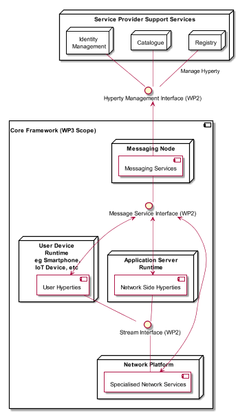

Introduction
============

Objectives and Overview
-----------------------

Project reTHINK proposes a radical transformation on how real time communication services are thought. reTHINK concepts and architecture represents a significant paradigm change for the communication services domain. The reTHINK approach enables the fulfilment of real-time communications requirements that so far have been considered impossible to achieve: trustful identities, interoperable endpoints, agility of introducing new services, and fast moving innovation. Previous Deliverables D2.1 and D2.2 have already started enlightening the path to reach such objectives. A new web service paradigm, the so-called Hyperlinked Entities - Hyperties – was introduced to enable a global network of trustful services executing in web runtime environment, on end-user devices or edge-network servers. Communication between Hyperties is based on the protocol-on-the-fly (ProtoFly) concept that avoids creating or modifying standard network protocols, but utilizes instead standard APIs. Interoperability between Hyperties and Support Services (Registry, Catalog, and Identity Management) are assured by a detailed and extensible data model, combined with the principle of Hypermedia as the Engine of Application State (HATEOAS).

This report provides a detailed specification of reTHINK Core Framework components comprised by the runtime environment where Hyperties are executed and the messaging nodes used to support messages exchange between Hyperties. Thus, and according to reTHINK Architecture [38], the scope of this report includes the specification of the Messaging Node providing reTHINK Messaging Services and the specification of the Hyperty Runtime that will be included in User Devices and Application Servers to deliver User Hyperties and Network Side Hyperties.

It should be noted that the Network Platform specification supporting Specialised Network Services will be reported later in D3.4, as originally planned.

These specifications are compliant with reTHINK Data Model, Hyperty Management interfaces, Stream Interface and Messaging Interface designed in [15]. It should be noted that, according to Protocol On-the-fly concept, the Messaging Interface is defined by the Message Model defined in [15].

Besides the Architecture requirements reported in D2.1 [38] additional specific requirements to Core Framework functionalities were analysed.

The specification of the Hyperty Runtime and the Messaging Node is sustained by a very comprehensive work in terms of state of the art research and procurement of existing open source that will be used to demonstrate the feasibility of the radical reTHINK concepts and of all its benefits. Such approach, will position reTHINK prototypes at the forefront, in terms of technologies and functionalities, optimising the usage of resources and complying with reTHINK ambitious calendar.

An exhaustive study of relevant IETF, W3C standards and others that facilitate the fulfillment of previously analysed requirements, was conducted. Special attention was given to the research on security in Web Runtime. In parallel, existing open source solutions to be used to develop Hyperty Runtime and Messaging Nodes was researched, experimented and selected.

Three solutions to implement the Messaging Node were selected, in order to evaluate in reTHINK testbeds, interoperability between different Hyperties domains that use different Message Nodes, namely Vertx, Node.js and Matrix.

The experimentations performed on JavaScript engines and WebRTC implementations have shown to be very difficult to extend existing runtimes like V8 or Chromium to natively support Hyperties runtime. On the other hand, such approach would also not promote the adoption of Hyperty Runtime by the end-users since it would demand the installation of new platforms to replace popular browsers like Chrome or Firefox. Instead, it was decided to make Hyperty Runtime compliant with existing runtime solutions notably with existing Web Browsers like Chrome and JavaScript platforms like Node.js.

The Runtime design enables reuse of most of the core runtime components through different platforms including Browsers, Standalone Mobile Application, Network Side Application Servers and more constrained M2M/IoT standalone devices.

The specification reported in this deliverable, provides the basis for the implementation tasks but it is expected to be adjusted and to be completed along the implementation phase. In addition, during the implementation phase, a Hyperty Service Framework to be used by Hyperty Developers will be developed and reported in D3.2 (Hyperty Runtime and Hyperty Messaging Node Phase 1 – Feb 2016).

The final specification for Messaging Node and Hyperty Runtime will be reported in D3.3 (Hyperty Runtime and Hyperty Messaging Node Phase 2 – Dec 2016).

Structure
---------

This report starts with an introduction, in Chapter 2, requirements that are more specific to this Work Package namely Runtime Requirements, Messaging Node Requirements, Hyperty Framework Requirements and Quality of Service Requirements are clearly identified. In chapter 3 a summary of the State of the Art and Procurement work is given. The full outcome of the State of the Art work done in WP3 can be found in Annex A. The main part of this report is located in Chapter 4, which details the specification of the Hyperty Runtime, and in Chapter 5, the specification of the Messaging Node.
