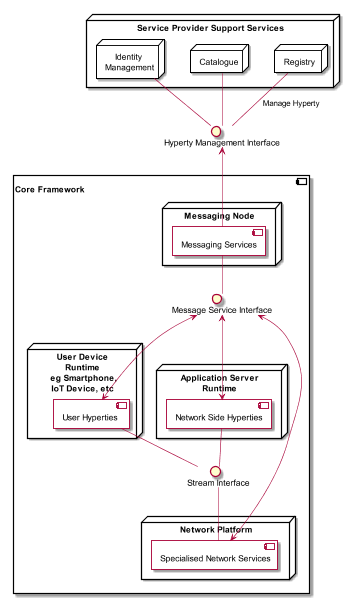

# Introduction

## Objectives

This report provides a detailed specification of reTHINK Core Framework components comprised by the runtime environment where Hyperties are executed and the messaging nodes used to support messages exchange between Hyperties.
Thus, and according to reTHINK Architecture [38], the scope of this report includes the specification of the Messaging Node providing reTHINK Messaging Services and the specification of the Hyperty Runtime that will be included in User Devices and Application Servers to deliver User Hyperties and Network Side Hyperties. 

It should be noted that the Network Platform specification supporting Specialised Network Services will be reported later in D3.4, as originaly planned.

These specifications are compliant with reTHINK Data Model, Hyperty Management interfaces, Stream Interface and Messaging Interface designed in [37]. It should be noted that, according to Protocol On-the-fly concept, the Messaging Interface is defined by the Message Model defined in [37].

The specification of the Hyperty Runtime and the Messaging Node is sustained by a detailed analysis of requirements, of the overall reTHINK Architecture [38] and of the detailed design of reTHINK data models and interfaces [37]. A very compreensive work in terms of state of the art research and procurement of existing open source was performed. Such approach aims to take advantage as much as possible of previously work in order to position reTHINK prototypes at the forefront, in terms of technology and functionalities, satisfying to the planned resources and timeline, to clearly demonstrate the feasibility of the radical Hyperty concepts and of all the benefits claimed in previous reports.

Besides the Architecture requirements reported in D2.1 [38] additional specific requirements to Core Framework functionalities were analysed.

An exhastive study of relevant IETF, W3C standards and others that facilitate the fulfilment of previously analysed requirements, was conducted. Special attention was given to the research on Security in Web Runtime. In parallel, existing Open Source solutions to be used to develop Hyperty Runtime and Messaging Nodes was researched, experimented and selected. 

Three solutions to implement the Messaging Node were selected in order to evaluate interoperability between different Hyperties domains that use different Message Nodes in WP6, namely Vertx, Nodejs and Matrix.

The experimentations performed on javascript engines and webrtc implementations have shown to be very difficult to extend existing runtime like V8 or Chromium to natively support Hyperties runtime. On the other hand, such approach would also not promote the adoption of Hyperty runtime by the end-users since it would demand the installation of new platforms to replace popular browsers like Chrome or Firefox. INstead, it was decided to make Hyperty runtime compliant with existing runtimes notably Web Browsers and Javascript platforms like nodejs.

Once the open source solutions were selected, the Hyperty runtime and messaging node models were specified in detail.

## Innovation

## Structure

