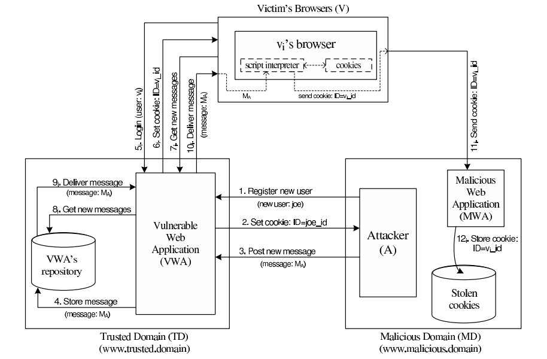
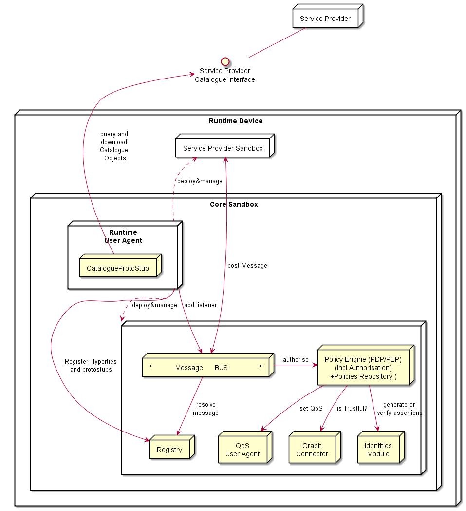
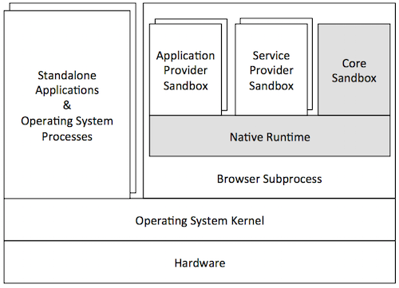
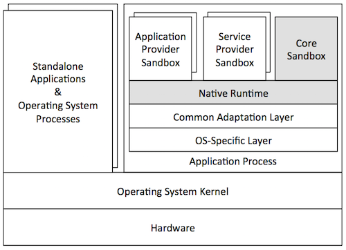
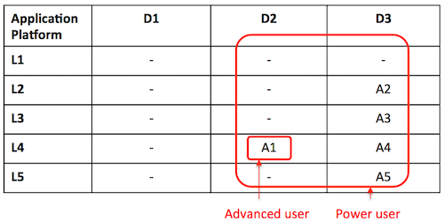
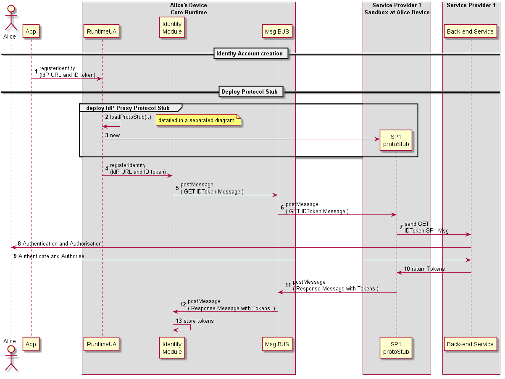

Introduction
============

Objectives and Overview
-----------------------

This report provides a detailed specification of reTHINK Core Framework
components comprised by the runtime environment where Hyperties are
executed and the messaging nodes used to support messages exchange
between Hyperties. Thus, and according to reTHINK Architecture [38], the
scope of this report includes the specification of the Messaging Node
providing reTHINK Messaging Services and the specification of the
Hyperty Runtime that will be included in User Devices and Application
Servers to deliver User Hyperties and Network Side Hyperties.

It should be noted that the Network Platform specification supporting
Specialised Network Services will be reported later in D3.4, as
originally planned.

These specifications are compliant with reTHINK Data Model, Hyperty
Management interfaces, Stream Interface and Messaging Interface designed
in [15]. It should be noted that, according to Protocol On-the-fly
concept, the Messaging Interface is defined by the Message Model defined
in [15].

Besides the Architecture requirements reported in D2.1 [38] additional
specific requirements to Core Framework functionalities were analysed.

The specification of the Hyperty Runtime and the Messaging Node is
sustained by a very comprehensive work in terms of state of the art
research and procurement of existing open source that will be used to
demonstrate the feasibility of the radical reTHINK concepts and of all
its benefits. Such approach, will position reTHINK prototypes at the
forefront, in terms of technologies and functionalities, optimising the
usage of resources and complying with reTHINK ambitious calendar.

An exhaustive study of relevant IETF, W3C standards and others that
facilitate the fulfillment of previously analysed requirements, was
conducted. Special attention was given to the research on security in
Web Runtime. In parallel, existing open source solutions to be used to
develop Hyperty Runtime and Messaging Nodes was researched, experimented
and selected.

Three solutions to implement the Messaging Node were selected, in order
to evaluate in reTHINK testbeds, interoperability between different
Hyperties domains that use different Message Nodes, namely Vertx,
Node.js and Matrix.

The experimentations performed on JavaScript engines and WebRTC
implementations have shown to be very difficult to extend existing
runtimes like V8 or Chromium to natively support Hyperties runtime. On
the other hand, such approach would also not promote the adoption of
Hyperty Runtime by the end-users since it would demand the installation
of new platforms to replace popular browsers like Chrome or Firefox.
Instead, it was decided to make Hyperty Runtime compliant with existing
runtime solutions notably with existing Web Browsers like Chrome and
JavaScript platforms like Node.js.

The Runtime design enables reuse of most of the core runtime components
through different platforms including Browsers, Standalone Mobile
Application, Network Side Application Servers and more constrained
M2M/IoT standalone devices.

The specification reported in this deliverable, provides the basis for
the implementation tasks but it is expected to be adjusted and to be
completed along the implementation phase. In addition, during the
implementation phase, a Hyperty Service Framework to be used by Hyperty
Developers will be developed and reported in D3.2 (Hyperty Runtime and
Hyperty Messaging Node Phase 1 – Feb 2016).

The final specification for Messaging Node and Hyperty Runtime will be
reported in D3.3 (Hyperty Runtime and Hyperty Messaging Node Phase 2 –
Dec 2016).

Structure
---------

This report starts with an introduction, in Chapter 2, requirements that
are more specific to this Work Package namely Runtime Requirements,
Messaging Node Requirements, Hyperty Framework Requirements and Quality
of Service Requirements are clearly identified. In chapter 3 a summary
of the State of the Art and Procurement work is given. The full outcome
of the State of the Art work done in WP3 can be found in Annex A. The
main part of this report is located in Chapter 4, which details the
specification of the Hyperty Runtime, and in Chapter 5, the
specification of the Messaging Node.

Requirements
============

Besides the Architecture requirements reported in D2.1, additional
specific requirements to Core Framework functionalities were analysed
namely for Hyperty Runtime, Messaging Node, QoS (Specialised Network
Services) and Hyperty Framework. It should be noted that Hyperty
Framework will provide developer friendly tools to facilitate the
development of new Hyperties and Applications.

Runtime Node Requirements
-------------------------

-   **The effort to introduce new capabilities in the runtime should be
    reasonable:** for example:

    -   missing WebRTC features eg Identity
    -   Protocol on the fly mechanism
    -   Policy Enforcement Points
    -   Hyperty Registry
-   **The Runtime must be secured:** The runtime must support the
    execution of entrusted code in isolated sandboxes. It should be
    possible to take advantage of existing secured elements like SIM
    cards or embedded SIM

-   **The Runtime must support Real-time computing:** in order to
    support the execution of Hyperties dealing with real-time
    communication functionalities where computing responses must be in
    the order of milliseconds.

-   **The Runtime should support Standardised Messaging Notifications:**
    The Runtime should support standardised W3C [Push
    Messaging](http://www.w3.org/TR/push-api/) which allows applications
    to receive messages sent by servers regardless whether the
    Application is currently active. Useful to support notifications
    about incoming WebRTC calls.

-   **The Runtime should support Web Socket:**

-   **The runtime must support standard Javascript (ECMAScript):** at
    least [ECMAScript version
    5](http://www.ecma-international.org/ecma-262/5.1/) (Javascript).

-   **The Runtime should support W3C WebRTC APIs:** including:

    -   [Media Capture and Streams
        API](http://www.w3.org/TR/mediacapture-streams/)
    -   [WebRTC](http://www.w3.org/TR/webrtc/)
-   **The Runtime should be deployable in the most used Devices and
    Operating Systems:** including:

    -   Android (Smartphone and Tablet)
    -   iOS (Smartphone and Tablet)
    -   Raspberry PI
    -   Linux
    -   Windows

Messaging Node Requirements
---------------------------

-   **Messaging Node should be resilient:** when operating under
    overload situations or failures, in general.

-   **The Messaging Node MUST offer DoS and DDoS Protection:** The MN
    MUST provide protection against Denial of Service (DoS) and
    Distributed Denial of Service Attacks (DDoS)

-   **Messaging Node should support Protocol on-the-fly:** to
    inter-operate with other Messaging Nodes or Back-end servers without
    having the need to standardize the protocol to be used.

-   **Messaging Node should support different Encrypted Messaging
    Transport Protocols:** including:

    -   Encrypted WebSockets
    -   HTTPS Streaming
    -   HTTPS Long-Polling
    -   HTTPS REST
-   **Messaging Node should support logging of routed messages:** and
    any other event (e.g. connection events) in remote log servers

-   **Message must support delivery reliability:** Delivery errors must
    be returned to clients

-   **Messaging Node must support worldwide scale deployments:**

-   **Messaging Node should be tolerant to unstable connections :** When
    connections to Messaging Node are resumed from a short disconnected
    period of time or when client IP address changes eg due to access
    network handover (eg wifi to LTE), should have no impact on the
    client side service.

-   **Events must be fired when clients connect and disconnect from the
    Messaging Node:** It should be possible to get events with
    information about Messaging Node clients connection and
    disconnection. Such feature is useful for connection status
    purposes.

-   **Messaging Node must support very low message delivery latency:**

-   **Messaging Node should require minimal computing resources:** in
    order to be deployable in constrained computing environments eg
    residential /enterprise gateways.

-   **Messaging Node must support external authentication and
    Authorisation:** including:

    -   send/publish a Message
    -   receive a Message
    -   subscribe / register handlers to be notified about published
        messages
-   **Messaging Node must support multiple message oriented
    communication patterns:** including:

    -   pub/sub
    -   broadcast
    -   one to one

Network QoS Requirements
------------------------

-   **QoS required by enterprise, if it is involved in the communication
    :** Enterprises may have specific requirements for both QoS and
    security, and may wish to enforce them for special destinations,
    e.g. critical services or important customers.
-   **QoS component should assure collaboration between network and
    application layer actors:** There should be collaboration between
    network operators (Network or Internet Service providers) and
    communication service providers, e.g. 3rd party communication
    service providers, since network operators do not have the control
    over the whole environment.

-   **QoS component should provide a single contact point for
    troubleshooting issues:** A single contact point should be assured
    for troubleshooting issues, i.e. to verify the appropriate level of
    the quality and make eventual improvements. A broker component will
    be discussed since it can assure a single contact point and
    collaboration between different actors.

-   **QoS component should enable isolating and valorising performance
    improvements:** Segments that contribute to improvement of quality
    should be identified. The improvements should be valorised and
    quantified, e.g. for monetization reasons.

-   **QoS component should leverage IP paths diversity:** There are
    different possible connection paths, i.e. paths offering best-effort
    services or managed paths with a certain Service Level agreement.
    These different possibilities should be considered.

-   **QoS component should impact different network types and
    segments:** The solution should impact mobile, wireline, wifi access
    networks, but also interconnection. In the discussed architecture
    there is a focus on offering specialized network services for fix
    and mobile networks and for different network segments, i.e. access
    and interconnection.

-   **QoS component should be compatible with evolution of different
    standards and terminals:** The proposed solution should be in line
    with evolution of standards and adapt to application layer
    technologies.

-   **QoS component should be compatible with deployed network
    technologies:** Eventual improvements should be in line with current
    technologies. It should not be necessary to make big changes to
    existing network deployments, but current technologies should be
    modified or improved.

-   **QoS component should be compatible with application layer
    technologies e.g. WebRTC:** The solution should be in line with
    application layer technologies, so it could be easily adapted by web
    developers and service providers.

-   **QoS component should exploit partially SLA and partially
    best-effort network segments:** The communication service path can
    consist of parts provided by different actors. As not all of these
    actors may be willing to provide quality of service, the
    communication path may consist of segments with Service Level
    Agreement or with best effort quality. As a result there is not
    necessarily end-to-end path, but the quality may vary. As a result
    the solution should take into consideration the fact that not all
    network segments in the path can provide QoS.

-   **QoS component should take into account participating and
    non-participating actors:** Network QoS should take into account a
    fact that in the communication path there can be participating and
    non-participating actors, i.e. not all actors will support providing
    network QoS so it will not always be possible to offer end-to-end
    quality.

-   **QoS component should have global reach:** Network QoS should be
    provided on a global scale, i.e. it should not be limited only to a
    given territory or a group of clients.

Service Framework Requirements  
----------------------------------------

-   **Service Framework MUST be Message Node agnostic.:** Within the
    reTHINK project, different implementations of the Message Node will
    be provided. The Service Framework must be compliant across various
    types of Message Node used.

-   **The Service Framework MUST avoid any JavaScript conflicts:** The
    Hyperty Developer can use any JavaScript framework of choice in the
    implementation of application. Frameworks such a AngularJS [51] have
    complex directives which are potential sources of conflicts which an
    application. The Service Framework should be to co-exist with other
    JavaScript Frameworks.

-   **Service Framework MUST be Modular in nature:** Development of
    modules on the Framework should be loosely coupled, self contained
    and re-usable by other libraries/modules.

-   **The Service Framework MUST be open source:** No proprietary
    solution for the reTHINK prototype, as the project itself demands
    all components be open source.

-   **Service Framework should be device agnostic:** The Service
    Framework should be supported on all devices and operating systems
    featuring the Hyperty Runtime. The Runtime is envisioned to be
    deployed on the most used Devices and Operating Systems, including:

    -   Android (Smartphone and Tablet)
    -   iOS (Smartphone and Tablet)
    -   Raspberry PI
    -   Linux
    -   Windows
-   **Service Framework MUST be light weight and fast:** The service
    framework size is important as latency plays an important role and
    downloading heavy weight files would add overhead thus diminishing
    the performance and user experience.

-   **Service Framework SHOULD support Model-View-Controller design
    pattern:** Model-View-Controller approach: enables easier
    maintainability and clarity. The view presents data to users through
    format & layout. The view is rendered by the model. The model
    handles data & business logic. It also allows for clear separation
    between the presentation (View) and application logic. Meanwhile the
    Controller receives user requests and calls back to the model to
    select a proper view via HTTP GET or POST request to manage the
    data. Within the Service Framework, more focus will be laid on the
    Model. The View and Controller will remain flexible for the
    developers to determine according to their requirements and
    preferences.

State of the Art and Procurement
================================

In this chapter, a summary of the exhaustive work performed in terms of
research of state of the art and procurement of open source solutions to
be used in the implementation phase, is provided.

This State of the Art, complements the general architecture State of the
Art and goes deeper in domains addressed by core framework
implementation, namely:

-   Security in Web Runtime.
-   Standards that WP3 should comply with, notably W3C APIs and IETF
    Protocols.
-   Web Runtime solutions including JavaScript runtime and WebRTC
    implementations.
-   Real Time Messaging solutions including Node.js and Vertx.
-   Partners' Assets that can be leveraged or integrated with reTHINK
    testbeds including Quobis [104] and APIZEE [103] products as well as
    the open source WONDER library [36] prototyped by PTIN and DT in the
    scope of WONDER project [32].

A detailed report of state of the art and procurement for Standards,
Messaging, Runtime, QoS, Projects and Web Frameworks are provided in
Annex A.

Security in Runtime
-------------------

In this section, we present the relevant related work on security
runtime environments. We focus essentially on two areas: web browsers,
and secure elements. The web browsers section present security
mechanisms for JavaScript code protection. The secure elements section
provides an overview of code security runtime for computing devices
featuring less functionality and computation capabilities but requiring
tighter security requirements during its operation.

### Web Browsers

#### Monolithic vs Modular Architectures

Traditionally, commercial and open-source web browsers employed a
monolithic architecture. This means that both users' and web
applications' data are combined into a single security domain, which
brings serious performance/usability and security issues. On the
performance/usability side, if a web application crashes during its
execution, the whole web browser can be affected, harming the user
experience. On the security side, if an attacker exploits an unpatched
vulnerability in the browser while a user is using it, the attacker may
gain access to the whole user space, being able to execute code on
behalf of that user and access its private sensitive information, such
as security credentials.

Nowadays, web browsers evolved into modular architectures, in order to
achieve privilege separation and overcome monolithic architectures'
limitations. This way, browser developers came up with multiple
different architectures to achieve this separation between what is
user's property (e.g., credentials, preferences) and what is "web’s"
property (e.g., applications' code). In order to achieve this separation
in these architectures, multiple techniques have been employed:

-   **Sandboxing:** In computer security, a sandbox is a security
    mechanism, which allows untrusted programs to run within a trusted
    environment, without affecting the environment or other co-located
    programs. This is usually done by restricting the resources (disk,
    memory and network) that the untrusted software can access. An
    example is creating scratch memory and disk spaces where it can
    read/write and limiting the network capabilities it can use, in
    order to prevent the host environment from getting damaged. This is
    what Chromium browser [1] applies to separate the user and the web
    side in a modular architecture. It features two modules:

    -   A **browser kernel module** that acts on behalf of the user and
        is responsible for implementing the tab-based windowing system
        of the browser. It stores users' data as its preferences,
        bookmarks, credentials and cookies and also works as middleware
        between the native operating system window manager and every
        instance of the second browser module, the rendering engine.
    -   A **rendering engine** that implements the web application
        behaviour. It interprets and executes web content, serving calls
        to the DOM API. It is the unique browser part in contact with
        the untrusted web content. Apart from that, it is also
        responsible for enforcing the same-origin policy between the
        user and a website he's visiting.

#### Browser Extensions Security

Browser extensions provide useful additional functionality to web
browsers, such as facilitating the access to a website's content or even
as almost standalone applications running on the browser environment.
However, these extensions often introduce serious security issues into
both user’s browser and websites. This is because oftentimes extensions
are written by developers with good programming skills who, however, are
not security experts. Extensions can read and alter users' bookmarks and
preferences, websites' content and perform requests over the network,
many times on behalf of the browser user. Browser extensions are mostly
written in JavaScript and HTML, and since JavaScript provides methods
for converting a string to code (e.g. "eval"), an extension may be
dangerous if misused.

Typically, benign extensions face two types of attackers:

-   **Network attackers:** These attacks target end-users who connect to
    unsecure networks (i.e. public Wi-Fi hotspots), and consist in
    sniffing and altering HTTP traffic. These attackers search for any
    HTTP script - JavaScript file loaded over HTTP - loaded by the
    extension, and try to introduce malicious code into this script's
    code, in such case.
-   **Web attackers:** A malicious website can launch a XSS attack on an
    extension if the extension treats the website as trusted, possibly
    stealing the browser’s userdata, like credentials. This way, it can
    scale up to attack multiple websites within the same entry point.

According to [2], Google Chrome and its extension platform apply three
mechanisms to prevent these vulnerabilities:

-   **Privilege Separation:** Every Chrome extension has two types of
    components which run in separate processes: zero or more content
    scripts and zero or one core extension. Content scripts read and
    modify websites as needed. The core extension implements
    functionality not directly involving websites, like browser UI jobs
    or long-running background tasks. These two types of components
    communicate by sending structured clones over a trusted channel.
    Each website that an extension communicates with, receives its own
    isolated instance of a content script, making content scripts highly
    bound to attacks. However, only the core extension is able to
    communicate with the Chrome extension's API, reducing the risk that
    a content script is able to access the user data space. The
    architecture scheme of a Google Chrome extension is on Fig. 3.
-   **Isolated Words:** This mechanism ensures that content scripts and
    websites have separate JavaScript heaps and DOM objects.
    Consequently, content scripts never exchange pointers with websites,
    protecting them against web attackers.
-   **Permissions:** Extension developers have to specify the desired
    permissions in a kind of manifest file that is packaged with the
    extension. For example, the bookmarks permission is needed for the
    extension to be able to read and alter the user's bookmarks. Only
    core extension can use permissions to invoke browser API methods,
    while content scripts are limited to interacting with the core
    extension and the website it is running on. This way, an extension
    is limited to the permissions its developer requested, so an
    attacker is not able to request new permissions for a compromised
    extension in runtime.

#### XSS Detection Techniques

Cross-Site Scripting (XSS) attacks are getting more common on the web,
since they allow an attacker to get control of a user’s browser and
execute malicious code (usually JavaScript/HTML) within the trusted
context of a web application. This can result in the attacker being able
to access any sensitive information associated to the application
(cookies, session IDs, etc.). The study of XSS attacks can be split into
two distinct categories, according to [3]:

-   **Persistent/Stored attacks:** Occurs when a malicious user
    registers itself into a web application and posts a malicious
    JavaScript to the application, which, by its turn, save it into the
    application’s data repository, persistently. After that, if another
    user fetches the content uploaded by the malicious one onto his
    browser, and since this code is coming out of the trusted context of
    the web application, the user’s browser will allow the script to
    access any possibly sensitive resource it is willing to, overcoming
    this way the security imposed by the same-origin policy. Apart from
    stealing the user’s information, XSS attacks can also be used to
    redirect users to a malicious website which can then perform other
    distinct attacks within its context. A persistent XSS attack scheme
    is presented on Fig. 4.

-   **Non-persistent/Reflected attacks:** Unlike the first type,
    reflected attacks do not persistently store malicious code in the
    web application data space. Instead of that, the content is
    automatically reflected back to the user through a third-party
    mechanism. For example, by using a spoofed email, an attacker can
    make a user click on a link containing malicious code, which will
    finally be interpreted by the user’s browser, but within the trusted
    context of the web application. This type of XSS attacks is often
    combined with other techniques as phishing, and is the most common
    type of XSS attacks in web applications. Figure 5 shows a scheme of
    the architecture of a non-persistent XSS attack.

#### XSS (and Other Types) Prevention Techniques

We briefly discuss two relevant XSS prevention techniques: (i) analysis
and filtering of exchanged information, and (ii) security enforcement on
the web browser runtime.

**Analysis and Filtering of Exchanged Information**

This technique consists in defining a list of characters or tags which
users are allowed to exchange with the web application, in the form of
text inputs, uploaded files, etc. Then, a filtering process simply
rejects everything that is not part of the list. Other approach,
reported in [4], is having a proxy-server at the web application’s site
in order to filter both incoming and outgoing requests. This filtering
takes into account a set of rules defined by the application developers.
However, a simple use of regular expressions is able to evade both the
referred methods and proxy-servers can rapidly become a performance
bottleneck on the application deployment. Pietraszeck et al. [5] also
suggested placing a proxy-server on the server-side of the application,
but in order to differentiate trusted and untrusted traffic, driving
each type to separate channels. This partitioning process uses
Information Flow Control techniques to taint information and track it
thenceforward.

From another point of view, some approaches [6,7] propose the content
filtering to happen at the client-side. On the one hand, Kirda et al.
[6] try to achieve the prevention of XSS attacks by blacklisting links
embedded within the web application’s pages, making them unavailable for
the client. However, the authors say this approach can only detect basic
XSS attacks based on the violation of same-origin policy. On the other
hand, Ismail et al. [7] present another client-proxy solution that is
intended to detect malicious requests reflected from the attacker to the
victim (non-persistent XSS attacks). If such a request is detected, the
malicious characters are re-encoded by the proxy, trying to avoid the
success of the attack.

**Security Enforcement on the Web Browser Runtime**

There are also other strategies which try to avoid the need for
intermediate elements like proxy-servers by proposing strategies to
enforce the runtime context of the web browser. Hallaraker et al. [8]
propose an auditing system for the JavaScript interpreter of the Mozilla
Firefox browser, which detects misuses on JS operations and take
counter-measures to avoid violations on browser’s security. Other
approach [9] presents the use of dynamic taint tracking on JavaScript
code, in order to detect whether browser’s sensitive resources are going
to be transferred to an untrusted third-party. In such case, the user is
warned and can decide whether he allows or denies the transfer. Finally,
Jim et al. [10] propose a policy-based management where a list of
actions is embedded into the documents exchanged between the browser and
the server. These actions help the browser to decide whether or not a
script should be executed. Although, a lack of semantics in the
policy-language and the restrictiveness of the approach due to the
sandboxing-like mechanism are some of the drawbacks.

### Automated Analysis of Security-Critical JavaScript APIs

Current web applications usually rely on JavaScript in order to offer
additional features like maps, widgets or social media content.
Although, since these additions may manipulate a page Document Object
Model (DOM), steal cookies or navigate on the page, untrusted
third-party JavaScript may pose security threats to the hosting page.

A widely-used approach is to combine a language-based sandbox to
restrict the capabilities of untrusted JavaScript with an API offered by
the trusted code part to the untrusted one. This API encapsulates all
security-critical resources and guarantees they are only accessed in a
safe way.

Given this, Taly et al. [11] proposed ENCAP, a tool that verifies API
confinement, analyzing the isolation level it can offer to the critical
objects it is intended to protect. ENCAP relies on a context-insensitive
and flow-insensitive static analysis method. It analyses the API
implementation and generates a conservative Datalog model of all API
methods. Also, they propose SESlight, an ECMA JavaScript-subset language
which only allows a strict (syntactically and semantically verified)
subset of the whole language to be used.

### Secure Elements

#### Java Card: Internet Computing on a Smart Card

In secure computing, a smart card is a typical card with a built-in
computer chip. Until a few years ago, it was only used to produce credit
and debit cards, whose information can only be accessed when in
possession of the card itself and a PIN code. Due to the short
information on how to communicate and program them, until a few years
ago this useful technology wasn't being used on computer security in
general.

**Hardware**

This single-chip computer is an off-the-shelf *8-bit microcontroller*
with added tamper-safe features. While most 8-bit microcontrollers can
support at least *64 KBytes* of 8-bit memory, popular smart cards
contain 4 to 20 Kbytes of memory, due to size constraints. The memory
space of a smart card is divided into RAM, EEPROM and ROM. RAM is used
to store temporary values when a program is running, while EEPROM is
used to store sensitive data as an encryption key or the account holder
info on credit cards. Finally, ROM is used to store the basic programs
that run on the smart card. The single-chip computer is embedded in a
plastic chip carrier, and both of them hold several tamper-resistant and
tamper-detection features.

![Figure 6: Java Smart Card scheme [11]](java-smart-card.jpg)

**Software**

The paucity of 8-bit assembly language courses, books and software tools
led engineers to break the smart card application bottleneck by building
a Java virtual machine with its runtime support into a 12-Kbyte smart
card. Java was the natural answer for three reasons:

-   Java brings smart card programming into the mainstream of software
    development
-   Java “safe programming” security model based on a runtime
    interpreter is a nontrivial side benefit, due to its processor
    independence. A Java card can be deployed on multiple smart card
    models.
-   Java interpreters were tested to the limit, holes had been found,
    and fixed.

With this in mind, engineers concluded that Java could preserve the
required security in the smart card operation, while allowed a more
friendlier and well-known programming approach. However, available
memory was an issue when deploying such heavy language runtime like
Java. Features like garbage collection and exceptions handling were not
included in Java Card because of that.

**Internet Computing with Java Smart Card**

Java Cards combine smart card’s identity-verification features with the
Java “sandbox”, guaranteeing that only allowed applications run on the
card and that applications are protected from each other.

#### Cloud of Secure Elements

Cloud of Secure Elements (CoSE) [12] is an emerging concept whose goal
is to provide trusted computing resources to mobile and cloud
applications. To achieve this, it relies on an infrastructure composed
by multiple secure micro-controllers, named Secure Elements.

CoSE, in a WEB-like paradigm, are meant to support Uniform Resource
Identifiers (URIs) for users to locate the different secure elements and
use their embedded resources. These resources usually target two service
types: Near Field Communication (NFC) facilities for mobile applications
and trusted cryptographic features for cloud applications.

**Architecture**

A Cloud of Secure Elements involves the following stakeholders, as Fig.
7 shows:

-   NFC kiosks, typically deliver payment facilities
-   Users with NFC-enabled devices or terminals needing trusted
    cryptographic resources
-   Grid of Secure Elements (GoSE)
-   Secure elements, with resources identifiable by URI
-   Remote administration entities, performing management operations
    over applications and secure elements

**Grid of Secure Elements (GoSE)**

A grid of secure elements is an Internet server hosting multiple secure
elements. Each element may be plugged in through USB readers, hardware
sockets or electronic boards. Communication may be achieved with RACS
protocol (works over IP/TCP/TLS stack) and performs both the association
between elements and unique identifiers and data exchange with secure
elements.

**Malicious Code on Java Cards: Attacks and Countermeasures**

Despite all the advantages on using Java language in smart cards, such
as the absence of low-level memory vulnerabilities, Java Cards still
have an open door for attacks through malicious code. This attack entry
is possible because an on-card bytecode verifier (BCV) is optional on
Java Cards, and those who don't feature it, are more open to malicious
code that might damage other applets running on the system or even the
platform itself.

#### Defenses against Malicious Code

We present the different mechanisms for protection against malicious
code actions present in Java Cards.

**Bytecode verification**

Bytecode verification of Java code guarantees type safety, and thus,
memory safety. On normal Java platform, bytecode verification occurs at
load time. However, since Java Cards do not support dynamic class
loading, this verification must occur at the time an applet is installed
to the card. Nevertheless, most Java Cards do not feature an on-card BCV
and rely on a digital signature of a third party that is trusted to have
performed bytecode verification off-card.

**Applet firewall**

The applet firewall is an additional defense mechanism present in Java
Cards. The firewall performs runtime checks to prevent applets from
accessing and/or altering data of other applets (concretely, in a
different security context). For every object within an applet, the
firewall records its context, and for any field or method accessed this
context is checked. Only the Java Card Runtime Environment (JCRE) has
unlimited permission, since it executes in root-mode, on a UNIX
terminology.

#### Getting malicious code on cards

**CAP File Manipulation**

This is the easiest way of introducing ill-typed code on a Java Card.
This can be achieved by editing a CAP (Converted APplet) file to
introduce a type flaw in the bytecode and install it to the card.
Despite, this will only work for cards without an on-card BCV and with
unsigned CAP files. In example, by changing a `baload` (byte load)
opcode onto a `saload` (short load) one, will make the platform treat a
byte array as a short array, and can potentially lead to accessing other
applet's memory space.

**Abusing Shareable Interface Objects**

The shareable mechanism of Java Card can be used to create type
confusion between applets without any direct editing on CAP files.
Shareable interfaces allow direct communication between security
contexts. Using this to create type confusion is pretty simple: Let two
applets communicate through a shareable interface, but compile and
generate CAP files for both applets using different definitions of the
shareable interface, which is possible because the applets are compiled
and loaded separately. This way we can achieve an attack like the CAP
file manipulation but without ever touching the CAP file directly.

**Abusing the transaction mechanism**

The Java Card transaction mechanism is probably the trickiest aspect of
the Java Card platform. It allows multiple byte-code instructions to be
turned into an atomic operation, offering a roll-back mechanism in case
the operation is aborted, either through card tear or calling an API
method. Buggy implementations of the transaction mechanism in some cards
tend to make it not behave as expected. When object references are
spread around the code, by assignments to instance fields and local
variables, it becomes difficult for the mechanism to keep track of all
the references that should be nulled out. The root cause of the problem
is that stack-allocated variables, such as *"`short[] localArray`"* are
not subject to roll-back in the event of a programmatically transaction
abort (through API method call).

#### Dynamic Countermeasures

Now we enumerate some dynamic runtime checks implemented by some VMs in
order to prevent ill-typed code to damage the Java Card platform. These
were verified by Mostowski et al. [13], by performing tests on multiple
Java Card models of multiple manufacturers against the referred
vulnerabilities:

-   Runtime type checking
-   Object (array) bounds checking
-   Physical (byte size) bounds checking
-   Firewall checks
-   Integrity checks in memory

Standards
---------

The reTHINK project describes a framework that provides solutions to
manage real time communication capabilities. To implement this framework
the project team tried to use the most suitable existing standards which
provide compatibility with existing technologies. Using consolidated and
widely used standards also make the development more efficient since
open source libraries can be used in the developments. Additionally to
well-known standards, the project team has also tried to find emerging
standards, which can be adapted for reTHINK requirements. In those
cases, a trade-off analysis has been made to determine if the choice of
a not consolidated standard is optimal in terms of cost of use due to
the lack of existing libraries and projects, which use them.

The IETF has been creating and promoting the Internet standards since
1986. The IETF is organized in a large number of Working Groups (WG),
which works on specific areas. For reTHINK project, the team has focused
on standards delivered by several WG (namely Rtcweb, TRAM, HTTP/2 and
Network). The Rtcweb WG has defined a set of RFCs (many of them are
still drafts), which are used in WebRTC, it defines how WebRTC works on
the wire. Many of the used protocols already existed but many of them
were created ad-hoc to meet WebRTC requirements. Other RFCs are
informational and have been released to gather the WG knowledge in a
formal way. The TRAM (TURN Revised and Modernized) working group is
carrying out a modernization of the protocols used to transport
real-time media over Internet which is the final function of ReTHINK
framework.

HTTP/2 is the new version of HTTP/1.1 which has been used in the web for
the last 16 years. It provides a new low level design to optimize
current Web applications keeping the semantic of HTTP/1.1 which is still
valid. HTTP/1.1 has been historically transported over TCP, however to
take advantage of all the new features of HTTP/2 a new transport
protocol build over UDP has been designed: QUIC. HTTP/2 draft is based
on SPDY but it includes new features and will soon become a definitive
RFC. The draft belongs to the HTTP WG. QUIC was developed by Google but
it has been recently become an IETF Draft taking over the last changes
in the protocol until close the definitive RFC. HTTP/2 over QUIC has
been considered as an alternative for messaging in the ReTHINK framework
as it is optimized to be used over wireless connection and minimizes the
delay in every communication.

The IETF is in charge of standardizes all the protocols on the wire in
Internet. In turn, the W3C (WWW Consortium) is the main international
standards organization for the World Wide Web. It standardizes how the
browser behave (e.g. WebRTC 1.0 API exposed by the browsers) and the
languages (e.g. HTML and JavaScript) which can be executed by a standard
browser. Its main role is to promote and homogenize the evolution of the
Web. During the state of the Art research work we focused on the
standards susceptible of being used by any element within the reTHINK
framework.

The WebRTC 1.0 API has been standardized by the W3C and is the way in
which a JavaScript application interacts with the browser to establish
real-time sessions with other WebRTC endpoints. A comprehensive
knowledge of this API was necessary to make design decisions and to
define the architecture and the data model of the framework.

A Community group has been created within the W3C to promote an
alternative WebRTC API called ORTC (Object Real-Time Communications),
which gives more control to the WebRTC developer making easier to
implement some scenarios. There are still not implementations of ORTC in
production-ready browser, however the features introduced by this
standard, which is likely to become the base of the WebRTC 2.0 API have
been considered during the design phase.

Another relevant W3C API is the Push API, which allows a push service to
send "push messages" to a webapp regardless of whether the webapp is
currently active on the user agent. This is specially useful for webapps
running on mobile devices where the webapp may need to receive a
notification while the browser is not in foreground.

The use of another feature supported by browser called Service Workers
has been already evaluated to be used to implement different parts of
the Runtime environment. Despite the fact that this specification is
still a Working Draft of the W3C it is already supported by the most
important browsers. However, this is feature is not supported by server
side JavaScript-based runtime environments. It only can be used when the
runtime is executed by a browser.

There is another interesting W3C Draft called "Application Lifecycle and
Events" which extends the Service Workers with APIs for managing the
lifecycle of an application and associated events. This Draft allows web
developers to create applications that manage the application lifecycle
and react to system events e.g. email or VoIP application. However, this
Draft has been not been adopted by many vendors so far.

In this section the standards released by the Open Mobile Alliance (OMA)
were also reviewed. The OMA is a Mobile Operator driven industry forum
for the definition of inter-operable mobile service enablers. OMA
defines APIs to offer functionalities and resources of Operator networks
to developers. Amongst the API and protocols standardized by the OMA the
team decided to review those which are relevant for the project such as
the Authorization Framework for Network APIs, the RESTful Network API
for WebRTC Signalling, Quality of Service API and Notification Channel.
The LWM2M/COAP protocol which was designed to be supported by
constrained devices has also been considered as a suitable alternative
to interact with the Registry and Discovery services.

Finally, a recent standard called Smart Device Template (SDT) and
released by the HGI (Home Gateway Iniative) has been reviewed. It
provides a framework to create a consistent representation of Smart Home
devices. This makes easier the integration of new devices in Home
Gateway or in the cloud being specially interesting to implement M2M
within the reTHINK framework.

Runtime
-------

A very comprehensive analysis and evaluation of existing web runtime
solutions was performed.

In order to evaluate the possibility to modify native implementations of
WebRTC engines, Ericsson OpenWebRTC and Google WebRTC.org solutions were
considered. OpenWebRTC is a promising modular WebRTC implementation
based on popular GStreamer multimedia framework open source solution.
Unfortunately, OpenWebRTC support by Ericsson lacks required
documentation to let it be adapted to fulfill reTHINK requirements.
Google WebRTC.org solution is the reference implementation of WebRTC
specification providing all APIs defined in the standards. However, the
effort required to change it to fulfill reTHINK requirements is
estimated to be very high. On the other hand, having an extended version
of an existing WebRTC implementation would require the user to install a
new reTHINK Browser. For all the above reasons, it was decided to re-use
existing native implementations of WebRTC engines without modifications.

JavaScript engine solutions were evaluated to analyse the possibility to
adapt them in order to fulfill reTHINK runtime requirements, notably in
terms of security (sandboxing). The V8 JavaScript Engine is an open
source JavaScript engine developed by Google for the Google Chrome web
browser. It has since been used in many other solutions and it is
considered the most powerful JavaScript engine in terms of features and
performance. It has mechanisms to facilitate its extension with new
features but lacks required mechanisms for sandbox creation. One
evaluated alternative is to use Node.js that runs on top of V8 as well
as having Node.js inside Docker taking advantage of its management and
security features. Both solutions fulfil reTHINK security requirements
and will be considered for reTHINK runtime implementations that are not
based on browsers.

Firefox OS is a good candidate to implement reTHINK runtime in mobile
devices supporting this Operating System. It natively supports
JavaScript and HTML APIs 5 (including WebRTC) as programming language,
and a robust privilege model to communicate directly with cell phone
hardware, and application marketplace.

Three WebRTC based Media Server solutions were evaluated. Jitsi
Videobridge supports Selective Forwarding Unit (SFU) for multiuser video
communication and it is based on XMPP architecture. Kurento, supports
MCU/SFU Star topologies and a modular architecture to implement media
processing services. Janus Gateway is a flexible and modular WebRTC
gateway that can be used to deploy a full-fledged WebRTC gateway on a
cloud provider or just a small nettop/box to handle a specific use case,
looking at applications as pluggable modules that a client can connect
to through this gateway. These solutions, are good candidates to support
server side Hyperties providing media related services.

Messaging
---------

The Messaging Services, as it appears in the architecture, is the server
side platform that will support several functions provided by the
Service provider. In order to evaluate the options to implement the
messaging service, different existing solutions have been considered:
Matrix, MQTT, Node.js, Psyc, RabbitMQ, realtime backends (also kown as
noBackends or Backend-as-a-Service), Redis, Vert.x, XMPP and ZeroMQ.

### Matrix

The end goal of Matrix is to be a ubiquitous messaging layer for
synchronising arbitrary data between sets of people, devices and
services. Matrix doesn’t support external authentication and
authorisation. It also needs to adapt support of messaging transport
protocols by wrapping Event/messages in REST messages.

### MQ Telemetry Transport

MQ Telemetry Transport (MQTT) is a lightweight broker-based
publish/subscribe messaging protocol designed to be open, simple,
lightweight and easy to implement. As it fulfils all the criteria
defined above MQTT is a potential candidate for Messaging Node.

### Node.js®

Node.js® is a platform built on Chrome's JavaScript runtime for easily
building fast, scalable network applications. Node.js doesn’t support
pub/sub by itself, but it can if it is associated with another Pub/Sub
mechanism (e.g. Redis).

### PSYC

PSYC is a mostly text-based protocol, aiming at providing a
decentralized global messaging infrastructure for unicast/multicast
chatting and social media exchanging. Its goal is to replace the popular
IRC protocol. There is no evidence in the documentation that PSYC is
able to accept external authentication/authorisation methods other than
its own one. Moreover, a certain degree of latency is inevitable, due to
the use of TLS and DoS techniques.

### RabbitMQ

RabbitMQ is defined as a robust and easy to use messaging platform that
can work synchronously an asynchronously. It partially supports
Messaging transport protocols but should not be tolerant to unstable
connections.

### Realtime backends

Realtime backends (aka noBackend or BackendAsAService(BaaS)) is a
concept related to real time databases. The backend and its remote
framework is taking into account all low level mechanism of
client-server dialogue, allowing developer to concentrate in service
logic, in its local runtime. The realtime backend concept would allow
defining and managing interworking with other services, in a way that
entirely belongs to each application.

### Redis

Redis is an open source advanced key-value cache and store. Its
weaknesses are that Redis has no logging features; they need to be
implemented externally. Moreover, there is no indication that Redis is
tolerant to unstable connections.

### Vert.x

Vert.x is an application framework providing possibilities to develop
loosely coupled network service applications.

### XMPP

The Extensible Messaging and Presence Protocol (XMPP) is an open
technology for real-time communication, which powers a wide range of
applications including instant messaging, presence, multi-party chat,
voice and video calls, collaboration, lightweight middleware, content
syndication, and generalized routing of XML data.

### ZeroMQ

ZeroMQ is a high-performance, low level, asynchronous messaging library
originally written in C++, that now has multiple native Implementations.
It is used as a thin layer between the application and transport layers.

### Selected Real time Messaging Solutions

In the scope of reTHINK framework, Matrix, Node.js and Vert.X have been
selected to implement the Messaging Node.

Service Frameworks
------------------

Objective of the Service Framework is to develop a JavaScript Framework
of libraries that can be used to facilitate the development of
Hyperties. This framework will complement the features provided by the
Hyperty Runtime and Network QoS Policy Enforcement. The end results of
the Service Framework should support Hyperty Development which further
assist in the implementation of Conversational Services (audio, video,
chat, screen sharing) and Context Enabled Services (Conversational
Services, IoT, context delivery, location) that will be used in reTHINK
testbeds.

An analysis of existing JavaScript frameworks based on the reTHINK
Service Framework requirements was carried out on some of the popularly
used frameworks today. These frameworks all endeavour to facilitate the
development of web applications utilizing the Model-View-Control design
pattern. For the reTHINK project however, focus was on the data model
management and routing capabilities of these frameworks.

Even though AngularJS is the most popular framework, which provides
great two way data-binding allowing for synchronization of data, and has
a large community base, it was not considered a suitable applicant for
this project due to its complex directives API and inflexibility on
configuring (i.e. it offers no configuration possibilities after the
Bootstrap procedure). Another reason is that Angular is more suitable
for Single Page Apps (SPA) unlike a dynamic environment like the reTHINK
runtime where multiple applications can be downloaded and executed
concurrently.

Another analyzed framework was BackboneJS which also did not fit into
the reTHINK service framework requirements due to the lack of a modular
structure. Backbone lacks a controller concept and views and Models are
relatively tightly coupled, resulting too tightly coupled modules which
are not desirable for the reTHINK project.

StapesJS another analyzed framework offered a lightweight less complex
framework especially suitable of mobile platforms. However it in itself
offers very little APIs and demands combination with other libraries
such as JQuery, React and Rivets.

MeteorJS on the other hand is a good applicant. MeteorJS offers rapid
prototyping and produces cross-platform code for mobile and fixed
platforms. It offers the distinct advantage to be used on all devices
and operating systems featuring the Hyperty Runtime. However it has very
strong dependency to the back end server being Node.js. What this means
for the reTHINK project is it will fit in perfectly, if the tool of
choice for the Messaging Node where Node.js. This is compatible with the
other components as Node.js is one of the tools considered for the
reTHINK Messaging Node.

From the above analyzed frameworks, there is no strong conclusive
statement which one is best to be used to develop the Service Framework
as they all have advantages and disadvantages. To fulfill the objectives
of these task, the approach has to be more specific as to what the above
frameworks have to offer. We will identify the main requirements from
the selected use cases specified in WP1, identify the data objects and
interfaces defined in WP2 and provide JavaScript libraries in form of
SDK to the developers. This SDK will include utility functions, Message
factories for creating common data objects, templates for defined
Hyperty types and other high level APIs from the underlying runtime and
policy enforcement APIs.

The executable Hyperty Runtime will be the basis of all application
development. With a middle layer of the Service Framework offering
building blocks to choose from, a new ecosystem is formed on top of
which other frameworks and applications can exist.

Projects
--------

The WONDER project has enlightened some foundations paths to be followed
in a post-IMS era dominated by Web technologies that reTHINK is
currently exploiting. Notably, the novel Signalling On-the-fly (SigOfly)
concept was conceived and successfully demonstrated to enable seamless
interoperability between different WebRTC service domains. reTHINK
Protocol On-the-fly concept extends WONDER, the Signalling On-the-fly
concept to any other service domain where needed protocol stacks can be
executed in a Web Runtime.

The WONDER Library used to validate SigOfly concept can be used in
reTHINK as a good starting point to design and implement reTHINK runtime
APIs and reTHINK JavaScript framework.

Products
--------

### ApiRTC

ApiRTC is the communication platform developed by Apizee. This includes
a communication platform and a client JavaScript library that can be
used by developers to develop their own applications without having to
consider the technical aspects of communication. Complete version of
ApiRTC with tutorials is described on www.apirtc.com. ApiRTC
architecture and functionalities are detailed and explained in Annex A.

#### Requirements Analysis

Analysis regarding Messaging Node requirements:

**Messaging Node with carrier grade deployment features:**  Node.js
and Redis enables to buld a resiliante and scalable architecture

**The Messaging Node MUST offer DoS and DDoS Protection:**  User
authentication, message rate limitation are example of feature taht may
be implemented to fulfill this requirement

**It should be possible to support Protocol on-the-fly:** 

ProtOFly connector can be developped. JS connector can be develop on top
of Node.js to enable protofly on server side. This connector will be for
example reusable to connect an external CSP, Kurento Media Server, or
the Identity manager

**Messaging Transport Protocols:** 

Socket.io enables the usage of different transport protocol to establish
connection between user and server. (Long polling, WebSocket ...)

**Messaging Node logging:** 

Several logging modules are available : log4js, Winston, Bunyan ... Logs
can be dispalyed in console, store in file with log rotate, send to a
network entity ...

**Message delivery reliability:**  Socket.io enables message
acknowledgement

**Messaging Node deployments with carrier grade scalability:** 

Using Redis cluster mode: it is possible to use Redis Cluster with
PUB/SUB mechanism: several Node.js entities can be connected through the
redis cluster: this can enable load balancing, redundancy 

**Messaging Node should be tolerant to unstable connections :** 

Socket.io can manage reconnection with different configurable parameters
(timeout, retries ...) reconnection whether to reconnect automatically
(true)

reconnectionDelay how long to wait before attempting a new reconnection
(1000) reconnectionDelayMax maximum amount of time to wait between
reconnections (5000). Each attempt increases the reconnection by the
amount specified by reconnectionDelay. timeout connection timeout before
a connect\_error and connect\_timeout events are emitted (20000)

**Events about clients connection / disconnection from Messaging
Node:** 

Using socket.io different events are fired on connection status:
connect. Fired upon connecting. error. Fired upon a connection error
disconnect. Fired upon a disconnection. reconnect. Fired upon a
successful reconnection. reconnect\_attempt. Fired upon an attempt to
reconnect. reconnecting. Fired upon an attempt to reconnect.
reconnect\_error. Fired upon a reconnection attempt error.
reconnect\_failed. Fired when couldn’t reconnect within
reconnectionAttempts

**Messaging Node must support very low message delivery latency:** 

**Messaging Node must be deployable in the most used Virtual
Machines:**  Node.js is available on Linux, Windows, Mac and can be
deployed on small virtual machine or devices.

**Messaging Node should require minimal computing resources:** 
Messaging nodes components can be isntalled in only one VM.

**Messaging Node must support external authentication and
Authorisation:**  Module like Passport: http://passportjs.org/
enables to use external authentication like Facebook, Twitter, Google,
etc (We will have to check if passport can be used as it seems to
require Express which may not be relevant in rethink case)

**Messaging Node must support multiple messaging functionalities:** 
Several routing can be performed with socket.io. Send message to only
one dest, broadcast message to several users.

#### Integration in Rethink

ApiRTC can be used in a Node.js based Messaging Node.

Integration of ApiRTC in Rethink can be done by adding different
connectors depending of needs:

-   Identity Management: connector to Identity Servers
-   QoS Management: connector to QoS server
-   Other Web communication platform: connector to communication
    platform using ProtOFly
-   VoIP Platform: Connector to WebRTC GW
-   Connector to Media Servers

A Redis Cluster with Pub/Sub mechanism can be used to manage
communications between connectors

For Rethink, Apizee propose the usage of apiRTC, for instance to
simulate an external CSP connection.

### Sippo

Sippo is the name of a WebRTC product family authored by Quobis which
includes the following products:

-   Sippo WebRTC Application Controller (WAC): the server which provides
    the services.
-   Sippo WebRTC Apps: reference web applications which leverage the
    main features provided why the WAC. Three examples:
    -   Sippo WebCollaborator: Enterprise WebRTC softphone
    -   Sippo Click To Call: Customer contact WebRTC softphone.
    -   Sippo GMail Toolbar: User WebRTC toolbar

#### What is a “WebRTC Application Controller”?

Sippo WebRTC Application Controller is a solution that allows to deploy
WebRTC applications fully-interconnected with existing services (AAA,
OSS, BSS, etc.) and legacy VoIP or UC systems. Sippo WAC supports a
number of business cases, through its APIs, ranging from a simple
click-to-dial button to advanced scenarios like RCS-based services,
integration with existing Web Portals (including Facebook, Twitter or
GMail), Banking, Health, Logistics, call centers/CRMs, UC, etc. Sippo is
standards compliant and has been designed and developed by engineers who
participate in WebRTC standardization forums like W3C, IETF, 3GPP,
SIPForum and GSMA. Thanks to its abstraction layer, Sippo can include
new signaling modules or even use different signaling protocols within
the same application (e.g. one signaling protocol for audio/video,
another for IM/presence, etc.). Sippo WAC is a tool to develop, adapt or
deploy any WebRTC tool in a SDN, in the case of telcos, or corporate
architecture, with the security that it is going to be inter-operable
with the existing services and WebRTC gateways. In addition it provides
features to manage user provisioning, store call detail records and
provides contextual information. Sippo WAC architecture and
functionalities are detailed and explained in Annex A

#### Potential integration with Wonder proposal

##### About signaling-on-the-fly

The WONDER project introduced the novel Signalling On-the-Fly concept,
enabling seamless interoperability between different WebRTC Service
Provider domains.According to Signalling On-the-Fly concept, the message
server and associated protocol stack can be selected, loaded and
instantiated during runtime. Such characteristic enables signaling
protocols selected per WebRTC Conversation to ensure full Signaling
interoperability among peers using Triangle based Network topologies.
Signaling-on-the-fly is described in detail in Annex A WONDER Project.

##### Signaling-on-the-fly versus multi-signaling support

The Sippo WebRTC Application Controller tries to hide the complexity on
vendors thanks to the support of different signaling stacks. This means
that while a web client is making a request to the WAC to have access to
a WebRTC application, the WAC adapts the JS code of the application to
the type of gateway to use the signaling protocol that the gateway is
supporting. The Sippo WAC has a mechanism to deal with different
gateways (including those from different vendors) in an active way, so
high availability and scalability can be achieved with no need to use a
load balancer for the gateways. It’s important to mention that he Sippo
WAC does not manage real time traffic as this goes from the browser to
the other browser (or to the gateway in case of interconnection with
legacy networks). In order to leverage the result and proposals of
Wonder around signaling on the fly we can explore the possibility to
move to the application (and browser) the complexity of selection the
signaling for the call (now the abstraction layer is part of the WAC, as
described in section 1.5) or try to adapt the Sippo WAC to manage the
rehydration of signaling of the clients during a call or session. The
WAPI, as the API that interchanges messages between the application and
the WAC using WebSockets (JSONoWS) or HTTP, can play an active role in
both options to manage this approach.

#### Requirements Analysis

Sippo.js provides a high level abstraction layer which allows to build
WebRTC applications in an easy and quick way. Sippo.js supports many
signaling protocols for WebRTC and can be used with WebRTC gateways from
many vendors. This is possible thanks to it implements a static-flavor
of the protocol-of-the-fly approach used in reTHINK project. This was
identified in the early stages of WebRTC as a need to deal with the
signaling diversity in the WebRTC arena. Sippo.js can be adapted to be
an intermediate layer between the hyperty and the web application hiding
all the unnecessary complexity to te developer. This will also allow
that all the applications already build over Sippo.js can be used in
reTHINK reducing considerably the integration costs.

Hyperty Runtime Specification
=============================

This Chapter contains the detailed specification of the Runtime, where
Hyperties are executed. It describes in detail the Runtime Architecture
and the Core Runtime components required to support the execution of
Hyperties. The Hyperty Runtime architecture followed a Security by
Design approach since it was highly influenced by a carefull security
analysis also included in this chapter.

The APIs to be implemented by the Runtime components are specified in
detail and they provide functionalities that were identified in an
iterative approach. In such iterative approach, the design of the static
view of the runtime APIs progressed along the design of the main
procedures to be performed by the runtime.

The Runtime Main procedures are also described in detail in this chapter
using UML Message Sequence Charts. They correspond to the dynamic view
of the Hyperty Runtime and they validate the static design for the most
important use cases that were already used in WP2 and originaly
described in WP1.

Four main types of Runtime procedures are described:

1.  Basic Runtime procedures are in general performed independently of
    the Hyperty or Protocol Stub executed in the runtime including
    procedures for the deployment of protocol stubs and hyperties, and
    procedures performed to route messages among Hyperties.
2.  Identity Management Runtime procedures are the procedures performed
    to register and log in users in the domain, as well as procedures
    performed to associate identities to Hyperties and assert user
    identities.
3.  Runtime Procedures to support Human to Human Communication with
    special focus on the validation of the Reporter-Observer
    communication pattern to WebRTC.
4.  Runtime Procedures to support Machine to Machine Communication

It should be noted that the description of the main procedures also
include the detailed definition of messages exchanged among Hyperties
and protocol stubs, as defined in D2.2 Message Model, when appropriate.

At the end, some implementation considerations are presented for the
different types of runtime platforms that are the target of this
specification namely the browser runtime, standalone runtime
applications and M2M devices with more constrained capabilities. These
considerations are mainly about the implementation of the runtime
sandboxing solution since all core runtime components will be shared
among all platforms.

Runtime Architecture
--------------------

The main Hyperty Runtime architecture is presented in fig. 10. It is
comprised by different types of components that, for security reasons,
are executed in isolated sandboxes. Thus, components downloaded from a
specific Service Provider (e.g. Service Provider 1 from fig. 10) are
executed in sandboxes that are different from the sandboxes used to
execute components downloaded from another service provider (e.g.
Service Provider 2 from fig. 10). In addition, for the same Service
Provider, and also for security reasons, protocol stubs and Hyperties
are isolated from each other and executed in different sandboxes.
Communication between components running in different sandboxes are only
possible through messages exchanged through a message bus functionality
provided by the Core Sandbox. On the other hand, the Protocol Stub
provides the bridge for the Hperty runtime to communicate with
associated Service Provider. For example, in fig. 10, protostub1 is the
only way that Hyperty instances have to communicate with Service
Provider 1. In general, in the Core Sandbox, all required
functionalities to support the deployment, execution and maintenance of
components downloaded from service providers, are executed. Core
components are, ideally, natively part of the device runtime. However,
to support existing platforms including Browsers and Mobile Operating
Systems, to minimise the need to install new applications, the existing
device native runtime functionalities (e.g. JavaScript engine) are
distinguished from the hyperty core runtime functionalities. In such
situations, the Hyperty Core Runtime components are downloaded from the
Hyperty Runtime Service Provider and are executed in an isolated core
sandbox.

In figure 10, the Application and the Hyperty Instances it consumes, are
downloaded from the same Service Provider, and they trust each other,
i.e. they are executed in the same sandbox. In figure 11, it is depicted
the Runtime Architecture where the Application and the Hyperty Instances
it consumes, don't trust each other, for example, they are downloaded
from different service providers. In such situation, Hyperties and the
Application are isolated from each other and they are executed in
different sandboxes.

As described below, to prevent cross origin attacks / spy, access to
Core Runtime Message BUS is subject to authorisation, by using
standardised policies downloaded from each involved Service Provider. In
addition, the Hyperty Runtime Architecture also supports the enforcement
of Service Provider policies, with its own Policy Enforcer component
executed in a dedicated sandbox (see fig. 12) enabling the enforcement
of proprietary policies.

The different types of policies to be applied on these different points,
namely in the Message BUS, requires further research to avoid
performance overhead and potential conflicts. In principle, if for a
specific domain there is Policy Enforcer, it will not be needed to
enforce policies from that domain in the Core Policy Engine.

In addition, Core Policy Engine should enforce general access control
policies that are agnostic of sender and target domains, or specific to
the domain managing the device runtime (Core Runtime Provider). The
policies used to control the access to synchronised Data Objects used in
Hyperty Communication (see below) , are a good example of such policies.

Some more details are provided in the following sections.

### Service Provider Sandboxes

#### Hyperty

As defined in [D2.2] Hyperties communicate through [data object
synchronisation](https://github.com/reTHINK-project/architecture/blob/master/docs/datamodel/data-synch/readme.md)
where different access control policies can be used. The
Reporter-Observer pattern introduced in D2.2 will be evaluated in order
to simplify the management of inconsistencies in such distributed data
synchronisation communication model.

The main Reporter-Observer pattern principle is to only grant writing
permissions to Object owner (creator). Such policy to control the access
to synchronised object has to be enforced by the Message BUS Policy
Enforcer the Hyperty Core Runtime to be able to enforce .

The following Terminology is used:

Observer hyperty is not allowed to change objects

Reporter hyperty creator of the object is allowed to change the object.
Only one hyperty instance reporter per Synched object instance.

Such Model is depicted in figure 13. The Reporter-Observer pattern is
supported by the exchange of messages between Reporter Syncher and
Observer Syncher as defined in the reTHINK Message Model [D2.2].

Additional, and more sophisticated and proprietary data synchronisation
alghorithms can be used, by deploying a Policy Enforcer in the Runtime.

Hyperty Communication through data object synchronisation are provided
by the Syncer component running in the Hyperty Sandbox. Data object
synchronisation should take advantage on emerging [JavaScript
Object.observer
API](http://www.html5rocks.com/en/tutorials/es7/observe/).

#### Policy Enforcer

Policy Enforcer complements the Core Policy Engine functionality
enabling the enforcement of proprietary or closed Policies in the
runtime for a specific Hyperty instance including access control
policies to synchronised object.

#### Protocol Stub

The Protocol Stub implements a Protocol Stack to be used to communicate
with Service Provider Backend Servers (including Messaging Server or
other functionalities like IdM) according to Protocol on the Fly and
codec on the fly concept as introduced in D2.2.

Protocol stubs are only reachable through the Message BUS. In this way
it is ensured that all messages received and sent goes through the
message bus where policies can be enforced and additional data can be
added or changed including message addresses and identity tokens.

### Core Runtime

The Core Runtime components are depicted in fig. 14.

Runtime Core components should be as much as possible independent on the
Runtime type. They should be deployed once and executed at the
background. The next time the runtime is started there should be no need
to download the core runtime again unless there is a new version.
Runtime core components instances should be shared by different Apps and
Hyperty instances.

The Core Runtime is provided by a specific Service Provider (the Core
Runtime Service Provider) that handles a Catalogue service to with
Runtime Descriptors and a Registry service to handle the registration of
Runtime instances.

#### Message BUS

Supports local message communication in a loosely coupled manner between
Service Provider sandboxes including Hyperty Instances, Protocol Stubs
and Policy Enforcers. Messages are routed to listeners previously added
by the Runtime User Agent, to valid Runtime URL addresses handled by the
Runtime Registry functionality.

Access to message BUS is subject to authorisation to prevent cross
origin attacks / spy from malicious downloaded code including Hyperties,
Protocol Stubs or Policy Enforcers.

#### Core Policy Engine

It provides Policy decision and Policy Enforcement functionalities for
incoming and outgoing messages from / to Service Provider sandboxes,
according to Policies downloaded and stored locally when associated
Hyperties are deployed by the Runtime User Agent. The possibility to
consult Policies stored remotely should also be investigated. It also
provides authorisation / access control to the Message BUS.

The verification or generation of identity assertions, to get valid
Access tokens, are two examples of actions ruled by policies.

#### Runtime Registry

The Runtime Registry handles the registration of all available runtime
components including Core components, Service Provider Sandboxes and
each component executing in each sandbox like Hyperty Instances,
Protocol Stubs, Policy Enforcers and Applications.

The Runtime Registry handles the allocation of Runtime URL addresses for
all these components and manages its status.

In addition, the Runtime Registry should ensure synchronisation with
Back-end Service Provider Registry.

#### Identity Module

The Runtime Identity Module manages ID and Access Tokens required to
trustfuly manage Hyperty Instances communication including trustful
association between Hyperty Instances with Users. In addition, it also
supports the generation and validation of Identity assertions. Identity
module is compliant with [WebRTC IdP
Proxy](http://w3c.github.io/WebRTC-pc/#identity) but not limited to
WebRTC.

Messages routed by Message BUS should be signed with a token according
to the Identity associated to it and managed by the Identity Module.

#### Runtime User Agent

The Runtime User Agent, manages Core Sandbox components including its
download, deployment and update from Core Runtime Provider. It also
handles Device bootstrap and the download, deployment and update of
Service Provider sandboxes including Hyperties, Protocol Stubs and
Policy Enforcers. It manages the descriptors of deployed components that
are downloaded from the Service Provider Catalogue via the [Catalogue
Service
interface](https://github.com/reTHINK-project/architecture/blob/master/docs/interface-design/Interface-Design.md#73-catalogue-interface)[D2.2].

#### QoS User Agent

The QoS User Agent Manages network QoS in the runtime. This component
requires further investigations which will be reported in D3.3.

### Native Runtime

The Native Runtime provides Functionalities that are natively provided
by the runtime, e.g. JavaScript engine or WebRTC Media Engine to support
for Stream communication between Hyperties according to WebRTC Standards
when available.

Security analysis of the Hyperty Runtime
----------------------------------------

### Introduction

This document presents the security analysis of the Hyperty Runtime
architecture
[[1]](https://github.com/reTHINK-project/core-framework/blob/master/docs/specs/runtime/runtime-architecture.md).

The Hyperty Runtime depends on a trusted computing base (TCB) that
consists of several components: the Core Sandbox, the Native Runtime,
and underlying Operating System and hardware. Subverting the Core
Sandbox components may result in (1) incorrect decision and enforcement
of policies by the PDP, (2) failure in routing messages through the
Message Bus, (3) flawed registration and discovery of Hyperty and
protoStubs by the Registry, and (4) incorrect maintenance of identities
by the Identities Container. If the Native Runtime is compromised, so it
will be the support for WebRTC stream communication between hyperties.
Since the Native Runtime implements the JavaScript engine (e.g., V8),
tampering with the Native Runtime will undermine the execution of
components implemented in JavaScript code, namely the components of the
Core Sandbox (i.e., PDP, Message Bus, Registry, Identities Container,
and WebRTC engine) and client code instances (i.e., Hyperty Instances,
ProtoStubs, Service Provider Policy Enforcers (SPPEs), and
Applications). Lastly, compromising the Operating System or the hardware
may result in incorrect behavior of any of their overlying components,
in particular the Native Runtime.

Next, we analyze the security properties of our system assuming that the
trusted computing base is intact. Then, we assess the security
vulnerabilities of the Hyperty Runtime when deployed on platforms
featuring specific software and hardware configuration. In particular,
we explore three platform configurations: *browser*, *standalone*, and
*M2M standalone application*. We analyze each target platform under its
specific threat model.

### Mitigated threats assuming an intact TCB

When the TCB is intact, our architecture ensures the correct isolation
of client JavaScript code (i.e., Hyperties, ProtoStubs, SPPEs, and
Applications). Isolation is enforced both between different client code
instances and between client code instances and the environment (e.g.,
external applications, or OS resources). The Hyperty Runtime enforces
access control decisions based on policy rules attached to Hyperty code.
Such policies can regulate different aspects of the behavior of a
Hyperty: access to local resources (e.g., cookies, files, network, etc),
routing, charging, and privacy restrictions. The system also ensures the
authenticity of client code and the identity of the involved entities.

In the basic threat model, we assume that an attacker can serve
arbitrary client code to the Hyperty Runtime. The attacker can
impersonate a legitimate service provider and deliver malicious
ProtoStub, Hyperty, or SPPE code. When instantiated on the Hyperty
Runtime, this code may attempt to execute JavaScript instructions in
order to access private data held (1) by other client code (including
applications’), (2) by the Hyperty Runtime TCB, or (3) by the
surrounding environment (e.g., the JavaScript Engine, or the Operating
System). Malicious code may also aim to tamper with security-critical
components, such as Hyperty policies or the policy enforcement engine,
in order to escalate privileges. Finally, malicious code may launch
denial of service attacks (e.g., by executing CPU intensive code). Below
in this document, we expand on this threat model to consider potential
vulnerabilities of our system when deployed on different environments.
Next, we describe how our system defends against several classes of
potential attacks.

#### T1: Unauthorized access by client code

The basic mechanism of our architecture to prevent unauthorized access
by client code is sandboxing. Each Hyperty instance running in the
system runs in its own sandbox. A sandbox defines a security perimeter
for the Hyperty instance, preventing it from reading or writing the
memory (or other resources) allocated to other Hyperty instances or by
other components in the surrounding environment. An independent sandbox
hosts the ProtoStub instance required by local Hyperty instances to
communicate with external services. This sandbox will prevent
potentially malicious ProtoSub code from unauthorized access to
resources. To communicate outside the sandboxes, the runtime provides
well defined interfaces: the Syncer, which is used by the Hyperty
instance to communicate with the SPPE, and an API to communicate with
the Message Bus. The SPPE and the PEE are responsible for enforcing the
policy associated with the Hyperty instance.

The origin of the client code is validated. An origin is a combination
of URI scheme, hostname, and port number. The origin can be asserted
using certificates (e.g. using TLS) thus we only allow client code from
secure origin.

Client code is subject to Same Origin Policy for direct interactions
between client code instances. However, this can be relaxed using Cross
Origin Resource Sharing (CORS) policy declarations. Pieces of client
code from different origins can still communicate without CORS using the
Message Bus API. Message exchange must be identified by the origin of
senders and recipients. Subscription to messaging channels (where
multiple client codes could publish messages) must be subject to
authorization.

Note that, in our architecture, sandboxing is also used to secure the
components of the Hyperty Runtime that are implemented in JavaScript,
namely the components allocated in the Core Sandbox. The JavaScript
engine implements both the client code sandboxes and the Core Sandbox.

#### T2: Policy subversion

Every Hyperty instance is constrained by a policy. A policy defines a
set of rules, which can be of several types: access control rules,
routing rules, charging usage rules, and privacy rules. Altogether, a
policy's rules are responsible for regulating, supervising, or
restricting the operations that a Hyperty can perform, e.g., prevent
access to a local file, enforce a predefined network route, or define
the usage costs of a service. To prevent a malicious Hyperty instance
(or ProtoSub) from subverting policy rules and escalate its privileges,
the policy decision components and the policy repository are protected
from the Hyperty instance by the Core Sandbox. As a result, policy
integrity and enforcement are safe from malicious client code.

#### T3: Threats to client code authenticity

The authenticity of client code -- Application, Hyperty, ProtoStub, or
SPPE -- can be compromised if at least one of two events has occurred
without being detected before the code is loaded and instantiated into a
sandbox: an attacker has modified the original code bytes (e.g., by
embedding malware into a Hyperty code), or (ii) has modified the code
identity. To prevent such attacks, client code's origin must be
digitally signed and transmitted over a secure channel. Additionally the
client code may be signed by its manufacturer. By checking these
signatures before instantiating the Hyperty, ProtoStub, or SPPE code on
the sandboxes and assuming that the cryptographic primitives are
correctly implemented, the Hyperty Runtime can guarantee the integrity
and identity of the code.

#### T4: Denial of service attacks

A malicious Hyperty instance, ProtoStub, or SPEE implementation can
launch denial of service attacks by holding to specific resources, e.g.,
hogging the CPU by sitting on an infinite loop, or flooding the network
with bogus messages. The JavaScript engine featuring the Hyperty Runtime
prevents such attacks by placing a limit to the maximum utilization of a
given service by a client code instance, for example by bounding the CPU
cycles that a Hyperty instance is allowed to execute uninterrupted.

### Vulnerability assessment of the Hyperty Runtime

The Hyperty Runtime can effectively thwart the threats described in the
previous section so long as the system's TCB remains intact. However,
when deployed on a specific platform, the Hyperty Runtime may become
vulnerable to some environment-specific security risks. In this section,
we study the potential vulnerabilities of the TCB when deployed on three
different platforms. But first, we describe our methodology to ensure a
uniform vulnerability assessment of our system across platforms.

#### Methodology

Our basic methodology is based on a *vulnerability matrix*. A
vulnerability matrix indicates representative practical attacks that can
be carried out against the TCB on a given platform as a mean to
compromising the security of the Hyperty Runtime. An attack is
successful by achieving one or more goals described in the section
above: permit unauthorized access by client code (T1), subvert Hyperty
policies (T2), compromise the authenticity of client code (T3), and
launch denial of service attacks (T4). We classify the attacks to the
TCB along two dimensions: (1) the layer of the computer stack where the
attack is directed to (e.g., the operating system), and (2) the
difficulty level of the attack based on the technical skills and
resources required by the adversary.

The figure above provides an example of a vulnerability matrix for a
dummy platform. The content of each cell describes examples of attacks
that can be launched to the TCB, e.g., "A1: inspection of JavaScript
code through the browser", "A7: probing the system bus". Columns
represent the difficulty level and rows the attack layer (both of them
will be explained below). Intuitively, the vulnerability matrix allow us
to grasp how exposed the TCB is to attacks: the lower the difficulty
degree of the attacks is the more vulnerable the Hyperty Runtime will be
when deployed on a particular target platform. Next, we describe the
classification for attack layers and difficulty levels:

**Attack layers.** Attack layers can be classified in five types,
ordered top-down, from the highest to the lowest layer of the computer
stack, as shown in the figure below:

-   *Sandbox level (L1)*: The attacker has direct access to the sandbox
    environment, hence to the code and execution state of Hyperty
    instances. For example, on a browser platform, users typically have
    access to the JavaScript of a given page. This means that a
    malicious user can leverage that mechanism to tamper with the
    JavaScript code of local Hyperty instances.

-   *Runtime level (L2)*: The attacker has direct access to the code or
    execution state of the Hyperty Runtime. Depending on the specific
    exploit, he can mount attacks that disable defenses against the
    attacks described in the previous section. On the browser, for
    example, a L2 attack can be achieved by installing a malicious
    browser extension that bypasses the policy enforcement mechanism of
    the Hyperty Runtime.

-   *Process level (L3)*: The attacker has access to the execution state
    of the process where the Hyperty Runtime is hosted. Just like the L2
    attacks, this type of attack can result in catastrophic
    consequences. Examples of attacks performed at the process level
    include attaching a debugger to the Hyperty Runtime process and
    inspect its internal data structures, or dumping its memory state to
    disk by reading from /dev/mem.

-   *Operating system level (L4)*: The adversary has access to the
    execution state of the operating system, and therefore to the
    execution state of the Hyperty Runtime. Similarly to L2 and L3, L4
    attacks can be catastrophic. An attack performed at this layer, for
    example, installs a rootkit to mainain a log of all operations
    performed by local Hyperty instances.

-   *Hardware level (L5)*: The adversary has physical access to the
    hardware of the platform and can launch simple attacks that do not
    involve tampering with the circuitry. Attacks in this category
    include, removal or inspection of the hard disk, probing the system
    bus in order to extract secrets from volatile memory, etc. An attack
    at this level may also include tampering with the silicon chips,
    perform side-channel attacks, etc. Such attacks require a high-level
    of expertise and committed resources. In theory, attacks performed
    at this level can reveal the entirety of the system state, including
    the operating system's. In practice, however, such attacks are more
    directed towards the extractions of specific secrets when L3 attacks
    or above are not possible.

**Difficulty level.** The difficulty level of an attack depends on
several factors: the privileges owned by the adversary (e.g., user or
superuser), the skills that are required (e.g., know how to run a
debugger or tamper with silicon), and the necessary resources to carry
out the attack (e.g., specific software exploits, memory probes, etc.).
Based on these factors, we define three difficulty levels for a given
attack:

-   *Easy (D1)*: The attack is easy to perform. The tools that are
    necessary to launch the attack are accessible, well documented, and
    simple to handle. Some examples of D0 attacks include: (i) on a
    browser platform, a malicious user leverages the browser interface
    to modify Hyperty code, (ii) on a constrained device, the device
    owner abuses superuser privileges to disable the policy enforcement
    mechanisms of the Hyperty Runtime.

-   *Medium (D2)*: The attack requires considerable skills and / or
    resources. It can be launched by mastering the tools presently
    available in the system (e.g., tools provided by the operating
    system, debuggers) or by installing new ones that can be found on
    the Internet (including malware or exploits). The attacker has
    limited skills or resources to discover new vulnerabilities or to
    develop exploits autonomously. Examples of such attacks include,
    attaching debuggers to extract in-memory secrets from the Hyperty
    Runtime, patch the Hyperty Runtime using exploit code published on
    the Web, etc.

-   *Hard (D3)*: The attack is very sophisticated. To mount the attack,
    the attacker must be able to develop its own exploit code, find new
    vulnerabilities in the system, and / or launch software hardware
    attacks. For example, finding bugs in a device driver’s code and
    write software exploits. The attacks performed at the deep hardware
    level are also considered hard to execute.

When drawing a vulnerability matrix, we define *attacker profiles*,
which define sets of possible attacks that characterize possible attack
agents in that particular platform. For example, for the browser
platform, we define three profiles: regular user, advanced user, and
power user. The regular user captures an average web user, which is able
to launch attacks like "inspection of JavaScript code through the
browser", but not "probing the system bus". We now present our
vulnerability assessment for each of the target platforms.

#### Browser platform

The primary platform targeted by reTHINK is the browser. Browsers can be
highly heterogeneous; we may be talking about desktops, laptops, or
mobile devices featuring many different configurations with respect to:
hardware architecture, operating system in use, installed software, and
specific browser version and extensions. In spite of this diversity, a
Hyperty-enabled browser will tend to follow the general architecture
represented in the figure below.

In this architecture, the Hyperty Runtime (represented by the shaded
components of the Figure) is deployed on an independent browser process.
This process is in fact a "subprocess" of the browser that implements a
sandboxing mechanism of its own (as in the Chrome browser). This
mechanism is responsible for isolating the Hyperty Runtime from the
browser's rendering engine. The JavaScript engine is responsible for the
secure execution of JavaScript code inside individual sandboxes: (1) the
Core Sandbox of the Hyperty Runtime, (2) service provider sandboxes for
hosting Hyperty instances, ProtoStubs and SPPEs, and (3) application
provider sandboxes for executing guest applications. As expected, the
Hyperty Runtime process depends on the operating system, which in turn
depends on the underlying hardware setup. Browser processes run
side-by-side with other standalone application processes and operating
system services.

From the security point of view, the threats to the TCB of the Hyperty
Runtime are mainly caused by an adversarial user. To better characterize
these threats, we define three attacker profiles and draw the
vulnerability matrix as follows:

-   *Regular user*: This attacker profile captures the class of users
    with an average proficiency level in computing, but are willing to
    subvert the security properties of the system's TCB. The user's
    privileges allow for limited operations, such as: launch the
    browser, and run Hyperty-based applications. A regular user is
    expected to mount the following attacks:

-   *A0*: Access and modify client JavaScript code through the browser
    interface.

-   *Advanced user*: This profile captures users with superuser
    privileges and some degree of skills and knowledge of the system.
    The user is aware of existing tools and techniques that can be
    leveraged to hack into the system's components, has access to
    exploits available on the Internet, and can handle auxiliary tools
    (e.g., debuggers, Unix advanced commands, etc.). The user can
    assemble and disassemble the basic hardware components of the system
    (e.g., plugging in / out the hard disk). For mobile devices, the
    user can root or jailbreak the platform by following instructions.
    Thus, considering this set of skills, in addition to A0, an advanced
    user can perform several other attacks at different stack layers
    such as these:

-   *A1*: Compromise the runtime by installing a malicious browser
    extension.
-   *A2*: Dump the memory contents of the process to disk.
-   *A3*: Install a rootkit on the operating system that keeps track of
    Hyperty instances' communication.

-   *Power user*: This profile corresponds to highly skilled users, who
    have deep knowledge of the system and can launch sophisticated
    attacks. A user is able to investigate unknown vulnerabilities in
    the software (including in the Hyperty Runtime or in the OS) and
    develop specific software exploits. Moreover, the user has enough
    resources and tools to launch hardware attacks that involve
    tampering with silicon. A power user is able to mount not only the
    attacks described previously, but more sophisticated attacks on
    various layers of the stack:

-   *A4*: Find and exploit a bug in the Hyperty Runtime.
-   *A5*: Attach a debugger to the browser’s subprocess and inspect /
    modify its memory.
-   *A6*: Build a device driver to continuously monitor the execution of
    Hyperty Instances.
-   *A7*: Probe the system bus and extract private key material of
    Hyperty Instances.

**Vulnerability assessment:** As illustrated by the vulnerability
matrix, the browser platform is vulnerable to a range of attacks. Some
of these attacks can be mounted by regular users with relative ease. In
addition, there are several ways for advanced users to successfully
compromise the TCB by exploiting the system at different stack layers.
As a result, we recommend that browser platforms are avoided for hosting
client code which the local user has incentives to subvert. Examples of
such code include: Hyperty instances restricted by specific usage
charging policies, ProtoStubs that encode proprietary communication
protocols, or Applications that access copyrighted digital data.

#### Standalone platform

A variant of the browser platform is to deploy the Hyperty Runtime as a
standalone application, for example to be executed as a mobile app on
mobile devices such as smartphones or tablets. The Hyperty Runtime can
also be packaged as a classical standalone application for desktop
platforms running Linux or Windows. To allow for the development and
maintenance of such applications, reTHINK will provide an SDK that will
include APIs and platform specific libraries for adapting the Hyperty
Runtime to the underlying operating system platform.

The figure above illustrates a general standalone platform tailored for
Android mobile devices. Just like in the browser platform, the Hyperty
Runtime is wrapped around a host process. The host process is
responsible for (1) mediating the system calls issued by the Hyperty
Runtime to the operating system and (2) providing a user interface to
the Hyperty Runtime and client JavaScript applications (and Hyperties).
In addition to the Hyperty Runtime, the host process application
consists of: a platform-independent adaptation layer, and
platform-specific libraries, e.g., for IO, storage, and memory
management. In the example of the figure, the platform-specific
libraries correspond to the Android API framework.

From the security point of view, standalone and browser platforms are
quite similar; for that reason we adopt the same attacker profiles
(regular user, advanced user, and power user). The main difference
between architectures is twofold. First, the host application will
prevent direct introspection of the JavaScript code running inside
Hyperty Runtime sandboxes. As a result, the application architecture is
able to mitigate simple attacks to the browser (A0 in the browser’s
vulnerability matrix), raising the bar for regular users. Second, the
host application will not support software extensions. This restriction
prevents some advanced attacks to the runtime based on installation of
malicious extension code, and to the browser process (see attacks A1 and
A2, respectively, in the browser's vulnerability matrix). Next, we
present the vulnerability matrix of the standalone platform and provide
alternative attack examples.

-   *Advanced user*: An advanced user can compromise the entire system
    by launching attacks at the OS level:

-   *A1*: Root the device and instrument the operating system in order
    to introspect Hyperty instances' sandboxes.

-   *Power user*: A power user can mount more sophisticated attacks on
    various layers of the stack:

-   *A2*: Find and exploit a bug in the Hyperty Runtime.
-   *A3*: Find a bug in the host application code and exploit it.
-   *A4*: Monitor the execution of Hyperty Instances by rooting the
    device.
-   *A5*: Hack the device hardware to extract sensitive Hyperty data
    from memory.

**Vulnerability assessment:** As highlighted by the vulnerability
matrix, an Android-based standalone platform is more robust to attacks
than the browser platform. This is mainly due to the fact the
application architecture allows us to close security holes in the
browser architecture that can hardly be thwarted without modifying the
browser. Nevertheless, it is still possible to for an advanced user to
compromise the system by rooting the device; the need to root the device
will likely deter the regular users. Nevertheless, we recommend prudence
in deploying client code that the local user has high incentives to
subvert.

#### M2M standalone platform

reTHINK also targets M2M communication use cases. For this reason, a
standalone platform is necessary to run the Hyperty Runtime and guest
client code. The targeted devices consist of Raspberry Pi and Beagle
Boards. Such devices adopt an internal architecture very similar to the
standalone platform: they can run Linux or even Android operating
systems. We envision that these devices will run Linux-based operating
systems. Essentially, the main difference between M2M and vanilla
standalone application platform take place at the implementation level.
Therefore, our security analysis of the standalone platform is
applicable to both instances. As Node.js was chosen as Native Runtime
for the reThink M2M standalone application platform, attacks like server
side injection caused by eval function are well known and there are best
practices to avoid and protect the software components against such
attacks. A valuable source of information that will be taken into
account during the implementation is located at:
https://nodesecurity.io/resources.

Runtime APIs
------------

This section describes the programmable interfaces to be implemented by
each Hyperty Runtime Component. These interfaces will evolve according
to input received from the implementation tasks. Data types defined in
[D2.2] are used as much as possible to describe input and output
parameters of interface functions.

### Runtime User Agent Interface

#### registerHyperty

Register Hyperty deployed by the App that is passed as input parameter.
To be used when App and Hyperties are from the same domain otherwise the
RuntimeUA will raise an exception and the App has to use the
loadHyperty(..) function.

    registerHyperty( Object hypertyInstance, URL.HypertyCatalogueURL descriptor )

#### loadHyperty

Deploy Hiperty from Catalogue URL

    loadHyperty( URL.URL hyperty)

#### loadStub

Deploy Stub from Catalogue URL or domain url

    loadStub( URL.URL stub)

#### checkForUpdate

Used to check for updates about components handled in the Catalogue
including protocol stubs and Hyperties. *check relationship with
lifecycle management provided by Service Workers*

    checkForUpdate(CatalogueURL url)

#### discoverHiperty

accomodate interoperability in H2H and proto on the fly for newly
discovered devices in M2M

    discoverHiperty( CatalogueDataObject.HypertyDescriptor descriptor) 

### Runtime Registry Interface

#### init

To initialise the Runtime Registry with the RuntimeURL that will be the
basis to derive the internal runtime addresses when allocating addresses
to internal runtime component. In addition, the Registry domain back-end
to be used to remotely register Runtime components, is also passed as
input parameter.

    init( HypertyRuntimeURL runtimeURL, DomainURL remoteRegistry )

#### registerHyperty

To register a new Hyperty in the runtime passing as input parameters the
postMessage function to be called to post a message to the hyperty and
its descriptor. This function returns the HypertyURL allocated to the
new Hyperty.

    HypertyURL registerHyperty( postMessage, HypertyCatalogueURL descriptor)

#### unregisterHyperty

To unregister a previously registered Hyperty

     unregisterHyperty( HypertyURL url )

#### registerStub

To register a new Protocol Stub in the runtime including as input
parameters the function to postMessage, the DomainURL that is connected
with the stub, which returns the RuntimeURL allocated to the new
ProtocolStub.

    HypertyRuntimeURL registerStub( postMessage, DomainURL )

#### unregisterStub

To unregister a previously registered Protocol Stub

     unregisterStub( HypertyRuntimeURL )

To register a new Policy Enforcer in the runtime including as input
parameters the function to postMessage, the HypertyURL associated with
the PEP, which returns the RuntimeURL allocated to the new Policy
Enforcer component.

#### registerDataObject

To register a new Data Object in the runtime passing as input parameters
the Hyperty instance URL owning the data object, the URL of the
dataObject, other Hyperties instances that are authorised to read the
data object and its schema. In addition it may be requested to allocate
a new address for the data object (addressAllocationRequired) and to
register it at the backend Registry (backendRegistryRequired). This
function returns the URL allocated to the new Data Object in case
addressAllocationRequired is true.

    URL.URL registerDataObject( URL.HypertyUrl owner, URL.URL dataObjectUrl (?), HypertyUrlList readers, HypertyCatalogueURL schema (?), boolean addressAllocationRequired (?), boolean backendRegistryRequired (?))

#### unregisterDataObject

To unregister a previously registered Data Object

     unregisterDataObject( URL.URL url )

#### registerPEP

    HypertyRuntimeURL registerPEP( postMessage, HypertyURL hyperty )

#### unregisterPEP

To unregister a previously registered Protocol Stub

     unregisterPEP( HypertyRuntimeURL )

#### onEvent

To receive status events from components registered in the Registry

    onEvent( Message.Message event )

#### discoverProtostub

To discover protocol stubs available in the runtime for a certain
domain. If available, it returns the runtime url for the Protocol Stub
that connects to the requested domain. Required by the runtime BUS to
route messages to remote servers or peers (*do we need something similar
for Hyperties?*).

    RuntimeURL discoverProtostub( DomainURL url)

#### getSandbox

To discover sandboxes available in the runtime for a certain domain.
Required by the runtime UA to avoid more than one sandbox for the same
domain.

    RuntimeSandbox getSandbox( DomainURL url )

#### resolve

To verify if source is valid and to resolve target runtime url address
if needed (eg protostub runtime url in case the message is to be
dispatched to a remote endpoint ).

    Promise <URL.URL> resolve( URL.URL url )

### Message BUS Interface

To send messages. This function is accessible outside the Core runtime.

#### postMessage

    postMessage( Message.Message message )

#### addListener

To add "listener" functions to be called when routing messages published
on a certain "resource" or send to a certain url. Messages are routed to
input parameter "redirectTo" in case listener is not in the Core
Runtime. This function is only accessible by internal Core Components.
To remove the listener just call remove() function from returned object.

    MsgListener addListener( URL.URL url, listener, URL.URL redirectTo )

#### addInterceptor

To add an interceptor (eg a Policy Enforcer) which "listener" function
is called when routing messages published on "interceptedURL" or send to
the "interceptedURL". To avoid infinite cycles messages originated with
from "interceptorURL" are not intercepted. To remove the interceptor
just call remove() function from returned object. This function is only
accessible by internal Core Components.

    Interceptor addInterceptor( URL.URL interceptedURL, listener, URL.URL interceptorURL, )

### Hyperty Interface

#### init

To initialise the Hyperty instance including as input parameters its
allocated Hyperty url, the runtime BUS postMessage function to be
invoked to send messages and required configuration retrieved from
Hyperty descriptor.

    init( HypertyURL url, postMessage, ProtoStubDescriptor.ConfigurationDataList configuration )

#### postMessage

To post messages to be received by the Hyperty instance

    postMessage(Message.Message message)

### Policy Enforcer Interface

#### init

To initialise the Policy Enforcer including as input parameters its
allocated component runtime url, the runtime BUS postMessage function to
be invoked to send messages and the url of the Hyperty associated to the
Policy Enforcer (it will forward received and processed messages to this
address).

    init( URL.RuntimeURL pepURL, bus.postMessage , HypertyURL hyperty)

#### postMessage

To receive messages from the message BUS

    postMessage(Message.Message message)

### protoStub Interface

#### init

To initialise the Protocol Stub including as input parameters its
allocated component runtime url, the runtime BUS postMessage function to
be invoked on messages received by the Protocol Stub and required
configuration retrieved from protocolStub descriptor.

    init( URL.RuntimeURL runtimeProtoSubURL, bus.postMessage, ProtoStubDescriptor.ConfigurationDataList configuration )

#### connect

To connect the Protocol Stub to the back-end server

    connect( identity )

#### disconnect

To disconnect the Protocol Stub.

    disconnect(  )

#### postMessage

To post messages to be dispatched by the Protocol Stub to connected
back-end server.

    postMessage(Message.Message message)

### Syncher

#### createAsObserver

Hyperty instance uses this function to provide the object to be changed
by the (observer) syncher according to messages received. The Hyperty
instance has previsouly used the *Object.observe* JavaScript api to set
as an observer of this object

    SyncObject createAsObserver( Message.Message receivedMessage )

#### createAsReporter

To start the synchronisation process for the dataObject passed as input
parameter. The Syncher will use the *Object.observe* JavaScript api to
set as an observer of this object. Everytime the Hyperty instance
changes this object, the syncher will send an Update Message with
changed data to ResourceURL address.

    SyncObject createAsReporter( URL.URL resourceURL, URL.HypertyCatalogueURL schemaURL, JSON initialData)

#### postMessage

To receive Update messages from Reporter Hyperties that will trigger the
change of the Object under observation by the Hyperty Instance.

    postMessage(Message.Message message)

### Service Provider Sandbox interface

#### postMessage

To send messages to components running in the sandbox

    postMessage(Message.Message message)

### Identity Module Interface

Functions to deal with assertions compliant with [WebRTC
RTCIdentityProvider](http://w3c.github.io/WebRTC-pc/#identity-provider-interaction)

#### generateAssertion

Generates an Identity Assertion

    IdAssertion generateAssertion( contents, origin, usernameHint )

#### validateAssertion

Validates an Identity Assertion

    validateAssertion( assertion, origin )

### Core Policy Engine (PDP/PEP) Interface

#### addPolicies

To add policies to be enforced for a certain deployed Hyperty Instance.

    addPolicies( URL.HypertyURL hyperty, HypertyPolicyList policies)

#### removePolicies

To remove previously added policies for a certain deployed Hyperty
Instance.

    removePolicies( URL.HypertyURL hyperty)

#### authorise

Authorisation request to send a Message. Returns an
AuthorisationResponse containing a authorised of boolean type and the
Message to be routed in case authorised = true.

    AuthorisationResponse authorise( Message.Message message)

#### authoriseSubscription

Authorisation request to accept a Subscription for a certain resource.
Returns a Response Message to be returned to Subscription requester.

    Message.Message authoriseSubscription( Message.Message subscription)

### QoS User Agent Interface

#### getCurrentConnectivityStatistics

Get Connectivity Statistics data

    getCurrentConnectivityStatistics( .. )

#### sendConnectivityStatisticsToBroker

Sends Connectivity Statistics data to QoS Broker.

    sendConnectivityStatisticsToBroker( ... )

Runtime Main Procedures
-----------------------

This section describes in detail the Runtime Main procedures by using
UML Message Sequence Charts. They correspond to the dynamic view of the
Hyperty Runtime and they validate the static design for the most
important use cases that were already used in WP2 and originaly
described in WP1.

The previsouly defined APIs are used as much as possible in the messages
signature in order to validate the Runtime design. The detailed
definition of messages exchanged among Hyperties and protocol stubs, as
defined in D2.2 Message Model, are also used when appropriate.

### Runtime Basic Procedures

This section, describes in detail the Basic Runtime procedures that are
required to support the deploy and operation of Hyperties in the
runtime. It includes:

-   Deployment of the Core Runtime components when they are not natively
    supported by the device
-   Deployment of protocol stubs
-   Deployment of Hyperties
-   Generic procedure to route messages
-   Four different Hyperty communication situations namely:
    -   local communication between Hyperties from the same domain
        (running in the same Sandbox)
    -   local communication between Hyperties from different domains
        (running in different sandboxes but in the same Runtime
        Instance)
    -   Remote communication between Hyperties from the same domain
    -   Remote communication between Hyperties from different domains

#### Deploy Hyperty Runtime

In case the device does not support the Hyperty Core Runtime components
e.g. an existing browser like Chrome or a Network Node.js Server, they
have to be deployed in the Device or in the Server.

The main data flows to support the deployment of the Hyperty Core
Runtime is depicted in the diagram below.

Steps 1 - 2 : the Runtime can be explicitly deployed by a specific
Application or can be implicitly deployed when an Hyperty or Protocol
Stub is required. The usage of existing libraries like require.js will
be evaluated.

Steps 3 - 8 : the Runtime User Agent handles the download, instantiation
and initialisation of required Runtime Core components including the
Runtime Registry, Identity Module, Runtime PDP/PEP and the Message BUS.

Steps 9 - 11 : the Runtime User Agent registers the Runtime Instance
into the remote Registry Service of the Hyperty Runtime Service Provider
which returns the RuntimeURL allocated to the new Runtime. Then, the
Registry is initialised with the previously returned RuntimeURL that
will be used to derive the internal runtime addresses to be allocated to
runtime components.

#### Deploy Protocol Stub

The main data flows to support the deployment of protocol stubs required
to connect the Hyperty Runtime to a specific back-end server, is
presented in the figure below and described in this section.

Steps 1-2 : The Protocol Stub deployment may be triggered by the
deployment of an Hyperty or by some attempt from a local Hyperty to
communicate with a remote Hyperty running in the domain served by the
Protocol Stub. In this case the Runtime Registry would take the
initiative to start the Protocol Stub deploy (FFS). Such trigger may
take advantage of some existing libraries like require.js (to be
validated with experimentations). The Runtime UA only downloads and
deploys requested Protocol Stub after checking in the Registry that
there is no Protocol Stub available in the runtime.

Steps 3 - 5 : the Runtime UA is able to derive the URL to download the
Protocol Stub descriptor from the domain url, since it is a well known
URI defined in the reTHINK Architecture Interfaces [15]. The protocol
stub descriptor contains the url that the Runtime UA uses to download
and instantiate the Protocol Stub in the runtime. Depending on the
Runtime Sandbox implementation, the download and instantiation may have
to be performed inside the Sandbox.

Steps 6 - 8 : the new Protocol Stub is registered in the Runtime
Registry, which allocates and return the runtime address (RuntimeURL)
for the new runtime component. In addition, the runtime Registry
requests the runtime BUS to add its listener to receive events about the
Protocol Stub status.

Steps 9 : The Runtime UA initializes the new Protocol Stub with
configuration data contained in its descriptor. Depending on the sandbox
implementation, the initialization may have to be remotely executed by a
Execution message type routed by the Message BUS.

Steps 10 : The Runtime UA adds in the runtime BUS the protostub listener
to receive messages from the runtime. Protocol stubs are connected by
using credentials handled by the Core Runtime Identity Module which are
detailed in the [Domain Login](#domain-login).

Steps 11 - 12 : Protocol Stub publishes its status (including events
about when it is connected or disconnected) in its resource status.
Components registered on the Protocol Stub status resources, like the
Registry, are notified about the new protocol status.

Message to publish Protocol Stub Status

    "id" : "1"
    "type" : "UPDATE",
    "from" : "hyperty-runtime://sp1/protostub/123",
    "resource" : "hyperty-runtime://sp1/protostub/123/status",

    "body" : { "value" : "LIVE" }

#### Deploy Hyperty {#header-identifiers-in-html-latex-and-context}

The Runtime procedures to deploy a new Hyperty are described in this
section.

Note: The trigger of Hyperty deployment may take advantage of some
existing libraries like require.js.

Step 1: As discussed in the Runtime Architecture, and according to
security policies, Hyperties and the Application can be deployed in the
same sandbox or in separated domains.

------------------------------------------------------------------------

**Hyperty and App deployed in the same sandbox**

Steps 2 - 5: In this situation, the App and the Hyperty are running in
the same isolated sandbox which is different from the Hyperty Core
Runtime Sandbox. This means the download and instantiation of the
Hyperty has first to be performed by the Application. Then the App asks
the Runtime UA to register and activate the new Hyperty in the runtime.

**Hyperty and App deployed in different sandboxes**

Steps 6 - 10: In this situation, the App and the Hyperty must run in
different isolated sandboxes. In this case the Hyperty sandbox is
managed by the runtime UA which means the runtime UA can download and
instante the Hyperty. The runtime UA should avoid the creation of new
sandboxes in case there is already a sandbox for the same domain

------------------------------------------------------------------------

Steps 11 - 12 : the new [Hyperty instance is
registered](register-hyperty.md) by the Runtime Registry. See section ?
for more details.

Steps 13: policies contained in the Hyperty Descriptor, are deployed in
the BUS Authorisation component

Steps 14: the runtime UA checks in the Hyperty Descriptor if a Policy
Enforcer is required

------------------------------------------------------------------------

**Hyperty PEP deployment is required**

Steps 15 - 16 : the runtime UA downloads and instantiates the Hyperty
PEP in a isolated sandbox.

Steps 17 - 18 : the Runtime UA register in the runtime Registry the new
PEP for the new deployed Hyperty and the Registry returns PEP Runtime
component URL

Steps 19 : the runtime UA adds PEP intercepting listener to the runtime
BUS to receive messages targeting the Hyperty URL.

Step 20 : The Runtime UA activates the Hyperty PEP with its RuntimeURL,
the postMessage function to be called to send messages to BUS and the
Hyperty instance URL the PEP is intercepting. Depending on the sandbox
implementation, the initialisation may have to be remotely executed by a
Execution message type routed by the Message BUS.

------------------------------------------------------------------------

Steps 21 : the runtime UA adds Hyperty listener to the runtime BUS to
receive messages targeting the Hyperty URL. It should be noted in case
there is an intercepting PEP, the Hyperty listener will only be called
for Messages forwarded by PEP.

Steps 22 : the runtime UA activates the Hyperty instance with its
Hyperty URL instance, the postMessage function to be called to send
messages to BUS and configuration data contained in its descriptor.
Depending on the sandbox implementation, the initialisation may have to
be remotely executed by a Execution message type routed by the Message
BUS. .

#### Message Routing in Message BUS

The Runtime procedures to route a message by the Runtime BUS are
described in this section.

Steps 1 - 5 : on receiving a message, the Runtime BUS requests the
Registry to verify if the originator is valid (3) (i.e. its Runtime URL
has been previously registered) and checks if the target address is
external to the Runtime. If yes, it looks for the protostub Runtime URL
to be used. The process to [deploy the Protocol Stub in the
runtime](deploy-protostub.md) (section ?) is triggered, in case it is
not available yet.

Steps 6 - 8: in case the message requires authorisation, the Core PDP
applies applicable policies to authorise its routing.

Steps 9 - 14 : The Core Policy Enforcer enforces authorisation policies
(including generation of Assertions or verification of assertions) in
case the Runtime PDP requests it. In case policy enforcement is
performed successfuly, routing authorisation is requested again (step
6).

Step 15 : the application of authorisation policies by the PDP can
result in different types of final errors including:

-   target does not exist
-   Hyperty instance that is sending the message is not associated with
    an appropriate Identity
-   the message is blocked by a source or target policy

#### Intra-domain Local Communication

Communication between two Hyperties running in the same Runtime instance
can be performed locally by using some non-standard function or through
the Runtime BUS using postMessage standard function.

<!--
@startuml "intradomain-local-communication.png"

autonumber

!define SHOW_RuntimeA

!define SHOW_SP1SandboxAtRuntimeA
!define SHOW_ServiceProvider1HypertyAtRuntimeA
!define SHOW_ServiceProvider1Hyperty2AtRuntimeA

!define SHOW_CoreRuntimeA
!define SHOW_MsgBUSAtRuntimeA

!include ../runtime_objects.plantuml

alt

SP1H@A -> SP1H2@A :  message 

else

SP1H@A -> BUS@A : postMessage( message )
BUS@A -> SP1H2@A : postMessage( message )

end

@enduml
-->

#### Intra-domain Remote Communication

The routing of messages between two Hyperties running in different
Runtime instance but from the same domain, is described below.

<!--
@startuml "intradomain-remote-communication.png"

autonumber

!define SHOW_RuntimeA

!define SHOW_SP1SandboxAtRuntimeA
!define SHOW_Protostub1AtRuntimeA
!define SHOW_ServiceProvider1HypertyAtRuntimeA

!define SHOW_CoreRuntimeA
!define SHOW_MsgBUSAtRuntimeA

!define SHOW_Runtime1B
!define SHOW_SP1SandboxAtRuntime1B
!define SHOW_Protostub1AtRuntime1B
!define SHOW_ServiceProvider1HypertyAtRuntime1B

!define SHOW_SP1

!define SHOW_CoreRuntime1B
!define SHOW_MsgBUSAtRuntime1B

!include ../runtime_objects.plantuml

SP1H@A -> BUS@A : postMessage( message )

BUS@A -> Proto1@A : postMessage( message )

Proto1@A -> SP1 : send protocol1 msg

Proto1@1B <- SP1 : send protocol1 msg

BUS@1B <- Proto1@1B : postMessage( message )

SP1H@1B <- BUS@1B : postMessage( message )

@enduml
-->

#### Inter-domain Local Communication

The routing of messages between two Hyperties running in the same
Runtime instance but in different sandboxes (e.g. they are from
different domains) is described below.

<!--
@startuml "interdomain-local-communication.png"

autonumber

!define SHOW_RuntimeA

!define SHOW_SP1SandboxAtRuntimeA
!define SHOW_Protostub1AtRuntimeA
!define SHOW_ServiceProvider1HypertyAtRuntimeA

!define SHOW_CoreRuntimeA
!define SHOW_MsgBUSAtRuntimeA

!define SHOW_SP2SandboxAtRuntimeA
!define SHOW_Protostub2AtRuntimeA
!define SHOW_ServiceProvider2HypertyAtRuntimeA

!include ../runtime_objects.plantuml

SP1H@A -> BUS@A : postMessage( message )

BUS@A -> SP2H@A : postMessage( message )

@enduml
-->

#### Inter-domain Remote Communication

The routing of messages between two Hyperties running in different
Runtime instance and from different domains, is described below.

<!--
@startuml "interdomain-remote-communication.png"

autonumber

!define SHOW_RuntimeA

!define SHOW_SP1SandboxAtRuntimeA
!define SHOW_ServiceProvider1HypertyAtRuntimeA

!define SHOW_CoreRuntimeA
!define SHOW_MsgBUSAtRuntimeA

!define SHOW_SP2SandboxAtRuntimeA
!define SHOW_Protostub2AtRuntimeA

!define SHOW_RuntimeB
!define SHOW_SP2SandboxAtRuntimeB
!define SHOW_Protostub2AtRuntimeB
!define SHOW_ServiceProvider2HypertyAtRuntimeB

!define SHOW_SP2

!define SHOW_CoreRuntimeB
!define SHOW_MsgBUSAtRuntimeB

!include ../runtime_objects.plantuml
!include ../runtime_objects_domain2.plantuml

SP1H@A -> BUS@A : postMessage( message )

BUS@A -> Proto2@A : postMessage( message )

Proto2@A -> SP2 : protocol2 message

Proto2@B <- SP2 : protocol2 message

BUS@B <- Proto2@B : postMessage( message )

SP2H@B <- BUS@B : postMessage( message )

@enduml
-->

### Runtime Identity Management Procedures

This section, describes in detail the Runtime procedures that are
required to manage Identities used by Hyperties. It includes:

-   User Registration in the Domain
-   Domain Login
-   Association between Identities and Hyperty Instances
-   and Assertion of User Identities

#### User Registration

<!--
@startuml "user-registration.png"

autonumber

!define SHOW_RuntimeA

!define SHOW_AppAtRuntimeA

!define SHOW_NativeAtRuntimeA
!define SHOW_JavascriptEngineAtRuntimeA
!define SHOW_HTTPClientAtRuntimeA

!define SHOW_CoreRuntimeA
!define SHOW_MsgBUSAtRuntimeA
!define SHOW_RegistryAtRuntimeA
!define SHOW_IdentitiesAtRuntimeA
!define SHOW_AuthAtRuntimeA
!define SHOW_CoreAgentAtRuntimeA

!define SHOW_SP1SandboxAtRuntimeA
!define SHOW_Protostub1AtRuntimeA
!define SHOW_ServiceProvider1HypertyAtRuntimeA
!define SHOW_ServiceProvider1RouterAtRuntimeA
!define SHOW_IdentityObjectAtRuntimeA

!define SHOW_SP1

!include ../runtime_objects.plantuml

== Deploy Protocol Stub and Registration Hyperty ==

Alice -> HTTP_UAC@A : download\nRegistration App

HTTP_UAC@A -> SP1 : download Registration App

create App@A
JS@A -> App@A : new

group deploy Protocol Stub

    App@A -> RunUA@A : download Protocol Stub

    note right
        detailed in a separated diagram
    end note

    create Proto1@A
    RunUA@A -> Proto1@A : new
end

group deploy Hyperty

    App@A -> RunUA@A : download hyperty

    note right
        detailed in a separated diagram
    end note

    create SP1H@A
    RunUA@A -> SP1H@A : new

    create Router1@A
    RunUA@A -> Router1@A : new
end

== Create Identity Account ==

App@A -> Alice : request\nRegistration\nData

App@A <- Alice : Registration\nData\nprovided

App@A -> SP1H@A : Registration Data provided

create IDObj@A
SP1H@A -> IDObj@A : new(data collected)

SP1H@A -> Router1@A : report Identity Data to backend

Router1@A -> Router1@A : enforce SP1\nIdentity Creation \nPolicies

BUS@A <- Router1@A : send Identity Obj Msg

Proto1@A <- BUS@A : send Identity Obj Msg

Proto1@A -> SP1 : send Identity Obj Msg

Proto1@A <- SP1 : Success\nID Token

Proto1@A -> BUS@A : Success\nID Token

RunReg@A <- BUS@A : Register Hyperty

RunReg@A -> RunID@A : Set ID Token

BUS@A -> Router1@A : Success

Router1@A -> SP1H@A : Success

IDObj@A x<- SP1H@A : Delete Obj

group Hyperty Instance Registration 
    Proto1@A <- RunReg@A : register Hyperty\n+ID Token

    Proto1@A -> SP1 : register Hyperty\n+ID Token
end group

@enduml
-->

In this use case, it is considered there is a single Protocol Stub to
interact with all back-end services including Identity Management.
Another option is to have different protocol stubs to interact with
different back-end services including authentication, authorisation and
messaging services.

#### Domain Login

<!--
@startuml "domain-login.png"

autonumber

!define SHOW_RuntimeA

!define SHOW_CoreRuntimeA
!define SHOW_MsgBUSAtRuntimeA
!define SHOW_RegistryAtRuntimeA
!define SHOW_IdentitiesAtRuntimeA
!define SHOW_AuthAtRuntimeA
!define SHOW_CoreAgentAtRuntimeA

!define SHOW_SP1SandboxAtRuntimeA
!define SHOW_Protostub1AtRuntimeA
!define SHOW_ServiceProvider1HypertyAtRuntimeA
!define SHOW_ServiceProvider1RouterAtRuntimeA
!define SHOW_IdentityObjectAtRuntimeA

!define SHOW_SP1

!include ../runtime_objects.plantuml

== Deploy Protocol Stub and Service Provider Hyperty ==

group Deploy Protocol Stub diagram included in the Basics 

    create Proto1@A
    RunUA@A -> Proto1@A : new
end

group Deploy Hyperty diagram included in the Basics 

    create SP1H@A
    RunUA@A -> SP1H@A : new

    create Router1@A
    RunUA@A -> Router1@A : new
end

group Associate Hyperty with Identity diagram included in the IdM 
    RunUA@A -> RunReg@A : set Identity
end

    RunUA@A -> SP1H@A : start

alt explicit Login 
    note over RunUA@A
        A first option is the Hyperty 
        to explicitely ask to connect 
        with a certain Id.
    end note

    SP1H@A -> Router1@A : postMessage(login message)

    BUS@A <- Router1@A : postMessage(login message)

    BUS@A -> RunReg@A : setIdentity(HypertyURL, Identity.Identifier)

    BUS@A -> RunReg@A : getToken(HypertyURL)

    RunReg@A -> RunID@A : getToken(Identifier)

    RunReg@A <- RunID@A : IDToken

    BUS@A <- RunReg@A : IDToken

    BUS@A -> BUS@A : add Token to message

    BUS@A  -> Proto1@A : postMessage( connect message with ID Token)

    Proto1@A -> SP1 : connect(ID Token)

    SP1 -> SP1 : validate ID Token

    Proto1@A <- SP1 : Success\nSession Token Granted

    note over Proto1@A
        session token is handled by the protoStub
        or by the Registry?
    end note

else implicit Login

    note over RunUA@A
        In second option, the protostub only
        connects when requested to send a message
        eg to register a new Hyperty Instance.
        In this case the ID Token contained in the
        message is used in the connection.
    end note

    group Register Hyperty in Deploy Hyperty diagram included in the Basic
        RunUA@A -> RunReg@A : register Hyperty

        BUS@A <- RunReg@A : register Hyperty\n(+ID Token)

        Proto1@A <- BUS@A : register Hyperty\n(+ID Token)

    end

    Proto1@A -> Proto1@A : not connected yet

    Proto1@A -> SP1 : connect(ID Token)

    SP1 -> SP1 : validate ID Token)

    Proto1@A <- SP1 : Success\nSession Token Granted

    note over Proto1@A
        session token is handled by the protoStub
        or by the Registry?
    end note

    Proto1@A -> SP1 : register Hyperty\nSession Token

end

Proto1@A -> BUS@A : Session Token Granted

BUS@A -> RunReg@A : setStatus(protostubURL, status, session token)

BUS@A -> Router1@A : postMessage(login response message)

SP1H@A <- Router1@A : postMessage(login response message)

@enduml
-->

In this use case, it is considered there is a single Protocol Stub to
interact with all back-end services including Identity Management.
Another option is to have different protocol stubs to interact with
different back-end services including authentication, authorisation and
messaging services.

#### Associate User Identity to Hyperty Instance

This sequence details the steps needed to associate the user identity to
a given Hyperty instance.

*1*- Create ProtoSutb1 sandbox.

*2*- Create Hyperty 1 instance for Service Provider 1.

*3*- Create SP1 router and the respective PEP connector.

*4*- The application using Hyperty 1, triggers a request to set the
Identity to be associated to this Hyperty instance. This request is sent
to the SP1 router to be touted to the RunTime UA

*5*- Optimally the SP1 router checks the policies of the application
itself in regard to the internal identity rule/policies. note that, this
verification is internal and not related with the verification performed
by the Core Runtime.

*6*- SP1Router send the request (if authorized by the Application
internal rules) to associate a identity to the Hyperty 1 instance. This
request is sent to the Core Runtime Message Bus. This request includes
the Identification Token of Hyperty 1.

*7*- The MsgBus sends the Hyperty-user association to the RunTime
UserAgent.

*8*- The RunTime UserAgent 'selects' the user identity to be used
(eventually by asking Alice which used ID to use) and sends it to the
Registry.

*9*- The registry sends a request to the Identities Engine.

*10*- The Identities Engine replies with the identity token (ID Token)
for the selected user. This step assumes that a identity Token has
already exists for the requested user. If it does not, a [Domain
Login](domain-login.md) must be performed.

*11*- The Registry sends a request to the Authorization/Policy engine to
verify if the User Identity association request by the Hyperty Instance
is authorized by the existing Policies.

*12*- If the association is allowed a success message is replied to the
registry. If not a reject message is replied (not depicted in the
figure).

*13*- The Register Engine generates an Association Token. This
Association Token will allow the Hyperty instance to use the requested
ID Token.

*14*- The created ID Association Token is sent to the SP1 router.

*15*- The router forwards the ID Association Token to the Hyperty
instance (how requested it).

*16*- Hyperty 1 created a new ID Association Token object.

Note: This association protocol is assuming that the request for the ID
association is triggered by the Application/Hyperty instance. The Second
option is for the association action to be triggered by the User Agent
(RuntimeUA). In this case steps 4 to 7 need to be changed.

Question: Which option should be provided? If both, which should be the
default one?

### Main Runtime Procedures for H2H Communication

This section, describes in detail the Runtime procedures that are
required to support Human to Human communication in the runtime. The
description are focused on the validation of the Reporter-Observer
communication pattern with WebRTC communications. Two main use cases are
considered:

1.  Intra-domain communication where both parties are logged in the same
    domain
2.  Inter-domain communication where involved parties are logged in
    different domains and interoperability is achieved thanks to the
    protocol-on-the-fly concept.

For each these Use Cases, six procedures are performed:

1.  Alice invites Bob
2.  Bob receives Invitation from Alice
3.  Alice is aknowledged Bob received Invitation
4.  Bob's App interaction and Alice's connection update
5.  Bob gathers WebRTC resources
6.  Synchronization of Alice's Data Object

#### Main Runtime Procedures for Intra-domain H2H Communications

##### H2H Intradomain Communication - Alice invites Bob

This MSC diagrams shows the most relevant steps to support the initial
invitation of Alice to Bob.

<!--
@startuml "h2h-intra-comm-1-alice-invites-bob.png"

autonumber

!define SHOW_RuntimeA

!define SHOW_AppAtRuntimeA

!define SHOW_NativeAtRuntimeA
!define SHOW_WebRTCAtRuntimeA

!define SHOW_SP1SandboxAtRuntimeA
!define SHOW_Protostub1AtRuntimeA
!define SHOW_ServiceProvider1HypertyAtRuntimeA
!define SHOW_ServiceProvider1RouterAtRuntimeA
!define SHOW_CommObjectAtRuntimeA
!define SHOW_LocalObjectAtRuntimeA
!define SHOW_Syncher1AtRuntimeA

!define SHOW_CoreRuntimeA
!define SHOW_MsgBUSAtRuntimeA

!define SHOW_SP1

!define SHOW_Bob

!include ../runtime_objects.plantuml

Alice -> App@A : invite Bob

App@A -> Router1@A : invite Bob

SP1H@A <- Router1@A : invite Bob

group discover Remote Hyperty URL

SP1H@A -> SP1H@A : discover Bob

note right
    returned address set that Bob is
    in the same domain.
end note

end group

create CommObj@A

SP1H@A ->  CommObj@A : new(HypertyOwner,Constraints)

SP1H@A -> WRTC@A : get Comm resources\n(incl SDP)

create LocObj@A

SP1H@A ->  LocObj@A : new(sessionDescription)

== Request Bob to Create and Observe Connection object ==

SP1H@A -> Sync1@A : create( Connection DataObject, resourceURL, to)

Sync1@A -> Router1@A : postMsg(Create MSG)

Router1@A -> Router1@A : apply policies

Router1@A -> BUS@A : postMsg(Create MSG)

group insert Alice ID Token as defined in IDM/User Id Assertion diagram

    BUS@A -> BUS@A : add ID Token to Message

end group

Proto1@A <- BUS@A : postMsg(Create MSG)

Proto1@A -> SP1 : postMsg(Create MSG)

@enduml
-->

(Steps 1 - 4) : Alice decides to invite Bob for a communication. The
discovery of Bob's Hyperty Instance URL is described
here(../identity-management/discovery.md).

(Steps 5 - 7) : the Hyperty Instance creates the Connection, the
LocalConnectionDescription and the LocalIceCandidates data objects as
defined in [15].

(Steps 8 - 9) : the Hyperty Instance requests the Syncher to ask Bob to
create and observe these objects. Syncher generates CREATE messages for
each object and puts it in the Body in JSON format. For simplification
purposes we assume the CREATE msg contains the Connection object plus
local SDP and local IceCandidates:

**[Create
Message](https://github.com/reTHINK-project/architecture/tree/master/docs/datamodel/message#createmessagebody)**

    "id" : "1"
    "type" : "CREATE",
    "from" : "hyperty-instance://sp1/alicehy123",
    "to" : "hyperty-instance://sp1/bobhy123",
    "contextId" : "qwertyuiopasdfghjkl",
    "body" : { "resource" : "comm://sp1/alice/123456", "value" : "<json object with connection, sdp and ice candidates>"}

(Steps 10) : Alice's PEP applies local policies if required including
outgoing communication request access control

(Steps 11) : Alice ID Token assertion is added to the message (see
chapter "User identity assertion" for more details).

(Steps 12 - 14) : the message is routed through Alice Message BUS
reaching Service Provider Back-end Messaginge Service.

##### H2H Intradomain Communication - Bob receives invitation

This MSC diagrams shows how Bob receives invitation from Bob.

<!--
@startuml "h2h-intra-comm-2-bob-receives-invitation.png"

autonumber

!define SHOW_Runtime1B
!define SHOW_SP1SandboxAtRuntime1B
!define SHOW_Protostub1AtRuntime1B
!define SHOW_ServiceProvider1HypertyAtRuntime1B
!define SHOW_ServiceProvider1RouterAtRuntime1B
!define SHOW_CommObjectAtRuntime1B
!define SHOW_RemoteObjectAtRuntime1B
!define SHOW_Syncher1AtRuntime1B

!define SHOW_CoreRuntime1B
!define SHOW_MsgBUSAtRuntime1B

!define SHOW_SP1

!define SHOW_Bob

!include ../runtime_objects.plantuml

Proto1@1B <- SP1 : postMsg(Create MSG)

BUS@1B <- Proto1@1B : postMsg(Create MSG)

group assert Alice ID Token as defined in IDM/User Id Assertion diagram

    BUS@1B -> BUS@1B : assert Alice's identity

end group

Router1@1B <- BUS@1B : postMsg(Create MSG)

Router1@1B -> Router1@1B : Apply Local Bob policies

Sync1@1B <- Router1@1B : postMsg(Create MSG)

create CommObj@1B

Sync1@1B ->  CommObj@1B : new(AliceConnectionObject)

create RemObj@1B

Sync1@1B ->  RemObj@1B : new(AliceRemoteObjects)

SP1H@1B <- Sync1@1B : report new objects

== Reply Object was successfuly Created by Bob ==

Sync1@1B -> Router1@1B : postMsg(OK MSG)

Router1@1B -> BUS@1B : postMsg(OK MSG)

BUS@1B -> Proto1@1B : postMsg(OK MSG)

Proto1@1B -> SP1 : postMsg(OK MSG)

@enduml
-->

(Steps 1 - 4) : Service Provider Back-end Messaginge Service routes the
message to Bob's Message BUS, asserts Alice's identity and forwards the
message to Bobs Router reaching Bob's PEP component

(Step 4) : Bob's PEP applies local policies if required including
incoming communication request access control

(Steps 5 - 8) : the message is forwarded to Bob's Syncher which creates
the requested new objects and reports to Bob's Hyperty Instance the new
created objects.

(Steps 9 - 13) : As soon as the new Objects were created by Bob's
syncher, it responds back to Alice to confirm the objects were created
with a [Response
Message](https://github.com/reTHINK-project/architecture/tree/master/docs/datamodel/message#responsemessagebody).

    "id" : "1"
    "type" : "RESPONSE",
    "from" : "hyperty-instance://sp1/bobhy123",
    "to" : "hyperty-instance://sp1/alicehy123",
    "contextId" : "qwertyuiopasdfghjkl",
    "body" : { "code" : "200" , "description" : "ok"}

##### H2H Intradomain Communication - Invitation Acknowledgement

This MSC diagrams shows how Alice is aknowledged that Bob received the
invitation

<!--
@startuml "h2h-intra-comm-3-alice-is-aknowledged.png"

autonumber

!define SHOW_RuntimeA

!define SHOW_SP1SandboxAtRuntimeA
!define SHOW_Protostub1AtRuntimeA
!define SHOW_ServiceProvider1HypertyAtRuntimeA
!define SHOW_ServiceProvider1RouterAtRuntimeA
!define SHOW_CommObjectAtRuntimeA
!define SHOW_LocalObjectAtRuntimeA
!define SHOW_Syncher1AtRuntimeA

!define SHOW_CoreRuntimeA
!define SHOW_MsgBUSAtRuntimeA

!define SHOW_SP1
!define SHOW_Bob

!include ../runtime_objects.plantuml

Proto1@A <- SP1 : postMsg(OK MSG)

Proto1@A -> BUS@A : postMsg(OK MSG)

Router1@A <- BUS@A : postMsg(OK MSG)

Router1@A -> Router1@A : Apply Local Alice policies

Sync1@A <- Router1@A : postMsg(OK MSG)

SP1H@A <- Sync1@A : Create MSG promise executed

@enduml
-->

(Step 1 - 3) : Service Provider Back-end Messaginge Service routes the
OK Message to Bob's Message BUS which forwards it to its PEP

(Step 4) : Bob's PEP applies local policies if required

(Steps 5 - 6) : the message is forwarded to Alice's Syncher which
updates the Data Object and reports the change to Alice's Hyperty
Instance

##### Incoming call is notified to Bob's application and Alice is updated

<!--
@startuml "h2h-intra-comm-4-notification-update.png"

    autonumber
!define SHOW_Runtime1B
!define SHOW_SP1SandboxAtRuntime1B
!define SHOW_ServiceProvider1HypertyAtRuntime1B
' '!define SHOW_ServiceProvider1RouterAtRuntime1B
!define SHOW_CommObjectAtRuntime1B
!define SHOW_RemoteObjectAtRuntime1B
!define SHOW_LocalObjectAtRuntime1B

!define SHOW_CoreRuntime1B

!define SHOW_Syncher1AtRuntime1B

!include ../runtime_objects.plantuml

participant "App" as App@1B
actor "Bob" as Bob

== OPTIONAL, NON MADATORY APP NOTIFICATION ==

group Notify APP (and, eventually, the user) NOT MANDATORY
    ref over "App@1B"
        App communication
        not standirized
    end ref
    App@1B -> CommObj@1B : setup Observer callback

    CommObj@1B -> App@1B : observer callback (invitation)
    App@1B -> Bob : present invitation to Bob

    ' Bob accepts invitation
    Bob -> App@1B : accept invitation
    App@1B -> SP1H@1B : invitation accepted
end

create LocObj@1B

SP1H@1B -> LocObj@1B : new(localDescription)
ref over "LocObj@1B"
    empty LocObject
    created
end ref

Sync1@1B -> LocObj@1B : setup Observer Callback

@enduml
-->

(step 1) : The Application which interacts with the human user setups a
callback in to be notified when the Connection data Object is modified.

(step 2) : When a Data Connection Object receives any modification
request from another Hyperty, the callback setup in the step before is
called. The App is aware of the incoming invitation to establish a media
session.

(step 3) : The App can show this invitation to the human user in some
way through a human interface. (step 4) In such a case the human
typically will accept the communication. (step 5) The App accepts the
invitation through the API exposed by the the Service Provider Hyperty.
In order to start the media session a Local Data Object is created (step
10) where the data related to the local parameters of the media session
is going to be established.

(step 6) : The Syncher element from the Hyperty setups an Observer
callback in the Local Data Object which will be called when the Local
Data Object changes. (step 7) The observer reports that there is a
communication in progress to the Syncher.

##### Bob starts WebRTC API

<!--
@startuml "h2h-intra-comm-5-bob-WebRTC.png"

    autonumber
!define SHOW_Runtime1B
!define SHOW_SP1SandboxAtRuntime1B
!define SHOW_Protostub1AtRuntime1B
!define SHOW_ServiceProvider1HypertyAtRuntime1B
!define SHOW_ServiceProvider1RouterAtRuntime1B
!define SHOW_CommObjectAtRuntime1B
!define SHOW_RemoteObjectAtRuntime1B
!define SHOW_LocalObjectAtRuntime1B

!define SHOW_CoreRuntime1B
!define SHOW_MsgBUSAtRuntime1B
' !define SHOW_RegistryAtRuntime1B
' !define SHOW_IdentitiesAtRuntime1B
' !define SHOW_AuthAtRuntime1B

!define SHOW_NativeAtRuntime1B
!define SHOW_WebRTCAtRuntime1B

!define SHOW_SP1
' !define SHOW_Msg1

!define SHOW_Syncher1AtRuntime1B

!include ../runtime_objects.plantuml

' participant "App" as App@1B
actor "Bob" as Bob

== Get WebRTC resources  ==

RemObj@1B -> SP1H@1B : observer reports "remoteDescription added"
SP1H@1B -> WRTC : PC.setRemoteDescription

group forEach remote IceCandidate
    RemObj@1B -> SP1H@1B : observer reports "remote IceCandidate added"
    SP1H@1B -> WRTC : PC.addIceCandidate()
end

SP1H@1B -> WRTC : PC.createAnswer()
WRTC -> SP1H@1B : callback with localDescription (SDP)
SP1H@1B -> WRTC : PC.setLocalDescription()  - [triggers local ICE process]

SP1H@1B -> LocObj@1B : update(localDescription)

group forEach local IceCandidate
    WRTC -> SP1H@1B : IceCandidate
    SP1H@1B -> SP1H@1B : filter IceCandidate (e.g. to force relayed operation)
    SP1H@1B -> LocObj@1B : add IceCandidate
end

@enduml
-->

(Step 1) : The Hyperty is notified about the added remoteDescription
object.

(Step 2) : The Hyperty calls the WebRTC API from the browser including
the remote parameters from the Remote Data Object. The same happens when
a new Ice Candidate is updated in the Remote Data Object (step 3 and
Step 4).

While remote Ice Candidate are added (step 3 and Step 4 may take place
several times as Trickle Ice is supported) the Hyperty calls the Peer
Connection method to create an SDP answer (step 5) to be sent to it with
all the parameters used to establish the media session between Alice and
Bob but the Ice Candidates which will be received asynchronously later.
When the SDP with the local description is ready a callback is called
and the SDP is sent to the Hyperty (step 6).

(Step 7) : The Hyperty calls the Peer setLocalDesciption API method from
the WebRTC API exposed by the browser so that the browser is aware of
the media parameters which are going to be used to establish the media
session with Alice. At this point the gathering process of local Ice
Candidates starts.

(Step 8) : The Hyperty updates the Local Data Object with the parameters
from the localDescription.

(Step 9) : As a result of the started ICE process local connectivity
candidate will be reported from the WebRTC engine to the Hyperty. For
each reported localCandidate the Hyperty can optionally perform a filter
operation (Step 10), e.g. to filter out non-relay candidates to force
TURN based operation, and reports the remaining candidates to the Local
Data Object (Step 11)

##### Synchronization of Alice's Data Object

<!--
@startuml "h2h-intra-comm-6-alice-DO-synch.png"

    autonumber
!define SHOW_Runtime1B
!define SHOW_SP1SandboxAtRuntime1B
!define SHOW_Protostub1AtRuntime1B
!define SHOW_ServiceProvider1HypertyAtRuntime1B
!define SHOW_ServiceProvider1RouterAtRuntime1B
' '!define SHOW_CommObjectAtRuntime1B
!define SHOW_RemoteObjectAtRuntime1B
!define SHOW_LocalObjectAtRuntime1B

!define SHOW_CoreRuntime1B
!define SHOW_MsgBUSAtRuntime1B
' !define SHOW_RegistryAtRuntime1B
' !define SHOW_IdentitiesAtRuntime1B
' !define SHOW_AuthAtRuntime1B

!define SHOW_NativeAtRuntime1B
' '!define SHOW_WebRTCAtRuntime1B

!define SHOW_SP1
' !define SHOW_Msg1

!define SHOW_Syncher1AtRuntime1B

!include ../runtime_objects.plantuml

participant "App" as App@1B
actor "Bob" as Bob

== For each change in Local Data Object: Update connection on Alice about local resources ==

LocObj@1B -> Sync1@1B : observer reports "localDescription resources"

' Update comm in Alice
Sync1@1B -> Router1@1B : send CRUD msg. for updated Comm Objt state
Router1@1B -> Router1@1B : create msg, apply local policies

Router1@1B -> Proto1@1B : send CRUD msg. for updated Comm Objt state
note left
via already established ProtOFly channel (assuming that it is bi-directional)
end note
Proto1@1B -> SP1 : send CRUD msg. for updated Comm Objt state

@enduml
-->

1)  Synchronization of Alice's Data object (Step 1) The local Data
    object reports that there have been changes in the connection
    parameters and the Syncher sends a CRUD message through the Policy
    Enforcer to Update the Remote Data Object at Alice's Hyperty (Step
    2).

(Step 3) the Policy Enforcer checks if the message is compliant with the
local policies and the message is sent to the ProtoStub (Step 4) to be
in turn sent to the Service Provider 1 Back-End (Step 5)

#### Main Runtime Procedures for Inter-domain H2H Communications

##### H2H Interdomain Communication - create communication

This MSC diagrams shows the most relevant steps to support the initial
invitation of Alice to Bob, where Alice and Bob are in different
domains.

<!--
@startuml "h2h-inter-comm-1-alice-invites-bob.png"

autonumber

!define SHOW_RuntimeA

!define SHOW_AppAtRuntimeA

!define SHOW_NativeAtRuntimeA
!define SHOW_WebRTCAtRuntimeA

!define SHOW_SP1SandboxAtRuntimeA
' !define SHOW_Protostub1AtRuntimeA
!define SHOW_ServiceProvider1HypertyAtRuntimeA
!define SHOW_ServiceProvider1RouterAtRuntimeA
!define SHOW_CommObjectAtRuntimeA
!define SHOW_LocalObjectAtRuntimeA
!define SHOW_Syncher1AtRuntimeA

!define SHOW_SP2SandboxAtRuntimeA
!define SHOW_Protostub2AtRuntimeA

!define SHOW_CoreRuntimeA
!define SHOW_MsgBUSAtRuntimeA

!define SHOW_SP2

!define SHOW_Bob

!include ../runtime_objects.plantuml

Alice -> App@A : invite Bob

App@A -> Router1@A : invite Bob

SP1H@A <- Router1@A : invite Bob

group discover Remote Hyperty URL

SP1H@A -> SP1H@A : discover Bob

note right
    returned address set that Bob is
    in a different SP2 domain.
end note

end group

create CommObj@A

SP1H@A ->  CommObj@A : new(HypertyOwner,Constraints)

SP1H@A -> WRTC@A : get Comm resources\n(incl SDP)

create LocObj@A

SP1H@A ->  LocObj@A : new(sessionDescription)

== Request Bob to Create and Observe Connection object ==

SP1H@A -> Sync1@A : create( Connection DataObject, resourceURL, to)

Sync1@A -> Router1@A : postMsg(Create MSG)

Router1@A -> Router1@A : apply policies

Router1@A -> BUS@A : postMsg(Create MSG)

group deploy SP2 Protocol Stub as defined at basics/deploy-protostub.md

create Proto2@A
BUS@A -> Proto2@A : new

end group

Proto2@A <- BUS@A : postMsg(Create MSG)

Proto2@A -> SP2 : postMsg(Create MSG)

@enduml
-->

(Steps 1 - 4) : Alice decides to invite Bob for a communication. The
discovery of Bob's Hyperty Instance URL is described
here(../identity-management/discovery.md).

(Steps 5 - 7) : the Hyperty Instance creates the Connection, the
LocalConnectionDescription and the LocalIceCandidates data objects as
defined in [15].

(Steps 8 - 9) : the Hyperty Instance requests the Syncher to ask Bob to
create and observe these objects. Syncher generates CREATE messages for
each object and puts it in the Body in JSON format. For simplification
purposes we assume the CREATE msg contains the Connection object plus
local SDP and local IceCandidates:

**[Create
Message](https://github.com/reTHINK-project/architecture/tree/master/docs/datamodel/message#createmessagebody)**

    "id" : "1"
    "type" : "CREATE",
    "from" : "hyperty-instance://sp1/alicehy123",
    "to" : "hyperty-instance://sp2/bobhy123",
    "contextId" : "qwertyuiopasdfghjkl",
    "body" : { "resource" : "comm://sp1/alice/123456", "value" : "<json object with connection, sdp and ice candidates>"}

(Steps 10) : Alice's PEP applies local policies if required including
outgoing communication request access control

(Step 11) : The message is routed towards Alice Message BUS.

(Step 12) : SP2 protostub is deployed in the runtime if not deployed yet
as defined in chapter "Deploy Protocol Stub"

(Steps 13 - 14) : The Message BUS routes the message to the SP2 protocol
stub which processes it to send it to Service Provider 2 Back-end
Messaging Service.

##### H2H Interdomain Communication - Bob receives invitation

This MSC diagrams shows how Bob receives invitation from Bob.

<!--
@startuml "h2h-inter-comm-2-bob-receives-invitation.png"

autonumber

!define SHOW_Runtime1B
!define SHOW_SP1SandboxAtRuntime1B
' '!define SHOW_Protostub1AtRuntime1B
!define SHOW_ServiceProvider1HypertyAtRuntime1B
!define SHOW_ServiceProvider1RouterAtRuntime1B
!define SHOW_CommObjectAtRuntime1B
!define SHOW_RemoteObjectAtRuntime1B
!define SHOW_Syncher1AtRuntime1B

!define SHOW_CoreRuntime1B
!define SHOW_MsgBUSAtRuntime1B

!define SHOW_SP1_WITH_SP2Stub

!define SHOW_Bob

!include ../runtime_objects.plantuml

SP2Stub -> BUS@1B : postMsg(Create MSG)

group assert Alice ID Token as defined in IDM/User Id Assertion diagram

    BUS@1B -> BUS@1B : assert Alice's identity

end group

Router1@1B <- BUS@1B : postMsg(Create MSG)

Router1@1B -> Router1@1B : Apply Local Bob policies

Sync1@1B <- Router1@1B : postMsg(Create MSG)

create CommObj@1B

Sync1@1B ->  CommObj@1B : new(AliceConnectionObject)

create RemObj@1B

Sync1@1B ->  RemObj@1B : new(AliceRemoteObjects)

SP1H@1B <- Sync1@1B : report new objects

== Reply Object was successfuly Created by Bob ==

Sync1@1B -> Router1@1B : postMsg(OK MSG)

Router1@1B -> BUS@1B : postMsg(OK MSG)

BUS@1B -> SP2Stub : postMsg(OK MSG)

@enduml
-->

(Steps 1 - 3) : The Service Provider 2 Stub that has been deployed in
Alice's Runtime sends the message to Bob's Message BUS, asserts Alice's
identity and forwards the message to Bobs Router reaching Bob's PEP
component

(Step 4) : Bob's PEP applies local policies if required including
incoming communication request access control

(Steps 5 - 8) : the message is forwarded to Bob's Syncher which creates
the requested new objects and reports to Bob's Hyperty Instance the new
created objects.

(Steps 9 - 10) : As soon as the new Objects were created by Bob's
syncher, it responds back to Alice to confirm the objects were created
with a [Response
Message](https://github.com/reTHINK-project/architecture/tree/master/docs/datamodel/message#responsemessagebody).

    "id" : "1"
    "type" : "RESPONSE",
    "from" : "hyperty-instance://sp1/bobhy123",
    "to" : "hyperty-instance://sp1/alicehy123",
    "contextId" : "qwertyuiopasdfghjkl",
    "body" : { "code" : "200" , "description" : "ok"}

(Step 11) : The message Bus sends the message to Alice via the SP2 stub,
deployed in Alice's runtime

##### H2H Interdomain Communication - Invitation Acknowledgement

This MSC diagrams shows how Alice is aknowledged that Bob received the
invitation

<!--
@startuml "h2h-inter-comm-3-alice-is-aknowledged.png"

autonumber

!define SHOW_RuntimeA

!define SHOW_SP1SandboxAtRuntimeA
!define SHOW_ServiceProvider1HypertyAtRuntimeA
!define SHOW_ServiceProvider1RouterAtRuntimeA
!define SHOW_CommObjectAtRuntimeA
!define SHOW_LocalObjectAtRuntimeA
!define SHOW_Syncher1AtRuntimeA

!define SHOW_SP2SandboxAtRuntimeA
!define SHOW_Protostub2AtRuntimeA

!define SHOW_CoreRuntimeA
!define SHOW_MsgBUSAtRuntimeA

!define SHOW_SP2

!define SHOW_Bob

!include ../runtime_objects.plantuml

Proto2@A <- SP2 : postMsg(OK MSG)

Proto2@A -> BUS@A : postMsg(OK MSG)

Router1@A <- BUS@A : postMsg(OK MSG)

Router1@A -> Router1@A : Apply Local Alice policies

Sync1@A <- Router1@A : postMsg(OK MSG)

SP1H@A <- Sync1@A : Create MSG promise executed

@enduml
-->

(Step 1 - 3) : Service Provider Back-end Messaginge Service sends the OK
Message to via the SP2 Protocol Stub to Bob's Message BUS which forwards
it to its PEP

(Step 4) : Bob's PEP applies local policies if required

(Steps 5 - 6) : the message is forwarded to Alice's Syncher which
updates the Data Object and reports the change to Alice's Hyperty
Instance

##### Incoming call is notified to Bob's application and Alice is updated

The sequence for presentation of the call notification to the user is
the same as the corresponding sequence for an Intradomain communication.

<!--
@startuml "h2h-inter-comm-4-notification-update.png"

    autonumber
!define SHOW_Runtime1B
!define SHOW_SP1SandboxAtRuntime1B
!define SHOW_ServiceProvider1HypertyAtRuntime1B
' '!define SHOW_ServiceProvider1RouterAtRuntime1B
!define SHOW_CommObjectAtRuntime1B
!define SHOW_RemoteObjectAtRuntime1B
!define SHOW_LocalObjectAtRuntime1B

!define SHOW_CoreRuntime1B

!define SHOW_Syncher1AtRuntime1B

!include ../runtime_objects.plantuml

participant "App" as App@1B
actor "Bob" as Bob

== OPTIONAL, NON MADATORY APP NOTIFICATION ==

group Notify APP (and, eventually, the user) NOT MANDATORY
    ref over "App@1B"
        App communication
        not standirized
    end ref
    App@1B -> CommObj@1B : setup Observer callback

    CommObj@1B -> App@1B : observer callback (invitation)
    App@1B -> Bob : present invitation to Bob

    ' Bob accepts invitation
    Bob -> App@1B : accept invitation
    App@1B -> SP1H@1B : invitation accepted
end

create LocObj@1B

SP1H@1B -> LocObj@1B : new(localDescription)
ref over "LocObj@1B"
    empty LocObject
    created
end ref

Sync1@1B -> LocObj@1B : setup Observer Callback

@enduml
-->

(Step 1) : The Application which interacts with the human user setups a
callback in to be notified when the Connection data Object is modified.

(Step 2) : When a Data Connection Object receives any modification
request from another Hyperty, the callback setup in the step before is
called. The App is aware of the incoming invitation to establish a media
session.

(Step 3) : The App can show this invitation to the human user in some
way through a human interface. (Step 4) In such a case the human
typically will accept the communication. (Step 5) The App accepts the
invitation through the API exposed by the the Service Provider Hyperty.
In order to start the media session a Local Data Object is created (Step
10) where the data related to the local parameters of the media session
is going to be established.

(Steps 6 - 7) : The Syncher element from the Hyperty setups an Observer
callback in the Local Data Object which will be called when the Local
Data Object changes. (Step 7) The observer reports that there is a
communication in progress to the Syncher.

##### Bob starts WebRTC API

The sequence for the gathering of the WebRTC resources is the same as
the corresponding sequence for an Intradomain communication.

<!--
@startuml "h2h-inter-comm-5-bob-WebRTC.png"

    autonumber
!define SHOW_Runtime1B
!define SHOW_SP1SandboxAtRuntime1B
!define SHOW_Protostub1AtRuntime1B
!define SHOW_ServiceProvider1HypertyAtRuntime1B
!define SHOW_ServiceProvider1RouterAtRuntime1B
!define SHOW_CommObjectAtRuntime1B
!define SHOW_RemoteObjectAtRuntime1B
!define SHOW_LocalObjectAtRuntime1B

!define SHOW_CoreRuntime1B
!define SHOW_MsgBUSAtRuntime1B
' !define SHOW_RegistryAtRuntime1B
' !define SHOW_IdentitiesAtRuntime1B
' !define SHOW_AuthAtRuntime1B

!define SHOW_NativeAtRuntime1B
!define SHOW_WebRTCAtRuntime1B

' '!define SHOW_SP1
' !define SHOW_Msg1

!define SHOW_Syncher1AtRuntime1B

!include ../runtime_objects.plantuml

' participant "App" as App@1B
actor "Bob" as Bob

== Get WebRTC resources  ==

RemObj@1B -> SP1H@1B : observer reports "remoteDescription added"
SP1H@1B -> WRTC : PC.setRemoteDescription

group forEach remote IceCandidate
    RemObj@1B -> SP1H@1B : observer reports "remote IceCandidate added"
    SP1H@1B -> WRTC : PC.addIceCandidate()
end

SP1H@1B -> WRTC : PC.createAnswer()
WRTC -> SP1H@1B : callback with localDescription (SDP)
SP1H@1B -> WRTC : PC.setLocalDescription()  - [triggers local ICE process]

SP1H@1B -> LocObj@1B : update(localDescription)

group forEach local IceCandidate
    WRTC -> SP1H@1B : IceCandidate
    SP1H@1B -> SP1H@1B : filter IceCandidate (e.g. to force relayed operation)
    SP1H@1B -> LocObj@1B : add IceCandidate
end

@enduml
-->

(Step 1) : The Hyperty is notified about the added remoteDescription
object.

(Step 2) : The Hyperty calls the WebRTC API from the browser including
the remote parameters from the Remote Data Object. The same happens when
a new Ice Candidate is updated in the Remote Data Object (step 3 and
Step 4).

While remote Ice Candidate are added (step 3 and Step 4 may take place
several times as Trickle Ice is supported) the Hyperty calls the Peer
Connection method to create an SDP answer (step 5) to be sent to it with
all the parameters used to establish the media session between Alice and
Bob but the Ice Candidates which will be received asynchronously later.
When the SDP with the local description is ready a callback is called
and the SDP is sent to the Hyperty (step 6).

(Step 7) : The Hyperty calls the Peer setLocalDesciption API method from
the WebRTC API exposed by the browser so that the browser is aware of
the media parameters which are going to be used to establish the media
session with Alice. At this point the gathering process of local Ice
Candidates starts.

(Step 8) : The Hyperty updates the Local Data Object with the parameters
from the localDescription.

(Step 9) : As a result of the started ICE process local connectivity
candidate will be reported from the WebRTC engine to the Hyperty. For
each reported localCandidate the Hyperty can optionally perform a filter
operation (Step 10), e.g. to filter out non-relay candidates to force
TURN based operation, and reports the remaining candidates to the Local
Data Object (Step 11)

##### Synchronization of Alice's Data Object

<!--
@startuml "h2h-inter-comm-6-alice-DO-synch.png"

    autonumber
!define SHOW_Runtime1B
!define SHOW_SP1SandboxAtRuntime1B
!define SHOW_ServiceProvider1HypertyAtRuntime1B
!define SHOW_ServiceProvider1RouterAtRuntime1B
!define SHOW_RemoteObjectAtRuntime1B
!define SHOW_LocalObjectAtRuntime1B

!define SHOW_CoreRuntime1B
!define SHOW_MsgBUSAtRuntime1B

!define SHOW_NativeAtRuntime1B

!define SHOW_SP1_WITH_SP2Stub

!define SHOW_Syncher1AtRuntime1B

!include ../runtime_objects.plantuml

actor "Bob" as Bob

== For each change in Local Data Object: Update connection on Alice about local resources ==

LocObj@1B -> Sync1@1B : observer reports "localDescription resources"

' Update comm in Alice
Sync1@1B -> Router1@1B : send CRUD msg. for updated Comm Objt state
Router1@1B -> Router1@1B : create msg, apply local policies

Router1@1B -> BUS@1B : send CRUD msg. for updated Comm Objt state

BUS@1B -> SP2Stub : send CRUD msg. for updated Comm Objt state

@enduml
-->

(Steps 1 - 2) : The local Data object reports that there have been
changes in the connection parameters and the Syncher sends a CRUD
message through the Policy Enforcer to Update the Remote Data Object at
Alice's Hyperty (Step 2).

(Steps 3 - 4) : The Policy Enforcer checks if the message is compliant
with the local policies and forwards the message the Msg Bus (Step 4)

(Step 5) : The message Bus sends the message to Alice via the SP2 stub,
deployed in Alice's runtime

Runtime Implementation Considerations
-------------------------------------

In this section, some implementation considerations are presented for
the different types of runtime platforms that are the target of the
Hyperty Runtime specification namely the browser runtime, standalone
runtime applications and M2M standalone runtime to be installed in
devices with more constrained capabilities. These considerations are
mainly about the implementation of the runtime sandboxing solution since
all other core runtime components will be shared and common in all
target platforms.

### Browser Runtime Implementation

<!--
@startuml "Runtime_Browser_Implementation.png"

title Packages - Component Diagram

node "WebRTC Device" {
  [Device WebRTC API] as WebRTCDevice
}

node "Auth" {
  [Auth Server] as Auth
}

node "Messaging Node" {
  [Messaging Node] as MNode
}

rectangle "host | app.domain" {

    component [video] as GUIVideo
    component [app.js] as App
    
    component [HypertyAPIStub] as PeerLocal
    component [WebRTC API] as WebRTCApiLocal

    rectangle rething.js {
  
        component [API Stub] as APIStub

        rectangle "iframe | reThink.domain" {
        
            component [ReThink WebRTC] as PeerRemote
            component [WebRTC API] as WebRTCApiRemote
            
            component [Service Worker] as ServiceWorker
            note bottom
                Cache all
                application
                files
            endnote
            
            component [RunTime\nUser Agent] as Agent
            note bottom
                Install all
                components
                needed, after
                auth
            endnote

            node "Web Worker\nwith ProtoStub" as WPS {
              [ProtoStub] as PS
              [Hyperty\nWebRTCAgent] as HWRTCA
            }
        
            node "Web Worker\nHyperty 2" as W2 {
              component [API Skeleton] as APIS2
              [hyperty 1] as H1
            }
        
            node "Web Worker\nHyperty 3" as W3 {
              component [Service Provider2\nPolicy Enforcer]
            }

            node "Core Sandbox" as Core {
            
                component [Registry] as Registry
                component [Identities\nContainer] as IContainer
                component [Msg BUS\nPEP] as Policy
                component [Policy Decision (PDP)\n(incl Authorisation)\n+Policies Repository )] as PDP
                
            
                rectangle "Message Bus Events" as MsgBusEvent {
                    component [* Message BUS *] as MsgBus
                }
            }

        }
    }
}

Auth <-[hidden]up-> WebRTCDevice
WebRTCApiRemote <-[hidden]down-> Core

App -down-> APIStub
APIStub -down-> MsgBus

GUIVideo -left-> PeerLocal
PeerLocal <-left-> WebRTCApiLocal
PeerLocal <-down-> PeerRemote : Peer Connection
PeerRemote <-right-> WebRTCApiRemote
PeerRemote <-down-> HWRTCA  : only postMessage\nare allowed
WebRTCApiRemote <-up-> WebRTCDevice : WebRTC API\nConnection with\nexternal device

Registry -right-> MsgBusEvent
IContainer -left- Registry

MsgBus <-down-> Policy
PDP -right-> Policy

PS <-right-> MNode

Policy <-right-> W3 : only postMessage\nare allowed
Policy <-left-> W2 : only postMessage\nare allowed

Agent <-right-> Auth : Verify\ncredentials

@enduml
-->
#### General design considerations

The Runtime implementation at browsers plays a central role in reTHINK
project. Browsers are almost always present in devices aimed to be used
by human beings so using its runtime to execute any application will
ensure that it will be correctly interpreted and executed. However,
browser's runtime has many security constraints the developer must deal
with in order to get a functional web application.

The design of the browser runtime implementation for reTHINK project has
been directed by security and functional requirements along as well as
the security limitations forced by the browser. Some of the design
decissions are expected to be modified during the implementation phase,
however all the proposed design has been tested with real code which
implemented prototypes of the different parts.

#### Description of the proposed implementation design.

The diagram below shows all the elements presents in the runtime
environment in a browser executing we web application which uses
hyperties.

The web application labeled as *app.domain* represents the html file
which is downloaded from the server (hosted by domain which can be an
entity different from teh CSP which provides de hyperties).

app.js represents a JavaScript file used by app.domain which allows to
interact from app.domain with the *rethink.js* library.

The *rethink.js* library contains the JavaScript code necessary to setup
all the runtime used by reTHINK in the browser. In the next setion all
the elements instantiated by rethink.js will be covered. iFrames and
Service workers will be used to implement the necessary runtimes.

##### Service workers.

A service worker is a script that is run by your browser in the
background, separate from a web page, allowing to execute features which
do not need a web page or user interaction. They are used to manage the
cache of Runtime Core Components. Web Workers are only able to interact
to each other by sending messages with self.postMessage(..) which can be
caught by en event listener implemented by the Runtime MsgBUS Core
Component.

###### Hyperties and Protocol Stubs

As described in the diagram both Hyperties and Protocol Stubs will be
implemented inside Web Workers so they can be executed as separated
threads which run independent from the Core runtime. The same Service
Worker may also be used to manage the cache of Hyperties and protostubs.

Since it is not possible to use WebRTC APIs inside a web worker, there
will be a "reTHINK WebRTC" component inside the iFrame but outside the
web worker, that is in charge of interacting with the WebRTC API on
behalf of Hyperties running inside Web Workers, through messages
exchanged between Hyperties and the "reTHINK WebRTC". There will be a
"HypertyWebRTCAgent" that will expose standard WebRTC APIs to be used by
the Hyperty. In this way the Hyperty is not aware that it is not
interacting directly with the native WebRTC API. It should be analysed
whether communication between "reTHINK WebRTC" and "HypertyWebRTCAgent"
will be supported by the Message BUS or by something else.

The Hyperty API to be consumed by the Application can not be directly
used by the App (because it is inside a Web Worker) there will a kind of
RPC communication through messages exchanged between the HypertyAPIStub
component running on the App side and an API Skeleton running on Hyperty
side. It should be analysed whether communication between these
components will be supported by the Message BUS or by something else.

#### Runtime Message Bus Core Component.

The Message Bus Core component which will be in charge of listening to
messagies comming from the different elements and sending them to the
right destionation based on the information included in the message
headers. For example, it will capture the events coming from the service
workers which implement the hyperties and the protocol stubs by
instantiating and event listener: *window.addEventListener('message',
handleSizingResponse, false)*.

Attached to the Message Bus there will be a Policy Enforcer which will
implement a set of policies to apply to the messages being transported
by the bus. It will also determine whether a message is allowed to be
sent or not.

#### iFrames

As depicted in the diagram all Runtime Core components, Hyperties and
Protocol Stub are executed inside an iFrame loaded from reTHINK runtime
provider domain. This the mechanism allows to have a different runtimes
for each of them which has been identified as a good security practice
as the runtime are isolated. These iFrames are not inteneded to show any
content in the Webapp so they will be hidden iFrames.

##### How to send media stream from the reTHINK iFrame to the Web App.

Due to the runtime constraints it is not possible to pass WebRTC Media
and Data Streams handled inside the iFrame towards the Application that
is outside the iFrame, a local loop peerconnection is established
between the "reTHINK WebRTC" and the "HypertyAPIStub" running on
Application side.

After some investigation it was found away to send stream from app
client to iframe with our domain.An internal loop between peer
connection objetcs is used to send to send the media stream between the
iFrame where is received from the remote peer and the App which consumes
the media coming from the hyperty (it is displayed in *<video>* and
*<audio>* elements).

The performance impact of this technique has not been considered very
relevant in the preliminary tests however other alternatives will be
considered in case a performance penalty is observed in more complex
applications.

###### Practical implementation

The peer getUserMedia from app client and make a call to peer inside the
rethink iframe, and this answer with null stream (we send stream one
way), after this, peer can send the stream through peer connection to
another client.

### Considerations about the implementation of Runtime for standalone applications

A couple of tools have emerged to build native apps using standard web
technologies. Among them: - crosswalk - cordova / phonegap / ionic

#### Crosswalk

Crosswalk is a runtime for mobile and desktop web applications. It
enables to deploy standard web application for various devices
(Android/IOS/Linux). It is based on Chrome and Blink for rendering.

By using the Crosswalk Project, an application developer can:

-   Use all the features available in modern web browsers: HTML5, CSS3,
    JavaScript.
-   Access the latest recommended and emerging web standards.
-   Use experimental APIs not available in mainstream web browsers.
-   Control the upgrade cycle of an application by distributing it with
    its own runtime.
-   Add custom extensions to an application, to leverage platform
    features not exposed by Crosswalk or the standardized web platform.
-   Crosswalk supports WebRTC applications so it makes possible to send
    and receive real-time flows from Android and iOS devices.

#### Crosswalk Architecture

Crosswalk supports an efficient way of creating your own Web APIs as
extensions by writing native Java code. This way the user can expose new
platform and device APIs as they need them. New Api could be available
in crosswalk before they get standardized at the W3C level.

#### cordova /Ionic / phonegap

Apache Cordova is a library used to create native mobile applications
using Web technologies. The application is created using HTML, CSS and
JavaScript and compiled for each specific platform using the platform
native tools. Cordova provides a standard set of JavaScript APIs to
access device features on all supported platforms. Additional features
can be provided through the development of plugins

#### Cordova functionnal schema

The application itself is implemented as a web page, by default a local
file named index.html, that references whatever CSS, JavaScript, images,
media files, or other resources are necessary for it to run. The app
executes as a WebView within the native application wrapper, which you
distribute to app stores.

At its core, Cordova offers a simple but powerful API to call JavaScript
functions that map to native code or plugins. This means you can
transfer any kind of data from native land into web land. Cordova can do
almost a native app can do, it just needs the right plugins that send
the right data to your web code

#### Cordova plugins

A Cordova plugin bridges a bit of functionality between the WebView
powering a Cordova application and the native platform the Cordova
application is running on. Plugins are composed of a single JavaScript
interface used across all platforms, and native implementations
following platform-specific Plugin interfaces that the JavaScript will
call into. It should be noted that all of the core Cordova APIs are
implemented using this exact architecture. Cordova has a high quality
plugin API, we just need more great plugins that expose data from the
native layer, not just hard coded features or UIs. While the default
plugins are very simple and easy to use, they don’t scale well when you
want to build something really custom

#### Some plugin examples

##### iosRTC

iosrtc is a wrapper around Google’s WebRTC library and simply provides
PeerConnection, getMediaDevices and getUserMedia APIs , without any
limitations or artificial constraints.

##### phoneRTC

phoneRTC : https://github.com/alongubkin/phonertc

##### Crosswalk-based Cordova Android

Crosswalk-based Cordova Android is derived from Cordova Android and uses
Crosswalk as the HTML5 runtime. It is an Android application library
that allows for Cordova-based projects to be built for the Android
Platform. It is aimed at replacing default Android Webview with
Crosswalk Webview, bringing all new functionalities of Chrome.

This solution has been succesfully used by companies part of the reTHINK
project to develop WebRTC hybrid applications so it is a suitable
candidate to be used to implement standalone reTHINK applications for
Android.

#### Cordova vs PhoneGap

Cordova is the community powered version of PhoneGap, which is Adobe’s
productized version and ecosystem on top of Cordova.

#### Cordova vs Ionic

Ionic uses and extends Cordova

#### Webview

The WebView class is an extension of Android's View class that allows
you to display web pages as a part of your activity layout. It does not
include any features of a fully developed web browser, such as
navigation controls or an address bar. All that WebView does, by
default, is show a web page. This allows to leverage features provided
by the browser engine in any App without adding extra libraries.

Since Android 4.4 (KitKat), the WebView component is based on the
Chromium open source project. WebViews now include an updated version of
the V8 JavaScript engine and support for modern web standards previously
missing in old WebViews. New Webviews also share the same rendering
engine as Chrome for Android, so rendering should be much more
consistent between the WebView and Chrome.

In Android 5.0 (Lollipop), the WebView has moved to an APK so it can be
updated seperately to the Android platform.

##### Webview WebRTC support

From WebView v36 WebRTC is supported so it makes easier to add WebRTC
capabilities to any native. Webview 36.0.0.0 is still a developer
preview version so it can not be used in official Apps currently but it
is expected to become soon the stable release..

##### Crosswalk vs Webview

The size of the apps is lower compared to Crosswalk applications which
must include all the libraries to implement the browser functionality.
The WebView can be updated separately from the rest of the application.
This can be an advantage as it will allows to fix any kind of issue and
support new features, but it may cause issues if the App using it is not
updated to fix any possible incompability.

One of the obvious drawbacks is that Webview is not available in iOS.

#### OpenWebRTC

OpenWebRTC is an open sourced project from Ericsson Research :
https://github.com/EricssonResearch/openwebrtc

A flexible, mobile-first, cross-platform WebRTC client framework based
on GStreamer. OpenWebRTC currently supports iOS, Android, Mac OS X and
Linux.

#### Selected solutions for the implementation:

##### Solutions that have already been tested :

###### Android :

Crosswalk : integrate chromium in the application with different
possible integration : - Crosswalk embedded in the application -
Crosswalk cordova plugin

Crosswalk usage should ensure us a compatibility with what is done for
browser runtime as it embed Chromium

###### iOS :

iOSRTC, cordova plugin :
https://github.com/eface2face/cordova-plugin-iosrtc

Usage of Cordova will enables us to reuse the components that will be
developped on the browser runtime.

###### Android & iOS :

Crosswalk and iosRTC can be embeded in the same application code to
support both platform.

Hybrid solution will be selected for the project as it enable to use
JavaScript for the runtime

##### Solution to be tested during the implementation :

-   Usage of Webviews will be interesting as it should facilitate the
    integration of WebRTC API. 
-   openWebRTC can also be insteresting as it should enable the
    possibility to build complete native and hybrid application.

### Runtime implementation M2M standalone application

Node.js is considered one of the options for implementing the Runtime
API for platforms like Raspberry PI and [Beagle
Board](http://beagleboard.org/bone):

#### Node.js Installation

For installing Node.js on Raspberry Pi, 2 steps are required: download
the debian package and then install it
(http://weworkweplay.com/play/raspberry-pi-Node.js/)

    wget http://node-arm.herokuapp.com/node_latest_armhf.deb 
    sudo dpkg -i node_latest_armhf.deb

For installing Node.js on BeagleBoard
(http://beagleboard.org/Support/BoneScript) one can compile it from
scratch (http://www.armhf.com/node-js-for-the-beaglebone-black/) or
install it in a similar way as for Raspberry using one of the versions
from the download page: http://www.armhf.com/download/

An important package based on Node.js is Cylon (http://cylonjs.com/)
supporting 36 hardware platforms and providing APIs to interact with
sensors or actuators of the platforms.

#### Design

The goal of the design is to use stable Node.js open-source or business
friendly modules that provide functionality for the components that are
part of the architecture of the Runtime.

One of the key functional requirements is security of the Runtime. Thus
multiple sandboxes to separate code is present in the Runtime
architecture as a security by design feature. There are 3 types of
sandboxes to be used: Core Sandbox, Service Provider Sandbox and Hyperty
Sandbox (http://gf3.github.io/sandbox/).

For the Runtime UA a module implementing the protocol LWM2M is already
available for Node.js (https://github.com/telefonicaid/lwm2m-node-lib).
Special care has to be taken into consideration for having one
implementation of the Runtime UA that can also run on the other
platforms: browser and H-2-E (Human to Everything) standalone.

#### Code Snippets

For creating several sandboxes the following code can be used:

    var s = new Sandbox()
    s.run( '1 + 1 + " apples"', function( output ) {
      // output.result == "2 apples"
    })

with the basic syntax: sandbox\_instance.run( code, hollaback ), where

code is the string of JavaScript to be executed.

hollaback is a function, and it's called with a single argument, output.

output is an object with two properties: result and console. The result
property is an inspected string of the return value of the code. The
console property is an array of all console output.

#### Other evaluated runtimes

Another platform that was evaluated was IotJs
(http://samsung.github.io/iotjs/). It currently supports Raspberry Pie2
and STM32F4-Discovery + BB as hardware platforms and Linux and
Nuttx(http://nuttx.org/) Real-Time Operating System using C++ to build
the runtime JavaScript Environment. Although supported by an important
device manufacturer, it is still in its infancy and cannot be used in
the development of reThink in which fast-prototyping of new paradigms is
intended. During the development allignment with the iotJs is considered
and tests of the components to validate the support of ioJs is
envisioned.

Messaging Node Specification
============================

This Chapter contains the functional design of the Messaging Node
Architecture which enables messaging communication among Hyperty
instances running in different Runtime devices.

Since the protocol-on-the fly concept is used together with the message
model defined in D2.2, it is not required to specify in detail the
Messaging Node APIs to guarantee interoperability between different
domains. Instead, a more detailed specification is provided for each
messaging solution selected during the procurement activity namely for
Vertx.io, Node.js and Matrix.

Messaging Node Architecture
---------------------------

The Messaging Node functional architecture is presented in the figure
below and it comprises three main types of functionalities including the
Core Functionalities, Connectors and Protocol Stubs.

<!--
@startuml "Messaging_Node_Architecture.png"

node "Management Services" as Man1 {
    node "Registry" as Server1
    node "Identity Management" as IdM1

}

node "Service Provider 2" as SP2 {
    node "Messaging\nNode" as Msg2
    node "Repository\nServer" as Repo2
}

node "End-User Device 1" as User1 {
    node "Hyperty" as H1
}

node "End-User Device 2" as User2 {
    node "Hyperty" as H2
}

node "Network Server" as Net {
    node "Hyperty" as H3
}

node "Messaging Node" as msg {

 node "ProtoStub\nSandbox" as Proto1Sand {

     node "SP2 ProtoStub" as Proto1
 }

node "Connectors" as Conn {
    node "IdM\nConnector" as ConnIdM
    node "Registry\nConnector" as ConnMan
    node "End-User Device\nConnector" as ConnUser
    node "Network Server\nConnector" as ConnNet
}

node "Core Functionalities" as core {

 node "*            Message      BUS                *" as Bus 

 node "Access Control\nPEP" as BusPEP

 node "Session Management" as Reg

 node "Address Allocation\nManagement" as ID

 }

Repo2 ..down-> Proto1: provide

Msg2 <-left-> Proto1 : communicate

 Bus <-right-> Proto1

 BusPEP ..right-> Bus : enforce

 ConnIdM ..down-> BusPEP : authorise

 BusPEP .down-> Reg

 Reg .left. ID

 Reg <-up. Bus: session valid?

 ConnIdM <-up-> IdM1 : authorise 

 Bus <-up-> ConnUser : communicate 
 ConnUser <-up-> H1 : communicate 

 ConnUser <-up-> H2 : communicate 

 Bus <-up-> ConnNet : communicate 
 ConnNet <-up-> H3 : communicate 

 Bus <-up-> ConnMan : communicate 
 ConnMan <-up-> Server1 : communicate
    }

@enduml
-->

### Core Functionalities

#### Message BUS

The Message BUS routes messages to internal Messaging Node components
and external elements by using Connectors or Protocol Stubs. It supports
different communication patterns including publish/subscribe
communication.

#### Access Control

Message Routing including pub/sub Subscriptions are subject to Access
Control in cooperation with authentication and authorisation provided by
Identity Management functionalities.

#### Session Management

Session Management functionalities are used to control messaging
connections to service provider back-end services. For example, when
user turns-on the device and connects to its domain, providing
credentials as required by Identity Management functionalities. In
general, each message should contain a valid token that is generated
when the client connects to the Messaging Node. It also manages the
registry of protocol stubs and connectors supported by the Messaging
Nodes to support the routing of messages to these components.

#### Address Allocation Management

The Address Allocation Management functionality handles the allocation
of messaging addresses to Hyperty Instances in cooperation with Session
Management when users connect to the domain.

It also manages the allocation of messaging addresses to foreign Hyperty
Instances i.e. Hyperty Instances that are provided from external domains
but that use the protofly concept to interact with Hyperty Instances
served by this Messaging Node. For example, if the Messaging Node is
implemented by core IMS or a simple SIP Proxy/SIP Registry, it is
required the management of a pool of SIP addresses to be allocated to
clients that have no account in the IMS HSS or in the SIP registry.

### Protocol Stub

In special situations e.g. when the download of external software
(protocol stubs) into end-user devices is not allowed, it should be
possible to have interoperability between Messaging Nodes from different
domains, by using the protofly concept.

Thus, a Protocol Stack to be used to communicate with another Messaging
Node can be deployed.

It should be noted that protocol stubs can also be used to implement a
Messaging Node connector, in case it does not exist.

### Connectors

Connectors implements protocol stacks used to interoperate with external
elements from the domains, including:

-   IdM Connector to interact with remote Identity Management
    functionalities

-   Registry Connector to interact with remote Registry functionalities

-   End-User Device Connector to interact with Hyperty Instances running
    in the end-user device

-   Network Server Connector to interact with Hyperty Instances running
    in a Network Server

As mentioned above, Connectors can be supported by using protocol
on-the-fly concept, giving more flexibility for the integration of the
Messaging Node in the Service Provider infra-structure.

Vertx Specification
-------------------

### Core Functionalities

-   Main objective of core functions are to **connect**, **intercept**,
    **process**, **filter** and **deliver** messages. Messages are JSON
    objects that should have 2 blocks, HEADER and BODY, and are
    processed from different components of core. Inbound messages should
    be intercepted and processed in the Pipeline before deliver in to
    the Message Bus.
-   Pipeline components will implement a simple interface that we can
    reuse from io.vertx.core.Handler\<E\> replacing E with a
    PipelineContext object. Using the vertx Handler<E> has the advantage
    to be compatible with io.vertx.ext.web.Router, that can be a
    replacement for the Pipeline.
-   Outbound messages should be processed in a Pub/Sub system. If
    message BODY block are for CRUD operations, there should be a
    Pub/Sub protocol for object/model subscriptions, where should this
    be processed? The address scheme of the vertx EventBus is not enough
    for this functionality. We need to control the Pub/Sub functionality
    better than what vertx provides with the address scheme! Hyperties
    need to subscribe to objects/collections not just addresses.

#### Pipeline

Pipeline functionality is to **intercept**, **process** and **filter**.
The Pipeline configuration can reflect the concept of activity diagrams,
controlling the path flow of the message that is dependent of the
message type. This concept is generic enough to contemplate different
message flows in the future. This is a new component to be developed
which is similar to vertx Router but without the URL addressing scheme.
The io.vertx.ext.web.Router class could be a possible candidate for
Pipeline functionalities, however the Router is hard coded to work with
HTTP protocols, and there is no need for static configurations of
routing schemes. The alternative is to implement a simple Pipeline
system instead of using the Router, less dependencies and better
decoupled from the protocol.

#### Session Management

Session Management is one of the Pipeline handlers that will intercept
messages and verify the sessionID. A session instance is linked to a
connection resource (WebSocket, SockJS) if authorized. Every message
header is intercepted, session token is verified and if exist, a "user"
or other identification URL is replaced in HEADER. The JSON object is
forwarded to "Access Control" handler.

#### Address Allocation Management

This is not a Pipeline handler (it doesn't process messages), but it's
used by the "Session Management" to allocate Hyperty identification
URL's that will be linked to a Session when the Hyperty is connected.
This will be used to translate Hyperty an URL address into the
correspondent Connector Resource.

#### Access Control

This handler is able to analyze the HEADER (identification URL from
"Session Management") and BODY blocks and decide if the message should
be forwarded to the "Message Bus" or denied. There is a possibility to
add a rule engine in this step, but it's not specified for now, what
kind of rule engine.

#### Message BUS

Main objective of the MB is to **deliver** the message, being
independent of the cluster node that has the connection to the
destination. Vertx EventBus can be used directly for the Message Bus
component. Important headers of the original JSON (like the
identification URL) must be forwarded to
io.vertx.core.eventbus.Message.headers() map.

### Protocol Stub Sandbox

The Protocol Stub sandbox will be managed by a ProtocolStubManager class
that loads, registers and removes protocol stubs on request. If
ProtoStubs are in JavaScript, the sandbox model could be implemented
using the java NashornScriptEngineFactory and controlling the available
API's with ClassFilter.

### Connectors

#### End User Device Connector

The aim of this Connector is to enable interaction with Hyperty
instances running in the end-user device. This component will need to
interact somehow with the Protocol Stub sandbox to achieve this, since
the communication protocol will not be standardized. It will need to
implement a simple protocol for sending and receiving requests. In
itself it is not responsible for processing communication requests, that
is left to the protocol stack. It merely forwards messages to and from
the Hyperty instance.

#### Network Server Connector

The aim of this Connector is to enable interaction with Hyperty
instances running in a network server. This component will need to
interact somehow with the Protocol Stub sandbox to achieve this, since
the communication protocol will not be standardized. It will need to
implement a simple protocol for sending and receiving requests. In
itself it is not responsible for processing communication requests, that
is left to the protocol stack. It merely forwards messages to and from
the Network server.

#### Registry Connector

The Registry provides an interface for registration and deregistration
of Hyperty instances, as well as for keeping the published information
up to date. For each Hyperty instance, the Registry stores data (hyperty
location, type, description, start-time, presence information of user)
that enables other applications to contact it. The implementation of the
Registry service is thought to be basically a distributed database. It
will provide service interfaces for CRUD operations to allow users to
retrieve data for a given GraphID, publish (i.e. create, update, and
delete) their own information on the ring. To verify authenticity and
integrity of the published data, digital signatures will be applied. The
Connector will exposed the available interfaces of the Registry Services
to users of managing Hyperty instances. This will have to be implemented
as a standalone application with an adapter interface to the Event Bus
for encoding and decoding messages and deployed as a fat executable jar
which contain all the dependencies it needs to run on vertx.

#### IdM Connector

This Connector is to provide functionalities for interacting with the
remote Identity Management Functionalities. As hyperties need to be
linked to an end-user identity when downloaded and instantiated on a
device, an Identity Module should be present on the device. This module
at minimum should act as an identity selector for the user and as a
secure local repository for identity tokens provided by IdPs

If the connector is thought to provide authentication and authorisation,
Vert.x offers Auth APIs (Common, JDBC, JWT and Shiro).

There is also a library for authentication and discorvery, [vertx-pac4j]
(https://github.com/pac4j/vertx-pac4j). This vertx module provides
multiple authentication mechanisms (OAuh, CAS, HTTP, OpenID, SAML2.0 and
OpenIDConnect) for different IdPs.

Node.js based Messaging Node Specification
------------------------------------------

For each [functional block](msg-node-architecture.md) the WP3 team has
identified existing Node.js modules which can be either reused or
extended.

### Core Functionalities

This section attempts to match the functional blocks of the Messaging
Node architecture to features and functional blocks of the Node.js and
Redis architecture.

#### Message BUS

The message bus can be implemented with Redis. http://redis.io

Redis is an open source (BSD licensed), in-memory data structure store,
used as database, cache and message broker. It supports data structures
such as strings, hashes, lists, sets, sorted sets with range queries,
bitmaps, hyperloglogs and geospatial indexes with radius queries. Redis
has built-in replication, Lua scripting, LRU eviction, transactions and
different levels of on-disk persistence, and provides high availability
via Redis Sentinel and automatic partitioning with Redis Cluster.

##### Usage of Redis with Node.js

Redis integrate a PUB/SUB mechanism : http://redis.io/topics/pubsub

SUBSCRIBE, UNSUBSCRIBE and PUBLISH implement the Publish/Subscribe
messaging paradigm where (citing Wikipedia) senders (publishers) are not
programmed to send their messages to specific receivers (subscribers).
Rather, published messages are characterized into channels, without
knowledge of what (if any) subscribers there may be. Subscribers express
interest in one or more channels, and only receive messages that are of
interest, without knowledge of what (if any) publishers there are. This
decoupling of publishers and subscribers can allow for greater
scalability and a more dynamic network topology.

Redis can be used to add scalability/redundancy to the Messaging Node as
the different components of the architecture can easily be splitted on
different servers. This Pub/Sub mechanism is simple to use and It can
also facilitate the development and the integration of new
connectors 

Communication between Node.js and Redis can be managed by a NodesJs
Redis client module : https://github.com/NodeRedis/node\_redis

Redis instance can be a single instance or a Redis cluster.

#### Access Control

User connection to Node.js connectors can be authentified on the Node.js
module. Socket.io integrate a way to authenticate incoming request,
authenication component will have to be develop on Node.js connectors.

This component is able to analyze HEADER (identification URL from
"Session Management") and DATA blocks and decide if the message should
be forwarded to the "Message Bus" or denied.

PassportJs, which is an intesreting middleware, that could enable us to
add third party authentication should be used : http://passportjs.org/

An authentication can also be done between Node.js and Redis.

#### Session Management

For a complete session management on Node.js, it will be interesting to
use express which is a Web framework for Node.js : http://expressjs.com/

#### Address Allocation Management

This component will have to be developped on a Node.js server

#### Protocol Stub & Connectors

Connectors will be Node.js process to be developped.

Goal will be to mutualize connectors by using the protoStub/protoFly
mechanism : this will add flexibility to connect other GWs, CSP ...

##### IdM Connector

This Connector is to provide functionalities for interacting with the
remote Identity Management Functionailities. Node.js can easily interact
with OAuth servers in order to authenticate and authorize users.

It this is for authentication purpose the authentication agqinst the IdP
has to be done at the begining. If the CRUD operations have to be
authorized on a per identity basis (e.g. user A, correctly
authenticated, is only allowed to do 'RU' over a Data Objet) we should
get

##### Registry Connector

The Registry provides an interface for registration and deregistration
of Hyperty instances, as well as for keeping the published information
up to date. For each Hyperty instance, the Registry stores data (hyperty
location, type, description, start-time, presence information of user)
that enables other applications to contact it. The implementation of the
Registry service is thought to be basically a distributed database. It
will provide service interfaces for CRUD operations to allow users to
retrieve data for a given GraphID, publish (i.e. create, update, and
delete) their own information on the ring. To verify authenticity and
integrity of the published data, digital signatures will be applied. The
Connector will exposed the available interfaces of the Registry Services
to users of managing Hyperty instances.

##### End-User Device Connector

Communication between Users and Node.js can be managed by socket.io
Socket.io is a popular Node.js library to handle connections at
application level. It can use Websocket and it falls back to HTTP
automatically if WS connectivity is not possible.

##### Network Server Connector

The aim of this Connector is to enable interaction with Hyperty
instances running in a network server. This component will need to
interact somehow with the Protocol Stub sandbox to achieve this, since
the communication protocol will not be standardized. It will need to
implement a simple protocol for sending and receiving requests. In
itself it is not responsible for processing communication requests, that
is left to the protocol stack. It merely forwards messages to and from
the Network server.

##### Node Sandbox framework

[Node-sandbox](https://www.npmjs.com/package/node-sandbox) allows to run
untrusted code outside of the main node process. The code can be
interfaced with code running in the sandbox via RPC (or any library that
works over the node Stream API).

### Node.js implementation architecture

**Architecture : Node.js and Redis :**

Here is decription of the architecure with Redis :

**Architecture : Integration in ReThink :**

Following architecture shows the target integration with the different
components of the ReThink projet :

**Architecture : Integration in ReThink with Actors:**

Following architecture shows the actors in the architecture to
unsderstand the decomposition of work to be done and the interaction
with other partners :

Matrix.org based Messaging Node Specification
---------------------------------------------

This section matches the requirements for the functional blocks of the
Messaging Node architecture to features and functional blocks of the
matrix.org architecture. Functional gaps are identified and proposals
for extensions to the standard Matrix.org Homeserver are made in order
to fill these gaps.

### Protocol Stub and Connectors

Protocol Stubs and Connectors are means to make a Messaging Node
interoperable with foreign signalling protocols.

A Protocol Stub is the core entity of the Protocol-on-the-fly concept.
It is a downloadable piece of JavaScript code that is executed in the
client's runtime and performs the required adaptations on the messaging
protocol. In a Protocol-on-the-fly based communication relation there is
always one side in the client role (i.e. the side that downloads the
stub) and the other side in the server role (the side that the stub
connects to).

A Messaging Node has to support both operation modes in order to provide
full bi-directional interoperability.

#### Matrix as Protocol-on-the-fly client

The most appropriate feature that Matrix provides for this purpose is
the concept of "Application Services". An Application Service is an
implementation of a special service function that can be attached to a
Homeserver (HS). Based on certain patterns, messages are filtered and
forwarded to the Application Service that performs application specific
tasks. This concept is quite comparable to Application Servers in the IP
Multimedia Subsystem (IMS) framework. It can, for example, be used for
aggregation and accounting purposes, but also for the implementation of
"breakout" communication to other types of messaging infrastructures it
is well suited.

A special dedicated Application Service is proposed that will implement
a Protocol-on-the-fly client engine to allow the "breakout" to different
signalling domains that provide a Protocol-on-the-fly stub. Such an
Application Service will be a very flexible mechanism for interdomain
collaboration.

#### Matrix as Protocol-on-the-fly server

In order to support the server role in the Protocol-on-the-fly
architecture, a specialized Matrix Protocol Stub needs to be implemented
that connects to a Homeserver. Since the Matrix Homeserver has a
well-documented API and the Matrix message format allows the transport
of arbitrary payload, this implementation should be straight forward.
The implementation can make use of the SDK's that are available for
Matrix client developers. These SDK's encapsulate a lot of the internal
complexity for REST based communication.

#### Connectors in Matrix

Connectors also play the role of protocol adapters, which makes them
comparable to protocol stubs. The difference is that they are not
downloaded to the Messaging Node clients. Instead they are executed in
the scope of the Messaging Node itself. Such Connectors are intended to
connect with different "legacy" clients that don't support the
Protocol-on-the-fly concept.

Also for the implementation of such connectors the concept of
Application Services seems well suited. The matrix.org developer
community has implemented this as a proof of concept that connects the
Matrix ecosystem with the Internet Relay Chat (IRC) world. Messages that
contain a specially prefixed address are filtered out, converted to IRC
messages, forwarded to the corresponding IRC client and vice versa. This
can be used as pattern for the implementation of additional adapters.

### Core Functionalities

#### Message Bus

The Message Bus is responsible for the routing of messages to internal
Messaging Node components and external elements by using Connectors or
Protocol Stubs. This routing shall support different communication
patterns including publish/subscribe communication.

These main routing requirements are fulfilled out-of-the-box by standard
matrix features. In order to route messages to internal Messaging Node
components it will be required to provide such components with virtual
identifiers that can be used internally to address them.

#### Access Control

The main task of the access control is to enforce manageable policies to
the forwarding of individual messages. For example, a single type of
message shall be blocked if a special combination of sender and/or
receiver matches.

Matrix.org requires registration/subscription and login of users in
order to exchange any messages with other users. These authentication
and authorisation methods however always apply to a complete user- and
communication session, that means to ALL messages that are exchanged in
a session scope. This concept does not provide an access control on a
"per message" base.

The matrix developer community already discusses the integration of a
"policy service", but so far this integration in not yet specified.

In order to achieve a "per message"-policy enforcement without deeper
changes in the matrix core, we propose the introduction of a message
proxy as first step of the message flow. This proxy has the task to
check the messages and to apply the policies. It would forward messages
according to the policies and should reject the rest. A potential
bypassing of this proxy must be avoided by appropriate network
configurations.

The design of this message proxy component should be closely coordinated
with the MessagingStub that is used to connect to this Matrix based
Messaging Node, because the proxy will be the first contact point for
the stub.

The following figure gives an overview of the intended architecture of
the Matrix based Messaging Node.

<!--
@startuml "matrix_messaging_node_architecture.png"

node "Management Services" as Man1 {
    node "Registry" as Server1
    node "Identity Management" as IdM1

}

node "Service Provider 2\n(ProtOFly-Server)" as SP2 {
    node "Messaging\nNode" as Msg2
    node "Repository\nServer" as Repo2
}

node "End-User Device 1" as User1 {
    node "Hyperty" as H1
}

node "Network Server" as Net {
    node "Hyperty" as H3
}

node "Service Provider 1\n(ProtOFly-Client)" as SP1 {
    node "Messaging\nNode" as Msg1
    node "Repository\nServer" as Repo1
}

node "Matrix based Messaging Node" as msg {

 node "Application Services" as AppServices {
   node "Connectors" as Conn {
    node "IdM\nConnector" as ConnIdM
    node "Registry\nConnector" as ConnMan
    node "End-User Device\nConnector" as ConnUser
    node "Network Server\nConnector" as ConnNet
   }
   node "ProtOFly-client" as Proto1Sand {
     node "SP2 ProtoStub" as Proto1
   }
   node "Address Allocation\nManagement" as ID
 }

node "Matrix Homeserver" as core {
 node "*            Message      Bus                *" as Bus
 node "Session Management" as Reg
}

node "Matrix Proxy" as proxy {
  node "Access Control\nPEP" as BusPEP
  node "Message Proxy" as MsgProxy
}

Repo2 ..down-> Proto1: provide

Msg2 <-left-> Proto1 : communicate

 Bus <-right-> Proto1

 BusPEP ..down-> MsgProxy : enforce

 MsgProxy -> Bus : forward

 Msg1 <-left-> MsgProxy : communicate

 ConnIdM ..down-> BusPEP : authorise

 BusPEP .down-> Reg

 Reg .left. ID

 Reg <-up. Bus: session valid?

 ConnIdM <-up-> IdM1 : authorise

 Bus <-up-> ConnUser : communicate
 ConnUser <-up-> H1 : communicate

 Bus <-up-> ConnNet : communicate
 ConnNet <-up-> H3 : communicate

 Bus <-up-> ConnMan : communicate
 ConnMan <-up-> Server1 : communicate
    }

@enduml
-->

#### Session Management

The requirements regarding session management as described in the
Messaging Node architecture can be separated in three aspects which are
handled in the following sub-chapters: \* User session control, \*
Communication session control, and \* Stub and connector management.

##### User session control

In order to use matrix based messaging users have to be
registered/subscribed with a matrix HomeServer. Matrix provides an API
for the subscription of new users with their HomeServers. This API can
be used to provision accounts also programmatically, when required.

In order to establish a communication session with other peers, users
have to pass a login sequence. During this sequence an access token is
generated which is valid for this login session. This access token must
be present in all sub-sequent requests during this user session. No
mandatory authentication methods are specified. This is left as
implementation specific for the particular HomeServers. The
specification lists following standard methods:

-   m.login.password,
-   m.login.recaptcha,
-   m.login.oauth2,
-   m.login.email.identity, and
-   m.login.dummy.

The HomeServer Client API provides means to request the supported
methods before login.

##### Communication session control

Communication sessions between two or more users require a valid user
session. Communication sessions are always based on "rooms". Each room
is identified by a unique room-id. Messages are sent to room-ids and not
to individual users. Users must explicitly create or join rooms in order
to send and receive messages. Some rooms might be open - others may
require an invitation by the creator of the room. Rooms are persistent,
i.e. they exist also if not all room members are currently logged in.
The message history is maintained by the Matrix HomeServers and can be
requested by clients.

##### Stub and connector management

Matrix.org provides powerful means to connect, federate, and synchronise
Matrix HomeServers from different domains. The resolution of the peer
HomeServers connectivity is done via DNS. The message exchange between
them is secured by encryption mechanisms.

However - for the interoperability with non-Matrix infrastructures there
is no "golden" way. The selected and most appropriate approach is via
Application Services, as described before.

The "Stub and connector management" function is responsible for the
management of the Application Services that implement the
Protocol-on-the-fly clients and the connectors.

#### Address Allocation Management

In order to be addressable each hyperty instance should be treated as an
individual client of the Messaging Node that registers with an own
identity and needs a login before it can exchange messages. The
Messaging Node allocates the identity of a hyperty during the
registration/subscription process. The allocated identity serves then as
a messaging address for domain internal communication.

External Hyperties from foreign domains (that might use different
communication protocols and identifiers) will need an address
representation in the Matrix domain that is compatible with the local
addressing scheme. The Messaging Node is responsible for the creation
and assignment of such transient addresses for domain external entities.

Since we have identified Application Services as the most appropriate
way of connecting to other signalling domains, also the management of
such virtual transient addresses is in the responsibility of the
corresponding Application Service. Each Application Service itself has
to maintain an own namespace of virtual users and must be able to
operate (send/receive) "on behalf" of such a virtual user.

Conclusions
===========

This report provided a detailed specification of reTHINK Core Framework
that comprises the Hyperty Runtime, where Hyperties are executed and the
Messaging Node, which supports the messaging communication among Hyperty
instances running in different devices.

The current specification aims to promote a rapid and iterative
prototyping of reTHINK Core Framework with optimised usage of resources,
in order to provide in time, the required components to start the
implementation of scenarios in WP5.

References
==========

[1] - [Barth, A.; Jackson, C.; Reis, C. and Team, Google Chrome. 2008.
The Security Architecture of the Chromium
Browser.](http://seclab.stanford.edu/websec/chromium/chromium-security-architecture.pdf)

[2] - [Nicholas Carlini, Adrienne Porter Felt, and David Wagner. 2012.
An evaluation of the Google Chrome extension security architecture. In
Proceedings of the 21st USENIX conference on Security symposium
(Security'12). USENIX Association, Berkeley, CA,
USA.](http://nicholas.carlini.com/papers/2012_usenix_chromeextensions.pdf)

[3] - [Garcia-Alfaro, J. and Navarro-Arribas, G. 2007. A Survey on
Detection Techniques to Prevent Cross-Site Scripting Attacks on Current
Web Applications., in Javier Lopez & Bernhard M. Hämmerli, ed., 'CRITIS'
, Springer, , pp. 287-298
.](http://eprints.uoc.edu/research/bitstream/10363/605/1/JGA01.pdf)

[4] - [Scott, D. and Sharp, R. Abstracting application-level web
security. 11th Internation Conference on the World Wide Web, pp.
396–407, 2002.](http://rich.recoil.org/publications/websec.pdf)

[5] - [Pietraszeck, T. and Vanden-Berghe, C. Defending against injection
attacks through context-sensitive string evaluation. Recent Advances in
Intrusion Detection (RAID 2005), pp.124– 145,
2005.](http://tadek.pietraszek.org/publications/pietraszek05_defending.pdf)

[6] - [Kirda, E., Kruegel, C., Vigna, G., and Jovanovic, N. Noxes: A
client-side solution for mitigating cross-site scripting attacks. 21st
ACM Symposium on Applied Computing,
2006.](https://iseclab.org/papers/noxes.pdf)

[7] - [Ismail, O., Etoh, M., Kadobayashi, Y., and Yamaguchi, S. A
Proposal and Implementation of Automatic Detection/Collection System for
Cross-Site Scripting Vulnerability. 18th Int. Conf. on Advanced
Information Networking and Applications (AINA 2004),
2004.](http://ieeexplore.ieee.org/xpl/freeabs_all.jsp?arnumber=1283902&abstractAccess=no&userType=instima)

[8] - [Hallaraker, O. and Vigna, G. Detecting Malicious JavaScript Code
in Mozilla. 10th IEEE International Conference on Engineering of Complex
Computer Systems (ICECCS’05), pp.85–94,
2005.](http://www.cs.ucsb.edu/~vigna/publications/2005_hallaraker_vigna_ICECCS05.pdf)

[9] - [Jovanovic, N., Kruegel, C., and Kirda, E. Precise alias analysis
for static detection of web application vulnerabilities. 2006 Workshop
on Programming Languages and Analysis for Security, pp. 27–36, USA,
2006.](https://iseclab.org/papers/pixy2.pdf)

[10] - [Jim, T., Swamy, N., Hicks M. Defeating Script Injection Attacks
with Browser-Enforced Embedded Policies. International World Wide Web
Conferencem, WWW 2007, May
2007.](http://www2007.org/papers/paper595.pdf)

[11] - [Uwe Hansmann, Martin S. Nicklous, Frank Seliger, and Thomas
Schaeck. 1999. Smart Card Application Development Using Java (1st ed.).
Springer-Verlag New York, Inc., Secaucus, NJ,
USA.](http://dl.acm.org/citation.cfm?id=555354)

[12] - [Pascal Urien. Cloud of Secure Elements Perspectives for Mobile
and Cloud Applications Security. IEEE Conference on Communications and
Network Security 2013 - Poster
Session](http://ieeexplore.ieee.org/stamp/stamp.jsp?tp=&arnumber=6682733)

[13] - [Wojciech Mostowski and Erik Poll. 2008. Malicious Code on Java
Card Smartcards: Attacks and Countermeasures. In Proceedings of the 8th
IFIP WG 8.8/11.2 international conference on Smart Card Research and
Advanced Applications (CARDIS '08), Gilles Grimaud and François-Xavier
Standaert (Eds.). Springer-Verlag, Berlin, Heidelberg, 1-16.
DOI=10.1007/978-3-540-85893-5\_1
http://dx.doi.org/10.1007/978-3-540-85893-5\_1](http://www.cs.ru.nl/E.Poll/papers/cardis08.pdf)

[14] - [Ankur Taly, Úlfar Erlingsson, John C. Mitchell, Mark S. Miller,
and Jasvir Nagra. 2011. Automated Analysis of Security-Critical
JavaScript APIs. In Proceedings of the 2011 IEEE Symposium on Security
and Privacy (SP '11). IEEE Computer Society, Washington, DC, USA,
363-378. DOI=10.1109/SP.2011.39
http://dx.doi.org/10.1109/SP.2011.39](http://www-cs-students.stanford.edu/~ataly/Papers/sp11.pdf)

[15] - Deliverable D2.2 “Data Models and Interface Specification of the
Framework ”, 30-09-2015

[16] - http://w3c.github.io/WebRTC-pc/

[17] - http://w3c.github.io/mediacapture-main/

[18] - http://www.WebRTC.org/

[19] - http://www.openwebrtc.org/

[20] - http://gstreamer.freedesktop.org/

[21] - https://developers.google.com/v8/

[22] - https://Node.js.org/en/

[23] - https://www.docker.com/

[24] - https://www.mozilla.org/en-US/firefox/os/2.0/

[25] - https://wiki.mozilla.org/WebAPI - Firefox Web-API status. (Last
Update March 2015)

[26] - https://jitsi.org/Projects/JitsiVideobridge

[27] - http://xmpp.org/

[28] - http://www.kurento.org/

[29] - https://janus.conf.meetecho.com/

[30] - [Alessandro Amirante, Tobia Castaldi, Lorenzo Miniero, Simon
Pietro Romano. 2015. Performance analysis of the Janus WebRTC gateway.
In Proceedings of the 1st Workshop on All-Web Real-Time
Systems](http://dl.acm.org/citation.cfm?id=2749223)

[31] - [Janus: a general purpose WebRTC
gateway](http://www.rtc-conference.com/wp-content/uploads/gravity_forms/2-2f7a537445fa703985ab4d2372ac42ca/2014/09/Romano_Janus.pdf)

[32] - P. Chainho, et Al, FP7 Open Lab Deliverable D4.15, WONDER
Assessment Report, April 2014

[33] - Paulo Chainho, Kay Haensge, Steffen Druesedow, Michael
Maruscheke, “Signalling-On-the-fly: SigOfly, WebRTC Interoperability
testbed in contradictive Deployement Scenarios”, Proc. 18th Int’l Conf.
Intelligence in Next Generation Networks (ICIN), 2015.

[34] - https://github.com/hypercomm/wonder/wiki/Signalling-on-the-fly

[35] -
https://raw.githack.com/hypercomm/wonder/master/docs/api/index.html

[36] - https://github.com/hypercomm/wonder/tree/master/src/libs

[37] -
https://raw.githack.com/hypercomm/wonder/master/docs/api/symbols/MessagingStub.html

[38] Deliverable D2.1 “Framework Architecture Definition”, 31-07-2015.

[39] - [Meteor](http://docs.meteor.com/#/full/quickstart)

[40] - [Cookbook
MVC](https://github.com/awatson1978/meteor-cookbook/blob/master/cookbook/model-view-controller.md)

[41] - [Meteorpedia](http://www.meteorpedia.com/read/Why_Meteor)

[42] - [AngularJS vs. Backbone.js vs.
Ember.js](https://www.airpair.com/js/JavaScript-framework-comparison)

[43] - [Why Meteor](http://www.meteorpedia.com/read/Why_Meteor)

[44] - [Most Popular JavaScript Frameworks
2015](http://www.improgrammer.net/most-popular-JavaScript-frameworks-2015/)

[45] - [Peering through WebRTC with
SocketPeer](https://hacks.mozilla.org/2015/04/peering-through-the-WebRTC-fog-with-socketpeer/)

[46] - [Web Components](http://www.w3.org/wiki/WebComponents/)

[47] - TURN rfc, https://tools.ietf.org/html/rfc5766

[48] - STUN rfc, https://tools.ietf.org/html/rfc5389

[49] - IETF TRAM, https://datatracker.ietf.org/wg/tram/documents/

[50] - coturn, https://github.com/coturn/coturn

[51] - [AngularJS](https://angularjs.org/)

[52] - [BackboneJS](http://backbonejs.org)

[53] - [StapesJS](https://hay.github.io/stapes/)

[54] - http://en.wikipedia.org/wiki/Real-time\_database

[55] - http://www.leggetter.co.uk/real-time-web-technologies-guide/

[56] - http://www.matrix.org/

[57] - http://vertx.io/vertx2/

[58] - http://vertx.io/

[59] - https://www.rabbitmq.com/

[60] - http://www.amqp.org/

[61] - http://mqtt.org/

[62] - http://www.psyced.org/

[63] - http://redis.io/

[64] - http://xmpp.org/

[65] - http://zeromq.org/

[66] http://www.w3.org/2012/sysapps/app-lifecycle/

[67]
https://lists.w3.org/Archives/Public/public-sysapps/2015Apr/0001.html

[68] https://www.w3.org/community/trustperms/

[69] https://whatwg.org/

[70] http://www.w3.org/TR/CSP2/

[71]
https://developer.mozilla.org/en-US/docs/Web/Security/CSP/Introducing\_Content\_Security\_Policy

[72] http://en.wikipedia.org/wiki/Content\_Security\_Policy

[73] http://w3c.github.io/push-api/

[74] http://thenewdialtone.com/WebRTC-browser-push-notification/

[75]
http://datatracker.ietf.org/doc/draft-thomson-webpush-protocol/?include\_text=1

[76] http://www.w3.org/TR/workers/

[77] https://developer.mozilla.org/en-US/docs/Web/API/ServiceWorker\_API

[78]
https://github.com/slightlyoff/ServiceWorker/blob/master/explainer.md

[79] http://www.w3.org/TR/service-workers/

[80] https://jakearchibald.github.io/isserviceworkerready/

[81] https://http2.github.io/

[82] RFC7540 - Hypertext Transfer Protocol version 2

[83] Object RTC - http://ortc.org/

[84] draft-tsvwg-quic-protocol-01 : QUIC: A UDP-Based Secure and
Reliable Transport for HTTP/2 -
http://tools.ietf.org/html/draft-tsvwg-quic-protocol-01

[85] http://www.w3.org/2012/sysapps/app-lifecycle/

[86] https://whatwg.org/

[87]
https://lists.w3.org/Archives/Public/public-sysapps/2015Apr/0001.html

[88] http://www.w3.org/TR/CSP2/

[89] http://w3c.github.io/push-api/

[90]
http://datatracker.ietf.org/doc/draft-thomson-webpush-protocol/?include\_text=1

[91] http://www.w3.org/TR/workers/

[92] http://www.w3.org/TR/service-workers/

[93] http://www.w3.org/2011/04/webrtc/

[94] https://w3c.github.io/webrtc-pc/

[95] http://www.w3.org/TR/mediacapture-streams/

[96] http://www.w3.org/TR/mediastream-recording/

[97] http://www.w3.org/TR/image-capture/

[98] http://w3c.github.io/mediacapture-depth/

[99] http://www.w3.org/TR/mediacapture-fromelement/

[100] http://www.w3.org/TR/audio-output/

[101] http://www.w3.org/TR/webrtc-stats/

[102] http://www.w3.org/TR/screen-capture/

[103] http://apirtc.com/api-docs/

[104]
http://www.quobis.com/index.php?option=com\_content&task=view&id=285&Itemid=208

(2) Chromium sandbox scheme

(3) The architecture of a Google Chrome extension

(4) Scheme of a persistent XSS attack

(5) Scheme of a non-persistent XSS attack

(6) Java Smart Card scheme

(7) CoSE architecture

(8) Service framework middle layer

(9) Possible integration of ApiRTC in reTHINK

(10) Runtime High Level Architecture

(11) Runtime High Level Architecture with Unstrusted Hyperties

(12) Runtime High Level Architecture with Policy Enforcer

(13) Reporter-Observer Communication Pattern

(14) Core Runtime Architecture

(15) Vulnerability matrix for a dummy platform

(16) Stack

(17) Browser

(18) Security Browser

(19) Application platform

(20) Security Application platform

(21) Deploy Core Runtime Components in the Native Runtime

(22) Deploy Protocol Stub

(23) Deploy Hyperty (part1)

(24) Deploy Hyperty (part2)

(25) Register Hyperty

(26) Message Routing in Message BUS

(27) Intra-domain Local Communication

(28) Intra-domain Remote Communication

(29) Inter-domain Local Communication

(30) Inter-domain Remote Communication

(31) User registration

(32) Prepare Discovery

(33) Use Discovery

(34) Domain Login

(35) Associate User Identity to Hyperty Instance

(36) User identity assertion sequence diagram

(37) Alice invites Bob for a communication

(38) Bob receives invitation

(39) Aknowledged that Bob received the invitation

(40) notification update

(41) Bob gatheres WebRTC resources

(42) Synchronization of Alice's Data object

(43) Runtime Main Procedures for M2M Communication

(44) M2M Device Bootstrap

(45) Context Discovery in M2M Intradomain Communication

(46) Communication 4 pub sub 1

(47) Communication 4 pub sub 2

(48) Communication 4 pub sub 3

(49) Runtime browser implementation

(50) Crosswalk Architecture

(51) Cordova functionnal schema

(52) Messaging Node Architecture

(53) WebRTC.org architecture scheme

(54) OpenWebRTC Architecture

(55) V8 Architecture

(56) V8 Multiple Contexts

(57) Docker Architecture

(58) Firefox OS Architecture

(59) Jitsi Videobridge Architecture

(60) Kurento Architecture

(61) Janus Gateway architecture

(62) OMNA Network

(63) WebRTC API evolution

(64) Web Push Architecture

(65) Main flows of events for subscription, push message delivery, and
    unsubscription

(66) HTTP/2 Push

(67) HTTP/2 Framing

(68) HTTP/2 Streams

(69) signalling on-the-fly concept

(70) Wonder Library Main Classes

(71) Video Bridge Component

(72) OpenFire VideoBridge and Jicofo Components

(73) Meteor Plataform Overview

(74) Main data flow in a matrix architecture

(75) RabbitMQ Architecture2

(76) RabbitMQ Architecture

(77) ZeroMQ types of communication patterns

(78) ZeroMQ Clusters

(79) Redis architecture

(80) PubSub model

(81) XMPP Architecture

(82) XMPP Protocols

(83) XMPP Jingle

(84) MQTT Architecture

(85) PSYC Message

(86) Node.js Architecture

(87) Vertx Architecture Diagram

(88) AngularJS Framework

(89) BackboneJS Framework

(90) Backbone Collections

