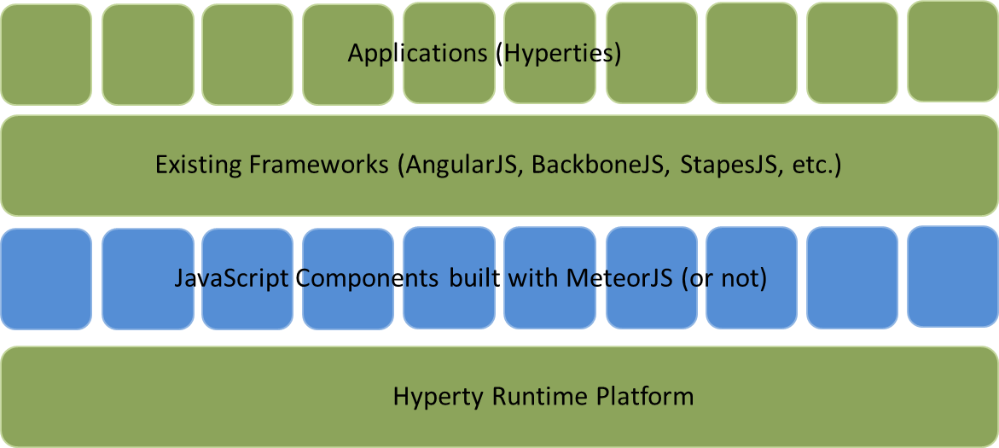

## Service Frameworks
Objective of the Service Framework is to develop a JavaScript Framework of libraries that can be used to facilitate the development of Hyperties. This framework will compliment the features provided by the Hyperty Runtime (T3.4) and Network QoS Policy Enforcement (T3.3). The end results of the Service Framework should support Hyperty Development (T5.2) which further assist in the implmentation of T5.3 Conversational Services (audio, video, chat, screen sharing) and T5.4 Context Enabled Services (Conversational Services, IoT, context delivery, location).

An analysis of existing JavaScript frameworks based on the reTHINK Service Framework requirements was carried out on some of the popularly used frameworks today. These frameworks all endeavor to facilitate the development of web applications utilizing the Model-View-Control design pattern. For the reTHINK project however, focus was on the data model management and routing capabilities of these frameworks.

Even though Angular JS is the most popular framework, which provides great two way data-binding allowing for synchronization of data, and has a large community base, it was not considered a suitable applicant for this project due to its complex directives API and inflexibility on configuring (i.e. it offers no configuration possibilities after the Bootstrap procedure). Another reason is that Angular is more suitable for Single Page Apps (SPA) unlike a dynamic environment like the reTHINK runtime where multiple applications can be downloaded and executed concurrently.

Another framework analyzed was Backbone.JS which also did not fit into the reTHINK service framework requirements due to the lack of a modular structure. Backbone lacks a controller concept and views and Models are relatively tightly coupled, resulting to tightly coupled modules which are not desirable for the reTHINK project.  

StapesJS another framework analyzed offered a lightweight less complex framework especially suitable of mobile platforms. However it in itself offers very little APIs and demands combination with other libraries such as JQuery, React and Rivets.

MeteorJS on the other hand is a good applicant.  MeteorJS offers rapid prototyping and produces cross-platform code for mobile and fixed platforms. It offers the distinct advantage to be used on all devices and operating systems featuring the Hyperty Runtime. However it has very strong dependency to the back end server being NodeJS. What this means for the reTHINK project is it will fit in perfectly, if the tool of choice for the Messaging Node where NodeJS. This is compatible with the other components as NodeJS is one of the tools considered for the reTHINK Messaging Node.

From the above anaöyzed frameworks, there is no strong conclusive statement which one is best to be used to develope the Service Framework as they all have advantages and disadvantages. To fulfill the objectives of these task, the approach has to be more specific as to what the above frameworks have to offer. We will identify the main requirements from the selected use cases specified in WP1, identify the data objects and interfaces defined in WP2 and provide JavaScript libraries in form of SDK to the developers. This SDK will include utility functions, Message factories for creating common data objects, templates for defined Hyperty types and other high level APIs from the underlying runtime and policy enforcement APIs.  

The executable Hyperty Runtime will be the basis of all application development. With a middle layer of the Service Framework offering bulding blocks to choose from, a new ecosystem is formed on top of which other frameworks and applications exist.

