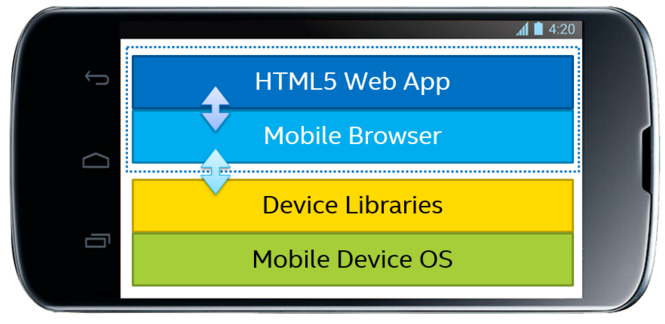
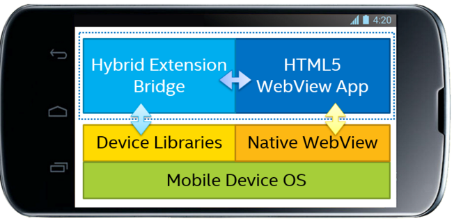
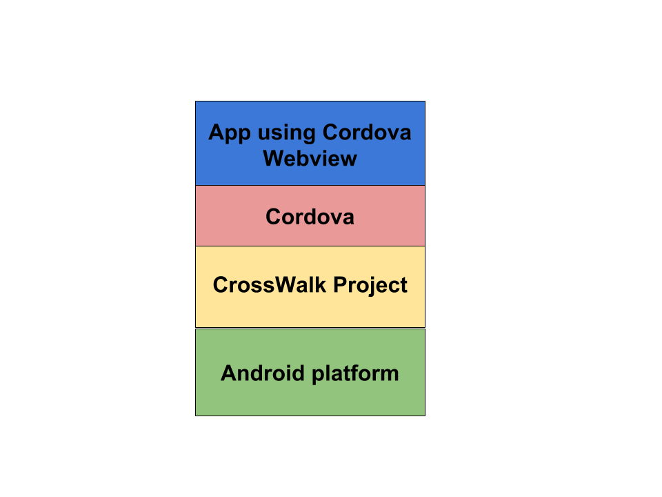
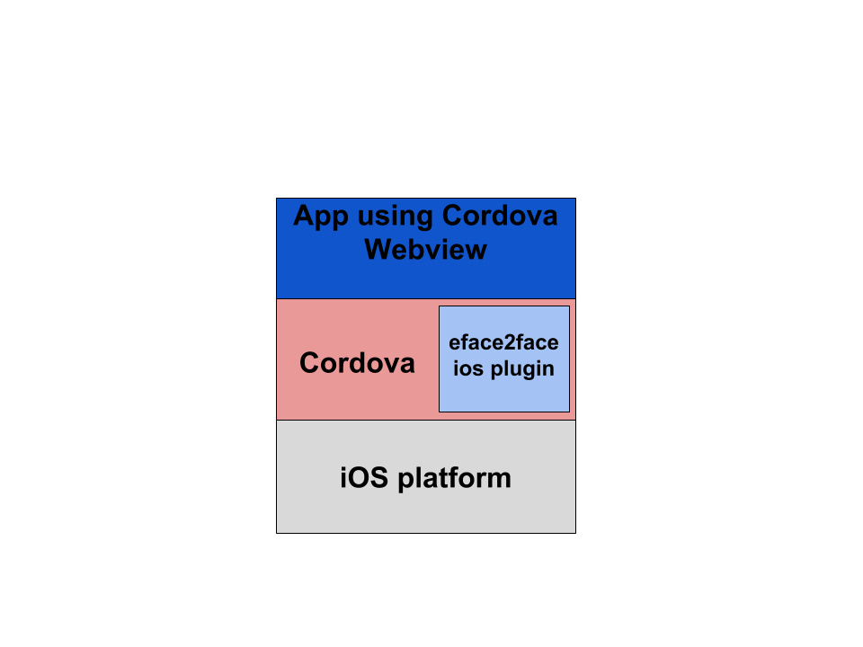
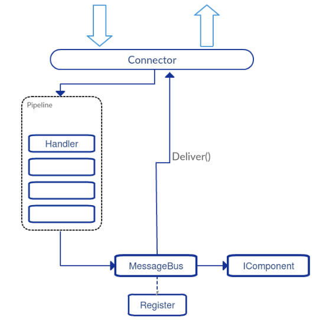

dev-runtime-browser
===================

Introduction
------------

This repository contain the code necessary to execute the reTHINK
runtime core in a browser. reTHINK runtime core can also be executed in
other Javascript runtimes such as Node.js.

The execution of the core runtime takes place in an iFrame which
isolates it from the main application runtime (the window where the App
javascript code is being executed). The only way to transmit messages
between the main window and the iFrame is through the `postMessage()`
method. This way, main application javascript code can not interact with
the reTHINK runtime.

Addtionally to the iFrame, all the hyperties and protoStub will be
executed as independient Web Workers (which will extend the sandBox
class from the dev-core-runtime repository). This way we keep Hyperties
and protoStub runtimes not directly accessible from the core runtime but
using also the postMessage() mechanism.

How does it work?
-----------------

#### RuntimeUAStub responsibilities:

1.  Expose loadHyperty and loadProtoStub to **client app**.
2.  if Core Sandbox doesn't exist it creates Core Sandbox.
3.  Route messages from client app to core and vice versa.
4.  Create **AppSandbox** when RuntimeUA set it. Virtually AppSandbox is
    created by RuntimeUA, but due to AppSandbox is running in the window
    context it should be created by RuntimeUAStub. RuntimeUA will send a
    message asking it to RuntimeUAStub.

#### Core/Service Provider Sandbox responsibilities:

1.  Isolate RuntimeUA from client app.
2.  Manage all the communication from and to internal components.

#### AppSandbox

1.  Manage all the communication from and to internal components.

Setup Environment
-----------------

### Configure jspm access to runtime-core repo

1.  generate token with public\_repo permission enabled
2.  Then execute the command below and you'll be asked for the
    credentials:

        jspm registry config github

### Configure dependencies

        npm install -g jspm karma-cli gulp-cli
        npm install
        jspm install

or

        npm run init-setup

Unit Testing
------------

Unit testing can be launched manually with **npm test**.

Javascript Environment
----------------------

JavaScript code should be written in ES6. There are direct dependencies
from nodejs and npm, these can be installed separately or in conjunction
with [nvm](https://github.com/creationix/nvm)

### Dependencies

-   nodejs
-   npm
-   karma - Make the communication between unit test tool and jenkins.
    See more on [karma](http://karma-runner.github.io/0.13/index.html)
-   mocha - Unit test tool. See more on
    [http://mochajs.org](http://mochajs.org/)
-   jspm - Don't need compile the code, it uses babel (or traucer or
    typescript) to run ES6 code on browser. Know more in
    [jspm.io](http://jspm.io/)
-   gulp - Automate and enhance your workflow. See more about gulp on
    [gulp](http://gulpjs.com/)

### Code Style and Hinting

On the root directory you will find **.jshintrc**, this file is a helper
to maintain syntax consistency, it signals syntax mistakes and makes the
code equal for all developers.

-   [jshint](http://jshint.com/) - Detect errors and potential problems
    in JavaScript code.

All IDE's and Text Editors can handle these tools.

Example
-------

This repository have a folder with an use example of rethink.js. It
initializes runtime and then you can use the console to invoke:

-   rethink.requireHyperty(hypertyDescriptor);
-   rethink.requireProtostub(domain);

To run the demo on example folder: - you need **live-server** running in
the root folder. `live-server --port=4000` - in your browser access to
http://localhost:4000/example.

Distributable file - rethink.js, context-core.js, context-service.js
--------------------------------------------------------------------

Standalone runtime application
==============================

Introduction
------------

The client side of the reTHINK architecture has been designed to be
executed in a device which can execute a Javascript runtime, typically a
web browser. This allows to be able to access to servcies provided
through the reTHINK network from almost any device. Nowadays it is
possible to run web browser in almost any personal gadget, however there
may be devices where either is it not possible to run a browser or the
available browsers does not suport the APIs required by the reTHINK
browser runtime. For example, the browsers in iOS does not currently
support the WebRTC API.

That is the main reason why the creation of an application which can run
the reTHINK client applications has been identified as a need. The use
of web applications embedded in native application or even replacing
them has become a common practice in the last years. This allows to
re-use all the code developed for web applications therefore reducing
the cost and time-to-market of new applications.

There are several alternatives to execute web applications as native
apps. In Android there webview elements directly provided by the OS and
there are projects which allows to create native apps for both iOS and
Android. For reTHINK the Crosswalk Project has been chosen to implement
the native apps.

Crosswalk Project
-----------------

reTHINk standalone application allows to execute reTHINK runtime in
Android and iOS devices without the need of having installed a browser
will full support of the required APIs. The standalone application is
based on the [Crosswalk Project](https://crosswalk-project.org/) from
Intel. Crosswalk Project is an HTML application runtime, built on open
source foundations, which extends the web platform with new
capabilities. Crosswalk gives a web runtime for mobile and desktop
applications. The immediate benefit of bundling an application with the
Crosswalk webview is that everywhere the application runs, it uses the
same, Chromium-based runtime. It is possible to create webviews for
Android and iOS, but also for Windows and Linux Desktop applications so
it makes any web application usable in almost any platform. In reTHINK
only standalone runtime aplpication swiil be created for Android and
iOS, as it always possible to install browsers which can execute reTHINK
applications in Desktops.

WebRTC APIs are available in Crosswalk 5 or later on ARM; and Crosswalk
7.36.154.6 or later for x86. Web workers (also required for the browser
runtime) is also supported by Crosswalk since previous versions.

Android standalone application
------------------------------

The diagram below shows the architecture of the appplication. The hybrid
application is created with Cordova which allows to access different
sensors and services of the phone through a Javascript API. Cordova
connects the App the Crosswalk Webview which is the part of the code
which implements the WebRTC stack. Crosswalk will give a consistent
Webview implementation across all the Android versions and it will
guarantee that the reTHINK runtime will be executed correctly.

Building the reTHINK Android application
----------------------------------------

### Installing prerequisites

**openjdk-7:**

<code>sudo apt-get install openjdk-7-jdk</code>

**ant:**

<code>sudo apt-get install ant</code>

**android sdk:**

<code>cd /opt/</code>

<code>curl -O
http://dl.google.com/android/android-sdk\_r22.6.2-linux.tgz</code>

<code>./android-sdk-linux/tools./android</code>

This last command will install the default list of packages. This
process may take quite a while.

### Building the application

It is necessary to indicate the public URL of the Web App which is going
to be loaded in the hybrid App. In next releases it may be possible to
load the HTML5/CSS/JS files in the own App.

<code>make RETHINKWEBAPPURI="http://..."</code>

<code>source build.env</code>

<code>make </code>

### Build the standalone application with Eclipse

It is also possible to build the standalone application using Eclipse.
The general steps to build the application are included below:

1.  Launch eclipse
2.  Import xwalk-core-library project (3rdparty/xwalk\_core\_library/)
3.  Import Cordova project
    (3rdparty/crosswalk-cordova-android/framework/)
4.  Import standalone-ios project
5.  Set the URL of the web application using reTHINK framework to be
    executed in the runtime application.
6.  Build standalon-ios project as an Android application

iOS standalone application
--------------------------

In iOS the architecture is slightly different from the Android
architecture. Cordova is also use to build the application but the
WebRTC stack will be provided by the eface2face plugin which includes a
complete WebRTC library. In the Android App this is provided by
Crosswalk. In iOS a complete simulation of the official WebRTC stack is
provided by
[!cordova-plugin-iosrtc](https://github.com/eface2face/cordova-plugin-iosrtc).
It implementes the official [!WebRTC W3C
API](https://www.w3.org/TR/webrtc/) and includes a compiled library with
all the WebRTC code. The rest of the Javascript APIs that are required
to execute the reTHINK runtime will be provided by Cordova.

Building reTHINK iOS standalone application
-------------------------------------------

### Requirements

1.  OSX with XCode 5.
2.  A valid Apple ID must be used (load associated certificates and
    profiles).

### Build process

1.  It is necessary to clone ios-rethink-standalone repository (this
    repository has not been yet created at the time of this writing) .
2.  Open application project with XCode: sippo-ios/app/Sippo.xcodeproj.
3.  Set the target location: change default values defined at Root.plist
    file (Settings.bundle-\>Root.plist in XCode project explorer).
4.  Build application.

dev-msg-node-vertx
------------------

### Setup Environment

#### JavaScript

On the first time you are cloning this repository, you need to run the
command `npm run init-setup`;

After running successfully this command you will have 2 folders
(node\_modules and vendor), these folders are excluded from the commit
process, and are only for development.

If you already have the project configured on your machine, you only
need run the command `npm install` to add new dependencies;

If you have some trouble with the environment, you can open an issue;

#### Java

Follow the link to [Install
Maven](https://maven.apache.org/install.html). \* Build the project
with: mvn package \* Verify if the configs are OK in node.config.json
file \* Run vertx node with: mvn exec:java -Dexec.args="\<port\>"

### Use of VertxProtoStub

Once the MessageNode is active, we are able to connect with the
ProtoStub. The best example of how this is done is in the
test/VertxProtoStub.js in "runtime connectivity" test. It's important to
send the "runtimeURL" in the config parameter, because it will be used
to link the connection channel to the runtime.

With this it's possible to send messages between runtimes, but Hyperty
registration is something that should be done externally.

The connection is auto managed. It means, there is no need to call
"connect()" explicitly, and it will always try to be in "connected"
until "disconnect()" is called. Status messages are sent to
"runtimeProtoStubURL/status".

### Component Integration

There are 2 types of components that can integrate in the Vertx Message
Node implementation. \* Addressable, based in one destination address.
Messages are deliver based on the "header.to" field of the message. \*
Interceptors that can intercept and verify every message that enters the
Message Node, whatever the destination address.

#### Addressable Components

These are implementations of the interface
`IComponent extends Handler<PipeContext>`, and are added to the
MessageNode with the method
`PipeRegistry.install(IComponent component)`. The only difference on the
interface (between IComponent and Handler\<PipeContext\>) is an
additional method to get the component address name, used for EventBus
registration.

#### Interceptor Components

Implementations of `Handler<PipeContext>`, and are added to the pipeline
with `Pipeline.addHandler(Handler<PipeContext> handler)`.

#### Use of PipeContext

Both types receive a `PipeContext` in the **handle** method when a
message should be processed by the component. PipeContext gives access
to the message with the `getMessage()` method, but also provides other
useful methods like: \* `next()` method used in Interceptors that order
the pipeline to execute the next interceptor. If no other interceptor
exits, a delivery is proceed. \* `deliver()` used internally by the
pipeline, but can be also used to ignore all other pipeline handlers and
deliver the message directly to the component that has the address of
"header.to". \* `fail(String from, String error)` interrupts the
pipeline flow and sends an error message back to the original
"header.from". The "header.from" of the reply is configured with the
first parameter. \* `reply(PipeMessage reply)` does nothing to the
pipeline flow and sends a reply back. Other similar and useful methods
exists: `replyOK(String from)` and
`replyError(String from, String error)` \* `disconnect()` order the
underlying resource channel to disconnect.

### Unit testing

**DO NOT SUBMIT CODE WITHOUT ALL UNIT TESTS ARE OK** \* Run 2 instances
of the message-node: **mvn exec:java -Dexec.args="9090"** and **mvn
exec:java -Dexec.args="9091"** \* Run **karma start**

### Matrix.org based Messging Node

The repository for the Matrix.org based message node. The MN code does
not modify any Matrix.org specific code. It only adds componentes
"around" an untouched Matrix Homeserver (HS).

#### Matrix.org - Overview and core concepts

The Matrix mission statement (from [matrix.org
spec](https://matrix.org/speculator/spec/head/intro.html)): \> *The end
goal of Matrix is to be a ubiquitous messaging layer for synchronising
arbitrary data between sets of people, devices and services - be that
for instant messages, VoIP call setups, or any other objects that need
to be reliably and persistently pushed from A to B in an interoperable
and federated manner.*

##### Homeservers

The core components of the Matrix architecture are the Home Servers
(HS). Each Homeserver is responsible for one domain. Each client
connects to one HS, wich is responsible for the own domain.
Communication between different domains is supported by built-in
federation mechanisms that sync and maintain the history of shared
communication sessions among the domains. Home Servers use normal DNS to
find, resolve and contact each other. The Federation API between
Homeservers is based on HTTPs and therefore encrypted and secured by
default.

The reference implementation of a Matrix HS, called *Synapse*, is
written in Python and available on GitHub
[Synapse](https://github.com/matrix-org/synapse).

##### Clients

Matrix clients connect to a HomeServer by using a REST-based
[Client-Server-API](http://matrix.org/docs/spec/r0.0.1/client_server.html).
Clients can either implement the corresponding REST calls directly or
choose to use one of the SDK's, which are available for a lot of
different systems and programming languages, including Android, IOS,
Python, NodeJS etc. These SDK's abstract the REST API and provide a lot
of high-level convenience methods.

Following picture shows the main data flow in a federated matrix
architecture.

As this Figure shows, clients just connect to their own HS, but due to
the built-in federation between the Homeservers they can communicate
with Matrix clients from other domains just out-of-the-box. This allows
to form a Matrix Eco-System, just by adding Homeservers to the public
Internet and make their domains resolvable via DNS.

##### The Matrix Room concept

The Matrix.org project was influenced by concepts from traditional
Instant Messaging systems. This can be seen especially in the concept of
"communication rooms", which behave like a chat room. This concept
implies that *every* communication requires a room. Even for a single
message from one client to a dedicated receiver a room must be created
first and the receiver must have joined this room in order to receive
this message. Rooms are persistent. They can be re-entered after
successive login sessions.

##### Application services

An Application Service is an implementation of a special service
function that can be attached to a Homeserver. Based on certain
patterns, messages are filtered and forwarded to the Application Service
that performs application specific tasks. This concept is quite
comparable to Application Servers in the IP Multimedia Subsystem (IMS)
framework. It can, for example, be used for aggregation and accounting
purposes, but also for the implementation of "breakout" communication to
other types of messaging infrastructures it fits well.

Like the corresponding concept in IMS, also Matrix Application Services
operate in a special trust-relationship with the HS. This trusted state
allows them to listen to messages that match special user-/or room-name
patterns as well as to create users on-the-fly and to operate on behalf
of them.\
It must be noted that Application services do (until now) only play a
passive role. They can listen to messages, but they can (by-design) not
block or modify them.

#### Messaging Node architecture

##### General considerations, requirements and decisions

Matrix.org is a very vital and active project with frequent releases and
new surrounding developments and projects. However, the provided API's
are rather stable and backward compatible as seen so far. For that
reason the first and most important decision for the design of the
Matrix based messaging node was made: - Don't touch the core of the
Homeserver implementation! Just implement components that use standard
API's to add the required functionalities!

If the reTHINK concepts of Protocol Stubs and Messaging Nodes are
translated to the Matrix.org concepts, it seems like the Stubs map well
to Matrix clients and the Messaging Nodes to Matrix Homeservers.

As described before, a Matrix client communicates to a Homeserver via a
REST protocol. Several available SDKs encapsulate this protocol, so
that - at the end - it is not obvious for the implementor of a client,
when and how much traffic is generated between client and HS.
Furthermore the SDKs come with a set of dependencies that potentially
blow up the size of a Stub and make its deployment more complicated.

For these reasons it was decided that: - The stub should be kept as
small and simple as possible to ensure easy deployment. - The real
Matrix REST communication should be limited to the Messaging Node
internally while the communication protocol between Stub and Messaging
Node can be implemented differently.

Another challenge is that Matrix.org requires provisioned users and
established room relationships between them to perform a communication.
The establishment of a room relationship between two users is a process
that requires several round-trip message exchanges between their
corresponding clients and rather complex state monitoring. This process
can take potentially too long and might lead to unacceptable delays for
an ad-hoc message exchange between two Runtimes. Furthermore this would
produce a lot of persistent room relationships in the Matrix Homeservers
which might never be re-used again.

Therefore following requirements for the design of the Matrix based
Messaging Node were identified: - The Messaging node must support an
automatic provisioning of Matrix users on-the-fly. - The message routing
must not depend on fully established room relationships between the
matrix users that correspond with the "from" and "to" addresses of a
retHINK message.

These 5 decisions guided the architecture approach that is described in
the following section.

##### Matrix Messaging Node architecture

The figure below illustrates the high-level architecture of the Matrix
Messaging Node. The Matrix Homeserver itself is left unchanged. It was
decided to wrap all additional functionalities into an Application
Service that communicates via standardized APIs with the HS.

The reTHINK AS includes a WebSocket Server component that is the
endpoint for connection requests from Protocol Stubs, which are deployed
and running in reTHINK Runtimes. The Matrix Client - Manager is then
responsible to identify the connected Stubs/Runtimes and to maintain the
life-cycle of a dedicated Matrix Client instance for this particular
Stub-/Runtime-connection. This includes the instantiation and also the
re-assignment of Matrix Clients to stubs, in case of re-connections, for
instance after a network interruption.

Due to the trust-relationship of the Application Service, the Matrix
Client Manager is allowed to create and auto-provision Matrix Clients
on-the-fly. These Matrix Clients then communicate with the HS core via
standard client API's.

The Address-Allocation Manager handles CREATE requests to the
address-allocation part of the Messaging Node. It creates addresses that
can be used to address Hyperties in the connected Runtimes and keeps
their relation to the connected Stub.

The Registry connector handles requests to fetch user data from the
domain registry or to register Hyperties with the allocated addresses.
Furthermore the Policy Enforcement Point component allows to block
message flows according to policies which can be managed from remote via
the Policy Management Connector. Additional connectors can be
implemented and used to manage or control certain aspect of the message
routing.

##### Dynamic Views

The following sequence chart shows the processes for the connection of a
Protocol Stub at the Messaging Node, the allocation of a hyperty address
and the registratio of this address at the domain registry.

 -
1-2: The Stub is initialized and connected by the Runtime (simplified)
and the Runtime sends a CREATE message to the address-allocation module
of the Messaging Node.

-   3: The Stub connects with the WS-Server for the first time and
    provides the RuntimeID as identifier.
-   4: The WS-Server assigns the given RuntimeID to the Websocket.
-   5-6: The Client Manager creates and inititializes a Matrix Client
    for the given RuntimeID.
-   7-8: The Matrix Client inititializes (connects to the HS, syncs
    etc.) and creates its individual room.
-   10: In case of a re-connection, the Client Manager only updates the
    relation between the existing client and the new Websocket
-   11: The WS-Server receives the address allocation request from the
    Stub
-   12 -15: The Address Allocation Manager is invoked to create a new
    address, which is returned to the Runtime via the Protocol Stub
-   16-21: These steps show the flow for a message to create a hyperty
    registration. It invokes the Registry Connector that interacts with
    the domain registry to perform the registration. The response will
    be returned via the corresponding stub to the Runtime

In order to avoid expensive creation of bi-lateral room relationships
and to allow to block messages depending on policies, it was decided
that the AS acts as a "man-in-the-middle" between sender and receiver.
To achieve this, each Matrix Client creates a private individual room
with no other invited or joined members during its Initialization.

The alias name of these rooms starts with a defined prefix
"\#\_rethink\_". The AS is configured to monitor such rooms. Every
message that arrives via the Stub will then only be sent to the
individual room of the sender. The AS receives the message and can
perform the required policy decisions. If everything is OK, then the
message is forwarded to the room that corresponds to the user in the
"to"-field of the message. The Matrix client, that is the owner of the
receivers individual room, receives the message and will send it to the
receivers Runtime via the connected Stub.

The following sequence chart illustrates this routing principle.

This sequence starts with the precondition that both sides (Runtimes A
and B) have connected a stub with the Matrix Messaging Node, that
Runtime A has registered a Hyperty and Runtime B knows its address.

-   1-2: Runtime B sends a message (e.g. an call invitation) via the
    Stub to the Websocket Server
-   3: The Client Manager looks up the Matrix-Client that is responsible
    for this Runtime
-   4: If the "from"-field is not for the own domain, a mapping of this
    "from" address to the Matrix Client is created. This is required to
    investigate the return route in requests that have been initiated
    from a foreign domain.
-   6: The client Manager forwards the message to the client that is
    responsible for B's connected Stub and this one sends it to its own
    individual room.
-   7-9: The reTHINK Application Server receives the message, because it
    monitors the individual rooms and invokes the policy component to
    get a decision about the further handling of the message.
-   10: In case of a positive decision, the AS sends the message to
    client A's individual room.
-   11-12: The message is forwarded via A's Protocol stub to Runtime A

#### Matrix Messaging Stub

Due to the described architecture where the real Matrix REST
communication is kept on the server side, the protocol stub can be kept
very small and simple. It implements a Websocket client that
automatically connects to the WS-Server as soon as a message is going to
be sent. During the connection establishment it forwards the RuntimeID,
that it was created for, to the Server, so that the Messaging Node can
identify and correctly assign this stub also after potentially
interruptions and re-connections.

The Messaging Stub is integrated with the Runtimes Messaging Bus. Each
message that is received via the Websocket is forwarded to the bus and
will be routed there to the correct receiver.

Furthermore the Stub uses the Bus to publish events about its internal
status, especially on changes of its connection state.

### Configuration and Operation

#### Structure of the "dev-msg-node-matrix" GitHub repository

-   **./src/mn** ... The node.js sources for the MatrixMN
-   **./src/stub** ... The sources for the Protocol stub
-   **./src/docker** ... Scripts and additional files required for the
    setup of a dockerized version of the Matrix Messaging Node
-   **./test** ... Test cases for the Matrix Messaging Node

#### Setup and operation of the MatrixMN as a Docker container

Assuming you are running a standard Debian 8 Jessie the following steps
can be used to setup the environment. Other distributions my need a
different setup.

##### 1. Installation of NodeJS and Docker

You need to set up the following requirements. - [nodejs
5.x](https://nodejs.org/en/download/package-manager/#debian-and-ubuntu-based-linux-distributions) -
nodejs-legacy for Debian (Ubuntu might not need this) -
[docker](https://docs.docker.com/engine/installation/debian/) - If the
docker daemon cannot be reached you need to run
`sudo usermod -aG docker $USER`. After that logout and back in or use
this command `su - $USER`. - If the test `sudo docker run hello-world`
fails you may need a different kernel. Some kernels like those provided
by OVH are not working with docker.

##### 2. Installation of repository-tools and cloning the repository

Execute these commands to install the needed tools and dependencies.

    sudo npm install -g gulp
    git clone https://github.com/reTHINK-project/dev-msg-node-matrix.git
    cd dev-msg-node-matrix 
    npm install

##### 3. Building MatrixMN

Afterwards you can build the MatrixMN distribution. Please make sure you
are located in the `dev-msg-node-matrix` directory. Simply type `pwd` to
check that. Then run the following commands.

    rm -rf dist && gulp build && gulp dist
    cd dist/docker
    ./build-docker-image.sh matrix1.rethink

The last parameter `matrix1.rethink` specifies the domain name for
MatrixMN.

When errors occur while building MatrixMN which relate to 404 errors you
might want to check your Docker DNS settings. Try editing
`/etc/default/docker` and uncomment the line
`#DOCKER_OPTS="--dns 8.8.8.8 --dns 8.8.4.4"`. You can also add the DNS
servers of your company. The resulting line may look like this one
`DOCKER_OPTS="--dns 8.8.8.8 --dns 8.8.4.4 --dns 10.1.100.252 --dns 10.1.100.246"`.

Build the image again and if the errors continue to show up you can
check the `/etc/resolv.conf` file. It should have a line or lines
containing something similar to `search company.tld lan lan.` or
`nameserver 10.1.100.252`.

##### 4. Building the Registry

In order to reach the domain registry it has to be built too. Please
change to the `dev-registry-domain/server` directory after cloning it in
a place of your choice. Then run:

    docker build -t dev-registry-domain .
    docker images
    #cd to dev-msg-node-matrix/dist/docker

Now you should see the 2 docker images which were built.

##### 5. Starting the Registry

The first image to be started is the registry.

    ./startregistry.sh

##### 6. Starting MatrixMN

Open another terminal and execute the following.

    #cd to dev-msg-node-matrix/dist/docker
    ./start.sh

The MatrixMN will now start which might take a while. You can check
whether it is finished by looking for the last line being similar to: \>
`synapse.storage.TIME - 212 - INFO - - Total database time: 0.000% {get_all_pushers(0): 0.000%,`

after executing \> `docker logs dev-msg-node-matrix`

##### 7. Testing

Finally you can test the correctness of the setup.

    #cd to dev-msg-node-matrix or a subdirectory
    gulp test

If none of the test are executed you need to install the chrome browser.
Run `sudo apt-get install chromium-browser`.

dev-msg-node-nodejs
===================

The repository provide NodeJS implementation for WebSocket messaging
using socket.io library for the

Setup Environment
-----------------

### Javascript Environment

JavaScript code should be written in ES6.

Please follow instructions on [official nodejs installation
documentation](https://nodejs.org/en/download/package-manager/) to setup
the NodeJS environnement.\
This include the npm manager for node modules.

#### dependencies:

-   nodejs
-   npm
-   karma - A simple tool that allows you to execute JavaScript code in
    multiple real browsers. See more on
    [karma](http://karma-runner.github.io/0.13/index.html)
-   mocha - Unit test tool. See more on
    [http://mochajs.org](http://mochajs.org/)
-   jspm - Don't need compile the code, it uses babel (or traucer or
    typescript) to run ES6 code on browser. Know more in
    [jspm.io](http://jspm.io/)
-   gulp - Automate and enhance your workflow. See more about gulp on
    [gulp](http://gulpjs.com/)

### Quick start

On the first time you are cloning this repository, you need to run the
command\
\$ **npm run init-setup && jspm install**;

After running successfully this command you will have 2 folders
(node\_modules and vendor), these folders are excluded from the commit
process, and are only for development.

Check the server configuration file for custom setting (url, port, ...)
:

Now start server with command :\
\$ **node src/main/server.js**;

You should see a notice like that :\
[Date] [INFO] server - [S] HTTP & WS server listening on 9090

if you already have the project configured on your machine, you only
need run the command `npm install` to update package & new dependencies.

### Code Style and Hinting

On the root directory you will find **.jshintrc** and **.jscsrc**, these
files are helpers to maintain syntax consistency, it signals syntax
mistakes and makes the code equal for all developers.

-   [jscs](http://jscs.info/) - Maintain JavaScript Code Style
-   [jshint](http://jshint.com/) - Detect errors and potential problems
    in JavaScript code.

Most IDEs and Text Editors can handle these tools.

### Documentation

To generates api documentation you can run :\
\$ **gulp doc**\
This will generate HTML documentation in docs/ folder.

### Repository structure

This repository is ready to start working on development.\
The code will go to the **src** folder, it contains also the main server
script in src/main/ folder.

The unit tests will be on **test** folder, following the name standard
<component>.spec.js

Server (config.js) & tools (gulp, karma, etc...) configuration is
located in root folder.

### Unit Testing

We use Karma test runner to execute mocha test.

To run unit test, you need first to lauch a server node with command :\
\$ **node src/main/server.js**\
... then start karma test runner (from main directory) :\
\$ **karma start**

Karma will launch the browser (chromium in this case) to execute all
tests in test/ folder and show result in console. Tests are
automatically redone when code is modified.

NodeJS Messaging architecture
-----------------------------

### Server components

#### NodeJS

##### Socket.io

Socket.io is a well-known library that provide real-time bidirectionnal
event-based communication.\
It able to handle the connection transparently for developpers :

-   the protocol negociation (long-polling, websocket,etc...) with
    client depending of network capabilities
-   connection always on with heartbeat packets
-   message broadcasting
-   session datas
-   clustering consideration with multiple data storage drivers

##### ExpressJS

Express.js is a minimalist web framework commonly used in front of
socket.io server.\
It provide a robust set of features for web and mobile applications,
like request routing, and a solid stack for third-party middleware.

#### Redis

Redis is an in-memory data structure store, used as database, cache and
message broker. It supports various type of data structures such as
string, hashes, lists... It have a persistent mode, but it's mainly used
to store temporary datas like session or connection information.

Redis has built-in replication, and provides high availability via Redis
Sentinel and automatic partitioning with Redis Cluster.

### Service architecture

The figure below illustrates the service architecture of the NodeJS
Messaging Node.

Combine with node redis sentinel client, each node share session datas
with each others through redis storage.\
Redis-Sentinel monitor & notify redis cluster of data change between
nodejs instance.

For security consideration, it's advized to use a proxy (as describe in
the following scheme) in front of node instance to not give direct
access to nodejs instance. It's recommanded to use NGinx server for that
([from
NGiNX](https://www.nginx.com/blog/nginx-nodejs-websockets-socketio/),
[from Socket.io](http://socket.io/docs/using-multiple-nodes/#)).\
By the way it also provide a good load balancer solution (HAProxy is
another good one).

Core components
---------------

This section describe the functional blocks of the Messaging Node
architecture.

The graphic below describe message event processing with components.

### Entry point

Msg node start with server.js script that read configuration from
config.js and instanciate \<<MsgNode>\> class.

This unique class initialize main components and start listening for
incoming websocket client. On each new protostub connection, socket.io
events are bind to \<<Client>\> instance associated with socket
ressource.

### Registry

A global Registry class is used by MsgNode to manage internal components
and configuration. It allow internal component to share reference to
configuration and others components.

### SessionManager

The SessionManager class handle client connection state change. \#\#\#\#
Note Link with identity service ?

### Message bus

MessageBus class provide a message system that publish information to
all components.

#### Note

/! Redis bus manager is not implemented yet, so message cannot be
broadcast in a msg node cluster : code in place allow only to publish
message through current node instance.

### Address allocation management

The class AddressAllocationManager handle hyperty URLs allocation once
client ask for registration.

#### Note

/! For the moment, foreign hyperty instance pool are not managed. Link
with global domain registry ?

### Message

On each message received from protostub, MsgNode built a ClientMessage
instance containing Message, and dispatch to Client instance. It's also
used as container to built reply on client.
