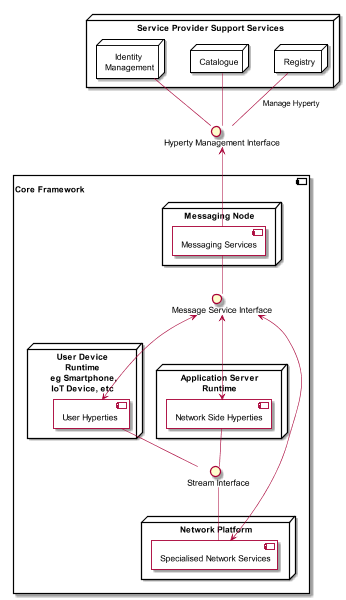

Introduction
============

Objectives and Overview
-----------------------

Project reTHINK aims to demonstrate a radical new way to develop and deliver real time communication services. reTHINK concepts and architecture follows edge computing principles pushing as much as possible the Business logic to end-user devices and network edge servers. reTHINK Business Capabilities are provided by new cooperative Microservices executing on behalf of users called Hyperlinked Entities - Hyperties. Hyperties are independently deployable components each one providing a small set of business capabilities, using the smart endpoints and dumb pipes philosophy. Billions of devices are already Hyperty enabled and ready to make part of reTHINK ecosystem, since Hyperties are programmed in Javascript ECMA5/6. The User Identity associated to an Hyperty is decoupled from the Hyperty Service Provider through WebRTC Identity Management mechanisms.

This deliverable accompanies the initial release of the Core Framework components published in reTHINK Github repositories. The implementation of Core Framework components follows D2.1 reTHINK Architecture design, D2.2 reTHINK Data Models and D3.1 Core Framework detailed specification. Phase 1 of the Core Framework includes the Hyperty Runtime (Core Runtime Components that were reused in Hyperty Browser Runtime and Hyperty NodeJS Runtime) and three Message Node implementations: Vertx Message Node, Matrix Message Node and NodeJS Message Node. Finally, the Hyperty Service Framework is also released featuring a comprehensive set of application program interfaces (APIs) and JavaScript libraries to facilitate the development of Hyperties. A full suite of documentation specially written to facilitate reTHINK embracing by web developers, which is also published in GitHub pages, is included in this report, as well as the update of the main specification of reTHINK Core Framework components provided in D3.1, according to feedback taken from the implementation activity.

It should be noted that the Network Platform components supporting Specialised Network Services will be released later in D3.4, as originally planned.

This deliverable complements deliverable D4.2 (Management and Security features specifications), which accompanies Phase 1 release of reTHINK Support Services.

The final specification for Messaging Node and Hyperty Runtime will be reported in D3.3 (Hyperty Runtime and Hyperty Messaging Node Phase 2 – Dec 2016).

Structure
---------

This report starts with an introduction and, in Chapter 2, a set of Tutorials targeting reTHINK Web Developers are provided. In chapter 3, the specification of the Hyperty Runtime and of the Messaging Node, is updated. The Documentation of Phase 1 Core Framework components is provided as annexes including API documentation.
