Introduction
============

Objectives and Overview
-----------------------

Project reTHINK aims to demonstrate a radical new way to develop and
deliver real time communication services. reTHINK concepts and
architecture follows edge computing principles pushing as much as
possible the Business logic to end-user devices and network edge
servers. reTHINK Business Capabilities are provided by new cooperative
Microservices executing on behalf of users called Hyperlinked Entities -
Hyperties. Hyperties are independently deployable components each one
providing a small set of business capabilities, using the smart
endpoints and dumb pipes philosophy. Billions of devices are already
Hyperty enabled and ready to make part of reTHINK ecosystem, since
Hyperties are programmed in Javascript ECMA5/6. The User Identity
associated to an Hyperty is decoupled from the Hyperty Service Provider
through WebRTC Identity Management mechanisms.


This deliverable accompanies the initial release of the Core Framework
components published in reTHINK Github repositories. The implementation
of Core Framework components follows D2.1 reTHINK Architecture design,
D2.2 reTHINK Data Models and D3.1 Core Framework detailed specification.
Phase 1 of the Core Framework includes the Hyperty Runtime (Core Runtime
Components that were reused in Hyperty Browser Runtime and Hyperty
NodeJS Runtime) and three Message Node implementations: Vertx Message
Node, Matrix Message Node and NodeJS Message Node. Finally, the Hyperty
Service Framework is also released featuring a comprehensive set of
application program interfaces (APIs) and JavaScript libraries to
facilitate the development of Hyperties. A full suite of documentation
specially written to facilitate reTHINK embracing by web developers,
which is also published in GitHub pages, is included in this report, as
well as the update of the main specification of reTHINK Core Framework
components provided in D3.1, according to feedback taken from the
implementation activity.

It should be noted that the Network Platform components supporting
Specialised Network Services will be released later in D3.4, as
originally planned.

This deliverable complements deliverable D4.2 (Management and Security
features specifications), which accompanies Phase 1 release of reTHINK
Support Services.

The final specification for Messaging Node and Hyperty Runtime will be
reported in D3.3 (Hyperty Runtime and Hyperty Messaging Node Phase 2 –
Dec 2016).

Structure
---------

This report starts with an introduction and, in Chapter 2, a set of
Tutorials targeting reTHINK Web Developers are provided. In chapter 3,
the specification of the Hyperty Runtime and of the Messaging Node, is
updated. The Documentation of Phase 1 Core Framework components is
provided as annexes including API documentation.

Tutorials
=========

This chapter provides the full set of documentation targeting external
web developers and start-ups. A getting started document is provided
followed by an overview of the Hyperty Concept, the Messaging Framework
used to support Hyperty's interaction, the higher level Data
Synchronisation Reporter - Observer communication mechanism, as well as
the Hyperty Trust and Security Model. Then, detailed Tutorials are
provided to guide on the development of Hyperties, Applications and
Message Nodes.

Getting Started
---------------

The reTHINK Framework is built around [Hyperlinked Entities
(hyperties)](hyperty.md) that leverages the protocol-on-the-fly
(ProtoFly) concept to avoid creating or modifying standard network
protocols, but moving instead towards an API based flat service
architecture. The reTHINK project envisages a global network of
interconnected hyperties that are executed in web runtime environment on
endpoints or edge-network servers. The reTHINK Framework functions are
based on a series of such hyperties that are generated by the service
provider, and are downloaded to the users’ endpoints. The hyperty
modules represent a set of services that are stored in a Catalogue. The
instantiated versions of these hyperties are registered in a Registry,
which represents authenticated users who are available for in-coming
connectivity service. Therefore, the Registry serves as a location
manager and is used for user discovery. A user can be a human being, a
group or, a connected object (e.g. building room with sensors). Users
have independent identities that are maintained by Identity Providers
(IdPs) that are independent organizations. On enquiry, these IdPs vouch
for users’ authenticity and return the URL of the users’ domain, which
enables finding destination users. The users’ identities are based on
their personal and confidential data, which is verified by other
solicited data, but such private information is only divulged under
user-controlled privacy rules.

In order to setup your own reTHINK Framework, you should install the
following components (docker images available):

-   the [Hyperty
    Catalogue](https://github.com/reTHINK-project/dev-catalogue)
-   the [Hyperty Domain
    Registry](https://github.com/reTHINK-project/dev-registry-domain)
-   the [Vertx Message
    Node](https://github.com/reTHINK-project/dev-msg-node-vertx). Other
    Message Nodes will be available including for
    [Matrix](https://matrix.org/) and for
    [NodeJS](https://nodejs.org/en/).

Very soon a live public reTHINK environment will be provided, to let you
publish and try your Hyperties or Apps without the need to install
anything.

### How to contribute

This section provides guidelines on how to contribute to reTHINK Service
Framework. Contributions to other reTHINK components should follow its
own guidelines:

-   [Hyperty Core Runtime Development
    guidelines](https://github.com/reTHINK-project/dev-runtime-core/blob/master/readme.md#developer-view);
-   [Hyperty Browser Runtime Development
    guidelines](https://github.com/reTHINK-project/dev-runtime-browser);
-   [Hyperty Nodejs Runtime Development
    guidelines](https://github.com/reTHINK-project/dev-runtime-nodejs);
-   [Development guidelines for new Hyperty Runtime
    Platforms](https://github.com/reTHINK-project/dev-runtime-core/blob/d3.2-working-docs/readme.md#browser-runtime);
-   [Vertx Message Node Development
    guidelines](https://github.com/reTHINK-project/dev-msg-node-vertx);
-   [Matrix Message Node Development
    guidelines](https://github.com/reTHINK-project/dev-msg-node-matrix);
-   [NodeJS Message Node Development
    guidelines](https://github.com/reTHINK-project/dev-msg-node-nodejs);
-   [Development guidelines for new Message
    Nodes](docs/manuals/development-of-protostubs-and-msg-nodes.md); -

Hyper-linked Entities - Hyperties
---------------------------------

This document provides an overview about the Hyperty concept and it
should be the starting point for any new developer. After this document,
all developers should also read:

-   the [Hyperty Messaging Framework
    overview](hyperty-messaging-framework.md)
-   the [Reporter - Observer Data Synchronisation
    model](p2p-data-sync.md)
-   the [Hyperty Trust and Security Model](hyperty-trust.md)

Hyperties are cooperative
[Microservices](http://martinfowler.com/articles/microservices.html)
that are executed in devices on behalf of users through simple but
sophisticated Identity Management techniques. This means, Hyperties are
independently deployable components each one providing a small set of
business capabilities, using the *smart endpoints and dumb pipes*
philosophy i.e. Hyperties don't depend on complex and sophisticated
communication middleware like Enterprise Service BUS (ESB). Instead,
Hyperties rely on a very light but powerful [Messaging
Framework](hyperty-messaging-framework.md) concept).

On the other side, Hyperties follow emerging
[Edge](https://en.wikipedia.org/wiki/Edge_computing) and
[Fog](https://en.wikipedia.org/wiki/Fog_computing) computing paradigms
as opposed to more popular Cloud Computing. This means, when compared
with Cloud Computing, Hyperties promotes a more effective usage of
computing and network resources, decreases communication latency,
improves security and extends scalability.

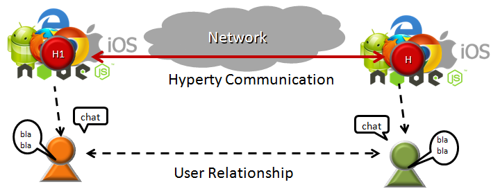

However, Hyperties can also be executed in Network Servers for specific
Business Capabilities (e.g. Media Servers) or when End-user devices
don't have enough capabilities in terms of computing resources and/or
power.

In addition, Hyperties have some unique characteristics including:

-   Hyperties are programmed in Javascript ECMA5/6, i.e. any existing
    device featuring a Browser or a NodeJS can be used today to execute
    Hyperties without requiring the installation of any new software.
    This means, **billions of devices** are already Hyperty enabled and
    ready to make part of reTHINK ecosystem. The [Hyperty Core
    Runtime](https://github.com/reTHINK-project/dev-runtime-core),
    provides additional features not natively supported by current Web
    Runtimes that are required to safely manage the deployment and
    execution of Hyperties. The Hyperty Core Runtime is also programmed
    in Javascript ECMA5/6 and is deployed on-the-fly along with the
    Hyperty if not done before.
-   The User Identity associated to an Hyperty is decoupled from the
    Hyperty Service Provider. I.e. Identity Management is handled under
    the scene and the Developer does not have to care about it and just
    have to focus on the development of Business Capabilities. This also
    means, the end-user has the power to decide which is the Identity to
    be securely associated to a certain Hyperty instance. More
    information about the Hyperty Security and Trust Model is provided
    [here](hyperty-trust.md).
-   Hyperties cooperate and communicate each other via P2P
    Synchronisation of Hyperty JSON Data Objects supported by the
    [Reporter - Observer communication pattern](p2p-data-sync.md). For
    example, as soon as there is new measurement collected from a sensor
    the data is set in a associated JSON Object. As soon as there is a
    change in this JSON Object, the change is reported by the Reporter
    Hyperty to any authorised Observer Hyperty. In this way, the JSON
    Object handled by Observer Hyperty is always synchronised with the
    JSON Object owned by the Reporter Hyperty.

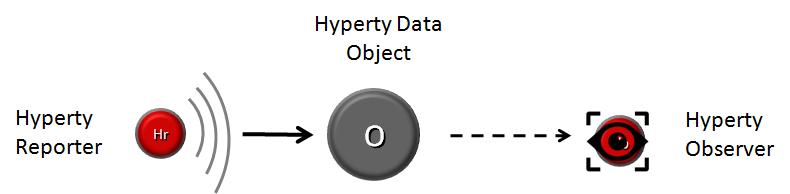

The API to handle the Synchronisation of Hyperty Data Objects is
extremely simple and fun to use. The Developer of the Hyperty Reporter
just has to create the Data Sync object with the Syncher API, and write
on the object every time there is data to be updated and shared with
Hyperty Observers.

``` {.javascript}

    ....

    console.info('---------------- Syncher Create Reporter Hyperty Data ---------------------- \n');
    syncher.create({}, [hypertyURL], {}).then(function(dataObjectReporter) {
      console.info('1. Return Create Data Object Reporter', dataObjectReporter);

    })
      console.info('--------------- END Create Reporter Hyperty Data------------------ \n');
    })
    .catch(function(reason) {
      console.error(reason);
      reject(reason);
    });

    // missing snippet for updates and delete

    ...

```

On the Hyperty Observer side, Data Objects are also created with the
Syncher API and the emerging [Object.observer() Javascript
method](https://developer.mozilla.org/en-US/docs/Web/JavaScript/Reference/Global_Objects/Object/observe)
is used to receive the stream of data changes coming from the Reporter
Hyperty.

``` {.javascript}
  onNotification() {
    console.info('---------------- Syncher Subscribe ---------------- \n');
    syncher.subscribe(objectUrl).then(function(dataObjectObserver) {
      console.info('1. Return Subscribe Data Object Observer', dataObjectObserver);

      // TODO: put source code to add listeners to updates by using Object.observer()


      console.info('------------------------ END ---------------------- \n');
    }).catch(function(reason) {
      console.error(reason);
    });
  }

  ...

  // missing snippet for updates and delete
```

-   Hyperties can easily cooperate with Hyperties from other domains
    with no federation required or the standardisation of Protocols
    thanks to the [Protocol On-the Fly powered Messaging
    Framework](hyperty-messaging-framework.md). Hyperties only have to
    agree on a common json-schema for one or more Hyperty Data Objects,
    in order to be able to cooperate each other.

-   Hyperties can be used on any Application Domain, but they are
    specially suitable for Real Time Communication Apps (eg Video
    Conference and Chat) as well as IoT Apps. Check [Current Hyperty
    Catalogue](../../examples)(*to be moved to a dedicated repo ou
    portal?*).

Hyperty Messaging Framework
---------------------------

This document gives an overview on the Messaging Framework technical
solution used to support Hyperty's interaction through the higher level
[Data Synchronisation Reporter - Observer communication
mechanism](p2p-data-sync.md). Details about how to develop Hyperties is
provided in [this](development-of-hyperties.md) document.

Hyperties cooperate each other with a Resource Oriented Messaging model
implemented by a simple Messaging Framework. The Hyperty Messaging
Framework, supports different messaging patterns including
publish/subscribe and request/response messaging patterns. The higher
level [Reporter - Observer communication pattern](p2p-data-sync.md)
works on top of these basic messaging patterns. It should be noted, that
[Hyperty Service Development Framework](development-of-hyperties.md) to
be used to create new Hyperties, abstracts Developers from the Hyperty
Messaging Framework described in this document including lower level
Hyperty Messaging APIs.

The Message delivery is based on a simple message Router functionality
that performs a lookup for listeners registered to receive the Message
(the ["Message.to" Header field](../datamodel/message/readme.md#to) is
the only information looked up for). The Message is posted to all found
listeners, which can be other Routers or end-points (Hyperties). Thus,
the Hyperty Messaging Framework is comprised by a network of Routers
where each Router only knows adjacent registered Routers or end-points.

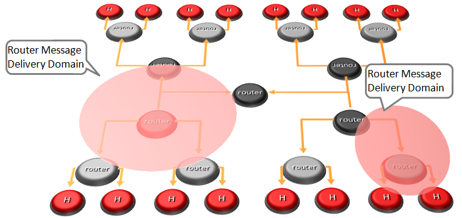

Listeners are programmaticaly registered and unregistered by Routing
Management functionalities, which decide the listeners to be added
according to a higher level view of the Routing Network.

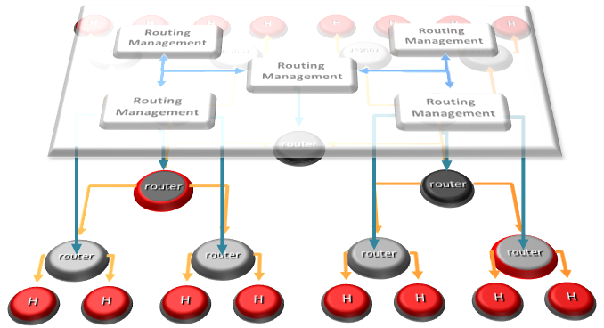

The Messaging Framework works at three layers:

At the Runtime Sandbox level where Hyperties are executing, message
delivery is provided by the [MiniBUS
component](../../src/bus/MiniBus.js).

At the Runtime level where Sandboxes are hosted (e.g. in a Browser or in
a NodeJS instance), message delivery is provided by the [Message BUS
component](../../src/bus/MessageBus.js), which is an extension of the
MiniBUS.

At Domain Level, message delivery is provided by the Message Node
functionality by using the [Protofly
mechanism](#protocol-on-the-fly-protofly-and-protostubs), i.e.
communication between Message BUS and Message Nodes and among Message
Nodes are protocol agnostic. This also means that the Message Node can
be provided by any Messaging solution as soon as there is a [Protostub
available](#protocol-on-the-fly-protofly-and-protostubs). Currently, a
[Vertx Message
Node](https://github.com/reTHINK-project/dev-msg-node-vertx), a [Matrix
Message Node](https://github.com/reTHINK-project/dev-msg-node-matrix)
and a [NodeJS Message
Node](https://github.com/reTHINK-project/dev-msg-node-nodejs) are
provided. These are just reference implementations of Message Nodes and
anyone is free to develop its own Message Node. Details about how to
develop a new Message Node and associated Protostub is provided in
[this](development-of-protostubs-and-msg-nodes.md) document.

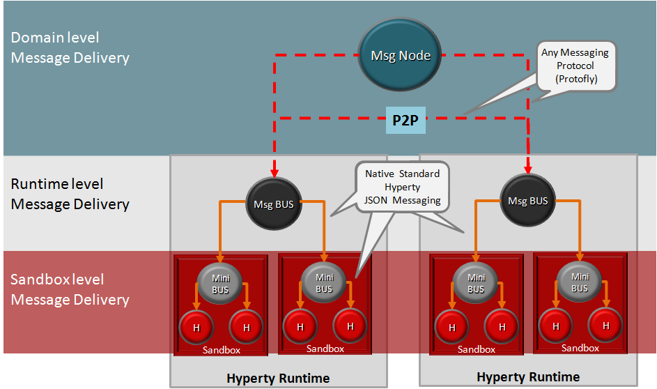

At runtime level (MessageBUS and MiniBUS), it is used a standard CRUD
based [JSON Message Model](../datamodel/message/readme.md), which is
easily mapped into Restfull APIs.

### Protocol on-the-fly (protofly) and Protostubs

Protocol on-the-fly leverages the code on-demand support by Web runtimes
(eg Javascript), to dynamically select, load and instantiate the most
appropriate protocol stack during run-time. Such characteristic enables
protocols to be selected at run-time and not at design time, enabling
protocol interoperability among distributed services, promoting loosely
coupled service architectures, optimising resources spent by avoiding
the need to have Protocol Gateways in service's middleware as well as
minimising standardisation efforts. The implementation of the protocol
stack, e.g. in a javascript file, that is dynamically loaded and
instantiated in run-time is called **Protostub:**. For security reasons,
Protostubs are executed in isolated sandboxes and are only reachable
through the Runtime MessageBUS and the Protostub Sandbox MiniBUS. A
detailed description on how to deploy a protostub is provided
[here](../spec/dynamic-view/basics/deploy-protostub.md).

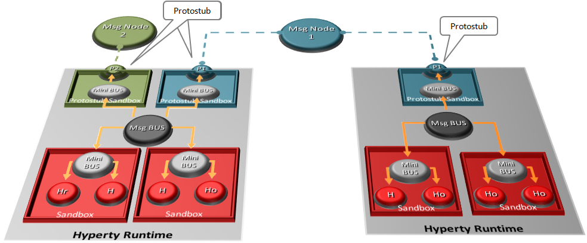

### Message Delivery between different Hyperty Runtimes

Communication between the Message BUS and Message Nodes are provided by
a Protostub that implements the protocol stack used to interact with the
Message Node e.g. JSON over Websockets or a Restfull API Client.
Listeners of protostubs are registered in the MessageBUS for a set of
Message recipient addresses, usually a Hyperty Domain like
`domain://example.com`.

When the MessageBUS is processing a new message and looking up routing
paths for an address (The Message Routing generic procedure is described
[here](../specs/dynamic-view/basics/bus-msg-routing.md)), which is not
local (eg `hyperty://example.com/alice-hyperty`), it won't find any
registered listeners. In this case, the MessageBUS will ask the [Runtime
Registry](https://github.com/reTHINK-project/dev-runtime-core/blob/d3.2-working-docs/docs/specs/readme.md#runtime-registry)
to resolve the "Message.to" header field, which will look for registered
Protostubs that are able to deliver messages to such non-local address.
If there is already a deployed Protostub that is able to deliver the
message to the remote Hyperty, the Registry will return the Hyperty
Runtime protostub address and the MessageBUS will look up again for the
protostub listener registered for its address. Otherwise, the
[deployment of the required Protostub is
performed](../spec/dynamic-view/basics/deploy-protostub.md) and as soon
as the Protostub is successfully instantiated, its hyperty runtime
address is returned. .

P2P Data Synchronisation: Reporter - Observer Model
---------------------------------------------------

This document gives an overview on how Hyperties cooperate each other
through a Data Synchronisation model called Reporter - Observer. Details
about how to develop Hyperties based on this model is provided in
[this](development-of-hyperties.md) document.

The usage of Data synchronisation models in [Web
Frameworks](https://www.meteor.com/ddp) looks very promising and is
becoming very popular. The usage of the emerging
[object.observe](https://developer.mozilla.org/pt-PT/docs/Web/JavaScript/Reference/Global_Objects/Object/observe)
javascript API is making it even more appealing. However, current
solutions require server-side databases that has an impact on
performance and scalability.

Hyperty Reporter - Observer communication pattern goes beyond current
solutions by using a P2P Synchronisation solution for JSON Data Objects,
here called Hyperty Data Object or Sync Data Object. To avoid
concurrency inconsistencies among peers, only one peer has granted
writing permissions in the Hyperty Data Object - the **Reporter
hyperty** - and all the other Hyperty instances only have permissions to
read the Hyperty Data Object - the **Observer hyperty**.


The API to handle Hyperty Data Objects is extremely simple and fun to
use. The Developer of the Hyperty Reporter just has to create the Data
Sync object with the Syncher API, and write on the object every time
there is data to be updated and shared with Hyperty Observers.

``` {.javascript}

    ....

    console.info('---------------- Syncher Create Reporter Hyperty Data ---------------------- \n');
    syncher.create({}, [hypertyURL], {}).then(function(dataObjectReporter) {
      console.info('1. Return Create Data Object Reporter', dataObjectReporter);

    })
      console.info('--------------- END Create Reporter Hyperty Data------------------ \n');
    })
    .catch(function(reason) {
      console.error(reason);
      reject(reason);
    });

    // missing snippet for updates and delete

    ...

```

On the Hyperty Observer side, Data Objects are also created with the
Syncher API and the emerging [Object.observer() Javascript
method](https://developer.mozilla.org/en-US/docs/Web/JavaScript/Reference/Global_Objects/Object/observe)
is used to receive the stream of data changes coming from the Reporter
Hyperty.

``` {.javascript}
  onNotification() {
    console.info('---------------- Syncher Subscribe ---------------- \n');
    syncher.subscribe(objectUrl).then(function(dataObjectObserver) {
      console.info('1. Return Subscribe Data Object Observer', dataObjectObserver);

      // TODO: put source code to add listeners to updates by using Object.observer()


      console.info('------------------------ END ---------------------- \n');
    }).catch(function(reason) {
      console.error(reason);
    });
  }

  ...

  // missing snippet for updates and delete
```

### Hyperty Data Object URL address

The Hyperty Messaging Framework allocates to each new created Hyperty
Data Object a Global Unique Identifier URL that is independent from the
Hyperty instance creator and from the Hyperty Runtime, in order to
support mobility of the Data Object between different Hyperty Runtimes
and also to support delegation of the Reporter role to other Hyperty
instances. However, at this point Reporter delegation is only supported
between Hyperty instances from the same domain.

### Hyperty Data Object Schema

Each Hyperty Data Object is formally described by a json-schema that is
identified by a Catalogue URL. This allows to check whether two
different Hyperties are compliant by cross checking each supported
Hyperty Data Object schema. At this point the following Hyperty Data
Object schemas are defined:

-   **[Connection Data Schema](../datamodel/connection)** : Hyperties
    supporting this schema are able to handle [WebRTC Peer
    Connections](https://developer.mozilla.org/en-US/docs/Web/Guide/API/WebRTC/Peer-to-peer_communications_with_WebRTC)
    between the Hyperty Runtime instances where they are running
    independently of the signalling protocol used. The URL Scheme for
    Connection Data Objects is "connection"
    (example: "connection://example.com/alice/bob201601290617").
-   **[Communication Data Schema](../datamodel/communication)** :
    Hyperties supporting this schema are able to handle different
    communication types including Textual Chat, Audio, Video, Screen
    Sharing and File sharing. Such communication can be supported on top
    of WebRTC protocol streams by using the Connection Data Schema. The
    URL Scheme for Communication Data Objects is "comm"
    (example: "comm://example.com/group-chat/rethink201601290617").
-   **[Context Data Schema](../datamodel/context)** : Hyperties
    supporting this schema are able to produce or consume Context Data,
    usually collected from sensors. The URL Scheme for Communication
    Data Objects is "ctxt"
    (example: "ctxt://example.com/room/temperature201601290617").

### Parent - Children Resources

In order to allow use cases like Group Chat where all involved Hyperties
are able to write in the Sync Data Object, the Parent - Child Data Sync
Objects is introduced.

A Data Object Child belongs to a Data Object Parent children collection
resource and can be created by any Observer of the Data Object Parent as
well as by its Reporter. The Reporter - Observer rules still apply to
Data Object Child i.e. there is only one Reporter that can update the
Data Object Child, which can be an Observer of the Data Object Parent,
as mentioned earlier.

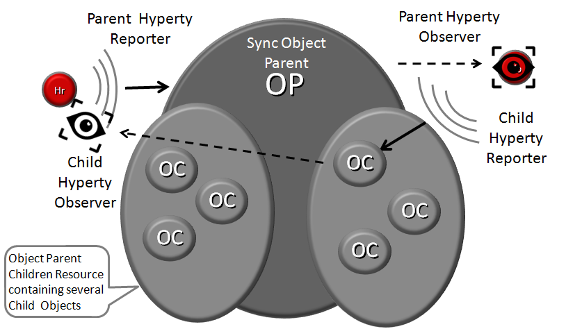

The creation, update and delete of an Data Object Child is performed in
the Data Object Parent itself:

`*Data Object Child creation, update and delete code snippet*`

All other Hyperties observing or reporting the Data Object Parent, will
be notified every time a new Data Object Child is created, updated or
deleted:

`*Data Object Child creation, update and delete notification code snippet*`

At this point, Data Object Child can't also be a Data Object Parent of
another Sync Data Object, i.e. Hyperty Data Object composition is
limited to one level.

### Syncher and Sync Manager

This section, gives an overview on how the Hyperty Data Object
synchronisation transparently works on top of the [Hyperty Messaging
Framework](hyperty-messaging-framework.md). However, Hyperty developers
don't have to know the technical details of this solution and can
directly move to the [Hyperty Development
Manual](development-of-hyperties.md).

The Hyperty Data Object synchronisation is provided by two components in
the Runtime:

The
[Syncher](https://github.com/reTHINK-project/dev-service-framework/blob/master/src/syncher/Syncher.js)
is a singleton Component co-located with the Hyperty Instance, which is
in charge of handling all required procedures to manage data
synchronisation at the Hyperty instance side, as a Reporter or a
Observer Hyperty.

The [Runtime Sync
Manager](https://github.com/reTHINK-project/dev-service-framework/blob/master/src/syncher/Syncher.js)
is a Core Runtime Component, which is in charge of handling
authorisation requests to create Sync Data Objects from Hyperty
Reporters and subscription requests to Sync Data Objects from Hyperty
Observers. As soon as authorisation is granted the Sync Manager handles
all required MessageBUS listeners in order to setup the Data Sync Stream
routing path among Reporters and Observers. I.e., the Runtime Sync
Manager provides a [Messaging Framework](hyperty-messaging-framework.md)
Routing Manager functionality.

The [Message Node Subscription
Manager](../specs/msg-node/readme.md#subscription-manager) is a Message
Node functionality, which is in charge of handling requests from Runtime
Sync Managers in order to setup the Data Sync Stream routing path
between the Reporter Hyperty Runtime and Observers Hyperty Runtimes.
I.e., the Message Node Sync Manager also provides a [Messaging
Framework](hyperty-messaging-framework.md) Routing Manager
functionality.


A detailed description of the Hyperty Data Synchronisation procedures is
provided [here](/specs/dynamic-view/data-sync/readme.md)

Hyperty Trust and Security Model
--------------------------------

This document gives an overview on the Hyperty Trust Model as well as on
Hyperty Sandbox runtime execution environment.

It should be noted, that [Hyperty Service Development
Framework](development-of-hyperties.md) to be used to create new
Hyperties, abstracts Developers from the Hyperty Trust and Security
Model described in this document including lower level Identity
Management APIs. Details about how to develop Hyperties is provided in
[this](development-of-hyperties.md) document.

Hyperties are securely associated to User Identities selected by the
end-user himself. Hyperty Users are human beings (including group of
human beings e.g. corporation) or things (including group of things and
physical spaces e.g. a smart home or smart building).

Hyperty Trust Model extends [WebRTC Identity
model](https://w3c.github.io/webrtc-pc/#sec.identity-proxy) where
Identity tokens are generated, inserted in intercepted Messages sent by
Hyperties and validated by recipient Hyperty Runtimes before delivered
to the target Identity. These identity management procedures are
performed according to applicable policies managed by the end-user.

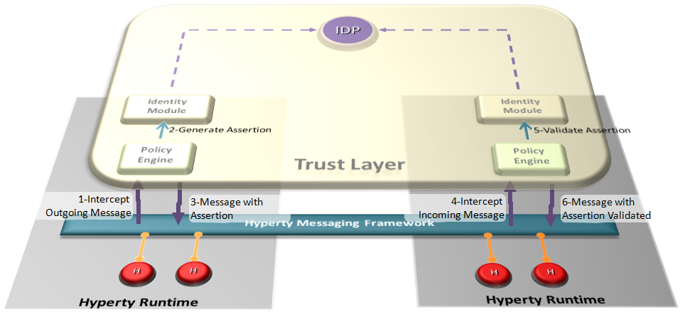

### Identity

As the necessity to manage identities over the internet has increased,
so does the number of solutions to help achieve that objective. Not only
for the Internet, but also for large companies with a great number of
workers exists the necessity to do a proper Identity management of all
them. This digital identity as will be explained below is an identity
created from the need to provide an authentication from someone or
something, and is used in different ways by diverse systems that
requires some sort of identity. Over time several solutions emerged, to
fulfil specific problems in projects, mainly because distinct obstacles
require different approaches. The following introduces the concept of
Identity, and how it can be used.

### User Identity

In our modern society, technology is ubiquitous, and transactions are
evermore accomplished using digital technologies without the need to
involve physical contact. An example of this situation can be observed
in money transactions, where a few years ago if someone needed to make a
bank transfer, it would require that person to move personally into a
bank agency to order it, and in current days these money transfers can
be performed using a smartphone. Since identification binds a person
identity with the respective individual attributes, an authentication of
identity is required. Given this, and since the majority of the current
transactions are performed digitally, we need, a sometimes called,
digital identity to prove who we are in remote communication. This
concept of Identity comprises two important information security
mechanisms, the authentication and authorization. In a short
description, the authentication is an identification followed by
verification. In this identification process an entity supplies its
identity, while in the verification process, the identity provided is
checked before the system. Therefore, the correctness of an
authentication strongly depends on the verification procedure employed.
The authorisation is the decision to allow a given identity to execute
or access a certain resource. Access control to a service or system, can
be achieved based on authorisation mechanisms, where is possible to
define the access rights or policies for each Identity, thus making it
possible to decide to allow or deny a particular action based on an
identifier or attribute. This appears as an interesting solution if the
system requires having access restrictions. Traditionally, the
authentication is performed with something a user knows (like a PIN or a
password) or holds (such as a key, or a magnetic card). But there is
another method, biometrics, which can be used to authenticate users.
Biometrics are automated authentication methods based on measurable
human characteristics, such as voice samples, fingerprint, or facial
features. However, biometric methods do not typically allow for remote
authentication. As such, it is herein not considered.

### Identity Module and IdP Proxy

The Identity Module (Id Module) is the [Hyperty Core
Runtime](https://github.com/reTHINK-project/dev-runtime-core) component
responsible for handling the user identity and the association of this
identity with the Hyperty instances, in order to make Hyperty instances
identifiable. The identity in the reTHINK project is not fixed to a
unique Identity Service Provider, but obtained through several different
Identity sources. With this approach, the Id Module provides to the user
the option to choose the preferred method for authentication. This
module will thus able to support multiple Identity acquisition methods,
such as OpenID connect 1.0, Kerberos System, or authentication through
smart cards. For example, a user with a Google account can use the
Google as an Identity Provider to provide Identity Tokens, which can be
used by the Identity Module to associate it with a Hyperty instance.
Identity proxies are considered to act as intermediaries between the
Identity Module and the specific Identity Provider Proxies (IdP Proxy),
promoting a more flexible and adaptable solution. The IdP Proxy is the
[IDP
ProtoStub](hyperty-messaging-framework.md#protocol-on-the-fly-protofly-and-protostubs)
that is responsible to handle the communication between the Identity
Providers and the Identity Module.

The following figure illustrates this interaction:


### Runtime Sandbox

The hyperty runtime implements sandboxing mechanisms that ensure the
correct isolation of client JavaScript code (i.e., Hyperties,
ProtoStubs, and Applications). Isolation means that client code is
confined to execute within the address space of an independent sandbox.
As a result, sandboxes prevent potentially malicious code from
interfering with client code instances in co-located sandboxes or from
accessing external resources in the surrounding environment (e.g.,
files, network, etc.). Communication outside the sandbox is possible
through well defined channels. Both sandboxing mechanisms and
communication channels implemented by the hyperty runtime are available
to the application programmer throught specific APIs and are dependent
on the targeted platform.

For the browser platform, sandboxing is enforced by leveraging native
mechanisms provided by the browser API. The core runtime components
execute inside an iFrame. The iFrame implements the core sandbox by
isolating the code of the core runtime from the main window in which the
application javascript code is executed. Application code is therefore
prevented from accessing directly to the memory address space of the
core runtime. Communication between application and core runtime is
possible only through a single and well defined entrypoint which allows
them to exchange messages: method postMessage(). Hyperties and protoStub
execute as independent Web Workers. Web Workers effectively isolate
their internal states from each other and from the core runtime. The
postMessage() method constitutes the only communication bridge between
the these components.

For the standalone platform, the sandboxing mechanisms we employ are
similar to the browser platform. The main difference is that, instead of
using a browser, we leverage Crosswalk to support standalone
applications. Crosswalk is an HTML application runtime that allows us to
execute the hyperty runtime as native mobile applications in Android and
iOS devices without the need to install a full-blown browser. Mobile
applications only need to be bundled with both Crosswalk webviews and
the hyperty runtime code. Since a Crosswalk webview implements a
Chromium-based runtime, it can seamlessly execute the hyperty runtime
code that was implemented for the browser platform.

Hyperty Development
-------------------

This document provides guidelines for developers of Hyperties. It is
recommended that you have already read:

-   [An Overview of the Hyperty Concept](hyperty.md)
-   [An Overview of the Hyperty Messaging
    Framework](hyperty-messaging-framework.md)
-   [An overview on how Hyperties cooperate with each other through a
    Data Synchronisation model called Reporter -
    Observer](p2p-data-sync.md)
-   [An overview on the Hyperty Security and Trust
    Model](hyperty-trust.md)

### Hyperty Concept

The Hyperty Concept is introduced [here](hyperty.md) as a secure user
associated
[microservice](http://martinfowler.com/articles/microservices.html),
which can be deployed either on a web runtime environment, on an
end-user device or on a networked server. The main characteristics of a
Hyperty include:

-   *Modular*: A Hyperty should be a self contained module providing
    reusable service logic implementions in form of a script (e.g. a
    JavaScript file)
-   *User association* : A Hyperty instance is associated to a
    “User” (e.g. Human beings, physical objects, physical
    spaces, organizations) through an Identity, even if this User can be
    anonymous in some cases.
-   *Data Synchronization Communication*: Hyperties interact with each
    other through data synch objects by using the Reporter – Observer
    communication pattern.
-   *Protocol Agnostic*: Through the protocol-on-the-fly concept,
    Hyperties are network protocol agnostic. In other words, the data
    synchronization communication between Hyperties is not dependent on
    a specific network protocol. Communication is accomplished via a
    common data schema that describes the data synch objects used.
-   *GUI independent*: Hyperty should not provide Graphical
    User Interfaces. *to be clarified*
-   *APIs*: A Hyperty can expose Javascript APIs within the runtime
    environment that can to be used by web applications

While designing and specifying service logics, it should be noted that
Hyperties are not suitable for all use cases. In some case, making use
of a simple resusable JavaScript file as library may suffice. The next
section explaines the criteria under which the decision to use a Hyperty
or not could apply.

### Criteria to use the Hyperty Concept

These are guidelines to help developers decide if they should provide
specific service logic as Hyperty or via a simple JavaScript library.
Consider these as guidelines and not misinstruction. Before you embark
on a new feature development, ask yourself the following questions:\* Is
the feature delivery directly associated with a user?\* Does the feature
delivery involve communication between users?\* Is the feature modular
and reusbale on different applications?\* Can the feature be delivered
and developed by different stakeholders (i.e domain specific
implementation)?

If the answers to the above questions are "YES" then most likely, you
should go for the Hyperty Concept. The reTHINK Service Framework is what
you want to look at next. The Service Framework provides APIs for
developers to facilitate the development of Hyperties.

### Getting Started with the Service Framework

So you have decided for the Hyperty Concept and now ask yourself where
to start. This section describes the basic steps any developer needs to
undertake to include the Service Framework into their projects. There
are two simple steps to get you started.

1)  Install the Service Framework

<!-- -->

    npm install git+git@github.com:reTHINK-project/dev-service-framework.git#develop --save
    jspm install service-framework=github:reTHINK-project/dev-service-framework.git@develop

2)  Import Module(s)

<!-- -->

    import {Syncher} from 'service-framework';

or if you need more than one dependency:

    import {Syncher, MessageFactory, AddressFactory} from 'service-framework';

The next section explains the availble modules and APIs they expose.

### APIs

Here we describe useful functionalities that are exposed by the Service
Framework Module, which developers can use in development process.

#### Syncher API

The Syncher is a singleton class per Hyperty/URL and it is the owner of
all created DataObjects. The main class for the package. Should only be
available one per Hyperty/URL. It's the owner of all kind of
DataObjects.

`new Syncher(hypertyURL, bus.MiniBus, configuration)`

*Parameters:*

  ------------------------------------------------------------------------
  name type  description
  ---- ----- -------------------------------------------------------------
  hype URL.H A URL allocated by the runtime that uniquely identifies the
  rtyU ypert Hyperty
  RL   yURL  

  bus. MiniB An instance of the MiniBus provided in the sandbox. When an
  Mini us    object (Reporter or Observed) is created, the SyncherManager
  Bus        will add a listener in the MiniBus to receive/send Messages
             of that object.

  conf Confi Configuration data containing the runtimeURL.
  igur g     
  atio       
  n          
  ------------------------------------------------------------------------

##### Methods

The create method request a DataObjectReporter creation. The URL will be
be requested by the allocation mechanism..

    create(schema, List, initialData)

*Parameters:*

  name          type                description
  ------------- ------------------- ---------------------------------
  schema        Schema              The Schema of the object
  List          Array<HypertyURL>   of hyperties to send the create
  initialData   JSON                Object initial data

-   Returns: Return Promise to a new Reporter. The reporter can be
    accepted or rejected by the PEP Type Promise.<DataObjectReporter>

The subscribe method can be used to request subscription to an existent
object.

    subscribe(objURL)

*Parameters:*

  name     type        description
  -------- ----------- --------------------------------
  objURL   ObjectURL   Address of the existent object

*Returns:* Return Promise to a new Observer of Type
Promise.<DataObjectObserver>

#### Minibus API

The MiniBus API is a minimal interface to send and receive messages. It
can be reused in many type of components. Components that need a message
system should receive this class as a dependency or extend it. Classes
extending this interface have to implement the following private
methods: `_onPostMessage` and `_registerExternalListener` which are
described below.

The `_onPostMessage` method is a private class and used by the classes
extending the Minibus class to process messages from the public
"postMessage" without a registered listener. It can be used to send the
message to an external interface, like a WebWorker or an IFrame.

    onPostMessage(msg)

*Parameters:*

  name   type              description
  ------ ----------------- ----------------
  msg    Message.Message   posted Message

The `_registerExternalListener()` method is not publicly available. It
can be used by the class extension implementation to process all
messages that enter the MiniBus from an external interface, like a
WebWorker or IFrame. This method is called one time in the constructor
to register external listeners. The implementation will probably call
the `_onMessage` method to publish in the local listeners.

*NOTE:* DO NOT call "postMessage", there is a danger that the message
enters in a cycle!`registerExternalListener()`

#### Hyperty Discovery API

Hyperty Discovery interface provides the functionality to query
hyperties instances registered in the domain registry of a given user

    new HypertyDiscovery(domainURL, msgBus)

*Parameters:*

  ------------------------------------------------------------------------
  name        type        description
  ----------- ----------- ------------------------------------------------
  domainURL   URL.Runtime A URL allocated by the runtime that uniquely
              URL         identifies the Hyperty

  msgBus.Mini MiniBus     An instance of the MiniBus used to post messages
  Bus                     to the Message Bus
  ------------------------------------------------------------------------

##### Methods

The discoverHypertyPerUser function is used to query hyperties instances
registered in Domain registry for a given user.

     discoverHypertyPerUser(userIdentifier)

*Parameters:*

  name             type                description
  ---------------- ------------------- ------------------------------
  userIdentifier   Identity.Identity   The user's unique identifier

-   Returns:\* Return Promise

### Examples

#### Syncher Example

Here is an example on how a Hyperty can instantiate and use the syncher.

    import {Syncher, MessageFactory} from '../src/service-framework';

    class MyAwesomeHyperty{

        constructor(hypertyURL, bus, configuration)
        {
                let _this = this;
                _this.bus = bus;
                _this.configuration = configuration;
                _this.hypertyURL = hypertyURL;
            // Syncher Object
                let syncher = new Syncher(hypertyURL, bus, configuration);
                _this.syncher = syncher;

                //MessageFactory Object
                let messageFactory = new MessageFactory("false", '{}');
                _this.messageFactory = messageFactory;

                _this.syncher.onNotification(function(event) {
                console.log('My Awesome Hyperty just recieved a notification: ', event);
                _this.hypertyConnector._onNotification(event, hypertyURL);
         });
            _this.hypertyConnector = new HypertyConnector(syncher);
            _this.hypertyConnector.name = 'My Awesome Hyperty';
      }
    }

#### MiniBus API Example

We shall now provide more functionality to our MyAwesomeHyperty example
above. The above class already has an instance of the MiniBus object
which was provided in the constructor parameter. The example below shows
how to use this instance to send a Message on the Message Bus.

    sendMessage() {
        let _this = this;
        let message = messageFactory.createCreateMessageRequest( _this.hypertyURL,
        'hyperty-runtime://sp1/AnotherHyperty'
        "Hello from My Awesome Hyperty");
        _this.bus.postMessage(message);
      }

Application Development
-----------------------

### Application vs Hyperty

A Hyperty is a module of software logic that is dynamically deployed in
web runtime environments on end user devices, to execute session control
and media flow management in a peer to peer manner. They are
ready-to-use modules which can instantiated within the reTHINK runtime.
The application will interact with the runtime to take advantage of the
funcionality and services of the Hyperties which are instantiated by the
runtime when required by the application.

The Developer must include the reTHINK libraries in the web application.
Through the development API, the required Hyperties and Protostubs are
downloaded from the Catalogue server. This process is transparent for
the developer of the final application, and of course, also for the
final user of the application. If the Application requires some
functionality or service provided by a Hyperty which has not been
downloaded and instantiated yet, the runtime can get the code and
instantiate it on the fly.

### How to use Hyperties

*to be provided according to demos*

### How to adapt existing Applications

The diagram below shows how a standard application, which interacts with
services provided by a service provider, currently looks like. There are
several points which are not being considered such as Identity
Management issues. If you need to interact with the service provided by
CSP A, you need to use the library it provides, you need to authenticate
to that specific service and you need to provide the logic in the Web
Application to be able to produce and consume data from it.

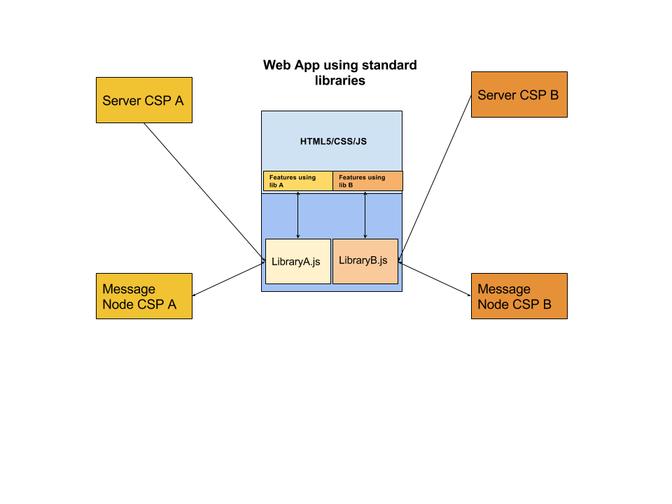

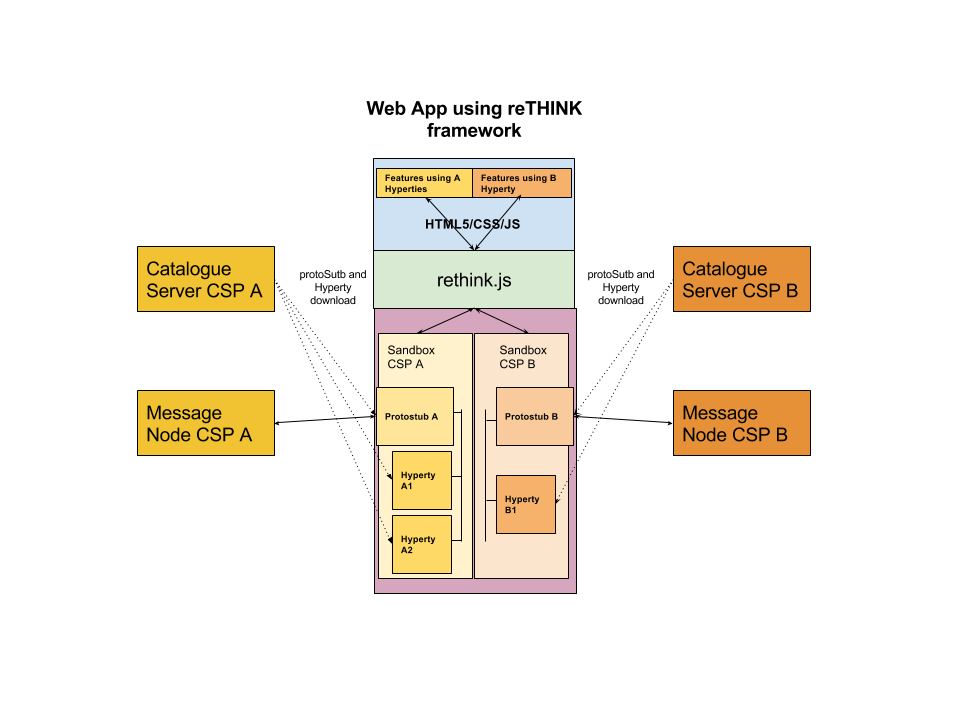

*We can include a simple example here of an application using a REST API
to exchange chat messages and the same examples using hyperties, does it
make sense to you?*

*app: the idea was trying to give some hints on how to adapt existing
Apps in order to be reTHINK enabled avoiding building from scratch a new
app*

Message Node and Protostubs Development
---------------------------------------

### Overview

The protocol stubs play a central role in the protocol on-the-fly
concept. A stub is the piece of code that a reTHINK runtime downloads,
instantiates and executes on-the-fly in order to exchange messages with
a backend system from a foreign or even from the own domain. From the
runtime's point of view the stub is the required "glue" between the
reTHINK Message Model and the backend domain's protocols. The stub
implements a well defined interface for the bi-directional asynchronous
exchange of messages and hides all potential complexity of protocol
translations for the interoperability with the backend domain.

The communication endpoint of a stub in a domains backend is the
Messaging Node (MN). The MN and the stub build a unit that shall be
designed and implemented together. The implementor of a protocol stub
and the corresponding MN has to take some decisions. How much of the
potential complexity shall be placed in the stub itself? Shall the stub
do everything that is necessary to translate the protocol to the backend
domains specifics? Or shall the stub just forward messages and let the
MN perform the major tasks of the protocol translations? These are some
hints that the developer should take into account:

1.  Does the stub have dependencies to additional libraries? This might
    blow up the size of the stub and may complicate its deployment.
    Perhaps there is a chance to avoid some external dependencies?
2.  Do any parts of the stub and it's dependencies underly special
    restricting licenses or do they contain code that holds intellectual
    properties that shall be protected? Since the code is downloaded to
    an unknown, "strange" environment this might be an issue.
3.  How much resources (network, processing, memory etc.) does the stub
    require? Are these requirements compatible with all addressed
    runtime platforms?

These questions shall be kept in mind, when the design decisions for a
stub/MN couple are made. If one of the above questions can be answered
with yes, then it might perhaps be an option to implement a basic stub
that uses a simple connection mechanism like a WebSocket or similar to
forward the reTHINK messages directly to the MN. In this case the MN
itself would be responsible for the required protocol translations on
the server side for its domain.

An example for such a situation is the Matrix.org based MN and its stub
\[TODO: add reference\] - which have been realized in the scope of this
project. The decision was made to let the stub just forward reTHINK
messages and therefore keep it simple and small. The implementation of
the Matrix.org client logic was done on the MN side. If the stub would
have implemented a full Matrix.org client, there would have been a set
of dependent SDK-libraries with their own set of dependencies each.
Furthermore a Matrix.org client produces additional overhead traffic
that should be restricted to the MN internal system and therefore be
kept away from the runtime device.

### Messaging Model

#### General message format

A reTHINK message is a standard JSON Object with a fixed set of header
fields and a variable message body. These are the common header fields:

  ------------------------------------------------------------------------
  n type                    description
  a                         
  m                         
  e                         
  - ----------------------- ----------------------------------------------
  i numeric                 an identifier used to associate RESPONSE
  d                         messages to the initial REQUEST message. It
                            should be noted that the REQUEST.id MUST be
                            incremented every time a new REQUEST message
                            is created.

  f [URL](https://github.co URL of a Hyperty instance or user associated
  r m/reTHINK-project/dev-s with it
  o ervice-framework/blob/d 
  m evelop/docs/datamodel/a 
    ddress/readme.md)       

  t [URL](https://github.co One or more
  o m/reTHINK-project/dev-s [URLs](https://github.com/reTHINK-project/dev-
    ervice-framework/blob/d service-framework/blob/develop/docs/datamodel/
    evelop/docs/datamodel/a address/readme.md)
    ddress/readme.md)       of Message recipients. According to the URL
                            scheme it may be treated in different ways by
                            the MN.

  b JSON-Object             The message body according to the type that is
  o                         identified by the type attribute in the
  d                         message header.
  y                         
  ------------------------------------------------------------------------

#### Message Body

The Message Body is a JSON object that varies according to the message
type, specified in the message header. Currently following types of
Message bodies are specified in the reTHINK specification:

-   CreateMessageBody
-   ReadMessageBody
-   UpdateMessageBody
-   DeleteMessageBody
-   ForwardMessageBody
-   ResponseMessageBody

Optionaly, all message bodies can contain JWT tokens for Access Control
for Identity Assertion purposes that are inserted by the Identity Module
before the message is routed to protostubs. When these message bodies
reach the destination runtime MessageBUS, the JWT tokens are decoded and
verified by the Identity Module. The result of this process (if
successful) is inserted in the MessageBody as assertedIdentity objects
and the JWT tokens removed, before the message is delivered to the
Hyperty. AssertedIdentity is compliant with User Identity Data Model.

Detailed specifications of these Message bodies can be found at [Message
Model](https://github.com/reTHINK-project/dev-service-framework/blob/develop/docs/datamodel/message/readme.md).

#### Request - Response transactions

A Response to a Request message should follow this rule:

    Response.from = Request.to
    Response.to = Request.from
    Response.id = Request.id

The Request.id MUST be incremented every time a new Request message is
created.

### APIs

#### The ProtoStub API

The interface that a protocol stub has to implement is kept very small
and simple by intent.

A protocolStub is constructed with a set of parameters that ensures that
the stub can be uniquely identified, can connect to its backend
Messaging Node and can communicate with the messaging bus in the
runtime.

    new ProtoStub(runtimeProtoStubURL, busPostMessage, configuration)

*Parameters:*

  ------------------------------------------------------------------------
  name   type         description
  ------ ------------ ----------------------------------------------------
  runtim URL.RuntimeU A URL allocated by the runtime that uniquely
  eProto RL           identifies this protocolStub.
  StubUR              
  L                   

  busPos Message.Mess The runtime BUS postMessage function to be invoked
  tMessa age          on messages received by the protocol stub.
  ge     (???)        

  config ProtoStubDes Configuration data that is retrieved from the
  uratio criptor.Conf protocolStub descriptor. This data is
  n      igurationDat implementation-specific and ensures that the Stub
         aList        can address and connect its own Messaging Node.
  ------------------------------------------------------------------------

##### Methods

The connect method establishes the connection between the protocol stub
and the backend messaging node.

`connect(identity)`

**Note:** The "connect" method will not be directly invoked by the
runtime implementation. Rather it is expected that the stub maintains
its connection state internally. Whenever the runtime intents to send a
message via the postMessage method, the stub shall auto-connect to the
Messaging Node and attempt to keep this connection open until it
explicitely receives a "disconnect" invocation.

*Parameters:*

  -------------------------------------------------------------------------
  name  type  description
  ----- ----- -------------------------------------------------------------
  ident IDTok An optional identity token that can be used to authenticate
  ity   en    this stub connection against the backend messaging node
  -------------------------------------------------------------------------

The disconnect method is used to explicitely disconnect a stub from its
messaging node. Such a disconnect can be used to release and clean up
resources in the stub and also on the backend side in the messaging
node.

`disconnect()`

The postMessage method is used by the runtime to send messages through
the protocol stub to connected backend server.`postMessage(message)`

  name      type              description
  --------- ----------------- ----------------------------------------------------
  message   Message.Message   The message to be dispatched by the protocol stub.

##### Events

A protocol stub emits events to communicate its own connection state to
the runtime. Whenever the stub gets connected or disconnected, it uses
the "busPostMessage" to send a message to the runtimes message bus.
These Event messages are defined as follows:

    {
      "type": 'update',
      "from": runtimeProtoStubURL,
      "to": runtimeProtoStubURL + '/status',
      "body": {
        "value": "connected|disconnected"
    }

The runtimeProtoStubURL is the URL that was provided as first parameter
of the Stub constructor. The value in the message body is either
"connected" or "disconnected".

### Message Node functionalities and main procedures

#### Stub identification and resource management

The MN is the connectivity endpoint for stubs that are deployed in
several runtimes. From the viewpoint of the MN, each stub represents one
runtime. It is the task of the MN to identify a stub connection, and to
manage the life-cycle of the assigned server side resources. The actual
"handshake mechanisms" between the stub and the MN are left
implementation specific.

A valid method for the MN to identify a stub connection is to use the
"runtimeURL", which each stub is constructed with in the runtime. If the
stub provides this url during the connection handshake procedure, then
the MN can identify the stub/runtime, even after a potential re-connect,
e.g. due to temporary loss of network connectivity.

It is the responsibility of the MN to release resources if the
"disconnect" method was invoked on the stub . This is the official
indication that the runtime does not need this stub connection anymore
has has released the stub. In the alternative case, that a stub was not
sending messages for a longer period, but was also not officially
disconnected, it is up to the MN implementation to run a kind of garbage
collection mechanism to release stale resources.

**TODO:** Verify identity parameter of the "connect" method.

#### Address Allocation

As soon as an entity in a runtime wants to be accessible from another
runtime, this entity must be addressable. Since a MN is the central
message routing point for a domain it is the MNs task to create these
addresses and to assign them to the requesting runtime. The resulting
internal allocation table stores the relation of the allocated addresses
to the stub connections and enables a proper routing of messages between
the runtimes.

The MN must support address allocation for Hyperties as well as for data
object. The general format of an allocation message is as follows:

    "id" : "<1>"
    "type" : "CREATE",
    "from" : "hyperty-runtime://<sp-domain>/<runtime-instance-identifier>/registry/allocation",
    "to" : "domain://msg-node.<sp-domain>/<type>-address-allocation",
    "body" : { "value" : {"number" : <integer> , "scheme" : <scheme>, "allocationKey" : "<key>"} }

where the "number" attribute stands for the number of requested
addresses, the "scheme" defines the requested url scheme (or protocol)
of the address and the "allocationKey" serves as identifier of this set
of allocated addresses. This key can be used to identify addresses to be
deleted later on.\
The MN must intercept such messages and respond with a message like:

    "id" : "<1>"
    "type" : "RESPONSE",
    "from" : "domain://msg-node.<sp-domain>/<type>-address-allocation",
    "to" : "hyperty-runtime://<sp-domain>/<runtime-instance-identifier>/registry/allocation",
    "body" : { "code": 200, "value" : {"allocated": ["<scheme>://<sp-domain>/<identifier>", ...]} }

The format of the generated <identifier> part of the url is
implementation specific.

The MN must de-allocate addresses, if it receives a DELETE message of
this format:

    "id" : "<3>"
    "type" : "DELETE",
    "from" : "hyperty-runtime://<sp-domain>/<runtime-instance-identifier>/registry/allocation",
    "to" : "domain://msg-node.<sp-domain>/<type>-address-allocation",
    "body" : { "resource" : "<key>" }

The "key" value in the body serves as an identifier of the previously
allocated address(es).

For more detailed information about the allocation Messages refer to
[Address allocation
messages](https://github.com/reTHINK-project/dev-service-framework/blob/d3.2-working-docs/docs/specs/messages/address-allocation-messages.md).

#### Interaction with the Domain Registry

The allocation of a unique address is only the first step on the way to
make an entity (hyperty or data object) discoverable and usable from
another runtime. In order to make it discoverable the allocated
addresses must be registered in the domain registry component. The
interaction with the domain registry is also the task of the MN. The MN
has to intercept messages from a runtime that address the <registry>
subdomain of the MNs own url and to create a corresponding asynchronous
request to the domain registry. As soon as it receives an answer, the MN
has to respond this answer back to the runtime.

A message to register an entity look as follows:

    "id" : "1"
    "type" : "CREATE",
    "from" : "hyperty-runtime://<sp-domain>/<runtime-instance-identifier>/registry",
    "to" : "domain://registry.<sp-domain>",
    "body" : { "value" : <RegistryDataObject> }

The specification of a <RegistryDataObject> can be found
[here](https://github.com/reTHINK-project/dev-service-framework/tree/master/docs/datamodeal/hyperty-registry).

If the MN receives a positive response from the domain registry, it has
to respond back to the runtime with a message like this:

    "id" : "<1>"
    "type" : "RESPONSE",
    "from" : "domain://registry.<sp-domain>",
    "to" : "hyperty-runtime://<sp-domain>/<runtime-instance-identifier>/registry",
    "body" : { "code": 200 }

Additional messages are defined to perform lookups of registered
entities (hyperties or data objects) for a given user id. The full
specification of these messages can be found here [Registration
Messages](https://github.com/reTHINK-project/dev-service-framework/blob/d3.2-working-docs/docs/specs/messages/registration-messages.md)

#### Subscription management

A core concept in the reTHINK architecture is that Hyperties interact
with each other by exchanging and synchronizing their managed data
objects based on the Reporter - Observer pattern. The MN supports this
concept by allowing observers (hyperties, running in one or more
runtimes) to subscribe for changes of certain allocated data object urls
deployed in other runtimes. Whenever a hyperty runtime reports a change
in a monitored data object it sends a change message to the MN. The "to"
address of this message will just be the allocated address of the
updated data object, not the address of the subscribers directly.

In order to route such object change messages to the subscribed
listeners, the MN has to maintain an own list of subscribers per
allocated data object. Therefore the MN must intercept subscription
messages which have the following format:

`"id" : "1" "type" : "SUBSCRIBE", "from" : "hyperty-runtime://<observer-sp-domain>/<hyperty-observer-runtime-instance-identifier>/sm", "to" : "domain://msg-node.<observer-sp-domain>/sm", "body" : { "resource" : "<ObjectURL>" , "childrenResources" : [{"<resource-children-name>"}], "schema" : "hyperty-catalogue://<sp-domain>/dataObjectSchema/<schema-identifier>"}`

This message of type "SUBSCRIBE" is addressed to
"domain://msg-node.<observer-sp-domain>/sm", which is the identifier of
the MNs "Synch Manager (sm)" component. In the body the most important
field is the "resource", which contains the allocated address of the
object that shall be subscribed by the runtimes sync manager (as
identified by the "from" field).

The MN must extract the <ObjectURL> from the body and assign this url
internally to the given "from" URL. This means for the MN that every
future "changes"-message to this ObjectURL must be forwarded to this
"from" URL. If the "childrenResources" arrays contains values, than
additional assignments must be created for each <ObjectURL> + / +
<resource-children-name>.

After extraction of the parameters and the creation of the assignments,
the MN must respond with a message of code 200 back to the runtime.

`"id" : "1" "type" : "RESPONSE", "from" : "domain://msg-node.<observer-sp-domain>/sm", "to" : "hyperty-runtime://<observer-sp-domain>/<hyperty-observer-runtime-instance-identifier>/sm", "body" : { "code" : "2XX"  }`

*NOTE:* The procedure to un-subscribe from data object changes looks
very similar to the above described subscribe procedure. The message to
intercept is then of type "UNSUBSCRIBE". The MN has to remove the
previously mapped assignments and respond back with a code 200 message.

If the MN later on receives a message from a reporting Hyperty that its
data model has changed this message will look like this:

`"id" : "3" "type" : "UPDATE", "from" : "<ObjectURL>", "to" : "<ObjectURL>/changes", "body" : { "value" : "changed value"  }`

Note that the "from" and "to" fields just contain the <ObjectURL> and
the "to"-field has the suffix "/changes". When the MN receives such a
message, it must look up for all subscribed listeners to this
<ObjectURL> and forward the message to them.

A more detailed specification can be found at [Data sync
messages](https://github.com/reTHINK-project/dev-service-framework/blob/d3.2-working-docs/docs/specs/messages/data-sync-messages.md).

#### Identity management connector

*To be provided*

#### Policy decisions and enforcement

Message nodes are responsible for the interaction of runtimes in their
own domain with runtimes from foreign domains by offering protocol stubs
to these external runtimes. However the operators of a certain domain
need a mechanism to control these domain interactions and to potentially
block or limit certain combinations of message exchange.

In order to achieve this, a MN must provide a hook in the message flow
that allows to apply policy based decisions to the routing. These policy
must be manageable by the domain Policy Manager.

#### Protocol on-the-fly engine

The basic operation mode of a MN is that it is connected by runtimes
directly via the provided protocol stubs. A message received from one
runtime will be forwarded to another runtime which must also be directly
connected through a stub. This is a classic "triangular" messaging
architecture. The triangular message flow looks like this:

`RuntimeA --> StubB --> MN-B --> RuntimeB`

For future iterations of the reTHINK messaging it is intended that the
MNs also support a "trapezoid" architecture for inter-domain
communication. In contrast to the triangle, each runtime will only have
a connection with the MN from its own domain. If one runtime wants to
send a message to another one from another domain, it will not be
runtime itself that downloads and instantiates the stub of the foreign
domain. It would be the domains MN instead that has to do this.

The trapezoid message flow will then look like this:

`RuntimeA --> StubA --> MN-A --> StubB --> MN-B --> RuntimeB`

and vice versa. This implies that in future versions the MN has to
implement a module for the proper downloading, instantiation and
operation of foreign stub in a sandboxed environment, just like the
runtimes are already doing it.

### Message routing procedure

This section tries to summarize all the descriptions of the individual
MN components from above and describe the basic messaging handling and
routing procedures inside a MN. It uses a pseudo-code like format to
describe the order of the operational steps.

Several checks must be applied:

-   Is it a routable reTHINK message?
    -   i.e. does it contain a "from" and "to" field?
    -   if not --&gt; reject / ignore
    -   stop
-   To be confirmed: Identity-token verification ?
-   Is it an allocation management message?
    -   allocate / de-allocate addresses
    -   return proper RESPONSE message
    -   stop
-   Is it a registration management message?
    -   perform the requested (asynchronous) interaction with the domain
        registry
    -   return the result of this interaction in a proper RESPONSE
        message
    -   stop
-   Is it a subscription management message?
    -   extract the DataObjectURL and potential childrenResources from
        the message body
    -   perform the requested assignments / de-assignments to the
        internal subscriber mappings
    -   stop
-   Is the message type == UPDATE and the "from" address one of the
    previously subscribed DataObjectURLs?
    -   Is the "to" address == "from" + "/changes"?
        -   retrieve the corresponding runtime URL from the subscriber
            mappings
        -   forward this message to the retrieved runtime URL via the
            proper stub
        -   stop
-   This seems to be a "normal" message.
    -   extract the "from" address and remember its relation to the stub
        that has sent this message
    -   (this is required to find the correct return path for a
        subsequent response to this address)
    -   extract the "to" address and investigate the corresponding stub
    -   if the "to" address corresponds to a connected stub ()
        -   forward the message through this stub
    -   else
        -   (the "to" address points to a domain that is not currently
            connected via a stub)
        -   discover, download, instantiate and use a stub to this
            foreign domain (trapezoid architecture)
    -   stop

### Protostub Source Code Examples

#### Stub construction and activation

Stubs are provided by different vendors and developers and of course
they have different naming conventions. In order to provide a common
instantiation scheme a convention was defined additionally to the
interface that ProtoStubs have to implement. The convention is that each
stub modules must export a default activation function that is used by
the runtimes to obtain a stub instance with a given set of parameters.

    export default function activate(url, bus, config) {
      return {
        name: 'MatrixProtoStub',
        instance: new MatrixProtoStub(url, bus, config)
      };
    }

This activation function hides the internal naming and just returns an
object that provides an implementation of the methods defined in the
ProtoStub interface. The parameters of this function correspond directly
to the previously described parameters of the Stub constructor.

#### Auto connect mechanism

As mentioned as a side note in the API description of the ProtoStub's
connect method, the stubs are expected to support an auto connect
mechanism. This is because the runtime will not explicitely invoke the
connect method itself. Instead it just sends messages via the messaging
bus to the stub and assumes that the stub takes care of its own
connection state.

A simple approach to implement this behavior in the stub is to maintain
a flag that indicates whether the connection to the MN shall be kept
open or not. This flag could be set to TRUE, as soon as the first
message is beeing sent and to FALSE if the stub receives a "disconnect"
command from the runtime. If for instance a network problem causes an
interruption of the connection between stub and MN, the stub would
attempt to re-cnnect as soon as the next message shall be sent.

This is, how the method to send a message could look like:

    _sendWSMsg(msg) {
      if ( this._assumeOpen )
        this.connect().then( () => {
          this._ws.send(JSON.stringify(msg));
        });
    }

If there is an explicit invocation of the "disconnect" method of the
stub the stub will close the connection to the MN and set the keep alive
flag off.

    disconnect() {
      this._ws.close();
      this._assumeOpen = false;
    }

#### Connection events

The stub must emit a "connect" or "disconnect" message to the bus
whenever its connection state changes. The following method can be used
to encapsulate this:

    _sendStatus(value, reason) { let msg = { type: 'update', from: this._runtimeProtoStubURL, to: this._runtimeProtoStubURL + '/status', body: { value: value } }; if (reason) { msg.body.desc = reason; }

    this._bus.postMessage(msg); }

The expected "value" parameter is either "connected" or "disconnected".
Optionally a reason can be specified that will be placed int the body of
the message.

If the connection to the MN is established via a Websocket, then the
sending of the corresponding event messages can be triggered in the
"open" and "close" handlers of the Websocket.

    _onWSOpen() { this._sendStatus("connected"); }

    _onWSClose() { this._sendStatus("disconnected"); }

#### Integration with the Messaging Bus of the Runtime

Protocol stubs are tightly integrated with the messaging bus of the
runtime. This integration is bi-directional. A reference to the
messaging bus is provided as second paramenter of the stub constructor.

In order to receive messages from the runtime's messaging bus, the stub
has to add itself as a listener. This can be done directly in the stubs
constructor by adding such a code
snippet:`this._bus.addListener('*', (msg) => {     this._assumeOpen = true;     this._sendWSMsg(msg); });`
Whenever now the stub receives a message via this listener callback it
sends it forward (in this case via a Websocke connection) to its MN.

For every message that is received from the MN, the stub forwards this
message to the bus by using its postMessage method like shown
here:`// parse msg and forward it locally to the runtimes messaging bus _onWSMessage(msg) {   this._bus.postMessage(JSON.parse(msg.data)); }`

Specification
=============

This chapter provides an update of the detailed specification of the
Hyperty Runtime, the Message Node and Messages used for the main
procedures, taking into account changes performed during the
implementation activities.

Runtime Architecture
--------------------

The main Hyperty Runtime architecture is comprised by different types of
components that, for security reasons, are executed in isolated
sandboxes. Thus, components downloaded from a specific Service Provider
(e.g. Service Provider 1) are executed in sandboxes that are different
from the sandboxes used to execute components downloaded from another
service provider (e.g. Service Provider 2). In addition, for the same
Service Provider, and also for security reasons, protocol stubs and
Hyperties are isolated from each other and executed in different
sandboxes. Communication between components running in different
sandboxes is only possible through messages exchanged through a Message
Bus functionality provided by the Core Sandbox. On the other hand, the
Protocol Stub provides the bridge for the Hyperty Runtime to communicate
with associated Service Provider. For example, in Figure below,
protostub1 is the only way that Hyperty instances have to communicate
with Service Provider 1. In general, in the Core Sandbox, all required
functionalities to support the deployment, execution and maintenance of
components downloaded from service providers, are executed. Core
components are, ideally, natively part of the device runtime. However,
to support existing platforms including Browsers and Mobile Operating
Systems, to minimise the need to install new applications, the existing
device native runtime functionalities (e.g. JavaScript engine) are
distinguished from the Hyperty Core Runtime functionalities. In such
situations, the Hyperty Core Runtime components are downloaded from the
Hyperty Runtime Service Provider and are executed in an isolated core
sandbox.


The Application and the Hyperty can be delivered by the same Service
Provider or by different Service Providers, i.e. Hyperty is delivered by
an (Hyperty) Service Provider and the Application is delivered by an
Application Service Provider. These two different situations impacts the
level of trust between the Application and the Hyperty, that should be
handled by the Hyperty Runtime accordingly.

In Figure above, the Application and the Hyperty Instances it consumes,
are downloaded from the same Service Provider. Thus, it is assumed they
trust each other and that they can be executed in the same sandbox with
no impact on how the Application consumes the Hyperty Application API.
In Figure below, it is depicted the Runtime Architecture where the
Application and the Hyperty Instances it consumes, don't trust each
other, for example, they are downloaded from different service
providers. In such situation, Hyperties and the Application are isolated
from each other and they are executed in different sandboxes. In this
case, the Hyperty Application API is no longer local and the application
is only able to reach the Hyperty Instance through the Message BUS. It
is desirable to abstract the Application developer from these situations
and to let the Application developer call the Hyperty Application API as
if they are always local. This implies that the Core Runtime and the
Sandbox implementation, is able to support a Remote Procedure Call (RPC)
communication when the Application and the Hyperty Instance are in
different sandboxes.


As described below, to prevent cross origin attacks / spy, access to
Core Runtime Message BUS is subject to authorisation, by using
standardised policies downloaded from each involved Service Provider. In
addition, the Hyperty Runtime Architecture also supports Hyperty
Interceptors executed in a dedicated sandbox (see Figure below) enabling
the enforcement of proprietary policies.


In addition, Core Policy Engine should enforce general access control
policies that are agnostic of sender and target domains, or specific to
the domain managing the device runtime (Core Runtime Provider). The
policies used to control the access to [Hyperty Data
Objects](https://github.com/reTHINK-project/dev-service-framework/blob/master/docs/manuals/p2p-data-sync.md)
(see below) , are a good example of such policies.

Some more details are provided in the following sections.

### Service Provider Sandboxes

#### Hyperty

As [previously defined,
Hyperties](https://github.com/reTHINK-project/dev-service-framework/blob/master/docs/manuals/hyperty.md)
cooperate each other via P2P Synchronisation of Hyperty JSON Data
Objects supported by the novel [Reporter - Observer communication
pattern](https://github.com/reTHINK-project/dev-service-framework/blob/master/docs/manuals/p2p-data-sync.md)
and on top of the [Hyperty Messaging
Framework](https://github.com/reTHINK-project/dev-service-framework/blob/develop/docs/manuals/hyperty-messaging-framework.md).

#### Hyperty Interceptor

Hyperty Interceptor complements the Core Policy Engine functionality
enabling the enforcement of proprietary or closed Policies in the
Hyperty Runtime for a specific Hyperty instance.

#### Protocol Stub

The Protocol Stub implements a protocol stack to be used to communicate
with the Service Provider's backend servers (including Messaging Server
or other functionalities like IdM) according to [Protocol on the
Fly](https://github.com/reTHINK-project/dev-service-framework/blob/develop/docs/manuals/hyperty-messaging-framework.md#protocol-on-the-fly-protofly-and-protostubs)
concept.

Protocol stubs are only reachable through the Message BUS. In this way
it is ensured that all messages received and sent goes through the
message bus where policies can be enforced and additional data can be
added or changed including identity tokens.

### Core Runtime

The Core Runtime components are depicted in Figure below.

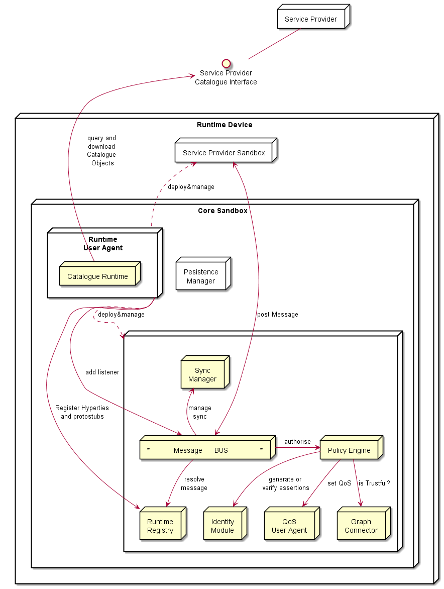

Runtime Core components should be as much as possible independent on the
Runtime type. They should be deployed once and executed at the
background. The next time the runtime is started there should be no need
to download the core runtime again unless there is a new version.
Runtime core components instances should be shared by different Apps and
Hyperty instances.

The Core Runtime is provided by a specific Service Provider (the Core
Runtime Service Provider) that handles a Catalogue service to with
Runtime Descriptors and a Registry service to handle the registration of
Runtime instances.

#### Message BUS

The Message Bus Supports local message communication in a loosely
coupled manner between Service Provider sandboxes including Hyperty
Instances, Protocol Stubs and Policy Enforcers. Messages are routed to
listeners previously added by the Runtime User Agent, to valid Runtime
URL addresses handled by the Runtime Registry functionality.

Access to Message Bus is subject to authorisation to prevent cross
origin attacks / spy from malicious downloaded code including Hyperties,
Protocol Stubs or Policy Enforcers.

#### Core Policy Engine

The Core Policy Engine provides Policy decision and Policy Enforcement
functionalities for incoming and outgoing messages from / to Service
Provider sandboxes, according to Policies downloaded and stored locally
when associated Hyperties are deployed by the Runtime User Agent. It
also provides authorisation / access control to the Message BUS.

The verification or generation of identity assertions, to get valid
Access tokens, are two examples of actions ruled by policies.

#### Runtime Registry

The Runtime Registry handles the registration of all available runtime
components including Core components, Service Provider Sandboxes and
each component executing in each sandbox like Hyperty Instances,
Protocol Stubs, Hyperty Inteceptors and Applications.

The Runtime Registry handles the allocation of Runtime URL addresses for
all these components and manages its status.

In addition, the Runtime Registry ensures synchronisation with Back-end
Service Provider's Domain Registry.

The Runtime Registry must have listeners to receive messages at:

    hyperty-runtime://<runtime-instance-identifier>/registry

#### Identity Module

The Runtime Identity Module manages ID and Access Tokens required to
trustfully manage Hyperty Instances communication including trustful
association between Hyperty Instances with Users. In addition, it also
supports the generation and validation of Identity assertions. Identity
module is an extension of [WebRTC
Identity](http://w3c.github.io/WebRTC-pc/#identity) and interacts with
Identity Providers via IDP Proxy protostubs.

Messages routed by Message Bus should be signed with a token according
to the Identity associated to it and managed by the Identity Module.

The Runtime Identity Module must have listeners to receive messages at:

    hyperty-runtime://<runtime-instance-identifier>/idm

#### Runtime User Agent

The Runtime User Agent, manages Core Sandbox components including its
download, deployment and update from Core Runtime Provider. It also
handles Device bootstrap and the deployment and update of Service
Provider sandboxes including Hyperties, Protocol Stubs and Policy
Enforcers, via the Runtime Catalogue.

#### Runtime Catalogue

The Runtime Catalogue manages the descriptors of deployable components
and Hyperty Data Object schemas that are downloaded from the Service
Provider Catalogue via the [Catalogue Service
interface](https://github.com/reTHINK-project/architecture/blob/master/docs/interface-design/Interface-Design.md#73-catalogue-interface).
The Runtime Catalogue ensures synchronisation with Back-end Catalogue
servers.

The Runtime Catalogue must have listeners to receive messages at:

    hyperty-runtime://<runtime-instance-identifier>/catalogue

#### Persistence Manager

The Persistence Manager provides data storage functionalities (write and
read) to Core Runtime Components including Runtime Catalogue, Runtime
Registry, Policy Engine and Graph Connector.

#### Sync Manager

The Sync Manager is in charge of handling authorisation requests to
create Sync Data Objects and subscription requests to Sync Data Objects.
As soon as authorisation is granted the Sync Manager handles all
required MessageBUS listeners in order to setup the Data Sync Stream
routing path among Hyperties. The Sync Manager must have listeners to
receive messages at:

    hyperty-runtime://<runtime-instance-identifier>/sm

#### QoS User Agent

The QoS User Agent Manages network QoS in the runtime. This component
requires further investigations which will be reported later.

#### Graph Connector

The Graph Connector is a local address book maintaining a list of
trustful communication users. This functionality is further detailed in
deliverable D4.2.

The Graph Connector must have listeners to receive messages at:

    hyperty-runtime://<runtime-instance-identifier>/graph

### Native Runtime

The Native Runtime provides Functionalities that are natively provided
by the runtime, e.g. JavaScript engine or WebRTC Media Engine to support
for Stream communication between Hyperties according to WebRTC Standards
when available.

Security analysis of the Hyperty Runtime
----------------------------------------

### Introduction

This section presents the security analysis of the [Hyperty Runtime
architecture](https://github.com/reTHINK-project/core-framework/blob/master/docs/specs/runtime/runtime-architecture.md).

The Hyperty Runtime depends on a trusted computing base (TCB) that
consists of several components: the Core Sandbox, the Native Runtime,
and underlying Operating System and hardware. Subverting the Core
Sandbox components may result in (1) incorrect decision and enforcement
of policies by the PDP, (2) failure in routing messages through the
Message Bus, (3) flawed registration and discovery of Hyperty and
ProtoStubs by the Registry, and (4) incorrect maintenance of identities
by the Identities Container. If the Native Runtime is compromised, so it
will be the support for WebRTC stream communication between Hyperties.
Since the Native Runtime implements the JavaScript engine (e.g., V8
\[21\]), tampering with the Native Runtime will undermine the execution
of components implemented in JavaScript code, namely the components of
the Core Sandbox (i.e., Policy Engine, Message Bus, Registry, Identities
Container, and WebRTC engine) and client code instances (i.e., Hyperty
Instances, ProtoStubs, Service Provider Policy Enforcers (SPPEs), and
Applications). Lastly, compromising the Operating System or the hardware
may result in incorrect behaviour of any of their overlying components,
in particular the Native Runtime.

Next, we analyse the security properties of our system assuming that the
trusted computing base is intact. Then, we assess the security
vulnerabilities of the Hyperty Runtime when deployed on platforms
featuring specific software and hardware configuration. In particular,
we explore three platform configurations: *browser*, *standalone*, and
*M2M standalone application*. We analyze each target platform under its
specific threat model.

### Mitigated threats assuming an intact TCB

When the TCB is intact, our architecture ensures the correct isolation
of client JavaScript code (i.e., Hyperties, ProtoStubs, SPPEs, and
Applications). Isolation is enforced both between different client code
instances and between client code instances and the environment (e.g.,
external applications, or OS resources). The Hyperty Runtime enforces
access control decisions based on policy rules attached to Hyperty code.
Such policies can regulate different aspects of the behaviour of a
Hyperty: access to local resources (e.g., cookies, files, network, etc),
routing, charging, and privacy restrictions. The system also ensures the
authenticity of client code and the identity of the involved entities.

In the basic threat model, we assume that an attacker can serve
arbitrary client code to the Hyperty Runtime. The attacker can
impersonate a legitimate service provider and deliver malicious
ProtoStub, Hyperty, or SPPE code. When instantiated on the Hyperty
Runtime, this code may attempt to execute JavaScript instructions in
order to access private data held (1) by other client code (including
applications’), (2) by the Hyperty Runtime TCB, or (3) by the
surrounding environment (e.g., the JavaScript Engine, or the Operating
System). Malicious code may also aim to tamper with security-critical
components, such as Hyperty policies or the policy enforcement engine,
in order to escalate privileges. Finally, malicious code may launch
denial of service attacks (e.g., by executing CPU intensive code). Below
in this document, we expand on this threat model to consider potential
vulnerabilities of our system when deployed on different environments.
Next, we describe how our system defends against several classes of
potential attacks.

#### T1: Unauthorized access by client code

The basic mechanism of our architecture to prevent unauthorized access
by client code is sandboxing. Each Hyperty instance running in the
system runs in its own sandbox. A sandbox defines a security perimeter
for the Hyperty instance, preventing it from reading or writing the
memory (or other resources) allocated to other Hyperty instances or by
other components in the surrounding environment. An independent sandbox
hosts the ProtoStub instance required by local Hyperty instances to
communicate with external services. This sandbox will prevent
potentially malicious ProtoSub code from unauthorized access to
resources. To communicate outside the sandboxes, the runtime provides
well defined interfaces: the Syncher, which is used by the Hyperty
instance to communicate with the SPPE, and an API to communicate with
the Message Bus. The SPPE and the PEE are responsible for enforcing the
policy associated with the Hyperty instance.

The origin of the client code is validated. An origin is a combination
of URI scheme, hostname, and port number. The origin can be asserted
using certificates (e.g. using TLS) thus we only allow client code from
secure origin.

Client code is subject to Same Origin Policy for direct interactions
between client code instances. However, this can be relaxed using Cross
Origin Resource Sharing (CORS) policy declarations. Pieces of client
code from different origins can still communicate without CORS using the
Message Bus API. Message exchange must be identified by the origin of
senders and recipients. Subscription to messaging channels (where
multiple client codes could publish messages) must be subject to
authorization.

Note that, in our architecture, sandboxing is also used to secure the
components of the Hyperty Runtime that are implemented in JavaScript,
namely the components allocated in the Core Sandbox. The JavaScript
engine implements both the client code sandboxes and the Core Sandbox.

#### T2: Policy subversion

Every Hyperty instance is constrained by a policy. A policy defines a
set of rules, which can be of several types: access control rules,
routing rules, charging usage rules, and privacy rules. Altogether,
policy's rules are responsible for regulating, supervising, or
restricting the operations that a Hyperty can perform, e.g., prevent
access to a local file, enforce a predefined network route, or define
the usage costs of a service. To prevent a malicious Hyperty instance
(or ProtoSub) from subverting policy rules and escalate its privileges,
the policy decision components and the policy repository are protected
from the Hyperty instance by the Core Sandbox. As a result, policy
integrity and enforcement are safe from malicious client code.

#### T3: Threats to client code authenticity

The authenticity of client code -- Application, Hyperty, ProtoStub, or
SPPE -- can be compromised if at least one of two events has occurred
without being detected before the code is loaded and instantiated into a
sandbox: an attacker has modified the original code bytes (e.g., by
embedding malware into a Hyperty code), or (ii) has modified the code
identity. To prevent such attacks, client code's origin must be
digitally signed and transmitted over a secure channel. Additionally the
client code may be signed by its manufacturer. By checking these
signatures before instantiating the Hyperty, ProtoStub, or SPPE code on
the sandboxes and assuming that the cryptographic primitives are
correctly implemented, the Hyperty Runtime can guarantee the integrity
and identity of the code.

#### T4: Denial of service attacks

A malicious Hyperty instance, ProtoStub, or SPEE implementation can
launch denial of service attacks by holding to specific resources, e.g.,
hogging the CPU by sitting on an infinite loop, or flooding the network
with bogus messages. The JavaScript engine featuring the Hyperty Runtime
prevents such attacks by placing a limit to the maximum utilization of a
given service by a client code instance, for example by bounding the CPU
cycles that a Hyperty instance is allowed to execute uninterrupted.

### Vulnerability assessment of the Hyperty Runtime

The Hyperty Runtime can effectively thwart the threats described in the
previous section so long as the system's TCB remains intact. However,
when deployed on a specific platform, the Hyperty Runtime may become
vulnerable to some environment-specific security risks. In this section,
we study the potential vulnerabilities of the TCB when deployed on three
different platforms. But first, we describe our methodology to ensure a
uniform vulnerability assessment of our system across platforms.

#### Methodology

Our basic methodology is based on a *vulnerability matrix*. A
vulnerability matrix indicates representative practical attacks that can
be carried out against the TCB on a given platform as a mean to
compromising the security of the Hyperty Runtime. An attack is
successful by achieving one or more goals described in the section
above: permit unauthorized access by client code (T1), subvert Hyperty
policies (T2), compromise the authenticity of client code (T3), and
launch denial of service attacks (T4). We classify the attacks to the
TCB along two dimensions: (1) the layer of the computer stack where the
attack is directed to (e.g., the operating system), and (2) the
difficulty level of the attack based on the technical skills and
resources required by the adversary.


The figure above provides an example of a vulnerability matrix for a
dummy platform. The content of each cell describes examples of attacks
that can be launched to the TCB, e.g., "A1: inspection of JavaScript
code through the browser", "A7: probing the system bus". Columns
represent the difficulty level and rows the attack layer (both of them
will be explained below). Intuitively, the vulnerability matrix allow us
to grasp how exposed the TCB is to attacks: the lower the difficulty
degree of the attacks is the more vulnerable the Hyperty Runtime will be
when deployed on a particular target platform. Next, we describe the
classification for attack layers and difficulty levels:

**Attack layers.** Attack layers can be classified in five types,
ordered top-down, from the highest to the lowest layer of the computer
stack, as shown in the figure below:

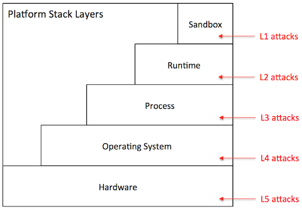

-   *Sandbox level (L1)*: The attacker has direct access to the sandbox
    environment, hence to the code and execution state of
    Hyperty instances. For example, on a browser platform, users
    typically have access to the JavaScript of a given page. This means
    that a malicious user can leverage that mechanism to tamper with the
    JavaScript code of local Hyperty instances.

-   *Runtime level (L2)*: The attacker has direct access to the code or
    execution state of the Hyperty Runtime. Depending on the specific
    exploit, he can mount attacks that disable defences against the
    attacks described in the previous section. On the browser, for
    example, a L2 attack can be achieved by installing a malicious
    browser extension that bypasses the policy enforcement mechanism of
    the Hyperty Runtime.

-   *Process level (L3)*: The attacker has access to the execution state
    of the process where the Hyperty Runtime is hosted. Just like the L2
    attacks, this type of attack can result in
    catastrophic consequences. Examples of attacks performed at the
    process level include attaching a debugger to the Hyperty Runtime
    process and inspect its internal data structures, or dumping its
    memory state to disk by reading from /dev/mem.

-   *Operating system level (L4)*: The adversary has access to the
    execution state of the operating system, and therefore to the
    execution state of the Hyperty Runtime. Similarly to L2 and L3, L4
    attacks can be catastrophic. An attack performed at this layer, for
    example, installs a rootkit to maintain a log of all operations
    performed by local Hyperty instances.

-   *Hardware level (L5)*: The adversary has physical access to the
    hardware of the platform and can launch simple attacks that do not
    involve tampering with the circuitry. Attacks in this category
    include, removal or inspection of the hard disk, probing the system
    bus in order to extract secrets from volatile memory, etc. An attack
    at this level may also include tampering with the silicon chips,
    perform side-channel attacks, etc. Such attacks require a high-level
    of expertise and committed resources. In theory, attacks performed
    at this level can reveal the entirety of the system state, including
    the operating systems. In practice, however, such attacks are more
    directed towards the extractions of specific secrets when L3 attacks
    or above are not possible.

**Difficulty level.** The difficulty level of an attack depends on
several factors: the privileges owned by the adversary (e.g., user or
superuser), the skills that are required (e.g., know how to run a
debugger or tamper with silicon), and the necessary resources to carry
out the attack (e.g., specific software exploits, memory probes, etc.).
Based on these factors, we define three difficulty levels for a given
attack:

-   *Easy (D1)*: The attack is easy to perform. The tools that are
    necessary to launch the attack are accessible, well documented, and
    simple to handle. Some examples of D0 attacks include: (i) on a
    browser platform, a malicious user leverages the browser interface
    to modify Hyperty code, (ii) on a constrained device, the device
    owner abuses superuser privileges to disable the policy enforcement
    mechanisms of the Hyperty Runtime.

-   *Medium (D2)*: The attack requires considerable skills and /
    or resources. It can be launched by mastering the tools presently
    available in the system (e.g., tools provided by the operating
    system, debuggers) or by installing new ones that can be found on
    the Internet (including malware or exploits). The attacker has
    limited skills or resources to discover new vulnerabilities or to
    develop exploits autonomously. Examples of such attacks include,
    attaching debuggers to extract in-memory secrets from the Hyperty
    Runtime, patch the Hyperty Runtime using exploit code published on
    the Web, etc.

-   *Hard (D3)*: The attack is very sophisticated. To mount the attack,
    the attacker must be able to develop its own exploit code, find new
    vulnerabilities in the system, and / or launch software
    hardware attacks. For example, finding bugs in a device driver’s
    code and write software exploits. The attacks performed at the deep
    hardware level are also considered hard to execute.

When drawing a vulnerability matrix, we define *attacker profiles*,
which define sets of possible attacks that characterize possible attack
agents in that particular platform. For example, for the browser
platform, we define three profiles: regular user, advanced user, and
power user. The regular user captures an average web user, which is able
to launch attacks like "inspection of JavaScript code through the
browser", but not "probing the system bus". We now present our
vulnerability assessment for each of the target platforms.

#### Browser platform

The primary platform targeted by reTHINK is the browser. Browsers can be
highly heterogeneous; we may be talking about desktops, laptops, or
mobile devices featuring many different configurations with respect to:
hardware architecture, operating system in use, installed software, and
specific browser version and extensions. In spite of this diversity, a
Hyperty-enabled browser will tend to follow the general architecture
represented in the figure below.

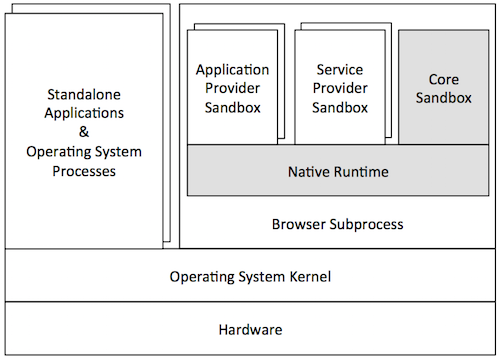

In this architecture, the Hyperty Runtime (represented by the shaded
components of the Figure) is deployed on an independent browser process.
This process is in fact a "subprocess" of the browser that implements a
sandboxing mechanism of its own (as in the Chrome browser). This
mechanism is responsible for isolating the Hyperty Runtime from the
browser's rendering engine. The JavaScript engine is responsible for the
secure execution of JavaScript code inside individual sandboxes: (1) the
Core Sandbox of the Hyperty Runtime, (2) service provider sandboxes for
hosting Hyperty instances, ProtoStubs and SPPEs, and (3) application
provider sandboxes for executing guest applications. As expected, the
Hyperty Runtime process depends on the operating system, which in turn
depends on the underlying hardware setup. Browser processes run
side-by-side with other standalone application processes and operating
system services.

From the security point of view, the threats to the TCB of the Hyperty
Runtime are mainly caused by an adversarial user. To better characterize
these threats, we define three attacker profiles and draw the
vulnerability matrix as follows:


-   *Regular user*: This attacker profile captures the class of users
    with an average proficiency level in computing, but are willing to
    subvert the security properties of the system's TCB. The user's
    privileges allow for limited operations, such as: launch the
    browser, and run Hyperty-based applications. A regular user is
    expected to mount the following attacks:

    -   *A0*: Access and modify client JavaScript code through the
        browser interface.
-   *Advanced user*: This profile captures users with superuser
    privileges and some degree of skills and knowledge of the system.
    The user is aware of existing tools and techniques that can be
    leveraged to hack into the system's components, has access to
    exploits available on the Internet, and can handle auxiliary tools
    (e.g., debuggers, Unix advanced commands, etc.). The user can
    assemble and disassemble the basic hardware components of the system
    (e.g., plugging in / out the hard disk). For mobile devices, the
    user can root or jailbreak the platform by following instructions.
    Thus, considering this set of skills, in addition to A0, an advanced
    user can perform several other attacks at different stack layers
    such as these:

    -   *A1*: Compromise the runtime by installing a malicious
        browser extension.
    -   *A2*: Dump the memory contents of the process to disk.
    -   *A3*: Install a rootkit on the operating system that keeps track
        of Hyperty instances' communication.
-   *Power user*: This profile corresponds to highly skilled users, who
    have deep knowledge of the system and can launch
    sophisticated attacks. A user is able to investigate unknown
    vulnerabilities in the software (including in the Hyperty Runtime or
    in the OS) and develop specific software exploits. Moreover, the
    user has enough resources and tools to launch hardware attacks that
    involve tampering with silicon. A power user is able to mount not
    only the attacks described previously, but more sophisticated
    attacks on various layers of the stack:

    -   *A4*: Find and exploit a bug in the Hyperty Runtime.
    -   *A5*: Attach a debugger to the browser’s subprocess and inspect
        / modify its memory.
    -   *A6*: Build a device driver to continuously monitor the
        execution of Hyperty Instances.
    -   *A7*: Probe the system bus and extract private key material of
        Hyperty Instances.

**Vulnerability assessment:** As illustrated by the vulnerability
matrix, the browser platform is vulnerable to a range of attacks. Some
of these attacks can be mounted by regular users with relative ease. In
addition, there are several ways for advanced users to successfully
compromise the TCB by exploiting the system at different stack layers.
As a result, we recommend that browser platforms are avoided for hosting
client code which the local user has incentives to subvert. Examples of
such code include: Hyperty instances restricted by specific usage
charging policies, ProtoStubs that encode proprietary communication
protocols, or Applications that access copyrighted digital data.

**Phase 1 implementation:** In the phase 1 implementation, we use native
mechanisms provided by the browser API to ensure that the required
sandboxing properties are satisfied. The core runtime components execute
inside an iFrame. The iFrame implements the core sandbox by isolating
the code of the core runtime from the main window in which the
application javascript code is executed. This isolation mechanism
prevents applications from having direct access to the memory address
space of the core runtime. Communication between application and core
runtime is possible only through a single and well defined entrypoint
which allows them to exchange messages: method postMessage(). Hyperties
and protoStub execute as independent Web Workers. Web Workers
effectively isolate their internal states from each other and from the
core runtime. The postMessage() method constitutes the only
communication bridge between the these components. Based on this
analysis, we conclude that the phase 1 implementation prototype
satisfies the security properties that were specified for the browser
runtime architecture.

#### Standalone platform

A variant of the browser platform is to deploy the Hyperty Runtime as a
standalone application, for example to be executed as a mobile app on
mobile devices such as smartphones or tablets. The Hyperty Runtime can
also be packaged as a classical standalone application for desktop
platforms running Linux or Windows. To allow for the development and
maintenance of such applications, reTHINK will provide an SDK that will
include APIs and platform specific libraries for adapting the Hyperty
Runtime to the underlying operating system platform.


The figure above illustrates a general standalone platform tailored for
Android mobile devices. Just like in the browser platform, the Hyperty
Runtime is wrapped around a host process. The host process is
responsible for (1) mediating the system calls issued by the Hyperty
Runtime to the operating system and (2) providing a user interface to
the Hyperty Runtime and client JavaScript applications (and Hyperties).
In addition to the Hyperty Runtime, the host process application
consists of: a platform-independent adaptation layer, and
platform-specific libraries, e.g., for IO, storage, and memory
management. In the example of the figure, the platform-specific
libraries correspond to the Android API framework.

From the security point of view, standalone and browser platforms are
quite similar; for that reason we adopt the same attacker profiles
(regular user, advanced user, and power user). The main difference
between architectures is twofold. First, the host application will
prevent direct introspection of the JavaScript code running inside
Hyperty Runtime sandboxes. As a result, the application architecture is
able to mitigate simple attacks to the browser (A0 in the browser’s
vulnerability matrix), raising the bar for regular users. Second, the
host application will not support software extensions. This restriction
prevents some advanced attacks to the runtime based on installation of
malicious extension code, and to the browser process (see attacks A1 and
A2, respectively, in the browser's vulnerability matrix). Next, we
present the vulnerability matrix of the standalone platform and provide
alternative attack examples.


-   *Advanced user*: An advanced user can compromise the entire system
    by launching attacks at the OS level:

    -   *A1*: Root the device and instrument the operating system in
        order to introspect Hyperty instances' sandboxes.
-   *Power user*: A power user can mount more sophisticated attacks on
    various layers of the stack:

    -   *A2*: Find and exploit a bug in the Hyperty Runtime.
    -   *A3*: Find a bug in the host application code and exploit it.
    -   *A4*: Monitor the execution of Hyperty Instances by rooting
        the device.
    -   *A5*: Hack the device hardware to extract sensitive Hyperty data
        from memory.

**Vulnerability assessment:** As highlighted by the vulnerability
matrix, an Android-based standalone platform is more robust to attacks
than the browser platform. This is mainly due to the fact the
application architecture allows us to close security holes in the
browser architecture that can hardly be thwarted without modifying the
browser. Nevertheless, it is still possible to for an advanced user to
compromise the system by rooting the device; the need to root the device
will likely deter the regular users. Nevertheless, we recommend prudence
in deploying client code that the local user has high incentives to
subvert.

**Phase 1 implementation:** In the phase 1 implementation, we use
Crosswalk to support standalone applications. Crosswalk is an HTML
application runtime that allows us to execute the hyperty runtime as
native mobile applications in Android and iOS devices without the need
to install a full-blown browser. Mobile applications only need to be
bundled with both Crosswalk webviews and the hyperty runtime code. Since
a Crosswalk webview implements a Chromium-based runtime, it can
seamlessly execute the hyperty runtime code that was implemented for the
browser platform. Therefore, since we reuse the code of the browser
phase 1 implementation, we can conclude that standalone applications
will inherit similar security properties from browser applications.

#### M2M standalone platform

reTHINK also targets M2M communication use cases. For this reason, a
standalone platform is necessary to run the Hyperty Runtime and guest
client code. The targeted devices consist of Raspberry Pi and Beagle
Boards. Such devices adopt an internal architecture very similar to the
standalone platform: they can run Linux or even Android operating
systems. We envision that these devices will run Linux-based operating
systems. Essentially, the main difference between M2M and vanilla
standalone application platform takes place at the implementation level.
Therefore, our security analysis of the standalone platform is
applicable to both instances. As Node.js was chosen as Native Runtime
for the reTHINK M2M standalone application platform, attacks like server
side injection caused by eval function are well known and there are best
practices to avoid and protect the software components against such
attacks. A valuable source of information that will be taken into
account during the implementation is located at
\[[108](https://nodesecurity.io/resources)\].

Messaging Node Architecture
---------------------------

The Messaging Node functional architecture is presented in the figure
below and it comprises three main types of functionalities including the
Core Functionalities, Connectors and Protocol Stubs.


### Core Functionalities

#### Message BUS

The Message BUS routes messages to internal Messaging Node components
and external elements by using Connectors or Protocol Stubs. It supports
different communication patterns including publish/subscribe and
Request/response communication.

#### Policy Engine

The Policy Engine provides Policy decision and Policy Enforcement
functionalities at Domain level for incoming and outgoing messages in
cooperation with authentication and authorisation provided by Identity
Management functionalities. It also provides authorisation / access
control to the Message BUS.

#### Session Management

Session Management functionalities are used to control messaging
connections to service provider back-end services. For example, when
user turns-on the device and connects to its domain, providing
credentials as required by Identity Management functionalities. In
general, each message should contain a valid token that is generated
when the client connects to the Messaging Node. It also manages the
registry of protocol stubs and connectors supported by the Messaging
Nodes to support the routing of messages to these components.

#### Address Allocation Management

The Address Allocation Management functionality handles the allocation
of URL addresses to Hyperty Instances and Hyperty Data Objects in
cooperation with Session Management when users connect to the domain.

It also manages the allocation of messaging addresses to foreign Hyperty
Instances i.e. Hyperty Instances that are provided from external domains
but that use the protofly concept to interact with Hyperty Instances
served by this Messaging Node. For example, if the Messaging Node is
implemented by core IMS or a simple SIP Proxy/SIP Registry, it is
required the management of a pool of SIP addresses to be allocated to
clients that have no account in the IMS HSS or in the SIP registry.

Address Allocation Management functionality must have listeners to
receive messages for the following addresses:

    domain://msg-node.<sp-domain>/hyperty-address-allocation
    domain://msg-node.<sp-domain>/object-address-allocation

### Subscription Manager

The Message Node Subscription Manager is in charge of handling
Subscription and Unsubscription requests from Runtime Sync Managers in
order to manage the Data Sync Stream routing path in the Message Node.

The Subscription Manager functionality must have listeners to receive
messages for the following addresses:

    domain://msg-node.<sp-domain>/sm

### Protocol Stub

In special situations e.g. when the download of external software
(protocol stubs) into end-user devices is not allowed, it should be
possible to have interoperability between Messaging Nodes from different
domains, by using the protofly concept.

Thus, a Protocol Stack to be used to communicate with another Messaging
Node can be deployed.

It should be noted that protocol stubs can also be used to implement a
Messaging Node connector, in case it does not exist.

### Connectors

Connectors implements protocol stacks used to interoperate with external
elements from the domains. Connectors can be supported by using protocol
on-the-fly concept, giving more flexibility for the integration of the
Messaging Node in the Service Provider infra-structure.

#### Registry Connector

Registry Connector to interact with remote Registry functionalities. It
must have listeners to receive messages for the following addresses:

    domain://registry.<sp-domain>

#### IdM Connector

IdM Connector interacts with remote Identity Management functionalities.
It must have listeners to receive messages for the following addresses:

    domain://idm.<sp-domain>

#### End-User Device Connector

End-User Device Connector to interact with Hyperty Instances running in
the end-user device

#### Network Server Connector

Network Server Connector to interact with Hyperty Instances running in a
Network Server

Messages Specification
----------------------

### Address Allocation Messages

The following Messages used to manage URL address allocation are
specified in this doc. Where,

-   `<type>` can be `"hyperty"` or `"object"`
-   `number" : <integer>` is the number of addresses to be allocated
-   `<scheme>` defines the URL scheme to be used in the address
    allocation and depends on requested address allocation `<type>` :
    -   `hyperty` for `"hyperty"` address types
    -   `connection`, `comm` or `ctxt` are valid for `"object"` type
        addresses
-   `"allocationKey" : <key>` a key to be used in a address block
    deallocation request. Any string is valid but it is suggested to use
    something associated with the Runtime Instance URL e.g.
    `hyperty-runtime://<sp-domain>/<runtime-instance-identifier>`

#### Address allocation request

**Message requesting address allocation**

Message sent by the Hyperty Runtime Registry function to Message Node
Address Allocation function.

    "id" : "<1>"
    "type" : "CREATE",
    "from" : "hyperty-runtime://<sp-domain>/<runtime-instance-identifier>/registry/allocation",
    "to" : "domain://msg-node.<sp-domain>/<type>-address-allocation",
    "body" : { "value" : {"number" : <integer> , "scheme" : <scheme>, "allocationKey" : "<key>"} }

**Response Message returning the requested addresses allocation**

Message sent by the Message Node Address Allocation function to Hyperty
Runtime Registry function.

    "id" : "<1>"
    "type" : "RESPONSE",
    "from" : "domain://msg-node.<sp-domain>/<type>-address-allocation",
    "to" : "hyperty-runtime://sp1/runalice/registry/allocation",
    "body" : { "code": 200, "value" : {"allocated": ["<scheme>://<sp-domain>/<identifier>", ...]} }

#### Address deallocation request for one block of addresses

**Message to request address deallocation for one block of addresses**

Message sent by the Hyperty Runtime Registry function to Message Node
Address Allocation function.

    "id" : "<3>"
    "type" : "DELETE",
    "from" : "hyperty-runtime://<sp-domain>/<runtime-instance-identifier>/registry/allocation",
    "to" : "domain://msg-node.<sp-domain>/<type>-address-allocation",
    "body" : { "resource" : "<key>" }

**Response to Message requesting address deallocation for one specific
set of addresses**

Message sent by the Message Node Address Allocation function to Hyperty
Runtime Registry function.

    "id" : "3"
    "type" : "RESPONSE",
    "from" : "domain://msg-node.<sp-domain>/<type>-address-allocation",
    "to" : "hyperty-runtime://sp1/runalice/registry/allocation",
    "body" : { "code": 200 }

#### Address deallocation request for one or more addresses

**Message to request address deallocation for one or more addresses**

Message sent by the Hyperty Runtime Registry function to Message Node
Address Allocation function.

    "id" : "<2>"
    "type" : "DELETE",
    "from" : "hyperty-runtime://<sp-domain>/<runtime-instance-identifier>/registry/allocation",
    "to" : "domain://msg-node.<sp-domain>/<type>-address-allocation",
    "body" : { "childrenResources" : {"["<scheme>://<sp-domain>/<identifier>", ...]} }

**Response to Message requesting address deallocation for one specific
set of addresses**

Message sent by the Message Node Address Allocation function to Hyperty
Runtime Registry function.

    "id" : "2"
    "type" : "RESPONSE",
    "from" : "domain://msg-node.<sp-domain>/<type>-address-allocation",
    "to" : "hyperty-runtime://sp1/runalice/registry/allocation",
    "body" : { "code": 200  }

### Registration Messages

This doc specifies Messages to be used to manage registrations in the
Domain Registry, where,

-   `<RegistryDataObject>` is a JSON object compliant with
    [RegistryDataObject data
    model](https://github.com/reTHINK-project/dev-service-framework/tree/master/docs/datamodel/hyperty-registry).
-   `<userURL>` is the a user address compliant with [UserURL data
    model](https://github.com/reTHINK-project/dev-service-framework/blob/master/docs/datamodel/address/readme.md#user-url-type).
    Example: `user://example.com/bob`
-   `<DiscoveredHypertyInstance>` is a JSON object compliant with
    [HypertyInstance data
    model](https://github.com/reTHINK-project/dev-service-framework/tree/develop/docs/datamodel/hyperty-registry#hyperty-instance).
-   `<DiscoveredDataObjectInstance>` is a JSON object compliant with
    [HypertyDataObjectInstance data
    model](https://github.com/reTHINK-project/dev-service-framework/tree/develop/docs/datamodel/hyperty-registry#hyperty-instance).

#### Registration request

Message sent by the Hyperty Runtime Registry function to Registry Domain
server (Connector or Protostub).

    "id" : "1"
    "type" : "CREATE",
    "from" : "hyperty-runtime://<sp-domain>/<runtime-instance-identifier>/registry",
    "to" : "domain://registry.<sp-domain>",
    "body" : { "value" : <RegistryDataObject> }

Message sent by the Registry Domain server (Connector or Protostub) to
Hyperty Runtime Registry function.

    "id" : "<1>"
    "type" : "RESPONSE",
    "from" : "domain://registry.<sp-domain>",
    "to" : "hyperty-runtime://<sp-domain>/<runtime-instance-identifier>/registry",
    "body" : { "code": 200 }

#### Unregistration request

Message sent by the Hyperty Runtime Registry function to Registry Domain
server (Connector or Protostub).

    "id" : "4"
    "type" : "DELETE",
    "from" : "hyperty-runtime://<sp-domain>/<runtime-instance-identifier>/registry",
    "to" : "domain://registry.<sp-domain>",
    "body" : { "value" : <RegistryDataObject> }

Message sent by the Registry Domain server (Connector or Protostub) to
Hyperty Runtime Registry function.

    "id" : "<4>"
    "type" : "RESPONSE",
    "from" : "domain://registry.<sp-domain>",
    "to" : "hyperty-runtime://<sp-domain>/<runtime-instance-identifier>/registry",
    "body" : { "code": 200 }

#### Hyperty Instance Query per User

Message sent by an Hyperty Instance to Registry Domain server (Connector
or Protostub).

    "id" : "2",
    "type" : "READ",
    "from" : "hyperty://<sp-domain>/<hyperty-instance-identifier>",
    "to" : "domain://registry.<sp1>"
    "body" : { "resource" : "/hyperty-instance/user/<userURL>" }

**Response Message returning the discovered Hyperty Instances**

Message sent by Registry Domain server (Connector or Protostub) to an
Hyperty Instance.

    "id" : "2"
    "type" : "RESPONSE",
    "from" : "domain://registry.<sp-domain>",
    "to" : "hyperty://<sp-domain>/<hyperty-instance-identifier>",
    "body" : { "code": 200, "value" : ["<discoveredHypertyInstance>"] }

#### Data Object Query per User

Message sent by an Hyperty Instance to Registry Domain server (Connector
or Protostub).

    "id" : "3",
    "type" : "READ",
    "from" : "hyperty://<sp-domain>/<hyperty-instance-identifier>",
    "to" : "domain://registry.<sp-domain>"
    "body" : { "resource" : "/hyperty-data-object-instance/<scheme>/owner/<userURL>" }

**Response Message returning the discovered Hyperty Data Object
Instances**

Message sent by Registry Domain server (Connector or Protostub) to an
Hyperty Instance.

    "id" : "3"
    "type" : "RESPONSE",
    "from" : "domain://registry.<sp-domain>",
    "to" : "hyperty://<sp-domain>/<hyperty-instance-identifier>",
    "body" : { "code": 200, "value" : ["<DiscoveredDataObjectInstance>"] }

### Hyperty Data Object Synchronisation Messages

This doc specifies Messages that are used to manage Hyperty Data Object
Synchronisation, including:

-   [Synchronisation Management Messages by Syncher
    Reporter](#synchronisation-management-by-syncher-reporter)
-   [Synchronisation Management by Syncher
    Observer](#synchronisation-management-by-syncher-observer)
-   [Synchronisation management by Sync Manager
    Reporter](#synchronisation-management-by-sync-manager-reporter)
-   [Synchronisation management by Sync Manager
    Observer](#synchronisation-management-by-sync-manager-observer)
-   [Synchronisation Management by Message
    Node](#synchronisation-management-by-message-node)
-   [Synchronisation Messages among
    Synchers](#synchronisation-messages-among-synchers)

where,

-   `<ObjectURL>` is any valid [Data Object
    URL](https://github.com/reTHINK-project/dev-service-framework/blob/master/docs/datamodel/address/readme.md)
    including CommunicationURL, ConnectionURL and ContextURL. Example:
    `"comm://example.com/<alice>/123456"`
-   `<json object>` is the Data Object instance itself
-   `<ChildDataObject>` is a Child Data Object instance itself

#### Synchronisation Management by Syncher Reporter

##### Hyperty Data Object Creation

Message sent by the Reporter Syncher Hyperty to Reporter Runtime Sync
Manager.

    "id" : "1"
    "type" : "CREATE",
    "from" : "hyperty://<sp-domain>/<hyperty-instance-identifier>",
    "to" : "hyperty-runtime://<sp-domain>/<hyperty-runtime-instance-identifier>/sm",
    "body" : { "resource" : "<ObjectURL>", "authorise" : [{"HypertyURL"}], "value" : "<json object> , "schema" : "hyperty-catalogue://<sp-domain>/dataObjectSchema/<schema-identifier>" }

**note:** `"resource"` is present in the body in case the ObjectURL is
already known by the reporter eg in a Reporter delegation procedure.

###### Response

Reporter Runtime Sync Manager Response Message sent to the Reporter
Syncher Hyperty to confirm Object Data creation.

    "id" : "1"
    "type" : "RESPONSE",
    "from" : "hyperty-runtime://<sp-domain>/<hyperty-runtime-instance-identifier>/sm",
    "to" : "hyperty://<sp-domain>/<hyperty-instance-identifier>",
    "body" : { "code" : "200", "value" : "{ "resource" : "<ObjectURL>", "childrenResources" : [{"<resource-children-name>"}] } }

Reporter Runtime Sync Manager forwards to the Reporter Syncher Hyperty,
Response Messages sent by invited Observer Hyperties.

    "id" : "1"
    "type" : "RESPONSE",
    "from" : "hyperty-runtime://<sp-domain>/<hyperty-runtime-instance-identifier>/sm",
    "to" : "hyperty://<sp-domain>/<hyperty-instance-identifier>",
    "body" : { "code" : "1XX\2XX" , "source" : "hyperty://<sp-domain>/<hyperty-observer-instance-identifier>" }

##### Delete Data Object requested by Reporter

Message sent by Object Reporter Hyperty to Reporter Runtime Sync
Manager.

    "id" : "6"
    "type" : "DELETE",
    "from" : "hyperty://<sp-domain>/<hyperty-instance-identifier>",
    "to" : "hyperty-runtime://<sp-domain>/<hyperty-runtime-instance-identifier>/sm",
    "body" : { "resource" : "<ObjectURL>" }

###### Response

Response Message sent back by Reporter Runtime Sync Manager to Object
Reporter Hyperty.

    "id" : "6"
    "type" : "RESPONSE",
    "from" : "hyperty-runtime://<sp-domain>/<hyperty-runtime-instance-identifier>/sm",
    "to" : "hyperty://<sp-domain>/<hyperty-instance-identifier>",
    "body" : { "code" : "200" }

#### Synchronisation Management by Syncher Observer

##### Hyperty request to be an Observer

Message sent by Observer (candidate) Hyperty Instance to the Observer
Runtime Sync Manager.

    "id" : "1"
    "type" : "SUBSCRIBE",
    "from" : "hyperty://<observer-sp-domain>/<hyperty-observer-instance-identifier>",
    "to" : "hyperty-runtime://<observer-sp-domain>/<hyperty-observer-runtime-instance-identifier>/sm",
    "body" : { "resource" : "<ObjectURL>" , "childrenResources" : [{"<resource-children-name>"}], "schema" : "hyperty-catalogue://<sp-domain>/dataObjectSchema/<schema-identifier>" }

###### Response

200OK Response Message sent back by Observer Runtime Sync Manager to
Observer Hyperty Instance containing in the body the most updated
version of Data Object.

    "id" : "1"
    "type" : "RESPONSE",
    "from" : "hyperty-runtime://<observer-sp-domain>/<hyperty-observer-runtime-instance-identifier>/sm",
    "to" : "hyperty://<observer-sp-domain>/<hyperty-observer-instance-identifier>",
    "body" : { "code" : "2XX", "value" : "<data object>"  }

##### Data Object Unsubscription request by Observer Hyperty

Message sent by Object Observer Hyperty to Runtime Observer Sync Manager
.

    "id" : "7"
    "type" : "UNSUBSCRIBE",
    "from" : "hyperty://<observer-sp-domain>/<hyperty-observer-instance-identifier>",
    "to" : "hyperty-runtime://<observer-sp-domain>/<hyperty-observer-runtime-instance-identifier>/sm",
    "body" : { "resource" : "<ObjectURL>" , "childrenResources" : [{"<resource-children-name>"}]}

###### Unsubscription Response

Response Message sent back by Runtime Observer Sync Manager to Object
Observer Hyperty.

    "id" : "7"
    "type" : "RESPONSE",
    "from" : "hyperty-runtime://<observer-sp-domain>/<hyperty-observer-runtime-instance-identifier>/sm",
    "to" : "hyperty://<observer-sp-domain>/<hyperty-observer-instance-identifier>",
    "body" : { "code" : "2XX" }

Response to Object Delete sent by Runtime Reporter

#### Synchronisation management by Sync Manager Reporter

##### Observer Invitation

Message sent by the Reporter Runtime Sync Manager to invited Observer
Hyperty Instance.

    "id" : "1"
    "type" : "CREATE",
    "from" : "hyperty-runtime://<sp-domain>/<hyperty-runtime-instance-identifier>/sm",
    "to" : "hyperty://<sp-domain>/<hyperty-observer-instance-identifier>",
    "body" : { "resource" : "<ObjectURL>", "childrenResources" : [{"<resource-children-name>"}] , "value" : "<json object > , "schema" : "hyperty-catalogue://<sp-domain>/dataObjectSchema/<schema-identifier>" }

###### Response

Response Message sent back by invited Hyperty Instance to the Reporter
Runtime Sync Manager.

    "id" : "1"
    "type" : "RESPONSE",
    "from" : "hyperty://<observer-sp-domain>/<hyperty-observer-instance-identifier>",
    "to" : "hyperty-runtime://<sp-domain>/<hyperty-runtime-instance-identifier>/sm",
    "body" : { "code" : "1XX\2XX"  }

##### All Observers are requested to delete Data Object

Message sent by Reporter Runtime Sync Manager to Object Changes Handler.

    "id" : "6"
    "type" : "DELETE",
    "from" : "<ObjectURL>/subscription",
    "to" : "<ObjectURL>/changes"

###### Response to Object Delete

Message sent by Observer Runtime Sync Manager to Object Subscription
Handler, on behalf of Observer Hyperty.

    "id" : "6"
    "type" : "RESPONSE",
    "from" : "<ObjectURL>/changes",
    "to" : "<ObjectURL>/subscription",
    "body" : { "code" : "2XX", "source" : "hyperty-runtime://<observer-sp-domain>/<hyperty-observer-runtime-instance-identifier>" }

#### Synchronisation management by Sync Manager Observer

##### Observer Subscription request sent to Data Object Subscription Handler

Message sent by Observer Runtime Sync Manager to Data Object
Subscription Handler.

    "id" : "2"
    "type" : "SUBSCRIBE",
    "from" : "hyperty-runtime://<observer-sp-domain>/<hyperty-observer-runtime-instance-identifier>/sm",
    "to" : "<ObjectURL>/subscription",
    "body" : {  "subscriber" : "hyperty://<observer-sp-domain>/<hyperty-observer-instance-identifier>" }

###### Response

200OK Response Message sent back by Data Object Subscription Handler to
Observer Runtime Sync Manager containing in the body the most updated
version of Data Object.

    "id" : "2"
    "type" : "RESPONSE",
    "from" : "<ObjectURL>/subscription",
    "to" : "hyperty-runtime://<observer-sp-domain>/<hyperty-observer-runtime-instance-identifier>/sm",
    "body" : { "code" : "2XX", "value" : "<data object>"  }

##### Observer Unsubscription request sent to Data Object Subscription Handler

Message sent by Observer Runtime Sync Manager to Data Object
Subscription Handler.

    "id" : "8"
    "type" : "UNSUBSCRIBE",
    "from" : "hyperty-runtime://<observer-sp-domain>/<hyperty-observer-runtime-instance-identifier>/sm",
    "to" : "<ObjectURL>/subscription",
    "body" : {  "subscriber" : "hyperty://<observer-sp-domain>/<hyperty-observer-instance-identifier>", "childrenResources" : [{"<resource-children-name>"}] }

###### Response

200OK Response Message sent back by Data Object Subscription Handler to
Observer Runtime Sync Manager.

    "id" : "8"
    "type" : "RESPONSE",
    "from" : "<ObjectURL>/subscription",
    "to" : "hyperty-runtime://<observer-sp-domain>/<hyperty-observer-runtime-instance-identifier>/sm",
    "body" : { "code" : "2XX"   }

#### Synchronisation Management by Message Node

##### Data Sync Routing Path setup request at Observer Message Node

Message sent by Observer Runtime Sync Manager to Message Node to request
the setup of the Data Sync Routing Path.

    "id" : "1"
    "type" : "SUBSCRIBE",
    "from" : "hyperty-runtime://<observer-sp-domain>/<hyperty-observer-runtime-instance-identifier>/sm",
    "to" : "domain://msg-node.<observer-sp-domain>/sm",
    "body" : { "resource" : "<ObjectURL>" , "childrenResources" : [{"<resource-children-name>"}], "schema" : "hyperty-catalogue://<sp-domain>/dataObjectSchema/<schema-identifier>"}

###### Response

200OK Response Message sent back by Message Node to Observer Runtime
Sync Manager.

    "id" : "1"
    "type" : "RESPONSE",
    "from" : "domain://msg-node.<observer-sp-domain>/sm",
    "to" : "hyperty-runtime://<observer-sp-domain>/<hyperty-observer-runtime-instance-identifier>/sm",
    "body" : { "code" : "2XX"  }

##### Request to remove Data Sync Routing Path at Observer Message Node

Message sent by Observer Runtime Sync Manager to Message Node to request
the removal of the Data Sync Routing Path.

    "id" : "9"
    "type" : "UNSUBSCRIBE",
    "from" : "hyperty-runtime://<observer-sp-domain>/<hyperty-observer-runtime-instance-identifier>/sm",
    "to" : "domain://msg-node.<observer-sp-domain>/sm",
    "body" : { "resource" : "<ObjectURL>" , "childrenResources" : [{"<resource-children-name>"}] }

###### Response

200OK Response Message sent back by Message Node to Observer Runtime
Sync Manager.

    "id" : "9"
    "type" : "RESPONSE",
    "from" : "domain://msg-node.<observer-sp-domain>/sm",
    "to" : "hyperty-runtime://<observer-sp-domain>/<hyperty-observer-runtime-instance-identifier>/sm",
    "body" : { "code" : "2XX"  }

#### Synchronisation Messages among Synchers

##### Data Object Update

Message sent by Object Reporter Hyperty to Data Object Changes Handler.

    "id" : "3"
    "type" : "UPDATE",
    "from" : "<ObjectURL>",
    "to" : "<ObjectURL>/changes",
    "body" : { "value" : "changed value"  }

##### Creation of Data Object child

Message sent by Child Object Reporter Hyperty to Data Object Parent
Children Handler.

    "id" : "4"
    "type" : "CREATE",
    "from" : "hyperty://<sp-domain>/<hyperty-child-reporter-identifier>",
    "to" : "<ObjectURL>/children/<resource-children-name>",
    "body" : { "resource" : "hyperty://<sp-domain>/<hyperty-child-reporter-identifier>#<1>", "value" : "{  "<ChildDataObject>" }  }

###### Response

(Optional) Response Message from Child Object Observer Hyperty to Child
Object Reporter Hyperty.

    "id" : "4"
    "type" : "RESPONSE",
    "from" : "<ObjectURL>/children/<resource-children-name>",
    "to" : "hyperty://<sp-domain>/<hyperty-child-reporter-identifier>",
    "body" : { "code" : "2XX" , "source" : "hyperty://<sp-domain>/<hyperty-child-observer-identifier>"   }

##### Update of Data Object Child

Message sent by Child Object Reporter Hyperty to Data Object Parent
Children Handler.

    "id" : "5"
    "type" : "UPDATE",
    "from" : "hyperty://<sp-domain>/<hyperty-child-reporter-identifier>",
    "to" : "<ObjectURL>/children/<resource-children-name>",
    "body" : { "resource" : "hyperty://<sp-domain>/<hyperty-child-reporter-identifier>#<1>", "value" : "{ "<UpdatedChildDataObject>" }  }

##### Delete of Data Object Child

Message sent by Child Object Reporter Hyperty to Data Object Parent
Children Handler.

    "id" : "5"
    "type" : "DELETE",
    "from" : "hyperty://<sp-domain>/<hyperty-child-reporter-identifier>",
    "to" : "<ObjectURL>/children/<resource-children-name>",
    "body" : { "resource" : "hyperty://<sp-domain>/<hyperty-child-reporter-identifier>#<1>" }
