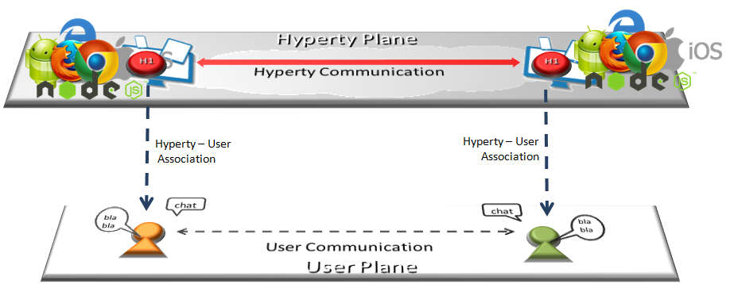

Introduction
============

Objectives and Overview
-----------------------

Project reTHINK proposes a radical transformation on how real time
communication services are thought. reTHINK concepts and architecture
represents a significant paradigm change for the communication services
domain. The reTHINK approach enables the fulfilment of real-time
communications requirements that so far have been considered impossible
to achieve: trustful identities, interoperable endpoints, agility of
introducing new services, and fast moving innovation. Previous
Deliverables D2.1 [38] and D2.2 [15] have already started enlightening
the path to reach such objectives. A new web service paradigm, the
so-called Hyperlinked Entities - Hyperties – was introduced to enable a
global network of trustful services executing in web runtime
environment, on end-user devices or edge-network servers. Communication
between Hyperties is based on the protocol-on-the-fly (ProtoFly) concept
that avoids creating or modifying standard network protocols, but
utilizes instead standard APIs. Interoperability between Hyperties and
Support Services (Registry, Catalog, and Identity Management) are
assured by a detailed and extensible data model, combined with the
principle of Hypermedia as the Engine of Application State (HATEOAS) as
defined in D2.2.

This report provides a detailed specification of reTHINK Core Framework
components comprised by the runtime environment where Hyperties are
executed and the messaging nodes used to support messages exchange
between Hyperties. This report complements deliverable D4.1 (Management
and Security features specifications)[109], which specifies reTHINK
Support Services, namely: Policy Management, Governance, Identity
Management, Graph Connector, and Hyperty Directory services (Catalogue
and Registry). Thus, and according to reTHINK Architecture [38], the
scope of this report includes the specification of the Messaging Node
providing reTHINK Messaging Services and the specification of the
Hyperty Runtime that will be included in User Devices and Application
Servers to deliver User Hyperties and Network Side Hyperties (See Figure
1).


It should be noted that the Network Platform specification supporting
Specialised Network Services will be reported later in D3.4, as
originally planned.

The reTHINK Core Framework specification provided in this report, is
compliant with reTHINK Data Model, Hyperty Management interfaces, Stream
Interface and Messaging Interface designed in D2.2 [15]. It should be
noted that, according to Protocol On-the-fly concept, the Messaging
Interface is defined by the Message Model defined in [15].

Besides the Architecture requirements reported in D2.1 [38] additional
specific requirements to Core Framework functionalities were analysed.

The specification of the Hyperty Runtime and the Messaging Node is
sustained by a very comprehensive work in terms of state of the art
research and procurement of existing open source that will be used to
demonstrate the feasibility of the radical reTHINK concepts.

An exhaustive study of relevant IETF, W3C standards and others that
facilitate the fulfillment of previously analysed requirements, is
reported. Special attention was given to the research on security in Web
Runtime. In parallel, existing open source solutions to be used to
develop Hyperty Runtime and Messaging Nodes was researched, experimented
and selected.

Three solutions to implement the Messaging Node were selected, in order
to evaluate in reTHINK testbeds, interoperability between different
Hyperties domains that use different Message Nodes, namely Vertx,
Node.js and Matrix.

The experimentations performed on JavaScript engines and WebRTC
implementations have shown to be very difficult to extend existing
runtimes like V8 or Chromium to natively support Hyperties runtime. On
the other hand, such approach would also not promote the adoption of
Hyperty Runtime by the end-users since it would demand the installation
of new platforms to replace popular browsers like Chrome or Firefox.
Instead, it was decided to make Hyperty Runtime compliant with existing
runtime solutions notably with existing Web Browsers like Chrome and
JavaScript platforms like Node.js.

The Runtime design enables reuse of most of the core runtime components
through different platforms including Browsers, Standalone Mobile
Application, Network Side Application Servers and more constrained
M2M/IoT standalone devices. The Hyperty Runtime architecture follows a
security by design approach where different types of components are
executed in isolated sandboxes. Communication between different
sandboxes is only possible through a Message Bus and is subject to
access control. Communication with remote Hyperties is provided by
protocol stubs executed in isolated sandboxes.

The design of the Hyperty Runtime APIs is validated with the most
important use cases that were already used in D2.1 and originally
described in D1.1. The Hyperty Runtime procedures were described for
basic procedures (e.g. message routing and Hyperty deployment), Identity
Management Procedures (e.g. registration and login of users) and Human
to Human communication. Although, the Hyperty Runtime is designed to
also support Machine to Machine communication and Human to Machine
communication use cases, its procedures will be fully reported in D3.2.

The Messaging Node Reference Architecture is described to provide some
guidelines for Messaging Node implementation. Thanks to the
protocol-on-the fly concept, a detailed specification of Messaging Node
APIs as provided for the Hyperty Runtime, is not required. Instead, a
more detailed specification is provided for each messaging solution
selected during the procurement activity namely for Vertx.io, Node.js
and Matrix.

The main functionalities to be provided by the Hyperty Service
Framework, which will be used by Hyperty Developers, is provided at the
end. The Hyperty Service Framework is a Software Development Toolkit
(SDK) that will feature a comprehensive set of application program
interfaces (APIs) and JavaScript libraries to facilitate the development
of Hyperties.

The specification reported in this deliverable, provides the basis for
the implementation tasks but it is expected to be adjusted and to be
completed along the implementation phase.

The final specification for Messaging Node and Hyperty Runtime will be
reported in D3.3 (Hyperty Runtime and Hyperty Messaging Node Phase 2 –
Dec 2016).

Structure
---------

This report starts with an introduction and, in Chapter 2, requirements
that are more specific to the reTHINK Core Framework are clearly
identified. In chapter 3 a summary of the State of the Art and
Procurement work is given. The full State of the Art and Procurement
report can be found in Annex A. The core part of this report is located
in Chapter 4, which details the specification of the Hyperty Runtime,
and in Chapter 5, the specification of the Messaging Node. This reports
concludes with a short description of functionalities to be provided by
the Hyperty Service Framework to be used by Hyperty Developers.

Manuals
=======

bla vla

Introduction
------------

### Introduction to the ReThink Framework

*Describe concepts*\
*Big picture with Devices/CSP (including support services + IdPs)*

### My First Service

*Hello World like application A calls B with a communication Hyperty
already provided*\
*Second application with a sensor emulation (Get the room temperature)*

### 

Hyper-linked Entities - Hyperties
---------------------------------

This document, provides an overview about the Hyperty concept and it
should be the starting point for any new developer. After this document,
all developers should also read:

-   the [Hyperty Messaging Framework
    overview](hyperty-messaging-framework.md)
-   the [Reporter - Observer Data Synchronisation
    model](p2p-data-sync.md)

Hyperties are cooperative
[Microservices](http://martinfowler.com/articles/microservices.html)
that are executed in devices on behalf of users through simple but
sophisticated Identity Management techniques. This means, Hyperties are
independently deployable components each one providing a small set of
business capabilities, using the *smart endpoints and dumb pipes*
philosophy i.e. Hyperties don't depend on complex and sophisticated
communication middleware like Enterprise Service BUS (ESB). Instead,
Hyperties rely on a very light but powerful [Messaging
Framework](hyperty-messaging-framework.md) concept).

On the other side, Hyperties follow emerging
[Edge](https://en.wikipedia.org/wiki/Edge_computing) and
[Fog](https://en.wikipedia.org/wiki/Fog_computing) computing paradigms
as opposed to more popular Cloud Computing. This means, when compared
with Cloud Computing, Hyperties promotes a more effective usage of
computing and network resources, decreases communication latency,
improves security and extends scalability.



However, Hyperties can also be executed in Network Servers for specific
Business Capabilities (e.g. Media Servers) or when End-user devices
don't have enough capabilities in terms of computing resources and/or
power.

In addition, Hyperties have some unique characteristics including:

-   Hyperties are programmed in Javascript ECMA5/6, i.e. any existing
    device featuring a Browser or a NodeJS can be used today to execute
    Hyperties without requiring the installation of any new software.
    This means, **billions of devices** are already Hyperty enabled and
    ready to make part of reTHINK ecossystem.
-   The User Identity associated to an Hyperty is decoupled from the
    Hyperty Service Provider. Ie Identity Management is handled under
    the scene and the Developer does not have to care about it and just
    have to focus on the development of Business Capabilities. This also
    means, the end-user has the power to decide which is the Identity to
    be securely associated to a certain Hyperty instance. *put link*
-   Hyperties cooperate and communicate each other via P2P
    Synchronisation of Hyperty JSON Data Objects supported by the novel
    [Reporter - Observer communication pattern](p2p-data-sync.md).


The API to handle the Synchronisation of Hyperty Data Objects is
extremely simple and fun to use. The Developer of the Hyperty Reporter
just has to create the Data Sync object with the Syncher API, and write
on the object every time there is data to be updated and shared with
Hyperty Observers.

``` {.javascript}

    ....

    console.info('---------------- Syncher Create Reporter Hyperty Data ---------------------- \n');
    syncher.create({}, [hypertyURL], {}).then(function(dataObjectReporter) {
      console.info('1. Return Create Data Object Reporter', dataObjectReporter);

    })
      console.info('--------------- END Create Reporter Hyperty Data------------------ \n');
    })
    .catch(function(reason) {
      console.error(reason);
      reject(reason);
    });

    // missing snippet for updates and delete

    ...

```

On the Hyperty Observer side, Data Objects are also created with the
Syncher API and the emerging [Object.observer() Javascript
method](https://developer.mozilla.org/en-US/docs/Web/JavaScript/Reference/Global_Objects/Object/observe)
is used to receive the stream of data changes coming from the Reporter
Hyperty.

``` {.javascript}
  onNotification() {
    console.info('---------------- Syncher Subscribe ---------------- \n');
    syncher.subscribe(objectUrl).then(function(dataObjectObserver) {
      console.info('1. Return Subscribe Data Object Observer', dataObjectObserver);

      // TODO: put source code to add listeners to updates by using Object.observer()


      console.info('------------------------ END ---------------------- \n');
    }).catch(function(reason) {
      console.error(reason);
    });
  }

  ...

  // missing snippet for updates and delete
```

-   Hyperties can easily cooperate with Hyperties from other domains
    with no federation required or the standardisation of Protocols
    thanks to the [Protocol On-the Fly powered Messaging
    Framework](hyperty-messaging-framework.md). Hyperties only have to
    agree on a common json-schema for one or more Hyperty Data Objects,
    in order to be able to cooperate each other.

-   Hyperties can be used on any Application Domain, but they are
    specially suitable for Real Time Communication Apps (eg Video
    Conference and Chat) as well as IoT Apps.

Hyperty Messaging Framework powered by Protofly (Adhoc MOM)
-----------------------------------------------------------

This document gives an overview on the Messaging Framework (*note to be
removed: I guess Messaging Framework is a more friendly term for web
developers than Messaging Middleware*) technical solution used to
support Hyperty's interaction through the higher level [Data
Synchronisation Reporter - Observer communication
mechanism](p2p-data-sync.md). Details about how to develop Hyperties is
provided in [this](development-of-hyperties.md) document.

Hyperties cooperate each other with a Resource Oriented Messaging model
implemented by a simple Messaging Framework. The Hyperty Messaging
Framework, supports different messaging patterns including
publish/subscribe and request/response messaging patterns. The higher
level [Reporter - Observer communication pattern](p2p-data-sync.md)
works on top of these basic messaging patterns. It should be noted, that
[Hyperty Service Development Framework](development-of-hyperties.md) to
be used to create new Hyperties, abstracts Developers from the Hyperty
Messaging Framework (*note to be removed: too many Frameworks?*)
described in this document including lower level Hyperty Messaging APIs.

The Message delivery is based on a simple message Router functionality
that performs a lookup for listeners registered to receive the Message
(the ["Message.to" Header
field](https://github.com/reTHINK-project/dev-service-framework/blob/develop/docs/datamodel/message/readme.md#to)
is the only information looked up for). The Message is posted to all
found listeners, which can be other Routers or end-points (Hyperties).
Thus, the Hyperty Messaging Framework is comprised by a network of
Routers where each Router only knows adjacent registered Routers or
end-points.


Listeners are programmaticaly registered and unregistered by Routing
Management functionalities, which decide the listeners to be added
according to a higher level view of the Routing Network.


The Messaging Framework works at three layers:

At the Runtime Sandbox level where Hyperties are executing, message
delivery is provided by the [MiniBUS
component](https://github.com/reTHINK-project/dev-runtime-core/blob/master/src/bus/MiniBus.js).

At the Runtime level where Sandboxes are hosted (e.g. in a Browser or in
a NodeJS instance), message delivery is provided by the [Message BUS
component](https://github.com/reTHINK-project/dev-runtime-core/blob/master/src/bus/MessageBus.js),
which is an extension of the MiniBUS.

At Domain Level, message delivery is provided by the Message Node
functionality by using the [Protofly
mechanism](#protocol-on-the-fly-protofly-and-protostubs), i.e.
communication between Message BUS and Message Nodes and among Message
Nodes are protocol agnostic. This also means that the Message Node can
be provided by any Messaging solution as soon as there is a [Protostub
available](#protocol-on-the-fly-protofly-and-protostubs). Currently, a
[Vertx Message
Node](https://github.com/reTHINK-project/dev-msg-node-vertx), a [Matrix
Message Node](https://github.com/reTHINK-project/dev-msg-node-matrix)
and a [NodeJS Message
Node](https://github.com/reTHINK-project/dev-msg-node-nodejs) are
provided. Details about how to develop a new Message Node and associated
Protostub is provided in
[this](development-of-protostubs-and-msg-nodes.md) document.

It is also possible to have P2P communication between Message BUS from
different Hyperty Runtime without using any Message Node server (planned
for phase 2). P2P Communication between Message BUS will also be based
on the protofly mechanism.


At runtime level (MessageBUS and MiniBUS), it is used a standard CRUD
based [JSON Message Model](../datamodel/message/readme.md), which is
easily mapped into Restfull APIs.

### Protocol on-the-fly (protofly) and Protostubs

Protocol on-the-fly leverages the code on-demand support by Web runtimes
(eg Javascript), to dynamically select, load and instantiate the most
appropriate protocol stack during run-time. Such characteristic enables
protocols to be selected at run-time and not at design time, enabling
protocol interoperability among distributed services, promoting loosely
coupled service architectures, optimising resources spent by avoiding
the need to have Protocol Gateways in service's middleware as well as
minimising standardisation efforts. The implementation of the protocol
stack, e.g. in a javascript file, that is dynamically loaded and
instantiated in run-time is called **Protostub:**. For security reasons,
Protostubs are executed in isolated sandboxes and are only reachable
through the Runtime MessageBUS and the Protostub Sandbox MiniBUS. A
detailed description on how to deploy a protostub is provided **here**.

*do we need a more detailed description?*


### Message Delivery between different Hyperty Runtimes

Communication between the Message BUS and Message Nodes are provided by
a Protostub that implements the protocol stack used to interact with the
Message Node e.g. JSON over Websockets or a Restfull API Client.
Listeners of protostubs are registered in the MessageBUS for a set of
Message recipient addresses, usually a Hyperty Domain like
`domain://example.com`.

When the MessageBUS is processing a new message and looking up routing
paths for an address that is not local (eg
`hyperty://example.com/alice-hyperty`), it won't find any registered
listeners. In this case, the MessageBUS will ask the Runtime Registry
(*point link here*) to resolve the "Message.to" header field, which will
look for registered Protostubs that are able to deliver messages to such
non-local address. If successful, the Registry will return the Hyperty
Runtime protostub address and the MessageBUS will look up again for the
protostub listener registered for its address.

P2P Data Synchronisation: Reporter - Observer Model
---------------------------------------------------

This document gives an overview on how Hyperties cooperate each other
through a Data Synchronisation model called Reporter - Observer. Details
about how to develop Hyperties based on this model is provided in
[this](development-of-hyperties.md) document.

The usage of Data synchronisation models in [Web
Frameworks](https://www.meteor.com/ddp) looks very promising and is
becoming very popular. The usage of the emerging
[object.observe](https://developer.mozilla.org/pt-PT/docs/Web/JavaScript/Reference/Global_Objects/Object/observe)
javascript API is making it even more appealing. However, current
solutions require server-side databases that has an impact on
performance and scalability.

Hyperty Reporter - Observer communication pattern goes beyond current
solutions by using a P2P Synchronisation solution for JSON Data Objects,
here called Hyperty Data Object or Sync Data Object. To avoid
concurrency inconsistencies among peers, only one peer has granted
writing permissions in the Hyperty Data Object - the **Reporter
hyperty** - and all the other Hyperty instances only have permissions to
read the Hyperty Data Object - the **Observer hyperty**.


The API to handle Hyperty Data Objects is extremely simple and fun to
use. The Developer of the Hyperty Reporter just has to create the Data
Sync object with the Syncher API, and write on the object every time
there is data to be updated and shared with Hyperty Observers.

``` {.javascript}

    ....

    console.info('---------------- Syncher Create Reporter Hyperty Data ---------------------- \n');
    syncher.create({}, [hypertyURL], {}).then(function(dataObjectReporter) {
      console.info('1. Return Create Data Object Reporter', dataObjectReporter);

    })
      console.info('--------------- END Create Reporter Hyperty Data------------------ \n');
    })
    .catch(function(reason) {
      console.error(reason);
      reject(reason);
    });

    // missing snippet for updates and delete

    ...

```

On the Hyperty Observer side, Data Objects are also created with the
Syncher API and the emerging [Object.observer() Javascript
method](https://developer.mozilla.org/en-US/docs/Web/JavaScript/Reference/Global_Objects/Object/observe)
is used to receive the stream of data changes coming from the Reporter
Hyperty.

``` {.javascript}
  onNotification() {
    console.info('---------------- Syncher Subscribe ---------------- \n');
    syncher.subscribe(objectUrl).then(function(dataObjectObserver) {
      console.info('1. Return Subscribe Data Object Observer', dataObjectObserver);

      // TODO: put source code to add listeners to updates by using Object.observer()


      console.info('------------------------ END ---------------------- \n');
    }).catch(function(reason) {
      console.error(reason);
    });
  }

  ...

  // missing snippet for updates and delete
```

### Hyperty Data Object URL address

The Hyperty Messaging Framework allocates to each new created Hyperty
Data Object a Global Unique Identifier URL that is independent from the
Hyperty instance creator and from the Hyperty Runtime, in order to
support mobility of the Data Object between different Hyperty Runtimes
and also to support delegation of the Reporter role to other Hyperty
instances. However, at this point Reporter delegation is only supported
between Hyperty instances from the same domain.

### Hyperty Data Object Schema

Each Hyperty Data Object is formally described by a json-schema that is
identified by a Catalogue URL. This allows to check whether two
different Hyperties are compliant by cross checking each supported
Hyperty Data Object schema. At this point the following Hyperty Data
Object schemas are defined:

-   **[Connection Data Schema](../datamodel/connection)** : Hyperties
    supporting this schema are able to handle [WebRTC Peer
    Connections](https://developer.mozilla.org/en-US/docs/Web/Guide/API/WebRTC/Peer-to-peer_communications_with_WebRTC)
    between the Hyperty Runtime instances where they are running
    independently of the signalling protocol used. The URL Scheme for
    Connection Data Objects is "connection" (example:
    "connection://example.com/alice/bob201601290617").
-   **[Communication Data Schema](../datamodel/communication)** :
    Hyperties supporting this schema are able to handle different
    communication types including Textual Chat, Audio, Video, Screen
    Sharing and File sharing. Such communication can be supported on top
    of WebRTC protocol streams by using the Connection Data Schema. The
    URL Scheme for Communication Data Objects is "comm" (example:
    "comm://example.com/group-chat/rethink201601290617").
-   **[Context Data Schema](../datamodel/context)** : Hyperties
    supporting this schema are able to produce or consume Context Data,
    usually collected from sensors. The URL Scheme for Communication
    Data Objects is "ctxt" (example:
    "ctxt://example.com/room/temperature201601290617").

### Parent - Children Resources

In order to allow use cases like Group Chat where all involved Hyperties
are able to write in the Sync Data Object, the Parent - Child Data Sync
Objects is introduced.

A Data Object Child belongs to a Data Object Parent children resource
and can be created by any Observer of the Data Object Parent as well as
by its Reporter. The Reporter - Observer rules still apply to Data
Object Child i.e. there is only one Reporter that can update the Data
Object Child, which can be an Observer of the Data Object Parent, as
mentioned earlier.


The creation, update and delete of an Data Object Child is performed in
the Data Object Parent itself:

`*Data Object Child creation, update and delete code snippet*`

All other Hyperties observing or reporting the Data Object Parent, will
be notified every time a new Data Object Child is created, updated or
deleted:

`*Data Object Child creation, update and delete notification code snippet*`

At this point, Data Object Child can't also be a Data Object Parent of
another Sync Data Object, i.e. Hyperty Data Object composition is
limited to one level.

### Syncher and Sync Manager

This section, gives an overview on how the Hyperty Data Object
synchronisation transparently works on top of the [Hyperty Messaging
Middleware](hyperty-messaging-middleware.md). However, Hyperty
developers don't have to know the technical details of this solution and
can directly move to the [Hyperty Development
Manual](development-of-hyperties.md).

The Hyperty Data Object synchronisation is provided by two components in
the Runtime:

The
[Syncher](https://github.com/reTHINK-project/dev-service-framework/blob/master/src/syncher/Syncher.js)
is a singleton Component co-located with the Hyperty Instance, which is
in charge of handling all required procedures to manage data
synchronisation at the Hyperty instance side, as a Reporter or a
Observer Hyperty.

The [Runtime Sync
Manager](https://github.com/reTHINK-project/dev-service-framework/blob/master/src/syncher/Syncher.js)
is a Core Runtime Component, which is in charge of handling
authorisation requests to create Sync Data Objects from Hyperty
Reporters and subscription requests to Sync Data Objects from Hyperty
Observers. As soon as authorisation is granted the Sync Manager handles
all required MessageBUS listeners in order to setup the Data Sync Stream
routing path among Reporters and Observers. I.e., the Runtime Sync
Manager provides a [Messaging
Middleware](hyperty-messaging-middleware.md) Routing Manager
functionality.

The [Message Node Sync
Manager](https://github.com/reTHINK-project/dev-service-framework/blob/master/src/syncher/Syncher.js)
is a Message Node functionality, which is in charge of handling requests
from Runtime Sync Managers in order to setup the Data Sync Stream
routing path between the Reporter Hyperty Runtime and Observers Hyperty
Runtimes. I.e., the Message Node Sync Manager also provides a [Messaging
Middleware](hyperty-messaging-middleware.md) Routing Manager
functionality..


A detailed description of the Hyperty Data Synchronisation procedures
are provided
[here](https://github.com/reTHINK-project/core-framework/blob/master/docs/specs/runtime/dynamic-view/data-sync/readme.md)

Hyperty Trust and Security Model
--------------------------------

This document gives an overview on the Hyperty Trust Model as well as on
Hyperty Sandbox runtime execution environment.

It should be noted, that [Hyperty Service Development
Framework](development-of-hyperties.md) to be used to create new
Hyperties, abstracts Developers from the Hyperty Trust and Security
Model described in this document including lower level Identity
Management APIs. Details about how to develop Hyperties is provided in
[this](development-of-hyperties.md) document.

Hyperties are securely associated to User Identities selected by the
end-user himself. Hyperty Users are human beings (including group of
human beings e.g. corporation) or things (including group of things and
physical spaces e.g. a smart home or smart building).

Hyperty Trust Model extends [WebRTC Identity
model](https://w3c.github.io/webrtc-pc/#sec.identity-proxy) where
Identity tokens are generated, inserted in intercepted Messages sent by
Hyperties and validated by recipient Hyperty Runtimes before delivered
to the target Identity. These identity management procedures are
performed according to applicable policies managed by the end-user.


### User Identity

### Identity Module and IdP Proxy

*picture illustrating usage of IDP proxy as a special protostub in the
Messaging Framework*

### Runtime Sandbox

Hyperty Development
-------------------

**Introduce the Criteria to use or not to use Hyperties, the APIs to be
used and code snippets**

### Criteria do use the Hyperty Concept

### APIs

### Examples

Application Development
-----------------------

\*\*An Overview of the Application vs Hyperty and an How To with some
examples \*\*

### Application vs Hyperty

### How to use Hyperties

### How to adapt existing Applications

Message Node and Protostubs Development
---------------------------------------

**Introduce an Overview of the Messaging Architecture, the Protocol on
the fly Concept, the Message Model, Protostub APIs, Message Node
functionalities and main Procedures**

### Overview

### Protocol on-the-fly

### Messaging Model

### APIs

### Message Node functionalities

### Messaging Procedures

### Protostub Source Code Examples

Specification
=============

bla vla

Hyperty Runtime Specification
-----------------------------

This Chapter contains the detailed specification of the Hyperty Runtime,
where Hyperties are executed. It describes in detail the Hyperty Runtime
architecture and the Core Runtime components required to support the
execution of Hyperties. The Hyperty Runtime architecture follows a
security by design approach since it was highly influenced by a careful
security analysis also included in this chapter.

The APIs to be implemented by the Runtime components are specified in
detail and they provide functionalities that were identified in an
iterative approach. In such iterative approach, the design of the static
view of the runtime APIs progressed along the design of the main
procedures to be performed by the Hyperty Runtime.

The Runtime Main procedures are also described in detail in this chapter
using UML Message Sequence Charts. They correspond to the dynamic view
of the Hyperty Runtime and they validate the static design for the most
important use cases that were already used in WP2 and originally
described in WP1.

Four main types of Runtime procedures are described:

1.  Basic Runtime procedures are in general performed independently of
    the Hyperty or Protocol Stub executed in the runtime including
    procedures for the deployment of protocol stubs and Hyperties,
    procedures performed to route messages among Hyperties and
    procedures to setup a Reporter-Observer data object synchronisation
    communication.
2.  Identity Management Runtime procedures are the procedures performed
    to register and log in users in the domain, as well as procedures
    performed to associate identities to Hyperties and asserts user
    identities.
3.  Runtime Procedures to support Human to Human Communication with
    special focus on the validation of the Reporter-Observer
    communication pattern to WebRTC.

It should be noted that the description of the main procedures also
include the detailed definition of messages exchanged among Hyperties
and protocol stubs, as defined in D2.2 Message Model, when appropriate.

At the end, some implementation considerations are presented for the
different types of runtime platforms that are the target of this
specification namely the browser runtime, standalone runtime
applications and M2M devices with more constrained capabilities. These
considerations are mainly about the implementation of the runtime
sandboxing solution since all core runtime components will be shared
among all platforms.

Runtime Architecture
--------------------

The main Hyperty Runtime architecture is comprised by different types of
components that, for security reasons, are executed in isolated
sandboxes. Thus, components downloaded from a specific Service Provider
(e.g. Service Provider 1) are executed in sandboxes that are different
from the sandboxes used to execute components downloaded from another
service provider (e.g. Service Provider 2). In addition, for the same
Service Provider, and also for security reasons, protocol stubs and
Hyperties are isolated from each other and executed in different
sandboxes. Communication between components running in different
sandboxes is only possible through messages exchanged through a Message
Bus functionality provided by the Core Sandbox. On the other hand, the
Protocol Stub provides the bridge for the Hyperty Runtime to communicate
with associated Service Provider. For example, in Figure below,
protostub1 is the only way that Hyperty instances have to communicate
with Service Provider 1. In general, in the Core Sandbox, all required
functionalities to support the deployment, execution and maintenance of
components downloaded from service providers, are executed. Core
components are, ideally, natively part of the device runtime. However,
to support existing platforms including Browsers and Mobile Operating
Systems, to minimise the need to install new applications, the existing
device native runtime functionalities (e.g. JavaScript engine) are
distinguished from the Hyperty Core Runtime functionalities. In such
situations, the Hyperty Core Runtime components are downloaded from the
Hyperty Runtime Service Provider and are executed in an isolated core
sandbox.


The Application and the Hyperty can be delivered by the same Service
Provider or by different Service Providers, i.e. Hyperty is delivered by
an (Hyperty) Service Provider and the Application is delivered by an
Application Service Provider. These two different situations impacts the
level of trust between the Application and the Hyperty, that should be
handled by the Hyperty Runtime accordingly.

In Figure above, the Application and the Hyperty Instances it consumes,
are downloaded from the same Service Provider. Thus, it is assumed they
trust each other and that they can be executed in the same sandbox with
no impact on how the Application consumes the Hyperty Application API.
In Figure below, it is depicted the Runtime Architecture where the
Application and the Hyperty Instances it consumes, don't trust each
other, for example, they are downloaded from different service
providers. In such situation, Hyperties and the Application are isolated
from each other and they are executed in different sandboxes. In this
case, the Hyperty Application API is no longer local and the application
is only able to reach the Hyperty Instance through the Message BUS. It
is desirable to abstract the Application developer from these situations
and to let the Application developer call the Hyperty Application API as
if they are always local. This implies that the Core Runtime and the
Sandbox implementation, is able to support a Remote Procedure Call (RPC)
communication when the Application and the Hyperty Instance are in
different sandboxes.


As described below, to prevent cross origin attacks / spy, access to
Core Runtime Message BUS is subject to authorisation, by using
standardised policies downloaded from each involved Service Provider. In
addition, the Hyperty Runtime Architecture also supports Hyperty
Interceptors executed in a dedicated sandbox (see Figure below) enabling
the enforcement of proprietary policies.


In addition, Core Policy Engine should enforce general access control
policies that are agnostic of sender and target domains, or specific to
the domain managing the device runtime (Core Runtime Provider). The
policies used to control the access to [Hyperty Data
Objects](https://github.com/reTHINK-project/dev-service-framework/blob/master/docs/manuals/p2p-data-sync.md)
(see below) , are a good example of such policies.

Some more details are provided in the following sections.

### Service Provider Sandboxes

#### Hyperty

As [previously defined,
Hyperties](https://github.com/reTHINK-project/dev-service-framework/blob/master/docs/manuals/hyperty.md)
cooperate each other via P2P Synchronisation of Hyperty JSON Data
Objects supported by the novel [Reporter - Observer communication
pattern](https://github.com/reTHINK-project/dev-service-framework/blob/master/docs/manuals/p2p-data-sync.md)
and on top of the [Hyperty Messaging
Framework](https://github.com/reTHINK-project/dev-service-framework/blob/develop/docs/manuals/hyperty-messaging-framework.md).

#### Hyperty Interceptor

Hyperty Interceptor complements the Core Policy Engine functionality
enabling the enforcement of proprietary or closed Policies in the
Hyperty Runtime for a specific Hyperty instance.

#### Protocol Stub

The Protocol Stub implements a protocol stack to be used to communicate
with the Service Provider's backend servers (including Messaging Server
or other functionalities like IdM) according to [Protocol on the
Fly](https://github.com/reTHINK-project/dev-service-framework/blob/develop/docs/manuals/hyperty-messaging-framework.md#protocol-on-the-fly-protofly-and-protostubs)
concept.

Protocol stubs are only reachable through the Message BUS. In this way
it is ensured that all messages received and sent goes through the
message bus where policies can be enforced and additional data can be
added or changed including identity tokens.

### Core Runtime

The Core Runtime components are depicted in Figure below.


Runtime Core components should be as much as possible independent on the
Runtime type. They should be deployed once and executed at the
background. The next time the runtime is started there should be no need
to download the core runtime again unless there is a new version.
Runtime core components instances should be shared by different Apps and
Hyperty instances.

The Core Runtime is provided by a specific Service Provider (the Core
Runtime Service Provider) that handles a Catalogue service to with
Runtime Descriptors and a Registry service to handle the registration of
Runtime instances.

#### Message BUS

The Message Bus Supports local message communication in a loosely
coupled manner between Service Provider sandboxes including Hyperty
Instances, Protocol Stubs and Policy Enforcers. Messages are routed to
listeners previously added by the Runtime User Agent, to valid Runtime
URL addresses handled by the Runtime Registry functionality.

Access to Message Bus is subject to authorisation to prevent cross
origin attacks / spy from malicious downloaded code including Hyperties,
Protocol Stubs or Policy Enforcers.

#### Core Policy Engine

The Core Policy Engine provides Policy decision and Policy Enforcement
functionalities for incoming and outgoing messages from / to Service
Provider sandboxes, according to Policies downloaded and stored locally
when associated Hyperties are deployed by the Runtime User Agent. It
also provides authorisation / access control to the Message BUS.

The verification or generation of identity assertions, to get valid
Access tokens, are two examples of actions ruled by policies.

#### Runtime Registry

The Runtime Registry handles the registration of all available runtime
components including Core components, Service Provider Sandboxes and
each component executing in each sandbox like Hyperty Instances,
Protocol Stubs, Hyperty Inteceptors and Applications.

The Runtime Registry handles the allocation of Runtime URL addresses for
all these components and manages its status.

In addition, the Runtime Registry ensures synchronisation with Back-end
Service Provider's Domain Registry.

The Runtime Registry must have listeners to receive messages at:

    hyperty-runtime://<runtime-instance-identifier>/registry

#### Identity Module

The Runtime Identity Module manages ID and Access Tokens required to
trustfully manage Hyperty Instances communication including trustful
association between Hyperty Instances with Users. In addition, it also
supports the generation and validation of Identity assertions. Identity
module is an extension of [WebRTC
Identity](http://w3c.github.io/WebRTC-pc/#identity) and interacts with
Identity Providers via IDP Proxy protostubs.

Messages routed by Message Bus should be signed with a token according
to the Identity associated to it and managed by the Identity Module.

The Runtime Identity Module must have listeners to receive messages at:

    hyperty-runtime://<runtime-instance-identifier>/idm

#### Runtime User Agent

The Runtime User Agent, manages Core Sandbox components including its
download, deployment and update from Core Runtime Provider. It also
handles Device bootstrap and the deployment and update of Service
Provider sandboxes including Hyperties, Protocol Stubs and Policy
Enforcers, via the Runtime Catalogue.

#### Runtime Catalogue

The Runtime Catalogue manages the descriptors of deployable components
and Hyperty Data Object schemas that are downloaded from the Service
Provider Catalogue via the [Catalogue Service
interface](https://github.com/reTHINK-project/architecture/blob/master/docs/interface-design/Interface-Design.md#73-catalogue-interface).
The Runtime Catalogue ensures synchronisation with Back-end Catalogue
servers.

The Runtime Catalogue must have listeners to receive messages at:

    hyperty-runtime://<runtime-instance-identifier>/catalogue

#### Persistence Manager

The Persistence Manager provides data storage functionalities (write and
read) to Core Runtime Components including Runtime Catalogue, Runtime
Registry, Policy Engine and Graph Connector.

#### Sync Manager

The Sync Manager is in charge of handling authorisation requests to
create Sync Data Objects and subscription requests to Sync Data Objects.
As soon as authorisation is granted the Sync Manager handles all
required MessageBUS listeners in order to setup the Data Sync Stream
routing path among Hyperties. The Sync Manager must have listeners to
receive messages at:

    hyperty-runtime://<runtime-instance-identifier>/sm

#### QoS User Agent

The QoS User Agent Manages network QoS in the runtime. This component
requires further investigations which will be reported later.

#### Graph Connector

The Graph Connector is a local address book maintaining a list of
trustful communication users. This functionality is further detailed in
deliverable D4.2.

The Graph Connector must have listeners to receive messages at:

    hyperty-runtime://<runtime-instance-identifier>/graph

### Native Runtime

The Native Runtime provides Functionalities that are natively provided
by the runtime, e.g. JavaScript engine or WebRTC Media Engine to support
for Stream communication between Hyperties according to WebRTC Standards
when available.

Security analysis of the Hyperty Runtime
----------------------------------------

### Introduction

This section presents the security analysis of the [Hyperty Runtime
architecture](https://github.com/reTHINK-project/core-framework/blob/master/docs/specs/runtime/runtime-architecture.md).

The Hyperty Runtime depends on a trusted computing base (TCB) that
consists of several components: the Core Sandbox, the Native Runtime,
and underlying Operating System and hardware. Subverting the Core
Sandbox components may result in (1) incorrect decision and enforcement
of policies by the PDP, (2) failure in routing messages through the
Message Bus, (3) flawed registration and discovery of Hyperty and
ProtoStubs by the Registry, and (4) incorrect maintenance of identities
by the Identities Container. If the Native Runtime is compromised, so it
will be the support for WebRTC stream communication between Hyperties.
Since the Native Runtime implements the JavaScript engine (e.g., V8
[21]), tampering with the Native Runtime will undermine the execution of
components implemented in JavaScript code, namely the components of the
Core Sandbox (i.e., Policy Engine, Message Bus, Registry, Identities
Container, and WebRTC engine) and client code instances (i.e., Hyperty
Instances, ProtoStubs, Service Provider Policy Enforcers (SPPEs), and
Applications). Lastly, compromising the Operating System or the hardware
may result in incorrect behaviour of any of their overlying components,
in particular the Native Runtime.

Next, we analyse the security properties of our system assuming that the
trusted computing base is intact. Then, we assess the security
vulnerabilities of the Hyperty Runtime when deployed on platforms
featuring specific software and hardware configuration. In particular,
we explore three platform configurations: *browser*, *standalone*, and
*M2M standalone application*. We analyze each target platform under its
specific threat model.

### Mitigated threats assuming an intact TCB

When the TCB is intact, our architecture ensures the correct isolation
of client JavaScript code (i.e., Hyperties, ProtoStubs, SPPEs, and
Applications). Isolation is enforced both between different client code
instances and between client code instances and the environment (e.g.,
external applications, or OS resources). The Hyperty Runtime enforces
access control decisions based on policy rules attached to Hyperty code.
Such policies can regulate different aspects of the behaviour of a
Hyperty: access to local resources (e.g., cookies, files, network, etc),
routing, charging, and privacy restrictions. The system also ensures the
authenticity of client code and the identity of the involved entities.

In the basic threat model, we assume that an attacker can serve
arbitrary client code to the Hyperty Runtime. The attacker can
impersonate a legitimate service provider and deliver malicious
ProtoStub, Hyperty, or SPPE code. When instantiated on the Hyperty
Runtime, this code may attempt to execute JavaScript instructions in
order to access private data held (1) by other client code (including
applications’), (2) by the Hyperty Runtime TCB, or (3) by the
surrounding environment (e.g., the JavaScript Engine, or the Operating
System). Malicious code may also aim to tamper with security-critical
components, such as Hyperty policies or the policy enforcement engine,
in order to escalate privileges. Finally, malicious code may launch
denial of service attacks (e.g., by executing CPU intensive code). Below
in this document, we expand on this threat model to consider potential
vulnerabilities of our system when deployed on different environments.
Next, we describe how our system defends against several classes of
potential attacks.

#### T1: Unauthorized access by client code

The basic mechanism of our architecture to prevent unauthorized access
by client code is sandboxing. Each Hyperty instance running in the
system runs in its own sandbox. A sandbox defines a security perimeter
for the Hyperty instance, preventing it from reading or writing the
memory (or other resources) allocated to other Hyperty instances or by
other components in the surrounding environment. An independent sandbox
hosts the ProtoStub instance required by local Hyperty instances to
communicate with external services. This sandbox will prevent
potentially malicious ProtoSub code from unauthorized access to
resources. To communicate outside the sandboxes, the runtime provides
well defined interfaces: the Syncher, which is used by the Hyperty
instance to communicate with the SPPE, and an API to communicate with
the Message Bus. The SPPE and the PEE are responsible for enforcing the
policy associated with the Hyperty instance.

The origin of the client code is validated. An origin is a combination
of URI scheme, hostname, and port number. The origin can be asserted
using certificates (e.g. using TLS) thus we only allow client code from
secure origin.

Client code is subject to Same Origin Policy for direct interactions
between client code instances. However, this can be relaxed using Cross
Origin Resource Sharing (CORS) policy declarations. Pieces of client
code from different origins can still communicate without CORS using the
Message Bus API. Message exchange must be identified by the origin of
senders and recipients. Subscription to messaging channels (where
multiple client codes could publish messages) must be subject to
authorization.

Note that, in our architecture, sandboxing is also used to secure the
components of the Hyperty Runtime that are implemented in JavaScript,
namely the components allocated in the Core Sandbox. The JavaScript
engine implements both the client code sandboxes and the Core Sandbox.

#### T2: Policy subversion

Every Hyperty instance is constrained by a policy. A policy defines a
set of rules, which can be of several types: access control rules,
routing rules, charging usage rules, and privacy rules. Altogether,
policy's rules are responsible for regulating, supervising, or
restricting the operations that a Hyperty can perform, e.g., prevent
access to a local file, enforce a predefined network route, or define
the usage costs of a service. To prevent a malicious Hyperty instance
(or ProtoSub) from subverting policy rules and escalate its privileges,
the policy decision components and the policy repository are protected
from the Hyperty instance by the Core Sandbox. As a result, policy
integrity and enforcement are safe from malicious client code.

#### T3: Threats to client code authenticity

The authenticity of client code -- Application, Hyperty, ProtoStub, or
SPPE -- can be compromised if at least one of two events has occurred
without being detected before the code is loaded and instantiated into a
sandbox: an attacker has modified the original code bytes (e.g., by
embedding malware into a Hyperty code), or (ii) has modified the code
identity. To prevent such attacks, client code's origin must be
digitally signed and transmitted over a secure channel. Additionally the
client code may be signed by its manufacturer. By checking these
signatures before instantiating the Hyperty, ProtoStub, or SPPE code on
the sandboxes and assuming that the cryptographic primitives are
correctly implemented, the Hyperty Runtime can guarantee the integrity
and identity of the code.

#### T4: Denial of service attacks

A malicious Hyperty instance, ProtoStub, or SPEE implementation can
launch denial of service attacks by holding to specific resources, e.g.,
hogging the CPU by sitting on an infinite loop, or flooding the network
with bogus messages. The JavaScript engine featuring the Hyperty Runtime
prevents such attacks by placing a limit to the maximum utilization of a
given service by a client code instance, for example by bounding the CPU
cycles that a Hyperty instance is allowed to execute uninterrupted.

### Vulnerability assessment of the Hyperty Runtime

The Hyperty Runtime can effectively thwart the threats described in the
previous section so long as the system's TCB remains intact. However,
when deployed on a specific platform, the Hyperty Runtime may become
vulnerable to some environment-specific security risks. In this section,
we study the potential vulnerabilities of the TCB when deployed on three
different platforms. But first, we describe our methodology to ensure a
uniform vulnerability assessment of our system across platforms.

#### Methodology

Our basic methodology is based on a *vulnerability matrix*. A
vulnerability matrix indicates representative practical attacks that can
be carried out against the TCB on a given platform as a mean to
compromising the security of the Hyperty Runtime. An attack is
successful by achieving one or more goals described in the section
above: permit unauthorized access by client code (T1), subvert Hyperty
policies (T2), compromise the authenticity of client code (T3), and
launch denial of service attacks (T4). We classify the attacks to the
TCB along two dimensions: (1) the layer of the computer stack where the
attack is directed to (e.g., the operating system), and (2) the
difficulty level of the attack based on the technical skills and
resources required by the adversary.


The figure above provides an example of a vulnerability matrix for a
dummy platform. The content of each cell describes examples of attacks
that can be launched to the TCB, e.g., "A1: inspection of JavaScript
code through the browser", "A7: probing the system bus". Columns
represent the difficulty level and rows the attack layer (both of them
will be explained below). Intuitively, the vulnerability matrix allow us
to grasp how exposed the TCB is to attacks: the lower the difficulty
degree of the attacks is the more vulnerable the Hyperty Runtime will be
when deployed on a particular target platform. Next, we describe the
classification for attack layers and difficulty levels:

**Attack layers.** Attack layers can be classified in five types,
ordered top-down, from the highest to the lowest layer of the computer
stack, as shown in the figure below:


-   *Sandbox level (L1)*: The attacker has direct access to the sandbox
    environment, hence to the code and execution state of Hyperty
    instances. For example, on a browser platform, users typically have
    access to the JavaScript of a given page. This means that a
    malicious user can leverage that mechanism to tamper with the
    JavaScript code of local Hyperty instances.

-   *Runtime level (L2)*: The attacker has direct access to the code or
    execution state of the Hyperty Runtime. Depending on the specific
    exploit, he can mount attacks that disable defences against the
    attacks described in the previous section. On the browser, for
    example, a L2 attack can be achieved by installing a malicious
    browser extension that bypasses the policy enforcement mechanism of
    the Hyperty Runtime.

-   *Process level (L3)*: The attacker has access to the execution state
    of the process where the Hyperty Runtime is hosted. Just like the L2
    attacks, this type of attack can result in catastrophic
    consequences. Examples of attacks performed at the process level
    include attaching a debugger to the Hyperty Runtime process and
    inspect its internal data structures, or dumping its memory state to
    disk by reading from /dev/mem.

-   *Operating system level (L4)*: The adversary has access to the
    execution state of the operating system, and therefore to the
    execution state of the Hyperty Runtime. Similarly to L2 and L3, L4
    attacks can be catastrophic. An attack performed at this layer, for
    example, installs a rootkit to maintain a log of all operations
    performed by local Hyperty instances.

-   *Hardware level (L5)*: The adversary has physical access to the
    hardware of the platform and can launch simple attacks that do not
    involve tampering with the circuitry. Attacks in this category
    include, removal or inspection of the hard disk, probing the system
    bus in order to extract secrets from volatile memory, etc. An attack
    at this level may also include tampering with the silicon chips,
    perform side-channel attacks, etc. Such attacks require a high-level
    of expertise and committed resources. In theory, attacks performed
    at this level can reveal the entirety of the system state, including
    the operating systems. In practice, however, such attacks are more
    directed towards the extractions of specific secrets when L3 attacks
    or above are not possible.

**Difficulty level.** The difficulty level of an attack depends on
several factors: the privileges owned by the adversary (e.g., user or
superuser), the skills that are required (e.g., know how to run a
debugger or tamper with silicon), and the necessary resources to carry
out the attack (e.g., specific software exploits, memory probes, etc.).
Based on these factors, we define three difficulty levels for a given
attack:

-   *Easy (D1)*: The attack is easy to perform. The tools that are
    necessary to launch the attack are accessible, well documented, and
    simple to handle. Some examples of D0 attacks include: (i) on a
    browser platform, a malicious user leverages the browser interface
    to modify Hyperty code, (ii) on a constrained device, the device
    owner abuses superuser privileges to disable the policy enforcement
    mechanisms of the Hyperty Runtime.

-   *Medium (D2)*: The attack requires considerable skills and / or
    resources. It can be launched by mastering the tools presently
    available in the system (e.g., tools provided by the operating
    system, debuggers) or by installing new ones that can be found on
    the Internet (including malware or exploits). The attacker has
    limited skills or resources to discover new vulnerabilities or to
    develop exploits autonomously. Examples of such attacks include,
    attaching debuggers to extract in-memory secrets from the Hyperty
    Runtime, patch the Hyperty Runtime using exploit code published on
    the Web, etc.

-   *Hard (D3)*: The attack is very sophisticated. To mount the attack,
    the attacker must be able to develop its own exploit code, find new
    vulnerabilities in the system, and / or launch software hardware
    attacks. For example, finding bugs in a device driver’s code and
    write software exploits. The attacks performed at the deep hardware
    level are also considered hard to execute.

When drawing a vulnerability matrix, we define *attacker profiles*,
which define sets of possible attacks that characterize possible attack
agents in that particular platform. For example, for the browser
platform, we define three profiles: regular user, advanced user, and
power user. The regular user captures an average web user, which is able
to launch attacks like "inspection of JavaScript code through the
browser", but not "probing the system bus". We now present our
vulnerability assessment for each of the target platforms.

#### Browser platform

The primary platform targeted by reTHINK is the browser. Browsers can be
highly heterogeneous; we may be talking about desktops, laptops, or
mobile devices featuring many different configurations with respect to:
hardware architecture, operating system in use, installed software, and
specific browser version and extensions. In spite of this diversity, a
Hyperty-enabled browser will tend to follow the general architecture
represented in the figure below.


In this architecture, the Hyperty Runtime (represented by the shaded
components of the Figure) is deployed on an independent browser process.
This process is in fact a "subprocess" of the browser that implements a
sandboxing mechanism of its own (as in the Chrome browser). This
mechanism is responsible for isolating the Hyperty Runtime from the
browser's rendering engine. The JavaScript engine is responsible for the
secure execution of JavaScript code inside individual sandboxes: (1) the
Core Sandbox of the Hyperty Runtime, (2) service provider sandboxes for
hosting Hyperty instances, ProtoStubs and SPPEs, and (3) application
provider sandboxes for executing guest applications. As expected, the
Hyperty Runtime process depends on the operating system, which in turn
depends on the underlying hardware setup. Browser processes run
side-by-side with other standalone application processes and operating
system services.

From the security point of view, the threats to the TCB of the Hyperty
Runtime are mainly caused by an adversarial user. To better characterize
these threats, we define three attacker profiles and draw the
vulnerability matrix as follows:


-   *Regular user*: This attacker profile captures the class of users
    with an average proficiency level in computing, but are willing to
    subvert the security properties of the system's TCB. The user's
    privileges allow for limited operations, such as: launch the
    browser, and run Hyperty-based applications. A regular user is
    expected to mount the following attacks:

    -   *A0*: Access and modify client JavaScript code through the
        browser interface.
-   *Advanced user*: This profile captures users with superuser
    privileges and some degree of skills and knowledge of the system.
    The user is aware of existing tools and techniques that can be
    leveraged to hack into the system's components, has access to
    exploits available on the Internet, and can handle auxiliary tools
    (e.g., debuggers, Unix advanced commands, etc.). The user can
    assemble and disassemble the basic hardware components of the system
    (e.g., plugging in / out the hard disk). For mobile devices, the
    user can root or jailbreak the platform by following instructions.
    Thus, considering this set of skills, in addition to A0, an advanced
    user can perform several other attacks at different stack layers
    such as these:

    -   *A1*: Compromise the runtime by installing a malicious browser
        extension.
    -   *A2*: Dump the memory contents of the process to disk.
    -   *A3*: Install a rootkit on the operating system that keeps track
        of Hyperty instances' communication.
-   *Power user*: This profile corresponds to highly skilled users, who
    have deep knowledge of the system and can launch sophisticated
    attacks. A user is able to investigate unknown vulnerabilities in
    the software (including in the Hyperty Runtime or in the OS) and
    develop specific software exploits. Moreover, the user has enough
    resources and tools to launch hardware attacks that involve
    tampering with silicon. A power user is able to mount not only the
    attacks described previously, but more sophisticated attacks on
    various layers of the stack:

    -   *A4*: Find and exploit a bug in the Hyperty Runtime.
    -   *A5*: Attach a debugger to the browser’s subprocess and inspect
        / modify its memory.
    -   *A6*: Build a device driver to continuously monitor the
        execution of Hyperty Instances.
    -   *A7*: Probe the system bus and extract private key material of
        Hyperty Instances.

**Vulnerability assessment:** As illustrated by the vulnerability
matrix, the browser platform is vulnerable to a range of attacks. Some
of these attacks can be mounted by regular users with relative ease. In
addition, there are several ways for advanced users to successfully
compromise the TCB by exploiting the system at different stack layers.
As a result, we recommend that browser platforms are avoided for hosting
client code which the local user has incentives to subvert. Examples of
such code include: Hyperty instances restricted by specific usage
charging policies, ProtoStubs that encode proprietary communication
protocols, or Applications that access copyrighted digital data.

**Phase 1 implementation:** In the phase 1 implementation, we use native
mechanisms provided by the browser API to ensure that the required
sandboxing properties are satisfied. The core runtime components execute
inside an iFrame. The iFrame implements the core sandbox by isolating
the code of the core runtime from the main window in which the
application javascript code is executed. This isolation mechanism
prevents applications from having direct access to the memory address
space of the core runtime. Communication between application and core
runtime is possible only through a single and well defined entrypoint
which allows them to exchange messages: method postMessage(). Hyperties
and protoStub execute as independent Web Workers. Web Workers
effectively isolate their internal states from each other and from the
core runtime. The postMessage() method constitutes the only
communication bridge between the these components. Based on this
analysis, we conclude that the phase 1 implementation prototype
satisfies the security properties that were specified for the browser
runtime architecture.

#### Standalone platform

A variant of the browser platform is to deploy the Hyperty Runtime as a
standalone application, for example to be executed as a mobile app on
mobile devices such as smartphones or tablets. The Hyperty Runtime can
also be packaged as a classical standalone application for desktop
platforms running Linux or Windows. To allow for the development and
maintenance of such applications, reTHINK will provide an SDK that will
include APIs and platform specific libraries for adapting the Hyperty
Runtime to the underlying operating system platform.


The figure above illustrates a general standalone platform tailored for
Android mobile devices. Just like in the browser platform, the Hyperty
Runtime is wrapped around a host process. The host process is
responsible for (1) mediating the system calls issued by the Hyperty
Runtime to the operating system and (2) providing a user interface to
the Hyperty Runtime and client JavaScript applications (and Hyperties).
In addition to the Hyperty Runtime, the host process application
consists of: a platform-independent adaptation layer, and
platform-specific libraries, e.g., for IO, storage, and memory
management. In the example of the figure, the platform-specific
libraries correspond to the Android API framework.

From the security point of view, standalone and browser platforms are
quite similar; for that reason we adopt the same attacker profiles
(regular user, advanced user, and power user). The main difference
between architectures is twofold. First, the host application will
prevent direct introspection of the JavaScript code running inside
Hyperty Runtime sandboxes. As a result, the application architecture is
able to mitigate simple attacks to the browser (A0 in the browser’s
vulnerability matrix), raising the bar for regular users. Second, the
host application will not support software extensions. This restriction
prevents some advanced attacks to the runtime based on installation of
malicious extension code, and to the browser process (see attacks A1 and
A2, respectively, in the browser's vulnerability matrix). Next, we
present the vulnerability matrix of the standalone platform and provide
alternative attack examples.


-   *Advanced user*: An advanced user can compromise the entire system
    by launching attacks at the OS level:

    -   *A1*: Root the device and instrument the operating system in
        order to introspect Hyperty instances' sandboxes.
-   *Power user*: A power user can mount more sophisticated attacks on
    various layers of the stack:

    -   *A2*: Find and exploit a bug in the Hyperty Runtime.
    -   *A3*: Find a bug in the host application code and exploit it.
    -   *A4*: Monitor the execution of Hyperty Instances by rooting the
        device.
    -   *A5*: Hack the device hardware to extract sensitive Hyperty data
        from memory.

**Vulnerability assessment:** As highlighted by the vulnerability
matrix, an Android-based standalone platform is more robust to attacks
than the browser platform. This is mainly due to the fact the
application architecture allows us to close security holes in the
browser architecture that can hardly be thwarted without modifying the
browser. Nevertheless, it is still possible to for an advanced user to
compromise the system by rooting the device; the need to root the device
will likely deter the regular users. Nevertheless, we recommend prudence
in deploying client code that the local user has high incentives to
subvert.

**Phase 1 implementation:** In the phase 1 implementation, we use
Crosswalk to support standalone applications. Crosswalk is an HTML
application runtime that allows us to execute the hyperty runtime as
native mobile applications in Android and iOS devices without the need
to install a full-blown browser. Mobile applications only need to be
bundled with both Crosswalk webviews and the hyperty runtime code. Since
a Crosswalk webview implements a Chromium-based runtime, it can
seamlessly execute the hyperty runtime code that was implemented for the
browser platform. Therefore, since we reuse the code of the browser
phase 1 implementation, we can conclude that standalone applications
will inherit similar security properties from browser applications.

#### M2M standalone platform

reTHINK also targets M2M communication use cases. For this reason, a
standalone platform is necessary to run the Hyperty Runtime and guest
client code. The targeted devices consist of Raspberry Pi and Beagle
Boards. Such devices adopt an internal architecture very similar to the
standalone platform: they can run Linux or even Android operating
systems. We envision that these devices will run Linux-based operating
systems. Essentially, the main difference between M2M and vanilla
standalone application platform takes place at the implementation level.
Therefore, our security analysis of the standalone platform is
applicable to both instances. As Node.js was chosen as Native Runtime
for the reTHINK M2M standalone application platform, attacks like server
side injection caused by eval function are well known and there are best
practices to avoid and protect the software components against such
attacks. A valuable source of information that will be taken into
account during the implementation is located at
[[108](https://nodesecurity.io/resources)].

Messaging Node Specification
----------------------------

This Chapter contains the functional design of the Messaging Node
Architecture which enables messaging communication among Hyperty
instances running in different Runtime devices.

Since the protocol-on-the fly concept is used together with the message
model defined in D2.2, it is not required to specify in detail the
Messaging Node APIs to guarantee interoperability between different
domains. Instead, a more detailed specification is provided for each
messaging solution selected during the procurement activity namely for
Vertx.io, Node.js and Matrix.

Messaging Node Architecture
---------------------------

The Messaging Node functional architecture is presented in the figure
below and it comprises three main types of functionalities including the
Core Functionalities, Connectors and Protocol Stubs.


### Core Functionalities

#### Message BUS

The Message BUS routes messages to internal Messaging Node components
and external elements by using Connectors or Protocol Stubs. It supports
different communication patterns including publish/subscribe and
Request/response communication.

#### Policy Engine

The Policy Engine provides Policy decision and Policy Enforcement
functionalities at Domain level for incoming and outgoing messages in
cooperation with authentication and authorisation provided by Identity
Management functionalities. It also provides authorisation / access
control to the Message BUS.

#### Session Management

Session Management functionalities are used to control messaging
connections to service provider back-end services. For example, when
user turns-on the device and connects to its domain, providing
credentials as required by Identity Management functionalities. In
general, each message should contain a valid token that is generated
when the client connects to the Messaging Node. It also manages the
registry of protocol stubs and connectors supported by the Messaging
Nodes to support the routing of messages to these components.

#### Address Allocation Management

The Address Allocation Management functionality handles the allocation
of URL addresses to Hyperty Instances and Hyperty Data Objects in
cooperation with Session Management when users connect to the domain.

It also manages the allocation of messaging addresses to foreign Hyperty
Instances i.e. Hyperty Instances that are provided from external domains
but that use the protofly concept to interact with Hyperty Instances
served by this Messaging Node. For example, if the Messaging Node is
implemented by core IMS or a simple SIP Proxy/SIP Registry, it is
required the management of a pool of SIP addresses to be allocated to
clients that have no account in the IMS HSS or in the SIP registry.

Address Allocation Management functionality must have listeners to
receive messages for the following addresses:

    domain://msg-node.<sp-domain>/hyperty-address-allocation
    domain://msg-node.<sp-domain>/object-address-allocation

### Subscription Manager

The Message Node Subscription Manager is in charge of handling
Subscription and Unsubscription requests from Runtime Sync Managers in
order to manage the Data Sync Stream routing path in the Message Node.

The Subscription Manager functionality must have listeners to receive
messages for the following addresses:

    domain://msg-node.<sp-domain>/sm

### Protocol Stub

In special situations e.g. when the download of external software
(protocol stubs) into end-user devices is not allowed, it should be
possible to have interoperability between Messaging Nodes from different
domains, by using the protofly concept.

Thus, a Protocol Stack to be used to communicate with another Messaging
Node can be deployed.

It should be noted that protocol stubs can also be used to implement a
Messaging Node connector, in case it does not exist.

### Connectors

Connectors implements protocol stacks used to interoperate with external
elements from the domains. Connectors can be supported by using protocol
on-the-fly concept, giving more flexibility for the integration of the
Messaging Node in the Service Provider infra-structure.

#### Registry Connector

Registry Connector to interact with remote Registry functionalities. It
must have listeners to receive messages for the following addresses:

    domain://registry.<sp-domain>

#### IdM Connector

IdM Connector interacts with remote Identity Management functionalities.
It must have listeners to receive messages for the following addresses:

    domain://idm.<sp-domain>

#### End-User Device Connector

End-User Device Connector to interact with Hyperty Instances running in
the end-user device

#### Network Server Connector

Network Server Connector to interact with Hyperty Instances running in a
Network Server

Messages Specification
----------------------

This Chapter contains the detailed specification ...

### Address Allocation Messages

The following Messages used to manage URL address allocation are
specified in this doc. Where,

-   `<type>` can be `"hyperty"` or `"object"`
-   `number" : <integer>` is the number of addresses to be allocated
-   `<scheme>` defines the URL scheme to be used in the address
    allocation and depends on requested address allocation `<type>` :
    -   `hyperty` for `"hyperty"` address types
    -   `connection`, `comm` or `ctxt` are valid for `"object"` type
        addresses
-   `"allocationKey" : <key>` a key to be used in a address block
    deallocation request. Any string is valid but it is suggested to use
    something associated with the Runtime Instance URL e.g.
    `hyperty-runtime://<sp-domain>/<runtime-instance-identifier>`

#### Address allocation request

**Message requesting address allocation**

Message sent by the Hyperty Runtime Registry function to Message Node
Address Allocation function.

    "id" : "<1>"
    "type" : "CREATE",
    "from" : "hyperty-runtime://<sp-domain>/<runtime-instance-identifier>/registry/allocation",
    "to" : "domain://msg-node.<sp-domain>/<type>-address-allocation",
    "body" : { "value" : {"number" : <integer> , "scheme" : <scheme>, "allocationKey" : "<key>"} }

**Response Message returning the requested addresses allocation**

Message sent by the Message Node Address Allocation function to Hyperty
Runtime Registry function.

    "id" : "<1>"
    "type" : "RESPONSE",
    "from" : "domain://msg-node.<sp-domain>/<type>-address-allocation",
    "to" : "hyperty-runtime://sp1/runalice/registry/allocation",
    "body" : { "code": 200, "value" : {"allocated": ["<scheme>://<sp-domain>/<identifier>", ...]} }

#### Address deallocation request for one block of addresses

**Message to request address deallocation for one block of addresses**

Message sent by the Hyperty Runtime Registry function to Message Node
Address Allocation function.

    "id" : "<3>"
    "type" : "DELETE",
    "from" : "hyperty-runtime://<sp-domain>/<runtime-instance-identifier>/registry/allocation",
    "to" : "domain://msg-node.<sp-domain>/<type>-address-allocation",
    "body" : { "resource" : "<key>" }

**Response to Message requesting address deallocation for one specific
set of addresses**

Message sent by the Message Node Address Allocation function to Hyperty
Runtime Registry function.

    "id" : "3"
    "type" : "RESPONSE",
    "from" : "domain://msg-node.<sp-domain>/<type>-address-allocation",
    "to" : "hyperty-runtime://sp1/runalice/registry/allocation",
    "body" : { "code": 200 }

#### Address deallocation request for one or more addresses

**Message to request address deallocation for one or more addresses**

Message sent by the Hyperty Runtime Registry function to Message Node
Address Allocation function.

    "id" : "<2>"
    "type" : "DELETE",
    "from" : "hyperty-runtime://<sp-domain>/<runtime-instance-identifier>/registry/allocation",
    "to" : "domain://msg-node.<sp-domain>/<type>-address-allocation",
    "body" : { "childrenResources" : {"["<scheme>://<sp-domain>/<identifier>", ...]} }

**Response to Message requesting address deallocation for one specific
set of addresses**

Message sent by the Message Node Address Allocation function to Hyperty
Runtime Registry function.

    "id" : "2"
    "type" : "RESPONSE",
    "from" : "domain://msg-node.<sp-domain>/<type>-address-allocation",
    "to" : "hyperty-runtime://sp1/runalice/registry/allocation",
    "body" : { "code": 200  }

Registration Messages
---------------------

This doc specifies Messages to be used to manage registrations in the
Domain Registry, where,

-   `<RegistryDataObject>` is a JSON object compliant with
    [RegistryDataObject data
    model](https://github.com/reTHINK-project/dev-service-framework/tree/master/docs/datamodel/hyperty-registry).
-   `<userURL>` is the a user address compliant with [UserURL data
    model](https://github.com/reTHINK-project/dev-service-framework/blob/master/docs/datamodel/address/readme.md#user-url-type).
    Example: `user://example.com/bob`
-   `<DiscoveredHypertyInstance>` is a JSON object compliant with
    [HypertyInstance data
    model](https://github.com/reTHINK-project/dev-service-framework/tree/develop/docs/datamodel/hyperty-registry#hyperty-instance).
-   `<DiscoveredDataObjectInstance>` is a JSON object compliant with
    [HypertyDataObjectInstance data
    model](https://github.com/reTHINK-project/dev-service-framework/tree/develop/docs/datamodel/hyperty-registry#hyperty-instance).

#### Registration request

Message sent by the Hyperty Runtime Registry function to Registry Domain
server (Connector or Protostub).

    "id" : "1"
    "type" : "CREATE",
    "from" : "hyperty-runtime://<sp-domain>/<runtime-instance-identifier>/registry",
    "to" : "domain://registry.<sp-domain>",
    "body" : { "value" : <RegistryDataObject> }

Message sent by the Registry Domain server (Connector or Protostub) to
Hyperty Runtime Registry function.

    "id" : "<1>"
    "type" : "RESPONSE",
    "from" : "domain://registry.<sp-domain>",
    "to" : "hyperty-runtime://<sp-domain>/<runtime-instance-identifier>/registry",
    "body" : { "code": 200 }

#### Hyperty Instance Query per User

Message sent by an Hyperty Instance to Registry Domain server (Connector
or Protostub).

    "id" : "2",
    "type" : "READ",
    "from" : "hyperty://<sp-domain>/<hyperty-instance-identifier>",
    "to" : "domain://registry.<sp1>"
    "body" : { "resource" : "/hyperty-instance/user/<userURL>" }

**Response Message returning the discovered Hyperty Instances**

Message sent by Registry Domain server (Connector or Protostub) to an
Hyperty Instance.

    "id" : "2"
    "type" : "RESPONSE",
    "from" : "domain://registry.<sp-domain>",
    "to" : "hyperty://<sp-domain>/<hyperty-instance-identifier>",
    "body" : { "code": 200, "value" : ["<discoveredHypertyInstance>"] }

#### Data Object Query per User

Message sent by an Hyperty Instance to Registry Domain server (Connector
or Protostub).

    "id" : "3",
    "type" : "READ",
    "from" : "hyperty://<sp-domain>/<hyperty-instance-identifier>",
    "to" : "domain://registry.<sp-domain>"
    "body" : { "resource" : "/hyperty-data-object-instance/<scheme>/owner/<userURL>" }

**Response Message returning the discovered Hyperty Data Object
Instances**

Message sent by Registry Domain server (Connector or Protostub) to an
Hyperty Instance.

    "id" : "2"
    "type" : "RESPONSE",
    "from" : "domain://registry.<sp-domain>",
    "to" : "hyperty://<sp-domain>/<hyperty-instance-identifier>",
    "body" : { "code": 200, "value" : ["<DiscoveredDataObjectInstance>"] }

### Hyperty Data Object Synchronisation Messages

This doc specifies Messages that are used to manage Hyperty Data Object
Synchronisation, including:

-   [Synchronisation Management Messages by Syncher
    Reporter](#synchronisation-management-by-syncher-reporter)
-   [Synchronisation Management by Syncher
    Observer](#synchronisation-management-by-syncher-observer)
-   [Synchronisation management by Sync Manager
    Reporter](#synchronisation-management-by-sync-manager-reporter)
-   [Synchronisation management by Sync Manager
    Observer](#synchronisation-management-by-sync-manager-observer)
-   [Synchronisation Management by Message
    Node](#synchronisation-management-by-message-node)
-   [Synchronisation Messages among
    Synchers](#synchronisation-messages-among-synchers)

where,

-   `<ObjectURL>` is any valid [Data Object
    URL](https://github.com/reTHINK-project/dev-service-framework/blob/master/docs/datamodel/address/readme.md)
    including CommunicationURL, ConnectionURL and ContextURL. Example:
    `"comm://example.com/<alice>/123456"`
-   `<json object>` is the Data Object instance itself
-   `<ChildDataObject>` is a Child Data Object instance itself

#### Synchronisation Management by Syncher Reporter

##### Hyperty Data Object Creation

Message sent by the Reporter Syncher Hyperty to Reporter Runtime Sync
Manager.

    "id" : "1"
    "type" : "CREATE",
    "from" : "hyperty://<sp-domain>/<hyperty-instance-identifier>",
    "to" : "hyperty-runtime://<sp-domain>/<hyperty-runtime-instance-identifier>/sm",
    "body" : { "resource" : "<ObjectURL>", "authorise" : [{"HypertyURL"}], "value" : "<json object> , "schema" : "hyperty-catalogue://<sp-domain>/dataObjectSchema/<schema-identifier>" }

**note:** `"resource"` is present in the body in case the ObjectURL is
already known by the reporter eg in a Reporter delegation procedure.

Reporter Runtime Sync Manager Response Message sent to the Reporter
Syncher Hyperty to confirm Object Data creation.

    "id" : "1"
    "type" : "RESPONSE",
    "from" : "hyperty-runtime://<sp-domain>/<hyperty-runtime-instance-identifier>/sm",
    "to" : "hyperty://<sp-domain>/<hyperty-instance-identifier>",
    "body" : { "code" : "200", "value" : "{ "resource" : "<ObjectURL>", "childrenResources" : [{"<resource-children-name>"}] } }

##### Delete Data Object requested by Reporter

Message sent by Object Reporter Hyperty to Reporter Runtime Sync
Manager.

    "id" : "6"
    "type" : "DELETE",
    "from" : "hyperty://<sp-domain>/<hyperty-instance-identifier>",
    "to" : "hyperty-runtime://<sp-domain>/<hyperty-runtime-instance-identifier>/sm",
    "body" : { "resource" : "<ObjectURL>" }

Response Message sent back by Reporter Runtime Sync Manager to Object
Reporter Hyperty.

    "id" : "6"
    "type" : "RESPONSE",
    "from" : "hyperty-runtime://<sp-domain>/<hyperty-runtime-instance-identifier>/sm",
    "to" : "hyperty://<sp-domain>/<hyperty-instance-identifier>",
    "body" : { "code" : "200" }

#### Synchronisation Management by Syncher Observer

##### Observer Invitation

Message sent by the Reporter Runtime Sync Manager to invited Observer
Hyperty Instance.

    "id" : "1"
    "type" : "CREATE",
    "from" : "hyperty-runtime://<sp-domain>/<hyperty-runtime-instance-identifier>/sm",
    "to" : "hyperty://<sp-domain>/<hyperty-observer-instance-identifier>",
    "body" : { "resource" : "<ObjectURL>", "childrenResources" : [{"<resource-children-name>"}] , "value" : "<json object > , "schema" : "hyperty-catalogue://<sp-domain>/dataObjectSchema/<schema-identifier>" }

Response Message sent back by invited Hyperty Instance to the Reporter
Runtime Sync Manager.

    "id" : "1"
    "type" : "RESPONSE",
    "from" : "hyperty://<observer-sp-domain>/<hyperty-observer-instance-identifier>",
    "to" : "hyperty-runtime://<sp-domain>/<hyperty-runtime-instance-identifier>/sm",
    "body" : { "code" : "1XX\2XX"  }

##### Hyperty request to be an Observer

Message sent by Observer (candidate) Hyperty Instance to the Observer
Runtime Sync Manager.

    "id" : "1"
    "type" : "SUBSCRIBE",
    "from" : "hyperty://<observer-sp-domain>/<hyperty-observer-instance-identifier>",
    "to" : "hyperty-runtime://<observer-sp-domain>/<hyperty-observer-runtime-instance-identifier>/sm",
    "body" : { "resource" : "<ObjectURL>" , "childrenResources" : [{"<resource-children-name>"}], "schema" : "hyperty-catalogue://<sp-domain>/dataObjectSchema/<schema-identifier>" }

200OK Response Message sent back by Observer Runtime Sync Manager to
Observer Hyperty Instance containing in the body the most updated
version of Data Object.

    "id" : "1"
    "type" : "RESPONSE",
    "from" : "hyperty-runtime://<observer-sp-domain>/<hyperty-observer-runtime-instance-identifier>/sm",
    "to" : "hyperty://<observer-sp-domain>/<hyperty-observer-instance-identifier>",
    "body" : { "code" : "2XX", "value" : "<data object>"  }

##### Data Object Unsubscription request by Observer Hyperty

Message sent by Object Observer Hyperty to Runtime Observer Sync Manager
.

    "id" : "7"
    "type" : "UNSUBSCRIBE",
    "from" : "hyperty://<observer-sp-domain>/<hyperty-observer-instance-identifier>",
    "to" : "hyperty-runtime://<observer-sp-domain>/<hyperty-observer-runtime-instance-identifier>/sm",
    "body" : { "resource" : "<ObjectURL>" , "childrenResources" : [{"<resource-children-name>"}]}

Response Message sent back by Runtime Observer Sync Manager to Object
Observer Hyperty.

    "id" : "7"
    "type" : "RESPONSE",
    "from" : "hyperty-runtime://<observer-sp-domain>/<hyperty-observer-runtime-instance-identifier>/sm",
    "to" : "hyperty://<observer-sp-domain>/<hyperty-observer-instance-identifier>",
    "body" : { "code" : "2XX" }

#### Synchronisation management by Sync Manager Reporter

##### All Observers are requested to delete Data Object

Message sent by Reporter Runtime Sync Manager to Object Changes Handler.

    "id" : "6"
    "type" : "DELETE",
    "from" : "<ObjectURL>/subscription",
    "to" : "<ObjectURL>/changes"

#### Synchronisation management by Sync Manager Observer

##### Observer Subscription request sent to Data Object Subscription Handler

Message sent by Observer Runtime Sync Manager to Data Object
Subscription Handler.

    "id" : "2"
    "type" : "SUBSCRIBE",
    "from" : "hyperty-runtime://<observer-sp-domain>/<hyperty-observer-runtime-instance-identifier>/sm",
    "to" : "<ObjectURL>/subscription",
    "body" : {  "subscriber" : "hyperty://<observer-sp-domain>/<hyperty-observer-instance-identifier>" }

200OK Response Message sent back by Data Object Subscription Handler to
Observer Runtime Sync Manager containing in the body the most updated
version of Data Object.

    "id" : "2"
    "type" : "RESPONSE",
    "from" : "<ObjectURL>/subscription",
    "to" : "hyperty-runtime://<observer-sp-domain>/<hyperty-observer-runtime-instance-identifier>/sm",
    "body" : { "code" : "2XX", "value" : "<data object>"  }

##### Observer Unsubscription request sent to Data Object Subscription Handler

Message sent by Observer Runtime Sync Manager to Data Object
Subscription Handler.

    "id" : "8"
    "type" : "UNSUBSCRIBE",
    "from" : "hyperty-runtime://<observer-sp-domain>/<hyperty-observer-runtime-instance-identifier>/sm",
    "to" : "<ObjectURL>/subscription",
    "body" : {  "subscriber" : "hyperty://<observer-sp-domain>/<hyperty-observer-instance-identifier>", "childrenResources" : [{"<resource-children-name>"}] }

200OK Response Message sent back by Data Object Subscription Handler to
Observer Runtime Sync Manager.

    "id" : "8"
    "type" : "RESPONSE",
    "from" : "<ObjectURL>/subscription",
    "to" : "hyperty-runtime://<observer-sp-domain>/<hyperty-observer-runtime-instance-identifier>/sm",
    "body" : { "code" : "2XX"   }

#### Synchronisation Management by Message Node

##### Data Sync Routing Path setup request at Observer Message Node

Message sent by Observer Runtime Sync Manager to Message Node to request
the setup of the Data Sync Routing Path.

    "id" : "1"
    "type" : "SUBSCRIBE",
    "from" : "hyperty-runtime://<observer-sp-domain>/<hyperty-observer-runtime-instance-identifier>/sm",
    "to" : "domain://msg-node.<observer-sp-domain>/sm",
    "body" : { "resource" : "<ObjectURL>" , "childrenResources" : [{"<resource-children-name>"}], "schema" : "hyperty-catalogue://<sp-domain>/dataObjectSchema/<schema-identifier>"}

200OK Response Message sent back by Message Node to Observer Runtime
Sync Manager.

    "id" : "1"
    "type" : "RESPONSE",
    "from" : "domain://msg-node.<observer-sp-domain>/sm",
    "to" : "hyperty-runtime://<observer-sp-domain>/<hyperty-observer-runtime-instance-identifier>/sm",
    "body" : { "code" : "2XX"  }

##### Request to remove Data Sync Routing Path at Observer Message Node

Message sent by Observer Runtime Sync Manager to Message Node to request
the removal of the Data Sync Routing Path.

    "id" : "9"
    "type" : "UNSUBSCRIBE",
    "from" : "hyperty-runtime://<observer-sp-domain>/<hyperty-observer-runtime-instance-identifier>/sm",
    "to" : "domain://msg-node.<observer-sp-domain>/sm",
    "body" : { "resource" : "<ObjectURL>" , "childrenResources" : [{"<resource-children-name>"}] }

200OK Response Message sent back by Message Node to Observer Runtime
Sync Manager.

    "id" : "9"
    "type" : "RESPONSE",
    "from" : "domain://msg-node.<observer-sp-domain>/sm",
    "to" : "hyperty-runtime://<observer-sp-domain>/<hyperty-observer-runtime-instance-identifier>/sm",
    "body" : { "code" : "2XX"  }

#### Synchronisation Messages among Synchers

##### Data Object Update

Message sent by Object Reporter Hyperty to Data Object Changes Handler.

    "id" : "3"
    "type" : "UPDATE",
    "from" : "<ObjectURL>",
    "to" : "<ObjectURL>/changes",
    "body" : { "value" : "changed value"  }

##### Creation of Data Object child

Message sent by Child Object Reporter Hyperty to Data Object Parent
Children Handler.

    "id" : "4"
    "type" : "CREATE",
    "from" : "hyperty://<sp-domain>/<hyperty-child-reporter-identifier>",
    "to" : "<ObjectURL>/children/<resource-children-name>",
    "body" : { "resource" : "hyperty://<sp-domain>/<hyperty-child-reporter-identifier>#<1>", "value" : "{  "<ChildDataObject>" }  }

(Optional) Response Message from Child Object Observer Hyperty to Child
Object Reporter Hyperty.

    "id" : "4"
    "type" : "RESPONSE",
    "from" : "<ObjectURL>/children/<resource-children-name>",
    "to" : "hyperty://<sp-domain>/<hyperty-child-reporter-identifier>",
    "body" : { "code" : "2XX" , "source" : "hyperty://<sp-domain>/<hyperty-child-observer-identifier>"   }

##### Update of Data Object Child

Message sent by Child Object Reporter Hyperty to Data Object Parent
Children Handler.

    "id" : "5"
    "type" : "UPDATE",
    "from" : "hyperty://<sp-domain>/<hyperty-child-reporter-identifier>",
    "to" : "<ObjectURL>/children/<resource-children-name>",
    "body" : { "resource" : "hyperty://<sp-domain>/<hyperty-child-reporter-identifier>#<1>", "value" : "{ "<UpdatedChildDataObject>" }  }

##### Delete of Data Object Child

Message sent by Child Object Reporter Hyperty to Data Object Parent
Children Handler.

    "id" : "5"
    "type" : "DELETE",
    "from" : "hyperty://<sp-domain>/<hyperty-child-reporter-identifier>",
    "to" : "<ObjectURL>/children/<resource-children-name>",
    "body" : { "resource" : "hyperty://<sp-domain>/<hyperty-child-reporter-identifier>#<1>" }
