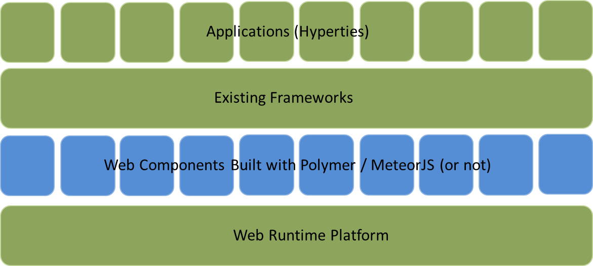

### Service Frameworks

*To make a summary of [contributions about Service Framework SOTA](../sota/web-frameworks) including an evaluation on how to be taken into account in reTHINK and how. The full contributions will be provided in annex*

An analysis of existing JavaScript frameworks based on the reTHINK service framework requirements was carried out on some of the popularly used frameworks today. These frameworks all endeavor to facilitate the development of web applications utilizing the Model-View-Control design pattern. For the reTHINK project however, focus was on the data model management and routing capabilities of these frameworks.

Even though Angular JS is the most popular framework, which provides great two way data-binding allowing for synchronization of data, and has a large community base, it was not considered a suitable applicant for this project due to its complex directives API and inflexibility on configuring (i.e. it offers no configuration possibilities after the Bootstrap procedure). Another reason is that Angular is more suitable for Single Page Apps (SPA) unlike a dynamic environment like the reTHINK runtime where multiple applications can be downloaded and executed concurrently.

Another framework analyzed was Backbone.JS which also did not fit into the reTHINK service framework requirements due to the lack of a modular structure. Backbone lacks a controller concept and views and Models are relatively tightly coupled, resulting to tightly coupled modules which are not desirable for the reTHINK project.  

StapesJS another framework analyzed offered a lightweight less complex framework especially suitable of mobile platforms. However it in itself offers very little APIs and demands combination with other libraries such as JQuery, React and Rivets.

MeteorJS and Polymer on the other hand are good applicants.  While MeteorJS offers rapid prototyping and produces cross-platform code for mobile and fixed platforms, Polymer offers a lightweight shim that uses a new faster data-binding system which significantly reduces code size for modern browsers. 

Polymer provides special features for registering JavaScript elements, lifecycle callbacks, property observation and data-binding, which are all functionalities to enhance the architecture of the Hyperty Runtime environment.
MeteorJS offers the distinct advantage to be used both for all devices and operating systems featuring the Hyperty Runtime and with less complexity with respect to other frameworks. However it has very strong dependency to the back end server being NodeJS. What this means for the reTHINK project is it will fit in perfectly, if the tool of choice for the Messaging Node where NodeJS. This is compatible with the other components as NodeJS is one of the tools considered for the reTHINK Messaging Node.

To summarize, the main objective of service framework is to provide an SDK which developers can utilize to facilitate the development of Hyperties. The SDK is envisioned to provide high level APIs on top of the Runtime APIs for managing especially the data models. It will also provide basic templates for different Hyperty Types which developer can use or extend in developing more advanced merged-up Hyperties. 

The existing web platform (runtime) is the basis of all applicatiion development. With the middle layer of web components offering a new set of bulding blocks to choose from, a new ecosystem is formed on top of which other frameworks and applications exist. From the analyzed existing JavaScript Frameworks, MeteorJS and Polymer offer a good stepping stone to extend and be used within the reTHINK project.
