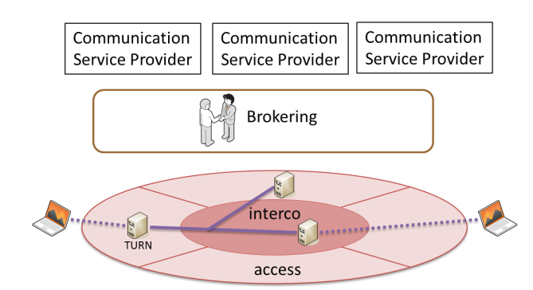
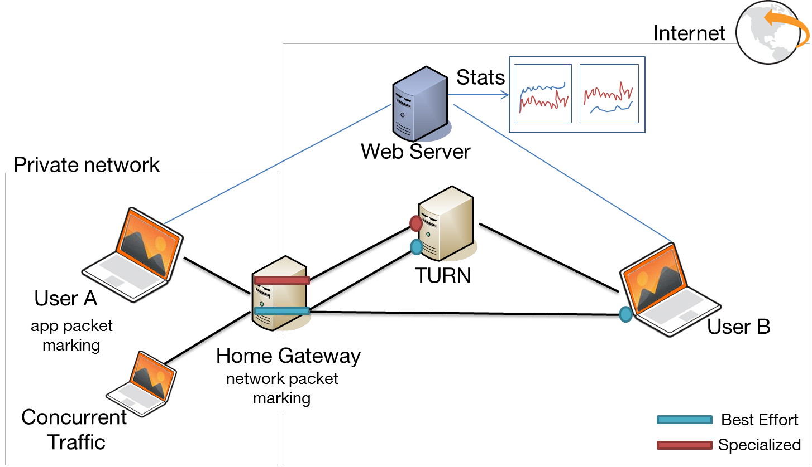
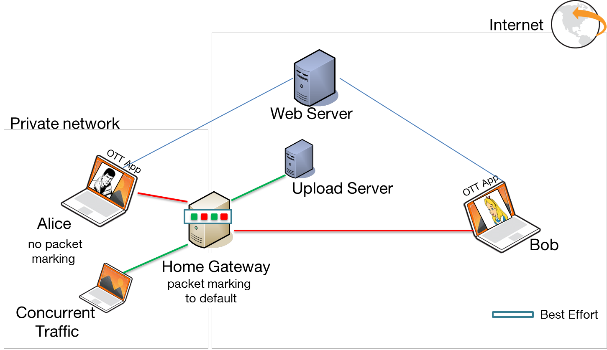
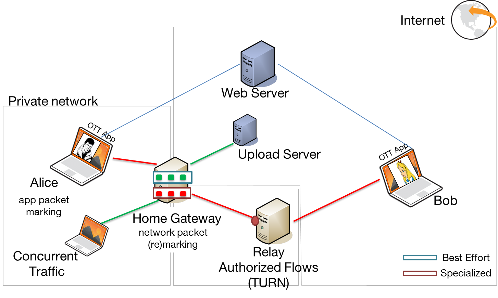

#Context
Network performances vary in different network segments, especially wherever congestion is created. The pace of increasing demand affecting network capacity is different than the actual rate of increasing network resources. There are technical and economic aspects that make it difficult to predict exactly the rate of traffic growth and new peaks, and whether new investment into network is required. Traffic growth is often linked to major service innovation but also to human and social factors that cannot always be anticipated. 

Web Communication Service Providers (CSP) do not have any coupling with the networks. They manage everything at the application level. As a result their actions are limited at some point since they cannot interact with the network and do not receive any information about network’s state. 

However Network Service Providers (NSP) can offer new functionalities that would allow interaction of CSPs and networks. Those new functionalities should be offered by using APIs (Application Programming Interfaces). These APIs should be “developer friendly” so that the provided solutions would adapt to technologies used by web companies instead of trying to force them to use dedicated solutions.

#Collaborative solution
The collaborative solution that was chosen to be tested consists of providing TURN servers by network operators with focus on API and interconnection issues. It is a pertinent solution that would allow coupling of application layer and network later, since it is based on cooperation between CSPs and NSPs. This solution would also allow steering media flow through specialized network paths even without the whole information about the signalling, since thanks to TURN a NSP can distinguish the flows. 

The simplified architecture is presented below:

The advantages of this solution:
- Collaborative approach with focus on B2B2C business model and on “in-network” collaborative approach.
- Impacts different network types and segments.
- Compatible with existing solutions, can be introduced incrementally.
- In line with technological choices of web companies and with evolution of different standards and terminals.

Several aspects stay important:
- To prove the relevance of specialized network paths and QoS treatment:
    * Comparison of communication when using TURN servers versus simple communication peer-to-peer.
    * Assessment of QoS impact. Comparison of routing with QoS and without in the presence of different network conditions. 
- Brokering and universal API issues. 
- Usage of TURN servers 

That is why a Proof of Concept was created. Its principal objectives are:
- Assessment of feasibility and relevance of using TURN-based value added network services offered by network service providers. 
- Possibility of analysing business models and relations between different actors.

#Proof of Concept
The Proof of Concept focuses on access, fix networks. 
There are several reasons why offering Specialized Network Services to fix networks is important.
- The number of devices on a single link in wireline access networks is increasing. These devices are mostly used for peer to peer applications with video and rich media content. Since there is no overprovisioning at this point, congestions can be created.
- Congestion is mostly caused by peer to peer traffic that changes throughout the day, but also by Content Delivery Network (CDN) providers that assure routing management at the application layer based on their own criteria.
- Even in the absence of congestion, when the global demand of bandwidth is satisfied, there may still be insufficient web real-time communication services that are processed as best-effort, hence dedicated specialized network service offered by network operators may fill the gap.

##Architecture
The implementation consists of: 
- Web CSP providing WebRTC application. 
- Two users participating in a WebRTC call. 
- TURN server used for flow identification and authorisation.
- HomeGateway differantiating the flows.
- PC sending the concurrent traffic.

 
## Without Specialized Network Services
First part of the demo consists of observing how the WebRTC traffic behaves withouth Specialized Network Services, i.e. when the WebRTC traffic is treated as any other best-effort traffic. That means that WebRTC traffic and concurent traffic are put in the same queue at the HomeGateway.
In this case the degradation of the WebRTC quality can be observed, e.g. video frame becomes smaller, different freezes or disconnections can be seen.

## With Specialized Network Services
Thesecond part of the demos consists of observing how the WebRTC traffic behaves with Specialized Network Services, i.e. when there is a differentiated treatlent of WebRTC and best-effort traffic. That means that at the HomeGateway, WebRTC traffic is in different queue than the concurrent traffic. Already the separation of the traffic improves the quality but additinally WebRTC queue has a slightly better priorirty.
In this case the WebRTC quality does not get as degradated as previously.

