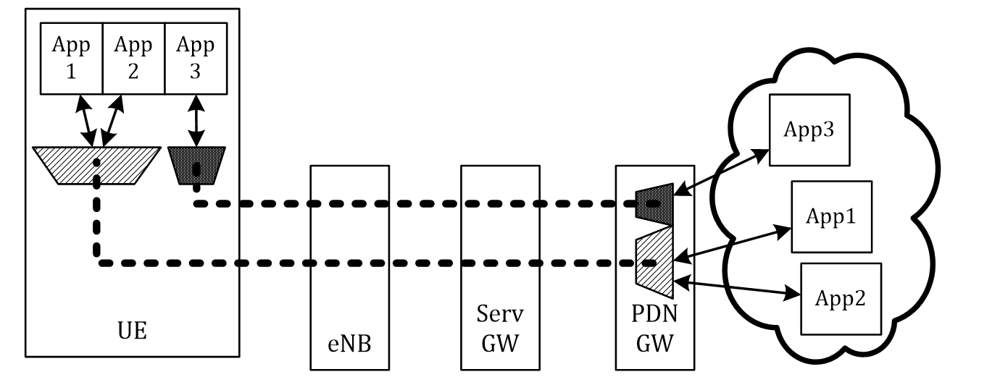
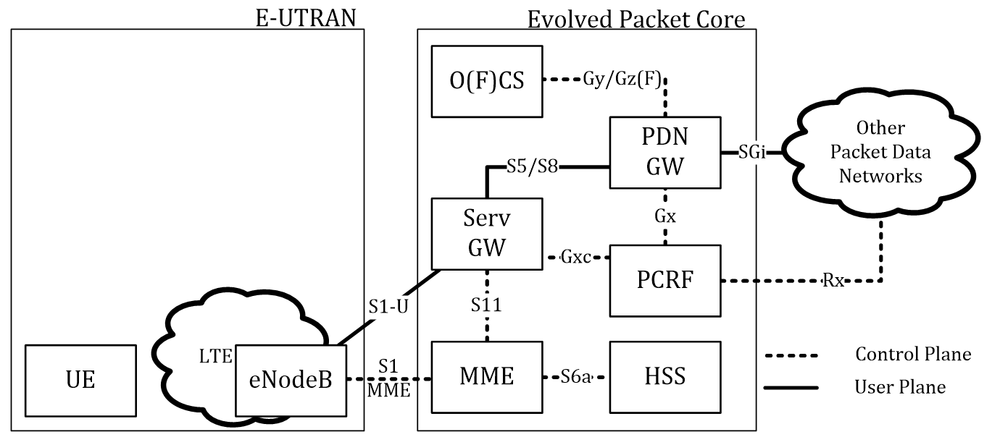

# Mobile Core Methodology #
In reThink, the methodology for mobile communication is aligned to a Mobile Core and Access Network, based on the 3GPP Rel. 8 (and higher) framework. Commonly known as the LTE-based network which includes an Evolved Packet Core (EPC) and its evolved UMTS Terrestrial Radio Access (E-UTRAN) which build together the so called Evolved Packet System (EPS).

## Use of (EPS) Bearer inside a mobile core network ##

For enabling QoS inside the EPS a so called EPS Bearer - or short Bearer - is used to fulfil all requirements of the media delivery. The Bearer is a logical transport channel between the UE and the PDN GW. It is only transporting IP data packets but within the required specification given by a service class. In order to fulfil rich media requirements, it is mostly necessary to establish multiple Bearers - one for each purpose with distinguishable specification sets. Connectivity between a UE and a PDN GW is initially established inside the so called Default Bearer which remains established until the PDN connection is closed due to any reason. If there is no specific service quality treatment necessary for the IP data traffic the Default Bearer can be used with the default QoS parameter set given by the network operator.

Additional Bearers can be established by applications which require special treatment (guaranteed bit rate, delay etc.) of their IP traffic. These so called Dedicated Bearers are set up on demand to enable service consumption regarding the QoS parameters with reference to the Default Bearer. Since these Dedicated Bearers  are only for a single purpose (dedicated transmission of service data), they can be
deactivated after the consumption of a service is over. However, the Default Bearer remains untouched and still established.

In order to identify the IP traffic according to the specified QoS requirements, the UE and the PDN GW have to use packet filters to push IP packets to the appropriate Bearer. So called Traffic Flow Templates (TFT) map the IP traffic for each Bearer. They are established upon creation of an EPS Bearer. The contents for the filter criteria are sent from the PCRF or the UE itself. Like a typical description of a packet filter based firewall, the TFT also contains mostly a 5-tuple
criterion to match a specific rule:
* remote IPv4/v6 address,
* remote port (or port range),
* local IP v4/v6 address,
* local port (or port range), and
* used protocol.

Illustrated in the Figure above is the handling of application flows from the UE via the EPC components towards the end points in the external network. The Default Bearer serves the IP traffic of application 1 and 2. However application 3 has its own Dedicated Bearer to handle the traffic from the UE to the external endpoint according to the specified QoS parameters. The Bearer concept is only operating from the TFT of the UE until the exit port of the PDN. QoS flow management with similar Bearer properties in external networks has to be performed by the respective domain operators. Therefore E2E QoS can only be performed if the external domains are enforcing the QoS requirements in every network node.

A Bearer is only operating in the context of the EPS (UE to the PDN GW). To achieve E2E Service quality, other mechanisms and enforcement approaches have to be built up which can be named as External Bearer. This can be developed with a managed network behind the mobile core network gateway, e.g, a managed TURN Service network. Furthermore, as a mobile operator point of view, it creates a heavy management load on all involved entities and hence pre-defined routes (to specific targets in the network) for QoS enforcement may be a possible solution.

## Architecture Enhancement for Policy and Charging Control ##
Based on the general EPS architecture, the PCC concept is provided by the Policy and Charging Rules Function (PCRF) and Offline Charging System (OFCS) or Online Charging System (OCS), depicted in the following Figure.

These control layer functions allow flow-based charging, service authorisation, network event and QoS traffic management. A policy in the context of the EPS architecture describes the treatment of a specific IP flow which will be classified at the edged network nodes (UE and PDN GW) by using packet filter mechanisms. The PCRF decides, whether an IP flow will have special treatment based on charging and general policies set by the operator. Applications from external networks have to use the Diameter based interface named Rx which is terminated at the PCRF. Via this interface, the application is able to interact with the PCRF to exchange relevant service information for additional resource requirements. The PCRF performs forwarding of a QoS request inside a PCC rule towards the PDN GW, more precisely the PCEF which is commonly a functional part inside the PDN GW. Charging functions like the OFCS or OCS support the PDN GW by enforcing charging features with a set of countable parameters such as time, volume or network event handling. They are interconnected with the Diameter based interface Gy for online charging and Gz for offline charging functions

## Quality of Service Class Identifier for EPS Bearer ##
To indicate which service or traffic class the Bearer should refer to, the EPS is aware of 9 QCI values, see the Table. Which QCI each Bearer has is depending on the used application and the requested parameter set. If the Default Bearer is set up, low-prioritised or no QoS treatment should be assigned to the user data path which can be indicated by setting up such Bearers with a high valued QCI (such as 5 to 9). In this range no Guaranteed Bit Rate (GBR) is enforced inside the network.

| QCI | Resource Type | Priority | Packet Delay Budget | Packet Error Loss Rate | Example Service                           |
|-----|---------------|----------|---------------------|------------------------|-------------------------------------------|
| 1   |      GBR      | 2        | 100 ms              | 10^-2                  | Conversational Voice                      |
| 2   |      GBR      | 4        | 150 ms              | 10^-3                  | Conversational Video (Live Steam)         |
| 3   |      GBR      | 3        | 50 ms               | 10^-3                  | Real Time Gaming                          |
| 4   |      GBR      | 5        | 300 ms              | 10^-6                  | Non-Conversational Video (Buffered Video) |
| 5   |    Non-GBR    | 1        | 100 ms              | 10^-6                  | IMS Signalling                            |
| 6   |    Non-GBR    | 6        | 300 ms              | 10^-6                  | Video (Buffered Streaming), TCP           |
| 7   |    Non-GBR    | 7        | 100 ms              | 10^-3                  | Voice, Video (Live Streaming)             |
| 8   |    Non-GBR    | 8        | 300 ms              | 10^-6                  | Video (Buffered Streaming)                |
| 9   |    Non-GBR    | 9        | 300 ms              | 10^-6                  | Video (Buffered Streaming)                |
(Source: 3GPP TS 23.203, Rel. 13)

Since 3GPP Rel. 13 further QCI characteristics have been added and address the mission critical user data.

| QCI | Resource Type | Priority | Packet Delay Budget | Packet Error Loss Rate | Example Service                           |
|-----|---------------|----------|---------------------|------------------------|-------------------------------------------|
| 65  |      GBR      | 0.7      | 75 ms               | 10^-2                  | Mission Critical user plane Push To Talk voice (e.g., MCPTT)|
| 66  |      GBR      | 2        | 100 ms              | 10^-2                  | Non-Mission-Critical user plane Push To Talk voice         |
| 69  |     Non-GBR   | 0.5      | 60 ms               | 10^-6                  | Mission Critical delay sensitive signalling (e.g., MC-PTT signalling)|
| 70  |     Non-GBR   | 5.5      | 200 ms              | 10^-6                  | Mission Critical Data (e.g. example services are the same as QCI 6/8/9) |
(Source: 3GPP TS 23.203, Rel. 13)

## Triggering QoS Treatment of IP Flows ##

QoS should be controlled by the network operator (or a QoS Broker entitiy) and hence, initiate QoS related resource allocation for a specific application. In the case of the 3GPP-based network architecture, a so-called Application Function (AF) sends relevant IP flow information towards the Policy and Charging Rules Function (PCRF) inside a Diameter based request on the Rx interface. An important advantage is that the terminal’s application and the terminal access interfaces do not have to implement a QoS API which local running applications may use. The application can rely on the AF’s endpoint (e.g., the QoS Broker) to request QoS for its application flows, based on the information of the QoS-related Hyperties. After a possible negotiation and session information signalling, the AF is aware of all request parameters and will start the PCC procedures by sending the request towards the Rx endpoint, namely PCRF. The PCRF will authorise the request and map the parameters into a request towards the included network nodes such as the Serving GW and the PDN GW.

This method can be called network initiated QoS control and relies on the functionalities of the network
nodes. The application used by the subscriber only needs to signal application
relevant information towards a QoS aware service entity on the network side.

For QoS resource reservation, it is useful to transmit the local identity, the remote identity, the session-identifier as well as the used real-time transmission paths. Such a path should comprise the used IP addresses and ports of the involved WebRTC peers as well as the media type to distinguish the prioritisation of the flows. There are multiple possibilities to transport this information. An example, how the syntax may look like is the following:

    {
      "sessionId": <sessionId >,
      "localIdentity": <local - identifier>,
      "remoteIdentity": <remote - identifier>,
      "flows": [
        {
          "remoteAddress": <address of remote - identity>,
          "localAddress": <address of local - identity>,
          "mediaType": <transported media type>
        }
        , {...}
      ]
    }

Several flows may be requested at once, e.g., with different media types.

## Policy Rules ##

Inside the PCRF, rules can be added to the rule set for QoS resource reservation. The following table explains example matching criteria as well as the performed action for each of the mapped rules. Audio will be prioritised with the best possible QCI value (1) with a guaranteed data rate, which is sufficient as described in chapter. Video streams will receive the QCI value 2 and a higher guaranteed bit rate. If the data channel is used during a conversation, the QCI value will be set to 4 with another guaranteed data rate for data such as images, texts or audio files, within the conversation.

| Rule name    | Rule condition                                       | Rule actions (example values)                                                  |
|--------------|------------------------------------------------------|---------------------------------------------------------------|
| WebRTC Audio | AF-Application-Identifier=”webrtc” && Media-Type=”0” | QCI=1, Bandwidth-Upload=1000000, Bandwidth-Download=1000000   |
| WebRTC Video | AF-Application-Identifier=”webrtc” && Media-Type=”1” | QCI=2, Bandwidth-Upload=10000000, Bandwidth-Download=10000000 |
| WebRTC Data  | AF-Application-Identifier=”webrtc” && Media-Type=”2” | QCI=4, Bandwidth-Upload=2000000, Bandwidth-Download=2000000   |

These parameters for WebRTC (or other communication patterns) may easily be enhanced or can be feed from the information based on the given request from the Application Function.
