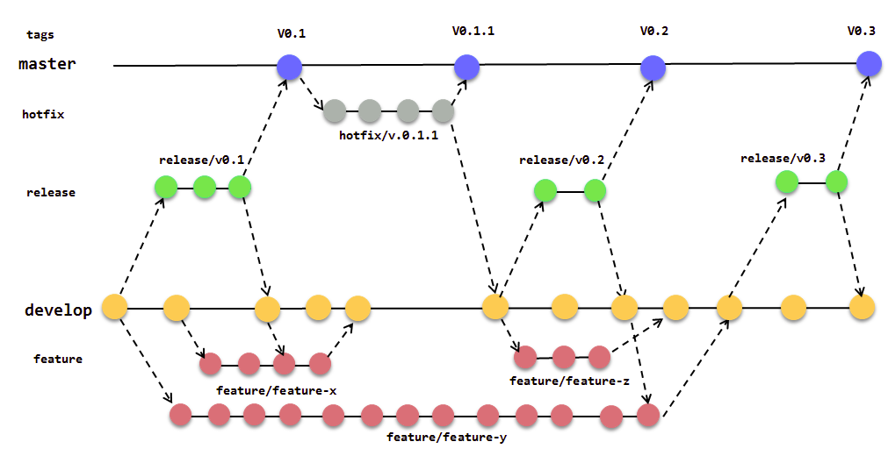
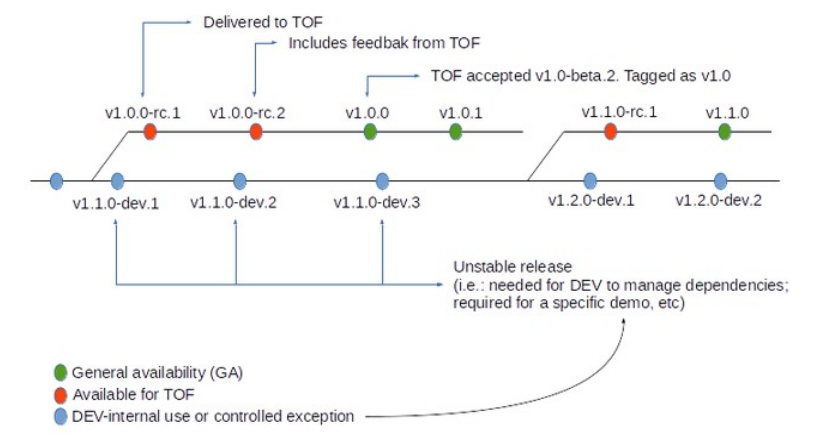

# Methodology and Continuous Integration

* Continous Integration with Jenkins
* [Documentation that is not directly related with source code and source code itself, are in separated repos. One Github repository per main component](#github-structure).

* [Quobis Proposal for Versioning](versioning_proposal_by_quobis_to_be_discussed.md).[other options](#version-control)
* [Javascript source code structure](#javascript-source-code-structure)
* [Javascript development environment](#javascript-environment)

## Github structure

**Documentation and issues that are not directly related with source code and source code itself, are in separated repos**

The main rational is not to constrain internal discussions and documentations from the source code and associated documentation that will be later published to the public. Another reason is to be flexible on the selection of the source code versioning methodology eg avoid the need to clone the full documentation in order to contribute to the source code.

**One Github repository per main component**
Consensus was also agreed on having a repository per component (e.g. one repo for core-runtime, another for the hyperty-framework and another for vertx message node) in order to be more developer friendly (e,g, an Hyperty developer would only need to have access and clone hyperty-framework not eg runtime or message node related repos). 

These additional private repos would only be needed during a short period of time ( 3 or 4 months?) while these components are not publicly published.

The repository name has to be clearly understandable; 

```
runtime-core
runtime-browser // do we need to separate from core
runtime-node // do we need to separate from core
vertx-msg-node
nodejs-msg-node
matrix-msg-node
hyperty-framework // will we have more than one?
hyperty-catalogue // will we have more than one?
hyperty-registry // will we have more than one?
idp // will we have more than one?
```

**Advantages:**

- decentralized code
- it's easily commit and create branches for distribution
- it's easily increment the version
- each piece can have it's own version and issues to fix
- each piece can be integrated with continuous implementation (jenkins)
- separate licenses, code and documentation
- source code can be public
- all project documentation it is private
- all internal discussion is private;

**Disadvantages:**

- private repository have limits;
- integration with dependecies of otheres blocks of code

Additional options:

#### Documentation and source code in the same repo

Directory structure inside [`core-framework/src/<main-section-name>/<section>`](https://github.com/reTHINK-project/core-framework/tree/master/src/runtime/browser)

```
core-framework/src/runtime/core/
core-framework/src/runtime/browser/
core-framework/src/runtime/node/
```

**Advantages:**

- all centralized inside same repository;

**Disadvantages:**

- mix of documentation with source code;
- we need always commit all the repository;
- create distribution files is more complex;

---


#### Each developer works with forks

Each developer make a fork from the main repository and develop on the top of his fork;

**Advantages:**

- all the commits will be reviewed
- the code merge is always controlled

~~Disadvantages:~~

- the code is always public

---

## Javascript Source code structure
```
├── core
│   ├── dist
│   ├── test
│   │   ├── test1.js
│   │   ├── test2.js
│   ├── node_modules
│   ├── src
│   │   ├── configs
│   │   │   ├── config.js
│   │   │   ├── config1.js
│   │   │   ├── config2.js
│   │   ├── plugins
│   │   ├── utils
│   │   │   ├── util1.js
│   │   │   ├── util2.js
│   │   ├── corefile.js
│   │   ├── corefile1.js
│   │   ├── corefile2.js
│   ├── vendor (third party)
│   ├── package.json
│   ├── karma.conf.js
│   ├── readme.md
│   ├── .gitignore
```
#### Explanations of some files on src directory

[package.json](#package)
[.gitignore](#ignore)
[karma.conf.js](#karma)

---

##### <a id="package"></a>package.json
this file will hold all dependecies when we use option `--save` or `--save-dev` on `npm install <package name>`
```json
{
  "name": "core",
  "version": "0.1.0",
  "description": "small description about core",
  "main": "src/corefile.js",
  "scripts": {
    "test": "specify the command to make the tests",
  },
  "dependencies": {
  },
  "devDependencies": {
  }
}
```

##### <a id="ignore"></a>.gitignore
inside this file, you can add other folders
```
// this two folders are ignored because they will be automatically generated
node_modules
vendors

// the dist folder it is automatically generated with the production file(s) minified, uglified, etc;
dist

// ignore npm log if an error ocurred
npm*.log
npm*.log.*

```

##### <a id="karma"></a>karma.conf.js
inside this file, you can add other folders
```javascript
// Karma configuration
// Generated on Tue Aug 25 2015 10:41:43 GMT+0100 (WEST)

module.exports = function(config) {
  config.set({
        // base path that will be used to resolve all patterns (eg. files, exclude)
    basePath: '',

    // frameworks to use
    // available frameworks: https://npmjs.org/browse/keyword/karma-adapter
    frameworks: ['mocha'],
    
    // other configurations listen on http://karma-runner.github.io/0.13/config/configuration-file.html
    other: configurations

    // start these browsers
    // available browser launchers: https://npmjs.org/browse/keyword/karma-launcher
    browsers: [],

    // Continuous Integration mode
    // if true, Karma captures browsers, runs the tests and exits
    singleRun: true
  }
}

```
---

## Javascript Environment

We have an direct dependencies from nodejs and npm, they can be installed separately or both with [nvm](https://github.com/creationix/nvm)

### dependencies:

* nodejs 
* npm
* karma - Make the comunication with karma and jenkins. See more on [karma](http://karma-runner.github.io/0.13/index.html)
* mocha - Unit test tool. See more on [http://mochajs.org](http://mochajs.org/)
* jspm - Don't need compile the code, it use babel (or traucer or typescript) to run ES6 code on browser. Know more in [jspm.io](http://jspm.io/)

### how to prepare directory

We provide an template folder which you can download from [here](template.zip), and only need to do this: `npm run init-setup;` and a basic structure are created;

### installing modules on jspm

Because we are using the ES6 standards, we needed a tool which make the code readable for modern browser, therefore, we are using jspm and this way, we prevent  the code compiling on each save.

#### how to install a new module with jspm

Install modules with **jspm** is so simple like **npm**, see the above samples;

examples: `jspm install jquery ` or `jspm install npm:socket.io` or `jspm install bower:socket.io-client`

---
## Version control

For version control, we suggest, the following method;

#### Git Flow



About git flow method we can have a tool which can help us to start a new feature or releases, make hotfixes or publish a feature to the remote server so it can be used by other.

You can know more [http://danielkummer.github.io/git-flow-cheatsheet/](http://danielkummer.github.io/git-flow-cheatsheet/)

#### Semantic Versioning

Quobis present an solution partialy based on [semantic versioning](http://semver.org/).



How this works:
```
1.2.3 (Major version).(Minor version).(Revision number)
^ ^ ^
| | +--- Minor bugs, spelling mistakes, hot-fixes, etc.
| +----- Features, major bug fixes, etc.
+------- Major version
```

#### Task runner

We can create an automatic process which can help us to increment versions with gulp and grunt (hasn't are decided yet what we can use).

But stay here some examples for each one:

Gulp

 - [gulp-tag-version](https://www.npmjs.com/package/gulp-tag-version)
 - [gulp-bump](https://www.npmjs.com/package/gulp-bump)

Grunt

 - [grunt-bump](https://github.com/vojtajina/grunt-bump)
 - [grunt-bump-version](https://www.npmjs.com/package/grunt-bump-version)

---

