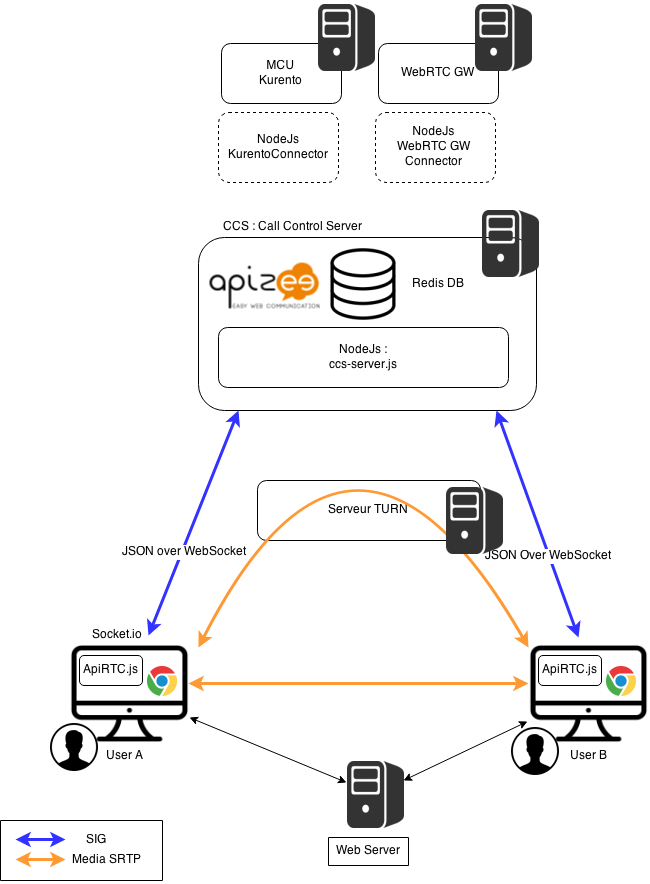
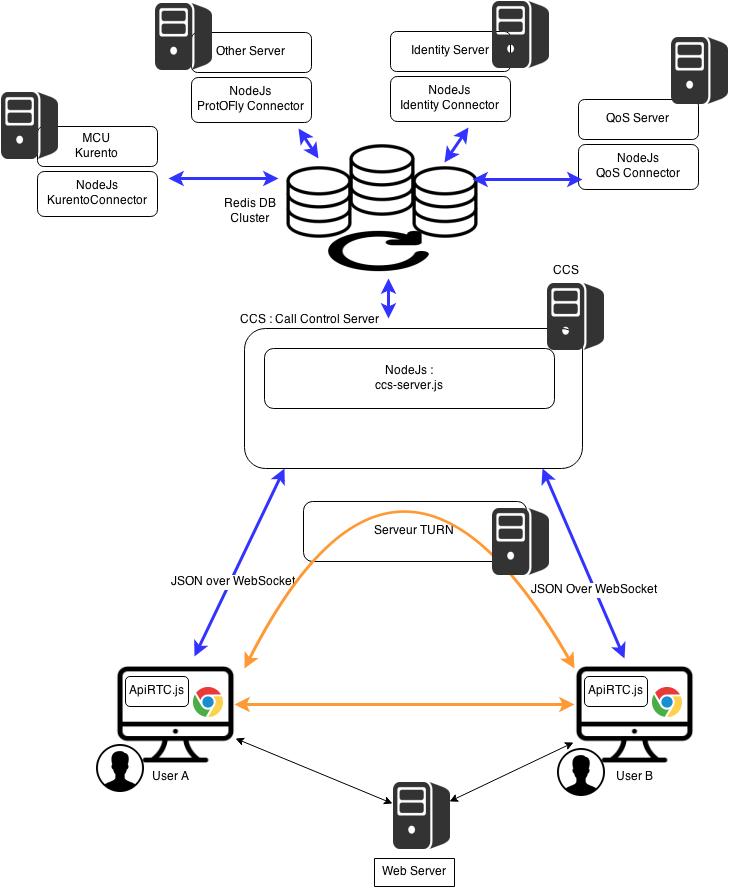

# 1. State of the art of Apizee Solution
## 1.1. What is ApiRTC?

ApiRTC solution includes a communication platform and a client JavaScript library that can be used by developpers to developped their applications.

For Rethink, Apizee propose the usage of apiRTC Community Edition (Open source version : LGPL). This version is not yet published and documented.

## Asset Evaluation

### Overview

*Overview of functionalities and type of WP3 component that the asset can be used for ie Messaging Node, Runtime, Network QoS and Framework*

Messaging Node : NodeJs + Redis Cluster

Runtime / Framework : ApiRTC CE Client

### Architecture

*Main functional modules and interfaces. Should be based on a picture*

## Actual Architecture

ApiRTC actual architecture is presented on following diagram :

Components such as NodeJs, Redis or socket.io are used.

## Integration in Rethink

Integration of ApiRTC in Rethink can be done by adding differents connectors depending of needs :
- Identity Mangement : connector to Identity server
- QoS Management : connector to QoS server
- Other Web communication platform : connector to communication platform

A Redis Cluster with Pub/Sub mecanism will be used to manage communications between connectors

                                                                     
                                                                            
### APIs

ApiRTC provides API for developers

### Requirements Analysis

*Analyse how the solution fullfills [WP3 requirements](selection-criteria.md) according to Component Type addressed by the solution ie Messaging Node, Runtime, Network QoS or Framework*
*The fullfillment of each requirement should be analysed and if needed validated with some tests. Code snippets or other means like configuration data should be provided to clearly demonstrate the requirement fullfilment.
In case the Requirement is not fulfilled, possible solutions should be proposed including effort estimation.*

Analyse regarding WP3 requirements :
TO BE COMPLETED

Identified Tasks for Integration in Rethink :

 - [ ] Publish and document apiRTC CE
 - [ ] Specification : Connector usage rules (registration, authentication, calls routing ...)
 - [ ] Developpement of Connector Manager (Rules management)
 - [ ] Add Redis Cluster
 - [ ] Development of Connector to QoS Server
 - [ ] Development on apiRTC Client to manage connection to TURN Servers
 - [ ] Development of Connector to Identity Server
 - [ ] Development of Connector to other Communication Platform (Protocol On the Fly)
 - [ ] Development of Connector to Kurento Server
 - [ ] Development of Connector to different Vendor WebRTC GW

