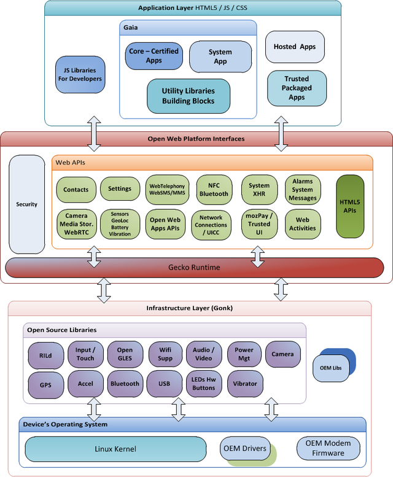

### Overview

Firefox OS (project name: Boot to Gecko, also known as B2G) is a Linux kernel-based open-source operating system for smartphones, tablet computers[6] and smart TVs, developed by Mozilla.

Firefox OS is designed to provide a complete, community-based alternative system for mobile devices, using open standards and approaches such as HTML5 applications, JavaScript, a robust privilege model, open web APIs to communicate directly with cellphone hardware, and application marketplace.

The initial development work involves three major software layers:

* Gonk – platform denomination for a combination of the Linux kernel and the HAL from Android
* Gecko – the web browser engine and application run-time services layer;
* Gaia – an HTML5 layer and user-interface system.

This is a (little bit outdated) [FXOS Web-API status page](https://wiki.mozilla.org/WebAPI).

### Requirements Analysis

Analysis against [Runtime-Environment Requirements](https://github.com/reTHINK-project/core-framework/labels/Runtime%20Requirement)

* [The Runtime should be deployable in the most used Devices and Operating Systems](https://github.com/reTHINK-project/core-framework/issues/1)
  * NO
  * Firefox OS is made for a certain set of FXOS devices (phones, tables, smart TVs)

* [The Runtime should support W3C WebRTC APIs](https://github.com/reTHINK-project/core-framework/issues/2)
  * YES
  * Since FXOS version 2.1 this is officially stated as done.
  * Tests with 2.0, showed that it basically worked there already
  * tested basic A/V calls + separate apps that used the DataChannel to transport arbitrary files

* [The runtime must support standard Javascript (ECMAScript)](https://github.com/reTHINK-project/core-framework/issues/3)
  * YES
  * "Gecko" is the Javascript interpreter
  * provides Javascript access to a lot of Web APIs (even non-standardized)
  * Whole UI (Gaia) is based on HTML, Javascript, CSS

* [The Runtime should support Web Socket](https://github.com/reTHINK-project/core-framework/issues/4)
  * YES, client side
  * Websockets clients are supported
  * Websocket servers are not supported
  * --> same situation as in a browser runtime

* [The Runtime should support Web Messaging Notifications](https://github.com/reTHINK-project/core-framework/issues/5)
  * NO
  * according to Web-API status, no indication of planned support
  * must be double-checked with practical tests
  * what they have is a "Simple Push" API

* [The Runtime must have a good performance](https://github.com/reTHINK-project/core-framework/issues/6)
  * very subjective, depends on device hardware it is running on
  * tested 3 different devices with rather different experience in terms of performance

* [The Runtime must be secured](https://github.com/reTHINK-project/core-framework/issues/7)
  * hmmm, what to say here?
  * this would require much more analysis and expertise
  * general assumptions is that the security is comparable to a browser
  * but because the browser IS the middle layer of the OS a potential breakout of the sandbox might have stronger consequences

* [The effort to introduce new capabilities in the runtime should be reasonable](https://github.com/reTHINK-project/core-framework/issues/8)
  * YES
  * extension with Javascript libraries is possible very easy
  * due to the open source nature of the Gecko and Gonk layers it is also possible to add low- and medium-level capabilities there
  * The effort for low-level extensions will be relatively high.
