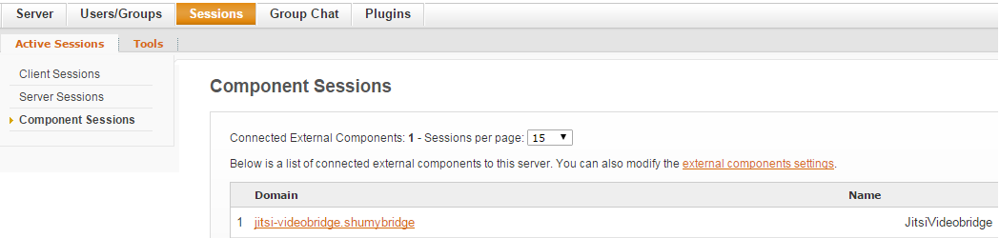

## Jitsi Videobridge Evaluation (Meet application)
Jitsi Videobridge is a WebRTC compatible Selective Forwarding Unit (SFU) that allows for multiuser video communication.

### Features
Standalone.
RTP Relay.
Supports audio mixing.
Can be installed as Openfire plugin.
Call encryption with DTLS/SRTP.
Support for ICE

### Deploy
**Required software**
* JVM (select the latest version)
* XMPP Server
* Jitsi VideoBridge (stream XMPP component)
* Jicofo (Session handler XMPP component)
* nginx (web server and proxy)

**Domain selection**
* Select a name for a domain, "mybridge" will be use for this example.
* Add an entry in DNS hosts file "127.0.0.1 mybridge".

**XMPP Server (using Openfire)**
* Download and install openfire from http://www.igniterealtime.org/downloads/index.jsp
* Access admin console at http://localhost:9090
* For the machine name and XMPP domain is important that you use "mybridge", server certificates will be generated for the domain.
* Select embedded SQLLite database, and an admin user account. Just enough for testing.
* On config "Server -> Server Settings -> HTTP Binding", enable "Script Syntax -> BOSH" and "Provides support for XFF (X-Forwarded-For) headers"
* On config "Server -> Server Settings -> External Components" enable and set the password.

**Jitsi VideoBridge**
* Download and install Jitsi Videobridge from https://jitsi.org/Projects/JitsiVideobridge
* Run videobridge with: jvb --host=mybridge --secret=<password>
* You should see an entry in XMPP components like:

**Jicofo Session**
* Download and install Jicofo from 
* Add lines "org.jitsi.impl.neomedia.transform.srtp.SRTPCryptoContext.checkReplay=false" and "org.jitsi.jicofo.auth.URL=XMPP:mybridge" to the file sip-communicator.properties. In Windows this is located at "C:\Users\<user>\.sip-communicator\sip-communicator.properties" or in linux "/usr/share/jicofo/.sip-communicator/sip-communicator.properties"
* Run videobridge with: jicofo --host=mybridge --port=5275 --secret=xpassword
* You should see an entry in XMPP components like:

