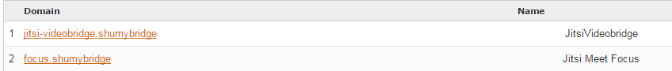

## Jitsi Videobridge Evaluation (Meet application)
Jitsi Videobridge is a WebRTC compatible Selective Forwarding Unit (SFU) that allows for multiuser video communication.

### Features
Standalone.
RTP Relay.
Supports audio mixing.
Can be installed as Openfire plugin.
Call encryption with DTLS/SRTP.
Support for ICE

### Deploy
**Required software**
* JVM (select the latest version)
* XMPP Server (openfire)
* Jitsi VideoBridge (stream XMPP component)
* Jicofo (Session handler XMPP component)
* NGINX (web server and proxy)
* Jitsi Meet App

**Domain selection**
* Select a name for a domain, "shumybridge" will be use for this example.
* Add an entry in DNS hosts file "127.0.0.1 shumybridge".

**XMPP Server (using Openfire)**
* Download and install openfire from http://www.igniterealtime.org/downloads/index.jsp
* Access admin console at http://localhost:9090
* For the machine name and XMPP domain is important that you use "shumybridge", server certificates will be generated for the domain.
* Select embedded SQLLite database, and an admin user account. Just enough for testing.
* On config "Server -> Server Settings -> HTTP Binding", enable "Script Syntax -> BOSH" and "Provides support for XFF (X-Forwarded-For) headers"
* On config "Server -> Server Settings -> External Components" enable and set the password.

**Jitsi VideoBridge**
* Download and install Jitsi Videobridge from https://jitsi.org/Projects/JitsiVideobridge
* Run videobridge with: jvb --host=shumybridge --secret=<password>
* You should see an entry in XMPP components like:


**Jicofo Session**
* Clone from "git clone https://github.com/jitsi/jicofo.git"
* Ant build with "ant dist.{os-name}"
* Add lines "org.jitsi.impl.neomedia.transform.srtp.SRTPCryptoContext.checkReplay=false" and "org.jitsi.jicofo.auth.URL=XMPP:shumybridge" to the file sip-communicator.properties. In Windows this is located at "C:\Users\<user>\.sip-communicator\sip-communicator.properties" or in linux "/usr/share/jicofo/.sip-communicator/sip-communicator.properties"
* Run videobridge with: jicofo --host=shumybridge --port=5275 --secret=xpassword
* You should see an entry in XMPP components like:


**NGINX**
* Download and install from http://nginx.org/en/download.html
* Change nginx.conf file with:
```
server {
  listen       80;
  server_name  shumybridge;

	location ~ ^/([a-zA-Z0-9]+)$ {
		rewrite ^/(.*)$ / break;
	}
		
	location / {
		root      srv/jitsi.example.com;
		index     index.html;
	}

	# BOSH
	location /http-bind {
		proxy_pass      	http://shumybridge:7070/http-bind/;
		proxy_set_header 	X-Forwarded-For $remote_addr;
		proxy_set_header 	Host $http_host;
	}
     
  # redirect server error pages to the static page /50x.html
  error_page   500 502 503 504  /50x.html;
  location = /50x.html {
    root   html;
  }
}
```

**Jitsi Meet App**
* Clone or download Meet App from https://github.com/jitsi/jitsi-meet.git
* Copy Meet App to NGINX folder ./srv/jitsi.example.com
* Change config.js file with:
```
var config = {
  hosts: {
    domain: 'shumybridge',
    muc: 'conference.shumybridge',
    bridge: 'jitsi-videobridge.shumybridge',
    focus: 'focus.shumybridge'
  },

  ...
  bosh: '//shumybridge/http-bind',
  clientNode: 'http://shumybridge/jitsimeet',
  ...
};
```

Run NGINX and access the Meet App at http://shumybridge
