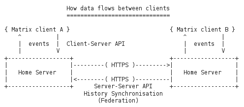

## Matrix.org

From matrix.org spec:
> *The end goal of Matrix is to be a ubiquitous messaging layer for synchronising arbitrary data between sets of people, devices and services - be that for instant messages, VoIP call setups, or any other objects that need to be reliably and persistently pushed from A to B in an interoperable and federated manner.*

### Overview

In the scope of the reTHINK project, matrix.org is a candidate technology for the **Messaging Node**

### Architecture

Following picture shows the main data flow in a matrix architecture.

The core components are the Home Servers (HS) which can federate to sync and maintain the history of shared communication sessions among domains. Home Servers resolv each other via DNS.

Some general points:
* **Every** communication requires a room. Even for a simple chat message to a dedicated receiver a room MUST be created first and the receiver MUST be invited and join it
* Rooms are persistent. They can be re-entered after successive login sessions.
* A set of event/message types is defined in the API, own extensions can be made.
* Focus of matrix is on federation and consistency and history of session states.

### APIs

Matrix.org defines 3 types of APIs with different scope. All these APIs are REST APIs using JSON Objects as payload.

* [Client Server API v1](http://www.matrix.org/docs/spec/#client-server-api-v1)
 * for implementation of application frontends
 * functions for:
    * Registration and Login
    * sending and receiving of Events
    * management of communication rooms
 * well documented, easy to implement
 * version 2 is currently in development - will be backward compatible

* [Federation API (Server-Server   API)](http://www.matrix.org/docs/spec/#id100)
  * API for the inter-domain communication between Home Servers
  * uses HTTPS GET and PUT requests
  * transaction based
  * requests are authenticated by PK signatures

* [Application Service API](http://www.matrix.org/docs/spec/#id79)
  * API to provide custom server-side behaviour (e.g. gateways, filters, extensible hooks etc)
  * so far only "Passive Application Services" are specified, i.e. services that can only monitor but not block or modify events

some words about Identifiers:
* Users are identified as: **@username:host.domain** (with an optional **:port** suffix)
* Rooms are identified as: **#roomalias:host.domain** (with an optional **:port** suffix)
* Home servers are identified and resolved by their FQDN like: **https://host.domain:port**

The Matrix concept includes the concept of an "Identity Server", which is intended to map 3rd party entities to matrix ids:
* no documentation
* testing didn't work in our lab environment

### Requirements Analysis

Analysis against **Messaging Node** Requirements

* [It should be possible to support Protocol on-the-fly](https://github.com/reTHINK-project/core-framework/issues/21)
  * Yes
  * the Client Server API could be wrapped in a protocol stub, that can be downloaded at runtime

* [Messaging Transport Protocols](https://github.com/reTHINK-project/core-framework/issues/20)
  * Partially
  * matrix is based on REST, example client uses long-polling to receive Events
  * wrapping of Events/message in other transport protocols would require potential changes on HomeServer side
  * (since "synapse", the ref-impl of Matrix HS, is implemented on top of Twisted, it should be possible to do that for e.g. Websockets)

* [Message Caching](https://github.com/reTHINK-project/core-framework/issues/19)
  * Yes
  * this is kind of a core feature

* [Message Node logging](https://github.com/reTHINK-project/core-framework/issues/18)  
  * Yes
  * could be done via an attached passive Application Service

* [Message delivery reliability](https://github.com/reTHINK-project/core-framework/issues/17)
  * Yes
  * transmission errors are returned to clients
  * messages are re-delivered to clients from internal history of HS

* [Messaging Node deployments with carrier grade scalability](https://github.com/reTHINK-project/core-framework/issues/16)
  * No/(Perhaps via load balancers)
  * from spec: "HS SHOULD implement rate limiting ..."
  * experiments showed that already simple forwarding of every individual candidate of a WebRTC call can trigger this rate limitiation

* [Messaging Node should be tolerant to unstable connections](https://github.com/reTHINK-project/core-framework/issues/15)
  * Yes
  * since all communication is initiated by the client and HS addressing happens via DNS or static IP:port it is up to the client to re-connect after network interruptions
  * HS always has the complete history of the session - nothing is lost

* [Events about clients connection / disconnection from Messaging Node](https://github.com/reTHINK-project/core-framework/issues/14)
  * Yes

* [Messaging Node must support very low message delivery latency](https://github.com/reTHINK-project/core-framework/issues/13)
  * No
  * HTTP(S) is not the most efficient protocol in terms of latency

* [Messaging Node must be deployable in the most used Virtual Machines](https://github.com/reTHINK-project/core-framework/issues/12)
  * Yes

* [Messaging Node should require minimal computing resources](https://github.com/reTHINK-project/core-framework/issues/11)
  * rather Yes (not tested on embedded device yet)
  * current ref-impl is based on Twisted (Python)
  * overall installation size 94MB (including python and webclient)
  * ==> environments supporting python should also support a Matrix HS

* [Messaging Node must support external authentication and Authorisation](https://github.com/reTHINK-project/core-framework/issues/10)
  * No
  * matrix includes concept of external "Identity Server", but only for mapping of 3rd party IDs to internal IDs
  * AA is performed internally

* [Messaging Node must support pub/sub](https://github.com/reTHINK-project/core-framework/issues/9)
  * Yes, via room-IDs
  
