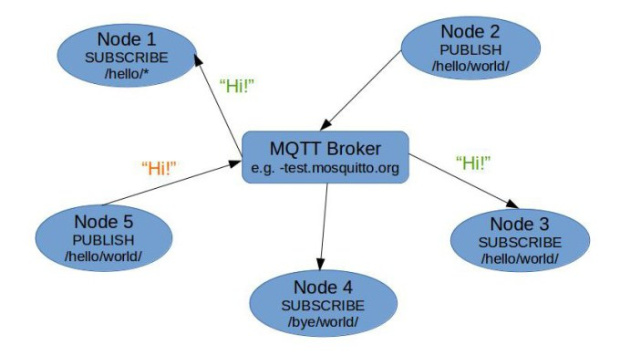

## MQTT Evaluation

MQ Telemetry Transport (MQTT) is a lightweight broker-based publish/subscribe messaging protocol designed to be open, simple, lightweight and easy to implement. These characteristics make it ideal for use in constrained environments such as machine-to-machine (M2M)/"Internet of Things" connectivity scenarios.

MQTT-SN (MQTT for Sensor Networks) is a variation of the main protocol aimed at embedded devices on non-TCP/IP networks, such as ZigBee.

### Overview

In the scope of the reTHINK project, MQTT is a candidate technology for the Messaging Node.

#### Highlights:

MQTT was designed for low-bandwidth, high latency networks in the late 1990s/early 2000s. As a result, the designers made a number of key choices which influenced the way it "looks and feels".

 *  Simplicity, simplicity, simplicity! Don't add too many "bells and whistles" but provide a solid building block which can easily be integrated into other solutions. Be simple to implement.
 *  Publish/subscribe messaging. Useful for most sensor applications, and enables devices to come online and publish "stuff" that hasn't been previously known about or predefined.
 *  Zero administration (or as close as possible). Behave sensibly in response to unexpected actions and enable applications to "just work", e.g. by dynamically creating topics when needed.
 *  Minimise the on-the-wire footprint. Add an absolute minimum of data overhead to any message. Be lightweight and bandwidth efficient.
 *  Expect and cater for frequent network disruption (for low bandwidth, high latency, unreliable, high cost-to-run networks)... -> [Last Will and Testament](http://www.hivemq.com/mqtt-essentials-part-9-last-will-and-testament/)
 *  Continuous session awareness -> [Last Will and Testament](http://www.hivemq.com/mqtt-essentials-part-9-last-will-and-testament/)
 *  Expect that client applications may have very limited processing resources available. 
 *  Provide traditional messaging qualities of service where the environment allows. Provide "quality of service" 
 *  Data agnostic. Don't mandate content formats, remain flexible.

## Architecture

MQTT has a client/server model, where every node is a client that connects to a server, know as a broker, over TCP.
MQTT is message oriented. Messages are published to a topic.
Clients may subscribe to multiple topics or use a wildcard matching based subscription.

MQTT supports three quality of service levels, "Fire and forget", "delivered at least once" (QoS1) and "delivered exactly once" (QoS2).

## APIs and Bindings

####Specification

The current formal protocol specification can be found at:

[MQTT v3.1.1 specification](http://docs.oasis-open.org/mqtt/mqtt/v3.1.1/mqtt-v3.1.1.html)

####Device-Specific

*  [Arduino](https://github.com/knolleary/pubsubclient) ([more information](http://knolleary.net/arduino-client-for-mqtt/))

*  [mbed](https://github.com/yilun/MQTT-client-on-mbed) ([more information](http://ceit.uq.edu.au/content/mqttclient-mbed-version-20))

*  [mbed (simple port of the Arduino pubsubclient)](http://mbed.org/users/jwende/code/MQTT/)

*  [mbed (native implementation)](http://mbed.org/users/Nim65s/code/niMQTT/)

*  [mbed (Paho Embedded C++ port)](http://developer.mbed.org/teams/mqtt/code/MQTT/) ([more information] (https://www.eclipse.org/paho/clients/c/embedded/))
*  [mbed (Paho Embedded C port)](http://developer.mbed.org/teams/mqtt/code/MQTTPacket/) ([more information](https://www.eclipse.org/paho/clients/c/embedded/))

*  [Nanode](http://github.com/njh/NanodeMQTT/)

*  [Netduino](https://github.com/danielan/NetduinoMQTT)

*  [M2MQTT (works with .Net Micro Framework)](https://m2mqtt.codeplex.com/)

(see also [devices](things) page for more on hardware with built-in support)

####Actionscript

*  [as3MQTT](https://github.com/yangboz/as3MQTT)

####Bash

* see [Shell Script](#shell-script), below

####C

*  [Eclipse Paho C] (https://www.eclipse.org/paho/clients/c/)

*  [Eclipse Paho Embedded C] (https://www.eclipse.org/paho/clients/c/embedded/)

*  [libmosquitto](http://mosquitto.org)

*  [libemqtt](https://github.com/menudoproblema/libemqtt) - an embedded C client

####C++

*  [Eclipse Paho C++] (https://www.eclipse.org/paho/clients/cpp/)

*  [libmosquittopp](http://mosquitto.org)

*  [Eclipse Paho Embedded C++] (https://www.eclipse.org/paho/clients/c/embedded/)

####Clojure

*  [Machine Head](http://clojuremqtt.info)

*  [Clojure MQTT Codec for Netty](https://github.com/xively/clj-mqtt/)

####Dart

*  [mqtt.dart](http://pub.dartlang.org/packages/mqtt)

####Delphi

*  [TMQTTClient](http://jamiei.com/code/TMQTTClient.zip) ([more information](http://jamiei.com/blog/code/mqtt-client-library-for-delphi/))

####Erlang

*  [erlmqtt](https://github.com/squaremo/erlmqtt)

*  [emqttc](https://github.com/emqtt/emqttc) - Erlang MQTT Client

*  [mqtt4erl](http://code.google.com/p/mqtt4erl/)

*  [my-mqtt4erl](http://code.google.com/p/my-mqtt4erl/) - updated fork of mqtt4erl

####Elixir

*  [hulaaki](https://github.com/suvash/hulaaki)

####Go

*  [Eclipse Paho Go](http://git.eclipse.org/c/paho/org.eclipse.paho.mqtt.golang.git/)

####Haskell

* [mqtt-hs](http://hackage.haskell.org/package/mqtt-hs)

####Java

*  [Eclipse Paho Java](http://git.eclipse.org/c/paho/org.eclipse.paho.mqtt.java.git/)

*  [Xenqtt](http://xenqtt.sf.net) Includes a client library, mock broker for unit/integration testing, and applications to support enterprise needs like using a cluster of servers as a single client, an HTTP gateway, etc.

*  [MeQanTT](https://github.com/AlbinTheander/MeQanTT)

*  [Fusesource mqtt-client](https://github.com/fusesource/mqtt-client)

*  [moquette](http://code.google.com/p/moquette-mqtt/)

*  [ "MA9B" zip of 1/2 dozen mobile clients source code. Includes Android-optimized Java source that works with Android notifications, based on Paho](http://www-933.ibm.com/support/fixcentral/swg/selectFix?product=ibm%2FWebSphere%2FWebSphere+MQ&fixids=1.0.0.1-WS-MQCP-MA9B&source=dbluesearch&function=fixId&parent=ibm/WebSphere )

*  [IA92](http://www-01.ibm.com/support/docview.wss?rs=171&uid=swg24006006&loc=en_US&cs=utf-8&lang=en) - *deprecated* IBM IA92 support pack, use Eclipse Paho GUI client instead. A useful MQTT Java swing GUI for publishing & subscribing. The Eclipse Paho GUI is identical but uses newer client code

####Javscript / Node.js

*  [Eclipse Paho HTML5 JavaScript over WebSocket.](http://git.eclipse.org/c/paho/org.eclipse.paho.mqtt.javascript.git/)

*  [mqtt.js](https://github.com/adamvr/MQTT.js)

*  [node_mqtt_client](https://github.com/yilun/node_mqtt_client) ([more information](http://ceit.uq.edu.au/content/simple-mqtt-cient-nodejs))

*  [IBM-provided PhoneGap / Apache Cordova MQTT plug-in for Android](http://www-01.ibm.com/support/docview.wss?rs=171&uid=swg24033580&loc=en_US&cs=utf-8&lang=en) - JavaScript API is identical to Eclipse Paho HTML5 JavaScript

*  [Ascoltatori](https://github.com/mcollina/ascoltatori) - a node.js pub/sub library that allows access to Redis, AMQP, MQTT and ZeroMQ with the same API.

####LotusScript

*  [MQTT From LotusScript](https://tingenek.wordpress.com/2011/11/30/mqtt-with-lotus-notes/)

####Lua

*  [Eclipse Paho Lua](http://git.eclipse.org/c/paho/org.eclipse.paho.mqtt.lua.git/)

####.NET / dotNET

*  [MqttDotNet](http://sourceforge.net/projects/mqttdotnet/)

*  [nMQTT](https://github.com/markallanson/nmqtt)

*  [M2MQTT](https://m2mqtt.codeplex.com/)

*  [KittyHawkMQ] (http://www.kittyhawkmq.com/)

####Objective-C

*  [mqttIO-objC](https://github.com/m2mIO/mqttIO-objC)

*  [libmosquitto](https://mosquitto.org) - via wrappers ([example](https///github.com/njh/marquette))

*  [MQTTKit](https://github.com/jmesnil/MQTTKit) ([sample app](https///github.com/jmesnil/MQTTExample))

*  ["MA9B" zip of 1/2 dozen mobile clients source code including Objective-C](http://www-933.ibm.com/support/fixcentral/swg/selectFix?product=ibm%2FWebSphere%2FWebSphere+MQ&fixids=1.0.0.1-WS-MQCP-MA9B&source=dbluesearch&function=fixId&parent=ibm/WebSphere)

####OCaml
* [mqtt_client](https://github.com/philtomson/mqtt_client)

####Perl

*  [net-mqtt-perl](https://github.com/beanz/net-mqtt-perl)

*  [anyevent-mqtt-perl](https://github.com/beanz/anyevent-mqtt-perl)

*  [WebSphere-MQTT-Client](http://search.cpan.org/dist/WebSphere-MQTT-Client/)

*  Net::MQTT::Simple [cpan](https://metacpan.org/pod/Net::MQTT::Simple) [github](https://github.com/Juerd/Net-MQTT-Simple)

####PHP

*  [phpMQTT](http://github.com/bluerhinos/phpMQTT)

*  [Mosquitto-PHP](https://github.com/mgdm/Mosquitto-PHP)

*  [sskaje's MQTT library](http://github.com/sskaje/mqtt)

####Python

*  [Eclipse Paho Python](http://git.eclipse.org/c/paho/org.eclipse.paho.mqtt.python.git/) - originally the mosquitto Python client

*  [nyamuk](https://github.com/iwanbk/nyamuk)

*  [MQTT for twisted python](https://github.com/adamvr/MQTT-For-Twisted-Python)

####REXX

*  [REXX MQTT](https://github.com/DougieLawson/REXX_MQTT)

####Ruby

*  [ruby-mqtt](https://github.com/njh/ruby-mqtt)

*  [em-mqtt](https://rubygems.org/gems/em-mqtt)

*  [mosquitto](https://github.com/xively/mosquitto)

####Shell Script

*  [bish-bosh](https://github.com/raphaelcohn/bish-bosh), supports bash, ash (including BusyBox), pdksh and mksh.

####Tcl

*  [tcl-mqtt](https://github.com/Tingenek/tcl-mqtt)

###Brokers
Server                                                                            | QoS 0 | QoS 1 | QoS 2 | auth | [bridge](bridge_protocol) | [$SYS](conventions#$sys) | SSL | [dynamic topics](are_topics_dynamic) | cluster | websockets | plugin system
------                                                                            | ----- | ----- | ----- | ---- | ------------------------- | ------------------------ | --- | ------------------------------------ | ------- | ---------- | ------------- | 
[mosquitto](mosquitto_message_broker)                                             | ✔     | ✔     | ✔     | ✔    | ✔                         | ✔                        | ✔   | ✔                                    | ✘      | ✔          | ✔             | 
[RSMB](http://mqtt.org/wiki/doku.php/really_small_message_broker)                 | ✔     | ✔     | ✔     | ✔    | ✔                         | ✔                        | ✘   | ✔                                    | ✘       | ✘          | ?             | 
[WebSphere MQ](http://www-03.ibm.com/software/products/en/wmq/)                   | ✔     | ✔     | ✔     | ✔    | ✔                         | ✔                        | ✔   | ✔                                    | ?       | ?          | ?             | 
[HiveMQ](http://www.hivemq.com)                                                   | ✔     | ✔     | ✔     | ✔    | ✔                         | ✔                        | ✔   | ✔                                    | ✔       | ✔          | ✔             | 
[Apache Apollo](http://activemq.apache.org/apollo)                                | ✔     | ✔     | ✔     | ✔    | ✘                         | ✘                        | ✔   | ✔                                    | ?       | ✔          | ?             | 
[Apache ActiveMQ](http://activemq.apache.org/)                                    | ✔     | ✔     | ✔     | ✔    | ✘                         | ✘                        | ✔   | ✔                                    | ✔       | ✔          | ✔             | 
[my-Channels Nirvana Messaging](http://www.my-channels.com/products/nirvana.html) | ✔     | ✔     | ✔     | §    | ✘                         | ✘                        | ✔   | ✘                                    | ?       | ?          | ?             | 
[RabbitMQ](http://www.rabbitmq.com/blog/2012/09/12/mqtt-adapter/)                 | ✔     | ✔     | ✘     | ✔    | ✘                         | ✘                        | ✔   | ✔                                    | ?       | ?          | ?             | 
[MQTT.js](https///github.com/adamvr/MQTT.js)                                      | ✔     | ✘     | ✘     | §    | ✘                         | ✘                        | ✔   | ✔                                    | ✘       | ?          | ✘             | 
[moquette](http://code.google.com/p/moquette-mqtt/)                               | ✔     | ✔     | ✘     | ?    | ?                         | ?                        | ?   | ?                                    | ✘       | ✘          | ✘             | 
[mosca](mosca)                                                                    | ✔     | ✔     | ✘     | ✔    | ?                         | ?                        | ?   | ?                                    | ✘       | ✔          | ✘             | 
[IBM MessageSight](http://www-03.ibm.com/software/products/en/messagesight/)      | ✔     | ✔     | ✔     | ✔    | ✘                         | ✔                        | ✔   | ✔                                    | §       | ✔          | ✘             |
[2lemetry](http://2lemetry.com/platform/)      | ✔     | ✔     | ✔     | ✔    | ✔                         | §                        | ✔   | ✔                                    | ✔       | ✔          | ✘             |
[GnatMQ](http://mqttbroker.codeplex.com/)      | ✔     | ✔     | ✔     | ✔    | ✘                         | ✘                       | ✘   | ✔                                    | ✘       | ✘          | ✘             |
[JoramMQ](http://mqtt.jorammq.com)                                                   | ✔     | ✔     | ✔     | ✔    | ✔                         | ✔                        | ✔   | ✔                                    | ✔       | ✔          | ✔             | 
[ThingMQ](https://thingmq.com)                                                   | ✔     | ✔     | ✔     | ✔    | ✔                         | ✘                        | ✔   | ✔                                    | ✔       | ✔          | ✔             | 
[VerneMQ](https://verne.mq)                                                   | ✔     | ✔     | ✔     | ✔    | ✔                         | ✔                        | ✔   | ✔                                    | ✔       | ✔          | ✔             | 
Key: ✔ supported ✘ not supported ? unknown § see limitations

## Requirements Analysis

Analysis against **Messaging Node** Requirements

* [It should be possible to support Protocol on-the-fly](https://github.com/reTHINK-project/core-framework/issues/21)
  * Yes
  * the Client Server API could be wrapped in a protocol stub, that can be downloaded at runtime

* [Messaging Transport Protocols](https://github.com/reTHINK-project/core-framework/issues/20)
  * Yes
  * Using [MQTT over WebSockets](http://www.hivemq.com/mqtt-essentials-special-mqtt-over-websockets/)
   
* [Message Caching](https://github.com/reTHINK-project/core-framework/issues/19)
  * Yes
  * Using [Persistence Sessions](http://www.hivemq.com/mqtt-essentials-part-7-persistent-session-queuing-messages/)

* [Message Node logging](https://github.com/reTHINK-project/core-framework/issues/18)
  * Yes

* [Message delivery reliability](https://github.com/reTHINK-project/core-framework/issues/17)
  * Yes
  * Using a QoS1 or QoS2 level.
  * [More Info](http://www.hivemq.com/mqtt-essentials-part-6-mqtt-quality-of-service-levels/)

* [Messaging Node deployments with carrier grade scalability](https://github.com/reTHINK-project/core-framework/issues/16)
  * Yes
  * Some Brokers can be clusters

* [Messaging Node should be tolerant to unstable connections](https://github.com/reTHINK-project/core-framework/issues/15)
  * Yes
  * Using [Persistence Sessions](http://www.hivemq.com/mqtt-essentials-part-7-persistent-session-queuing-messages/)

* [Events about clients connection / disconnection from Messaging Node](https://github.com/reTHINK-project/core-framework/issues/14)
  * Yes
  * Called : [Last Will and Testament](http://www.hivemq.com/mqtt-essentials-part-9-last-will-and-testament/)
  * And Using [MQTT Keep Alive and Client Take-Over](http://www.hivemq.com/mqtt-essentials-part-10-alive-client-take-over/)

* [Messaging Node must support very low message delivery latency](https://github.com/reTHINK-project/core-framework/issues/13)
  * Yes, because of the small overhead and simple architecture
  * [In the usec range and 273M mobile messages/sec per rack](https://mobilebit.wordpress.com/2013/05/03/rest-is-for-sleeping-mqtt-is-for-mobile/)

* [Messaging Node must be deployable in the most used Virtual Machines](https://github.com/reTHINK-project/core-framework/issues/12)
  * Yes

* [Messaging Node should require minimal computing resources](https://github.com/reTHINK-project/core-framework/issues/11)
  * Yes
  * Core Feature

* [Messaging Node must support external authentication and Authorisation](https://github.com/reTHINK-project/core-framework/issues/10)
  * [Yes](http://docs.oasis-open.org/mqtt/mqtt/v3.1.1/os/mqtt-v3.1.1-os.html#_Toc398718111)
  * Depends on the Broker, can be implemented on a higher abstraction layer [Link1](https://auth0.com/docs/scenarios/mqtt) [LInk2](http://www.hivemq.com/mqtt-security-fundamentals-oauth-2-0-mqtt/)

* [Messaging Node must support pub/sub](https://github.com/reTHINK-project/core-framework/issues/9)
  * Yes
  * Core Feature
