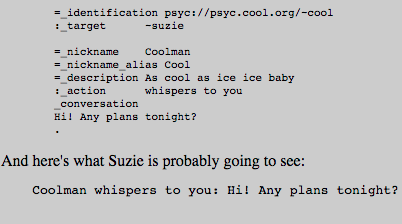

# PSYC

PSYC is a mostly text-based protocol, aiming at providing a decentralized global messaging infrastructure for unicast/multicast chatting and social media exchanging. Its goal is to replace the popular IRC protocol, which currently suffers from unscalability, lack of security and requires complex bureaucracy. This is because in IRC each server node may take responsibility over control aspects of a given network channel he participates in, adding this way unneccessary complexity and also raising security issues, like when an evil server takes the authority of the channel for malicious purposes. PSYC solves this by implementing a context master node (or well-known distributed set of nodes), that the protocol recognizes as the authority node(s). All other server nodes distributing this context to their members may perform jobs on behalf of the context master, but authority questions like allowing/banning users to/from entering the channel is always up to the master. Also, unlike current protocols like talk or msend, PSYC intends to be more people-oriented, identifying them through Uniform Network Identifications (UNI) (e.g. psyc://psyc.kanzlerant.de/~gerhard) or Uniform Network Locations (UNL) in case of a shared messaging room or conference.

## Architecture and main functions

On a top-level view, PSYC combines an IRC-like topology with the concepts of context, logical targets and packet IDs. Multiple PSYC nodes can be deployed in a tree to help in routing messages from the source to the destination, as it happens in IRC. Context slaves allow better routing options to be automatically discovered when multiple recipients ask to receive data from a given source (UNI/UNL), lowering the amount of traffic. Logical targets are the end-users to whom a given message is targeted. Finally, packet IDs allow PSYC to use redundant multicast strategies, when more than one may fit our needs. This way, duplicate packets due to multiple strategies can be caught and ignored. On a conference server, the minimalistic control module can be also used to deliver group messages in a peer to peer manner, by maintaining on each member a list of other members and how to reach them.

## Evolution to PSYC2
[//]: # (A utilização da palavra "uniform" precisa de ser clarificada. Também explicar como é obtida a chave publica. Será hash?) 
Due to the deprecated state of some key-concepts PSYC relies on, such as its uniform-based routing layer and federation architecture, the PSYC project is moving onto its second version: PSYC2. This new version combines the PSYC old message syntax with a pseudonymous routing technology which defines that an entity's address is its public key itself instead of a string in a uniform, and these public keys should be looked up in a Distributed Hash Table (DHT), avoiding this way the misunderstanding and spoofing problems that the uniform-based solution presented. Apart from that, the federation concept stated that each entity should run its own server and applications had the responsibility of connecting to the appropriate servers. This brings privacy and trust issues, since two entities exchanging messages on a server would need to trust the server owner, which generally is one of the reasons why users continued using the centralized messaging services offers instead of these free solutions. Also, there is a scalability problem due to the lack of resources on entity-owned servers. For example, an average linux-server could not efficiently distribute a multicast message to millions of recipients, in contrary to the powerful servers supporting big companies' services. To overcome these problems, PSYC developers are working on a fully-distributed end-to-end privacy-enabled solution, [secushare](http://secushare.org), a distributed social network operating on top of the public-key routing method explained above combined with PSYC messaging logic.

### Requirements Analysis

Analysis against **Messaging Node** Requirements

* [Messaging Node must support pub/sub](https://github.com/reTHINK-project/core-framework/issues/9)
  * The PSYC2 project implementation, Secushare, comes with an [API for pubsub](http://secushare.org/pubsub)

* [Messaging Node must support external authentication and Authorisation](https://github.com/reTHINK-project/core-framework/issues/10)
 * PSYC has its own authentication method, inherited in PSYC2 specification. A request_authentication_method is used to query a UNI if a given network entity is actually a linked location of that UNI. This method can have different arguments (_location, _host_IP, _nonce, _password) to help the querying entity to take a decision. However, there is no evidence in the documentation that PSYC is able to accept external authentication/authorisation methods other than this.

* [Messaging Node should require minimal computing resources](https://github.com/reTHINK-project/core-framework/issues/11)
 * The performance of PSYC has been studied, and its wiki relies on benchmarks to say that PSYC is the fastest, yet extensible text-based protocol they are aware of. However, the benchamrk results are not available at this time.

* [Messaging Node must be deployable in the most used Virtual Machines](https://github.com/reTHINK-project/core-framework/issues/12)
 * PSYC server (psyced) can currently be deployed on Linux, Mac OSX and Windows (on a Cygwin environment) systems.

* [Messaging Node must support very low message delivery latency](https://github.com/reTHINK-project/core-framework/issues/13)
 * PSYC applies some techniques in order to reduce message delivery latency. First, by avoiding negotiations between nodes "talking" the same protocol between them. Since PSYC supports IRC and XMPP, if two nodes are exchanging messages through XMPP protocol, PSYC suggests the protocol switch in order to reduce latency. Also, PSYC avoids resource discovery (disco on XMPP) by pushing information to possibly interested recipients in advance. However, by applying TLS for encrypted PSYC and techniques for DoS prevention on psyced, a certain degree of latency is, therefore, inevitable.

* [Events about clients connection / disconnection from Messaging Node](https://github.com/reTHINK-project/core-framework/issues/14)
 * PSYC currently features notification interfaces for software versioning systems (CVS and Git), syslog daemon events, MediaWiki page edits, phpBB forum events and IRC chat messages. Currently, there is no reference to notifications on clients' connection to and disconnection from messaging nodes.

* [Messaging Node should be tolerant to unstable connections](https://github.com/reTHINK-project/core-framework/issues/15)
 * TODO

* [Messaging Node deployments with carrier grade scalability](https://github.com/reTHINK-project/core-framework/issues/16)
 * TODO

* [Message delivery reliability](https://github.com/reTHINK-project/core-framework/issues/17)
 * PSYC provides three message families to inform clients about problems on message delivery. The _error method family features methods like _error_invalid, _error_illegal, _error_duplicate and informs the client of a problem occuring on his side, rather on the server side. Basically, it is the server telling a client "It's your fault, not mine". The _failure method family informs a message sender about a problem on the receiving side. This method family features methods like _failure_deliver or _failure_redirect (when a given destination changed its address). Finally, the _warning method family means that a message was processed and sent, but maybe not as intended. An example is _warning_usage, which indicates a possible mistake on the message syntax, presented on Fig. 1, and has a single variant for each of the syntax fields.

* [Message Node logging](https://github.com/reTHINK-project/core-framework/issues/18)
 * On PSYC, each server running psyced implements the concept of "log of last messages" for every UNI registered on that server. It is used to store messages received by the server, and to let every user have its last session backlog whenever he logs in. It is possible to tune the log size for each UNI and to export the chat history of a room to a webpage.

* [Message Caching](https://github.com/reTHINK-project/core-framework/issues/19)
 * PSYC does not have any reference to Store and Forward, probably because it goes against real time communication. And about caching in general, it states it's oriented towards using push events instead of caching. So, whenever a push event regarding a given resource is received by the server, anyone accessing the resource at that time will see it refresh, in order to present always the most recent version.

* [Messaging Transport Protocols](https://github.com/reTHINK-project/core-framework/issues/20)
 * Current implementations of PSYC do not support WebSockets nor HTTP Live Streaming. About HTTP Long-Polling, it does not make much sense in the context of PSYC, since it models all data distribution based on an event push system. So, whenever some potentially interesting information for a recipient is available at the server, it is automatically sent, overcoming this way the need of something like HTTP Long-Polling or even REST.

* [It should be possible to support Protocol on-the-fly](https://github.com/reTHINK-project/core-framework/issues/21)
 * The psyced implementation of PSYC has a negotiation feature of protocol switch advertising. This way, each node has information about supported protocols on all the nodes it is communicating with. However, this could be achieved, since the Client-Server API could be wrapped in a protocol stub, that can be downloaded at runtime.
