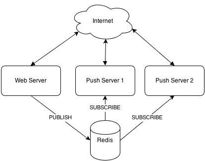

## Redis Evaluation

### Overview

In the scope of the reTHINK project Redis is a candidate technology for the Messaging Node.

From http://redis.io/:
> Redis is an open source, BSD licensed, advanced key-value cache and store. It is often referred to as a data structure server since keys can contain strings, hashes, lists, sets, sorted sets, bitmaps and hyperloglogs.

##### Highlights:

* Very Fast in memory data-store
* Usually used as Cache or MQ
* Scalable
* Supports strings, hashes, lists, sets, sorted sets, bitmaps and hyperloglogs as data structures.

### Architecture

* The main Redis architecture can be resumed as a in memory key-value data-store for service decoupling.

* Another possibility is a PubSub model with message filtering based on prefix matching.

### APIs and Bindings

#### Language Bindings

* [C, C#, C++, Clojure, Common Lisp, D Dart, Elixir, emacs, lisp, Erlang, Fancy, GNU Prolog, Go Haskell, haXe, Io, Java, Lua, Matlab, Nimrod, Node.js, Objective-C, OCaml, Perl, PHP, Pure Data Python, Rebol, Ruby, Rust, Scala, Scheme, Smalltalk, Tcl, VCL](http://redis.io/clients)

#### Other

* [webdis](https://github.com/nicolasff/webdis) A Redis HTTP interface with JSON output
* [BankersBox](https://github.com/twilio/BankersBox) A redis-like wrapper for javascript data storage
* [Bone](https://github.com/solutious/bone) Rudimentary Redis over HTTP(S)

### Requirements Analysis

Analysis against **Messaging Node** Requirements

* [It should be possible to support Protocol on-the-fly](https://github.com/reTHINK-project/core-framework/issues/21)
  * Yes
  * the Client Server API could be wrapped in a protocol stub, that can be downloaded at runtime

* [Messaging Transport Protocols](https://github.com/reTHINK-project/core-framework/issues/20)
  * No
  * An external wrapper should be used
   
* [Message Caching](https://github.com/reTHINK-project/core-framework/issues/19)
  * Yes
  * Core feature

* [Message Node logging](https://github.com/reTHINK-project/core-framework/issues/18)
  * No
  * Should be implemented externally

* [Message delivery reliability](https://github.com/reTHINK-project/core-framework/issues/17)
  * Yes
  * Atomic message processing

* [Messaging Node deployments with carrier grade scalability](https://github.com/reTHINK-project/core-framework/issues/16)
  * Yes
  * Using:
    * Clustering [Link1](http://redis.io/topics/cluster-tutorial) [Link2](http://redis.io/topics/cluster-spec)
    * Partitioning [Link1](http://redis.io/topics/partitioning)
    * Sentinel provides high availability [Link1](http://redis.io/topics/sentinel)
    * Replication [Link1](http://redis.io/topics/replication)

* [Messaging Node should be tolerant to unstable connections](https://github.com/reTHINK-project/core-framework/issues/15)
  * Partial
  * Business logic can be developed to deal with this issue

* [Events about clients connection / disconnection from Messaging Node](https://github.com/reTHINK-project/core-framework/issues/14)
  * Yes
  * Built-in

* [Messaging Node must support very low message delivery latency](https://github.com/reTHINK-project/core-framework/issues/13)
  * Yes
  * Very low usec latency [Link1](http://redis.io/topics/benchmarks)

* [Messaging Node must be deployable in the most used Virtual Machines](https://github.com/reTHINK-project/core-framework/issues/12)
  * Yes

* [Messaging Node should require minimal computing resources](https://github.com/reTHINK-project/core-framework/issues/11)
  * Yes

* [Messaging Node must support external authentication and Authorisation](https://github.com/reTHINK-project/core-framework/issues/10)
  * No

* [Messaging Node must support pub/sub](https://github.com/reTHINK-project/core-framework/issues/9)
  * Yes
  * Core functionality, including prefix filtering
