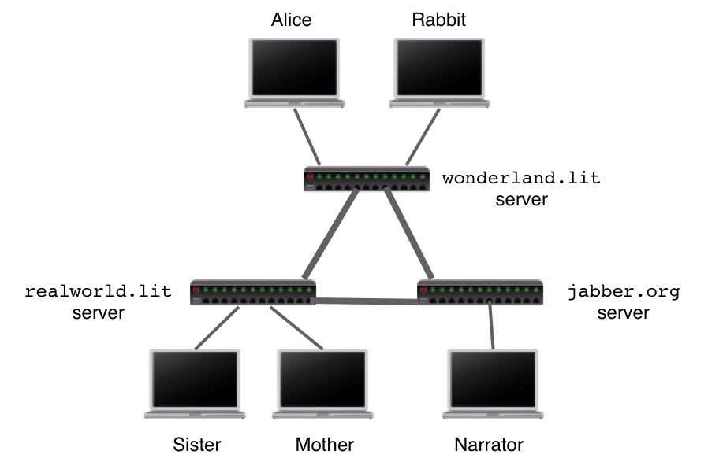
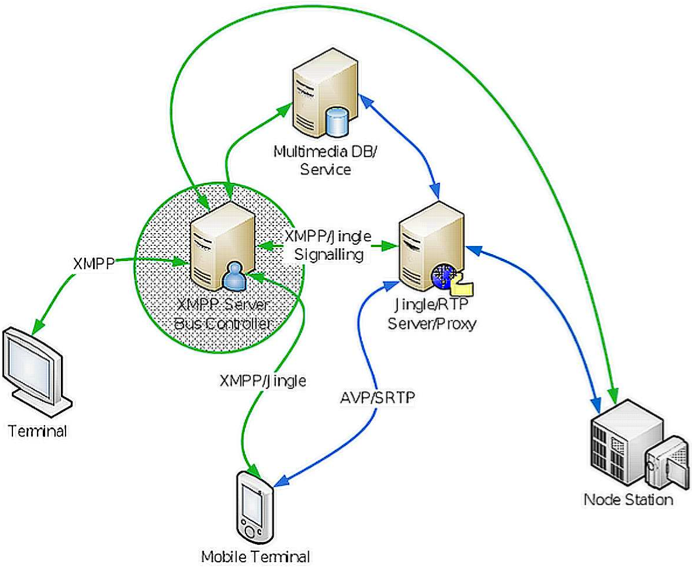

XMPP
----

From \[[27](http://xmpp.org/)\]:

> The Extensible Messaging and Presence Protocol (XMPP) is an open technology for real-time communication, which powers a wide range of applications including instant messaging, presence, multi-party chat, voice and video calls, collaboration, lightweight middleware, content syndication, and generalized routing of XML data.

### Overview

In the scope of the reTHINK project XMPP is a candidate technology for the Messaging Node.

#### Highlights:

-	**Open** - the XMPP protocols are free, open, public, and easily understandable; in addition, multiple implementations exist in the form clients, servers, server components, and code libraries.

-	**Standard** - the Internet Engineering Task Force (IETF) has formalized the core XML streaming protocols as an approved instant messaging and presence technology. The XMPP specifications were published as RFC 3920 and RFC 3921 in 2004, and the XMPP Standards Foundation continues to publish many XMPP Extension Protocols. In 2011 the core RFCs were revised, resulting in the most up-to-date specifications (RFC 6120, RFC 6121, and RFC 6122).

-	**Proven** - the first Jabber/XMPP technologies were developed by Jeremie Miller in 1998 and are now quite stable; hundreds of developers are working on these technologies, there are tens of thousands of XMPP servers running on the Internet today, and millions of people use XMPP for instant messaging through public services such as Google Talk and XMPP deployments at organizations worldwide.

-	**Decentralized** - the architecture of the XMPP network is similar to email; as a result, anyone can run their own XMPP server, enabling individuals and organizations to take control of their communications experience.

-	**Secure** - any XMPP server may be isolated from the public network (e.g., on a company intranet) and robust security using SASL and TLS has been built into the core XMPP specifications. In addition, the XMPP developer community is actively working on end-to-end encryption to raise the security bar even further.

-	**Extensible** - using the power of XML, anyone can build custom functionality on top of the core protocols; to maintain interoperability, common extensions are published in the XEP series, but such publication is not required and organizations can maintain their own private extensions if so desired.

-	**Flexible** - XMPP applications beyond IM include network management, content syndication, collaboration tools, file sharing, gaming, remote systems monitoring, web services, lightweight middleware, cloud computing, and much more.

-	**Diverse** - a wide range of companies and open-source projects use XMPP to build and deploy real-time applications and services; you will never get “locked in” when you use XMPP technologies.

### Architecture

A typical XMPP network consists of several Servers/Domains connected together. The mechanism is similar to email where the servers are used as relays for the messages. Every entity on the XMPP network is addressed using a JabberID (JID). It has the form : username@domain/resource where domain is the domain name of the XMPP server, and username identifies an account on that server.

Image Source: [https://el-tramo.be](https://el-tramo.be/documents/beautiful-xmpp-testing/)

Server can have adapters/gateways to be able to talk to other protocols such as those used by ICQ, AIM, Yahoo and others.

Image Source: [https://en.wikipedia.org](https://en.wikipedia.org/wiki/XMPP)

Sometimes the servers are used only for signaling, in order to establish a media connection. [XEP-0166: Jingle](http://xmpp.org/extensions/xep-0166.html) is a protocol extension for initiating and managing peer-to-peer media sessions between two XMPP entities.

Image Source: [http://xmppjingle.blogspot.pt](http://xmppjingle.blogspot.pt/2010/09/jingle-nodes-proxy-and-eu-surveillance.html)

### APIs, Bindings and Extensions

#### APIs

Code libraries are available for many different programming languages, thus enabling developers to build a wide variety of XMPP-enabled applications. Further information is provided in \[[64](https://xmpp.org/xmpp-software/libraries/)].

#### Relevant Extensions

-	[XEP-0166: Jingle](http://xmpp.org/extensions/xep-0166.html) Protocol extension for initiating and managing peer-to-peer media sessions (e.g., voice chat, video chat, file transfer) with a wide variety of transport methods (e.g., TCP, UDP, ICE, application-specific transports)

-	[XEP-0343: Signaling WebRTC datachannels in Jingle](http://xmpp.org/extensions/xep-0343.html) Defines how to use the ICE-UDP Jingle transport method to send media data using WebRTC DataChannels.

-	[XEP-0060: Publish-Subscribe](http://www.xmpp.org/extensions/xep-0060.html) Protocol extension for generic publish-subscribe functionality

-	[XEP-0045: Multi-User Chat](http://xmpp.org/extensions/xep-0045.html) Protocol extension for multi-user text chat.

-	[XEP-0072: SOAP Over XMPP](http://www.xmpp.org/extensions/xep-0072.html) Defines methods for transporting SOAP messages over XMPP

-	[XEP-0124: Bidirectional-streams Over Synchronous HTTP (BOSH)](http://xmpp.org/extensions/xep-0124.html) bidirectional TCP connection between two entities (such as a client and a server) by efficiently using multiple synchronous HTTP request/response pairs.

-	[XMPP over WebSocket](http://tools.ietf.org/html/rfc7395) Binding for the XMPP protocol over a WebSocket transport layer. It provides higher performance than the current HTTP binding for XMPP.

-	[XEP-0030: Service Discovery](http://xmpp.org/extensions/xep-0030.html) Protocol extension for discovering information about other XMPP entities.

### Requirements Analysis

Analysis against **Messaging Node** Requirements

-	[It should be possible to support Protocol on-the-fly](https://github.com/reTHINK-project/core-framework/issues/21)

	-	Depends on Solution

-	[Messaging Transport Protocols](https://github.com/reTHINK-project/core-framework/issues/20)

	-	Depends on solutions

-	[Message Caching](https://github.com/reTHINK-project/core-framework/issues/19)

	-	Yes
	-	Using [XEP-0203: Delayed Delivery](http://xmpp.org/extensions/xep-0203.html)

-	[Messaging Node logging](https://github.com/reTHINK-project/core-framework/issues/18)

	-	Yes
	-	Using [XEP-0313: Message Archive Management](http://xmpp.org/extensions/xep-0313.html) and [XEP-0136: Message Archiving](http://xmpp.org/extensions/xep-0136.html)

-	[Message delivery reliability](https://github.com/reTHINK-project/core-framework/issues/17)

	-	Yes
	-	Using [XEP-0184: Message Delivery Receipts](http://xmpp.org/extensions/xep-0184.html) and/or [XEP-0079: Advanced Message Processing](http://xmpp.org/extensions/xep-0079.html)
	-	[More info](http://www.isode.com/whitepapers/reliable-xmpp.html)

-	[Messaging Node deployments with carrier grade scalability](https://github.com/reTHINK-project/core-framework/issues/16)

	-	Depends on solutions
	-	Using scalable Erlang-based servers [mongooseim](https://www.erlang-solutions.com/products/mongooseim-massively-scalable-ejabberd-platform) or [ejabberd](http://docs.ejabberd.im/architect/) clusters can handle tens of millions of users.

-	[Messaging Node should be tolerant to unstable connections](https://github.com/reTHINK-project/core-framework/issues/15)

	-	Depends on solutions
	-	If Using [XEP-0198: Stream Management](http://xmpp.org/extensions/xep-0198.html)
	-	[More info](http://www.isode.com/whitepapers/reliable-xmpp.html)

-	[Events about clients connection / disconnection from Messaging Node](https://github.com/reTHINK-project/core-framework/issues/14)

	-	Depends on solutions

-	[Messaging Node must support very low message delivery latency](https://github.com/reTHINK-project/core-framework/issues/13)

	-	Yes
	-	[ms latency](https://www.ejabberd.im/benchmark)

-	[Messaging Node must be deployable in the most used Virtual Machines](https://github.com/reTHINK-project/core-framework/issues/12)

	-	Yes

-	[Messaging Node should require minimal computing resources](https://github.com/reTHINK-project/core-framework/issues/11)

	-	Depends on solutions
	-	Servers based on C libraries can run on embedded systems

-	[Messaging Node must support external authentication and Authorisation](https://github.com/reTHINK-project/core-framework/issues/10)

	-	Yes
	-	Using [XEP-0178: Best Practices for Use of SASL EXTERNAL](http://xmpp.org/extensions/xep-0178.html)

-	[Messaging Node must support pub/sub](https://github.com/reTHINK-project/core-framework/issues/9)

	-	Yes
	-	Using [XEP-0060: Publish-Subscribe](http://www.xmpp.org/extensions/xep-0060.html)
