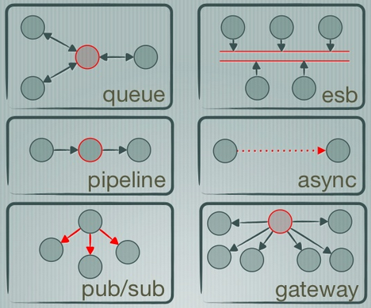

## ZeroMQ Evaluation

### Overview

In the scope of the reTHINK project ZeroMQ [65] is a candidate technology for the Messaging Node.

It is a  high-performance, low level, asynchronous messaging library originally written in C++, that now has multiple native Implementations.
It is used as a thin layer between the application and transport layers.

##### Highlights:

* Connect your code in any language, on any platform. 40+ Language Bindings
* Carries messages across inproc, IPC, TCP, TIPC, multicast.
* Smart patterns like pub-sub, push-pull, and router-dealer can be combined together to form powerful architectures.
* High-speed asynchronous I/O engines, in a tiny library ((20k lines of C++)).
* Backed by a large and active open source community.
* Supports every modern language and platform.
* Any architecture: centralized, distributed, small, or large.
* Multicore Optimized
* Automatic TCP (re)connect
* Fast: 8M msg/sec, usec latency
* Faster than TCP, for clustered products and supercomputing
* Fast for development thanks to many useful abstraction layers, native languages, bindings and huge open source community.

### Architecture
The following figure represents the six basic types of communication patterns that ZeroMQ supports.

Image Source: [http://www.slideshare.net](http://www.slideshare.net/IanBarber/zeromq-is-the-answer)

#### Built-in core ZeroMQ patterns
* Request-reply: connects a set of clients to a set of services. This is a remote procedure call and task distribution pattern.
* Pub-sub: connects a set of publishers to a set of subscribers. This is a data distribution pattern.
* Pipeline: connects nodes in a fan-out/fan-in pattern that can have multiple steps and loops. This is a parallel task distribution and collection pattern.
* Exclusive pair: connects two sockets exclusively. This is a pattern for connecting two threads in a process, not to be confused with "normal" pairs of sockets.

On top of the built-in core ZeroMQ patterns high-level messaging patterns are defined [here](http://zguide.zeromq.org/page:all). They are not part of the core library, do not come with the ZeroMQ package, and exist in their own space as part of the ZeroMQ community. For example the Majordomo pattern ([Reliable Request-Reply Patterns](http://zguide.zeromq.org/page:all#reliable-request-reply)), sits in the GitHub Majordomo project in the ZeroMQ organization.
One of the things that ZeroMQ also aims to provide is a set of high-level patterns, both small (how to handle messages sanely) and large (how to make a reliable pub-sub architecture).

These can be used as "fabric" to make very powerful architectures. The next image shows an example of this modularity. [A pub/sub multi-cluster Architecture](http://zguide.zeromq.org/page:all#Scaling-to-Multiple-Clusters)

Image Source: [http://zguide.zeromq.org](http://zguide.zeromq.org/page:all#Scaling-to-Multiple-Clusters)

The internal Architecture in more detail can be found [here.](http://zeromq.org/whitepapers:architecture)

### APIs and Bindings

#### Native Implementations of the library

* [C/C++](https://github.com/zeromq/libzmq) represents the State of the Art.
* [Java](https://github.com/zeromq/jeromq) JeroMQ. Fully compatible at both API and protocol level but sans encryption or PGM. _what is PGM?_
* [.NET](https://github.com/zeromq/netmq) same constraints as JeroMQ
* [Erlang](https://github.com/zeromq/ezmq)
* [Python](https://github.com/caedesvvv/zmqproto)
* [C](https://github.com/zeromq/libzmtp) designed for small devices you would not normally expect messaging technology to fit
* [Netty](https://github.com/spotify/netty-zmtp)

#### Language Bindings
 * [Ada, C, Chicken Scheme, Common Lisp, C#(.NET & Mono), C++, D, delphi binding, Eiffel, Erlang, F#, Felix, Flex (ActionScript), Fortran77, Go, Guile, Haskell, Haxe, Java binding, JavaScript (Flash), Julia, LabVIEW, Lua bindings, Nimrod, Node.js, Objective-C, Objective Caml binding, ooc, Perl s, PHP binding, Python binding, Q, Racket, R, RE, RE, Red, Ruby, Ruby(FFI), Scala, Smalltalk, Tcl, Twisted (Python), XPCOM](http://zeromq.org/bindings:_start), and more [on github.com](https://github.com/search?utf8=%E2%9C%93&q=zmq&type=Repositories&ref=searchresults)

#### Web Clients/Servers

* [JSMQ](https://github.com/zeromq/JSMQ) JavaScript client for ZeroMQ/NetMQ over WebSockets
* [NullMQ](https://github.com/progrium/nullmq) ZeroMQ semantics in the browser [Link1](http://www.slideshare.net/progrium/nullmq-pdx) [Link2](http://avalanche123.com/blog/2012/02/25/interacting-with-zeromq-from-the-browser/)
* [ZmqSocket.js](http://zeromq.org/bindings%3ajavascript) talk to zmq sockets from your JavaScript code.
* [SockJSProxy](https://bitbucket.org/vladev/sockjsproxy/) a simple proxy server that proxies message from SockJS to a ZeroMQ.
* [Zerogw](https://github.com/tailhook/zerogw) HTTP to zeromq gateway
* [XARP](http://rfc.zeromq.org/spec:40) (Draft) Extensible Resource Access Protocol (XRAP), a RESTful protocol built over ZeroMQ
* [Zato](https://zato.io/docs/index.html)  ESB, SOA, REST, APIs and cloud integrations
* [Malamute](https://github.com/miska/malamute) All the enterprise messaging patterns in one box.

[ZeroMQ API Reference](http://api.zeromq.org/)

[Other Projects](http://zeromq.org/docs:labs)

### Requirements Analysis

Analysis against **Messaging Node** Requirements

* [It should be possible to support Protocol on-the-fly](https://github.com/reTHINK-project/core-framework/issues/21)
  * Yes
  * the Client Server API could be wrapped in a protocol stub, that can be downloaded at runtime

* [Messaging Transport Protocols](https://github.com/reTHINK-project/core-framework/issues/20)
  * Yes
  * Has support for JavaScript and WebSockets using:
    * [JSMQ](https://github.com/zeromq/JSMQ)
    * [NullMQ](https://github.com/progrium/nullmq)
    * [ZmqSocket.js](http://zeromq.org/bindings%3ajavascript)
    * [SockJSProxy](https://bitbucket.org/vladev/sockjsproxy/)
    * [Zerogw](https://github.com/tailhook/zerogw)
    * [XRAP](http://rfc.zeromq.org/spec:40)
    * [Zato](https://zato.io/docs/index.html)
   
* [Message Caching](https://github.com/reTHINK-project/core-framework/issues/19)
  * Yes
  * Using the [Titanic Service Protocol](http://rfc.zeromq.org/spec:9)

* [Messaging Node logging](https://github.com/reTHINK-project/core-framework/issues/18)
  * Yes
  * Using the [Titanic Service Protocol](http://rfc.zeromq.org/spec:9)

* [Message delivery reliability](https://github.com/reTHINK-project/core-framework/issues/17)
  * Yes
  * Using [Reliable Patterns](http://zguide.zeromq.org/page:all#Chapter-Reliable-Request-Reply-Patterns)

* [Messaging Node deployments with carrier grade scalability](https://github.com/reTHINK-project/core-framework/issues/16)
  * Yes
  * Using scalable patterns such as a [brokerless design](http://zeromq.org/whitepapers:brokerless)
  * 9,5 Million Messages / second were benchmarked on a 16 core machine[Link1](http://zeromq.org/results:0mq-tests-v03) [Other Tests](http://zeromq.org/results:_start)

* [Messaging Node should be tolerant to unstable connections](https://github.com/reTHINK-project/core-framework/issues/15)
  * Partial
  * Business logic can be developed to deal with this issue

* [Events about clients connection / disconnection from Messaging Node](https://github.com/reTHINK-project/core-framework/issues/14)
  * Yes

* [Messaging Node must support very low message delivery latency](https://github.com/reTHINK-project/core-framework/issues/13)
  * Yes
  * Very low usec latency

* [Messaging Node must be deployable in the most used Virtual Machines](https://github.com/reTHINK-project/core-framework/issues/12)
  * Yes

* [Messaging Node should require minimal computing resources](https://github.com/reTHINK-project/core-framework/issues/11)
  * Yes
  * ZeroMQ runs on everything of interest, from 32KB embedded chips to z/OS mainframes running IBM dialects of Unix. [Link](http://zeromq.org/docs:features)

* [Messaging Node must support external authentication and Authorisation](https://github.com/reTHINK-project/core-framework/issues/10)
  * Yes
  * Implemented:
    * [ZAP - ZeroMQ Authentication Protocol (PAM, LDAP, Kerberos, passwd, etc)](http://rfc.zeromq.org/spec:27)
    * CurveZMQ Authentication and Encryption Protocol [Link1](http://curvezmq.org/) [Link2](http://rfc.zeromq.org/spec:26)
    * [GSSAPI (Kerberos)](http://rfc.zeromq.org/spec:38) or [CURVE](http://curvezmq.org/)
    * [SRP](http://rfc.zeromq.org/spec:34)
  * Supports the ability to be extended

* [Messaging Node must support pub/sub](https://github.com/reTHINK-project/core-framework/issues/9)
  * Yes
  * Using the [ZeroMQ Publish-Subscribe Pattern](http://rfc.zeromq.org/spec:29)
