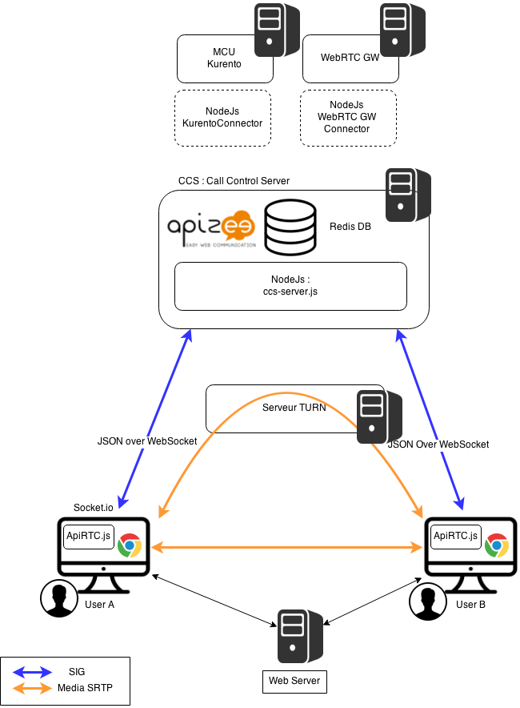

### apiRTC
#### What is ApiRTC?

ApiRTC is the communication platform developped by Apizee. This includes a communication platform and a client JavaScript library that can be used by developpers to developped their own applications without having to consider the technical aspects of communication.

#### Features Overview

ApiRTC Entreprise edition includes following features :

**Session :**

Connexion : long polling , webSocket
HTTP, HTTPS
Presence : group connection and subscription
Custom User Data sharing
Browsers type and version detection

**IMClient :**

Instant Messaging 1 to 1, Group

**WebRTC Client :**

Voice Calls
Voice and Video Calls
ScreenSharing
TakeSnapshot
Audio, video mute
Support of IE and Safari for audio and video calls through a plugin 
Network disconnection detection
Network traversal management for media flows
DataChannel
Calls recording
Connection to IMS, RCS, SIP Architecture
Conference calls

**Data Client :**

Custom data sending and reception

**Compatibility :**

PC, OSx throught webRTC compatible browsers
Plugin for Android and iOS application development

#### Architecture Overview

**Messaging Node :** NodeJs + Redis Cluster

NodeJs : https://nodejs.org/ - Description is available : http://en.wikipedia.org/wiki/Node.js
Redis : http://redis.io/ - Description is available : http://en.wikipedia.org/wiki/Redis

**Runtime / Framework :** ApiRTC CE Client

#### Architecture

ApiRTC actual architecture is presented on following diagram :

Components such as NodeJs, Redis or socket.io are used.
ApiRTC uses JSON over WebSocket to manage signalling between clients and server.

#### Role in Rethink

apiRTC can be used in a nodejs based Messaging Node. 

Integration of ApiRTC in Rethink can be done by adding differents connectors depending of needs :
- Identity Management : connector to Identity server
- QoS Management : connector to QoS server
- Other Web communication platform : connector to communication platform using ProtOFly
- VoIP Platform : Connector to WebRTC GW 
- Connector to Media Servers

A Redis Cluster with Pub/Sub mechanism can be used to manage communications between connectors

    

For Rethink, Apizee propose the usage of apiRTC Community Edition (Open source version : LGPL). This version is not yet published and documented.

Complete version of ApiRTC is described on www.apirtc.com

                                                                           
#### APIs

*needs elaborate *
ApiRTC provides API for developers

#### Requirements Analysis

*Analyse how the solution fullfills [WP3 requirements](selection-criteria.md) according to Component Type addressed by the solution ie Messaging Node, Runtime, Network QoS or Framework*
*The fullfillment of each requirement should be analysed and if needed validated with some tests. Code snippets or other means like configuration data should be provided to clearly demonstrate the requirement fullfilment.
In case the Requirement is not fulfilled, possible solutions should be proposed including effort estimation.*

Analyse regarding WP3 requirements :
TO BE COMPLETED

