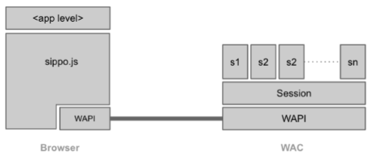

### Sippo

#### What is Sippo?

Sippo is the name of a WebRTC product family authored by Quobis which includes the following products: - Sippo WebRTC Application Controller: the server which provides the services. - Sippo WebRTC Apps: reference web applications which leverage the main features provided why the WAC. Two examples: - Sippo WebCollaborator: Reference enterprise WebRTC softphone - Sippo Click To Call: Reference customer contact WebRTC softphone

#### What is a “WebRTC Application Controller”?

Sippo WebRTC Application Controller (WAC, in short) is a solution that allows to deploy WebRTC applications fully-interconnected with existing services (AAA, OSS, BSS, etc.) and legacy VoIP or UC systems.

Sippo WAC supports a number of business cases, through its APIs, ranging from a simple click-to-dial button to advanced scenarios like RCS-based services, integration with existing Web Portals (including Facebook, Twitter or GMail), Banking, Health, Logistics, call centers/CRMs, UC, etc.

Sippo is standards compliant and has been designed and developed by engineers who participate in WebRTC standardization forums like W3C, IETF, 3GPP, SIPForum and GSMA. Thanks to its abstraction layer, Sippo can include new signaling modules rapidly or even use different signaling protocols within the same application (e.g. one signaling protocol for audio/video, another for IM/presence, etc.).

Sippo WAC is the right tool to develop, adapt or deploy any WebRTC tool in a SDN, in the case of telcos, or corporate architecture, with the security that it is going to be interoperable with the existing services and WebRTC gateways. In addition it provides features to manage user provisioning, store call detail records and provides contextual information

Sippo has been developed by Quobis and it's distributed worldwide through a network of first-class partners and UC vendors.

#### Reference architecture

Sippo WAC is a network component which sits on the edge of the network, in close collaboration with the WebRTC gateway. The following picture describes how the WAC fits into a service provider or enterprise voice network:

The following network elements are the basic ones to understand the reference architecture (from right to left):

-	Service Provider Network: this block represents the existing UC platform owned by the enterprise (where we might find a corporate PBX) or service provider (where we might find an IMS core or a Class 4/5 softswitch). In the latter case we will also find OSS/BSS systems and other identity management platforms that interact with Sippo in some way.

-	Third-party WebRTC gateway: in some cases where the UC core does not support WebRTC traffic, there is a need for a WebRTC gateway which takes care of the translation of both the signaling and media plane. Signaling can be standard based (like SIPoWS) or a vendor-specific signaling protocol. The WebRTC gateway can be a standalone network element or it can be a functionality embedded into an existing network element like a SBC or an application server. Sippo excels in interoperability with leading gateway vendors thanks to its award-winning abstraction layer, please consult your sales manager for a complete list of supported vendors.

-	WebRTC Application Controller (WAC): this is the network element where the WebRTC applications are deployed and managed. Applications are downloaded to the browser from the WAC vía HTTP, while the actual media and signaling traffic goes to the customer network through the WebRTC gateway. Sippo runs on a dedicated server which can be installed at the customer premises or in the cloud.

-	Web browsers: the WebRTC applications are downloaded into the web browser after the user has been authenticated. From the point of view of the end-user, this is the only application that he/she will need to use. Sippo applications needs to have HTTP connectivity with the WAC and with the WebRTC gateway.

In a real deployment there are a number of additional network elements involved such a Session Border Controller, firewalls, STUN/TURN servers, SIP routers, etc… which will interact in some way with the WebRTC services and applications.

#### Understanding the role of a WebRTC Application Controller

The term “WebRTC Application Controller” has been coined by Quobis after our experience deploying WebRTC projects in large service providers all around the world. In a real setup, there are a number of features that are not meant to be provided by the service provider network, the WebRTC gateway or the browser (for example, authentication, identity management or security).

Sippo brings to the market a rich set of features which speeds up the deployment of WebRTC into existing networks, as for example:

-	Multi signaling mechanisms
	-	SIP over WebSockets (RFC 7118)
	-	JSON-based APIs
	-	REST-based APIs
-	Identity Management
-	User provisioning
-	Security Control
-	Policy Control
-	Statistics and logging
-	Address book synchronization
-	Browser abstraction layer

Besides those features, Sippo provides sippo.js, a ORCA.js (http://www.orcajs.org) compatible API for application developers hiding all the complexities of WebRTC signaling and media, hence enabling applications to be developed once and run in different devices, browsers and network environments.

Along with Sippo, Quobis has developed a number of WebRTC applications for specific verticals such as the Sippo Web Collaborator, Sippo Click to Call or Sippo GMail Toolbar.

#### Sippo interfaces and API’s

Sippo offers a set of different API’s and service interfaces that are summarised in the picture below:

##### Sippo.js API

Sippo.js is a JavaScript API that is downloaded to the user’s browsers, thus containing all the signaling stacks and WebRTC media API calls. Sippo applications are built on top of this sippo.js API and it can also be used by third-party developers to code their own client applications.

Sippo.js API supports a complete set of signaling stacks, including both standards-based (like SIPoWS, authored by Quobis at RFC7118) and vendor-specific ones. That means that the applications built on top of the Sippo.js API are capable of communicating with different gateways from different vendors without changing the code. That’s one of the benefit of using Sippo.js API as it hides the complexity of the underlying signaling plane and provides a single and simple-to-use JavaScript API to the applications.

##### Sippo Service API (SAPI)

Sippo Service API (SAPI) is a REST API which allows to connect Sippo WAC to different elements from the operator’s core and access network. This API can play both client-role and server-role to integrate the Sippo WAC and the WebRTC applications into the core.

SAPI is used in server-role between the WebRTC gateway and the WAC. It can be used for Identity Management (IdM) checks as part of the authentication process and check the permission set of the subscriber. When a some requests reach the WebRTC Gateway from a WebRTC Application, the gateway in turn verify the identity of the subscriber using the WebRTC application by sending an IdM request to the WAC through the SAPI.

##### Sippo connectors

Some of the Sippo features requires to connect to external services or to behave as a server to third party platforms. Some of those features are exposed to the sippo.js API while others are internal to the Sippo core.

Sippo connectors available so far in this version are:

-	LDAP connector: Sippo can synchronize with an external LDAP server to retrieve contact lists, phone numbers and related information.
-	Vendor-specific connectors: Sippo provides specific connectors for some features provided by the gateway vendors. The details of each connector is described in the joint application notes issued by Quobis and each vendor, please contact your sales representative for more information. The configuration of these connector is described in annex documents to this guide.

##### Sippo WebRTC API (WAPI)

This is an internal API offered by the Sippo WAC to the client applications, and it’s not intended to be used by third parties. This API basically interchanges messages between the application and the WAC using WebSockets (JSONoWS) or HTTP.

#### Sippo internals: services and backends

This explains some basic concepts of the Sippo architecture, in order to understand how to properly configure the controller and all the services provided and also how the different sippo.js API calls are interpreted and managed from the WAC depending on the configuration.

There are two key concepts to understand the internal architecture of Sippo: services and backends. A service is a functionality provided by the WAC, whereas a backend is a implementation of a specific service. In other words, we can say that a services is “what” to do and the backend is “how” to do it.

There are thirty-three available services at Sippo WAC that are listed alphabetically in the table below. Some of those services have a 1-to-1 implementation at sippo.js API calls while others are internals and not exposed to the end user, but are explained here for completeness.

#### 1.7. Sippo WebRTC applications

Services providers and enterprises can deploy their own WebRTC applications using Sippo WAC, developed by using the existing Sippo JavaScript API sippo.js (which includes the Sippo Abstraction Layer) and also making use of all the Sippo services like authentication, contacts, etc…

Every Sippo application needs to run connected to a Sippo WAC, as some of the features are not implemented on the browser but on the WAC.At the current Sippo version, both the applications and the sippo.js libreries must be hosted and donwloaded from the WAC. This is mandatory on this current version. Please note that, in this scenario, some cross-domain issues may arise. Please contact Quobis system engineering department for more information on this topic.

Communication between the WebRTC applications running on the browser and the Sippo WAC is done by using the WAPI interface, which dispatches the incoming messages to the corresponding services, as shown in the picture below:

#### Potential integration with Wonder proposal

##### About signaling-on-the-fly

The WONDER JavaScript Framework was designed and implemented to address the lack of a standard WebRTC signalling protocol by implementing the novel Signalling On-the-Fly concept, enabling seamless interoperability between different WebRTC Service Provider domains.

The WONDER library assumes there won’t be a standard WebRTC signaling protocol to give developers the freedom to select (or invent) the protocol that better suits WebRTC Application needs and, at the same time, standardization tasks effort are minimized, shortening innovation to market timing. This means, the message server and associated protocol stack can be selected, loaded and instantiated during runtime. Such characteristic enables signaling protocols selected per WebRTC Conversation to ensure full Signaling interoperability among peers using Triangle based Network topologies. Such mechanism we call Signalling on-the-fly.

##### Signaling-on-the-fly versus multi-signaling support

The Sippo WebRTC Application Controller tries to hide the complexity on vendors thanks to the support of different signaling stacks. This means that while a web client is making a request to the WAC to have access to a WebRTC application, the WAC adapts the JS code of the application to the type of gateway to use the signaling protocol that the gateway is supporting.

The Sippo WAC has a mechanism to deal with different gateways (including those from different vendors) in an active way, so high availability and scalability can be achieved with no need to use a load balancer for the gateways. It’s important to mention that he Sippo WAC does not manage real time traffic as this goes from the browser to the other browser (or to the gateway in case of interconnection with legacy networks).

In order to leverage the result and proposals of Wonder around signaling on the fly we can explore the possibility to move to the application (and browser) the complexity of selection the signaling for the call (now the abstraction layer is part of the WAC, as described in section 1.5) or try to adapt the Sippo WAC to manage the rehydration of signaling of the clients during a call or session.

The WAPI, as the API that interchanges messages between the application and the WAC using WebSockets (JSONoWS) or HTTP, can play an active role in both options to manage this approach.

#### Requirements Analysis

Sippo.js provides a high level abstraction layer which allow to build WebRTC applications in an easy and quick way. Sippo.js supports many signaling protocols for WebRTC and can be used with WebRTC gateways from many vendors. This is possible thanks to it implements a static-flavor of the protocol-of-the-fly approach used in reTHINK project. This was identitified in the early stages of WebRTC as a need to deal with the signaling diversity in the WebRTC arena. Sippo.js can be adapted to be an intermediate layer between the hyperty and the web application hidding all the innecesary complexity to te developer. This will also allow that all the applications already build over Sippo.js can be used in reTHINK reducing considerably the integration costs.
