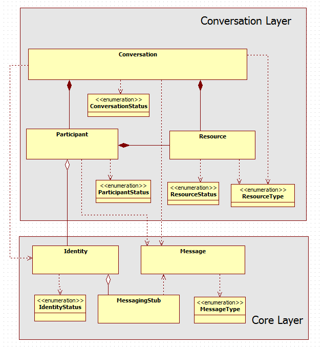

## WONDER Project

### Overview

The main motivation of the [OpenLab WONDER experimentation project](http://hypercomm.github.io/wonder/) [32] was to experiment and evaluate some of the P2252 Eurescom Study recommendations.
WONDER evaluated whether to use IMS to deliver services to WebRTC endpoints or to use a more disruptive pure Web based approach to deliver services to WebRTC endpoints.

For the second option WONDER has enlightened some paths to be followed in a post-IMS era dominated by Web technologies and large eclectic cooperative eco-systems. 
The novel [Signalling On-the-fly (SigOfly)](http://ieeexplore.ieee.org/xpl/articleDetails.jsp?arnumber=7073799&filter%3DAND(p_IS_Number%3A7073795)) concept was conceived and successfully demonstrated to address the lack of a standard WebRTC signalling protocol. 
The SigOfly concept enables seamless interoperability between different WebRTC service domains avoiding NNI interfaces by using peer side APIs and restful push notification services. 

WONDER experimentation involved Portugal Telecom and Deutsche Telekom. 

### SigOfly Concept

The SigOfly concept leverages the use of scripts (JavaScript) by WebRTC Applications to implement signalling protocol stacks. This means, the signalling protocol stack can be selected, loaded and instantiated during runtime. 
Such characteristic enables signalling protocols to be selected per WebRTC Conversation to ensure full signalling interoperability among peers using Triangle based Network topologies. 
The SigOfly procedures should be applied at the end-user client to benefit from WebRTC model.
However, the concept is also feasible between Messaging Servers supporting JavaScript execution engines (e.g. Node.js or vertx.io). 

Before the SigOfly concept is described in detail, some terms require a definition:

**Messaging Server:** the server that supports the exchange of signalling messages required for the establishment of WebRTC sessions. Each Messaging Server belongs to a domain;

**Domain Channel:** the signalling channel that is established with domain’s messaging server as soon as a domain‘s user is registered and is online;

**Transient Channel:** the signalling channel that is established, typically with a foreign messaging server (i.e. from another domain) in scope of a inter-domain conversation;

**Messaging Stub:** the script containing the protocol stack and all the logic needed to establish a channel to a certain Messaging Server;

**Conversation Hosting Messaging Server:** is the Messaging Server that is used to support the exchange of all signalling messages among peers belonging to different domains.
The Hosting peer uses the Domain Channel to exchange signalling messages, while other peers use Transient Channels that connect to the Hosting Messaging Server.


The classic Alice and Bob example is used to explain the SigOfly concept. We assume that Alice and Bob are registered in different Service Provider domains having each one a Domain Channel established with their own Messaging Server (see Fig. below). In case Alice wants to talk to Bob by using Bob’s WebRTC identity e.g. bob@domain.com, the following steps will be performed:

Step 1: Information about the Identity of Bob, including Bob’s Messaging Stub provider, is provided and asserted by Bob’s Identity Provider (IdP).

Step 2: Alice downloads and instantiates Bob’s Messaging Stub in her browser to setup a Transient Channel with Bob’s domain Messaging Server.

Step 3: As soon as the Transient Channel is established, Alice can send an Invitation message to Bob containing her Session Description Protocol (SDP) based communication offer.

Step 4: Since Bob is connected in the same Message Server via his Domain Channel, he will receive Alice’s invitation in his Browser. If Bob accepts the invitation, an Accepted message containing Bob SDP response will be send to Alice.

Step 5: As soon as Alice’s browser receives Bob’s SDP, the media and/or data streams can be directly connected between the two browse

It should be noted that SigOfly does not directly address identity management aspects but aims to be compliant with ongoing WebRTC Identity Management work from W3C and IETF, mainly by extending RTCIdentityAssertion to also include the assertion of MessagingStubs. This means, Alice and Bob authentication is done outside SigOfly procedures, described above, which are agnostic of the IdP and authentication protocols used. 


The SigOfly concept is also applicable in use cases where conversations are hosted by calling parties, in multiparty conversations or to support interoperability with legacy networks (e.g. IMS and PSTN). 

#### Data Codec On-the-fly

In addition, the SigOfly principle is also applied to address Data Channel Services Interoperability, to conceive another novel concept called “Data Codec On-the-fly”. the “Data Codec On-the-fly” concept ensure all peers are using the same protocol on top of the Data Channel. A Data Codec is a JavaScript library that implements a data communication processing algorithm to code and send data to the Data Channel and to receive and decode data from the Data Channel. As with Messaging Stubs in the SigOfly concept, Data Codecs are downloaded and instantiated by peers according to URLs identified in Conversation setup or update signalling messages

Further information about SigOfly and Data Codec On-the-fly is provided in [34](https://github.com/hypercomm/wonder/wiki/Signalling-on-the-fly).

### WONDER Library

A JavaScript framework, the WONDER lib, was designed and implemented to validate the SigOfly and Data Codec On-the-fly concepts. 



Main WONDER library classes are:

*	The Identity, representing a user and containing all information needed to support Conversation services.
This also includes the service endpoint to retrieve the protocol stack (Messaging Stub) which will be used to establish a signalling channel with the Messaging Server of the Identity domain. The Identity entity extends the current Identity concept defined by W3C to support seamless interoperability by using the SigOfly mechanism.
*	The MessagingStub implementing the protocol Stack used to communicate with a certain Messaging server.
*	The Conversation class managing all participants including the setup, update or close of media and data connections.
*	The Participant class, handling all operations needed to manage the participation of an Identity (User) in a conversation including the WebRTC PeerConnection functionalities. The Local Participant is associated with the Identity that is using the Browser while the Remote Participant is associated to remote Identities (users) involved in the conversation.
*	The Resource class representing the digital assets that are shared among participants in the conversation including participants’ voice, video, screens, photos, video Clips, music clips, documents, etc. These assets are usually managed by the Participant that owns it. For local participants assets are sent (e.g. WebRTC outgoing stream tracks) while for remote participants assets are received (e.g. WebRTC incoming stream tracks). Some Resource types like Chat are not managed by a Participant but by the Conversation.
*	The Data Codec, which  is used by Resources that are shared on top of the Data Channel, like file sharing and Textual Chat, to decode and encode the data in a consistent way by all the peers. The Data Codec may also be downloaded on-the-fly by the peers.
*	The Message, which is used to exchange all data needed to setup, update and close media and data connection between peers via the Messaging Server. It may also be used for other purposes e.g. presence information management. Each message is comprised by a Header and a Body. 

The [API documentation](https://raw.githack.com/hypercomm/wonder/master/docs/api/index.html) and the [source code](https://github.com/hypercomm/wonder/tree/master/src/libs) were published in a public github repository [35][36] .

### Input to reTHINK

WONDER Library can be used in reTHINK in different ways that are detailed in the following sections.

#### Runtime Messaging API

The MessagingStub API is a good starting point to design the JavaScript API to support Hyperty Message communication which is comprised by the following functions:

```
connect(ownRtcIdentity, credentials, callbackFunction) {
// connects to Msg Server
};

addListener(StubEvtHandler, URI, contextId){
//Adds a listener for a certain context.
};

removeListener(StubEvtHandler, URI, contextId){
//Removes a listener from a certain context.
};

getListeners(){
//Gets the list of listeners.
};

sendMessage = function(message) {
	// send Message
};

disconnect = function() {
	// disconnects from server
};
```

Check WONDER MessagingStub API documentation in [37](https://raw.githack.com/hypercomm/wonder/master/docs/api/symbols/MessagingStub.html).

#### Messages Format

The WONDER Message class provides good input for the design of Hyperty Messages. Wonder Message is a JSON structure and it is comprised by a Header and a Body. The following Message Header attributes are defined:

```
type            Type of the Message 
from            Sender of the message
to              Recipients of the message
context         identifies a certain context for the message eg the Id of the conversation
```
The following Message Types are defined:

* INVITATION - Message to invite a peer to a conversation.
* ACCEPTED - Answer for conversation accepted or Context subscription accepted
* CONNECTIVITY_CANDIDATE - Message contains ICE connectivity candidate
* NOT_ACCEPTED - Answer for conversation not accepted or Context subscription not accepted
* BYE - Message to finish the communication with a peer
* UPDATE - Message to Update conversation by adding or removing a Resource
* UPDATED - Answer to Message UPDATE
* CONTEXT - Message used to publish the context and status of an Identity.
* SUBSCRIBE - Message to request to receive CONTEXT notifications from a certain Identity
* MESSAGE - Mainly used to support Pager Mode Chat. But it can be used for other use cases instead of Data Channel eg small files.
* CRUD_OPERATION - Messages to handle data persistence in a resource tree

The Message body will depend on the Message Type. Detailed description of WONDER Messages are provided [here](wonder-messages.md).

#### Runtime Identity API

The Identity and IDP classes could also provide good input for the support of Identity Management functionalities by reTHINK Runtime.

The WONDER IDP is a singleton object which handles WONDER Identities creation and retrieval from IDP Servers. IDP is agnostic of the protocol used by IDP Server. IDP main function is:

```
/*This method takes either a single rtcIdentity or an array of rtcIdentities and creates Identity objects from them. The successfully created Identities are then returned in an Array in the success callback. If one or more rtcIdentities can't be created then the returned array is shorter than the given array.*/

createIdentities(rtcIdentities, onSuccessCallback, onErrorCallback)

```

The WONDER Identity class represents a user and contains all information needed to support a Conversation service including the service endpoint to retrieve the protocol stack (Messaging Stub) that will be used to establish a signalling channel with the Identity domain messaging server.
Identities are only created by using the corresponding create-methods of the IDP class.

Identity is comprised by the following attributes:

```
context; // including Identity presence status;
sessionId // identification of the session established with the domain through the Messaging Server.
username;
messagingStubLibUrl; // the service URL from where Identity domain messagingStub can be downloaded
notificationAddress; // to support notifications when the user is not connected
credentials; // to be used to connect to the domain
avatar; //
```
Some of these attributes that are more sensitive in terms of security should be handled by the Runtime itself (e.g. credentials / tokens, sessionId, username, messagingStubLibUrl) while the others could be handled by an Hyperty representing the Identity eg avatar, context.

The main WONDER Identity functions are:

```
/**
 * This method downloads a messaging stub and keeps a reference to it in a local
 * attribute, if not already done before. That means the download will only be performed once.
 * After download it invokes the given callback with a reference to the downloaded MessagingStub.
 * 
 * @param callback {callback(MessagingStub)} callback that is invoked with messagingStub as param; if download failed then the stub param is empty
 */
Identity.prototype.resolve = function( callback ) {
};

/** 
 * This method subscribes to add a listener to receive status information (CONTEXT message type) from the user associated to this Identity. 
 * The Signalling on the fly concept is also used to ensure cross domain Presence management interoperability
 * by calling the Identiy.resolve() function
 * @param subscriber :
 *            Identity ... The identity of the subscriber
 * @param type :
 *            SubscriptionType ... The subscription type
 *
 */

Identity.prototype.subscribe = function(subscriber) {
};

/** 
 * 
 * This method removes a listener previously added with "subscribe()"  function to receive status information 
 * (CONTEXT message type) from the user associated to this Identity
 * @param subscriber :
 *            Identity ... The identity of the subscriber
 * @param type :
 *            SubscriptionType ... The subscription type
 *
 */
Identity.prototype.unsubscribe = function(subscriber, type) {
};

/**
 * To set Identity context and to publish it by sending a CONTEXT message to address "rtcIdentity.context"
 * 
 * @param context :
 *            String ... The context to set
 * 
 */
 
Identity.prototype.setContext = function(context) {
};

/**
 * getContext
 * 
 * @returns ContextData ... gets the context attribute for this Identity
 * 
 */
Identity.prototype.getContext = function() {
};

/*Handler to receive incoming messages eg context update*/

Identity.prototype.onMessage = function(message){
}

/**
 * addListener function usually implemented by the App
 * @param.. listener
 */

Identity.prototype.addListener = function( listener, rtcIdentity ){
}

/**
 * removeListener function
 * @param.. listener
 */

Identity.prototype.removeListener = function( listener, rtcIdentity ){
}
```

The "resolve(..)" function should be handled by the Runtime itself but all the others could be implemented by an Hyperty representing the Identity. For further discussion.

#### JavaScript Framework

WONDER library can provide some input for the design and implementation of reTHINK JavaScript framework that should facilitate the development of Hyperties, namely:
* Conversation
* Participant
* Resource
* Identity
* MessageFactory


####JavaScript Shim Layer for non-compliant reTHINK Runtime

WONDER library can provide some input for the design and implementation of reTHINK JavaScript Shim Layer to be used in non-compliant reTHINK Runtime, namely:

* MessagingStub
* Idp
* Identity
* DataBroker
* DataCodec
