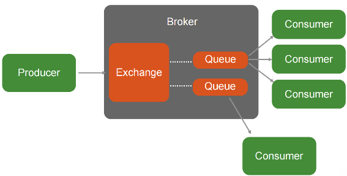

## RabbitMQ Evaluation

It is defined as a robust and easy to use messaging platform that can work synchronously an asynchronously.

From rabbitmq.com:
> *RabbitMQ is a messaging broker - an intermediary for messaging. It gives your applications a common platform to send and receive messages, and your messages a safe place to live until received.

### Overview

In the scope of the reTHINK project, RabbitMQ is a candidate technology for the Messaging Node

##### Highlights:
  * **Reliability** - RabbitMQ offers a variety of features to let you trade off performance with reliability, including persistence, delivery acknowledgements, publisher confirms, and high availability.
  * **Flexible Routing** - Messages are routed through exchanges before arriving at queues. RabbitMQ features several built-in exchange types for typical routing logic. For more complex routing you can bind exchanges together or even write your own exchange type as a plugin.
  * **Clustering** - Several RabbitMQ servers on a local network can be clustered together, forming a single logical broker.
  * **Federation** - For servers that need to be more loosely and unreliably connected than clustering allows, RabbitMQ offers a federation model.
  * **Highly Available Queues** - Queues can be mirrored across several machines in a cluster, ensuring that even in the event of hardware failure your messages are safe.
  * **The Polyglot Broker** - RabbitMQ supports messaging over a variety of messaging protocols including STOMP, MQTT, or AMQP.
  * **Tracing** - If your messaging system is misbehaving, RabbitMQ offers tracing support to let you find out what's going on.

### Architecture

The core component is the **Broker** that routes the messages from the **producers** to the **consumers** as depicted in the following image.

The **Broker** has two main componentes:
* **Exchange**: accepts and routes messages from producer to clients based on the message information such as keys, bindings, filtering or broadcast.

* **Queue**: a FIFO queue of messages

Message routing can be based on topic / wild-card,  as shown in the following image.

### APIs and Documentation

[AMQP Protocol Specification](https://www.rabbitmq.com/protocol.html)

RabbitMQ provides the following APIs:
* [Java and JVM](https://www.rabbitmq.com/devtools.html#java-dev)
  * Java
  * Spring Framework
  * Scala
  * Groovy
  * Grails
  * Clojure
  * JRuby
* [Ruby](https://www.rabbitmq.com/devtools.html#ruby-dev)
* [Python](https://www.rabbitmq.com/devtools.html#python-dev)
* [.NET / C#](https://www.rabbitmq.com/devtools.html#dotnet-dev)
* [PHP](https://www.rabbitmq.com/devtools.html#php-dev)
* [PERL](https://www.rabbitmq.com/devtools.html#perl-dev)
* [C / C++](https://www.rabbitmq.com/devtools.html#c-dev)
* [Node.js](https://www.rabbitmq.com/devtools.html#node-dev)
* [Go](https://www.rabbitmq.com/devtools.html#go-dev)
* [Erlang](https://www.rabbitmq.com/devtools.html#erlang-dev)
* [Haskell](https://www.rabbitmq.com/devtools.html#haskell-dev)
* **[Web Messaging](https://www.rabbitmq.com/devtools.html#web-messaging)**
  * [rabbit-socks](https://github.com/rabbitmq/rabbit-socks) Websocket and Socket.IO support for RabbitMQ
  * [rabbitmq-chat](https://github.com/videlalvaro/rabbitmq-chat) A Web chat implemented with RabbitMQ and Websockets
  * [rabbithub](https://github.com/tonyg/rabbithub) RabbitHub provides an HTTP-based interface to RabbitMQ.
  * [VorpalBunny](https://github.com/myYearbook/VorpalBunny) PHP for talking to RabbitMQ's JSON-RPC-Channel Plugin

### Requirements Analysis

Analysis against **Messaging Node** Requirements

* [It should be possible to support Protocol on-the-fly](https://github.com/reTHINK-project/core-framework/issues/21)
  * Yes
  * the Client Server API could be wrapped in a protocol stub, that can be downloaded at runtime

* [Messaging Transport Protocols](https://github.com/reTHINK-project/core-framework/issues/20)
  * Partially
  * Has support for :
    * AMQP 0.9.1, 0.9, 0.8
    * STOMP via plugin
    * MQTT via plugin
    * AMQP 1.0 via plugin
    * Web-STOMP using WebSockets (SockJS) via plugin
    * Non-Reliable HTTP API to send and receive messages via the management plugin
    * JSON-RPC via plugin (synchronous)

* [Message Caching](https://github.com/reTHINK-project/core-framework/issues/19)
  * Yes
  * Core feature

* [Message Node logging](https://github.com/reTHINK-project/core-framework/issues/18)
  * Yes
  * RabbitMQ has a built-in tracer feature that is able to see every message that is published, and every message that is delivered on a per-node, per-vhost basis.

* [Message delivery reliability](https://github.com/reTHINK-project/core-framework/issues/17)
  * Yes
  * For AMQP:
    * Acknowledgements can be used in both directions - to allow a consumer to indicate to the server that it has received/processed a message and to allow the server to indicate the same thing to the producer.
    * Use of acknowledgements guarantees at-least-once delivery. Without acknowledgements, message loss is possible during publish and consume operations and only at-most-once delivery is guaranteed.

* [Messaging Node deployments with carrier grade scalability](https://github.com/reTHINK-project/core-framework/issues/16)
  * Yes
  * In a RabbitMQ cluster all data/state required for the operation of a broker is replicated across all nodes, for reliability and scaling, with full ACID properties. Queues may be located on a single node, or mirrored across multiple nodes. A client connecting to any node in a cluster can see all queues in the cluster, even if they are not located on that node.
  * Brokers tolerate the failure of individual nodes
  * 1 million messages/second was benchmarked using a cluster of 30 Nodes [[Link1]](http://blog.pivotal.io/pivotal/products/rabbitmq-hits-one-million-messages-per-second-on-google-compute-engine)[[Link2]](http://googlecloudplatform.blogspot.pt/2014/06/rabbitmq-on-google-compute-engine.html)

* [Messaging Node should be tolerant to unstable connections](https://github.com/reTHINK-project/core-framework/issues/15)
  * No
  * The client should use heartbeats for detecting dead TCP connections that have a timeout interval.
  * Business logic must be implemented on the application layer in order to deal with this case.

* [Events about clients connection / disconnection from Messaging Node](https://github.com/reTHINK-project/core-framework/issues/14)
  * Yes
  * Using the HTTP management API

* [Messaging Node must support very low message delivery latency](https://github.com/reTHINK-project/core-framework/issues/13)
  * Yes
  * Has low latency derived from its Erlang message oriented implementation. [[Link1]](http://www.rabbitmq.com/blog/2012/04/17/rabbitmq-performance-measurements-part-1/)[[Link2]](http://www.rabbitmq.com/blog/2012/04/25/rabbitmq-performance-measurements-part-2/)

* [Messaging Node must be deployable in the most used Virtual Machines](https://github.com/reTHINK-project/core-framework/issues/12)
  * Yes

* [Messaging Node should require minimal computing resources](https://github.com/reTHINK-project/core-framework/issues/11)
  * Depends on the protocol used:
    * AMQP,STOMP, HTTP - depends (some computation is needed) (>256K RAM)
    * MQTT - yes (Designed especially for IoT)

* [Messaging Node must support external authentication and Authorisation](https://github.com/reTHINK-project/core-framework/issues/10)
  * Yes
  * Using SSL client certificates via plugin
  * Using LDAP and Federation via pugins

* [Messaging Node must support pub/sub](https://github.com/reTHINK-project/core-framework/issues/9)
  * Yes
  * Core functionality, including topic/wildcard based filtering and broadcasting.
