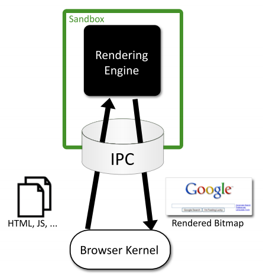

# Security in Runtime

  In this document, we present an overview about the security in runtime component of the project. In first place, we will define the security goals we want to achieve. Then, possible attacks against those goals are explained. Finally, we present the state of the art on how current systems solve the referred problems, splitting the security runtimes in two distinct areas: 

* Web Browsers
* Secure elements

  In the Web Browsers section, we will present security mechanisms for JavaScript code protection in fully-featured environments (the web browsers themselves), while in the Secure Elements section, the state of the art on code security runtimes for systems featuring less functionality and computation capabilities but requiring tighter security requirements during its operation.

**Security goals:**
The following points consist in specific security goals that the hyperty instances must achieve.

G1 - to protect the confidentiality and integrity of the state of hyperty instances.
G2 - to protect the integrity of the code of hyperty instances.
G3 - to enforce the security policies attached to hyperty code.

**Possible attack vectors:**
Multiple attack types can be performed against the hyperty instances, at multiple levels (software, OS, hardware). We now present and detail the most well-known attack vectors occuring at each level.

*Malicious hyperty code:* E.g., by exploiting a bug in the hyperty runtime (HR), a malicious hyperty manages to escape from its sandboxed environment and escalates its privileges to gain access to a victim hyperty instance. The attacker can then read or modify sensitive data (break G1), modify the code (break G2), or modify the security policy (break G3) of the victim.

*Compromised browser:* E.g., the local user logs in to the computer, and attaches a debugger to the browser’s process. This gives the user full access to the browser’s state, including the HR’s. Therefore all G1, G2, and G3 can be violated. A similar attack can be performed by malware that subverts the browser’s security mechanisms and allows for an attacker to control the HR.

*Compromised operating system:* E.g., a kernel rootkit subverts the kernel, and gains access to the entire memory state of the browser process in which the victim hyperty instance is running. Just like in the previous cases, all G1, G2, G3 can be violated. Jail-breaking the kernel can bring similar consequences.

*Compromised hardware:* E.g., an attacker manages to gain physical access to the host computer and has the capability to extract secrets directly from the RAM memory or by probing the system bus. This attack can violate the security goals G1, G2, and G3.

## Web Browsers

### Monolithic vs Modular Architectures:

  Traditionally, commercial and open-source web browsers employed a monolithic architecture. This means that both user’s and web application’s data are combined into a single security domain, which brings serious performance/usability and security issues. On the performance/usability side, if a web application crashes during its execution, the whole web browser can be affected, harming the user experience. On the security side, if an attacker exploits an unpatched vulnerability in the browser while a user is using it, he may gain access to the whole user space, being able to execute code on behalf of that user and access its private sensitive information, like credentials.

  Nowadays, web browsers evolved into modular architectures, in order to achieve privilege separation and overcome monolithic architectures’ flaws. This way, browser developers came up with multiple different architectures to achieve this separation between what is user’s property (credentials, preferences) and what is “web’s” property (applications’ code). Multiple techniques were employed in these architectures to achieve this separation:

* **Sandboxing:** In computer security, a sandbox is a security mechanism which allows untrusted programs to run within a trusted environment, without affecting its trustiness. This is usually done by restricting the resources (disk, memory, network) the untrusted software can access. An example is creating scratch memory and disk spaces where it can read/write and limiting the network capabilities it can use, in order to prevent the host environment from getting damaged. This is what Chromium browser [1] applies to separate the user and the web side in a modular architecture. It features two modules:

  * A **browser kernel module** which acts on behalf of the user and is responsible for implementing the tab-based windowing system of the browser, storing user’s data as its preferences, bookmarks, credentials and cookies and also working as a middleware between the native operating system window manager and every instance of the second browser module, the rendering engine.
  * The **rendering engine** provides the web application behaviour. It interprets and executes web content, serving calls to the DOM API. It is the unique browser part in contact with the untrsuted web content. Apart from that, it is also responsible for enforcing the same-origin policy between the user and a website he’s visiting.
  

Figure 1. Chromium sandbox scheme

### Browser Extensions Security:

  Browser extensions provide useful additional functionality to web browsers, such as facilitating the access to a website’s content or even as almost standalone applications running on the browser environment. However, these extensions often introduce serious security issues into both user’s browser and websites, because most of the times they’re written by well-meaning developers who are not security experts. Extensions can read and alter users’ bookmarks and preferences, websites’ content and perform requests over the network, many times on behalf of the browser user. Browser extensions are mostly written in JavaScript and HTML, and since JavaScript provides methods for converting a string to code (e.g. eval), an extension may be dangerous if misused.
  Typically, benign extensions face two types of attackers:
  
* **Network attackers:** Targeting end-users who connect to insecure networks (public Wi-Fi hotspots), these attacks consist in reading and altering HTTP traffic, in order to detect if an extension adds an HTTP Script - JavaScript file loaded over HTTP - to itself, and altering the code in such case.
* **Web attackers:** A malicious website can launch a XSS attack on an extension if the extension treats the website as trusted, possibly stealing the browser’s userdata, like credentials. This way, it can scale up to attack multiple websites within the same entry point.

According to [2], Google Chrome and its extension platform apply three mechanisms to prevent  these vulnerabilities:
* **Privilege Separation:** Every Chrome extension has two types of components which run in separate processes: zero or more content scripts and zero or one core extension. Content scripts read and modify websites as needed. The core extension implements functionality not directly involving websites, like browser UI jobs or long-running background tasks. These two types of components communicate by sending structured clones over a trused channel. Each website that an extension communicates with, receives its own isolated instance of a content script, making content scripts highly bound to attacks. However, only the core extension is able to communicate with the Chrome extension’s API, reducing the risk that a content script is able to access the user data space. The architecture scheme of a Google Chrome extension is on Fig. 2.
* **Isolated Words:** This mechanism ensures that content scripts and websites have separate JavaScript heaps and DOM objects. Consequently, content scripts never exchange pointers with websites, protecting them against web attackers.
* **Permissions:** Extension developers have to specify the desired permissions in kind of a manifest file that is packaged with the extension. For example, the bookmarks permission is needed for the extension to be able to read and alter the user’s bookmarks. Only core extension can use permissions to invoke browser API methods, while content scripts are limited to interacting with the core extension and the website it is running on. This way, an extension is limited to the permissions its developer requested, so an attacker is not able to request new permissions for a compromised extension in runtime.

Figure 2. The architecture of a Google Chrome extension.

### XSS Detection Techniques:

Cross-Site Scripting attacks are getting more common on the web, since they allow an attacker to get control of a user’s browser and execute malicious code (usually JavaScript/HTML) within the trusted context of a web application. This can result in the attacker being able to access any sensitive information associated to the application (cookies, session IDs, etc.).
	The study of XSS attacks can be split into two distinct categories, according to [3]:
	
* **Persistent/Stored attacks:** Occurs when a malicious user registers itself into a web application and posts a malicious JavaScript to the application, which, by its turn, save it into the application’s data repository, persistently. After that, if another user fetches the content uploaded by the malicious one onto his browser, and since this code is coming out of the trusted context of the web application, the user’s browser will allow the script to access any possibly sensitive resource it is willing to, overcoming this way the security imposed by the same-origin policy. Apart from stealing the user’s information, XSS attacks can also be used to redirect users to a malicious website which can then perform other distinct attacks within its context. A persistent XSS attack scheme is presented on Fig. 3.

Figure 3. Scheme of a persistent XSS attack.

* **Non-persistent/Reflected attacks:** Unlike the first type, reflected attacks do not persistently store malicious code in the web application data space. Instead of that, the content is automatically reflected back to the user through a third-party mechanism. For example, by using a spoofed email, an attacker can make a user click on a link containing malicious code, which will finally be interpreted by the user’s browser, but within the trusted context fo the web application. This type of XSS attacks is often combined with other techniques as phishing, and is the most common type of XSS attacks in web applications. Figure 4 shows a scheme of the architecture of a non-persistent XSS attack.

Figure 4. Scheme of a non-persistent XSS attack.

### XSS (and other types) prevention techniques:

* **Analysis and Filtering of the Exchanged Information:**

This technique consists in defining a list of characters or tags which users are allowed to exchange with the web application, in the form of text inputs, uploaded files, etc. Then, a filtering process simply rejects everything that is not part of the list.
Other approach, reported in [4], is having a proxy-server at the web application’s site in order to filter both incoming and outcoming requests. This filtering takes into account a set of rules defined by the application developers. Although, a simple use of regular expressions is able to evade both the referred methods and proxy-servers can rapidly become a performance bottleneck on the application deployment. Authors of [5] also suggested placing a proxy-server on the server-side of the application, but in order to differentiate trusted and untrusted traffic, driving each type to separate channels. This partitioning process uses Information Flow Control techniques to taint information and track it thenceforward.
On other point of view, approaches seen in [6,7] propose the content filtering to happen at the client-side. On the one hand, authors of [6] try to achieve the prevention of XSS attacks by blacklisting links embedded within the web application’s pages, making them unavailable for the client. However, the authors say this approach can only detect basic XSS attacks based on the violation of same-origin policy.  On the other hand, authors of [7] present another client-proxy solution that is intended to detect malicious requests reflected from the attacker to the victim (non-persistent XSS attacks). If such a request is detected, the malicious characters are re-encoded by the proxy, trying to avoid the success of the attack.

* **Security Enforcement on the Web Browser Runtime:**

There are also other strategies which try to avoid the need for intermediate elements like proxy-servers by proposing startegies to enforce the runtime context of the web browser. In [8], authors propose an auditing system for the JavaScript interpreter of the Mozilla Firefox browser, which detects misuses on JS operations and take counter-measures to avoid violations on browser’s security. Other approach is also followed by [9], which presents the use of dynamic taint tracking on JavaScript code, in order to detect whether browser’s sensitive resources are going to be transferred to an untrusted third-party. In such case, the user is warned and can decide whether he allows or denies the transfer. Finally, the approach followed by [10] propose a policy-based management where a list of actions is embedded into the documents exchanged between the browser and the server. These actions help the browser to decide whether or not a script should be executed. Although, a lack of semantics in the policy-language and the restrictiveness of the approach due to the sandboxing-like mechanism are some of the drawbacks.

## Secure Elements

### Java Card: Internet Computing on a Smart Card

In secure computing, a smart card is a typical card with a built-in computer chip. Until a few years ago, it was only used to produce credit and debit cards, whose information can only be accessed when in possession of the card itself and a PIN code. Due to the short information on how to communicate and program them, until a few years ago this useful technology wasn’t being used on computer security in general.

* **Hardware:**

This single-chip computer is an off-the-shelf **8-bit microcontroller** with added tamper-safe features. While most 8-bit microcontrollers can support at least **64 KBytes** of 8-bit memory, popular smart cards contain 4 to 20 Kbytes of memory, due to size constraints. The memory space of a smart card is divided into RAM, EEPROM and ROM. RAM is used to store temporary values when a program is running, while EEPROM is used to store sensitive data as an encryption key or the account holder info on credit cards. Finally, ROM is used to store the basic programs that run on the smart card. The single-chip computer is embedded in a plastic chip carrier, and both of them hold several tamper-resistant and tamper-detection features.

Figure 5. Java Smart Card scheme [11]

* **Software**

The paucity of 8-bit assembly language courses, books and software tools led engineers to break the smart card application bottleneck by building a Java virtual machine with its runtime support into a 12-Kbyte smart card. **Java** was the obvious answer for three reasons:
 * Java brings smart card programming into the mainstream of software development
 * Java “safe programming” security model based on a runtime interpreter is a nontrivial side benefit, due to its processor independence. A Java card can be deployed on multiple smart card models.
 * Java interpreters were tested to the limit, holes had been found, and fixed
	
With this in mind, engineers concluded that Java could preserve the required security in the smart card operation, while allowed a more friendly and well-known programming approach. However, available memory was an issue when deploying such heavy language runtime like Java. Features like garbage collection and exceptions handling were not included in Java Card because of that.

* **Internet Computing with Java Smart Card**

Java Cards combine smart card’s identity-verification features with the Java “sandbox”, guaranteeing that only allowed applications run on the card and that applications are protected from each other.

### Cloud of Secure Elements

Cloud of Secure Elements (CoSE) [12] is an emerging concept whose goal is to provide trusted computing resources to mobile and cloud applications. To reach that, it relies on an infrastructure composed by multiple secure microcontrollers, named Secure Elements.

CoSE, in a WEB-like paradigm, are meant to support Uniform Resource Identifiers (URIs) for users to locate the different secure elements and use their embedded resources. These resources usually target two service types: Near Field Communication (NFC) facilities for mobile applications and trusted cryptogrtaphic features for cloud applications.

Figure 6. CoSE architecture

* **Architecture**

A Cloud of Secure Elements has the following components, as Fig. 6 shows:

  * NFC kiosks, typically deliver payment facilities
  * Users with NFC-enabled devices or terminals needing trusted cryptographic resources
  * Grid of Secure Elements (GoSE)
  * Secure elements, with resources identifiable by URI
  * Remote administration entities, performing management operations over applications and secure elements

* **Grid of Secure Elements (GoSE)**

A grid of secure elements is an Internet server hosting multiple secure elements. Each element may be plugged in through USB readers, hardware sockets or electronic boards. Communication may be achieved with RACS protocol (works over IP/TCP/TLS stack) and performs both the association between elements and unique identifiers and data exchange with secure elements.

## Bibliography

[1] - [Barth, A.; Jackson, C.; Reis, C. and Team, Google Chrome. 2008. The Security Architecture of the Chromium Browser.](http://seclab.stanford.edu/websec/chromium/chromium-security-architecture.pdf)

[2] - [Nicholas Carlini, Adrienne Porter Felt, and David Wagner. 2012. An evaluation of the Google Chrome extension security architecture. In Proceedings of the 21st USENIX conference on Security symposium (Security'12). USENIX Association, Berkeley, CA, USA.](http://nicholas.carlini.com/papers/2012_usenix_chromeextensions.pdf)

[3] - [Garcia-Alfaro, J. and Navarro-Arribas, G. 2007. A Survey on Detection Techniques to Prevent Cross-Site Scripting Attacks on Current Web Applications., in Javier Lopez & Bernhard M. Hämmerli, ed., 'CRITIS' , Springer, , pp. 287-298 .](http://eprints.uoc.edu/research/bitstream/10363/605/1/JGA01.pdf)

[4] -  [Scott, D. and Sharp, R. Abstracting application-level web security. 11th Internation Conference
on the World Wide Web, pp. 396–407, 2002.](http://rich.recoil.org/publications/websec.pdf)

[5] -  [Pietraszeck, T. and Vanden-Berghe, C. Defending against injection attacks through context-sensitive
string evaluation. Recent Advances in Intrusion Detection (RAID 2005), pp.124–
145, 2005.](http://tadek.pietraszek.org/publications/pietraszek05_defending.pdf)

[6] - [Kirda, E., Kruegel, C., Vigna, G., and Jovanovic, N. Noxes: A client-side solution for mitigating
cross-site scripting attacks. 21st ACM Symposium on Applied Computing, 2006.](https://iseclab.org/papers/noxes.pdf)

[7] - [ Ismail, O., Etoh, M., Kadobayashi, Y., and Yamaguchi, S. A Proposal and Implementation
of Automatic Detection/Collection System for Cross-Site Scripting Vulnerability. 18th Int.
Conf. on Advanced Information Networking and Applications (AINA 2004), 2004.](http://ieeexplore.ieee.org/xpl/freeabs_all.jsp?arnumber=1283902&abstractAccess=no&userType=instima)

[8] - [Hallaraker, O. and Vigna, G. Detecting Malicious JavaScript Code in Mozilla. 10th IEEE International
Conference on Engineering of Complex Computer Systems (ICECCS’05), pp.85–94, 2005.](http://www.cs.ucsb.edu/~vigna/publications/2005_hallaraker_vigna_ICECCS05.pdf)

[9] - [Jovanovic, N., Kruegel, C., and Kirda, E. Precise alias analysis for static detection of web
application vulnerabilities. 2006 Workshop on Programming Languages and Analysis for Security, pp. 27–36, USA, 2006.](https://iseclab.org/papers/pixy2.pdf)

[10] - [Jim, T., Swamy, N., Hicks M. Defeating Script Injection Attacks with Browser-Enforced
Embedded Policies. International World Wide Web Conferencem, WWW 2007, May 2007.](http://www2007.org/papers/paper595.pdf)

[11] - [Uwe Hansmann, Martin S. Nicklous, Frank Seliger, and Thomas Schaeck. 1999. Smart Card Application Development Using Java (1st ed.). Springer-Verlag New York, Inc., Secaucus, NJ, USA.](http://dl.acm.org/citation.cfm?id=555354)

[12] - [Pascal Urien. Cloud of Secure Elements Perspectives for Mobile and Cloud 
Applications Security. IEEE Conference on Communications and Network Security 2013 - Poster Session](http://ieeexplore.ieee.org/stamp/stamp.jsp?tp=&arnumber=6682733)

*should we also study these references:
http://seclab.stanford.edu/websec/jsPapers/csf09-camera-ready.pdf
http://www-cs-students.stanford.edu/~ataly/Papers/sp11.pdf?*
