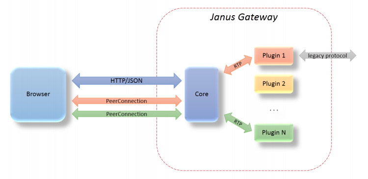

Janus Gateway
-------------

[Janus Gateway](https://janus.conf.meetecho.com/) [29] is a WebRTC gateway implemented in C, which means it doesn't provide any functionality for itself, apart from establishing a WebRTC media connection between browsers and server-side applications they might be using (e.g. echo tests, conference bridges, media recorders). This communication consists in exchanging JSON messages and relaying RTP/RTCP packets between a browser and the application logic. Janus is intended to be a light component to cover a big range of use-cases. It can be used to deploy a full-fledged WebRTC gateway on a cloud provider or just a small nettop/box to handle a specific use case, looking at applications as pluggable modules that a client can connect to through this gateway.

### Architecture and APIs

Janus Gateway splits itself into three software modules. The Core module implements the WebRTC protocols (SDP, ICE, DTLS-SRTP, RTP/RTCP), which are themselves listed in the Protocols module, in a web server that interacts with browsers. This Core module takes care of aspects like session handling, media signalling, negotiation and plugins availability. The Plugins module provides some out-of-the-box plugins to be integrated or extended into new applications developed on top of Janus core. The already available plugins perform media record and play and establish streaming, voice mail or SIP connections, just to mention some useful examples. There is also a Plugin API which offers potential plugin developers an overview of how these plugins are implemented and also instructions of how to develop a new one.

### Janus Gateway and runtime requirements

#### [The Runtime should be deployable in the most used Devices and Operating Systems](https://github.com/reTHINK-project/core-framework/issues/1)

Janus Gateway web servers can currently be deployed on Linux systems only, and a cross-platform version is not going to be developed for now. For client-side, Google Chrome and Mozilla Firefox are the supported browsers.

#### [The Runtime should support W3C WebRTC APIs including](https://github.com/reTHINK-project/core-framework/issues/2)

Janus Gateway implementation of the WebRTC stack supports the W3C WebRTC APIs.

#### [The runtime must support standard JavaScript (ECMAScript)](https://github.com/reTHINK-project/core-framework/issues/3)

Janus Gateway supports standard JavaScript in its implementation. Concretely, it offers a JavaScript library (janus.js) which allows developers to access both the REST and WebSocket interfaces. This library facilitates the task of establishing sessions between clients and the gateway, attaching plugins to clients, exchange events between them and so on.

#### [The Runtime should support Web Socket](https://github.com/reTHINK-project/core-framework/issues/4)

As said above, Janus Gateway offers a WebSocket API which developers may choose instead of the default plain HTTP REST API to interact with the gateway.

#### [The Runtime should support Standardised Messaging Notifications](https://github.com/reTHINK-project/core-framework/issues/5)

Janus can send events and notifications at any time through the long poll channel or the related push mechanisms made when using WebSockets. On plain HTTP, a user has to explicitly subscribe to notifications, repeating that as soon as an event has been received. However, the push mechanisms used by the WebSockets makes this task easier: as soon as a client creates a session through a WebSocket, that channel becomes automatically subscribed for events related with that session, and these events of interest will be then received through the same channel.

#### [The Runtime must have a good performance](https://github.com/reTHINK-project/core-framework/issues/6)

Measuring the performance of Janus is a complicated task, since it is just a gateway. Thus, the performance of plugins and applications written by third-party developers and working with Janus takes an important role on the measurements. There was a [recent study](http://dl.acm.org/citation.cfm?id=2749223) [30] on the performance of the Janus Gateway, when applied to several use-cases. Also, when [comparing the Video MCU conferencing plugin](http://www.rtc-conference.com/wp-content/uploads/gravity_forms/2-2f7a537445fa703985ab4d2372ac42ca/2014/09/Romano_Janus.pdf)[31] with other similar systems like [Jitsi](https://jitsi.org/) [26] and [Licode](http://lynckia.com/licode/), it revealed strong improvements on CPU and memory usage, both on client and server sides.

#### [The effort to introduce new capabilities in the runtime should be reasonable](https://github.com/reTHINK-project/core-framework/issues/8)

Due to its modular architecture, in which plugins can be seen as "bricks" in an application, introducing new features like a policy engine or Hyperty Registry should not be a very hard task.
