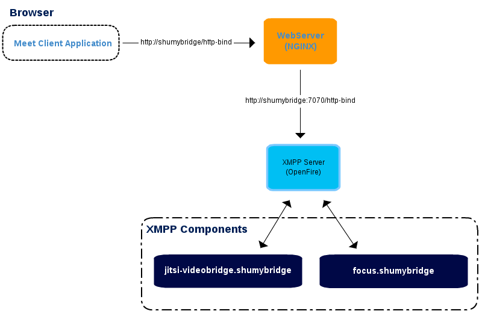

Jitsi Videobridge
-----------------

[Jitsi Videobridge](https://jitsi.org/Projects/JitsiVideobridge) [26] is a WebRTC compatible Selective Forwarding Unit (SFU) that allows for multiuser video communication.

Jitsi Video bridge supports RTP Relay, audio mixing, Call encryption with DTLS/SRTP and ICE.

### Architecture

JItsi Video bridge is a [XMPP component](http://xmpp.org/) [27] and can be integrated with any compliant XMPP Server like eJabberd or Openfire. In addition there is another XMPP component, the Jicofo, that uses an XMPP extension protocol called COLIBRI (COnferences with LIghtweight BRIdging) to provide conferencing focus functionalities including channels allocation and add / remove participants from each call. Finally, SIP interoperability is provided by a third XMPP component called Jigasi. There is an OpenSource WebRTC JavaScript application, called Jitsi Meet, that uses Jitsi Videobridge to provide high quality, scalable video conferences.



### Installation Procedures

**Required software**

-	JVM (select the latest version)
-	XMPP Server (openfire, prosody.im, Tigase ...)
-	Jitsi VideoBridge (stream XMPP component)
-	Jicofo (Session handler XMPP component)
-	NGINX (web server and proxy)
-	Jitsi Meet App

**Domain selection**

-	Select a name for a domain, "shumybridge" will be use for this example.
-	Add an entry in DNS hosts file "127.0.0.1 shumybridge".

**XMPP Server (using Openfire)**

-	Download and install openfire from http://www.igniterealtime.org/downloads/index.jsp
-	Access admin console at http://localhost:9090
-	For the machine name and XMPP domain is important that you use "shumybridge", server certificates will be generated for the domain.
-	Select embedded SQLLite database, and an admin user account. Just enough for testing.
-	On config "Server -> Server Settings -> HTTP Binding", enable "Script Syntax -> BOSH" and "Provides support for XFF (X-Forwarded-For) headers"
-	On config "Server -> Server Settings -> External Components" enable and set the password, ex: xpassword

**Jitsi VideoBridge**

-	Download and install Jitsi Videobridge from https://jitsi.org/Projects/JitsiVideobridge
-	Run videobridge with: jvb --host=shumybridge --secret=xpassword
-	You should see an entry in XMPP components like:


**Jicofo Session**

-	Clone from "git clone https://github.com/jitsi/jicofo.git"* Ant build with "ant dist.{os-name}"
-	Add lines "org.jitsi.impl.neomedia.transform.srtp.SRTPCryptoContext.checkReplay=false" and "org.jitsi.jicofo.auth.URL=XMPP:shumybridge" to the file sip-communicator.properties. In Windows this is located at "C:\Users\"user"\\.sip-communicator\sip-communicator.properties" or in linux "/usr/share/jicofo/.sip-communicator/sip-communicator.properties"* Run videobridge with: jicofo --host=shumybridge --port=5275 --secret=xpassword* You should see an entry in XMPP components like:


(@sota-runtime-openfire-components) OpenFire VideoBridge and Jicofo Components

**NGINX**

-	Download and install from http://nginx.org/en/download.html
-	Change nginx.conf file with:

```
server { listen 80; server_name shumybridge;


location ~ ^/([a-zA-Z0-9]+)$ {
    rewrite ^/(.*)$ / break;
}

location / {
    root      srv/jitsi.example.com;
    index     index.html;
}

# BOSH
location /http-bind {
    proxy_pass          http://shumybridge:7070/http-bind/;
    proxy_set_header    X-Forwarded-For $remote_addr;
    proxy_set_header    Host $http_host;
}


redirect server error pages to the static page /50x.html error_page 500 502 503 504 /50x.html; location = /50x.html { root html; } }
==========================================================================================================================================
```

**Jitsi Meet App**

-	Clone or download Meet App from https://github.com/jitsi/jitsi-meet.git
-	Copy Meet App to NGINX folder ./srv/jitsi.example.com* Change config.js file with:

```
 var config = { hosts: { domain: 'shumybridge', muc: 'conference.shumybridge', bridge: 'jitsi-videobridge.shumybridge', focus: 'focus.shumybridge' },

... bosh: '//shumybridge/http-bind', clientNode: 'http://shumybridge/jitsimeet', ... };
```

### Evalusation of Jitsi Meet Application

Jitsi Meet uses strophe.js internally, but it's clustered with UI dependencies and other non wanted stuff.**Strophe.js** is an XMPP library for JavaScript. Its primary purpose is to enable web-based, real-time XMPP applications that run in any browser. There are Jingle plugins for strophe.js. You need to include the following files in your application from projects [jingle](https://github.com/estos/strophe.jingle) and [strophe](https://github.com/strophe/strophejs):

```JavaScript
    <!--add jQuery lib-->
    <script src='strophe/strophe.js'></script><!-- strophe-->
    <script src='strophe/strophe.disco.js'></script><!-- strophe.disco, optional -->
    <script src='strophe/strophe.jingle.js' charset='utf-8'></script><!-- strophe jingle connection plugin -->
    <script src='strophe/strophe.jingle.session.js' charset='utf-8'></script><!-- strophe jingle connection plugin -->
    <script src='strophe/strophe.jingle.sdp.js' charset='utf-8'></script><!-- sdp library -->
    <script src='strophe/strophe.jingle.adapter.js' charset='utf-8'></script><!-- getusermedia cross browser compat layer -->
` Starting the XMMP session is normaly made with:\`\``JavaScript var BOSH_SERVICE = '/http-bind'; var ICE_CONFIG = {iceServers: [{url: 'stun:stun.l.google.com:19302'}]};

var DOMAIN = window.location.hostname; var CONFERENCEDOMAIN = 'conference.' + DOMAIN;

var connection = null; var rtc = null; var localStream = null;

var myroomjid = null; var roomjid = null; var listMembers = [];

$(document).ready(function () { rtc = setupRTC(); connection = new Strophe.Connection(BOSH_SERVICE); connection.jingle.ice_config = ICE_CONFIG; connection.jingle.pc_constraints = rtc.pc_constraints;


//nice for debug purposes...
connection.xmlInput = function (data) { console.log('RECV: ', data); };
connection.xmlOutput = function (data) { console.log('SEND: ', data); };


});

//call this on a click button (connect) getUserMediaWithConstraints(['audio', 'video']);
```

**getUserMediaWithConstraints** will fire an event configured with jQuery.

```JavaScript
 $(document).bind('mediaready.jingle', function (event, stream) { localStream = stream; connection.jingle.localStream = stream; RTC.attachMediaStream($(<video-tag>), localStream);

```

//connect to videobridge connection.connect(<user>, <pasword>, function (event) { //TODO: handle other connection states Strophe.Status if (status == Strophe.Status.DISCONNECTED) { if (localStream) { localStream.stop(); localStream = null; } } else if (status == Strophe.Status.CONNECTED) { connection.jingle.getStunAndTurnCredentials();

```
    // disco stuff
    if (connection.disco) {
        connection.disco.addIdentity('client', 'web');
        connection.disco.addFeature(Strophe.NS.DISCO_INFO);
    }

    //CONNECTED:
    roomjid = <hash> + '@' + CONFERENCEDOMAIN; //select room id
    myroomjid = roomjid + '/' + Strophe.getNodeFromJid(connection.jid);

    //config XMPP presence event handlers...
    connection.addHandler(onPresence, null, 'presence', null, null, roomjid, {matchBare: true});
    connection.addHandler(onPresenceUnavailable, null, 'presence', 'unavailable', null, roomjid, {matchBare: true});
    connection.addHandler(onPresenceError, null, 'presence', 'error', null, roomjid, {matchBare: true});

    var pres = $pres({to: myroomjid }).c('x', {xmlns: 'http://jabber.org/protocol/muc'});
    connection.send(pres);
}


});


});
```

and define presence handlers:

```
JavaScript function onPresence(pres) { var from = pres.getAttribute('from'); var type = pres.getAttribute('type');

if (type !== null) { return true; }

if ($(pres).find('>x[xmlns="http://jabber.org/protocol/muc#user"]>status[code="201"]').length) { // http://xmpp.org/extensions/xep-0045.html#createroom-instant var create = $iq({type: 'set', to: roomjid}) .c('query', {xmlns: 'http://jabber.org/protocol/muc#owner'}) .c('x', {xmlns: 'jabber:x:data', type: 'submit'}); connection.send(create); // fire away }

//manage list members if (from == myroomjid) { for (i = 0; i < listMembers.length; i++) { connection.jingle.initiate(listMembers[i], myroomjid); } } else { listMembers.push(from); }

return true;
}

function onPresenceUnavailable(pres) { connection.jingle.terminateByJid($(pres).attr('from'));


//manage list members for (var i = 0; i < listMembers.length; i++) { if (listMembers[i] == $(pres).attr('from')) { listMembers.splice(i, 1); break; } }

return true;
}

function onPresenceError(pres) { //TODO: process error return true; }\`\`\`

Handle add/remove video/audio streams:\`\``JavaScript $(document).bind('remotestreamadded.jingle', function (event, data, sid) { var el = $("<video autoplay='autoplay' style='display:none'/>").attr('id', 'largevideo_' + sid); RTC.attachMediaStream(el, data.stream); });

$(document).bind('remotestreamremoved.jingle', function (event, data, sid) { //TODO: remove video element });

```
