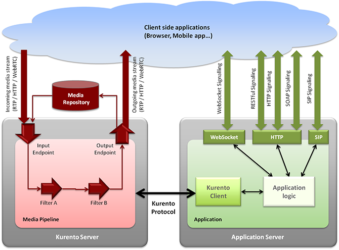

## Kurento Media Server

### Overview

[Kurento](http://www.kurento.org/) is an open source Software WebRTC media server, that can be used to manage media flows :

- Send / Receive
- Recording
- Transcoding
- Augmented reality
- Mixing
- broadcasting

It can be used to handle different type of communications applications : 1 to 1, N to N, 1 to N
(Real time exchanges or streaming)

### Architecture

Kurento is mainly composed of the two elements :
- Kurento media server
- Kurento Application

 

Application developers can use Kurento Clients or Kurento API directly for creating their multimedia enabled applications.
Developpers can use JavaScript clients, Java Client or Kurento Protocol. This is interesting as it can easily be integrated with Node.js

### APIs

*Available APIs for developers*

Media server API is describe here :
http://www.kurento.org/docs/current/mastering/kurento_API.html

Kurento Clients are also available for application developers :

JAVA :
http://www.kurento.org/docs/current/langdoc/javadoc/index.html

JavaScript :
http://www.kurento.org/docs/current/langdoc/jsdoc/kurento-client-js/index.html
http://www.kurento.org/docs/current/langdoc/jsdoc/kurento-utils-js/index.html

### Integration in Rethink

Multiparty conversations supported with MCU/SFU for Star topologies can be supported with server side Hyperties running in the MCU/SFU ie there would be protofly in the MCU/SFU.

Kurento Media Server can be connected through a Node.js Client : it will be possible to add protOfly interface on Node.js to then connect to the MCU.

