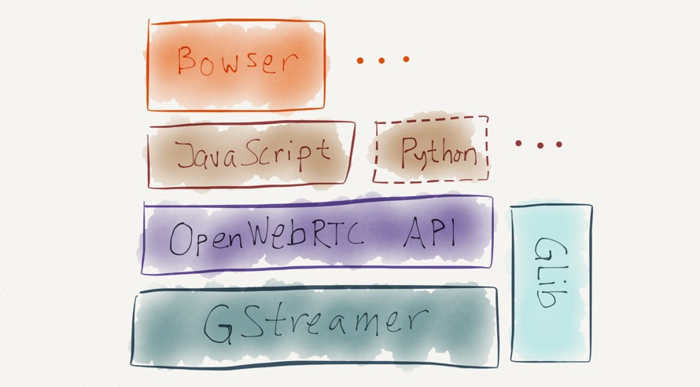

## OpenWebRTC

[OpenWebRTC](http://www.openwebrtc.org/)[19] in another open source reference implementation of WebRTC standard [16][17] that can be used to build native WebRTC apps that communicate with browsers that supports the WebRTC standard, such as Chrome, Firefox and Bowser. OpenWebRTC is especially focused on mobile platforms, with powerful features such as hardware accelerated video coding and OpenGL-based video rendering. 

OpenWebRTC architecture is highly modular, enabling easy modifications and possible extensions. Since the WebRTC standard is still evolving, that flexibility is a very desirable trait.

OpenWebRTC is built to support cross-platform operation, supporting IOS, Android, MAC OS and Linux. It is expected that Windows will be supported soon.

It is built on the expectation that several browsers will be able to support its operation. The bulk of the API layer is implemented in JavaScript, making it super fast to modify and extend with new functionality. This is expecially important on mobile platforms with its rapid developping application environment.

With support for both H.264 (OpenH264) and VP8 (libvpx) video codecs, OpenWebRTC is compatible with most video communication services. 

The OpenWebRTC project is free and Open Source with a permissive BSD-2 license. 

OpenWebRTC is built on top of widely used and powerful [GStreamer multimedia framework](http://gstreamer.freedesktop.org/)[20]. GStreamer is a set of libraries and plugins that can be used to implement various multimedia applications ranging from desktop players, audio/video recorders, 
multimedia servers, transcoders, etc. Applications are built by constructing a pipeline composed of elements. An element is an object that performs some action on a multimedia stream such as:

- read a file
- decode or encode between formats
- capture from a hardware device
- render to a hardware device
- mix or multiplex multiple streams

Unfortunately, OpenWebRTC has very few available information making it hard to use and extend it.
