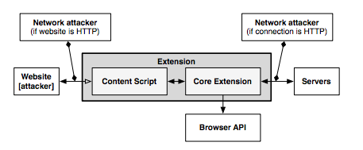
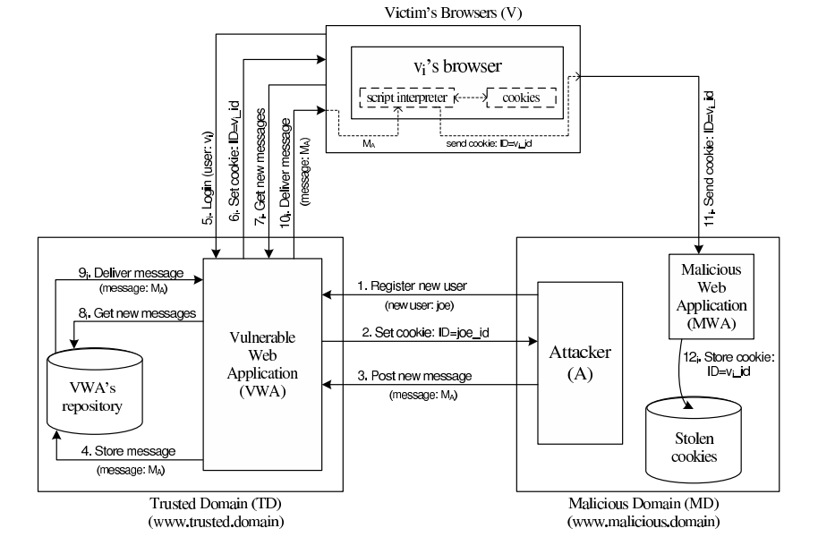
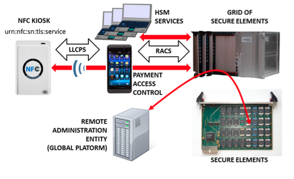

## Security in Runtime

In this document, we present the relevant related work on security runtime environments. We focus essentially on two areas: web browsers, and secure elements. The web browsers section  present security mechanisms for JavaScript code protection in fully-featured environments (the web browsers themselves). The secure elements section provides an overview of code security runtimes for computing devices featuring less functionality and computation capabilities but requiring tighter security requirements during its operation.

### Web Browsers

#### Monolithic vs Modular Architectures

Traditionally, commercial and open-source web browsers employed a monolithic architecture. This means that both users' and web applications' data are combined into a single security domain, which brings serious performance/usability and security issues. On the performance/usability side, if a web application crashes during its execution, the whole web browser can be affected, harming the user experience. On the security side, if an attacker exploits an unpatched vulnerability in the browser while a user is using it, the attacker may gain access to the whole user space, being able to execute code on behalf of that user and access its private sensitive information, such as security credentials.

Nowadays, web browsers evolved into modular architectures, in order to achieve privilege separation and overcome monolithic architectures' limitations. This way, browser developers came up with multiple different architectures to achieve this separation between what is user's property (e.g., credentials, preferences) and what is "web’s" property (e.g., applications' code). In order to achieve this separation in these architectures, multiple techniques have been employed:

* **Sandboxing:** In computer security, a sandbox is a security mechanism which allows untrusted programs to run within a trusted environment, without affecting the environment or other co-located programs. This is usually done by restricting the resources (disk, memory, network) the untrusted software can access. An example is creating scratch memory and disk spaces where it can read/write and limiting the network capabilities it can use, in order to prevent the host environment from getting damaged. This is what Chromium browser [1] applies to separate the user and the web side in a modular architecture. It features two modules:

  * A **browser kernel module** which acts on behalf of the user and is responsible for implementing the tab-based windowing system of the browser. It stores users' data as its preferences, bookmarks, credentials and cookies and also works as middleware between the native operating system window manager and every instance of the second browser module, the rendering engine.
  * The **rendering engine** implements the web application behavior. It interprets and executes web content, serving calls to the DOM API. It is the unique browser part in contact with the untrusted web content. Apart from that, it is also responsible for enforcing the same-origin policy between the user and a website he's visiting.
  


#### Browser Extensions Security

Browser extensions provide useful additional functionality to web browsers, such as facilitating the access to a website's content or even as almost standalone applications running on the browser environment. However, these extensions often introduce serious security issues into both user’s browser and websites. This is because oftentimes extensions are written by well-meaning developers who, however, are not security experts. Extensions can read and alter users' bookmarks and preferences, websites' content and perform requests over the network, many times on behalf of the browser user. Browser extensions are mostly written in JavaScript and HTML, and since JavaScript provides methods for converting a string to code (e.g. "eval"), an extension may be dangerous if misused.

Typically, benign extensions face two types of attackers:
  
* **Network attackers:** These attacks target end-users who connect to unsecure networks (i.e. public Wi-Fi hotspots), and consist in sniffing and altering HTTP traffic. These attackers search for any HTTP script - JavaScript file loaded over HTTP - loaded by the extension, and try to introduce malicious code into this script's code, in such case.
* **Web attackers:** A malicious website can launch a XSS attack on an extension if the extension treats the website as trusted, possibly stealing the browser’s userdata, like credentials. This way, it can scale up to attack multiple websites within the same entry point.

According to [2], Google Chrome and its extension platform apply three mechanisms to prevent these vulnerabilities:
* **Privilege Separation:** Every Chrome extension has two types of components which run in separate processes: zero or more content scripts and zero or one core extension. Content scripts read and modify websites as needed. The core extension implements functionality not directly involving websites, like browser UI jobs or long-running background tasks. These two types of components communicate by sending structured clones over a trusted channel. Each website that an extension communicates with, receives its own isolated instance of a content script, making content scripts highly bound to attacks. However, only the core extension is able to communicate with the Chrome extension's API, reducing the risk that a content script is able to access the user data space. The architecture scheme of a Google Chrome extension is on Fig. @sota-security-chrome-extension.
* **Isolated Words:** This mechanism ensures that content scripts and websites have separate JavaScript heaps and DOM objects. Consequently, content scripts never exchange pointers with websites, protecting them against web attackers.
* **Permissions:** Extension developers have to specify the desired permissions in a kind of manifest file that is packaged with the extension. For example, the bookmarks permission is needed for the extension to be able to read and alter the user's bookmarks. Only core extension can use permissions to invoke browser API methods, while content scripts are limited to interacting with the core extension and the website it is running on. This way, an extension is limited to the permissions its developer requested, so an attacker is not able to request new permissions for a compromised extension in runtime.




#### XSS Detection Techniques

Cross-Site Scripting (XSS) attacks are getting more common on the web, since they allow an attacker to get control of a user’s browser and execute malicious code (usually JavaScript/HTML) within the trusted context of a web application. This can result in the attacker being able to access any sensitive information associated to the application (cookies, session IDs, etc.). The study of XSS attacks can be split into two distinct categories, according to [3]:
	
* **Persistent/Stored attacks:** Occurs when a malicious user registers itself into a web application and posts a malicious JavaScript to the application, which, by its turn, save it into the application’s data repository, persistently. After that, if another user fetches the content uploaded by the malicious one onto his browser, and since this code is coming out of the trusted context of the web application, the user’s browser will allow the script to access any possibly sensitive resource it is willing to, overcoming this way the security imposed by the same-origin policy. Apart from stealing the user’s information, XSS attacks can also be used to redirect users to a malicious website which can then perform other distinct attacks within its context. A persistent XSS attack scheme is presented on Fig. @sota-security-xss-persistent.





* **Non-persistent/Reflected attacks:** Unlike the first type, reflected attacks do not persistently store malicious code in the web application data space. Instead of that, the content is automatically reflected back to the user through a third-party mechanism. For example, by using a spoofed email, an attacker can make a user click on a link containing malicious code, which will finally be interpreted by the user’s browser, but within the trusted context of the web application. This type of XSS attacks is often combined with other techniques as phishing, and is the most common type of XSS attacks in web applications. Figure @sota-security-xss-nonpersistent shows a scheme of the architecture of a non-persistent XSS attack.


#### XSS (and Other Types) Prevention Techniques

We briefly discuss two relevant XSS prevention techniques: (i) analysis and filtering of exchanged information, and (ii) security enforcement on the web browser runtime.

**Analysis and Filtering of Exchanged Information**

This technique consists in defining a list of characters or tags which users are allowed to exchange with the web application, in the form of text inputs, uploaded files, etc. Then, a filtering process simply rejects everything that is not part of the list.
Other approach, reported in [4], is having a proxy-server at the web application’s site in order to filter both incoming and outgoing requests. This filtering takes into account a set of rules defined by the application developers. However, a simple use of regular expressions is able to evade both the referred methods and proxy-servers can rapidly become a performance bottleneck on the application deployment. Pietraszeck et al. [5] also suggested placing a proxy-server on the server-side of the application, but in order to differentiate trusted and untrusted traffic, driving each type to separate channels. This partitioning process uses Information Flow Control techniques to taint information and track it thenceforward.

From another point of view, some approaches [6,7] propose the content filtering to happen at the client-side. On the one hand, Kirda et al. [6] try to achieve the prevention of XSS attacks by blacklisting links embedded within the web application’s pages, making them unavailable for the client. However, the authors say this approach can only detect basic XSS attacks based on the violation of same-origin policy. On the other hand, Ismail et al. [7] present another client-proxy solution that is intended to detect malicious requests reflected from the attacker to the victim (non-persistent XSS attacks). If such a request is detected, the malicious characters are re-encoded by the proxy, trying to avoid the success of the attack.

**Security Enforcement on the Web Browser Runtime**

There are also other strategies which try to avoid the need for intermediate elements like proxy-servers by proposing startegies to enforce the runtime context of the web browser. Hallaraker et al. [8] propose an auditing system for the JavaScript interpreter of the Mozilla Firefox browser, which detects misuses on JS operations and take counter-measures to avoid violations on browser’s security. Other approach [9] presents the use of dynamic taint tracking on JavaScript code, in order to detect whether browser’s sensitive resources are going to be transferred to an untrusted third-party. In such case, the user is warned and can decide whether he allows or denies the transfer. Finally, Jim et al. [10] propose a policy-based management where a list of actions is embedded into the documents exchanged between the browser and the server. These actions help the browser to decide whether or not a script should be executed. Although, a lack of semantics in the policy-language and the restrictiveness of the approach due to the sandboxing-like mechanism are some of the drawbacks.

### **Automated Analysis of Security-Critical JavaScript APIs**

Current web applications usually rely on JavaScript in order to offer additional features like maps, widgets or social media content. Although, since these additions may manipulate a page Document Object Model (DOM), steal cookies or navigate on the page, untrusted third-party JavaScript may pose security threats to the hosting page.

A widely-used approach is to combine a language-based sandbox to restrict the capabilities of untrusted JavaScript with an API offered by the trusted code part to the untrusted one. This API encapsulates all security-critical resources and guarantees they are only accessed in a safe way.

Given this, Taly et al. [11] proposed ENCAP, a tool that verifies API confinement, analyzing the isolation level it can offer to the critical objects it is intended to protect. ENCAP relies on a context-insensitive and flow-insensitive static analysis method. It analyses the API implementation and generates a conservative Datalog model of all API methods. Also, they propose SESlight, an ECMA JavaScript-subset language which only allows a strict (syntactically and semantically verified) subset of the whole language to be used.


### Secure Elements

#### Java Card: Internet Computing on a Smart Card

In secure computing, a smart card is a typical card with a built-in computer chip. Until a few years ago, it was only used to produce credit and debit cards, whose information can only be accessed when in possession of the card itself and a PIN code. Due to the short information on how to communicate and program them, until a few years ago this useful technology wasn't being used on computer security in general.

**Hardware**

This single-chip computer is an off-the-shelf **8-bit microcontroller** with added tamper-safe features. While most 8-bit microcontrollers can support at least **64 KBytes** of 8-bit memory, popular smart cards contain 4 to 20 Kbytes of memory, due to size constraints. The memory space of a smart card is divided into RAM, EEPROM and ROM. RAM is used to store temporary values when a program is running, while EEPROM is used to store sensitive data as an encryption key or the account holder info on credit cards. Finally, ROM is used to store the basic programs that run on the smart card. The single-chip computer is embedded in a plastic chip carrier, and both of them hold several tamper-resistant and tamper-detection features.

![Figure @sota-security-java-smart-card: Java Smart Card scheme [11]](java-smart-card.jpg)

**Software**

The paucity of 8-bit assembly language courses, books and software tools led engineers to break the smart card application bottleneck by building a Java virtual machine with its runtime support into a 12-Kbyte smart card. Java was the natural answer for three reasons:
 * Java brings smart card programming into the mainstream of software development
 * Java “safe programming” security model based on a runtime interpreter is a nontrivial side benefit, due to its processor independence. A Java card can be deployed on multiple smart card models.
 * Java interpreters were tested to the limit, holes had been found, and fixed.
	
With this in mind, engineers concluded that Java could preserve the required security in the smart card operation, while allowed a more friendly and well-known programming approach. However, available memory was an issue when deploying such heavy language runtime like Java. Features like garbage collection and exceptions handling were not included in Java Card because of that.

**Internet Computing with Java Smart Card**

Java Cards combine smart card’s identity-verification features with the Java “sandbox”, guaranteeing that only allowed applications run on the card and that applications are protected from each other.


#### Cloud of Secure Elements

Cloud of Secure Elements (CoSE) [12] is an emerging concept whose goal is to provide trusted computing resources to mobile and cloud applications. To achieve this, it relies on an infrastructure composed by multiple secure micro-controllers, named Secure Elements.

CoSE, in a WEB-like paradigm, are meant to support Uniform Resource Identifiers (URIs) for users to locate the different secure elements and use their embedded resources. These resources usually target two service types: Near Field Communication (NFC) facilities for mobile applications and trusted cryptographic features for cloud applications.




**Architecture**

A Cloud of Secure Elements involves the following stakeholders, as Fig. @sota-security-cose shows:

  * NFC kiosks, typically deliver payment facilities
  * Users with NFC-enabled devices or terminals needing trusted cryptographic resources
  * Grid of Secure Elements (GoSE)
  * Secure elements, with resources identifiable by URI
  * Remote administration entities, performing management operations over applications and secure elements

**Grid of Secure Elements (GoSE)**

A grid of secure elements is an Internet server hosting multiple secure elements. Each element may be plugged in through USB readers, hardware sockets or electronic boards. Communication may be achieved with RACS protocol (works over IP/TCP/TLS stack) and performs both the association between elements and unique identifiers and data exchange with secure elements.

**Malicious Code on Java Cards: Attacks and Countermeasures**

Despite all the advantages on using Java language in smart cards, such as the absence of low-level memory vulnerabilities, Java Cards still have an open door for attacks through malicious code. This attack entry is possible because an on-card bytecode verifier (BCV) is optional on Java Cards, and those who don't feature it, are more open to malicious code that might damage other applets running on the system or even the platform itself.

#### Defenses against Malicious Code

We present the different mechanisms for protection against malicious code actions present in Java Cards.

**Bytecode verification**

Bytecode verification of Java code guarantees type safety, and thus, memory safety. On normal Java platform, bytecode verification occurs at load time. However, since Java Cards do not support dynamic class loading, this verification must occur at the time an applet is installed to the card. Nevertheless, most Java Cards do not feature an on-card BCV and rely on a digital signature of a third party who is trusted to have performed bytecode verification off-card.

**Applet firewall**

The applet firewall is an additional defense mechanism present in Java Cards. The firewall performs runtime checks to prevent applets from accessing and/or altering data of other applets (concretely, in a different security context). For every object within an applet, the firewall records its context, and for any field or method accessed this context is checked. Only the Java Card Runtime Environment (JCRE) has unlimited permission, since it executes in root-mode, on a UNIX terminology.

#### **Getting malicious code on cards**

**CAP File Manipulation**

This is the easiest way of introducing ill-typed code on a Java Card. This can be achieved by editing a CAP (Converted APplet) file to introduce a type flaw in the bytecode and install it to the card. Although, this will only work for cards without an on-card BCV and with unsigned CAP files. In example, by changing a ```baload``` (byte load) opcode onto a ```saload``` (short load) one, will make the platform treat a byte array as a short array, and can potentially lead to accessing other applet's memory space.

**Abusing Shareable Interface Objects**

The shareable mechanism of Java Card can be used to create type confusion between applets without any direct editing on CAP files. Shareable interfaces allow direct communication between security contexts. Using this to create type confusion is pretty simple: Let two applets communicate through a shareable interface, but compile and generate CAP files for both applets using different definitions of the shareable interface, which is possible because the applets are compiled and loaded separately. This way we can achieve an attack like the CAP file manipulation but without ever touching the CAP file directly.

**Abusing the transaction mechanism**

The Java Card transaction mechanism is probably the trickiest aspect of the Java Card platform. It allows multiple byte-code instructions to be turned into an atomic operation, offering a roll-back mechanism in case the operation is aborted, either through card tear or calling an API method. Buggy implementations of the transaction mechanism in some cards tend to make it not behave as expected. When object references are spread around the code, by assignments to instance fields and local variables, it becomes difficult for the mechanism to keep track of all the references that should be nulled out. The root cause of the problem is that stack-allocated variables, such as ```short[] localArray``` are not subject to roll-back in the event of a programatically transaction abort (through API method call).


#### Dynamic Countermeasures

Now we enumerate some dynamic runtime checks implemented by some VMs in order to prevent ill-typed code to damage the Java Card platform. These were verified by Mostowski et al. [13], by performing tests on multiple Java Card models of multiple manufacturers against the referred vulnerabilities:

* Runtime type checking
* Object (array) bounds checking
* Physical (byte size) bounds checking
* Firewall checks
* Integrity checks in memory

### References

[1] - Barth, Reis, Jackson, The Google Chrome Team. The Security Architecture of the Chromium Browser. 2008.

[2] - Carlini, Felt, Wagner. An Evaluation of the Google Chrome Extension Security Architecture. Proceedings of the 21st USENIX Conference on Security Symposium. 2012

[3] - Garcia-Alfaro, Navarro-Arribas. A Survey on Detection Techniques to Prevent Cross-Site
Scripting Attacks on Current Web Applications. Proceedings of the Second International Conference on Critical Information Infrastructures Security. 2008.

[4] -  Scott, Sharp. Abstracting application-level web security. 11th International Conference
on the World Wide Web. 2002.

[5] - Pietraszeck, Vanden-Berghe. Defending against injection attacks through context-sensitive
string evaluation. Recent Advances in Intrusion Detection (RAID 2005). 2005.

[6] - Kirda, Kruegel, Vigna, Jovanovic. Noxes: A client-side solution for mitigating
cross-site scripting attacks. 21st ACM Symposium on Applied Computing. 2006.

[7] -  Ismail, Etoh, Kadobayashi, Yamaguchi. A Proposal and Implementation
of Automatic Detection/Collection System for Cross-Site Scripting Vulnerability. 18th Int.
Conf. on Advanced Information Networking and Applications (AINA 2004). 2004.

[8] -  Hallaraker, Vigna. Detecting Malicious JavaScript Code in Mozilla. 10th IEEE International
Conference on Engineering of Complex Computer Systems (ICECCS’05). 2005.

[9] - Jovanovic, Kruegel, Kirda. Precise alias analysis for static detection of web
application vulnerabilities. 2006 Workshop on Programming Languages and Analysis for
Security USA. 2006.

[10] -  Jim, Swamy, Hicks. Defeating Script Injection Attacks with Browser-Enforced
Embedded Policies. International World Wide Web Conferencem, WWW 2007, May 2007.

[11] - Taly, Erlingsson, Mitchell, Miller, Nagra. Automated Analysis of Security-Critical JavaScript APIs. IEEE S&P 2011. 2011.

[12] - Urien. Cloud of Secure Elements perspectives for mobile and cloud applications security. 2013 IEEE Conference on Communications and Network Security (CNS). 2013.

[13] - Mostowski, Poll. Malicious Code on Java Card Smartcards: Attacks and Countermeasures. Smart Card Research and Advanced Applications. 2008.
