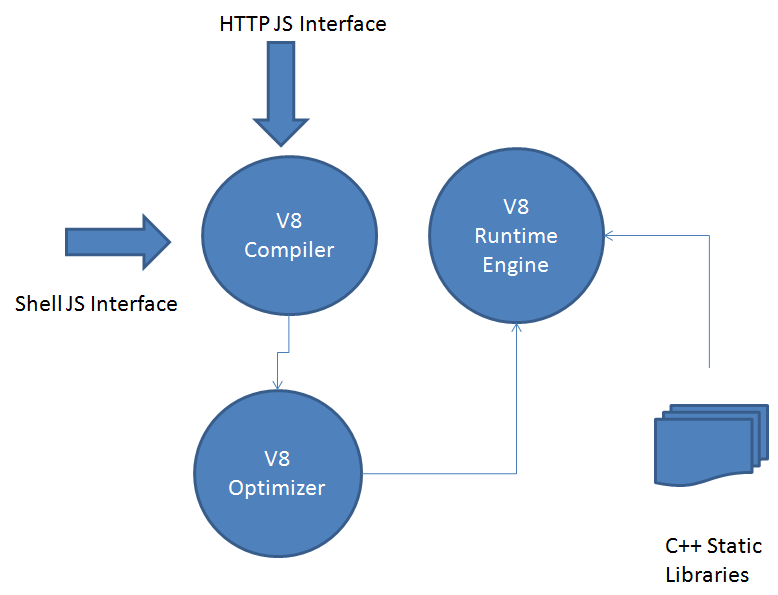

V8 JavaScript Engine Evaluation
-------------------------------

### Overview

The [V8 JavaScript Engine](https://developers.google.com/v8/) [21] is an open source JavaScript engine developed by Google for the Google Chrome web browser.

V8 compiles JavaScript to native machine code (IA-32, x86-64, ARM, or MIPS ISAs)before executing it, instead of more traditional techniques such as interpreting bytecode or compiling the whole program to machine code and executing it from a filesystem. The compiled code is additionally optimized (and re-optimized) dynamically at runtime, based on heuristics of the code's execution profile. Optimization techniques used include inlining, elision of expensive runtime properties, and inline caching, among many others

### Architecture



**Handles & Garbage Collection**

Handles represent a reference for a JavaScript object location on the process heap. The Garbage collector deletes any object on the heap with no valid reference on the process. The Garbage collector besides deleting objects on the heap frequently moves objects and updates all references to those objects. Obviously the Garbage Collector does not operate often, but from time to time it deletes all obsolete objects. Handles may come in different flavors inside v8, ranging from local handles, which have limited scope and terminate when the scope finishes, therefore susceptible to garbage collection, to persistent and even eternal scopes. In fact we can look on scopes as handle containers. Each time a scope terminates the objects referred by the handlers, in it residing, are flagged for collection. We always have to be in mind that an handle cannot survive its default scope, unless we predetermine its scope to be a special one (EscapableHandleScope ).

**Contexts**


Contexts are different execution environments that allow separate even unrelated JavaScript applications to run concurrently on v8. In fact, the context in which a JavaScript code is run must be explicitly specified. This happens because JavaScript provides functions and objects that may be changed globally and that may turn into unexpected results. One of the advantages of V8 is that it gives you an extensive cache, so in the first time a context may be expensive in time and resources, subsequent times will be substantially less. Additionally v8 has a snapshot feature that by default has pre-compiled JavaScript code on the heap, diminishing time procedures on first context initialization.

**Templates**

Templates are blueprints for JavaScript functions and objects in a context. Templates may be used to wrap c++ code onto JavaScript objects permitting its manipulation. One can only have one instance of a template on any given context. There are two types of templates:

-	function templates - blueprint for a function;
-	object templates - each template has associated an object

**Accessors**

Accessors are c++ callbacks that obtain and return a value when an object property is accessed by JavaScript. Obviously then can be used to set or read these values. The complexity of them depends on the data being manipulated (Static Global Variables or Dynamic Variables).

**Interceptors**

Interceptors are callbacks used to permit access to an object property. They can be:

-	named property interceptors - when accessing by string names;
-	indexed property interceptors - when the access is made by index.

**Exceptions**

v8 throws exceptions when an error occurs. In fact v8 returns an empty handle on an unsuccessful call.

**Inheritance**

While JavaScript is a class free language, c++ has classes and instances. It is important to take this in consideration because JavaScript only has objects, it is a prototype based language. To adapt both we have to refer to templates in v8.

**V8 Code provided for JavaScript processing**

process.cc - this code provides the capability to extend the process of an HTTP request. The JavaScript argument must provide a method named Process() for the execution to succeed. This provides an interface for HTTP JavaScript introduction on V8 and runtime execution.

shell.cc - this code takes as argument a filename with a JavaScript code inside and executes it. It extends several functionalities to JavaScript including a shell capability to run JavaScript snippets and their availability to other JavaScript code in runtime.

### Requirements Analysis

Analysis against [Hyperty Runtime Requirements](https://github.com/reTHINK-project/core-framework/labels/Runtime%20Requirement) (section ?)

#### [Runtime Performance](https://github.com/reTHINK-project/core-framework/issues/6)

Its apparently clear that V8 provides a significant improvement over previously adopted JavaScript interpretation engines like:

-	JScript from IExplorer;
-	SpiderMonkey (in Firefox);
-	JavaScriptCore (in Safari).

The amount of the improvements will depend on the multiplicity of the calls made to implemented methods. If the methods are made to be run only once the gains would be minimal, otherwise the gains will improve exponentially.

The reasons for these obtained improvements are:

-	Fast Property Access - unlike strong type languages like C# and Java, JavaScript like Python is a dynamic programing language. This means that properties can be added to and deleted from objects on the fly, so likely to change over time. Most JavaScript engines use a dictionary-like data structure as storage for the object properties. The fetching of each property, on access case, involves a dynamic lookup of the property memory location. This approach turns these accesses much slower than accesses in strong type languages. In these languages, the instance variables are located at fixed offsets determined at compile time due to the fixed layout of objects defined by the object's class. In fact, objects are obtained and stored frequently with only a single instruction. V8 does not use dynamic lookup of properties. It creates hidden classes behind the scenes. Each time a change of property occurs in an object a new hidden class is created and the object changes its representative class for the new hidden class. The hierarchy of hidden classes is maintained and shared each time a new object of the referred type is used again.This type of behavior promotes reuse by sharing off the hierarchy of hidden classes therefore avoiding dictionary lookups and efficiency by the inline caching of the classes in use.

-	Dynamic Machine Code Generation - V8 generates machine code directly from source code the first time the script is executed. A current JavaScript engine usually creates intermediate byte code and interpreter. The consequence thus is an object property access is handled with inline cache code in execution that may be patched with further instructions on execution. It may be explained by the execution of an access to an object property, V8 retrieves its associated hidden class and optimizes all future property accesses using this template, providing they share the same scope. This information is used in code patching of the inline cache code. If the V8 has access right, the property value is fetched in one operation, otherwise V8 patches the code to remove the optimization. This kind of optimization mirrors the benefits of static languages and achieves most benefits the more accesses to properties from an object in an wider scope.

-	Efficient Garbage Collection - V8, like most garbage collecting languages, reclaims memory used by objects that are no longer used in a process. Obviously garbage collection has known problems like memory fragmentation, pauses for garbage collection and fast object allocation. To avoid those problems as much as possible:

-	stops the program execution when in a cycle of garbage collection;

-	slices the object heap and only operates on part of it during a collecting cycle - lesses the time the application is stopped;

-	correct identification of objects and pointers in memory, avoiding memory leaks by wrong identification.

The V8 separates the heap in two distinct parts. The new space is where new objects are created and the old space where objects surviving a garbage collection cycle are promoted. V8 actualizes references when each cycle finishes.

#### [How to extend and to introduce new Features](https://github.com/reTHINK-project/core-framework/issues/8)

It is possible to extend the functionalities of V8 by adding new modules in c++. These new functionalities would be available to any programmer in JavaScript where this particular v8 engine resides. V8 provides functions that permit accessing c++ methods and classes, handling errors and enabling security checks. It provides full duality, in which it permits access from JavaScript scripts to c++ structures an vice-versa.

Code to add a new JavaScript code to V8

```
Handle<Value> Include(const Arguments& args) {
    for (int i = 0; i < args.Length(); i++) {
        String::Utf8Value str(args[i]);

        std::string js_file = load_file(*str);

        if(js_file.length() > 0) {
            Handle<String> source = String::New(js_file.c_str());
            Handle<Script> script = Script::Compile(source);
            return script->Run();
        }
    }
    return Undefined();
}

Handle<ObjectTemplate> global = ObjectTemplate::New();

global->Set(String::New("include"), FunctionTemplate::New(Include));
```

Obviously we also have to implement load_file(). It obtains in string format the content of a file.

#### [Runtime Security](https://github.com/reTHINK-project/core-framework/labels/Runtime%20Requirement)

The "Same Origin Policy" is applied and in fact prevents one document from changing the properties of another. This means one document has the same origin when protocol, domain name and port are the same. This provides a useful protection against malicious alterations. In v8 origin is defined as its context. To access other context it is necessary to use security tokens and callbacks. The security token are generated by v8 for each context created. when security tokens are not equal a callback must be made to challenge acceptable access.

#### Using Sandboxes with Node.js

[Node.js](https://Node.js.org/en/) [22] is a platform built on Chrome's JavaScript runtime V8 for easily building fast, scalable network applications. Node.js uses an event-driven, non-blocking I/O model that makes it lightweight and efficient, perfect for data-intensive real-time applications that run across distributed devices.

It is open source and specialized for server-side networking applications. Node.js operates on a single thread, using non-blocking I/O calls, allowing it to support tens of thousands of concurrent connections without incurring the cost of thread context-switching. The design of sharing a single thread between all the requests means it can be used to build highly concurrent applications. The design goal of a Node.js application is that any function performing I/O must use a callback.

Used to execute untrusted code. Has support for timeouts preventing infinite loops. Handles errors gracefully. Provides limited access to node.js methods, Supports print and console.log.

**Using Docker to run unsafe code on Node.js**

[Docker](https://www.docker.com/) [23] has a following on its own. Obviously security over docker is a well addressed issue.

#### [Web Messaging Notifications](https://github.com/reTHINK-project/core-framework/issues/5)

Implemented on WebKit on Chromium, so not applied directly on v8.

#### [Web Sockets](https://github.com/reTHINK-project/core-framework/issues/4)

V8 does not have an implementation of web sockets per si. There is an implementation of Web sockets in Chromium, and node.js seems to have an implementation also. It is not considered an issue for v8.
