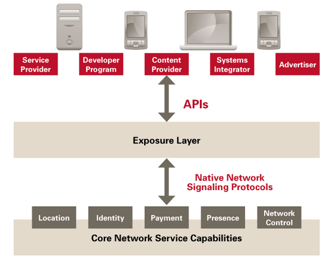

### Overview

The Open Mobile Alliance (OMA) is a Mobile Operator driven industry forum for the definition of interoperable mobile service enablers. OMA defines APIs to offer functionalities and resources of Operator networks to developers.

*OMA APIs Standardize Access to Unique Resources within Operator Networks
The OMA API program provides standardized interfaces to the service infrastructure residing within communication networks and on devices. Focused primarily between the service access layer and generic network capabilities, OMA API specifications allow operators and other service providers to expose device capabilities and network resources in an open and programmable way—to any developer community independent of the development platform.*

* *OMA APIs expose the network assets that developers need—no matter what protocols, platforms or other APIs they use.*
* *Core network assets must be made available in order to deploy the wide variety of new applications and services that enter the market every day.*
* *The OMA set of APIs increases the portability of applications and services in order to reach the subscriber base of operators and service providers that deploy OMA APIs.*
* *As the number of APIs that perform the same functionality proliferate, fragmentation occurs. This limits developer access to subscribers, and operator and service providers’ choices of development platforms and communities. The OMA API Program, through standardization, solves this problem.*

[Here you can find the full OMA API Inventory](http://technical.openmobilealliance.org/Technical/technical-information/oma-api-program/oma-api-inventory)

### Selected APIs with potential relevance for reTHINK

#### [RESTful Network API for WebRTC Signaling V1.0](http://technical.openmobilealliance.org/Technical/technical-information/oma-api-program/oma-api-inventory/api-details?API_ID=141)

released: 02/2014

This is a comprehensive REST-API for the WebRTC offer/answer signaling model. The payload that is transferred in the requests and responses is defined here as XML.

#### [Authorization Framework for Network APIs](http://technical.openmobilealliance.org//Technical/Release_Program/docs/Autho4API/V1_0-20131120-C/OMA-ER-Autho4API-V1_0-20131120-C.pdf)

released: 11/2013

*The Authorization Framework for Network APIs enables a Resource Owner owning network resources exposed by Network
APIs and RESTful APIs in particular, to authorize third-party Applications (desktop, mobile and web Applications)to access
these resources via that API on the Resource Owner’s behalf.*

* RESTful Network API
* *"may be complemented with a common delegated authorization framework based on IETF OAuth 2.0"*
* depends on some IETF OAuth 2.0 standards

#### Others ... to be completed

* Converged Address Book
* Customer Profile
* Network Message Store
* Notification Channel
* OneAPI
* Payment
* Presence
* Quality of Service

### Selected Protocols with potential relevance for ReTHINK
#### Light Weight M2M 
OMA Lightweight M2M is a protocol from the Open Mobile Alliance for M2M or IoT device management. Lightweight M2M enabler defines the application layer communication protocol between a LWM2M Server and a LWM2M Client, which is located in a LWM2M Device. The OMA Lightweight M2M enabler includes device management and service enablement for LWM2M Devices. It is normally used with COAT. This protocol can be used in ReTHINK for several tasks such as user registry. 
