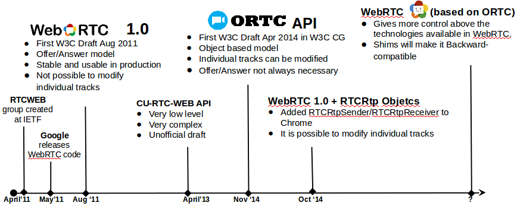

<h1>ORTC</h1>

<h2>Introduction</h2>
ORTC is an alternative to the current WebRTC API 1.0 to write WebRTC Applications to be executed in Web browser. 

The protocols on the wire are exactly the same so it is compatible with aaplications written using the current API.  

<h2>Differences between ORTC and WebRTC 1.0.</h2>
<ol>
Those are the main differences between ORTC and WebRTC 1.0:
<li>ORTC specifically tailored to provide the direct control needed to enable advanced multimedia and conferencing features.</li>
<li>Limitations of the WebRTC API 1.0 have been addressed in the new version.</li>
<li>many of the parameters which are automatically handled by the browser in WebRTC 1.0 can be now modified by using native methods.</li>
<li>SDP is not the mandatory format to exchange information between browsers.</li>
</ol>

<h2>Advantages of ORTC over WebRTC 1.0.</h2>
An example of WebRTC 1.0 limitation it is that is not possible to modify parameters on individual media tracks since the SDPs must contain all the mediatracks of a mediastream. ORTC includes the RTCRtpSender object which associated to a sending MediaStreamTrack which provides methods to tweak its parameters. 

An example of application of this new element is the ability to change the bitrate used for a video in-progess session which is being sent over a bad-quality connection keeping the parameters of the audio mediatrack.
In WebRTC 1.0 this changes requires a SDP re-negotiation but with ORTC this is not nececesary.

Although RTCRtpSender was not included in the WebRTC 1.0 definition, this element was planned to be supported by Chrome from version 39. 

<h2>Compatibility between ORTC and WebRTC 1.0.</h2>
Although SDP is not mandatory but WebRTC 1.0 applications would make it compatible thanks to Javasrcipts shims. 
All the use cases that ORTC would enable are already possible but they are more complex to implement as they require manual SDP manipulations which are error-prone and may require several Offer/Answer SDP exchanges to update the multimedia sessions.

<h2>ORTC implementations.</h2>

ORTC is the WebRTC API which Microsoft will implement in Internet Explorer and Skype will be supported in the Web Browser supporting ORTC along as other browsers which supports WebRTC 1.0.

