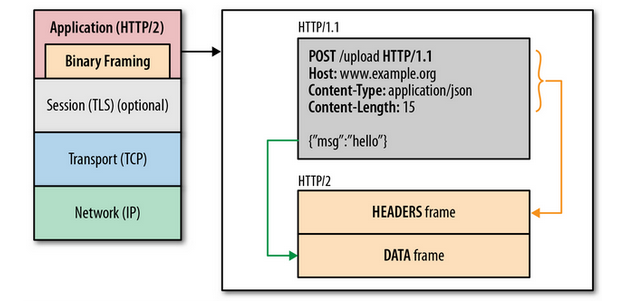
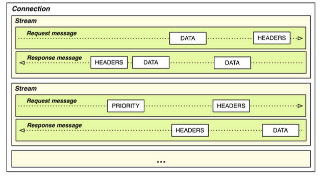

#HTTP/2 

## Introduction

HTTP/1.1 has served the Web for more than 15 years, but its age is starting to show. Web application has evolved a lot from the beginning but the protocol which transport it has not evolved at the same pace.

Loading a Web page is more resource intensive than ever because HTTP practically only allows one outstanding request per TCP connection:
* Browsers have used multiple TCP connections to issue parallel requests. This is counter-productive (TCP congestion control is effectively negated leading to congestion events), and unfair (browsers take more network resources).
* At the same time, the large number of requests means a lot of duplicated data “on the wire”.
* These factors mean that HTTP/1.1 requests have a lot of overhead associated with them; the more  requests are made, the worse performance we get.

This problems leaded the industry to consider “Best Practices” things like: spriting, data inlining, domain sharding and concatenation which are just workarounds which improves the user experience.These hacks are indications of underlying problems in the protocol itself, and cause a number of problems on their own when used.
On the other side, the way in which the Web is accessed has also change a lot, mobile devices has become the main point of entry to the web. Characteristics of wireless connections (high latency, jitter and packet loss) may prevent Web applications served with HTTP over TCP from being responsive and even usable.

, which is already a definitive RFC, was designed to be adapted to the new conditions of the WWW and its main goal is to improve the user experience. HTTP/2 is an evolution of SPDY, experimental protocol mainly developed by Google which is currenlty being used in production in many Google applications.
To take advantage of HTTP/2 new features a new transport protocol, QUIC, has been designed. Both protocols combined will be extensily used in Internet in the next years. 

## Main differences from HTTP1.1 

|HTTP/1.1   | HTTP/2  | 
|---|---|
|textual   | binary  |
| ordered and blocking  | fully multiplexed  |
| several connections for parallelism  |  one connection for parallelism |
| only content compression  | header compression  |
|   not proactive push     |     allows servers to “push” responses proactively into client caches      |

### Binary

HTTP/2 is a binary protocol, it means that no human-understable ASCII chars are sent on the wire. The main advantages of being binary are:
* Binary protocols are more efficient to parse by applications which does not have to handle with issues related to text-protocol parsing. 
* It is more compact “on the wire” since no extra information needs to be sent.
* It is much less error-prone, compared to textual protocols like HTTP/1.x with whitespace handling, capitalization, line endings, blank links...
HTTP/1.1 defines five different ways to parse a message; in HTTP/2, there’s just one code path.

### Fully multiplexed

HTTP/1.x suffers “head-of-line blocking”  only one request can be outstanding on a connection at a time. Pipelining of request is not a solution since a large or slow response will block others behind it. Additionally, it has been found very difficult to deploy, because many intermediaries and servers do not process it correctly.

### One connection for parallelism

With HTTP/1, browsers open between 4 and 8 connections per origin. Since many sites use multiple origins, this could mean that a single page load opens more than 30 connections. One application opening so many connections simultaneously breaks a lot of the assumptions that TCP was built upon. 
Since each connection will start a flood of data in the response, there is a real risk that buffers in the intervening network will overflow, causing a congestion event and retransmits.
Additionally, using so many connections unfairly monopolizes network resources, “stealing” them from other, better-behaved applications (e.g., VoIP).

### Header compression

HTTP/1 supported compression for content but not for headers. Assuming an average of 80 assets per page and each request has 1400 bytes of headers, it takes at least 7-8 round trips just to get the headers out “on the wire.” That is not counting response time - that is just to get them out of the client. 
Headers add a lot of overhead traffic and increase latency.

### Server push

In HTTP/2 the server can push resources to the client before receiving a request to server that resource. This reduce the load time as the browser does not have to send GET request to ask for all the resources avoiding RTT delays.

## Features of HTTP/2 

### HTTP/2 key concepts

1. All communication is performed over a single TCP connection that can carry any number of bidirectional streams.
2. Each stream has a unique identifier and optional priority information that is used to carry bidirectional messages.
3. Each message is a logical HTTP message, such as a request, or response, which consists of one or more frames.
4. The frame is the smallest unit of communication that carries a specific type of data—e.g., HTTP headers, message payload, and so on. 
5. Frames from different streams may be interleaved and then reassembled via the embedded stream identifier in the header of each frame.

### Framing
The frame is the smallest unit of communication in HTTP/2, each containing a frame header, which at a minimum identifies the stream to which the frame belongs. 

The most relevant frames are the used to transport Headers and Data, but there are also frames for other functions like stream control, push content and set the priority of the streams.
DATA frames are used to transport HTTP message bodies and HEADERS frames are used to communicate header fields for a stream. The rest of frames are used for control tasks and they are called Control Frames.

### Multiplexing

HTTP/2 interleave multiple requests and responses in parallel without blocking any one using a single connection to deliver and receive them. This allow to remove unnecessary HTTP/1.x workarounds such as concatenated files, image sprites, and domain sharding. 
It also resultes in  lower page load times by eliminating unnecessary latency and improving utilization of available network capacity.

### Priority

Not all the elements of a Web page are equally important for the functionality and visualization. An user can start consuming the content before loading all the elements. 
HTTP/2 allows to set different priorities to each stream and priority can be specified by the client side and it can be changed in runtime.

### Flow control

HTTP/2 applies flow control mechanism to the different streams. The flow control is directional with overall control provided by the receiver and the frame type determines whether flow control applies to a frame. Only DATA frames are subject to flow control (the most important part part of the traffic will transported in DATA frames) so control frames are not blocked by flow control.
On the other side, flow control cannot be disabled according to the HTTP/2 RFC draft.

## HTTP/2 encryption

The RFC allows HTTP/2 to be sent over unencrypted transport protocols like TCP. However Google and Mozilla have officially said that HTTP/2 is not going to be allowd to be sent over plain TCP but over TLS connection to avoid issues with intermediates element between the browser and the server. This has an impact in ReTHINK project as if a web site is served over TLS or a secure protocol, the rest of elements of that site must be served using an encrypted protocol. 

## Why using for HTTP/2 in ReTHINK project.

HTTP/2 is aimed to make the Web more efficient and responsive and it advantages are more notable for web sites. However the following points should be considered when discussing the use of HTTP/2 in the ReTHINK project:
* HTTP/2 is going to be massively adopted by Internet companies following Google and Twitter movements.
* The most relevant projects (Apache, NGINX, ) already supports or plan to support HTTP/2.
ReTHINK Javscript libraries are expected to be used also in web applications so supporting HTTP/2 would avoid mixing HTTP/1.1 and HTTP/2.
* ReTHINK will take advantage of the benefits of HTTP/2.
* HTTP/2 is normally going to be used over QUIC so we will take advantage of using QUIC as the transport protocol.
* Despite the fact of not being used to transport media, its characteristics would make it possible.

All the available implementations of HTTP/2 are gathered in the official HTTP/2 WG Github repository:  https://github.com/http2/http2-spec/wiki/Implementations

## Websocket over HTTP/2

The WebSocket protocol enables two-way communication between a client running untrusted code in a controlled environment to a remote host that has opted-in to communications from that code.  Since it requires one TCP connection for every WebSocket connection, having multiple WebSocket connections between the same client and the same server is inefficient.  On the other hand, HTTP/2 specifies a fast, secure, multiplexed framing protocol.  The  [draft!](http://tools.ietf.org/html/draft-hirano-httpbis-websocket-over-http2) document provides bi-directional multiplexed communication by layering WebSocket on top of HTTP/2. 
The document is still a draft but this could be used in ReTHINK project as it allows to get a bidirectional communication over an existing HTTP connection without the need of creating additional socket connections.

