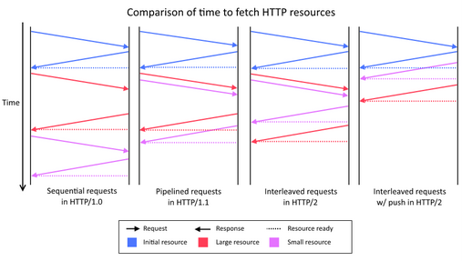

#HTTP/2 

## Introduction

HTTP/1.1 has served the Web for more than 15 years, but its age is starting to show. Web application has evolved a lot from the beginning but the protocol which transport it has not evolved at the same pace.

Loading a Web page is more resource intensive than ever because HTTP practically only allows one outstanding request per TCP connection:
* Browsers have used multiple TCP connections to issue parallel requests. This is counter-productive (TCP congestion control is effectively negated leading to congestion events), and unfair (browsers take more network resources).
* At the same time, the large number of requests means a lot of duplicated data “on the wire”.
* These factors mean that HTTP/1.1 requests have a lot of overhead associated with them; the more  requests are made, the worse performance we get.

This problems leaded the industry to consider “Best Practices” things like: spriting, data inlining, domain sharding and concatenation which are just workarounds which improves the user experience.These hacks are indications of underlying problems in the protocol itself, and cause a number of problems on their own when used.
On the other side, the way in which the Web is accessed has also change a lot, mobile devices has become the main point of entry to the web. Characteristics of wireless connections (high latency, jitter and packet loss) may prevent Web applications served with HTTP over TCP from being responsive and even usable.

HTTP/2, which soon will become a definitive RFC, was designed to be adapted to the new conditions of the WWW and its main goal is to improve the user experience. HTTP/2 is an evolution of SPDY, experimental protocol mainly developed by Google which is currenlty being used in production in many Google applications.
To take advantage of HTTP/2 new features a new transport protocol, QUIC, has been designed. Both protocols combined will be extensily used in Internet in the next years. 

## HTTP/2 history and current status
HTTP/2 keeps all the messages and the 

## Main differences from HTTP1.1 

|HTTP/1.1   | HTTP/2  | 
|---|---|
|textual   | binary  |
| ordered and blocking  | fully multiplexed  |
| several connections for parallelism  |  one connection for parallelism |
| only content compression  | header compression  |
|   not proactive push     |     allows servers to “push” responses proactively into client caches      |

### Binary

HTTP/2 is a binary protocol, it means that no human-understable ASCII chars are sent on the wire. The main advantages of being binary are:
* Binary protocols are more efficient to parse by applications which does not have to handle with issues related to text-protocol parsing. 
* It is more compact “on the wire” since no extra information needs to be sent.
* It is much less error-prone, compared to textual protocols like HTTP/1.x with whitespace handling, capitalization, line endings, blank links...
HTTP/1.1 defines five different ways to parse a message; in HTTP/2, there’s just one code path.

### Fully multiplexed

HTTP/1.x suffers “head-of-line blocking”  only one request can be outstanding on a connection at a time. Pipelining of request is not a solution since a large or slow response will block others behind it. Additionally, it has been found very difficult to deploy, because many intermediaries and servers do not process it correctly.

### One connection for parallelism

With HTTP/1, browsers open between 4 and 8 connections per origin. Since many sites use multiple origins, this could mean that a single page load opens more than 30 connections. One application opening so many connections simultaneously breaks a lot of the assumptions that TCP was built upon. 
Since each connection will start a flood of data in the response, there is a real risk that buffers in the intervening network will overflow, causing a congestion event and retransmits.
Additionally, using so many connections unfairly monopolizes network resources, “stealing” them from other, better-behaved applications (e.g., VoIP).

### Header compression

HTTP/1 supported compression for content but not for headers. Assuming an average of 80 assets per page and each request has 1400 bytes of headers, it takes at least 7-8 round trips just to get the headers out “on the wire.” That is not counting response time - that is just to get them out of the client. 
Headers add a lot of overhead traffic and increase latency.

### Server push

In HTTP/2 the server can push resources to the client before receiving a request to server that resource. This reduce the load time as the browser does not have to send GET request to ask for all the resources avoiding RTT delays.

## Features of HTTP/2 

## Why using for HTTP/2 in ReTHINK project.

HTTP/2 is aimed to make the Web more efficient and responsive and it advantages are more notable for web sites. However is going to be 

All the available implementations of HTTP/2 are gathered in the official HTTP/2 WG Github repository:  https://github.com/http2/http2-spec/wiki/Implementations

## Websocket over HTTP/2

