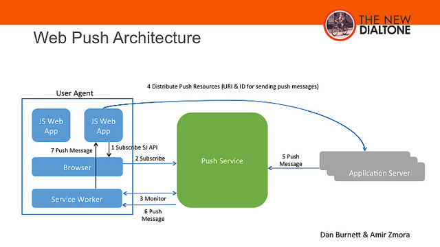

### W3C Push API

W3C Push API work began in the W3C Web Applications (WEBAPPS) Working Group to provide very simple JavaScript APIs for push client registering and message receipt. It was in large part, driven by the urgent WebRTC use case of waking up an application for a real-time incoming call. The API has two logical pieces:

* a pushRegistrationManager that consults the user agent about which push service to use and returns information (a registration id and a URI) that can be sent to the application server for it to know how to reach the push service. In general, the URI is where the application server can send push messages and the registration id is to be provided to the push service to indicate the delivery target for the messages.
* a Service Worker that is used to catch, store if necessary, and ultimately deliver push messages to the application.

The following general entities and example operation for delivery of push messages are the following (see figure below):

* Application servers request delivery of a push message to a webapp via a RESTful API exposed by a push service
* The push service delivers the message to a specific user agent
* The user agent delivers the push message to the specific webapp intended to receive it.

The main data flows involved in the PUSH API usage are described below:

The W3C Push API is a client API that does not provide any standard for how the application server sends messages to the push server. This part is covered by the IETF WEBPUSH protocol.

### IETF Web Push

In order to provide a standard way for push notification to be used on the Internet, the IETF WEBPUSH working group was created in late 2014.  The WEBPUSH WG is developing an HTTP2-based mechanism for applications “to request the delivery of data to a device using a consolidated push notification service. This protocol will include the ability to push the same message to multiple subscribed devices. 

Expected clients are both web applications and field gateways that consolidate and forward messages to embedded devices.  Several models have been discussed, and there currently seems to be most interest in a publication-subscription model where each device subscribes individually, but with no requirement for a separate registration in advance.

This working group will create an HTTP based protocol that will allow applications to request delivery of data to applications through a consolidated service. The working group will work in cooperation with W3C’s Web Push API. 

### Applicability to reTHINK

The ability to push notifications towards Hyperty runtime is an essential feature that must be supported according to these standards.

