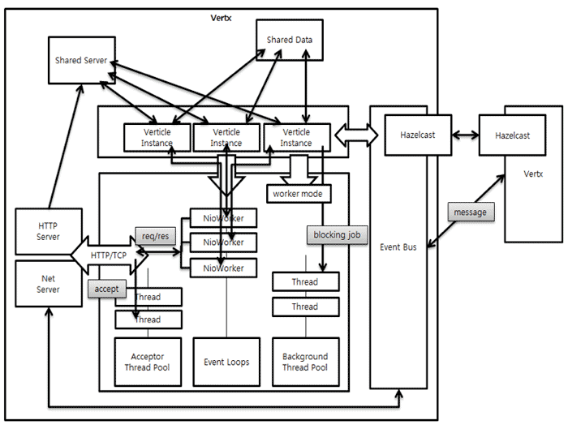

## Vert.x Evaluation

### Overview

*Overview of functionalities and type of WP3 component that the asset can be used for ie Messaging Node, Runtime, Network QoS and Framework* 


Vert.x is an application framework developed by VMWare in 2011. The application framework provides possibilities to develope loosely coupled network service applications.  

The concept of the framework is summarized as follows:
* **Polyglot (supports several languages)**:
Vert.x framework runs on the Java Virtual Machine. However, Java is not required to use Vert.x. 
As well as languages based on JVM operation, such as Java or Groovy, Vert.x can be used with Ruby, Python, and even JavaScript. In addition, Scala and Closure are planned to be supported.
* **Super Simple Concurrency model**:
When building an application by using Vert.x, users can write code as a single thread application. That means that the multi-thread programming effect can be achieved without synchronization, lock, or volatility.
However, Vert.x allows to create multiple threads based on the number of CPU cores whlie only one process is executed. It handle the multi-threading so users can focus on implementing business logic.
* **Provides Event Bus**:
The main concept of Vert.x is not only to produce a ‘one server process DAEMON'. Vert.x aims to make a variety of Vert.x-built server programs communicate well with each other. For this, Vert.x provides Event Bus. Therefore, functions such as Point to Point or Pub/Sub can be used (to provide Event Bus function, Vert.x uses Hazelcast, an In-Memory Data Grid).
With this Event Bus, a server application built with different languages can easily communicate with each other.
* **Module System & Public Module Repository**:
Vert.x has a module system. This module system can be understood as a type of component. That means the Vert.x-built server application project itself is modularized. It aims at reusability. Modules can be registered to Public Module Repository. Through the Public Module Repository, the module can be shared

### Architecture
This subsection highlights the main building blocks of the Vert.x architecture. 


Figure 1. Vert.x Architecture

### Addressing
Messages are sent on the event bus to an address. Vert.x instances are not bound to any addressing schemes. An address is simply a string, any string is valid. Some examples of valid addresses are ```europe.news.feed1```, ```acme.games.pacman```, ```sausages```, and ```X```.
As a convention the names of the packages that implement certain functionalities should also be represented on the event bus and should be combined with a meaningful event/operation name, e.g. ```org.acme.MyPackage.MyClass.doSomething```

### Handlers
A handler is an entity that receives messages from the event bus. You register a handler at an address. Many different handlers from the same or different modules can be registered at the same address. A single handler can be registered at many different addresses at the same time.

### Messaging Schemes
The Event Bus supports the following modes of operation: 
* *Publish / subscribe messaging*: Publishing means delivering the message to all handlers that are registered at that address. This is the familiar publish/subscribe messaging pattern. 
* *Point to point and Request-Response messaging*: Messages are routed to just one of the handlers registered at an address. They can optionally be replied to. 
* *Remote Procedure Call (RPC)*: This mode of operation is implemented on top of the Request-Response model, basically by enforcing certain conventions on requests and responses

This example shows the Event Bus can be instantiated, how a Handler can be defined and registered on the Event Bus and how the Event Bus can subsequently publish a message for the defined Handler:

```
EventBus eb = vertx.eventBus();

Handler<Message> myHandler = new Handler<Message>(){

	public void handle(Message message){
		System.out.println("I just recieved a message "+ message.body);
	}
};
//test.address is the address at which this handler will be registered
eb.registerHandler("test.address", myHandler);

...
//publishing a message. The message will be delivered to all handlers registered against the address
eb.publish("test.address", "hello world");
//point-2-point sending of message. 
//Only one handler registered at the address receiving the message. 
//The handler is chosen in a non strict round-robin fashion
eb.send("test.address", "hello world");

...

eb.unregisterHandler("test.address", myHandler);

```

### Types of Messages
Messages that you send on the event bus can be as simple as a string, a number or a boolean. It is also possible to send Vert.x buffers or JSON messages. 
It's highly recommended to use JSON messages to communicate between verticles. JSON is easy to create and parse in all the languages that Vert.x supports. 
For RPC messages, JSON is enforced.

## Verticle
The unit of execution for Vert.x applications is called a Verticle. Verticles can be written in multiple languages (JavaScript, Ruby, Java, Groovy or Python). Many verticles can be executed concurrently in the same Vert.x instance. An application might be composed of multiple verticles deployed on different nodes of the network communicating by exchanging messages over the Vert.x Event Bus. For trivial applications verticles can be run directly from the command line, but more usually they are packaged up into modules.

## Module
Applications within the framework comprise of one or more modules.  The framework allows packaging of applications or other re-usable functionality into modules, which can be deployed or used by other code. Module can also by catalogue in the Vert.x module registry so others can discover and use it. The framework offers the possibility to automatically download and install modules from any repository given the module identifier.
Each module has a unique identifier. The identifier is a string that is composed of three parts:
A module can contain any number of (including zero) verticles and can depend on other modules (and their verticles) in turn. Creating a module with no verticles makes sense to provide only library support for other modules.  Modules are described by a descriptor file: mod.json. A minimal descriptor looks like this: 

```
{
  "owner": "org.acmecorp",
  "name": "myReThinkAdapterModule",
  "version": "0.1"
}
```
Additionally, three more fields are optionally recognized:
* ```worker```
indicates if this is a worker module. See below under event loop. 
* ```main```
Indicates the startup routine for this module. 
* ```includes```
Additional module dependencies as a comma-separated string.

## Event Loop
By default, all verticles run in an asynchronous event loop. When developing a verticle, it is essential not to block the event loop. Blocking here means either doing any kind of blocking I/O or even doing any kind of computational intensive work. Modules that do either of these should indicate that they are so called ```worker``` modules by setting ```"worker": true``` in their *mod.json* file. 
The advantage of an event loop is that it is enormously scalable. Instead of waiting for I/O operations to complete, the executing thread will rather do other stuff (e.g. servicing the next request) in the meantime. This is achieved by using a callback driven style of programming. Imagine the following scenario: 
*We want to read some data in an I/O intensive operation (function ```readData```) 
*We want to do something with that data (function ```doSomething```) 
*We want to do something completely different (function ```doSomethingUnrelated```) 
*In the traditional blocking world we would do something like the following: 
```
def doSomething(data):
    # do something with data
data = readData()
doSomething(data)
doSomethingUnrelated()
```
What happens here is the following: 

After the data is read, the program waits for the operation (```readData```) to complete (which is consuming the event loop thread lifetime). As soon as ```readData``` returns, we have our data and can go on to do something with it (```doSomething(data)```). Finally, when that is done, we can go on and do other stuff (```doSomethingUnrelated```).

```
In the asynchronous world, we do something like this: 
def doSomething(data):
    # do something with data
readData(callback = doSomething)
doSomethingUnrelated()
```
As can be seen, the result of ```readData``` is not received in the functions return value. Instead ```doSomething``` is passed in the handler method as a callback. The framework will take care that this handler is called asynchronously as soon as the data is available


### APIs
Vert.x provides the different APIs which are implemented in various languages:

**Core API
* TCP client/Server API
* HTTP client/Server API
* Transport Protocol (Websocket, SockJS(provides websocket-like API through http), UDP, TCP)
* File System Access
* DNS client API
* Shared Data
* Event Bus API
* JSON API

**Container API
* Deploy and undeploy verticles
* Deploy and undeploy modules
* Retrieve verticle configuration
* Logging

### Requirements Analysis

*According to Component Type addressed by the solution ie Messaging Node, Runtime, Network QoS and Framework*

#### [Autentication and Authorisation](https://github.com/reTHINK-project/core-framework/issues/10) (PTIN)

External Authentication and Authorisation are supported through the usage of an Authorisation module:

```java
container.deployModule("io.vertx~mod-auth-mgr~2.0.0-final");
```

The Authorisation module can be the front-end to interact with an external vertx service eg with restful APIs or could be attached to the vertx-io event bus.

**Authorisation to Send/publish a Message**

* SockJSServer, where we need a bridge configuration
 * InboudPermitted must have: vertx.basicauthmanager.login and clients handler
  ```java
JsonArray inboundPermitted = new JsonArray();

JsonObject inboundPermitted1 = new JsonObject().putString("address", "vertx.basicauthmanager.login");
inboundPermitted.add(inboundPermitted1);
JsonObject inboundPermitted2 = new JsonObject().putString("address", "aliceHandler").putBoolean("requires_auth",true);
inboundPermitted.add(inboundPermitted2);
  ```
Inboundpermitted allows the use of the "requires_auth" flag. When it is true, messages will be first forwarded to the authorization module, where decisions to send or not the messages are taken.

**receive a Message**

 * OutboundPermitted must have: clients handler.
  ```java
outboundPermitted.add(new JsonObject().putString("address", "aliceHandler"));
  ```
```java
sockJSServer.bridge(new JsonObject().putString("prefix", "/eventbus"), inboundPermitted, outboundPermitted);
```

**Example: communication between two javascript clients connected via SockJS**

Both client applications perform log-in on the EventBus.
```javascript
eb.login('alice','alice123', function(reply){console.log(reply);});
```

Then the client A(alice) wants to send messages to the client B(bob), so client B(bob) needs to register a handler. 
Before the client A(alice) can send a message to client B(bob), B must first register himself.
```javascript
eb.registerHandler('bobHandler', function(reply){console.log(reply);});
```
After that client A (alice) can publish messages on client B (bob) handler
```javascript 
eb.publish('bobHandler','Hello bob from alice');
```
When client A publishes a message to client B handler, this message will be first forwarded to the authorization module because of inbounpermitted configuration.

**subscribe / register handlers to be notified about published messages**

In the SockJSServer configuration we can set a Hook (Registers functions to be called when certain events occur on an event bus bridge).
```java
ServerHook hook = new ServerHook(logger);
sockJSServer.setHook(hook);
```

ServerHook takes some keyword arguments for example:

* pre-register: Called before a client handler registration is processed.
```java
 public boolean handlePreRegister(SockJSSocket sock, String address) {
    logger.info("handlePreRegister, sock = " + sock + ", address = " + address);
    return true;
  }
```

In this way handlers registration can be controlled.

#### [Unstable Connections](https://github.com/reTHINK-project/core-framework/issues/15)(PTIN)

Hint from Fokus: Since vertx is based on http://hazelcast.org/ we can use it to cache some info including the sessionId

### [Carrier grade deployment features (Resilience, DoS and DDoS protection, Service Assurance)](Messaging Node with carrier grade deployment features) (FOKUS)
* Resilience: Vert.x provides resilience through the "automatic failover" and "HA group" options. When a module is run with HA, if the Vert.x instance where it is running fails, it will be re-started automatically on another node of the cluster. An HA group denotes a logical grouping of nodes in the cluster. Only nodes with the same HA group will failover onto one another. 
* DoS and DDoS Protection: Vert.x 2.x. has no support for this, BUT Vert.x 3.0 provides built-in core functiionality for this core
* Service Assurance: Modules can be deployed in clusters, and Vert.x provides an internal Load Balancer for routing messages within the cluster. Also the above mentioned "auomatic failoer" and "HA group" options contribute to enforce service assurance. 

### [Scalability] (https://github.com/reTHINK-project/core-framework/issues/16) (FOKUS)
Verticle instances, except advanced multi-threaded worker verticles are almost always single threaded. what this implies is that, a single verticle instance can at most utilise one core of the server. In order to scale across cores, several verticles which are responsible for the same task can be instantiated and the runtime will distribute the workload among them (load balancing), this way taking full advantage of all SPU cores without much effort. Verticles can also be distributed between several machines. This will be transparent to the application code. The Verticles use the same mechanisms to communicate as if they would run on the same machine. This makes it very easy to scale applications.

### [Messaging Transport Protocols] (https://github.com/reTHINK-project/core-framework/issues/20)
* Websockets are supported
* SockJS also supported
