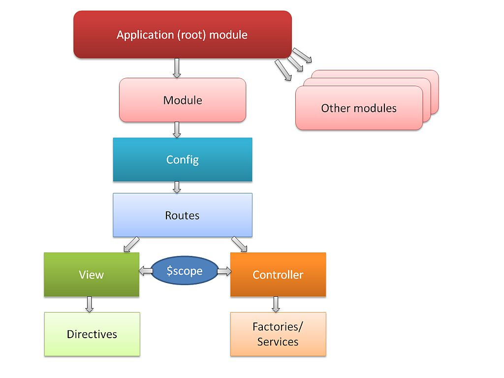

### AngularJS Framework

#### Overview

AngularJS [51] is a JavaScript MVC Framework developed and promoted by Google, to build well architectured and maintainable web applications. It is usually mistaken for a library due to its lightweight than normal frameworks. It is entirely based on JavaScript and a client side framework. It is supported by multiple browsers.



**Main Features**

-	*Compiler* : Compiler is an angular service which traverses the DOM looking for attributes. It allows the developer to teach the browser new HTML syntax. The compiler allows you to attach behavior to any HTML element or attribute and even create new HTML elements or attributes with custom behavior. Angular calls these behavior extensions directives. The compilation process happens in two phases. Compile: traverse the DOM and collect all of the directives. The result is a linking function. Link: combine the directives with a scope and produce a live view. Any changes in the scope model are reflected in the view, and any user interactions with the view are reflected in the scope model. This makes the scope model the single source of truth.
-	*Directive* : Directives can be placed in element names, attributes, class names, as well as comments.  Directives are a way to teach HTML new tricks. A directive is just a function which executes when the compiler encounters it in the DOM `<input ng-model='name'>`. It is possible to define custom derective`<span draggable>Drag ME</span>`.
-	ng-app Directive: Angular uses this directive to auto-bootstrp an application. Only one ng-app directive can be used per HTML document.`<html ng-app>`
-	Expression : Expressions are JavaScript-like code snippets that are usually placed in bindings such as ´{{ expression }} <body> 1+2={{1+2}}</body>\`
-	*Form & Control* : Forms and controls provide validation services, so that the user can be notified of invalid input. This provides a better user experience, because the user gets instant feedback on how to correct the error.
-	Modules: Modules declaratively specify how an application should be bootstrapped. There can be multiple modules in an app Those could be interdependent too. Modules are configured with routes, controllers, models etc.

```
var myAppModule = angular.module('myApp', [--here goes the dependent Modules--]);
```

-	*Routing* : It Is used for deep-linking URLs to controllers and views (HTML partials). It watches $location.url() and tries to map the path to an existing route definition.
-	*Scope* : Scope is an object that refers to the application model. It is an execution context for expressions. Scopes are arranged in hierarchical structure which mimic the DOM structure of the application. Scopes can watch expressions and propagate events.
-	*Dependency Injection* : Dependency Injection (DI) is a software design pattern that deals with how code gets hold of its dependencies
-	*Filters* : Angular filters format data for display to the user. custom filters can be created as well

#### Evaluation

##### Positive

-	Encourages MVC design pattern
-	Two way data binding allows for automation synchronization of data between model and view components
-	Written for testability and with modularized code which enables clarity , extensibility and strong built-in-services
-	Active project with a large eco-system, leading to higher rates of inquiries answered and new developments
-	End-to end integration testing and Unit testing
-	Fast Development once familiar with structure and concept
-	Very expressive, leading to less code for same result as with other libraries

##### Negative

-	Complex Directives API
-	Good for Single Page Apps (SPA), SO, is not the best option to go for Hyperty Developments
-	Complex Directives API
-	Runtime configuration only only before Bootstrap procedure. No configuration possible after.
-	Scopes are easy to use but difficult to debug

#### Requirement Analysis

Analysis against **Service Framework** Requirements

-	[Service Framework **MUST** be Messaging Node agnostic](https://github.com/reTHINK-project/core-framework/issues/44): **Yes**

-	[The Service Framework **MUST** avoid any JavaScript conflicts](https://github.com/reTHINK-project/core-framework/issues/43): **No** This is a namespace issue and potential conflicts with other frameworks are likely to occur

-	[Service Framework **MUST** be Modular in nature](https://github.com/reTHINK-project/core-framework/issues/42): **Yes** The framework is modular, and offers developers possibility to write their own modules or import third party modules.

-	[The Service Framework **MUST** be open source](https://github.com/reTHINK-project/core-framework/issues/39): **Yes**

	AngularJS is an open-source framework maintained by Google and by a community of individual developers and corporations

-	[Service Framework **SHOULD** be device agnostic](https://github.com/reTHINK-project/core-framework/issues/38): **Yes** It runs on all devices and operating systems envisioned to host the Hyperty Runtime (Android, iOS, Raspberry PI, Linux VM, Windows VM)

-	[Service Framework **MUST** be light weight and fast](https://github.com/reTHINK-project/core-framework/issues/37): **yes** The current minimized gzipped web version is 172KB while the minimized gzipped web app version is 146KB. Gzip compresses it down to one third and Data per page has small memory footprint

-	[Service Framework **SHOULD** support Model-View-Controller design pattern](https://github.com/reTHINK-project/core-framework/issues/36): **Yes** The Angular framework provides a powerful MVC design Pattern

