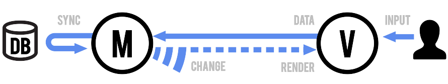
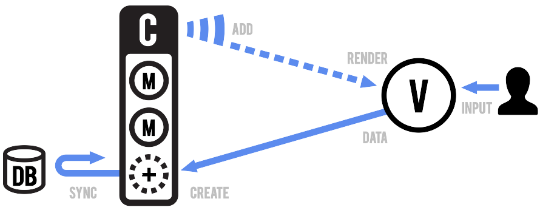

### BackboneJS Framework

#### Overview
BackboneJS is a web frontend framework that provides structure to web applications by specifying models with key-value binding and custom events, collections with a rich API of enumerable functions, views with declarative event handling, and connects it all to your existing API over a RESTful JSON interface.

##### Models and Views

The model looks as follows:

##### Model

* Orchestrates data and business logic,
* Loads and saves from the server,
* Emits events when data changes.

A Model manages an internal table of data attributes, and triggers "change" events when any of its data is modified. Models handle syncing data with a persistence layer — usually a REST API with a backing database. Design your models as the atomic reusable objects containing all of the helpful functions for manipulating their particular bit of data. Models should be able to be passed around throughout your app, and used anywhere that bit of data is needed.

##### View

* Listens for changes and renders UI.
* Handles user input and interactivity.
* Sends captured input to the model.

A View is an atomic chunk of user interface. It often renders the data from a specific model, or number of models — but views can also be data-less chunks of UI that stand alone. Models should be generally unaware of views. Instead, views listen to the model "change" events, and react or re-render themselves appropriately.

##### Collections

A Collection helps you deal with a group of related models, handling the loading and saving of new models to the server and providing helper functions for performing aggregations or computations against a list of models. Aside from their own events, collections also proxy through all of the events that occur to models within them, allowing you to listen in one place for any change that might happen to any model in the collection.

#### Overall Evaluation

* No concept of separated Controller
* functionality is basic
* provides no "golden pattern" for structuring of an application
* leaves lots of structuring decisions to the developer
* well suited for creation of own frameworks
* **no two-way data binding --> lots of boilerplate code required**
* **views change DOM directly by looking up css class names**
* --> changing CSS or modifications in DOM (wrapping, nesting) requires updates in code

#### Requirement Analysis

Analysis against **Service Framework** Requirements

- [Service Framework **MUST** be Message Node agnostic](https://github.com/reTHINK-project/core-framework/issues/44): **Yes**
-[Service Framework SHOULD support Model-View-Controller design pattern](https://github.com/reTHINK-project/core-framework/issues/36)
  * NO
  * The Backbone framework provides a MV Pattern with direct interaction between Models and Views.
  * The controller part is mainly done in the code of the models and also the views.

- [Service Framework MUST be light weight and fast](https://github.com/reTHINK-project/core-framework/issues/37)
  * YES
  * minimized gzipped version is very small (approx 5.6kb)
  * mandatory dependcies to underscore.js (5kb) and jQuery (32kb) or Zepto(9,1kb, a JQuery clone)
  * small memory footprint

- [Service Framework **SHOULD** be device agnostic](https://github.com/reTHINK-project/core-framework/issues/38)
  * rather YES
  * every view is tight to its own root-DOM element and responsible for the tree below it
  * Therefore Backbone.js relies on runtimes that provide a DOM tree.
  * But this does NOT have to be a "real" DOM tree --> can be used with e.g. React virtual DOM (React has implemented a browser-independent events and DOM system)
  * --> needs special additions in non-browser runtime environments

- [Service Framework MUST be Modular in nature](https://github.com/reTHINK-project/core-framework/issues/42)
  * rather NO
  * Backbone itself lacks a Controller concept and Views and Models are relatively tightly coupled
  * therefore also resulting modules should be tightly coupled to view elements and not easily portable (would need further investigations)
  * Models stand-alone and their synchronization capabilities with backend storages should be portable and fulfill this requirement
