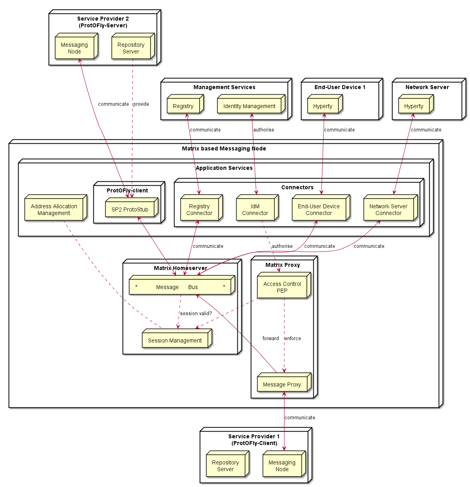

## Matrix.org based Messaging Node Specification

This section matches the requirements for the functional blocks of the Message Node architecture to features and functional blocks of the matrix.org architecture. Functional gaps are identified and proposals for extensions to the standard Matrix.org Homeserver are made in order to fill these gaps.

### Protocol Stub and Connectors

Protocol Stubs and Connectors are means to make a Messaging Node interoperable with foreign signalling protocols.

A protocol stub is the core entity of the Protocol-on-the-fly concept. It is a downloadable piece of JavaScript code that is executed in the client's runtime and performs the required adaptations on the messaging protocol. In a Protocol-on-the-fly based communication relation there is always one side in the client role (i.e. the side that downloads the stub) and the other side in the server role (the side that the stub connects to).

A Messaging node has to support both operation modes in order to provide full bi-directional interoperability.

#### Matrix as Protocol-on-the-fly client

The most appropriate feature that Matrix provides for this purpose is the concept of "Application Services". An Application Service is an implementation of a special service function that can be attached to a Homeserver (HS). Based on certain patterns, messages are filtered and forwarded to the Application Service that performs application specific tasks. This concept is quite comparable to Application Servers in the IP Multimedia Subsystem (IMS) framework. It can, for example, be used for aggregation and accounting purposes, but also for the implementation of "breakout" communication to other types of messaging infrastructures it is well suited.

A special dedicated Application Service is proposed that will implement a Protocol-on-the-fly client engine to allow the "breakout" to different signalling domains that provide a Protocol-on-the-fly stub. Such an Application Service will be a very flexible mechanism for interdomain collaboration.

#### Matrix as Protocol-on-the-fly server

In order to support the server role in the Protocol-on-the-fly architecture, a specialized Matrix protocol stub needs to be implemented that connects to a Homeserver. Since the Matrix Homeserver has a well-documented API and the Matrix message format allows the transport of arbitrary payload, this implementation should be straight forward. The implementation can make use of the SDK's that are available for Matrix client developers. These SDK's encapsulate a lot of the internal complexity for REST based communication.

#### Connectors in Matrix

Connectors also play the role of protocol adapters, which makes them comparable to protocol stubs. The difference is that they are not downloaded to the Messaging Node clients. Instead they are executed in the scope of the Messaging Node itself. Such Connectors are intended to connect with different "legacy" clients that don't support the Protocol-on-the-fly concept.

Also for the implementation of such connectors the concept of Application Services seems well suited. The matrix.org developer community has implemented this as a proof of concept that connects the Matrix ecosystem with the IRC (Internet Relay Chat) world. Messages that contain a specially prefixed address are filtered out, converted to IRC messages, forwarded to the corresponding IRC client and vice versa. This can be used as pattern for the implementation of additional adapters.

### Core Functionalities

#### Message Bus

The Message Bus is responsible for the routing of messages to internal Messaging Node components and external elements by using Connectors or Protocol Stubs. This routing shall support different communication patterns including publish/subscribe communication.

These main routing requirements are fulfilled out-of-the-box by standard matrix features. In order to route messages to internal Messaging Node components it will be required to provide such components with virtual identifiers that can be used internally to address them.

#### Access Control

The main task of the access control is to enforce manageable policies to the forwarding of individual messages. For example, a single type of message shall be blocked if a special combination of sender and/or receiver matches.

Matrix.org requires registration/subscription and login of users in order to exchange any messages with other users. These authentication and authorisation methods however always apply to a complete user- and communication session, that means to ALL messages that are exchanged in a session scope. This concept does not provide an access control on a "per message" base.

The matrix developer community already discusses the integration of a "policy service", but so far this integration in not yet specified.

In order to achieve a "per message"-policy enforcement without deeper changes in the matrix core, we propose the introduction of a message proxy as first step of the message flow. This proxy has the task to check the messages and to apply the policies. It would forward messages according to the policies and should reject the rest. A potential bypassing of this proxy must be avoided by appropriate network configurations.

The design of this message proxy component should be closely coordinated with the MessagingStub that is used to connect to this Matrix based Messaging Node, because the proxy will be the first contact point for the stub.

The following figure gives an overview of the intended architecture of the Matrix based Messaging Node.

<!--
@startuml "matrix_messaging_node_architecture.png"

node "Management Services" as Man1 {
	node "Registry" as Server1
	node "Identity Management" as IdM1

}

node "Service Provider 2\n(ProtOFly-Server)" as SP2 {
	node "Messaging\nNode" as Msg2
	node "Repository\nServer" as Repo2
}

node "End-User Device 1" as User1 {
	node "Hyperty" as H1
}

node "Network Server" as Net {
	node "Hyperty" as H3
}

node "Service Provider 1\n(ProtOFly-Client)" as SP1 {
	node "Messaging\nNode" as Msg1
	node "Repository\nServer" as Repo1
}

node "Matrix based Messaging Node" as msg {

 node "Application Services" as AppServices {
   node "Connectors" as Conn {
   	node "IdM\nConnector" as ConnIdM
   	node "Registry\nConnector" as ConnMan
   	node "End-User Device\nConnector" as ConnUser
   	node "Network Server\nConnector" as ConnNet
   }
   node "ProtOFly-client" as Proto1Sand {
  	 node "SP2 ProtoStub" as Proto1
   }
   node "Address Allocation\nManagement" as ID
 }

node "Matrix Homeserver" as core {
 node "*            Message      Bus                *" as Bus
 node "Session Management" as Reg
}

node "Matrix Proxy" as proxy {
  node "Access Control\nPEP" as BusPEP
  node "Message Proxy" as MsgProxy
}

Repo2 ..down-> Proto1: provide

Msg2 <-left-> Proto1 : communicate

 Bus <-right-> Proto1

 BusPEP ..down-> MsgProxy : enforce

 MsgProxy -> Bus : forward

 Msg1 <-left-> MsgProxy : communicate

 ConnIdM ..down-> BusPEP : authorise

 BusPEP .down-> Reg

 Reg .left. ID

 Reg <-up. Bus: session valid?

 ConnIdM <-up-> IdM1 : authorise

 Bus <-up-> ConnUser : communicate
 ConnUser <-up-> H1 : communicate

 Bus <-up-> ConnNet : communicate
 ConnNet <-up-> H3 : communicate

 Bus <-up-> ConnMan : communicate
 ConnMan <-up-> Server1 : communicate
 	}

@enduml
-->

#### Session Management

The requirements regarding session management as described in the Messaging Node architecture can be separated in three aspects which are handled in the following sub-chapters:
* User session control,
* Communication session control, and
* Stub and connector management.

##### User session control
In order to use matrix based messaging users have to be registered/subscribed with a matrix HomeServer. Matrix provides an API for the subscription of new users with their HomeServers. This API can be used to provision accounts also programmatically, when required.

In order to establish a communication session with other peers, users have to pass a login sequence. During this sequence an access token is generated which is valid for this login session. This access token must be present in all sub-sequent requests during this user session.
No mandatory authentication methods are specified. This is left as implementation specific for the particular HomeServers.
The specification lists following standard methods:

* m.login.password,
* m.login.recaptcha,
* m.login.oauth2,
* m.login.email.identity, and
* m.login.dummy.

The HomeServer Client API provides means to request the supported methods before login.

##### Communication session control
Communication sessions between two or more users require a valid user session. Communication sessions are always based on "rooms". Each room is identified by a unique room-id. Messages are sent to room-ids and not to individual users. Users must explicitly create or join rooms in order to send and receive messages. Some rooms might be open - others may require an invitation by the creator of the room.
Rooms are persistent, i.e. they exist also if not all room members are currently logged in. The message history is maintained by the Matrix HomeServers and can be requested by clients.

##### Stub and connector management
Matrix.org provides powerful means to connect, federate, and synchronise Matrix HomeServers from different domains. The resolution of the peer HomeServers connectivity is done via DNS. The message exchange between them is secured by encryption mechanisms.

However - for the interoperability with non-Matrix infrastructures there is no "golden" way. The selected and most appropriate approach is via Application Services, as described before.

The "Stub and connector management" function is responsible for the management of the Application Services that implement the Protocol-on-the-fly clients and the connectors.

#### Address Allocation Management

In order to be addressable each hyperty instance should be treated as an individual client of the Messaging Node that registers with an own identity and needs a login before it can exchange messages. The Messaging Node allocates the identity of a hyperty during the registration/subscription process. The allocated identity serves then as a messaging address for domain internal communication.

External Hyperties from foreign domains (that might use different communication protocols and identifiers) will need an address representation in the Matrix domain that is compatible with the local addressing scheme. The Messaging Node is responsible for the creation and assignment of such transient addresses for domain external entities.

Since we have identified Application Services as the most appropriate way of connecting to other signalling domains, also the management of such virtual transient addresses is in the responsibility of the corresponding Application Service. Each Application Service itself has to maintain an own namespace of virtual users and must be able to operate (send/receive) "on behalf" of such a virtual user.
