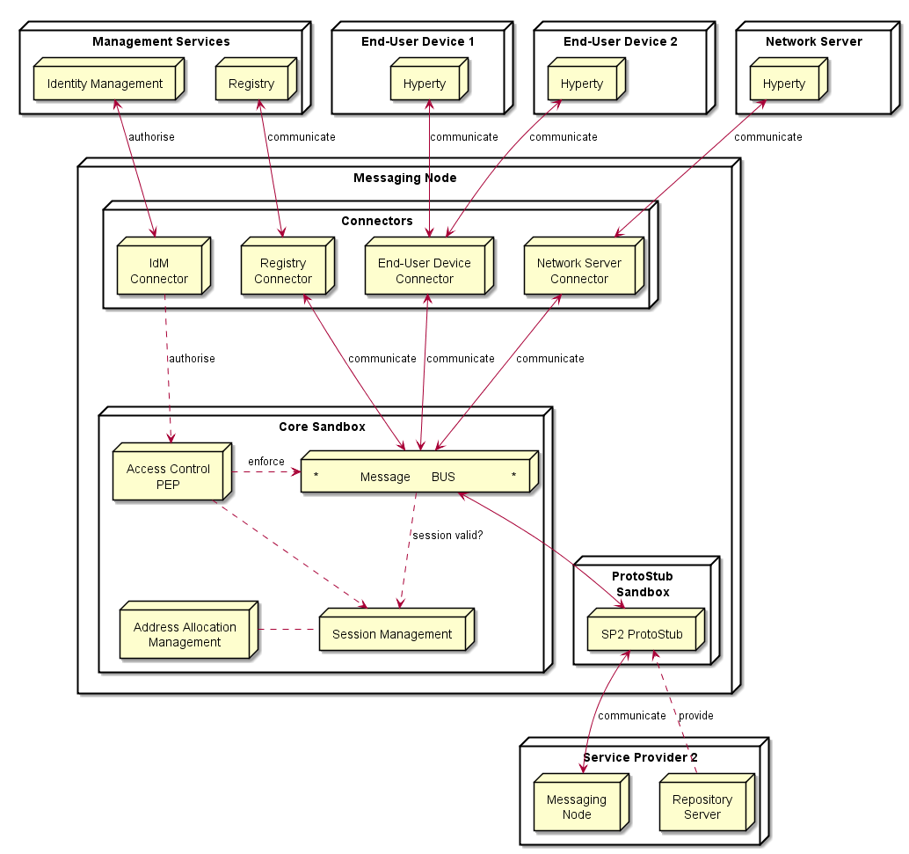

## Messaging Node Architecture

Below, it is depicted a functional architecture of the Messaging Node:

<!--
@startuml "Messaging_Node_Architecture.png"

node "Management Services" as Man1 {
	node "Registry" as Server1
	node "Identity Management" as IdM1

}

node "Service Provider 2" as SP2 {
	node "Messaging\nNode" as Msg2
	node "Repository\nServer" as Repo2
}

node "End-User Device 1" as User1 {
	node "Hyperty" as H1
}

node "End-User Device 2" as User2 {
	node "Hyperty" as H2
}

node "Network Server" as Net {
	node "Hyperty" as H3
}

node "Messaging Node" as msg {

 node "ProtoStub\nSandbox" as Proto1Sand {

	 node "SP2 ProtoStub" as Proto1
 }

node "Connectors" as Conn {
	node "IdM\nConnector" as ConnIdM
	node "Registry\nConnector" as ConnMan
	node "End-User Device\nConnector" as ConnUser
	node "Network Server\nConnector" as ConnNet
}

node "Core Sandbox" as core {

 node "*            Message      BUS                *" as Bus 

 node "Access Control\nPEP" as BusPEP

 node "Session Management" as Reg

 node "Address Allocation\nManagement" as ID

 }

Repo2 ..down-> Proto1: provide

Msg2 <-left-> Proto1 : communicate

 Bus <-right-> Proto1

 BusPEP ..right-> Bus : enforce

 ConnIdM ..down-> BusPEP : authorise

 BusPEP .down-> Reg

 Reg .left. ID

 Reg <-up. Bus: session valid?

 ConnIdM <-up-> IdM1 : authorise 

 Bus <-up-> ConnUser : communicate 
 ConnUser <-up-> H1 : communicate 

 ConnUser <-up-> H2 : communicate 

 Bus <-up-> ConnNet : communicate 
 ConnNet <-up-> H3 : communicate 

 Bus <-up-> ConnMan : communicate 
 ConnMan <-up-> Server1 : communicate
 	}

@enduml
-->

The Messaging Node is comprised by three main types of functionalities:

The Core Functionalities, Connectors and Protocol Stubs.

### Core Functionalities

#### Message BUS

Routes messages to internal Messaging Node components and external elements by using Connectors or Protocol Stubs. It supports different communication patterns including publish/subscribe communication.

#### Access Control

Message Routing including pub/sub Subscriptions are subject to Access Control in cooperation with authentication and authorisation provided by Identity Management functionalities.

#### Session Management

Session Management functionalities are used to control messaging connections to service provider back-end services. For example, when user turns-on the device and connects to its domain, providing credentials as required by Identity Management functionalities. 
In general, each message should contain a valid token that was generated when the used connected to the Messaging Node. It also manages the registry of protocol stubs and connectors supported by the Messaging Nodes to support the routing of messages to these components.

#### Address Allocation Management

Manages allocation of messaging addresses to Hyperty Instances in cooperation with Session Management when users connect to the domain. 

It also manages the allocation of messaging addresses to foreign Hyperty Instances i.e. Hyperty Instances that are provided from external domains but that use the protofly concept to interact with Hyperty Instances served by this Messaging Node. 

### Protocol Stub

In special situations eg when the download of external software (protocol stubs) into end-user devices is not allowed, it should be possible to have interoperability between Messaging Nodes from different domains by using the protofly concept.

Thus, a Protocol Stack to be used to communicate with another Messaging Node can be deployed.

### Connectors

Connectors implements protocol stacks used to interoperate with external elements from the domains, including:

* IdM Connector to interact with remote Identity Management functionalities

* Registry Connector to interact with remote Registry functionalities

* End-User Device Connector to interact with Hyperty Instances running in the end-user device

* Network Server Connector to interact with Hyperty Instances running in a Network Server

