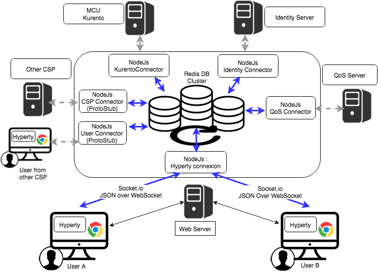
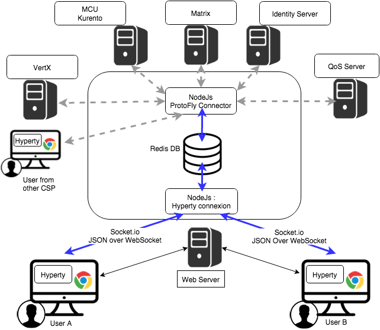
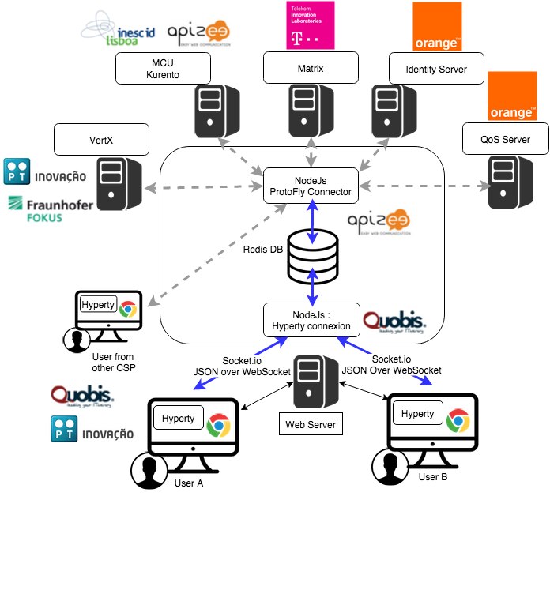

## NodeJs based Messaging Node Specification

*For each [functional block](msg-node-architecture.md) identify existing nodeJs modules that can be either reused or extended. If extensions are needed they should be specificied by designing apis to be implemented*

### Core Functionalities

This section attempts to match the functional blocks of the Message Node architecture to features and functional blocks of the nodeJs and Redis architecture.

#### Message BUS

The message bus can be implemented with Redis. http://redis.io

Redis is an open source (BSD licensed), in-memory data structure store, used as database, cache and message broker. It supports data structures such as strings, hashes, lists, sets, sorted sets with range queries, bitmaps, hyperloglogs and geospatial indexes with radius queries. Redis has built-in replication, Lua scripting, LRU eviction, transactions and different levels of on-disk persistence, and provides high availability via Redis Sentinel and automatic partitioning with Redis Cluster.

##### Usage of Redis with NodeJs

Redis integrate a PUB/SUB mecahnism : http://redis.io/topics/pubsub

SUBSCRIBE, UNSUBSCRIBE and PUBLISH implement the Publish/Subscribe messaging paradigm where (citing Wikipedia) senders (publishers) are not programmed to send their messages to specific receivers (subscribers). Rather, published messages are characterized into channels, without knowledge of what (if any) subscribers there may be. Subscribers express interest in one or more channels, and only receive messages that are of interest, without knowledge of what (if any) publishers there are. This decoupling of publishers and subscribers can allow for greater scalability and a more dynamic network topology.

Redis can be used to add scalability/redundancy to the messaging node. This Pub/Sub mechanism is simple to use and It can also facilitate the development and the integration of new connectors 

#### Access Control

#### Session Management

#### Address Allocation Management

#### Protocol Stub

#### Connectors

### NodeJs implementation architecture 

Here is decription of the architecure with Redis :

      

Communication between Users and NodeJs can be managed by socket.io

Communication between NodeJs and Redis can be managed by a NodesJs Redis client module : https://github.com/NodeRedis/node_redis

Communication between the differents NodeJs instance can be managed by the PUB/SUB mechanism of Redis. : http://redis.io/topics/pubsub

Redis instance can be a single instance or a Redis cluster.

Goal will then to mutualize connectors by using the protoStub/protoFly mechanism : this will add flexibility to connect other GWs, CSP ...

-------------------------

## Node.js Specification

### Core Functionalities
* Main objective of core func. is to authorize, filter and process messages. Messages are JSON objects that should have 2 blocks, HEADER and DATA, and are processed from different components of core.
* Outbound messages should be processed in a Pub/Sub system. If message DATA blocks are for CRUD operations, there should be a Pub/Sub protocol for object/model subscriptions, where should this be processed? The address scheme of t

TO BE COMPLETED

#### Low level connection management
Socket.io is a popular Node.js library to handle connections at application level. It can use Websocket and it falls back to HTTP automatically if WS connectivity is not possible.

#### Session Management
Events/messages for OPEN and CLOSE received by Socket.io should be intercepted by this component. A session instance is linked to a connection resource (WebSocket, SockJS) if authorized. Every message header is intercepted, session token is verified and if exist, a "user" or other identification URL is replaced in HEADER. The JSON object is forwarded to "Access Control" component.

TO BE COMPLETED

<comment> We have to discuss with our dev team it sth can be re-used to implement the session management or we have to implement it</comment>

#### Address Allocation Management
This is not a Pipeline component (it doesn't process messages), but it's used by the "Session Management" to allocate Hyperty identification URL's that will be linked to a Session when the Hyperty is connected. This will be used to translate Hyperty an URL address into the correspondent Connector Resource.

#### Access Control
This component is able to analyze HEADER (identification URL from "Session Management") and DATA blocks and decide if the message should be forwarded to the "Message Bus" or denied. There is a possibility to add a rule engine in this step, but it's not specified for now, what kind of rule engine.

#### Message BUS
Main objective of the MB is to process the DATA block, that contains information of the protocol, CRUD operation or other defined information. Vertx EventBus can be used directly for the Message Bus component. Important headers of the original JSON (like the identification URL) must be forwarded to io.vertx.core.eventbus.Message.headers() map.
For the Message Bus we could use some RabbitMQ by using Rabbit.js node library.

TO BE COMPLETED - VertX ???

### Protocol Stub Sandbox

TO BE COMPLETED

<comment>
We understand that we must have a Protocol Stub Sandbox to be able to interact to other Messaging Servers and the protocol stub will be retrieved from repository servers.
The messaging server which wants to interact with another one must download the Protocol Stub from the Repository and then it will be able to exchange messages.
I guess this is doable in Node.js, but I have to check with our Dev team what's the best way to implement this in Node.js.
</comment>

### Connectors

These connectors could be ad-hoc developments in Node.js, receiving messages from the session management layer.

#### End User Device Connector
The aim of this Connector is to enable interaction with Hyperty instances running in the end-user device. 
This component will need to interact somehow with the Protocol Stub sandbox to achieve this, since the communication protocol will not be standardized. 
The Protocol Stub should expose a common API which will be interacted from the connector. 

TO BE COMPLETED

<comment>This has been already addressed in the WONDER project so we need to check with Paulo the approach they followed</comment>  

#####LWM2M library
There is an available [LWM2M/COAP library for Node.js](https://github.com/telefonicaid/lwm2m-node-lib) which may be helpful to implement a COAP/interface for constrained devices along with other interfaces for the rest of devices.   

#### Network Server Connector
The aim of this Connector is to enable interaction with Hyperty instances running in a network server. This component will need to interact somehow with the Protocol Stub sandbox to achieve this, since the communication protocol will not be standardized. It will need to implement a simple protocol for sending and receiving requests. In itself it is not responsible for processing communication requests, that is left to the protocol stack. It merely forwards messages to and from the Network server.

#### Registry Connector
The Registry provides an interface for registration and deregistration of Hyperty instances, as well as for keeping the published information up to date. For each Hyperty instance, the Registry stores data (hyperty location, type, description, start-time, presence information of user) that enables other applications to contact it. 
The implementation of the Registry service is thought to be basically a distributed database. 
It will provide service interfaces for CRUD operations to allow users to retrieve data for a given GraphID, publish (i.e. create, update, and delete) their own information on the ring. To verify authenticity and integrity of the published data, digital signatures will be applied. The Connector will exposed the available interfaces of the Registry Services to users of managing Hyperty instances.   

#### IdM Connector
This Connector is to provide functionalities for interacting with the remote Identity Management Functionailities. 
Node.js can easily interact with OAuth servers in order to authenticate and authorize users.

It this is for authentication purpose the authentication agqinst the IdP has to be done at the begining. 
If the CRUD operations have to be authorized on a per identity basis (e.g. user A, correctly authenticated, is only allowed to do 'RU' over a Data Objet) we should get 

### Node Sandbox framework

[Node-sandbox](https://www.npmjs.com/package/node-sandbox) allows to run untrusted code outside of the main node process. The code can be interfaced with code running in the sandbox via RPC (or any library that works over the node Stream API). 

### Usage of Redis with NodeJs

Redis can be used to add scalability/redundancy to the messaging node.

This is simple to use Redis Pub/Sub and easy to add new connectors.

It can also facilitate the development and the integration of new connectors 

**Architecture description :**
      
      

Communication between Users and NodeJs can be managed by socket.io

Communication between NodeJs and Redis can be managed by a NodesJs Redis client module : https://github.com/NodeRedis/node_redis

Communication between the differents NodeJs instance can be managed by the PUB/SUB mechanism of Redis. : http://redis.io/topics/pubsub

Redis instance can be a single instance or a Redis cluster.

Goal will then to mutualize connectors by using the protoStub/protoFly mechanism : this will add flexibility to connect other GWs, CSP ...

**Architecture : Integration in ReThink :**

Following architecture shows the target integration with the different components of the ReThink projet : 
      

**Architecture : Integration in ReThink with Actors:**

Following architecture shows the actors in the architecture to unsderstand the decomposition of work to be done and the interaction with other partners :
      
  

