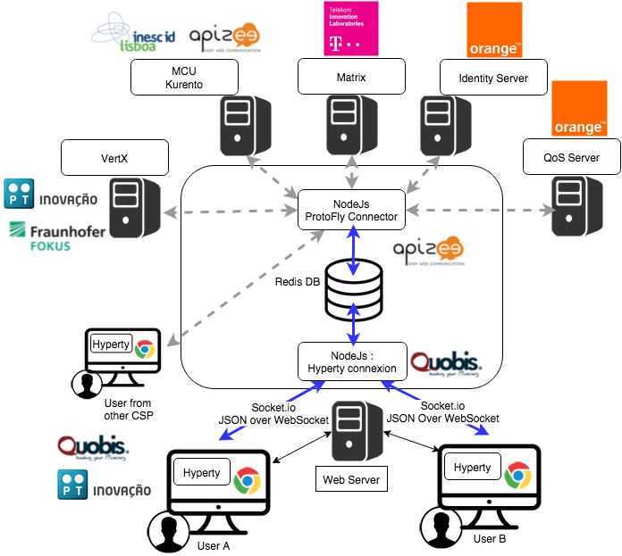

## NodeJs based Messaging Node Specification

For each [functional block](msg-node-architecture.md) the WP3 team has identified existing nodeJs modules which can be either reused or extended.

### Core Functionalities

This section attempts to match the functional blocks of the Message Node architecture to features and functional blocks of the nodeJs and Redis architecture.

#### Message BUS

The message bus can be implemented with Redis. http://redis.io

Redis is an open source (BSD licensed), in-memory data structure store, used as database, cache and message broker. It supports data structures such as strings, hashes, lists, sets, sorted sets with range queries, bitmaps, hyperloglogs and geospatial indexes with radius queries. Redis has built-in replication, Lua scripting, LRU eviction, transactions and different levels of on-disk persistence, and provides high availability via Redis Sentinel and automatic partitioning with Redis Cluster.

##### Usage of Redis with NodeJs

Redis integrate a PUB/SUB mechanism : http://redis.io/topics/pubsub

SUBSCRIBE, UNSUBSCRIBE and PUBLISH implement the Publish/Subscribe messaging paradigm where (citing Wikipedia) senders (publishers) are not programmed to send their messages to specific receivers (subscribers). Rather, published messages are characterized into channels, without knowledge of what (if any) subscribers there may be. Subscribers express interest in one or more channels, and only receive messages that are of interest, without knowledge of what (if any) publishers there are. This decoupling of publishers and subscribers can allow for greater scalability and a more dynamic network topology.

Redis can be used to add scalability/redundancy to the messaging node as the different components of the architecture can easily be splitted on different servers.
This Pub/Sub mechanism is simple to use and It can also facilitate the development and the integration of new connectors 

Communication between NodeJs and Redis can be managed by a NodesJs Redis client module : https://github.com/NodeRedis/node_redis

Redis instance can be a single instance or a Redis cluster.

#### Access Control

User connection to NodeJs connectors can be authentified on the NodeJs module.
Socket.io integrate a way to authenticate incoming request, authenication component will have to be develop on NodeJs connectors.

This component is able to analyze HEADER (identification URL from "Session Management") and DATA blocks and decide if the message should be forwarded to the "Message Bus" or denied.

PassportJs, which is an intesreting middleware, that could enable us to add third party authentication should be used : 
http://passportjs.org/

An authentication can also be done between NodeJs and Redis.

#### Session Management

For a complete session management on NodeJs, it will be interesting to use express which is a Web framework for NodeJs :
http://expressjs.com/

#### Address Allocation Management

This component will have to be developped on a NodeJs server

#### Protocol Stub & Connectors

Connectors will be NodeJs process to be developped.

Goal will be to mutualize connectors by using the protoStub/protoFly mechanism : this will add flexibility to connect other GWs, CSP ...

##### IdM Connector

This Connector is to provide functionalities for interacting with the remote Identity Management Functionailities. 
Node.js can easily interact with OAuth servers in order to authenticate and authorize users.

It this is for authentication purpose the authentication agqinst the IdP has to be done at the begining. 
If the CRUD operations have to be authorized on a per identity basis (e.g. user A, correctly authenticated, is only allowed to do 'RU' over a Data Objet) we should get 

##### Registry Connector

The Registry provides an interface for registration and deregistration of Hyperty instances, as well as for keeping the published information up to date. For each Hyperty instance, the Registry stores data (hyperty location, type, description, start-time, presence information of user) that enables other applications to contact it. 
The implementation of the Registry service is thought to be basically a distributed database. 
It will provide service interfaces for CRUD operations to allow users to retrieve data for a given GraphID, publish (i.e. create, update, and delete) their own information on the ring. To verify authenticity and integrity of the published data, digital signatures will be applied. The Connector will exposed the available interfaces of the Registry Services to users of managing Hyperty instances. 

##### End-User Device Connector

Communication between Users and NodeJs can be managed by socket.io
Socket.io is a popular Node.js library to handle connections at application level. It can use Websocket and it falls back to HTTP automatically if WS connectivity is not possible.

##### Network Server Connector

The aim of this Connector is to enable interaction with Hyperty instances running in a network server. This component will need to interact somehow with the Protocol Stub sandbox to achieve this, since the communication protocol will not be standardized. It will need to implement a simple protocol for sending and receiving requests. In itself it is not responsible for processing communication requests, that is left to the protocol stack. It merely forwards messages to and from the Network server.

##### Node Sandbox framework

[Node-sandbox](https://www.npmjs.com/package/node-sandbox) allows to run untrusted code outside of the main node process. The code can be interfaced with code running in the sandbox via RPC (or any library that works over the node Stream API). 

### NodeJs implementation architecture 

**Architecture : NodeJs and Redis :**

Here is decription of the architecure with Redis :

**Architecture : Integration in ReThink :**

Following architecture shows the target integration with the different components of the ReThink projet : 
      

**Architecture : Integration in ReThink with Actors:**

Following architecture shows the actors in the architecture to unsderstand the decomposition of work to be done and the interaction with other partners :
      
  

