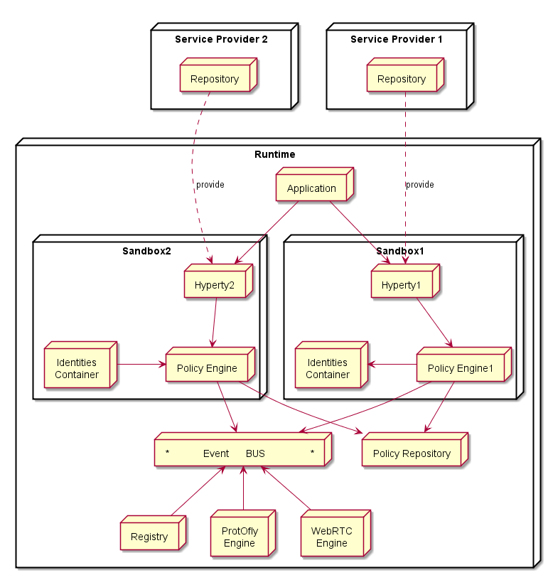

## Runtime Architecture

<!--
@startuml "Runtime_Architecture.png"

 node "Application" as App 

 node "Hyperty1" as H1

 node "Hyperty2" as H2

node "Runtime" as rt {

 node "*            Event      BUS                *" as Bus

 node "Policy\nEngine" as PEP

 node "Registry" as Reg

 node "ProtOfly\nEngine" as Prot

 node "WebRTC\nEngine" as WRTC

 node "Identities\nContainer" as Id

 App -down-> H1

 App -down-> H2

 H1 -down-> Bus

 H2 -down-> Bus

 PEP -right-> Bus

 Reg -up-> Bus

 Prot -up-> Bus

 WRTC -up-> Bus

 Id -[hidden]up-> Bus

 Id -right- Prot

 Id -left- Reg

	}

@enduml
-->

### Event BUS

Supports local message communication between Hyperties and also with other  Runtime features in a loosely coupled manner. In case local Hyperty is communicating with remote Hyperty it uses the Protofly engine.

### Registry

Local Runtime Hyperty registry where Hyperty local addresses are registered and discoverable by other local Hyperties. The Runtime Registry should ensure synchronisation with Remote Domain Registry (to be provided by WP4)

### Policy Engine

Intercepts Hyperty messages exchanged via the Event Bus and applies valid Policies on it e.g. authorisation policies. Policies are downloaded and stored locally when associated Hyperties are deployed. The possibility to consult Policies stored remotely should also be investigated.

### Identities Containers

Contains Tokens that associates Hyperties with (Tangible / Real ) Entities

### Protocol on the Fly Engine

Implements the Protocol on the Fly and codec on the fly concept to interoperate with remote Hyperties.

### WebRTC Media Engine

Provides the support for Stream communication betweeb Hyperties according to WebRTC Standards.

## New Arch design

Main differences as a result of [this](https://github.com/reTHINK-project/core-framework/issues/41) discussion:
* one sandbox per Hyperty Domain that includes the Policy Engine to be used for the sandbox domain
* Hyperty instances communicates with event bus through Policy Engine
* Policies are stored in Policies Repository, outside Sandbox domain in a separated core runtime sandbox

**question:** should protocol on the fly be included inside the domain sandbox?

<!--
@startuml "Runtime_Architecture_new.png"

node "Service Provider 1" as SP1 {
	node Repository as Repo1
}

node "Service Provider 2" as SP2 {
	node Repository as Repo2
}

node "Runtime" as rt {
 node "Application" as App 

 SP1 -[hidden]down- App
 SP2 -[hidden]right- App

 node "Sandbox1" as Sand1 {

 node "Hyperty1" as H1

 node "Identities\nContainer" as ID1

 node "Policy Engine\nFirewall" as PEP1

  H1 -down-> PEP1

  ID1 <-right- PEP1
 }

node "Sandbox2" as Sand2 {

 node "Hyperty2" as H2

 node "Policy Engine\nFirewall" as PEP2

 node "Identities\nContainer" as ID2

  H2 -down-> PEP2

  ID2 -right-> PEP2

 }

 App -down-> H1

 App -down-> H2

Repo1 ..down-> H1: provide

Repo2 ..down-> H2: provide

node "Core Sandbox" as core {

 node "*            Message      BUS                *" as Bus

 node "Registry" as Reg

 node "ProtOfly\nEngine" as Prot

 node "WebRTC\nEngine" as WRTC

 node "Policy Repository" as Rep

 PEP1 -down-> Bus

 PEP2 -down-> Bus

 Rep <-up- PEP1

 Rep <-up- PEP2

 Reg -up-> Bus

 Prot -up-> Bus

 WRTC -up-> Bus

	}

@enduml
-->

### Analysis on the natively support of Functionalities by the Runtime

Since all these functionalities will be needed by all Hyperties they should be part of the Runtime.

However, for security reasons (other reasons?) we analyse below how important it is to have them natively support by the Runtime. We analyse possible attacks and the impact they might have.

## Runtime Types

The following runtime types according to devices types are considered:

1. Devices featuring Browsers like PCs, Smartphones and Tablets
1. Native Apps featuring some GUI deployed in End-user Devices like PCs, Smartphones and Tablets
1. IoT/M2M Gateways that aggregates sensors and atuators using different IoT/M2M networking technologies
1. Network Server Virtual Machine used eg Media Server, Media Gateway, App Server, etc
1. 

For each of these runtime types we should analyse the best strategy to support Hyperty Runtime functionalities identified above.

Possible Strategies:
* Browser Extensions
* Docker+NodeJs
* Docker+JDK8
* NodeJs
* JDK8
* Javascript shim layer to be used in Browsers without extensions ie files implementing the Shim layer would be downloaded with the Hyperty

